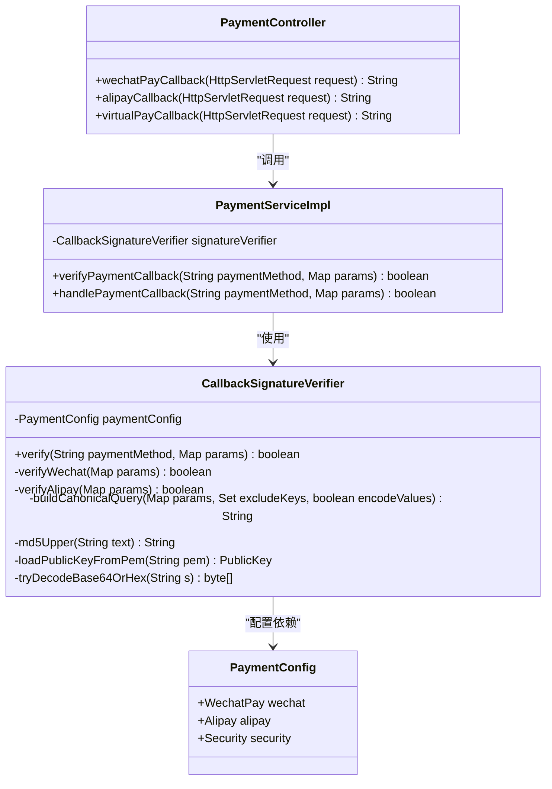
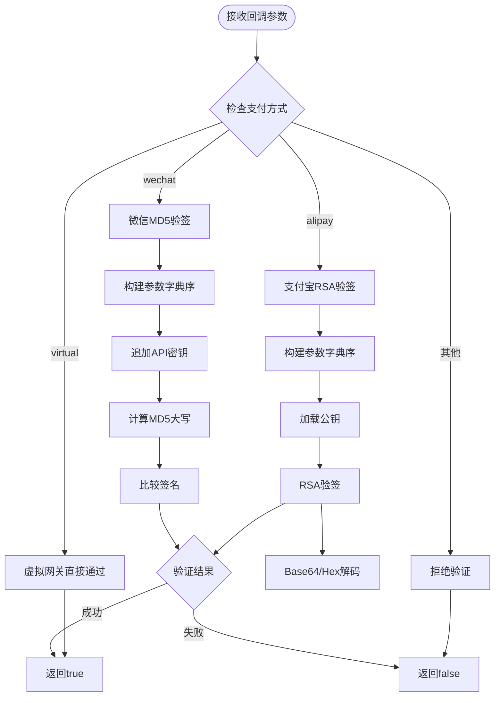
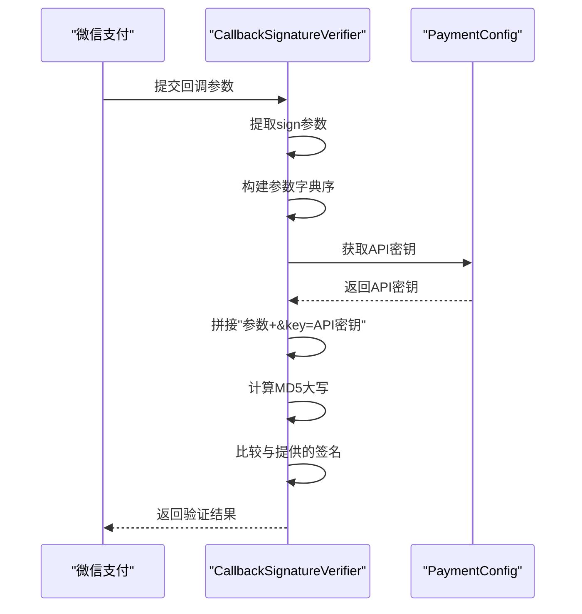
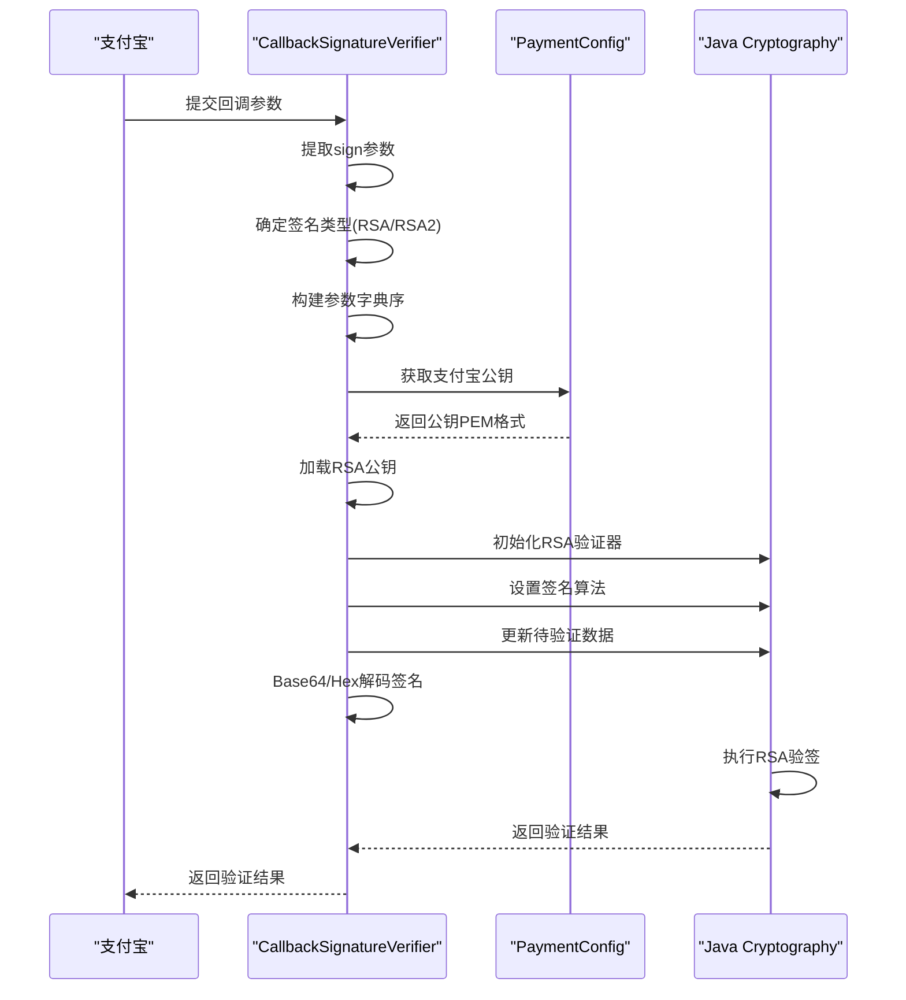
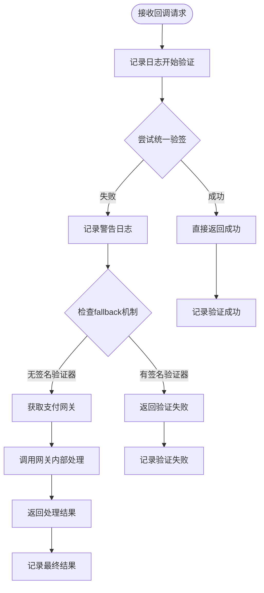
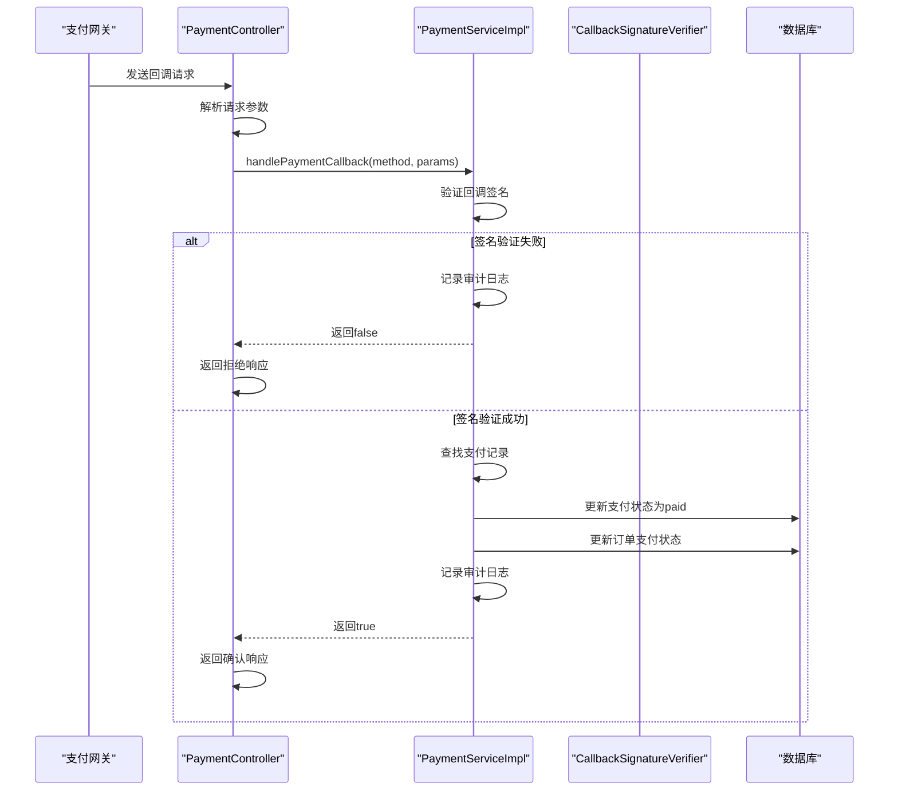

# 支付安全验证机制

<cite>
**本文档中引用的文件**
- [CallbackSignatureVerifier.java](file://backend/src/main/java/com/carwash/service/payment/security/CallbackSignatureVerifier.java)
- [PaymentServiceImpl.java](file://backend/src/main/java/com/carwash/service/impl/PaymentServiceImpl.java)
- [CallbackSignatureVerifierTest.java](file://backend/src/test/java/com/carwash/service/payment/security/CallbackSignatureVerifierTest.java)
- [PaymentController.java](file://backend/src/main/java/com/carwash/controller/PaymentController.java)
- [AlipayGateway.java](file://backend/src/main/java/com/carwash/service/payment/AlipayGateway.java)
- [WechatPayGateway.java](file://backend/src/main/java/com/carwash/service/payment/WechatPayGateway.java)
- [PaymentConfig.java](file://backend/src/main/java/com/carwash/config/PaymentConfig.java)
- [payment-gateway.md](file://backend/docs/payment-gateway.md)
</cite>

## 目录
1. [概述](#概述)
2. [核心组件架构](#核心组件架构)
3. [CallbackSignatureVerifier详解](#callbacksignatureverifier详解)
4. [支付渠道验签算法](#支付渠道验签算法)
5. [PaymentServiceImpl集成机制](#paymentserviceimpl集成机制)
6. [回调处理流程](#回调处理流程)
7. [常见问题与调试](#常见问题与调试)
8. [单元测试分析](#单元测试分析)
9. [最佳实践建议](#最佳实践建议)

## 概述

支付安全验证机制是汽车洗车服务平台的核心安全组件，负责统一处理来自不同支付渠道的回调签名验证。该机制通过CallbackSignatureVerifier组件实现，支持支付宝（RSA2/RSA）、微信支付（MD5）和虚拟网关三种支付方式的签名验证，确保支付回调的真实性和完整性。

### 主要特性

- **统一验签接口**：提供统一的签名验证API，支持多种支付渠道
- **多算法支持**：兼容RSA2、RSA、MD5等多种签名算法
- **安全策略**：验证失败时拒绝回调请求，防止恶意攻击
- **灵活配置**：支持动态配置各支付渠道的密钥和参数

## 核心组件架构

**图表来源**
- [CallbackSignatureVerifier.java](file://backend/src/main/java/com/carwash/service/payment/security/CallbackSignatureVerifier.java#L22-L170)
- [PaymentServiceImpl.java](file://backend/src/main/java/com/carwash/service/impl/PaymentServiceImpl.java#L66-L70)
- [PaymentController.java](file://backend/src/main/java/com/carwash/controller/PaymentController.java#L38-L40)

## CallbackSignatureVerifier详解

### 组件设计原理

CallbackSignatureVerifier是一个专门负责支付回调签名验证的组件，采用策略模式设计，根据不同支付渠道采用不同的验签算法。

**图表来源**
- [CallbackSignatureVerifier.java](file://backend/src/main/java/com/carwash/service/payment/security/CallbackSignatureVerifier.java#L35-L46)

### 核心验证方法

#### 1. 统一验证入口

验证器提供统一的验证接口，根据支付方式自动选择对应的验签算法：

**节来源**
- [CallbackSignatureVerifier.java](file://backend/src/main/java/com/carwash/service/payment/security/CallbackSignatureVerifier.java#L35-L46)

#### 2. 参数构建算法

所有支付渠道都采用参数字典序构建签名内容，这是业界通用的安全实践：

**节来源**
- [CallbackSignatureVerifier.java](file://backend/src/main/java/com/carwash/service/payment/security/CallbackSignatureVerifier.java#L99-L115)

#### 3. 辅助工具方法

- **安全获取参数**：避免空指针异常
- **URL编码处理**：确保特殊字符正确处理
- **MD5哈希计算**：标准的MD5实现
- **公钥加载**：从PEM格式加载RSA公钥
- **签名解码**：支持Base64和十六进制两种格式

**节来源**
- [CallbackSignatureVerifier.java](file://backend/src/main/java/com/carwash/service/payment/security/CallbackSignatureVerifier.java#L117-L169)

## 支付渠道验签算法

### 微信支付（MD5算法）

微信支付采用简单的MD5签名算法，其验签过程如下：

**图表来源**
- [CallbackSignatureVerifier.java](file://backend/src/main/java/com/carwash/service/payment/security/CallbackSignatureVerifier.java#L52-L61)

#### 微信验签关键步骤

1. **参数排序**：除sign外的所有参数按字典序排列
2. **密钥追加**：在参数末尾追加`&key=API密钥`
3. **MD5计算**：对最终字符串计算MD5并转为大写
4. **签名比较**：与回调提供的sign参数进行严格比较

**节来源**
- [CallbackSignatureVerifier.java](file://backend/src/main/java/com/carwash/service/payment/security/CallbackSignatureVerifier.java#L52-L61)

### 支付宝（RSA算法）

支付宝采用更复杂的RSA签名算法，支持RSA和RSA2两种变体：

**图表来源**
- [CallbackSignatureVerifier.java](file://backend/src/main/java/com/carwash/service/payment/security/CallbackSignatureVerifier.java#L67-L94)

#### 支付宝验签关键步骤

1. **签名类型确定**：优先使用参数中的sign_type，否则使用配置的默认值
2. **参数构建**：排除sign和sign_type，按字典序构建参数字符串
3. **公钥加载**：从PEM格式提取并加载RSA公钥
4. **算法选择**：根据签名类型选择SHA256withRSA或SHA1withRSA
5. **签名解码**：支持Base64和十六进制两种编码格式

**节来源**
- [CallbackSignatureVerifier.java](file://backend/src/main/java/com/carwash/service/payment/security/CallbackSignatureVerifier.java#L67-L94)

### 虚拟网关（开发测试）

虚拟网关专为开发和测试环境设计，采用最宽松的验证策略：

**节来源**
- [CallbackSignatureVerifier.java](file://backend/src/main/java/com/carwash/service/payment/security/CallbackSignatureVerifier.java#L42-L43)

## PaymentServiceImpl集成机制

### 验签集成策略

PaymentServiceImpl通过verifyPaymentCallback方法集成签名验证，采用双重保障机制：

**图表来源**
- [PaymentServiceImpl.java](file://backend/src/main/java/com/carwash/service/impl/PaymentServiceImpl.java#L358-L379)

### 安全策略实现

当签名验证失败时，系统采取严格的拒绝策略：

**节来源**
- [PaymentServiceImpl.java](file://backend/src/main/java/com/carwash/service/impl/PaymentServiceImpl.java#L362-L369)

## 回调处理流程

### 完整回调处理链路

**图表来源**
- [PaymentController.java](file://backend/src/main/java/com/carwash/controller/PaymentController.java#L134-L147)
- [PaymentServiceImpl.java](file://backend/src/main/java/com/carwash/service/impl/PaymentServiceImpl.java#L172-L229)

### 回调端点映射

系统为每种支付方式提供专门的回调端点：

| 支付方式 | 回调端点 | 响应格式 |
|---------|---------|---------|
| 微信支付 | `/api/payment/callback/wechat` | XML格式（SUCCESS/FAIL） |
| 支付宝 | `/api/payment/callback/alipay` | 文本格式（success/fail） |
| 虚拟网关 | `/api/payment/callback/virtual` | 文本格式（ok/fail） |

**节来源**
- [PaymentController.java](file://backend/src/main/java/com/carwash/controller/PaymentController.java#L132-L180)

## 常见问题与调试

### 验签失败的常见原因

#### 1. 参数顺序问题
- **问题描述**：参数未按字典序排列
- **解决方案**：确保所有参数按字母顺序排序
- **调试方法**：对比本地构建的签名字符串与回调提供的参数

#### 2. 字符编码问题
- **问题描述**：UTF-8编码不一致
- **解决方案**：统一使用UTF-8编码
- **调试方法**：检查参数值的编码方式

#### 3. 密钥配置错误
- **问题描述**：使用的密钥与支付网关不匹配
- **解决方案**：核对配置文件中的密钥设置
- **调试方法**：使用正确的密钥重新计算签名

#### 4. 签名格式问题
- **问题描述**：支付宝签名格式不正确
- **解决方案**：支持Base64和十六进制两种格式
- **调试方法**：检查签名的编码格式

### 调试方法

#### 1. 日志分析
系统提供了详细的日志记录，包括：
- 验签开始和结束时间
- 使用的支付方式和参数
- 验签结果和失败原因

#### 2. 参数对比
可以通过以下方式验证参数构建：
- 打印本地构建的签名字符串
- 对比回调提供的原始参数
- 检查参数过滤和排序逻辑

#### 3. 单元测试验证
利用现有的单元测试验证各个支付渠道的验签逻辑。

**节来源**
- [CallbackSignatureVerifierTest.java](file://backend/src/test/java/com/carwash/service/payment/security/CallbackSignatureVerifierTest.java#L22-L154)

## 单元测试分析

### 测试覆盖范围

CallbackSignatureVerifierTest提供了全面的单元测试，涵盖所有主要场景：

#### 1. 微信支付测试

**节来源**
- [CallbackSignatureVerifierTest.java](file://backend/src/test/java/com/carwash/service/payment/security/CallbackSignatureVerifierTest.java#L22-L60)

#### 2. 支付宝测试

**节来源**
- [CallbackSignatureVerifierTest.java](file://backend/src/test/java/com/carwash/service/payment/security/CallbackSignatureVerifierTest.java#L62-L96)

#### 3. 虚拟网关测试

**节来源**
- [CallbackSignatureVerifierTest.java](file://backend/src/test/java/com/carwash/service/payment/security/CallbackSignatureVerifierTest.java#L98-L104)

### 测试设计原则

1. **独立性**：每个测试用例都是独立的，不依赖外部状态
2. **完整性**：覆盖成功和失败的各种场景
3. **真实性**：使用真实的密钥对和参数构建
4. **可重复性**：测试结果应该是可重复的

**节来源**
- [CallbackSignatureVerifierTest.java](file://backend/src/test/java/com/carwash/service/payment/security/CallbackSignatureVerifierTest.java#L106-L154)

## 最佳实践建议

### 1. 配置管理
- **密钥轮换**：定期更换支付密钥
- **环境隔离**：开发、测试、生产环境使用不同的密钥
- **配置验证**：启动时验证配置的正确性

### 2. 安全防护
- **请求限流**：限制回调接口的访问频率
- **IP白名单**：只允许支付网关的IP地址访问回调接口
- **日志脱敏**：避免在日志中记录敏感信息

### 3. 监控告警
- **成功率监控**：监控回调验签的成功率
- **异常告警**：及时发现验签失败的情况
- **性能监控**：监控验签处理的响应时间

### 4. 开发调试
- **模拟环境**：使用虚拟网关进行开发和测试
- **参数验证**：在开发阶段验证参数的正确性
- **日志记录**：充分的日志记录有助于问题排查

### 5. 性能优化
- **缓存公钥**：缓存RSA公钥以提高验签性能
- **异步处理**：对于非关键路径的验签可以考虑异步处理
- **批量验证**：对于大量回调请求，考虑批量验证机制

通过以上支付安全验证机制的实现，系统能够有效防范支付回调攻击，确保支付数据的安全性和完整性。该机制的设计既考虑了安全性，也兼顾了易用性和可维护性，为整个支付系统的稳定运行提供了重要保障。