# 支付系统架构设计

<cite>
**本文档引用的文件**
- [PaymentService.java](file://backend/src/main/java/com/carwash/service/PaymentService.java)
- [PaymentServiceImpl.java](file://backend/src/main/java/com/carwash/service/impl/PaymentServiceImpl.java)
- [PaymentGateway.java](file://backend/src/main/java/com/carwash/service/payment/PaymentGateway.java)
- [PaymentGatewayFactory.java](file://backend/src/main/java/com/carwash/service/payment/PaymentGatewayFactory.java)
- [AlipayGateway.java](file://backend/src/main/java/com/carwash/service/payment/AlipayGateway.java)
- [WechatPayGateway.java](file://backend/src/main/java/com/carwash/service/payment/WechatPayGateway.java)
- [VirtualPaymentGateway.java](file://backend/src/main/java/com/carwash/service/payment/VirtualPaymentGateway.java)
- [CreditCardGateway.java](file://backend/src/main/java/com/carwash/service/payment/CreditCardGateway.java)
- [PaymentConfig.java](file://backend/src/main/java/com/carwash/config/PaymentConfig.java)
- [application-payment.yml](file://backend/src/main/resources/application-payment.yml)
- [PaymentRequest.java](file://backend/src/main/java/com/carwash/dto/PaymentRequest.java)
- [PaymentResponse.java](file://backend/src/main/java/com/carwash/dto/PaymentResponse.java)
- [PaymentController.java](file://backend/src/main/java/com/carwash/controller/PaymentController.java)
- [CallbackSignatureVerifier.java](file://backend/src/main/java/com/carwash/service/payment/security/CallbackSignatureVerifier.java)
</cite>

## 目录
1. [引言](#引言)
2. [系统架构概览](#系统架构概览)
3. [支付网关抽象层设计](#支付网关抽象层设计)
4. [工厂模式实现机制](#工厂模式实现机制)
5. [核心接口方法详解](#核心接口方法详解)
6. [支付服务实现](#支付服务实现)
7. [组件交互流程](#组件交互流程)
8. [扩展新支付方式](#扩展新支付方式)
9. [安全机制设计](#安全机制设计)
10. [总结](#总结)

## 引言

本文档详细阐述了汽车洗车服务预约系统中的支付系统架构设计，重点分析了支付网关抽象层（PaymentGateway接口）与工厂模式（PaymentGatewayFactory）的实现机制。该支付系统采用了高度模块化的架构设计，支持多种支付方式的统一接入，具备良好的扩展性和维护性。

## 系统架构概览

支付系统采用分层架构设计，主要包含以下核心层次：

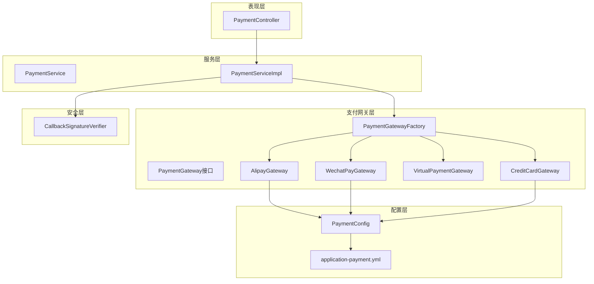

**图表来源**
- [PaymentController.java](file://backend/src/main/java/com/carwash/controller/PaymentController.java#L1-L50)
- [PaymentServiceImpl.java](file://backend/src/main/java/com/carwash/service/impl/PaymentServiceImpl.java#L1-L100)
- [PaymentGatewayFactory.java](file://backend/src/main/java/com/carwash/service/payment/PaymentGatewayFactory.java#L1-L55)

## 支付网关抽象层设计

### PaymentGateway接口定义

PaymentGateway接口作为支付系统的核心抽象层，定义了统一的支付操作规范：

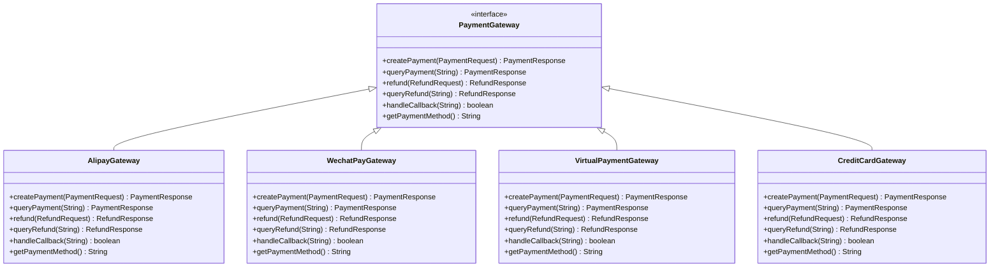

**图表来源**
- [PaymentGateway.java](file://backend/src/main/java/com/carwash/service/payment/PaymentGateway.java#L12-L54)
- [AlipayGateway.java](file://backend/src/main/java/com/carwash/service/payment/AlipayGateway.java#L25-L317)
- [WechatPayGateway.java](file://backend/src/main/java/com/carwash/service/payment/WechatPayGateway.java#L25-L251)
- [VirtualPaymentGateway.java](file://backend/src/main/java/com/carwash/service/payment/VirtualPaymentGateway.java#L19-L92)
- [CreditCardGateway.java](file://backend/src/main/java/com/carwash/service/payment/CreditCardGateway.java#L29-L200)

### 接口设计理念

PaymentGateway接口的设计遵循以下核心原则：

1. **统一性原则**：所有支付方式都实现相同的接口方法
2. **一致性原则**：相同的操作在不同支付方式中具有相似的行为
3. **扩展性原则**：新支付方式只需实现接口即可无缝集成
4. **安全性原则**：内置签名验证和回调处理机制

**章节来源**
- [PaymentGateway.java](file://backend/src/main/java/com/carwash/service/payment/PaymentGateway.java#L1-L54)

## 工厂模式实现机制

### PaymentGatewayFactory设计

PaymentGatewayFactory采用Spring的依赖注入机制，实现了自动注册所有支付网关实现的功能：

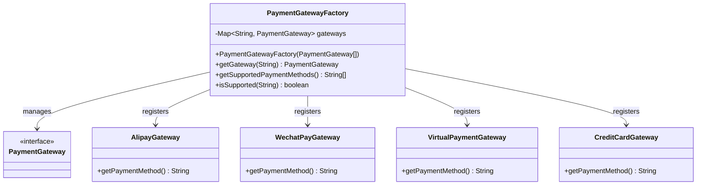

**图表来源**
- [PaymentGatewayFactory.java](file://backend/src/main/java/com/carwash/service/payment/PaymentGatewayFactory.java#L14-L55)

### Spring自动注册机制

工厂类通过构造函数注入所有实现了PaymentGateway接口的Bean：

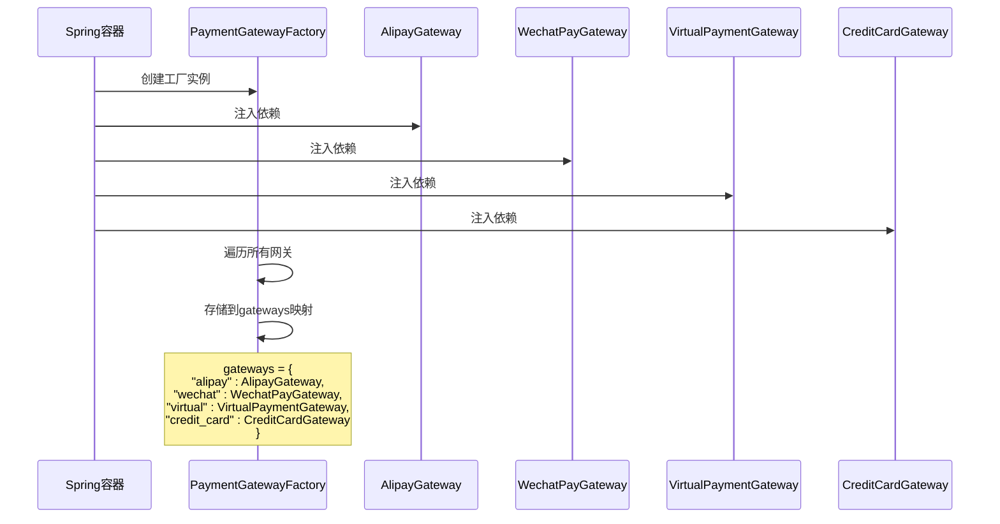

**图表来源**
- [PaymentGatewayFactory.java](file://backend/src/main/java/com/carwash/service/payment/PaymentGatewayFactory.java#L19-L24)

### 核心方法实现

#### getGateway方法
根据支付方式获取对应的支付网关实例，如果找不到对应网关则抛出异常。

#### isSupported方法
检查系统是否支持指定的支付方式，提供运行时验证能力。

#### getSupportedPaymentMethods方法
返回系统支持的所有支付方式列表，用于前端界面展示和API文档。

**章节来源**
- [PaymentGatewayFactory.java](file://backend/src/main/java/com/carwash/service/payment/PaymentGatewayFactory.java#L26-L55)

## 核心接口方法详解

### createPayment方法

createPayment方法负责创建支付订单，是支付流程的入口点：

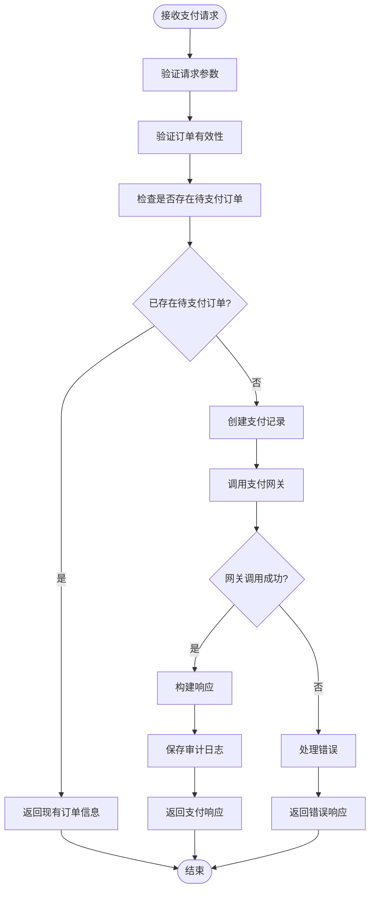

**图表来源**
- [PaymentServiceImpl.java](file://backend/src/main/java/com/carwash/service/impl/PaymentServiceImpl.java#L72-L146)

### queryPayment方法

queryPayment方法用于查询支付状态，支持主动查询和被动查询两种场景：

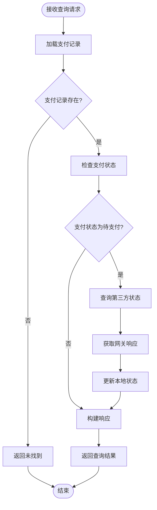

**图表来源**
- [PaymentServiceImpl.java](file://backend/src/main/java/com/carwash/service/impl/PaymentServiceImpl.java#L148-L169)

### refund方法

refund方法处理退款请求，包含金额验证和退款执行两个阶段：

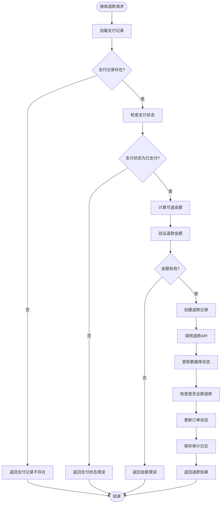

**图表来源**
- [PaymentServiceImpl.java](file://backend/src/main/java/com/carwash/service/impl/PaymentServiceImpl.java#L231-L309)

### handleCallback方法

handleCallback方法处理第三方支付平台的异步回调：

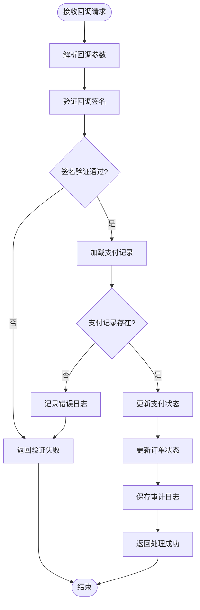

**图表来源**
- [PaymentServiceImpl.java](file://backend/src/main/java/com/carwash/service/impl/PaymentServiceImpl.java#L173-L229)

**章节来源**
- [PaymentServiceImpl.java](file://backend/src/main/java/com/carwash/service/impl/PaymentServiceImpl.java#L72-L309)

## 支付服务实现

### PaymentServiceImpl核心功能

PaymentServiceImpl作为支付服务的主要实现类，负责协调各个支付网关的工作：

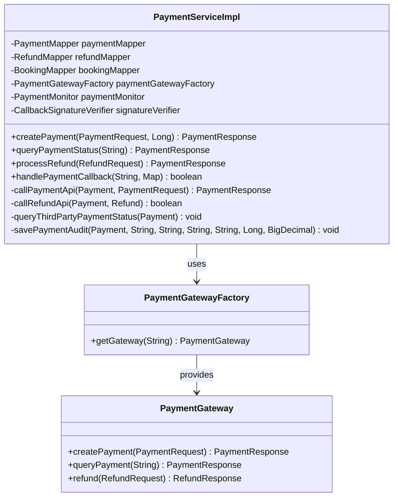

**图表来源**
- [PaymentServiceImpl.java](file://backend/src/main/java/com/carwash/service/impl/PaymentServiceImpl.java#L47-L70)

### 工厂调用流程

PaymentServiceImpl通过工厂获取具体网关并执行业务逻辑：

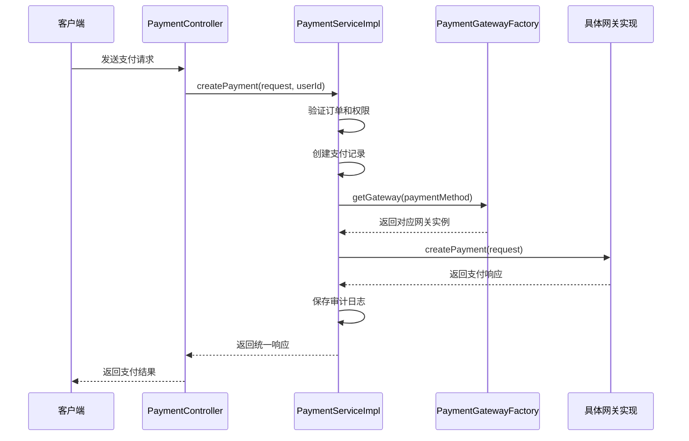

**图表来源**
- [PaymentServiceImpl.java](file://backend/src/main/java/com/carwash/service/impl/PaymentServiceImpl.java#L399-L407)
- [PaymentServiceImpl.java](file://backend/src/main/java/com/carwash/service/impl/PaymentServiceImpl.java#L420-L423)

**章节来源**
- [PaymentServiceImpl.java](file://backend/src/main/java/com/carwash/service/impl/PaymentServiceImpl.java#L47-L550)

## 组件交互流程

### 支付创建流程

支付创建是整个支付系统的核心流程，涉及多个组件的协作：

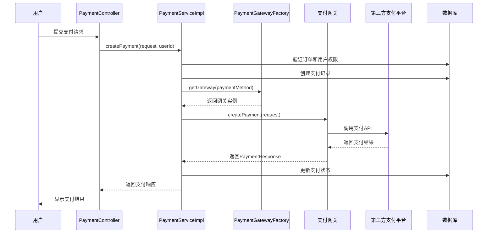

**图表来源**
- [PaymentController.java](file://backend/src/main/java/com/carwash/controller/PaymentController.java#L47-L58)
- [PaymentServiceImpl.java](file://backend/src/main/java/com/carwash/service/impl/PaymentServiceImpl.java#L72-L146)

### 支付回调处理流程

支付回调是确保支付状态一致性的关键环节：

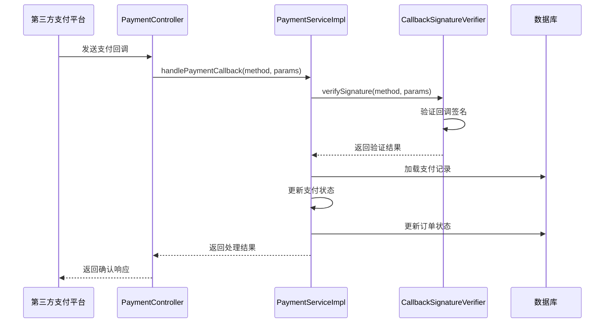

**图表来源**
- [PaymentController.java](file://backend/src/main/java/com/carwash/controller/PaymentController.java#L130-L148)
- [PaymentServiceImpl.java](file://backend/src/main/java/com/carwash/service/impl/PaymentServiceImpl.java#L173-L229)

**章节来源**
- [PaymentController.java](file://backend/src/main/java/com/carwash/controller/PaymentController.java#L47-L148)
- [PaymentServiceImpl.java](file://backend/src/main/java/com/carwash/service/impl/PaymentServiceImpl.java#L72-L229)

## 扩展新支付方式

### 开发规范

添加新的支付方式需要遵循以下开发规范：

1. **实现PaymentGateway接口**：确保新支付方式完全实现所有必需方法
2. **添加@Service注解**：让Spring自动发现和注册该实现
3. **提供getPaymentMethod方法**：返回唯一的支付方式标识
4. **配置支付参数**：在application-payment.yml中添加相应配置

### 新支付方式实现模板

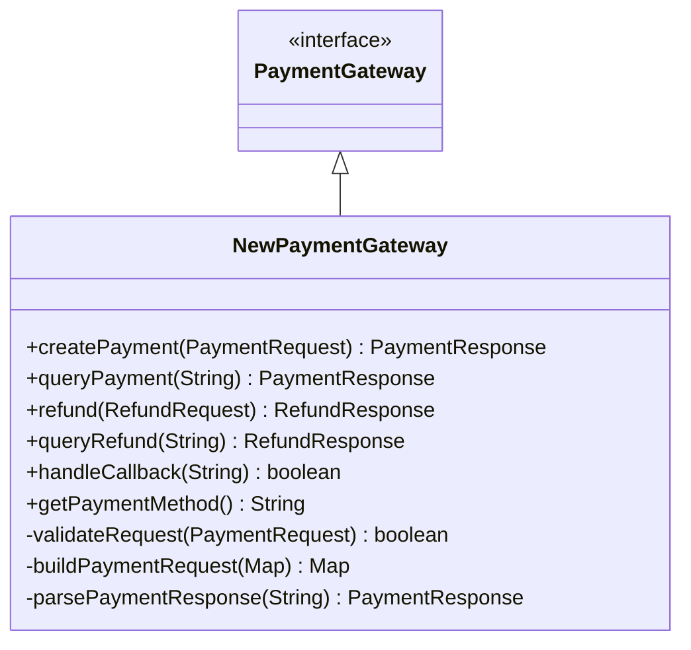

### 配置文件扩展

在application-payment.yml中添加新支付方式的配置：

```yaml
payment:
  # 新支付方式配置
  new-payment:
    app-id: your-app-id
    merchant-id: your-merchant-id
    api-key: your-api-key
    notify-url: http://your-domain.com/api/payment/callback/new-payment
    return-url: http://your-domain.com/payment/result
```

**章节来源**
- [PaymentGateway.java](file://backend/src/main/java/com/carwash/service/payment/PaymentGateway.java#L12-L54)
- [application-payment.yml](file://backend/src/main/resources/application-payment.yml#L1-L34)

## 安全机制设计

### 回调签名验证

系统提供了统一的回调签名验证机制，支持多种支付方式：

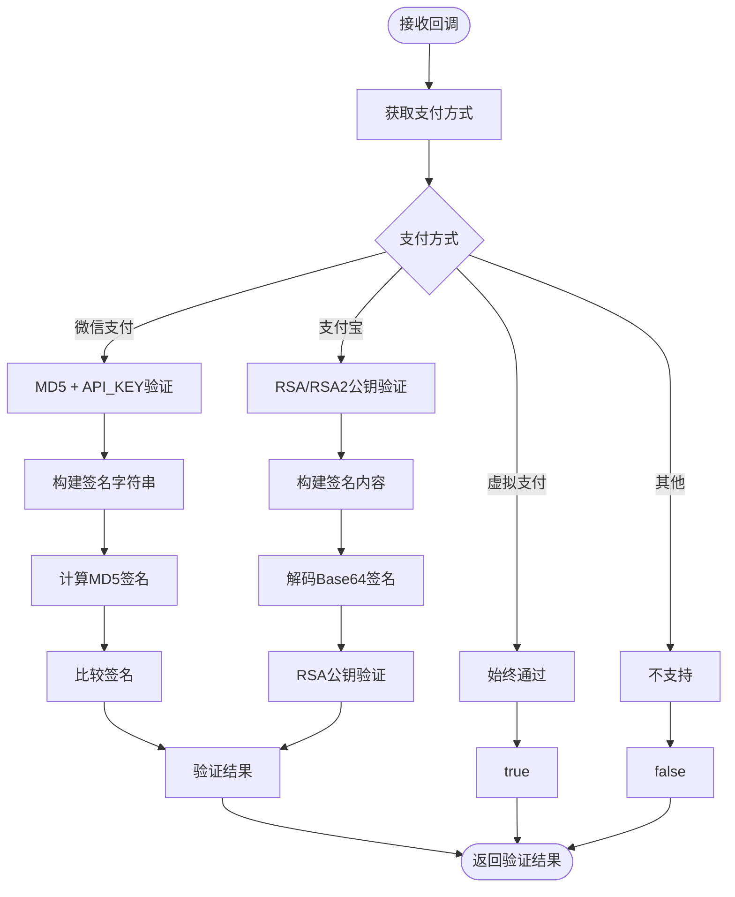

**图表来源**
- [CallbackSignatureVerifier.java](file://backend/src/main/java/com/carwash/service/payment/security/CallbackSignatureVerifier.java#L32-L47)

### 数据传输安全

系统采用多层安全措施保护支付数据：

1. **RSA加密**：信用卡支付使用RSA-OAEP加密敏感数据
2. **签名验证**：所有回调都经过严格签名验证
3. **参数过滤**：回调参数按字典序排列，防止篡改
4. **审计日志**：记录所有支付操作的详细信息

**章节来源**
- [CallbackSignatureVerifier.java](file://backend/src/main/java/com/carwash/service/payment/security/CallbackSignatureVerifier.java#L1-L170)
- [CreditCardGateway.java](file://backend/src/main/java/com/carwash/service/payment/CreditCardGateway.java#L36-L97)

## 总结

汽车洗车服务预约系统的支付系统采用了优秀的架构设计，通过支付网关抽象层和工厂模式实现了高度的模块化和可扩展性。系统的主要优势包括：

1. **统一接口设计**：PaymentGateway接口为所有支付方式提供了统一的操作规范
2. **灵活的工厂模式**：PaymentGatewayFactory通过Spring自动注册机制简化了支付网关的管理
3. **完善的业务流程**：从支付创建到回调处理形成了完整的闭环
4. **强大的扩展能力**：新增支付方式只需实现接口并配置参数即可
5. **全面的安全保障**：多层次的安全机制确保支付过程的安全可靠

这种架构设计不仅满足了当前的业务需求，也为未来的功能扩展奠定了坚实的基础。开发者可以轻松地添加新的支付方式，而无需修改现有的核心代码，体现了良好的软件工程实践。