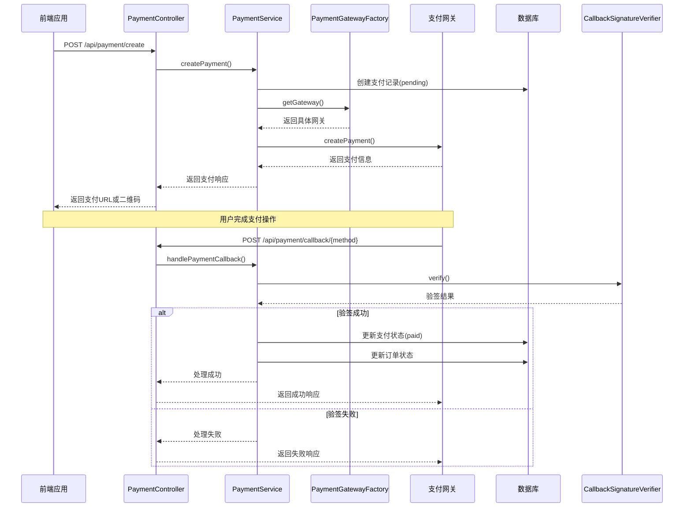

# 支付系统集成

<cite>
**本文档引用文件**  
- [payment-gateway.md](file://backend/docs/payment-gateway.md)
- [application-payment.yml](file://backend/src/main/resources/application-payment.yml)
- [PaymentGateway.java](file://backend/src/main/java/com/carwash/service/payment/PaymentGateway.java)
- [PaymentGatewayFactory.java](file://backend/src/main/java/com/carwash/service/payment/PaymentGatewayFactory.java)
- [AlipayGateway.java](file://backend/src/main/java/com/carwash/service/payment/AlipayGateway.java)
- [WechatPayGateway.java](file://backend/src/main/java/com/carwash/service/payment/WechatPayGateway.java)
- [CallbackSignatureVerifier.java](file://backend/src/main/java/com/carwash/service/payment/security/CallbackSignatureVerifier.java)
- [PaymentController.java](file://backend/src/main/java/com/carwash/controller/PaymentController.java)
- [PaymentServiceImpl.java](file://backend/src/main/java/com/carwash/service/impl/PaymentServiceImpl.java)
- [PaymentConfig.java](file://backend/src/main/java/com/carwash/config/PaymentConfig.java)
- [VirtualPaymentSDK.java](file://backend/src/main/java/com/carwash/service/payment/virtual/VirtualPaymentSDK.java)
</cite>

## 目录
1. [支付网关抽象层设计](#支付网关抽象层设计)
2. [支付网关工厂模式实现](#支付网关工厂模式实现)
3. [支付宝支付集成](#支付宝支付集成)
4. [微信支付集成](#微信支付集成)
5. [回调签名验证机制](#回调签名验证机制)
6. [异步通知处理流程](#异步通知处理流程)
7. [敏感配置项管理](#敏感配置项管理)
8. [支付流程序列图](#支付流程序列图)

## 支付网关抽象层设计

支付系统通过 `PaymentGateway` 接口实现了支付网关的抽象层，为不同支付渠道提供了统一的访问契约。该接口定义了支付系统所需的核心操作，包括支付创建、状态查询、退款申请和回调处理等关键功能。

`PaymentGateway` 接口的设计遵循了单一职责原则，每个方法都对应一个明确的支付操作。`createPayment` 方法用于创建支付订单，接收 `PaymentRequest` 对象作为参数并返回 `PaymentResponse` 对象；`queryPayment` 方法用于查询支付状态，通过支付单号获取最新的支付信息；`refund` 方法处理退款请求，确保资金能够安全退回；`handleCallback` 方法则负责处理第三方支付平台的异步回调通知。

这种抽象层设计使得系统能够轻松扩展新的支付方式，只需实现该接口即可，无需修改现有业务逻辑。同时，接口返回的标准化响应对象确保了上层服务可以统一处理来自不同支付渠道的响应，提高了系统的可维护性和可扩展性。

**本节来源**
- [PaymentGateway.java](file://backend/src/main/java/com/carwash/service/payment/PaymentGateway.java)
- [payment-gateway.md](file://backend/docs/payment-gateway.md)

## 支付网关工厂模式实现

支付网关工厂 `PaymentGatewayFactory` 采用工厂设计模式实现了支付网关的创建与管理。该工厂类通过 Spring 的依赖注入机制，自动收集所有实现了 `PaymentGateway` 接口的组件，并根据支付方式标识进行注册和管理。

工厂类的核心是一个 `HashMap` 结构，以支付方式作为键，对应的网关实现作为值。在工厂构造时，通过 `@Autowired` 注解注入所有 `PaymentGateway` 类型的 Bean，并遍历注册到映射中。这种设计充分利用了 Spring 的组件扫描和依赖注入特性，实现了自动化的网关注册机制。

`getGateway` 方法是工厂的主要访问点，接收支付方式字符串作为参数，从映射中查找并返回对应的网关实例。如果指定的支付方式不受支持，方法会抛出 `IllegalArgumentException` 异常，确保调用方能够及时发现配置错误。此外，工厂还提供了 `getSupportedPaymentMethods` 和 `isSupported` 等辅助方法，便于查询系统支持的支付方式列表和验证特定支付方式的可用性。

这种工厂模式的实现不仅简化了网关的获取过程，还实现了调用方与具体实现的解耦，使得支付方式的增减对业务代码的影响降到最低。

**本节来源**
- [PaymentGatewayFactory.java](file://backend/src/main/java/com/carwash/service/payment/PaymentGatewayFactory.java)
- [payment-gateway.md](file://backend/docs/payment-gateway.md)

## 支付宝支付集成

支付宝支付网关 `AlipayGateway` 实现了 `PaymentGateway` 接口，提供了与支付宝平台的完整集成。该实现通过支付宝开放平台的 API，支持扫码支付、APP支付和H5支付等多种支付场景。

在支付创建过程中，`AlipayGateway` 首先构建符合支付宝规范的请求参数，包括应用ID、方法名、字符集、签名类型等基础参数，以及订单号、金额、商品描述等业务参数。参数构建完成后，系统会调用 `generateSign` 方法生成RSA签名，这是支付宝安全验证的关键步骤。签名生成后，参数会被组装成支付URL，供前端跳转或展示二维码。

对于支付状态查询和退款操作，网关同样遵循支付宝的API规范，构建相应的请求参数并进行签名验证。在实际生产环境中，这些方法会调用支付宝提供的SDK或直接通过HTTP请求与支付宝服务器通信。在当前实现中，这些调用被模拟，以确保开发和测试的便利性。

`AlipayGateway` 还实现了 `getPaymentMethod` 方法，返回 "alipay" 作为支付方式标识，这与工厂模式中的注册机制相配合，确保系统能够正确路由到该实现。

**本节来源**
- [AlipayGateway.java](file://backend/src/main/java/com/carwash/service/payment/AlipayGateway.java)
- [payment-gateway.md](file://backend/docs/payment-gateway.md)

## 微信支付集成

微信支付网关 `WechatPayGateway` 实现了与微信支付平台的集成，支持微信扫码支付等场景。该实现遵循微信支付的API规范，构建符合要求的请求参数，并处理相应的响应。

在创建支付订单时，`WechatPayGateway` 构建包含应用ID、商户号、随机字符串、商品描述、订单号、金额等信息的参数集合。其中，金额需要转换为分的整数形式，这是微信支付的特殊要求。参数构建完成后，系统会生成MD5签名，该签名基于所有参数（除签名本身）按字典序拼接后，附加API密钥再进行MD5加密。

与支付宝的RSA签名不同，微信支付采用的是基于API密钥的MD5签名机制，这在 `generateSign` 方法中有具体实现。签名生成后，参数会被提交到微信支付的统一下单接口。在当前实现中，这一过程被模拟，返回一个模拟的二维码链接，供前端展示。

`WechatPayGateway` 同样实现了支付查询、退款和回调处理等方法，确保完整的支付生命周期管理。其 `getPaymentMethod` 方法返回 "wechat"，作为微信支付的唯一标识，与系统其他部分保持一致。

**本节来源**
- [WechatPayGateway.java](file://backend/src/main/java/com/carwash/service/payment/WechatPayGateway.java)
- [payment-gateway.md](file://backend/docs/payment-gateway.md)

## 回调签名验证机制

回调签名验证是支付系统安全性的关键环节，`CallbackSignatureVerifier` 组件负责验证来自第三方支付平台的回调通知的真实性。该组件采用策略模式，根据不同支付方式执行相应的验证逻辑。

对于微信支付，验证过程包括：提取回调参数中的签名，将除签名外的所有参数按字典序拼接，末尾附加 `&key=API_KEY`，然后对整个字符串进行MD5加密，并将结果与收到的签名进行比较。由于MD5是哈希算法，比较时需要转换为大写以确保一致性。

对于支付宝支付，验证过程更为复杂，采用RSA非对称加密算法。系统会提取回调参数中的Base64编码签名，使用支付宝提供的公钥对除 `sign` 和 `sign_type` 外的参数进行字典序拼接后的字符串进行验签。根据 `sign_type` 参数选择SHA256withRSA或SHA1withRSA算法进行验证。

对于虚拟支付网关，由于仅用于开发和测试环境，验签始终返回成功，以简化测试流程。这种设计体现了安全与便利的平衡，确保生产环境的安全性，同时不牺牲开发效率。

`CallbackSignatureVerifier` 被集成到 `PaymentServiceImpl` 的 `verifyPaymentCallback` 方法中，作为回调处理的第一道安全防线，只有通过验证的回调才会继续处理。

**本节来源**
- [CallbackSignatureVerifier.java](file://backend/src/main/java/com/carwash/service/payment/security/CallbackSignatureVerifier.java)
- [PaymentServiceImpl.java](file://backend/src/main/java/com/carwash/service/impl/PaymentServiceImpl.java)
- [payment-gateway.md](file://backend/docs/payment-gateway.md)

## 异步通知处理流程

异步通知处理是支付系统中确保交易状态最终一致性的关键机制。`PaymentController` 提供了专门的端点来接收来自支付宝和微信支付的回调通知。

系统为每种支付方式设置了独立的回调URL，如 `/api/payment/callback/alipay` 和 `/api/payment/callback/wechat`。当用户完成支付后，支付平台会向这些URL发送POST请求，携带支付结果参数。`PaymentController` 中的相应方法会收集这些参数，然后委托给 `PaymentService` 的 `handlePaymentCallback` 方法进行处理。

处理流程首先进行签名验证，确保通知来自合法的支付平台。验证通过后，系统会更新本地数据库中的支付状态为"已支付"，并记录交易ID和支付时间。同时，相关的订单状态也会被更新，触发后续的业务流程，如预约确认、服务准备等。

为了确保高可用性，支付平台通常会多次发送回调通知，直到收到成功响应。因此，回调处理逻辑必须是幂等的，即多次处理同一通知不会产生副作用。系统通过检查支付记录的当前状态来实现幂等性，避免重复更新。

**本节来源**
- [PaymentController.java](file://backend/src/main/java/com/carwash/controller/PaymentController.java)
- [PaymentServiceImpl.java](file://backend/src/main/java/com/carwash/service/impl/PaymentServiceImpl.java)
- [payment-gateway.md](file://backend/docs/payment-gateway.md)

## 敏感配置项管理

支付系统的敏感配置项通过 `application-payment.yml` 文件进行集中管理，并结合 `PaymentConfig` 配置类实现类型安全的访问。这种配置方式遵循了Spring Boot的外部化配置原则，将敏感信息与代码分离。

配置文件中包含了微信支付和支付宝支付所需的所有密钥和证书信息，如微信的 `api-key`、`cert-path`，支付宝的 `private-key`、`alipay-public-key` 等。这些信息在部署时由运维人员提供，避免了硬编码带来的安全风险。

`PaymentConfig` 类使用 `@ConfigurationProperties` 注解，将YAML文件中的配置自动映射到Java对象的属性中。通过嵌套的静态类 `WechatPay`、`Alipay` 和 `Security`，配置结构清晰，易于维护。这种类型安全的配置方式不仅减少了配置错误的可能性，还提供了良好的IDE支持和编译时检查。

对于RSA密钥等特别敏感的信息，配置文件中使用了多行字符串格式，直接嵌入PEM格式的密钥内容，确保了密钥的完整性。在生产环境中，建议进一步使用配置中心或密钥管理服务来存储这些敏感信息，实现更高级别的安全保护。

**本节来源**
- [application-payment.yml](file://backend/src/main/resources/application-payment.yml)
- [PaymentConfig.java](file://backend/src/main/java/com/carwash/config/PaymentConfig.java)

## 支付流程序列图

**图表来源**
- [PaymentController.java](file://backend/src/main/java/com/carwash/controller/PaymentController.java#L132-L181)
- [PaymentServiceImpl.java](file://backend/src/main/java/com/carwash/service/impl/PaymentServiceImpl.java#L173-L229)
- [CallbackSignatureVerifier.java](file://backend/src/main/java/com/carwash/service/payment/security/CallbackSignatureVerifier.java#L35-L47)

**本节来源**
- [PaymentController.java](file://backend/src/main/java/com/carwash/controller/PaymentController.java)
- [PaymentServiceImpl.java](file://backend/src/main/java/com/carwash/service/impl/PaymentServiceImpl.java)
- [CallbackSignatureVerifier.java](file://backend/src/main/java/com/carwash/service/payment/security/CallbackSignatureVerifier.java)