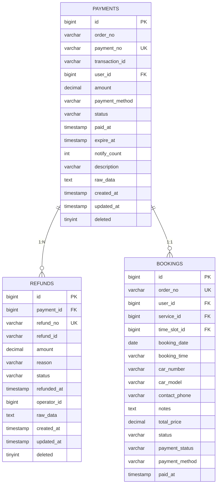
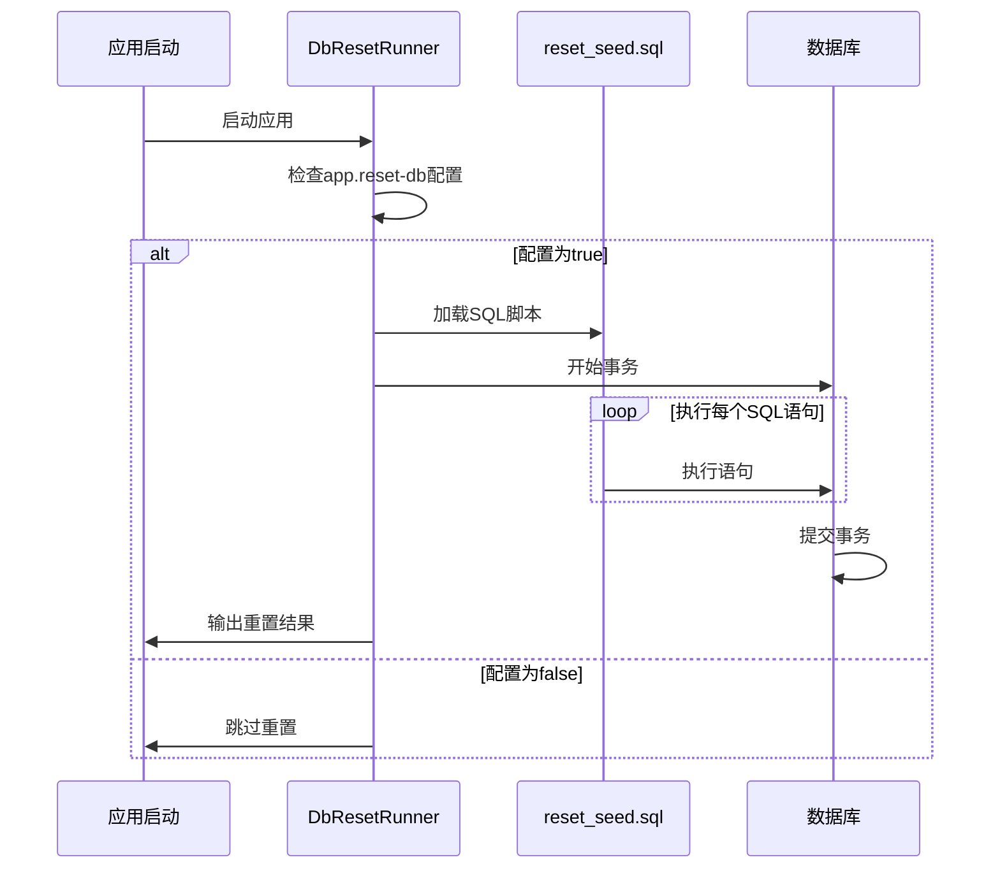

# SQL脚本详解

<cite>
**本文档引用的文件**  
- [init.sql](file://sql/init.sql)
- [insert_test_bookings.sql](file://sql/insert_test_bookings.sql)
- [insert_test_bookings_user3.sql](file://sql/insert_test_bookings_user3.sql)
- [2025-11-08__create_payment_audit.sql](file://sql/2025-11-08__create_payment_audit.sql)
- [reset_seed.sql](file://backend/src/main/resources/sql/reset_seed.sql)
- [payment_tables.sql](file://backend/src/main/resources/sql/payment_tables.sql)
- [payment_refund_tables.sql](file://backend/src/main/resources/sql/payment_refund_tables.sql)
- [DbResetRunner.java](file://backend/src/main/java/com/carwash/config/DbResetRunner.java)
- [PaymentConfig.java](file://backend/src/main/java/com/carwash/config/PaymentConfig.java)
- [application-payment.yml](file://backend/src/main/resources/application-payment.yml)
</cite>

## 目录
1. [数据库初始化脚本分析](#数据库初始化脚本分析)
2. [测试数据脚本解析](#测试数据脚本解析)
3. [支付模块扩展脚本](#支付模块扩展脚本)
4. [审计表设计说明](#审计表设计说明)
5. [数据库重置流程](#数据库重置流程)
6. [执行建议与风险提示](#执行建议与风险提示)

## 数据库初始化脚本分析

`init.sql` 脚本是系统数据库的核心初始化脚本，负责创建所有基础数据表并填充初始数据。该脚本采用分步执行策略，确保数据结构的完整性和一致性。

脚本的执行逻辑分为四个主要阶段：
1. **表结构创建阶段**：首先创建所有基础数据表，包括用户表、服务项目表、时间段表、预约订单表、系统配置表和用户反馈表。这些表之间通过外键建立关联关系，形成完整的数据模型。
2. **数据清除阶段**：使用 `TRUNCATE TABLE` 命令清空所有表的数据，为重新生成数据做准备。此阶段按照依赖关系逆序执行，先清除依赖其他表的表数据，确保外键约束不会导致操作失败。
3. **数据生成阶段**：重新插入初始数据，包括管理员和普通用户账号、各类洗车服务项目、未来7天的时间段数据以及系统配置信息。
4. **索引优化阶段**：创建必要的数据库索引以提升查询性能，并恢复外键检查。

表创建的依赖关系遵循以下顺序：
- `users` 表作为基础表，被 `bookings` 和 `feedback` 表引用
- `services` 表被 `bookings` 表引用
- `time_slots` 表被 `bookings` 表引用
- `bookings` 表被 `feedback` 表引用

这种依赖关系决定了表的创建顺序必须从基础表到引用表，确保外键约束能够正确建立。

**Section sources**
- [init.sql](file://sql/init.sql#L1-L398)

## 测试数据脚本解析

项目提供了多个测试数据脚本，用于在开发和测试环境中快速生成测试数据，验证系统功能。

### insert_test_bookings*.sql 脚本

`insert_test_bookings.sql` 和 `insert_test_bookings_user3.sql` 是两个主要的测试数据脚本，它们的用途和数据构造逻辑如下：

`insert_test_bookings.sql` 脚本主要为管理员用户（user_id=2）创建一系列测试订单，覆盖了各种订单状态和支付状态的组合：
- **已完成订单**：状态为 "completed"，支付状态为 "paid"
- **进行中订单**：状态为 "in_progress"，支付状态为 "paid"
- **待处理订单**：状态为 "pending"，支付状态为 "unpaid"
- **已确认订单**：状态为 "confirmed"，支付状态为 "paid"
- **已取消订单**：状态为 "cancelled"，支付状态为 "refunded"

这些测试数据的时间跨度覆盖当前日期及未来几天，确保能够测试不同时间段的预约功能。脚本还更新了对应时间段的预约数量，保持数据一致性。

`insert_test_bookings_user3.sql` 脚本则为特定用户（user_id=3）创建测试订单，主要用于验证用户特定功能，如"我的订单"页面的数据显示。该脚本使用了固定的过去日期，便于测试历史订单查询功能。

两个脚本都包含了数据验证查询，确保数据插入成功并可以正确检索。

**Section sources**
- [insert_test_bookings.sql](file://sql/insert_test_bookings.sql#L1-L49)
- [insert_test_bookings_user3.sql](file://sql/insert_test_bookings_user3.sql#L1-L22)

## 支付模块扩展脚本

`payment_tables.sql` 和 `payment_refund_tables.sql` 脚本为系统添加了完整的支付功能支持，扩展了原有的数据模型。

### payment_tables.sql

该脚本创建了支付系统的核心表结构：
- **payments 表**：记录所有支付交易，包含支付流水号、交易金额、支付方式、支付状态等关键信息
- **refunds 表**：记录所有退款交易，与支付记录通过外键关联，实现支付-退款的完整生命周期管理

脚本还通过 `ALTER TABLE` 语句为现有的 `bookings` 表添加了支付相关字段：
- `payment_status`：记录订单的支付状态
- `payment_method`：记录使用的支付方式
- `paid_at`：记录支付完成时间

这些字段的添加使得预约订单能够与支付系统无缝集成，实现订单状态和支付状态的同步管理。

### payment_refund_tables.sql

这是一个英文版本的支付表创建脚本，功能与 `payment_tables.sql` 基本相同，但缺少一些索引和约束定义。这表明项目在开发过程中可能存在多版本的SQL脚本，需要统一管理。

**Diagram sources**
- [payment_tables.sql](file://backend/src/main/resources/sql/payment_tables.sql#L1-L76)

**Section sources**
- [payment_tables.sql](file://backend/src/main/resources/sql/payment_tables.sql#L1-L76)
- [payment_refund_tables.sql](file://backend/src/main/resources/sql/payment_refund_tables.sql#L1-L51)

## 审计表设计说明

`2025-11-08__create_payment_audit.sql` 脚本创建了支付审计日志表，用于记录支付系统的操作日志和事件追踪。

`payment_audit` 表的设计目的包括：
1. **操作审计**：记录所有与支付相关的操作事件，如支付创建、支付成功、退款等
2. **问题排查**：当支付出现问题时，可以通过审计日志追溯事件发生的过程
3. **安全监控**：监控异常的支付操作，及时发现潜在的安全风险
4. **数据对账**：与支付平台的交易记录进行对账，确保数据一致性

表结构包含以下关键字段：
- `event_type`：记录事件类型，便于分类查询
- `payment_no` 和 `order_no`：提供快速查询索引
- `raw_data`：存储原始数据，便于问题排查
- `operator_id`：记录操作员，实现责任追溯

该审计表与 `payments` 和 `refunds` 表形成互补，共同构成了完整的支付数据追踪体系。

**Section sources**
- [2025-11-08__create_payment_audit.sql](file://sql/2025-11-08__create_payment_audit.sql#L1-L19)

## 数据库重置流程

`reset_seed.sql` 脚本和 `DbResetRunner.java` 类共同实现了系统的数据库重置功能。

### reset_seed.sql 脚本

该脚本是一个完整的数据库重置脚本，执行以下操作：
1. 清空所有数据表，包括新增的支付相关表
2. 重置所有表的自增ID
3. 重新插入初始用户、服务、时间段和系统配置数据

与 `init.sql` 相比，`reset_seed.sql` 更加全面，包含了所有表的重置操作，确保数据库回到完全初始状态。

### DbResetRunner.java

该Java类实现了自动化的数据库重置功能：
- 通过Spring的 `ApplicationRunner` 接口，在应用启动时执行数据库重置
- 从classpath加载 `reset_seed.sql` 脚本并执行
- 支持通过配置项 `app.reset-db` 控制是否执行重置
- 执行后输出各表的数据行数，便于验证重置结果

这种自动化重置机制大大简化了开发和测试环境的数据库管理，确保每次启动都能获得一致的初始数据状态。

**Diagram sources**
- [reset_seed.sql](file://backend/src/main/resources/sql/reset_seed.sql#L1-L170)
- [DbResetRunner.java](file://backend/src/main/java/com/carwash/config/DbResetRunner.java#L1-L65)

**Section sources**
- [reset_seed.sql](file://backend/src/main/resources/sql/reset_seed.sql#L1-L170)
- [DbResetRunner.java](file://backend/src/main/java/com/carwash/config/DbResetRunner.java#L1-L65)

## 执行建议与风险提示

### 执行顺序建议

根据脚本的依赖关系和功能，建议按以下顺序执行SQL脚本：

1. **基础初始化**：`init.sql`
   - 创建所有基础表结构
   - 插入初始数据

2. **支付功能扩展**：`payment_tables.sql`
   - 添加支付相关表
   - 扩展订单表的支付字段

3. **审计功能扩展**：`2025-11-08__create_payment_audit.sql`
   - 添加支付审计表

4. **测试数据填充**：`insert_test_bookings.sql` 和 `insert_test_bookings_user3.sql`
   - 在基础数据上添加测试订单

5. **数据库重置**：`reset_seed.sql`
   - 仅在需要完全重置时使用

### 适用环境

- **开发环境**：所有脚本都适用，特别是测试数据脚本和重置脚本，可频繁使用
- **测试环境**：适用除重置脚本外的所有脚本，用于准备测试数据
- **生产环境**：仅适用 `init.sql` 的表结构创建部分，其他数据操作脚本不应在生产环境执行

### 潜在风险提示

1. **数据丢失风险**：`TRUNCATE TABLE` 和 `reset_seed.sql` 会永久删除现有数据，执行前必须做好备份
2. **外键约束冲突**：在已有数据的数据库中执行表结构变更，可能导致外键约束冲突
3. **生产环境误操作**：绝对禁止在生产环境执行数据清除和重置脚本
4. **脚本版本不一致**：存在多个版本的支付表脚本（如中文和英文版本），可能导致部署不一致
5. **自增ID重置**：重置自增ID可能影响已有外键引用，需谨慎处理

建议在执行任何数据库变更脚本前，先在测试环境中充分验证，并制定详细的回滚计划。

**Section sources**
- [init.sql](file://sql/init.sql#L1-L398)
- [payment_tables.sql](file://backend/src/main/resources/sql/payment_tables.sql#L1-L76)
- [2025-11-08__create_payment_audit.sql](file://sql/2025-11-08__create_payment_audit.sql#L1-L19)
- [reset_seed.sql](file://backend/src/main/resources/sql/reset_seed.sql#L1-L170)