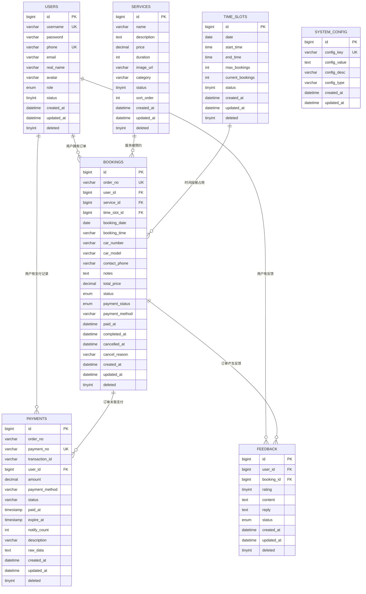
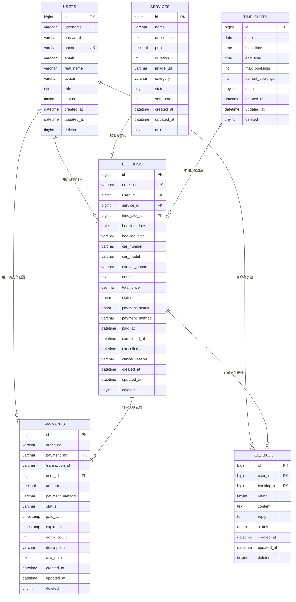
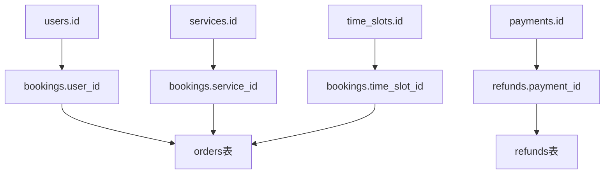
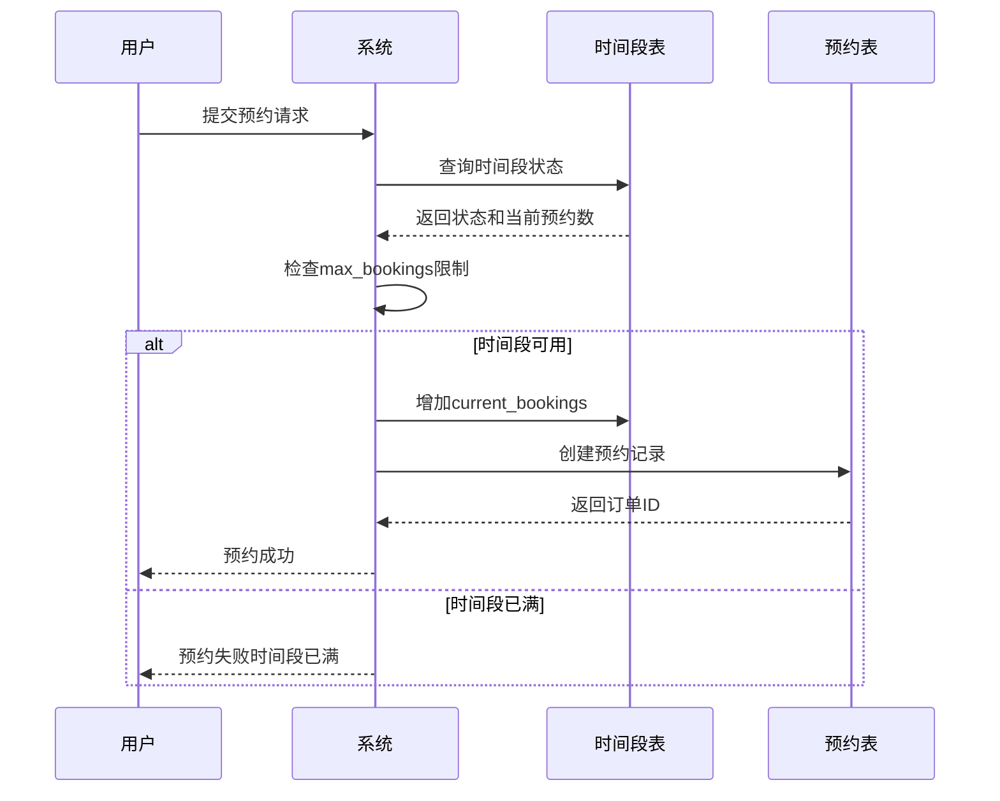
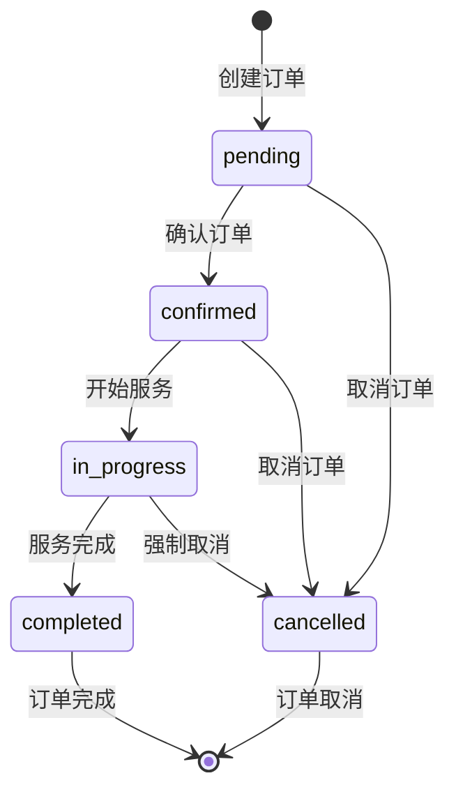
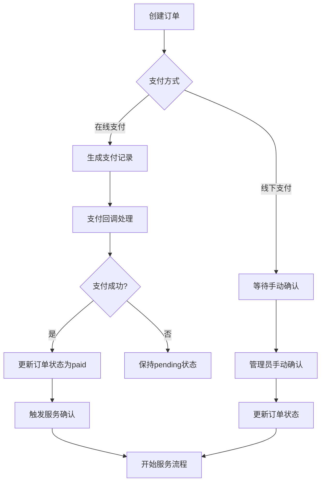

# 数据库设计

<cite>
**本文档引用的文件**
- [init.sql](file://sql/init.sql)
- [payment_tables.sql](file://backend/src/main/resources/sql/payment_tables.sql)
- [reset_seed.sql](file://backend/src/main/resources/sql/reset_seed.sql)
- [insert_test_bookings.sql](file://sql/insert_test_bookings.sql)
- [User.java](file://backend/src/main/java/com/carwash/entity/User.java)
- [Booking.java](file://backend/src/main/java/com/carwash/entity/Booking.java)
- [Service.java](file://backend/src/main/java/com/carwash/entity/Service.java)
- [TimeSlot.java](file://backend/src/main/java/com/carwash/entity/TimeSlot.java)
- [Payment.java](file://backend/src/main/java/com/carwash/entity/Payment.java)
- [Feedback.java](file://backend/src/main/java/com/carwash/entity/Feedback.java)
- [SystemConfig.java](file://backend/src/main/java/com/carwash/entity/SystemConfig.java)
- [BookingController.java](file://backend/src/main/java/com/carwash/controller/BookingController.java)
- [BookingServiceImpl.java](file://backend/src/main/java/com/carwash/service/impl/BookingServiceImpl.java)
</cite>

## 目录
1. [概述](#概述)
2. [数据库架构](#数据库架构)
3. [核心实体设计](#核心实体设计)
4. [关系映射](#关系映射)
5. [索引策略](#索引策略)
6. [约束条件](#约束条件)
7. [业务流程支持](#业务流程支持)
8. [数据生命周期管理](#数据生命周期管理)
9. [性能优化](#性能优化)
10. [总结](#总结)

## 概述

汽车洗车服务预约系统采用MySQL作为主要数据库，支持完整的预约、支付、评价等业务流程。数据库设计遵循关系型数据库范式，确保数据一致性和完整性，同时通过合理的索引和约束设计提升查询性能。

### 设计原则
- **数据完整性**：通过外键约束和业务规则确保数据一致性
- **性能优化**：针对高频查询场景建立专门索引
- **可扩展性**：模块化设计支持业务功能扩展
- **安全性**：支持逻辑删除和权限控制
- **业务导向**：紧密贴合洗车服务预约的核心业务流程

## 数据库架构

系统采用三层架构设计，包含核心业务表、支付相关表和系统配置表。

**图表来源**
- [init.sql](file://sql/init.sql#L21-L147)
- [payment_tables.sql](file://backend/src/main/resources/sql/payment_tables.sql#L4-L76)

## 核心实体设计

### 用户表 (users)

用户表是系统的基础实体，存储用户基本信息和权限信息。

| 字段名 | 类型 | 约束 | 说明 |
|--------|------|------|------|
| id | bigint | PRIMARY KEY, AUTO_INCREMENT | 用户唯一标识符 |
| username | varchar(50) | NOT NULL, UNIQUE | 用户名，用于登录 |
| password | varchar(255) | NOT NULL | 加密后的密码 |
| phone | varchar(20) | UNIQUE | 手机号码 |
| email | varchar(100) | | 邮箱地址 |
| real_name | varchar(200) | | 真实姓名 |
| avatar | varchar(255) | | 头像URL |
| role | enum('user','admin') | DEFAULT 'user' | 用户角色 |
| status | tinyint | DEFAULT '1' | 用户状态：0-禁用，1-启用 |
| created_at | datetime | DEFAULT CURRENT_TIMESTAMP | 创建时间 |
| updated_at | datetime | DEFAULT CURRENT_TIMESTAMP ON UPDATE CURRENT_TIMESTAMP | 更新时间 |
| deleted | tinyint | DEFAULT '0' | 逻辑删除标志 |

**节来源**
- [init.sql](file://sql/init.sql#L21-L39)
- [User.java](file://backend/src/main/java/com/carwash/entity/User.java#L20-L91)

### 服务项目表 (services)

服务项目表定义了可提供的洗车服务类型和价格信息。

| 字段名 | 类型 | 约束 | 说明 |
|--------|------|------|------|
| id | bigint | PRIMARY KEY, AUTO_INCREMENT | 服务唯一标识符 |
| name | varchar(100) | NOT NULL | 服务名称 |
| description | text | | 服务描述 |
| price | decimal(10,2) | NOT NULL | 服务价格 |
| duration | int | NOT NULL | 服务时长（分钟） |
| image_url | varchar(255) | | 服务图片URL |
| category | varchar(50) | | 服务分类 |
| status | tinyint | DEFAULT '1' | 服务状态：0-下架，1-上架 |
| sort_order | int | DEFAULT '0' | 排序权重 |
| created_at | datetime | DEFAULT CURRENT_TIMESTAMP | 创建时间 |
| updated_at | datetime | DEFAULT CURRENT_TIMESTAMP ON UPDATE CURRENT_TIMESTAMP | 更新时间 |
| deleted | tinyint | DEFAULT '0' | 逻辑删除标志 |

**节来源**
- [init.sql](file://sql/init.sql#L41-L59)
- [Service.java](file://backend/src/main/java/com/carwash/entity/Service.java#L20-L92)

### 时间段表 (time_slots)

时间段表管理可预约的时间段，支持时间槽锁定机制。

| 字段名 | 类型 | 约束 | 说明 |
|--------|------|------|------|
| id | bigint | PRIMARY KEY, AUTO_INCREMENT | 时间段唯一标识符 |
| date | date | NOT NULL | 日期 |
| start_time | time | NOT NULL | 开始时间 |
| end_time | time | NOT NULL | 结束时间 |
| max_bookings | int | DEFAULT '1' | 最大预约数 |
| current_bookings | int | DEFAULT '0' | 当前预约数 |
| status | tinyint | DEFAULT '1' | 状态：0-不可用，1-可用 |
| created_at | datetime | DEFAULT CURRENT_TIMESTAMP | 创建时间 |
| updated_at | datetime | DEFAULT CURRENT_TIMESTAMP ON UPDATE CURRENT_TIMESTAMP | 更新时间 |
| deleted | tinyint | DEFAULT '0' | 逻辑删除标志 |

**节来源**
- [init.sql](file://sql/init.sql#L61-L77)
- [TimeSlot.java](file://backend/src/main/java/com/carwash/entity/TimeSlot.java#L22-L81)

### 预约订单表 (bookings)

预约订单表是系统的核心实体，记录完整的预约信息和状态流转。

| 字段名 | 类型 | 约束 | 说明 |
|--------|------|------|------|
| id | bigint | PRIMARY KEY, AUTO_INCREMENT | 订单唯一标识符 |
| order_no | varchar(32) | NOT NULL, UNIQUE | 订单号 |
| user_id | bigint | NOT NULL, FK | 用户ID |
| service_id | bigint | NOT NULL, FK | 服务ID |
| time_slot_id | bigint | NOT NULL, FK | 时间段ID |
| booking_date | date | NOT NULL | 预约日期 |
| booking_time | varchar(20) | NOT NULL | 预约时间 |
| car_number | varchar(20) | | 车牌号 |
| car_model | varchar(50) | | 车型 |
| contact_phone | varchar(20) | NOT NULL | 联系电话 |
| notes | text | | 备注信息 |
| total_price | decimal(10,2) | NOT NULL | 总价格 |
| status | enum | DEFAULT 'pending' | 订单状态 |
| payment_status | enum | DEFAULT 'unpaid' | 支付状态 |
| payment_method | varchar(20) | | 支付方式 |
| paid_at | datetime | | 支付时间 |
| completed_at | datetime | | 完成时间 |
| cancelled_at | datetime | | 取消时间 |
| cancel_reason | varchar(255) | | 取消原因 |
| created_at | datetime | DEFAULT CURRENT_TIMESTAMP | 创建时间 |
| updated_at | datetime | DEFAULT CURRENT_TIMESTAMP ON UPDATE CURRENT_TIMESTAMP | 更新时间 |
| deleted | tinyint | DEFAULT '0' | 逻辑删除标志 |

**节来源**
- [init.sql](file://sql/init.sql#L79-L114)
- [Booking.java](file://backend/src/main/java/com/carwash/entity/Booking.java#L22-L153)

### 支付记录表 (payments)

支付记录表管理订单的支付信息，支持多种支付方式。

| 字段名 | 类型 | 约束 | 说明 |
|--------|------|------|------|
| id | bigint | PRIMARY KEY, AUTO_INCREMENT | 支付记录唯一标识符 |
| order_no | varchar(32) | NOT NULL | 订单号 |
| payment_no | varchar(64) | NOT NULL, UNIQUE | 支付流水号 |
| transaction_id | varchar(64) | | 第三方支付平台交易号 |
| user_id | bigint | NOT NULL, FK | 用户ID |
| amount | decimal(10,2) | NOT NULL | 支付金额 |
| payment_method | varchar(20) | NOT NULL | 支付方式 |
| status | varchar(20) | DEFAULT 'pending' | 支付状态 |
| paid_at | timestamp | | 支付时间 |
| expire_at | timestamp | NOT NULL | 支付过期时间 |
| notify_count | int | DEFAULT '0' | 支付回调通知次数 |
| description | varchar(200) | | 支付描述 |
| raw_data | text | | 支付平台返回的原始数据 |
| created_at | timestamp | DEFAULT CURRENT_TIMESTAMP | 创建时间 |
| updated_at | timestamp | DEFAULT CURRENT_TIMESTAMP ON UPDATE CURRENT_TIMESTAMP | 更新时间 |
| deleted | tinyint | DEFAULT '0' | 逻辑删除标志 |

**节来源**
- [payment_tables.sql](file://backend/src/main/resources/sql/payment_tables.sql#L4-L30)
- [Payment.java](file://backend/src/main/java/com/carwash/entity/Payment.java#L18-L113)

### 用户反馈表 (feedback)

用户反馈表收集用户对服务的评价和建议。

| 字段名 | 类型 | 约束 | 说明 |
|--------|------|------|------|
| id | bigint | PRIMARY KEY, AUTO_INCREMENT | 反馈唯一标识符 |
| user_id | bigint | FK | 用户ID |
| booking_id | bigint | FK | 订单ID |
| rating | tinyint | | 评分（1-5） |
| content | text | | 反馈内容 |
| reply | text | | 回复内容 |
| status | enum | DEFAULT 'pending' | 状态 |
| created_at | datetime | DEFAULT CURRENT_TIMESTAMP | 创建时间 |
| updated_at | datetime | DEFAULT CURRENT_TIMESTAMP ON UPDATE CURRENT_TIMESTAMP | 更新时间 |
| deleted | tinyint | DEFAULT '0' | 逻辑删除标志 |

**节来源**
- [init.sql](file://sql/init.sql#L129-L147)
- [Feedback.java](file://backend/src/main/java/com/carwash/entity/Feedback.java#L19-L80)

### 系统配置表 (system_config)

系统配置表存储系统的全局配置信息。

| 字段名 | 类型 | 约束 | 说明 |
|--------|------|------|------|
| id | bigint | PRIMARY KEY, AUTO_INCREMENT | 配置项唯一标识符 |
| config_key | varchar(100) | NOT NULL, UNIQUE | 配置键 |
| config_value | text | | 配置值 |
| config_desc | varchar(255) | | 配置描述 |
| config_type | varchar(20) | DEFAULT 'string' | 配置类型 |
| created_at | datetime | DEFAULT CURRENT_TIMESTAMP | 创建时间 |
| updated_at | datetime | DEFAULT CURRENT_TIMESTAMP ON UPDATE CURRENT_TIMESTAMP | 更新时间 |

**节来源**
- [init.sql](file://sql/init.sql#L116-L127)
- [SystemConfig.java](file://backend/src/main/java/com/carwash/entity/SystemConfig.java#L19-L61)

## 关系映射

### 一对一关系

- **用户 ↔ 预约订单**：一个用户可以创建多个预约订单，但每个订单只属于一个用户
- **服务 ↔ 预约订单**：一个服务可以被多个订单预约，但每个订单只关联一个服务

### 一对多关系

- **时间段 ↔ 预约订单**：一个时间段可以被多个订单预约（当max_bookings > 1时）
- **用户 ↔ 支付记录**：一个用户可以有多笔支付记录
- **订单 ↔ 支付记录**：一个订单对应唯一的支付记录（通过order_no关联）

### 多对多关系

- **用户 ↔ 反馈**：一个用户可以提交多个反馈，一个反馈只属于一个用户
- **订单 ↔ 反馈**：一个订单可以产生多个反馈，一个反馈只关联一个订单

**图表来源**
- [init.sql](file://sql/init.sql#L111-L114)
- [payment_tables.sql](file://backend/src/main/resources/sql/payment_tables.sql#L55-L56)

## 索引策略

### 主键索引
所有表都使用自增主键作为主键索引，确保数据行的唯一性。

### 唯一索引
- **users表**：username、phone字段设置唯一索引
- **bookings表**：order_no字段设置唯一索引
- **time_slots表**：(date, start_time, end_time)组合设置唯一索引
- **payments表**：payment_no、transaction_id字段设置唯一索引

### 复合索引
- **bookings表**：
  - `(user_id, status)`：查询用户订单状态
  - `(booking_date, status)`：按日期查询订单
  - `(payment_status, created_at)`：查询支付状态
- **time_slots表**：
  - `(date, status)`：查询可用时间段
- **users表**：
  - `(role, status)`：查询用户角色状态

### 单列索引
- **bookings表**：user_id、service_id、time_slot_id、status、payment_status
- **time_slots表**：date、status
- **users表**：role、status
- **feedback表**：user_id、booking_id、status

**节来源**
- [init.sql](file://sql/init.sql#L34-L38)
- [init.sql](file://sql/init.sql#L56-L58)
- [init.sql](file://sql/init.sql#L74-L76)
- [init.sql](file://sql/init.sql#L104-L110)
- [init.sql](file://sql/init.sql#L142-L144)

## 约束条件

### 外键约束
系统建立了完整的外键约束链：

**图表来源**
- [init.sql](file://sql/init.sql#L111-L113)
- [payment_tables.sql](file://backend/src/main/resources/sql/payment_tables.sql#L55-L56)

### 枚举约束
- **users.role**：只能取'user'或'admin'
- **bookings.status**：只能取'pending'、'confirmed'、'in_progress'、'completed'、'cancelled'
- **bookings.payment_status**：只能取'unpaid'、'paid'、'refunded'
- **time_slots.status**：只能取0或1
- **services.status**：只能取0或1

### 默认值约束
- **bookings.status**：默认为'pending'
- **bookings.payment_status**：默认为'unpaid'
- **time_slots.max_bookings**：默认为1
- **system_config.config_type**：默认为'string'

### 业务约束
- **时间槽锁定**：当`current_bookings >= max_bookings`时，时间段状态设为不可用
- **订单状态流转**：订单状态必须按照有效顺序流转
- **支付超时**：支付记录在expire_at时间后自动失效

**节来源**
- [BookingServiceImpl.java](file://backend/src/main/java/com/carwash/service/impl/BookingServiceImpl.java#L112-L116)

## 业务流程支持

### 预约流程中的时间槽锁定机制

系统通过以下机制实现时间槽锁定：

**图表来源**
- [BookingServiceImpl.java](file://backend/src/main/java/com/carwash/service/impl/BookingServiceImpl.java#L100-L117)

### 订单状态流转

订单状态支持以下流转路径：

### 支付流程集成

支付流程与订单状态紧密集成：

**图表来源**
- [BookingServiceImpl.java](file://backend/src/main/java/com/carwash/service/impl/BookingServiceImpl.java#L77-L175)

## 数据生命周期管理

### 逻辑删除策略

系统采用逻辑删除而非物理删除，通过deleted字段标记记录状态：

| 删除状态 | deleted值 | 说明 |
|----------|-----------|------|
| 未删除 | 0 | 正常使用的记录 |
| 已删除 | 1 | 逻辑删除的记录 |

### 数据归档方案

系统支持以下数据归档策略：

1. **历史订单归档**：超过一定期限的订单自动归档
2. **反馈数据清理**：处理完成的反馈超过3个月自动清理
3. **临时数据清理**：支付超时的临时数据定期清理

### 数据保留策略

| 数据类型 | 保留期限 | 归档策略 |
|----------|----------|----------|
| 订单数据 | 5年 | 按年份归档 |
| 支付数据 | 7年 | 按年份归档 |
| 用户数据 | 永久 | 保留用户基本信息 |
| 反馈数据 | 2年 | 处理完成后清理 |
| 系统配置 | 永久 | 不定期更新 |

**节来源**
- [reset_seed.sql](file://backend/src/main/resources/sql/reset_seed.sql#L1-L170)

## 性能优化

### 查询优化

1. **索引优化**：为高频查询字段建立复合索引
2. **分页查询**：对大量数据采用分页查询
3. **缓存策略**：热点数据采用Redis缓存
4. **读写分离**：大数据量场景采用读写分离

### 并发控制

1. **乐观锁**：使用版本号控制并发更新
2. **悲观锁**：关键业务场景使用数据库锁
3. **分布式锁**：高并发场景使用Redis分布式锁

### 批量操作

1. **批量插入**：支持批量插入订单和时间段数据
2. **批量更新**：支持批量更新订单状态
3. **批量删除**：支持批量逻辑删除

**节来源**
- [BookingController.java](file://backend/src/main/java/com/carwash/controller/BookingController.java#L1-L200)

## 总结

汽车洗车服务预约系统的数据库设计具有以下特点：

### 设计优势
1. **完整性保证**：通过外键约束和业务规则确保数据一致性
2. **性能优化**：合理索引设计支持高频查询场景
3. **业务贴合**：紧密围绕预约、支付、评价等核心业务流程
4. **可扩展性**：模块化设计支持功能扩展和业务增长
5. **安全性**：逻辑删除和权限控制保障数据安全

### 技术特色
1. **时间槽锁定机制**：有效防止超卖和重复预约
2. **状态流转控制**：严格的订单状态管理
3. **支付集成**：完整的支付流程支持
4. **反馈体系**：完善的用户反馈机制
5. **配置管理**：灵活的系统配置支持

### 应用价值
该数据库设计为汽车洗车服务预约系统提供了坚实的数据基础，支持高效的业务运营和良好的用户体验，具备良好的扩展性和维护性，能够适应业务的发展需求。