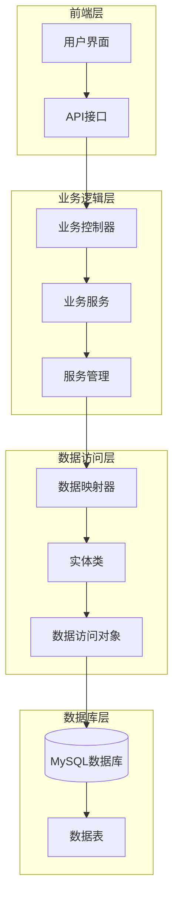
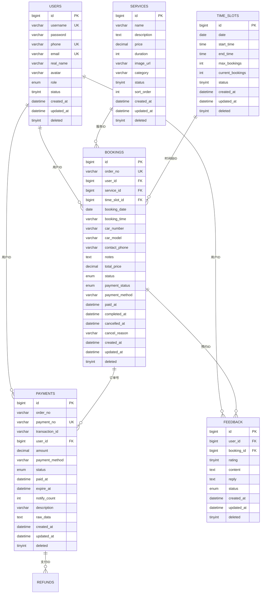
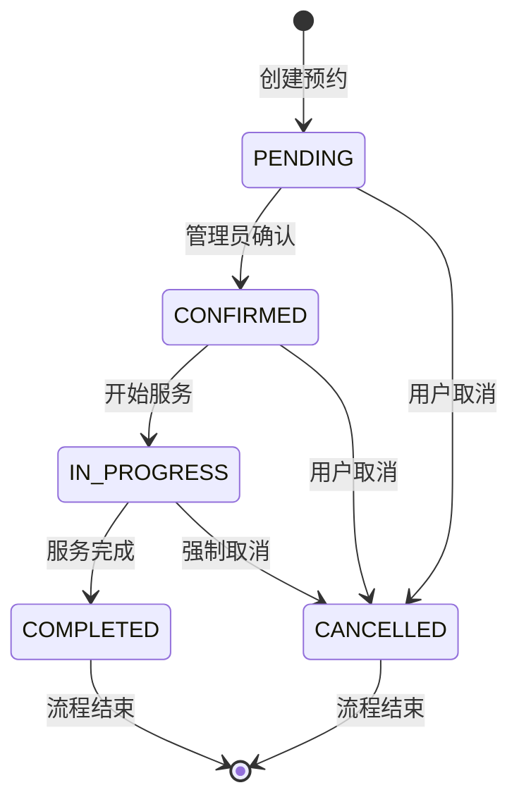
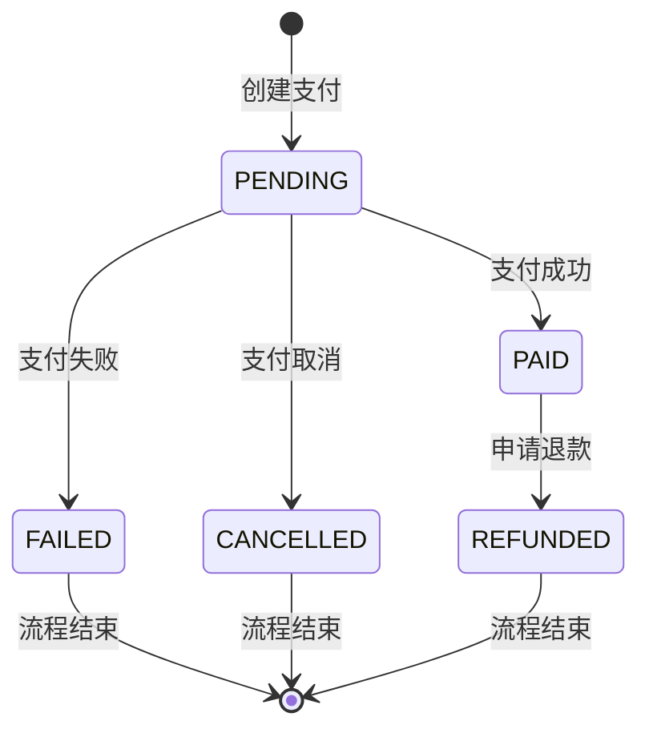
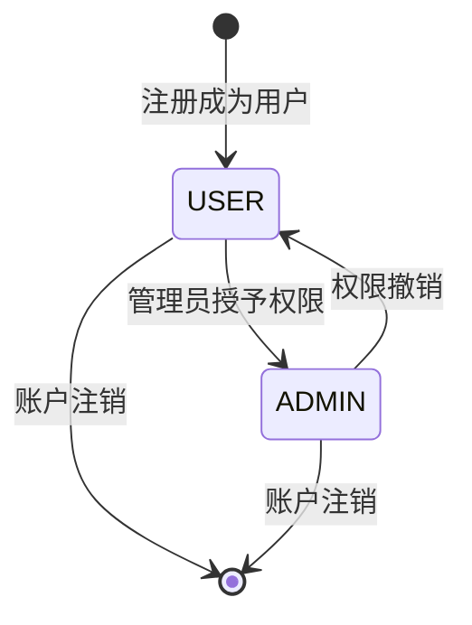
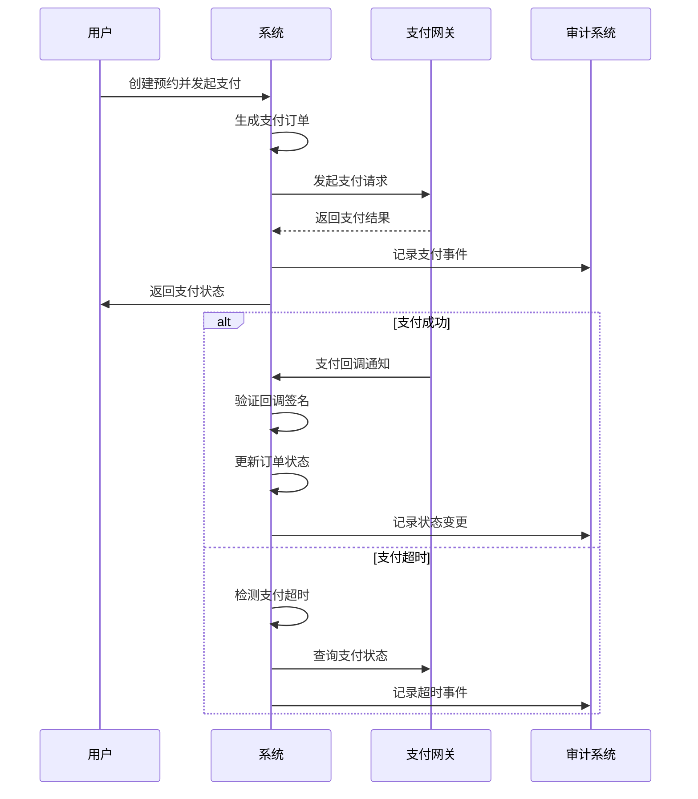
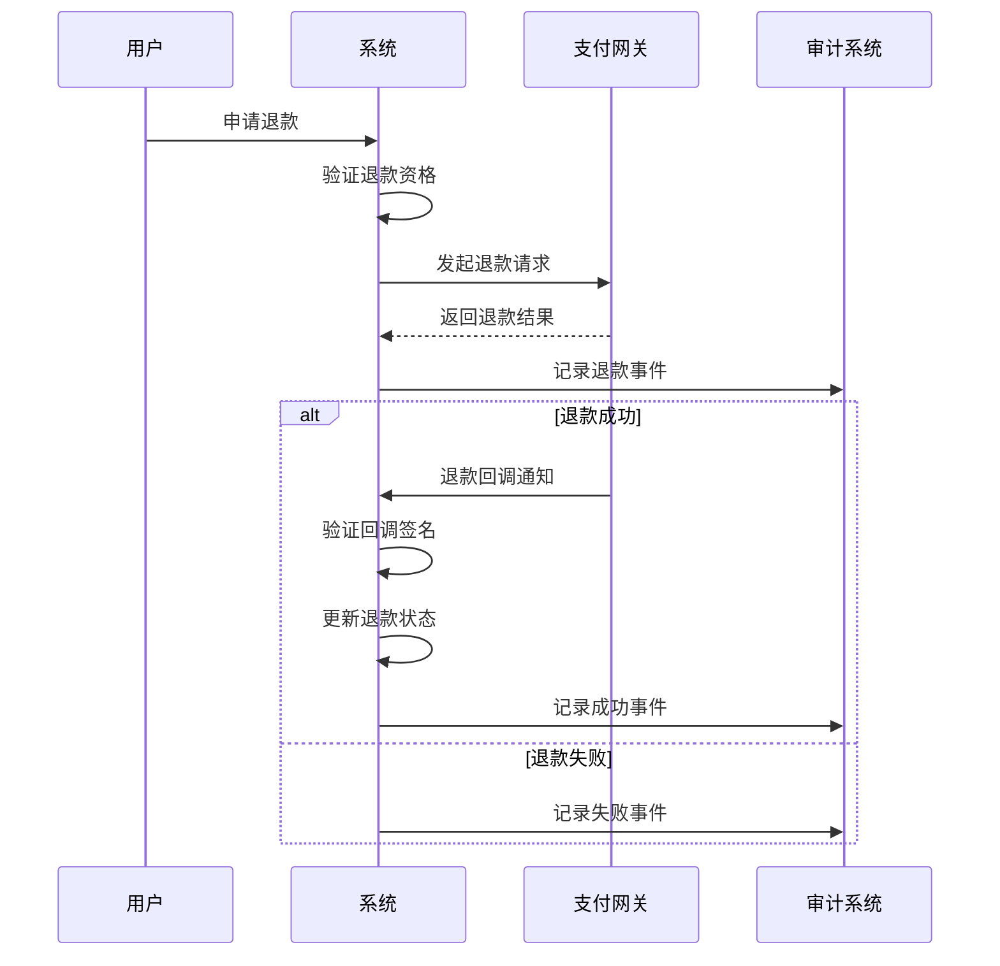

# 数据模型

<cite>
**本文档中引用的文件**
- [User.java](file://backend/src/main/java/com/carwash/entity/User.java)
- [Booking.java](file://backend/src/main/java/com/carwash/entity/Booking.java)
- [Service.java](file://backend/src/main/java/com/carwash/entity/Service.java)
- [TimeSlot.java](file://backend/src/main/java/com/carwash/entity/TimeSlot.java)
- [Payment.java](file://backend/src/main/java/com/carwash/entity/Payment.java)
- [Feedback.java](file://backend/src/main/java/com/carwash/entity/Feedback.java)
- [PaymentAudit.java](file://backend/src/main/java/com/carwash/entity/PaymentAudit.java)
- [Refund.java](file://backend/src/main/java/com/carwash/entity/Refund.java)
- [AppointmentStatus.java](file://backend/src/main/java/com/carwash/common/enums/AppointmentStatus.java)
- [UserRole.java](file://backend/src/main/java/com/carwash/common/enums/UserRole.java)
- [init.sql](file://sql/init.sql)
- [payment_tables.sql](file://backend/src/main/resources/sql/payment_tables.sql)
- [payment_refund_tables.sql](file://backend/src/main/resources/sql/payment_refund_tables.sql)
</cite>

## 目录
1. [简介](#简介)
2. [系统架构概览](#系统架构概览)
3. [核心实体分析](#核心实体分析)
4. [实体关系图](#实体关系图)
5. [数据完整性约束](#数据完整性约束)
6. [索引策略](#索引策略)
7. [业务状态流转](#业务状态流转)
8. [支付系统集成](#支付系统集成)
9. [数据模型最佳实践](#数据模型最佳实践)
10. [总结](#总结)

## 简介

汽车洗车服务预约系统采用基于Java的Spring Boot架构，使用MySQL作为主要数据库。该系统的核心数据模型围绕用户、预约、服务、时间槽和支付等关键业务实体构建，支持完整的预约流程管理和支付处理。

系统采用现代化的数据库设计原则，包括：
- **逻辑删除**：通过deleted字段实现软删除机制
- **时间戳管理**：自动维护创建和更新时间
- **外键约束**：确保数据完整性
- **索引优化**：提升查询性能
- **枚举类型**：规范状态和类型字段

## 系统架构概览

系统采用分层架构设计，数据访问层基于MyBatis Plus框架，提供了强大的ORM功能和自动化的CRUD操作支持。

**图表来源**
- [User.java](file://backend/src/main/java/com/carwash/entity/User.java#L1-L190)
- [Booking.java](file://backend/src/main/java/com/carwash/entity/Booking.java#L1-L333)
- [Service.java](file://backend/src/main/java/com/carwash/entity/Service.java#L1-L191)

## 核心实体分析

### 用户实体 (User)

用户实体是系统的基础实体，负责管理用户账户信息和权限控制。

| 字段名 | 数据类型 | 约束 | 描述 |
|--------|----------|------|------|
| id | Long | PRIMARY KEY, AUTO_INCREMENT | 用户唯一标识符 |
| username | String | NOT NULL, UNIQUE | 用户名，用于登录 |
| password | String | NOT NULL | 加密后的用户密码 |
| realName | String | NULL | 用户真实姓名 |
| phone | String | NULL, UNIQUE | 手机号码 |
| email | String | NULL, UNIQUE | 电子邮箱地址 |
| avatar | String | NULL | 头像图片URL |
| role | String | DEFAULT 'user' | 用户角色：user或admin |
| status | Integer | DEFAULT 1 | 用户状态：0-禁用，1-启用 |
| createdAt | LocalDateTime | DEFAULT CURRENT_TIMESTAMP | 账户创建时间 |
| updatedAt | LocalDateTime | DEFAULT CURRENT_TIMESTAMP ON UPDATE | 最后更新时间 |
| deleted | Integer | DEFAULT 0 | 逻辑删除标志 |

**业务含义**：
- 支持普通用户和管理员两种角色
- 实现了完整的用户生命周期管理
- 提供了多种联系方式便于沟通

**节来源**
- [User.java](file://backend/src/main/java/com/carwash/entity/User.java#L1-L190)

### 预约订单实体 (Booking)

预约订单实体是系统的核心业务实体，记录了完整的预约信息和状态变化。

| 字段名 | 数据类型 | 约束 | 描述 |
|--------|----------|------|------|
| id | Long | PRIMARY KEY, AUTO_INCREMENT | 订单唯一标识符 |
| orderNo | String | NOT NULL, UNIQUE | 系统生成的订单号 |
| userId | Long | NOT NULL, FOREIGN KEY | 关联的用户ID |
| serviceId | Long | NOT NULL, FOREIGN KEY | 关联的服务ID |
| timeSlotId | Long | NOT NULL, FOREIGN KEY | 关联的时间段ID |
| bookingDate | LocalDate | NOT NULL | 预约的具体日期 |
| bookingTime | String | NOT NULL | 预约的具体时间 |
| carNumber | String | NULL | 车辆牌照号码 |
| carModel | String | NULL | 车辆型号信息 |
| contactPhone | String | NOT NULL | 联系电话 |
| notes | String | NULL | 备注信息 |
| totalPrice | BigDecimal | NOT NULL | 总计费用 |
| status | String | DEFAULT 'pending' | 预约状态 |
| paymentStatus | String | DEFAULT 'unpaid' | 支付状态 |
| paymentMethod | String | NULL | 支付方式 |
| paidAt | LocalDateTime | NULL | 支付完成时间 |
| completedAt | LocalDateTime | NULL | 服务完成时间 |
| cancelledAt | LocalDateTime | NULL | 取消时间 |
| cancelReason | String | NULL | 取消原因 |
| createdAt | LocalDateTime | DEFAULT CURRENT_TIMESTAMP | 创建时间 |
| updatedAt | LocalDateTime | DEFAULT CURRENT_TIMESTAMP ON UPDATE | 更新时间 |
| deleted | Integer | DEFAULT 0 | 逻辑删除标志 |

**业务含义**：
- 支持多种预约状态流转
- 集成了支付状态管理
- 提供了完整的预约生命周期跟踪

**节来源**
- [Booking.java](file://backend/src/main/java/com/carwash/entity/Booking.java#L1-L333)

### 服务项目实体 (Service)

服务项目实体定义了系统提供的各种洗车服务选项。

| 字段名 | 数据类型 | 约束 | 描述 |
|--------|----------|------|------|
| id | Long | PRIMARY KEY, AUTO_INCREMENT | 服务唯一标识符 |
| name | String | NOT NULL | 服务名称 |
| description | String | NULL | 服务详细描述 |
| price | BigDecimal | NOT NULL | 服务价格 |
| duration | Integer | NOT NULL | 服务时长（分钟） |
| imageUrl | String | NULL | 服务图片URL |
| category | String | NULL | 服务分类 |
| status | Integer | DEFAULT 1 | 服务状态：0-下架，1-上架 |
| sortOrder | Integer | DEFAULT 0 | 排序权重 |
| createdAt | LocalDateTime | DEFAULT CURRENT_TIMESTAMP | 创建时间 |
| updatedAt | LocalDateTime | DEFAULT CURRENT_TIMESTAMP ON UPDATE | 更新时间 |
| deleted | Integer | DEFAULT 0 | 逻辑删除标志 |

**业务含义**：
- 支持灵活的服务分类和定价
- 提供了服务展示和营销功能
- 支持动态上下架管理

**节来源**
- [Service.java](file://backend/src/main/java/com/carwash/entity/Service.java#L1-L191)

### 时间段实体 (TimeSlot)

时间段实体实现了预约系统的时间管理功能，支持精确的时间段控制。

| 字段名 | 数据类型 | 约束 | 描述 |
|--------|----------|------|------|
| id | Long | PRIMARY KEY, AUTO_INCREMENT | 时间段唯一标识符 |
| date | LocalDate | NOT NULL | 日期 |
| startTime | LocalTime | NOT NULL | 开始时间 |
| endTime | LocalTime | NOT NULL | 结束时间 |
| maxBookings | Integer | DEFAULT 1 | 最大预约数量 |
| currentBookings | Integer | DEFAULT 0 | 当前已预约数量 |
| status | Integer | DEFAULT 1 | 时间段状态：0-不可用，1-可用 |
| createdAt | LocalDateTime | DEFAULT CURRENT_TIMESTAMP | 创建时间 |
| updatedAt | LocalDateTime | DEFAULT CURRENT_TIMESTAMP ON UPDATE | 更新时间 |
| deleted | Integer | DEFAULT 0 | 逻辑删除标志 |

**业务含义**：
- 实现了时间段级别的预约控制
- 支持并发预约限制
- 提供了灵活的时间段管理

**节来源**
- [TimeSlot.java](file://backend/src/main/java/com/carwash/entity/TimeSlot.java#L1-L164)

### 支付实体 (Payment)

支付实体管理所有的支付交易记录，支持多种支付方式和状态跟踪。

| 字段名 | 数据类型 | 约束 | 描述 |
|--------|----------|------|------|
| id | Long | PRIMARY KEY, AUTO_INCREMENT | 支付记录唯一标识符 |
| orderNo | String | NOT NULL | 关联的订单号 |
| paymentNo | String | NOT NULL, UNIQUE | 系统生成的支付流水号 |
| transactionId | String | NULL | 第三方支付平台交易号 |
| userId | Long | NOT NULL | 关联的用户ID |
| amount | BigDecimal | NOT NULL | 支付金额 |
| paymentMethod | String | NOT NULL | 支付方式 |
| status | String | DEFAULT 'pending' | 支付状态 |
| paidAt | LocalDateTime | NULL | 支付完成时间 |
| expireAt | LocalDateTime | NOT NULL | 支付过期时间 |
| notifyCount | Integer | DEFAULT 0 | 回调通知次数 |
| description | String | NULL | 支付描述 |
| rawData | String | NULL | 平台返回的原始数据 |
| createdAt | LocalDateTime | DEFAULT CURRENT_TIMESTAMP | 创建时间 |
| updatedAt | LocalDateTime | DEFAULT CURRENT_TIMESTAMP ON UPDATE | 更新时间 |
| deleted | Integer | DEFAULT 0 | 逻辑删除标志 |

**业务含义**：
- 支持多种支付渠道集成
- 实现了支付状态的完整跟踪
- 提供了支付安全和审计功能

**节来源**
- [Payment.java](file://backend/src/main/java/com/carwash/entity/Payment.java#L1-L199)

### 反馈实体 (Feedback)

反馈实体收集用户对服务的评价和建议，支持客服回复和满意度调查。

| 字段名 | 数据类型 | 约束 | 描述 |
|--------|----------|------|------|
| id | Long | PRIMARY KEY, AUTO_INCREMENT | 反馈唯一标识符 |
| userId | Long | NULL | 关联的用户ID |
| bookingId | Long | NULL | 关联的预约ID |
| rating | Integer | NULL | 评分（1-5星） |
| content | String | NULL | 反馈内容 |
| reply | String | NULL | 回复内容 |
| status | String | DEFAULT 'pending' | 反馈状态 |
| createdAt | LocalDateTime | DEFAULT CURRENT_TIMESTAMP | 创建时间 |
| updatedAt | LocalDateTime | DEFAULT CURRENT_TIMESTAMP ON UPDATE | 更新时间 |
| deleted | Integer | DEFAULT 0 | 逻辑删除标志 |

**业务含义**：
- 支持用户服务质量监控
- 提供了客户关系管理功能
- 支持客服响应和问题解决

**节来源**
- [Feedback.java](file://backend/src/main/java/com/carwash/entity/Feedback.java#L1-L80)

## 实体关系图

系统的核心实体之间存在复杂的关联关系，形成了完整的业务数据模型。

**图表来源**
- [User.java](file://backend/src/main/java/com/carwash/entity/User.java#L23-L24)
- [Booking.java](file://backend/src/main/java/com/carwash/entity/Booking.java#L37-L50)
- [Service.java](file://backend/src/main/java/com/carwash/entity/Service.java#L24-L25)
- [TimeSlot.java](file://backend/src/main/java/com/carwash/entity/TimeSlot.java#L25-L26)
- [Payment.java](file://backend/src/main/java/com/carwash/entity/Payment.java#L21-L22)

### 关系说明

1. **用户与预约**：一对多关系，一个用户可以有多个预约记录
2. **服务与预约**：多对一关系，一个服务可以被多个预约选择
3. **时间段与预约**：多对一关系，一个时间段可以被多个预约占用
4. **预约与支付**：一对一关系，每个预约对应唯一的支付记录
5. **预约与反馈**：一对一关系，每个预约可以有一个反馈记录
6. **支付与退款**：一对多关系，一次支付可以有多次退款记录

## 数据完整性约束

系统通过多种机制确保数据的完整性和一致性：

### 主键约束
- 所有核心实体都使用自增主键
- 支持UUID作为可选的分布式主键方案

### 外键约束
- 强制引用完整性，防止孤儿记录
- 支持级联删除，维护数据一致性

### 唯一性约束
- 用户名、手机号、邮箱的唯一性
- 订单号、支付流水号的全局唯一性
- 时间段的日期时间和结束时间组合唯一性

### 检查约束
- 角色字段只能取'user'或'admin'
- 状态字段使用枚举类型
- 价格字段必须为正数

**节来源**
- [init.sql](file://sql/init.sql#L21-L113)

## 索引策略

系统采用多层次的索引策略来优化查询性能：

### 单列索引
- **用户表**：role、status、username、phone
- **服务表**：category、status、sort_order
- **时间段表**：date、status
- **预约表**：user_id、service_id、time_slot_id、booking_date、status、payment_status
- **支付表**：order_no、payment_no、user_id、status、payment_method、expire_at

### 复合索引
- **预约表**：booking_date + status（常用查询条件）
- **时间段表**：date + status（时间范围查询）
- **用户表**：role + status（权限查询）

### 唯一索引
- 用户名、手机号、邮箱的唯一性
- 订单号、支付流水号的全局唯一性
- 时间段的日期时间和结束时间组合唯一性

**节来源**
- [init.sql](file://sql/init.sql#L339-L342)

## 业务状态流转

### 预约状态流转

**状态说明**：
- **PENDING**：待确认状态，等待管理员审核
- **CONFIRMED**：已确认状态，预约有效
- **IN_PROGRESS**：服务中状态，正在进行洗车服务
- **COMPLETED**：已完成状态，服务结束
- **CANCELLED**：已取消状态，预约被取消

**节来源**
- [AppointmentStatus.java](file://backend/src/main/java/com/carwash/common/enums/AppointmentStatus.java#L11-L15)

### 支付状态流转

**状态说明**：
- **PENDING**：待支付状态
- **PAID**：已支付状态
- **FAILED**：支付失败状态
- **CANCELLED**：支付取消状态
- **REFUNDED**：已退款状态

### 用户角色状态

**节来源**
- [UserRole.java](file://backend/src/main/java/com/carwash/common/enums/UserRole.java#L11-L12)

## 支付系统集成

系统集成了完整的支付处理流程，支持多种支付方式和退款机制。

### 支付流程

**图表来源**
- [Payment.java](file://backend/src/main/java/com/carwash/entity/Payment.java#L1-L199)
- [PaymentAudit.java](file://backend/src/main/java/com/carwash/entity/PaymentAudit.java#L1-L84)

### 退款流程

**图表来源**
- [Refund.java](file://backend/src/main/java/com/carwash/entity/Refund.java#L1-L154)

### 支付审计机制

系统提供了完整的支付审计功能，记录所有支付相关的操作：

| 审计事件类型 | 描述 |
|-------------|------|
| CREATE | 创建支付订单 |
| CALL_GATEWAY | 调用支付网关 |
| QUERY_STATUS | 查询支付状态 |
| STATUS_CHANGE | 支付状态变更 |
| CALLBACK_VERIFIED | 回调验证成功 |
| CALLBACK_UPDATE | 回调更新订单 |
| REFUND_REQUEST | 申请退款 |
| REFUND_SUCCESS | 退款成功 |
| REFUND_FAILED | 退款失败 |
| CANCEL_EXPIRED | 取消超时订单 |

**节来源**
- [PaymentAudit.java](file://backend/src/main/java/com/carwash/entity/PaymentAudit.java#L38-L41)

## 数据模型最佳实践

### 设计原则

1. **单一职责原则**
   - 每个实体只负责特定的业务领域
   - 避免实体过于复杂和臃肿

2. **数据规范化**
   - 遵循第三范式减少数据冗余
   - 合理使用反规范化提升查询性能

3. **安全性考虑**
   - 敏感信息加密存储
   - 逻辑删除避免数据物理删除
   - 权限控制确保数据安全

4. **性能优化**
   - 合理设计索引结构
   - 分区表处理大数据量
   - 连接池管理数据库连接

### 扩展性设计

1. **插件化架构**
   - 支持新的支付方式接入
   - 可扩展的服务类型
   - 灵活的通知机制

2. **国际化支持**
   - 多语言文本存储
   - 本地化格式支持
   - 区域特定配置

3. **监控和报警**
   - 实时数据监控
   - 异常情况报警
   - 性能指标统计

### 维护性考虑

1. **版本控制**
   - 数据库迁移脚本
   - 配置版本管理
   - API版本兼容

2. **文档维护**
   - 实体关系文档
   - 接口文档
   - 运维手册

3. **测试策略**
   - 单元测试覆盖
   - 集成测试验证
   - 性能测试基准

## 总结

汽车洗车服务预约系统的数据模型设计体现了现代软件工程的最佳实践：

### 核心优势

1. **业务完整性**：完整的预约、支付、评价流程覆盖
2. **数据一致性**：完善的约束和事务管理
3. **性能优化**：合理的索引和查询优化
4. **扩展性**：模块化设计支持功能扩展
5. **安全性**：多重安全机制保障数据安全

### 技术特色

1. **时间槽锁定机制**：通过TimeSlot与Booking的关联实现精确的时间段控制
2. **状态机模式**：清晰的业务状态流转管理
3. **审计追踪**：完整的操作日志和支付审计
4. **异步处理**：支付回调和通知的异步处理机制

### 应用价值

该数据模型不仅满足了汽车洗车服务预约的基本需求，还为未来的功能扩展和业务发展奠定了坚实的基础。通过合理的架构设计和严格的数据管理，系统能够稳定可靠地支持日常运营和业务增长。