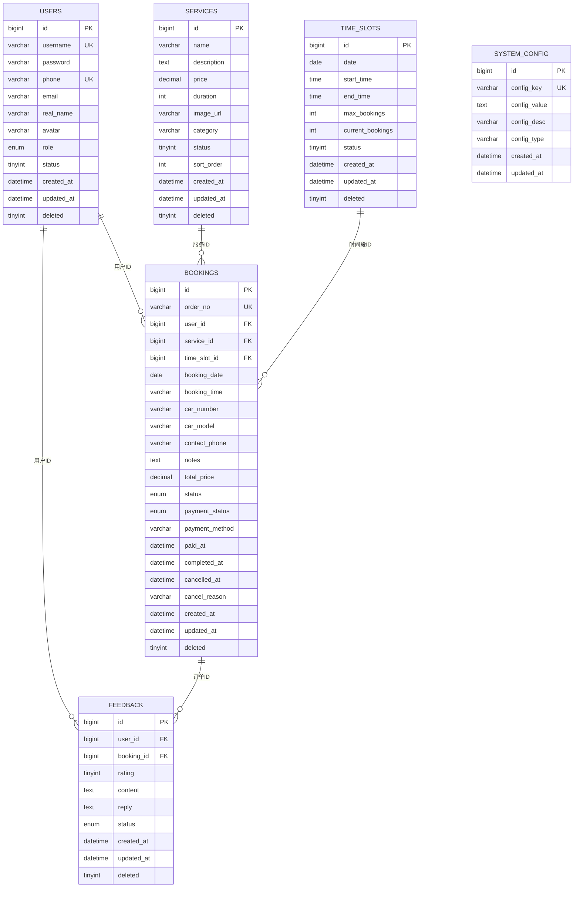
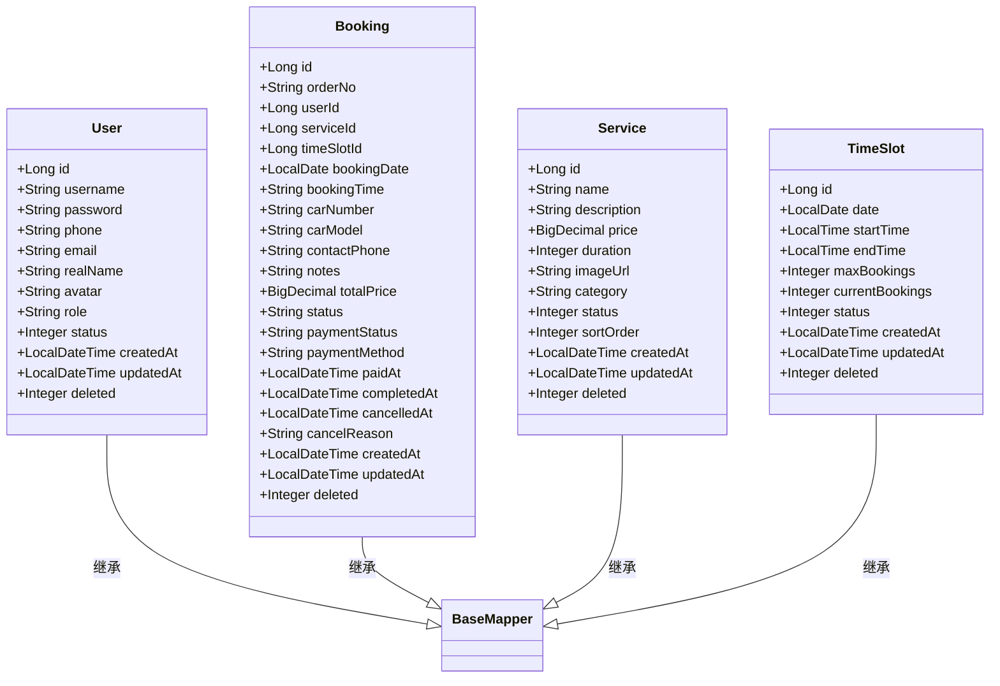
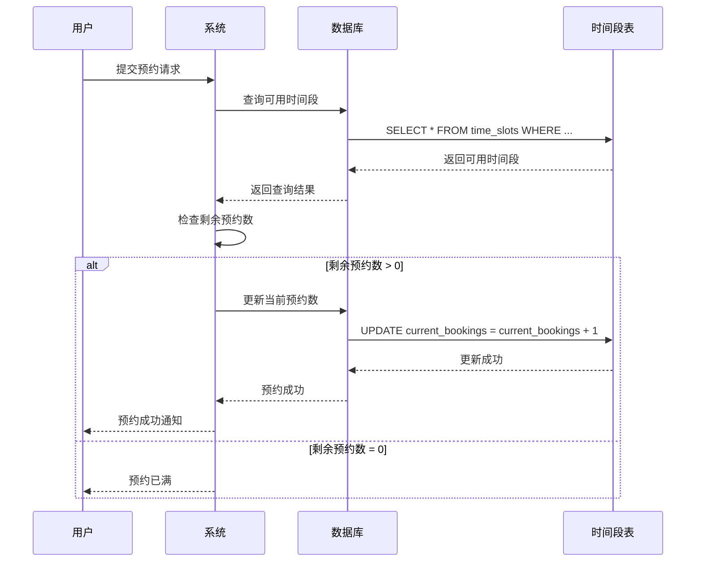
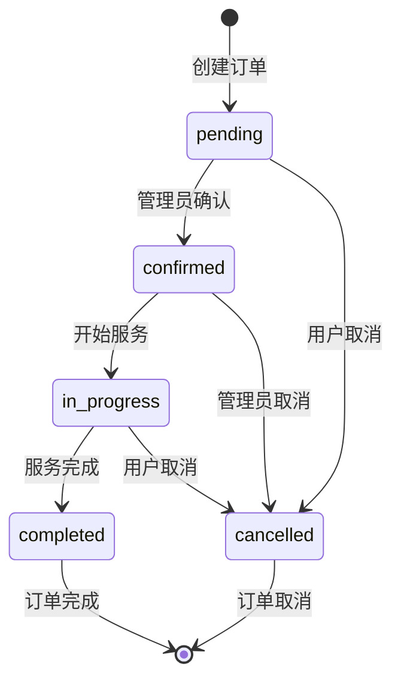

# 表结构说明

<cite>
**本文档引用的文件**
- [init.sql](file://sql/init.sql)
- [User.java](file://backend/src/main/java/com/carwash/entity/User.java)
- [Booking.java](file://backend/src/main/java/com/carwash/entity/Booking.java)
- [Service.java](file://backend/src/main/java/com/carwash/entity/Service.java)
- [TimeSlot.java](file://backend/src/main/java/com/carwash/entity/TimeSlot.java)
- [UserMapper.java](file://backend/src/main/java/com/carwash/mapper/UserMapper.java)
- [BookingMapper.java](file://backend/src/main/java/com/carwash/mapper/BookingMapper.java)
- [ServiceMapper.java](file://backend/src/main/java/com/carwash/mapper/ServiceMapper.java)
- [TimeSlotMapper.java](file://backend/src/main/java/com/carwash/mapper/TimeSlotMapper.java)
- [AppointmentStatus.java](file://backend/src/main/java/com/carwash/common/enums/AppointmentStatus.java)
- [Constants.java](file://backend/src/main/java/com/carwash/common/constants/Constants.java)
</cite>

## 目录
1. [概述](#概述)
2. [数据库架构总览](#数据库架构总览)
3. [核心表结构详解](#核心表结构详解)
4. [MyBatis Plus映射关系](#mybatis-plus映射关系)
5. [并发控制机制](#并发控制机制)
6. [索引设计与性能优化](#索引设计与性能优化)
7. [业务语义分析](#业务语义分析)
8. [典型查询场景](#典型查询场景)

## 概述

本文档详细解析汽车洗车服务预约系统的数据库表结构设计，重点关注init.sql中定义的核心表结构。系统采用MySQL数据库，使用MyBatis Plus作为ORM框架，实现了完整的CRUD操作和复杂的业务逻辑支持。

### 设计原则
- **规范化设计**：遵循数据库设计范式，避免数据冗余
- **业务导向**：表结构紧密贴合洗车服务业务流程
- **性能优化**：合理设计索引，支持高频查询场景
- **可扩展性**：预留扩展字段，支持业务发展需求

## 数据库架构总览



**图表来源**
- [init.sql](file://sql/init.sql#L21-L147)

## 核心表结构详解

### 1. 用户表 (users)

用户表是系统的基础表，存储用户基本信息和权限信息。

#### 字段设计分析

| 字段名 | 类型 | 约束 | 业务语义 |
|--------|------|------|----------|
| `id` | bigint | PRIMARY KEY, AUTO_INCREMENT | 用户唯一标识符 |
| `username` | varchar(50) | NOT NULL, UNIQUE | 用户名，用于登录 |
| `password` | varchar(255) | NOT NULL | 加密后的密码 |
| `phone` | varchar(20) | UNIQUE | 手机号码，支持国际格式 |
| `email` | varchar(100) | - | 邮箱地址 |
| `real_name` | varchar(200) | - | 真实姓名 |
| `avatar` | varchar(255) | - | 头像图片URL |
| `role` | enum('user','admin') | DEFAULT 'user' | 用户角色：普通用户或管理员 |
| `status` | tinyint | DEFAULT '1' | 用户状态：0-禁用，1-启用 |
| `created_at` | datetime | DEFAULT CURRENT_TIMESTAMP | 创建时间 |
| `updated_at` | datetime | DEFAULT CURRENT_TIMESTAMP ON UPDATE CURRENT_TIMESTAMP | 更新时间 |
| `deleted` | tinyint | DEFAULT '0' | 逻辑删除标记 |

#### 关键设计考量
- **角色分离**：通过`role`字段区分普通用户和管理员权限
- **状态管理**：`status`字段支持用户账户的启用/禁用
- **逻辑删除**：`deleted`字段实现软删除，保护数据完整性
- **索引优化**：为`username`和`phone`字段建立唯一索引，确保数据唯一性

**节来源**
- [init.sql](file://sql/init.sql#L21-L39)
- [User.java](file://backend/src/main/java/com/carwash/entity/User.java#L20-L91)

### 2. 服务项目表 (services)

服务项目表定义了洗车服务的各种类型和规格。

#### 字段设计分析

| 字段名 | 类型 | 约束 | 业务语义 |
|--------|------|------|----------|
| `id` | bigint | PRIMARY KEY, AUTO_INCREMENT | 服务唯一标识符 |
| `name` | varchar(100) | NOT NULL | 服务名称 |
| `description` | text | - | 服务详细描述 |
| `price` | decimal(10,2) | NOT NULL | 服务价格 |
| `duration` | int | NOT NULL | 服务时长（分钟） |
| `image_url` | varchar(255) | - | 服务图片URL |
| `category` | varchar(50) | - | 服务分类 |
| `status` | tinyint | DEFAULT '1' | 服务状态：0-下架，1-上架 |
| `sort_order` | int | DEFAULT '0' | 排序权重 |
| `created_at` | datetime | DEFAULT CURRENT_TIMESTAMP | 创建时间 |
| `updated_at` | datetime | DEFAULT CURRENT_TIMESTAMP ON UPDATE CURRENT_TIMESTAMP | 更新时间 |
| `deleted` | tinyint | DEFAULT '0' | 逻辑删除标记 |

#### 关键设计考量
- **分类管理**：`category`字段支持服务分组展示
- **动态定价**：`price`字段支持不同服务的价格设置
- **时长计算**：`duration`字段用于预约系统的时间规划
- **排序机制**：`sort_order`字段支持服务的优先级展示

**节来源**
- [init.sql](file://sql/init.sql#L42-L59)
- [Service.java](file://backend/src/main/java/com/carwash/entity/Service.java#L21-L92)

### 3. 时间段表 (time_slots)

时间段表是预约系统的核心，定义了可预约的时间段。

#### 字段设计分析

| 字段名 | 类型 | 约束 | 业务语义 |
|--------|------|------|----------|
| `id` | bigint | PRIMARY KEY, AUTO_INCREMENT | 时间段唯一标识符 |
| `date` | date | NOT NULL | 预约日期 |
| `start_time` | time | NOT NULL | 开始时间 |
| `end_time` | time | NOT NULL | 结束时间 |
| `max_bookings` | int | DEFAULT '1' | 最大预约数 |
| `current_bookings` | int | DEFAULT '0' | 当前预约数 |
| `status` | tinyint | DEFAULT '1' | 状态：0-不可用，1-可用 |
| `created_at` | datetime | DEFAULT CURRENT_TIMESTAMP | 创建时间 |
| `updated_at` | datetime | DEFAULT CURRENT_TIMESTAMP ON UPDATE CURRENT_TIMESTAMP | 更新时间 |
| `deleted` | tinyint | DEFAULT '0' | 逻辑删除标记 |

#### 并发控制机制

**关键字段设计**：
- **capacity字段**：`max_bookings`定义时间段的最大预约容量
- **remaining字段**：`current_bookings`跟踪当前已预约数量
- **并发安全**：通过数据库事务和乐观锁机制保证并发安全性

**节来源**
- [init.sql](file://sql/init.sql#L62-L77)
- [TimeSlot.java](file://backend/src/main/java/com/carwash/entity/TimeSlot.java#L22-L81)

### 4. 预约订单表 (bookings)

预约订单表记录用户的完整预约信息和状态流转。

#### 字段设计分析

| 字段名 | 类型 | 约束 | 业务语义 |
|--------|------|------|----------|
| `id` | bigint | PRIMARY KEY, AUTO_INCREMENT | 订单唯一标识符 |
| `order_no` | varchar(32) | NOT NULL, UNIQUE | 订单号 |
| `user_id` | bigint | NOT NULL, FK | 用户ID |
| `service_id` | bigint | NOT NULL, FK | 服务ID |
| `time_slot_id` | bigint | NOT NULL, FK | 时间段ID |
| `booking_date` | date | NOT NULL | 预约日期 |
| `booking_time` | varchar(20) | NOT NULL | 预约时间 |
| `car_number` | varchar(20) | - | 车牌号 |
| `car_model` | varchar(50) | - | 车型 |
| `contact_phone` | varchar(20) | NOT NULL | 联系电话 |
| `notes` | text | - | 备注信息 |
| `total_price` | decimal(10,2) | NOT NULL | 总价格 |
| `status` | enum | DEFAULT 'pending' | 订单状态 |
| `payment_status` | enum | DEFAULT 'unpaid' | 支付状态 |
| `payment_method` | varchar(20) | - | 支付方式 |
| `paid_at` | datetime | - | 支付时间 |
| `completed_at` | datetime | - | 完成时间 |
| `cancelled_at` | datetime | - | 取消时间 |
| `cancel_reason` | varchar(255) | - | 取消原因 |
| `created_at` | datetime | DEFAULT CURRENT_TIMESTAMP | 创建时间 |
| `updated_at` | datetime | DEFAULT CURRENT_TIMESTAMP ON UPDATE CURRENT_TIMESTAMP | 更新时间 |
| `deleted` | tinyint | DEFAULT '0' | 逻辑删除标记 |

#### 状态枚举设计

**订单状态 (`status`)**：
- `pending`：待确认 - 新创建的预约等待确认
- `confirmed`：已确认 - 管理员确认预约
- `in_progress`：服务中 - 正在提供服务
- `completed`：已完成 - 服务完成
- `cancelled`：已取消 - 用户或管理员取消预约

**支付状态 (`payment_status`)**：
- `unpaid`：未支付 - 订单创建但未支付
- `paid`：已支付 - 支付成功
- `refunded`：已退款 - 已完成退款流程

**节来源**
- [init.sql](file://sql/init.sql#L80-L114)
- [Booking.java](file://backend/src/main/java/com/carwash/entity/Booking.java#L22-L153)

### 5. 系统配置表 (system_config)

系统配置表存储全局系统参数。

#### 字段设计分析

| 字段名 | 类型 | 约束 | 业务语义 |
|--------|------|------|----------|
| `id` | bigint | PRIMARY KEY, AUTO_INCREMENT | 配置项唯一标识符 |
| `config_key` | varchar(100) | NOT NULL, UNIQUE | 配置键名 |
| `config_value` | text | - | 配置值 |
| `config_desc` | varchar(255) | - | 配置描述 |
| `config_type` | varchar(20) | DEFAULT 'string' | 配置类型 |
| `created_at` | datetime | DEFAULT CURRENT_TIMESTAMP | 创建时间 |
| `updated_at` | datetime | DEFAULT CURRENT_TIMESTAMP ON UPDATE CURRENT_TIMESTAMP | 更新时间 |

**节来源**
- [init.sql](file://sql/init.sql#L117-L127)

### 6. 用户反馈表 (feedback)

用户反馈表收集用户对服务的评价和建议。

#### 字段设计分析

| 字段名 | 类型 | 约束 | 业务语义 |
|--------|------|------|----------|
| `id` | bigint | PRIMARY KEY, AUTO_INCREMENT | 反馈唯一标识符 |
| `user_id` | bigint | FK | 用户ID |
| `booking_id` | bigint | FK | 订单ID |
| `rating` | tinyint | - | 评分（1-5） |
| `content` | text | - | 反馈内容 |
| `reply` | text | - | 回复内容 |
| `status` | enum | DEFAULT 'pending' | 状态 |
| `created_at` | datetime | DEFAULT CURRENT_TIMESTAMP | 创建时间 |
| `updated_at` | datetime | DEFAULT CURRENT_TIMESTAMP ON UPDATE CURRENT_TIMESTAMP | 更新时间 |
| `deleted` | tinyint | DEFAULT '0' | 逻辑删除标记 |

**节来源**
- [init.sql](file://sql/init.sql#L130-L147)

## MyBatis Plus映射关系

### 实体类与数据库表的映射

系统采用MyBatis Plus框架，通过注解实现实体类与数据库表的映射关系。

#### 映射规则



**图表来源**
- [User.java](file://backend/src/main/java/com/carwash/entity/User.java#L17-L190)
- [Booking.java](file://backend/src/main/java/com/carwash/entity/Booking.java#L19-L333)
- [Service.java](file://backend/src/main/java/com/carwash/entity/Service.java#L18-L191)
- [TimeSlot.java](file://backend/src/main/java/com/carwash/entity/TimeSlot.java#L19-L164)

### 注解说明

#### @TableName
- **作用**：指定实体类对应的数据库表名
- **示例**：`@TableName("users")` -> `users`表

#### @TableId
- **作用**：标识主键字段
- **属性**：`type = IdType.AUTO`表示自增主键

#### @TableField
- **作用**：映射普通字段
- **属性**：`fill`用于自动填充策略

#### @TableLogic
- **作用**：标识逻辑删除字段
- **效果**：自动添加`WHERE deleted = 0`条件

**节来源**
- [User.java](file://backend/src/main/java/com/carwash/entity/User.java#L17-L190)
- [Booking.java](file://backend/src/main/java/com/carwash/entity/Booking.java#L19-L333)
- [Service.java](file://backend/src/main/java/com/carwash/entity/Service.java#L18-L191)
- [TimeSlot.java](file://backend/src/main/java/com/carwash/entity/TimeSlot.java#L19-L164)

## 并发控制机制

### 时间段预约并发控制

系统通过`time_slots`表的`max_bookings`和`current_bookings`字段实现并发控制。

#### 并发控制流程



**图表来源**
- [TimeSlotMapper.java](file://backend/src/main/java/com/carwash/mapper/TimeSlotMapper.java#L37-L50)

#### 并发控制策略

1. **乐观锁机制**：通过`current_bookings`字段的原子操作保证并发安全
2. **边界检查**：在更新前检查`current_bookings`是否小于`max_bookings`
3. **事务保证**：整个预约过程在一个数据库事务中执行

**节来源**
- [TimeSlotMapper.java](file://backend/src/main/java/com/carwash/mapper/TimeSlotMapper.java#L37-L50)

### 订单状态并发控制

订单状态变更通过枚举字段和业务逻辑控制并发访问。

#### 状态转换规则



**节来源**
- [AppointmentStatus.java](file://backend/src/main/java/com/carwash/common/enums/AppointmentStatus.java#L10-L15)

## 索引设计与性能优化

### 主要索引设计

#### 用户表索引
- **PRIMARY KEY (id)**：主键索引，唯一标识用户
- **UNIQUE (username)**：用户名唯一索引
- **UNIQUE (phone)**：手机号唯一索引
- **INDEX (role)**：按角色查询索引
- **INDEX (status)**：按状态查询索引

#### 服务表索引
- **PRIMARY KEY (id)**：主键索引
- **INDEX (category)**：按分类查询索引
- **INDEX (status)**：按状态查询索引
- **INDEX (sort_order)**：排序索引

#### 时间段表索引
- **PRIMARY KEY (id)**：主键索引
- **UNIQUE (date,start_time,end_time)**：时间段唯一索引
- **INDEX (date)**：按日期查询索引
- **INDEX (status)**：按状态查询索引

#### 预约表索引
- **PRIMARY KEY (id)**：主键索引
- **UNIQUE (order_no)**：订单号唯一索引
- **INDEX (user_id)**：按用户查询索引
- **INDEX (service_id)**：按服务查询索引
- **INDEX (time_slot_id)**：按时间段查询索引
- **INDEX (booking_date)**：按日期查询索引
- **INDEX (status)**：按状态查询索引
- **INDEX (payment_status)**：按支付状态查询索引

### 性能优化策略

1. **复合索引**：为经常一起查询的字段组合创建复合索引
2. **覆盖索引**：确保查询可以仅通过索引返回结果
3. **分区表**：对于历史数据，考虑按时间分区
4. **查询优化**：避免全表扫描，使用合适的索引

**节来源**
- [init.sql](file://sql/init.sql#L341-L343)

## 业务语义分析

### 数据字典

#### 用户角色 (role)
- `user`：普通用户，只能查看和预约服务
- `admin`：管理员，可以管理服务、预约和系统配置

#### 服务状态 (status)
- `0`：下架 - 服务暂时不可用
- `1`：上架 - 服务正常可用

#### 时间段状态 (status)
- `0`：不可用 - 时间段被禁用
- `1`：可用 - 时间段可以预约

#### 订单状态 (status)
- `pending`：待确认 - 新订单等待处理
- `confirmed`：已确认 - 订单已确认
- `in_progress`：服务中 - 正在提供服务
- `completed`：已完成 - 服务完成
- `cancelled`：已取消 - 订单被取消

#### 支付状态 (payment_status)
- `unpaid`：未支付 - 订单创建但未支付
- `paid`：已支付 - 支付成功
- `refunded`：已退款 - 已完成退款

**节来源**
- [Constants.java](file://backend/src/main/java/com/carwash/common/constants/Constants.java#L27-L53)

### 业务约束

1. **时间约束**：预约时间必须在工作时间内
2. **容量约束**：每个时间段的预约人数不能超过限制
3. **重复约束**：同一用户不能在同一时间段重复预约
4. **关联约束**：订单必须关联有效的用户、服务和时间段

## 典型查询场景

### 1. 用户登录查询

**SQL生成逻辑**：
```sql
SELECT * 
FROM users 
WHERE (username = #{identifier} OR phone = #{identifier}) 
AND deleted = 0
```

**MyBatis Plus映射**：
```java
@Select("SELECT * FROM users WHERE (username = #{identifier} OR phone = #{identifier}) AND deleted = 0")
User findByUsernameOrPhone(@Param("identifier") String identifier);
```

**节来源**
- [UserMapper.java](file://backend/src/main/java/com/carwash/mapper/UserMapper.java#L21-L22)

### 2. 可用时间段查询

**SQL生成逻辑**：
```sql
SELECT * 
FROM time_slots 
WHERE date = #{date} 
AND status = 1 
AND deleted = 0 
ORDER BY start_time ASC
```

**MyBatis Plus映射**：
```java
@Select("SELECT * FROM time_slots WHERE date = #{date} AND status = 1 AND deleted = 0 ORDER BY start_time ASC")
List<TimeSlot> selectAvailableByDate(@Param("date") LocalDate date);
```

**节来源**
- [TimeSlotMapper.java](file://backend/src/main/java/com/carwash/mapper/TimeSlotMapper.java#L25-L26)

### 3. 用户订单查询

**SQL生成逻辑**：
```sql
SELECT * 
FROM bookings 
WHERE user_id = #{userId} 
AND deleted = 0 
ORDER BY created_at DESC
```

**MyBatis Plus映射**：
```java
@Select("SELECT * FROM bookings WHERE user_id = #{userId} AND deleted = 0 ORDER BY created_at DESC")
IPage<Booking> selectUserBookings(Page<Booking> page, @Param("userId") Long userId);
```

**节来源**
- [BookingMapper.java](file://backend/src/main/java/com/carwash/mapper/BookingMapper.java#L28-L29)

### 4. 服务统计查询

**SQL生成逻辑**：
```sql
SELECT COUNT(*) 
FROM services 
WHERE status = 1 
AND deleted = 0
```

**MyBatis Plus映射**：
```java
@Select("SELECT COUNT(*) FROM services WHERE status = 1 AND deleted = 0")
int countAvailableServices();
```

**节来源**
- [ServiceMapper.java](file://backend/src/main/java/com/carwash/mapper/ServiceMapper.java#L62-L63)

### 5. 收入统计查询

**SQL生成逻辑**：
```sql
SELECT COALESCE(SUM(total_price), 0) 
FROM bookings 
WHERE status = 'completed' 
AND deleted = 0
```

**MyBatis Plus映射**：
```java
@Select("SELECT COALESCE(SUM(total_price), 0) FROM bookings WHERE status = 'completed' AND deleted = 0")
BigDecimal getTotalRevenue();
```

**节来源**
- [BookingMapper.java](file://backend/src/main/java/com/carwash/mapper/BookingMapper.java#L94-L95)

## 总结

本文档详细分析了汽车洗车服务预约系统的数据库表结构设计，涵盖了从基础表到核心业务表的完整设计思路。系统采用了规范化设计，通过合理的字段设计、索引优化和并发控制机制，实现了高性能、高可靠性的业务支撑。

### 设计亮点

1. **业务导向**：表结构紧密贴合洗车服务业务流程
2. **性能优化**：合理设计索引，支持高频查询场景
3. **并发安全**：通过多种机制保证数据一致性
4. **可扩展性**：预留扩展字段，支持业务发展需求
5. **数据完整性**：通过约束和逻辑删除保护数据

### 技术特色

- **MyBatis Plus集成**：简化数据访问层开发
- **枚举类型**：清晰表达业务状态
- **软删除机制**：保护重要业务数据
- **自动填充**：减少重复代码

这套表结构设计为系统的稳定运行提供了坚实的数据基础，能够有效支撑汽车洗车服务预约业务的日常运营和未来发展需求。