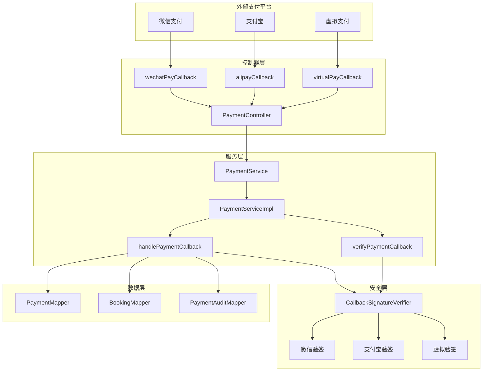
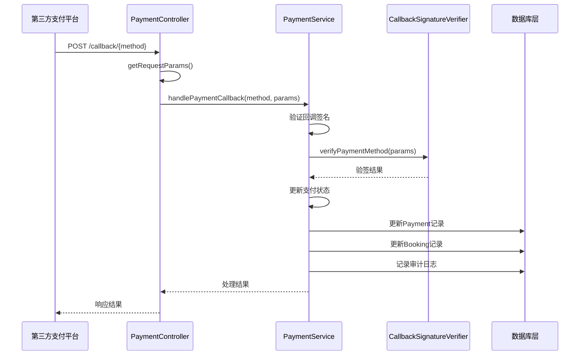
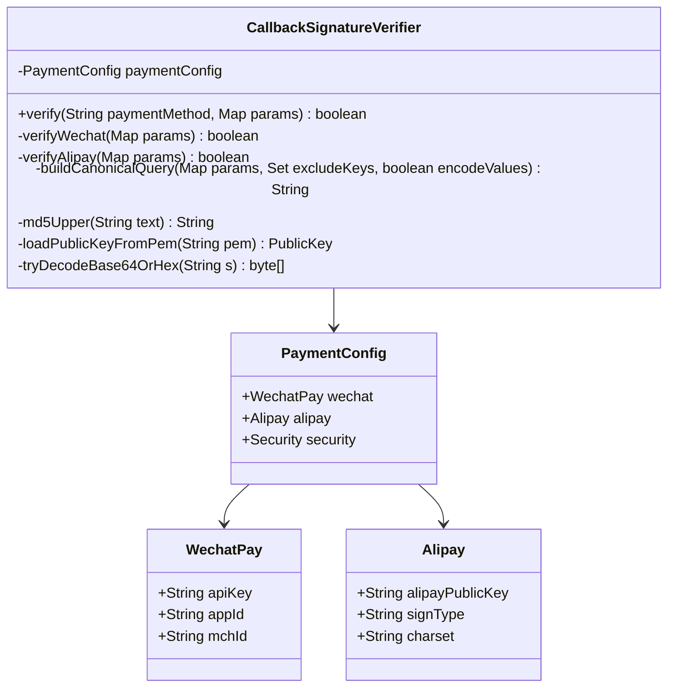
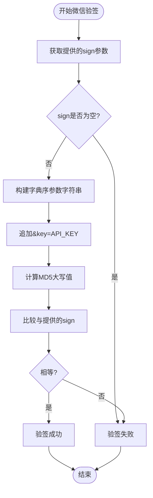
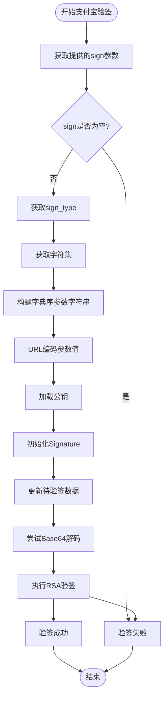
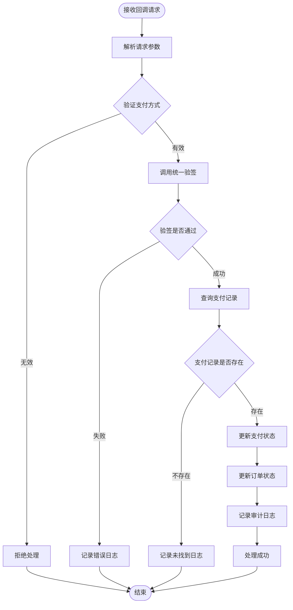
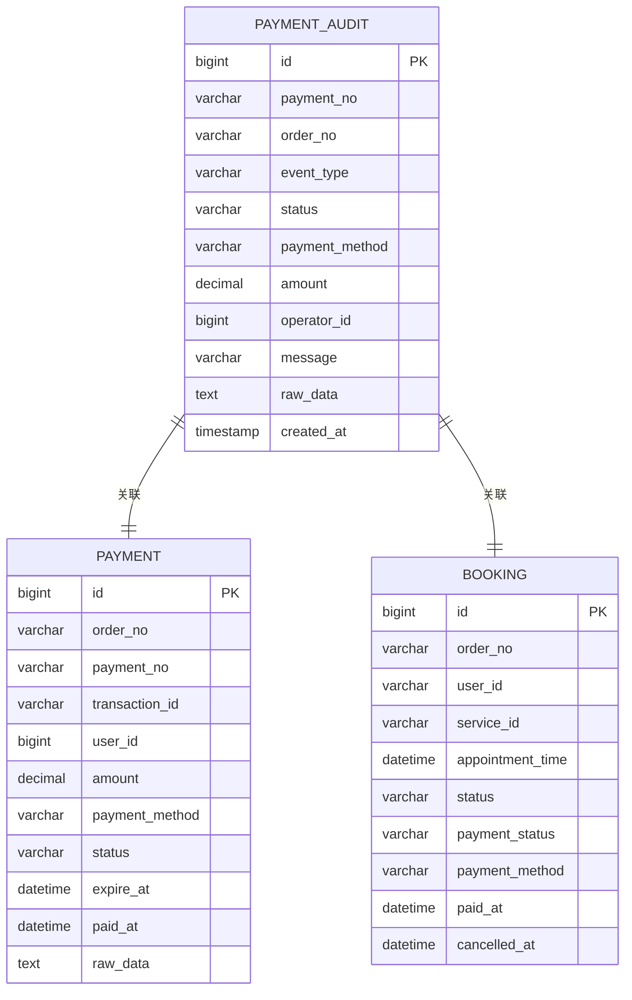
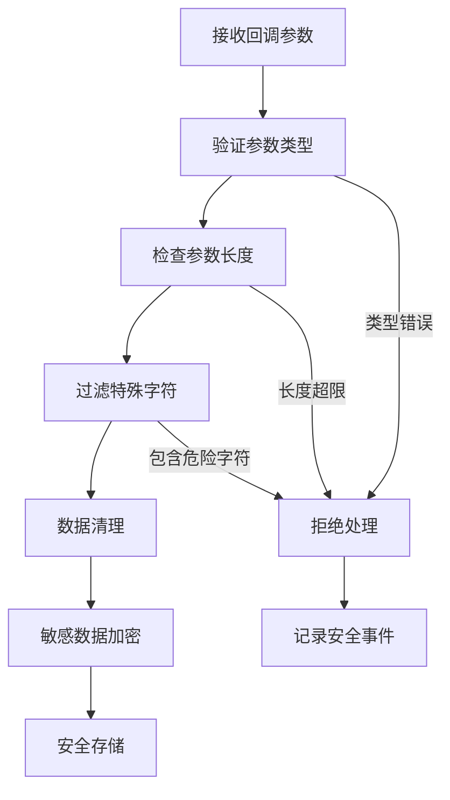
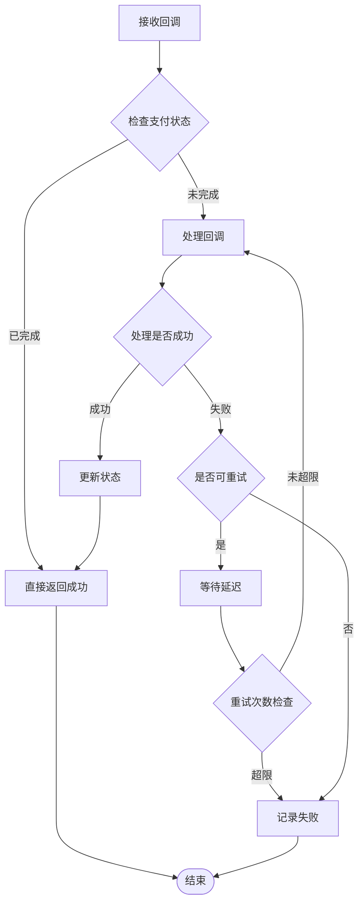

# 支付回调处理机制详细解析

<cite>
**本文档引用的文件**
- [payment-gateway.md](file://backend/docs/payment-gateway.md)
- [CallbackSignatureVerifier.java](file://backend/src/main/java/com/carwash/service/payment/security/CallbackSignatureVerifier.java)
- [PaymentServiceImpl.java](file://backend/src/main/java/com/carwash/service/impl/PaymentServiceImpl.java)
- [PaymentController.java](file://backend/src/main/java/com/carwash/controller/PaymentController.java)
- [PaymentConfig.java](file://backend/src/main/java/com/carwash/config/PaymentConfig.java)
- [WechatPayGateway.java](file://backend/src/main/java/com/carwash/service/payment/WechatPayGateway.java)
- [AlipayGateway.java](file://backend/src/main/java/com/carwash/service/payment/AlipayGateway.java)
- [VirtualPaymentGateway.java](file://backend/src/main/java/com/carwash/service/payment/VirtualPaymentGateway.java)
- [PaymentAudit.java](file://backend/src/main/java/com/carwash/entity/PaymentAudit.java)
- [2025-11-08__create_payment_audit.sql](file://sql/2025-11-08__create_payment_audit.sql)
</cite>

## 目录
1. [概述](#概述)
2. [系统架构](#系统架构)
3. [handlePaymentCallback方法详解](#handlepaymentcallback方法详解)
4. [统一验签组件CallbackSignatureVerifier](#统一验签组件callbacksignatureverifier)
5. [支付网关回调处理](#支付网关回调处理)
6. [回调处理流程](#回调处理流程)
7. [审计与监控](#审计与监控)
8. [安全防护措施](#安全防护措施)
9. [重试机制与幂等性](#重试机制与幂等性)
10. [总结](#总结)

## 概述

支付回调处理机制是汽车洗车服务平台支付系统的核心组件，负责接收并处理来自第三方支付平台的异步通知。该机制确保支付状态的准确性和系统的安全性，通过统一的验签组件和标准化的处理流程，支持微信支付、支付宝等多种支付方式。

系统采用分层架构设计，包含控制器层、服务层、网关层和安全层，每个层次都有明确的职责分工，确保系统的可扩展性和可维护性。

## 系统架构

**图表来源**
- [PaymentController.java](file://backend/src/main/java/com/carwash/controller/PaymentController.java#L131-L180)
- [PaymentServiceImpl.java](file://backend/src/main/java/com/carwash/service/impl/PaymentServiceImpl.java#L170-L228)
- [CallbackSignatureVerifier.java](file://backend/src/main/java/com/carwash/service/payment/security/CallbackSignatureVerifier.java#L35-L46)

## handlePaymentCallback方法详解

`handlePaymentCallback`方法是支付回调处理的核心入口，负责整个回调流程的协调和控制。

### 方法签名与职责

**图表来源**
- [PaymentController.java](file://backend/src/main/java/com/carwash/controller/PaymentController.java#L131-L180)
- [PaymentServiceImpl.java](file://backend/src/main/java/com/carwash/service/impl/PaymentServiceImpl.java#L170-L228)

### 核心处理步骤

1. **日志记录与参数验证**
   - 记录回调处理开始的日志信息
   - 验证支付方式参数的有效性

2. **签名验证**
   - 调用统一验签组件进行签名验证
   - 根据支付方式选择相应的验签算法

3. **支付记录查询**
   - 根据支付流水号查询支付记录
   - 验证支付记录的存在性和有效性

4. **状态更新**
   - 更新支付状态为"paid"
   - 设置交易号和支付时间
   - 记录原始回调数据

5. **订单状态同步**
   - 更新关联订单的支付状态
   - 同步支付方式和支付时间信息

6. **审计记录**
   - 记录验签成功的审计事件
   - 记录支付状态更新的审计事件

**章节来源**
- [PaymentServiceImpl.java](file://backend/src/main/java/com/carwash/service/impl/PaymentServiceImpl.java#L170-L228)

## 统一验签组件CallbackSignatureVerifier

`CallbackSignatureVerifier`是支付回调处理的安全核心，提供统一的签名验证功能，支持多种支付平台的验签算法。

### 组件架构设计

**图表来源**
- [CallbackSignatureVerifier.java](file://backend/src/main/java/com/carwash/service/payment/security/CallbackSignatureVerifier.java#L25-L46)
- [PaymentConfig.java](file://backend/src/main/java/com/carwash/config/PaymentConfig.java#L15-L225)

### 微信支付MD5验签算法

微信支付采用MD5算法进行签名验证，具体实现如下：

#### 验签流程

**图表来源**
- [CallbackSignatureVerifier.java](file://backend/src/main/java/com/carwash/service/payment/security/CallbackSignatureVerifier.java#L52-L61)

#### 实现细节

1. **参数排序**：使用TreeMap对参数进行字典序排序
2. **排除签名**：排除sign参数不参与签名计算
3. **字符串构建**：按key=value格式拼接参数
4. **MD5计算**：使用UTF-8编码计算MD5值并转换为大写

### 支付宝RSA2验签算法

支付宝采用RSA2算法进行签名验证，支持Base64和十六进制两种编码格式。

#### 验签流程

**图表来源**
- [CallbackSignatureVerifier.java](file://backend/src/main/java/com/carwash/service/payment/security/CallbackSignatureVerifier.java#L67-L93)

#### 实现细节

1. **参数处理**：排除sign和sign_type参数
2. **URL编码**：对参数值进行URL编码
3. **公钥加载**：从PEM格式公钥字符串中提取公钥
4. **签名算法**：支持SHA256withRSA和SHA1withRSA
5. **编码兼容**：自动识别Base64和十六进制编码

**章节来源**
- [CallbackSignatureVerifier.java](file://backend/src/main/java/com/carwash/service/payment/security/CallbackSignatureVerifier.java#L49-L93)

## 支付网关回调处理

系统支持多种支付网关的回调处理，每种网关都有其特定的处理逻辑和验签方式。

### 微信支付回调处理

微信支付回调处理主要在`WechatPayGateway`中实现，虽然具体的回调处理逻辑在模拟实现中，但签名验证部分已经完整实现。

#### 签名生成算法

微信支付采用以下签名生成流程：

1. **参数排序**：使用TreeMap按字典序排列参数
2. **字符串构建**：排除sign参数，按key=value格式拼接
3. **追加密钥**：在字符串末尾追加API密钥
4. **MD5计算**：计算最终字符串的MD5值并转换为大写

### 支付宝回调处理

支付宝回调处理同样在`AlipayGateway`中实现，签名验证部分已经完整实现。

#### 签名生成算法

支付宝采用以下签名生成流程：

1. **参数排序**：使用TreeMap按字典序排列参数
2. **字符串构建**：排除sign参数，按key=value格式拼接
3. **SHA256计算**：计算最终字符串的SHA256值
4. **十六进制编码**：将字节数组转换为十六进制字符串

### 虚拟支付回调处理

虚拟支付主要用于开发和测试环境，其回调处理相对简单：

1. **始终通过**：虚拟支付的验签始终返回true
2. **模拟功能**：提供完整的支付生命周期模拟
3. **开发友好**：简化开发和调试流程

**章节来源**
- [WechatPayGateway.java](file://backend/src/main/java/com/carwash/service/payment/WechatPayGateway.java#L193-L225)
- [AlipayGateway.java](file://backend/src/main/java/com/carwash/service/payment/AlipayGateway.java#L216-L246)
- [VirtualPaymentGateway.java](file://backend/src/main/java/com/carwash/service/payment/VirtualPaymentGateway.java#L84-L85)

## 回调处理流程

完整的回调处理流程包含多个关键步骤，确保支付状态的准确更新和系统的安全性。

### 流程图

**图表来源**
- [PaymentServiceImpl.java](file://backend/src/main/java/com/carwash/service/impl/PaymentServiceImpl.java#L170-L228)

### 参数解析与验证

回调处理的第一步是解析和验证请求参数：

1. **参数收集**：从HTTP请求中提取所有参数
2. **参数验证**：检查必需参数的完整性
3. **格式验证**：验证参数格式的正确性

### 签名验证策略

系统采用双重验证策略：

1. **优先使用统一验签**：通过`CallbackSignatureVerifier`进行验签
2. **兜底机制**：如果统一验签不可用，则使用网关内部验签
3. **异常处理**：捕获并记录验签过程中的异常

### 支付状态更新

支付状态更新是一个原子性操作，确保数据一致性：

1. **状态设置**：将支付状态设置为"paid"
2. **交易信息**：设置交易号和支付时间
3. **数据记录**：记录原始回调数据用于审计

### 订单状态同步

支付状态更新后需要同步更新关联订单的状态：

1. **订单查询**：根据订单号查询关联订单
2. **状态更新**：将订单支付状态设置为"paid"
3. **信息同步**：同步支付方式和支付时间信息

**章节来源**
- [PaymentServiceImpl.java](file://backend/src/main/java/com/carwash/service/impl/PaymentServiceImpl.java#L170-L228)

## 审计与监控

系统实现了完整的审计和监控机制，确保支付回调处理的可追溯性和系统的可观测性。

### 审计日志设计

**图表来源**
- [2025-11-08__create_payment_audit.sql](file://sql/2025-11-08__create_payment_audit.sql#L1-L19)

### 审计事件类型

系统定义了多种审计事件类型：

| 事件类型 | 描述 | 触发时机 |
|---------|------|----------|
| CALLBACK_VERIFIED | 回调验签通过 | 验签成功后 |
| CALLBACK_UPDATE | 回调更新支付状态 | 支付状态更新后 |
| STATUS_CHANGE | 第三方状态变更 | 第三方查询状态变化时 |
| CREATE | 创建支付记录 | 支付订单创建时 |
| QUERY_STATUS | 查询第三方状态 | 第三方状态查询时 |
| REFUND_REQUEST | 发起退款请求 | 退款请求提交时 |
| REFUND_SUCCESS | 退款成功 | 退款处理成功时 |
| REFUND_FAILED | 退款失败 | 退款处理失败时 |

### 监控指标

系统集成了多种监控指标：

1. **成功率监控**：跟踪回调处理的成功率
2. **响应时间监控**：监控回调处理的响应时间
3. **错误率监控**：跟踪各类错误的发生频率
4. **流量监控**：监控不同支付方式的回调流量

### 日志记录策略

系统采用分级日志记录策略：

1. **INFO级别**：记录正常的业务流程
2. **WARN级别**：记录潜在的问题和异常情况
3. **ERROR级别**：记录严重的错误和故障
4. **DEBUG级别**：记录详细的调试信息

**章节来源**
- [PaymentServiceImpl.java](file://backend/src/main/java/com/carwash/service/impl/PaymentServiceImpl.java#L455-L475)
- [2025-11-08__create_payment_audit.sql](file://sql/2025-11-08__create_payment_audit.sql#L1-L19)

## 安全防护措施

支付回调处理涉及敏感的财务信息，系统实施了多层次的安全防护措施。

### 签名验证安全

1. **算法强度**：使用强密码学算法（MD5、RSA2）
2. **密钥管理**：安全存储和管理API密钥
3. **参数过滤**：严格过滤和验证请求参数
4. **时间戳验证**：防止重放攻击

### 输入验证与过滤

### 访问控制

1. **IP白名单**：限制回调请求的来源IP
2. **签名验证**：确保请求的真实性和完整性
3. **速率限制**：防止恶意请求和DDoS攻击
4. **会话管理**：管理回调处理的会话状态

### 数据保护

1. **传输加密**：使用HTTPS确保数据传输安全
2. **存储加密**：对敏感数据进行加密存储
3. **访问审计**：记录所有数据访问行为
4. **备份恢复**：建立完善的数据备份机制

**章节来源**
- [CallbackSignatureVerifier.java](file://backend/src/main/java/com/carwash/service/payment/security/CallbackSignatureVerifier.java#L52-L93)

## 重试机制与幂等性

为了应对网络不稳定和系统异常，系统实现了完善的重试机制和幂等性保障。

### 幂等性设计原则

1. **唯一标识**：每个支付记录都有唯一的标识符
2. **状态检查**：处理前检查支付状态是否已完成
3. **重复检测**：检测和处理重复的回调请求
4. **事务保证**：使用数据库事务确保操作的原子性

### 重试策略

### 错误处理机制

1. **分类处理**：根据错误类型采取不同的处理策略
2. **降级处理**：在系统异常时提供降级服务
3. **人工干预**：对于复杂错误提供人工处理通道
4. **监控告警**：建立完善的监控和告警机制

### 数据一致性保障

1. **事务隔离**：使用适当的事务隔离级别
2. **锁机制**：在关键操作上使用排他锁
3. **补偿机制**：提供数据不一致时的补偿方案
4. **定期校验**：定期检查和修复数据一致性问题

**章节来源**
- [PaymentServiceImpl.java](file://backend/src/main/java/com/carwash/service/impl/PaymentServiceImpl.java#L170-L228)

## 总结

汽车洗车服务平台的支付回调处理机制通过统一的架构设计和安全防护措施，实现了高效、可靠、安全的支付状态同步功能。系统的主要特点包括：

### 技术优势

1. **统一架构**：通过`CallbackSignatureVerifier`实现统一的验签机制
2. **多平台支持**：支持微信支付、支付宝、虚拟支付等多种支付方式
3. **安全可靠**：采用强密码学算法和多重安全防护措施
4. **可观测性**：完善的审计和监控机制

### 设计亮点

1. **分层架构**：清晰的分层设计确保系统的可维护性
2. **扩展性强**：基于接口的设计便于添加新的支付方式
3. **容错机制**：完善的错误处理和重试机制
4. **幂等性保障**：确保重复处理不会产生副作用

### 应用价值

该支付回调处理机制为汽车洗车服务平台提供了稳定可靠的支付基础设施，支持业务的快速发展和扩展。通过标准化的接口设计和完善的监控体系，确保了支付流程的透明性和可追溯性，为用户提供安全可信的支付体验。

系统的设计充分考虑了生产环境的需求，在保证功能完整性的同时，注重性能优化和安全防护，为企业的数字化转型提供了坚实的技术支撑。