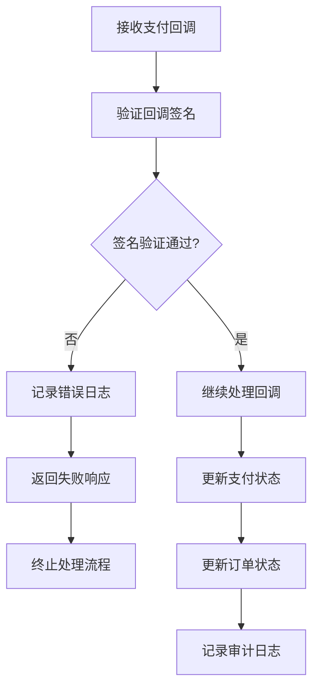
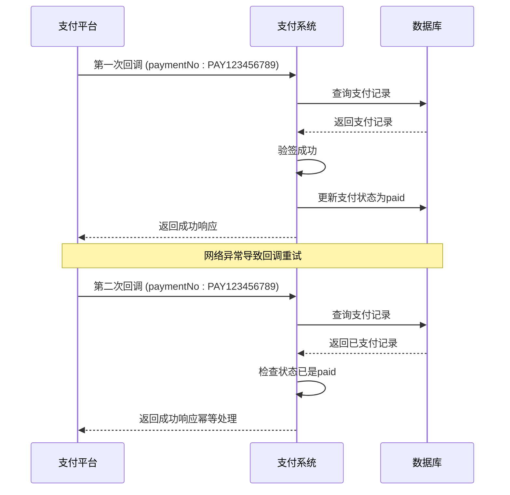
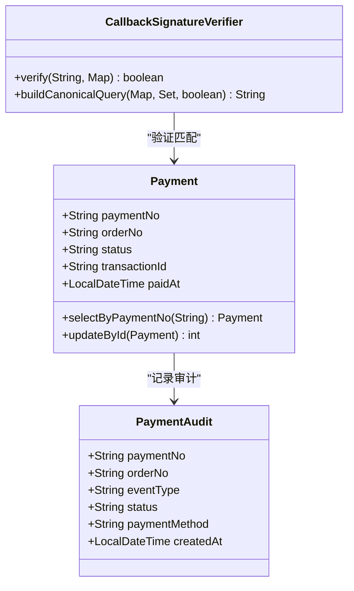
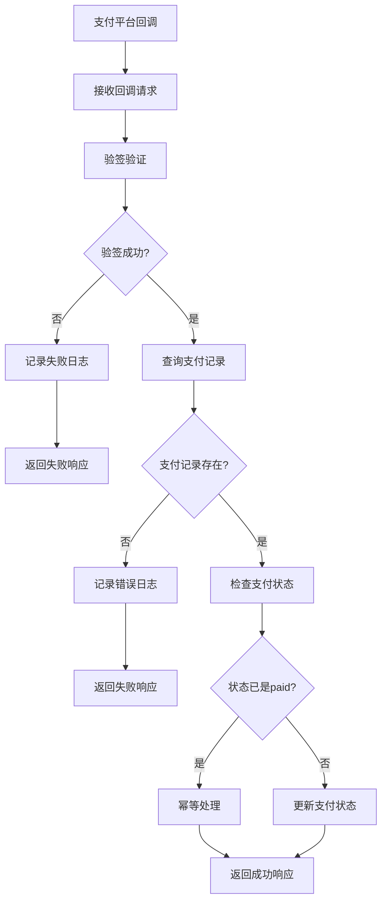
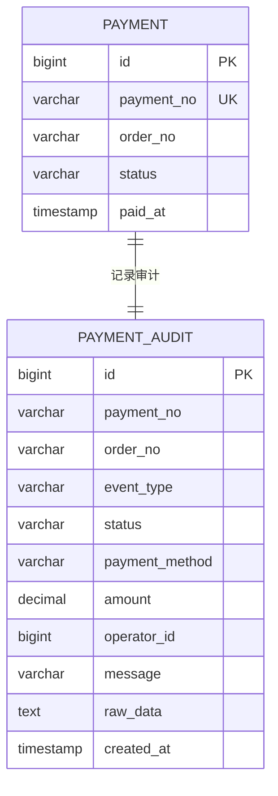
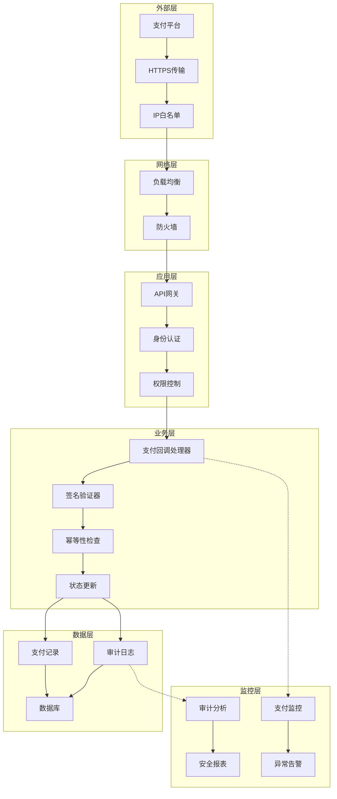

# 支付回调处理安全防护机制

<cite>
**本文档中引用的文件**
- [CallbackSignatureVerifier.java](file://backend/src/main/java/com/carwash/service/payment/security/CallbackSignatureVerifier.java)
- [PaymentServiceImpl.java](file://backend/src/main/java/com/carwash/service/impl/PaymentServiceImpl.java)
- [PaymentController.java](file://backend/src/main/java/com/carwash/controller/PaymentController.java)
- [PaymentAudit.java](file://backend/src/main/java/com/carwash/entity/PaymentAudit.java)
- [PaymentConfig.java](file://backend/src/main/java/com/carwash/config/PaymentConfig.java)
- [application-payment.yml](file://backend/src/main/resources/application-payment.yml)
- [CallbackSignatureVerifierTest.java](file://backend/src/test/java/com/carwash/service/payment/security/CallbackSignatureVerifierTest.java)
- [NotificationConfig.java](file://backend/src/main/java/com/carwash/config/NotificationConfig.java)
- [PaymentMonitor.java](file://backend/src/main/java/com/carwash/monitor/PaymentMonitor.java)
</cite>

## 目录
1. [概述](#概述)
2. [验签失败处理策略](#验签失败处理策略)
3. [回调处理幂等性设计](#回调处理幂等性设计)
4. [支付流水号精确匹配机制](#支付流水号精确匹配机制)
5. [回调重试机制实现](#回调重试机制实现)
6. [敏感信息安全管理](#敏感信息安全管理)
7. [审计日志系统](#审计日志系统)
8. [安全防护架构](#安全防护架构)
9. [最佳实践建议](#最佳实践建议)

## 概述

支付回调处理的安全防护机制是保障支付系统安全运行的核心组件。本系统采用了多层次的安全防护策略，包括严格的验签机制、幂等性设计、精确的支付记录匹配、完善的审计日志等，确保支付回调的安全性和可靠性。

## 验签失败处理策略

### 立即终止处理流程

系统在接收到支付回调时，首先执行严格的签名验证。一旦验签失败，系统会立即终止整个处理流程，并返回明确的失败响应。

**图表来源**
- [PaymentServiceImpl.java](file://backend/src/main/java/com/carwash/service/impl/PaymentServiceImpl.java#L177-L180)

### 防止伪造回调攻击

系统通过以下机制防止伪造回调攻击：

1. **多支付方式支持**：支持微信支付、支付宝、虚拟支付等多种支付方式的独立验签
2. **严格参数验证**：对回调参数进行完整性检查和格式验证
3. **时间戳验证**：检查回调请求的时间有效性
4. **防重放攻击**：通过支付流水号唯一性验证防止重复请求

**章节来源**
- [PaymentServiceImpl.java](file://backend/src/main/java/com/carwash/service/impl/PaymentServiceImpl.java#L177-L180)
- [CallbackSignatureVerifier.java](file://backend/src/main/java/com/carwash/service/payment/security/CallbackSignatureVerifier.java#L35-L47)

## 回调处理幂等性设计

### 幂等性保证机制

系统通过支付流水号（paymentNo）作为唯一标识符，确保同一笔交易的多次回调通知不会导致重复的状态更新或业务操作。

**图表来源**
- [PaymentServiceImpl.java](file://backend/src/main/java/com/carwash/service/impl/PaymentServiceImpl.java#L193-L228)

### 幂等性实现细节

1. **支付流水号唯一性**：每个支付订单都有唯一的paymentNo，确保回调识别的准确性
2. **状态检查机制**：在处理回调前检查支付状态，避免重复更新
3. **原子性操作**：使用数据库事务确保状态更新的原子性

**章节来源**
- [PaymentServiceImpl.java](file://backend/src/main/java/com/carwash/service/impl/PaymentServiceImpl.java#L193-L228)

## 支付流水号精确匹配机制

### 支付流水号的重要性

支付流水号（paymentNo）是系统中最重要的唯一标识符，用于精确匹配支付记录，避免订单号被篡改的风险。

**图表来源**
- [Payment.java](file://backend/src/main/java/com/carwash/entity/Payment.java#L140-L199)
- [PaymentAudit.java](file://backend/src/main/java/com/carwash/entity/PaymentAudit.java#L28-L35)

### 防止订单号篡改

系统通过以下措施防止订单号被篡改：

1. **双标识符验证**：同时使用paymentNo和orderNo进行双重验证
2. **参数完整性检查**：确保回调参数包含必要的标识信息
3. **签名验证**：通过支付平台的签名验证确保参数未被篡改

**章节来源**
- [PaymentServiceImpl.java](file://backend/src/main/java/com/carwash/service/impl/PaymentServiceImpl.java#L190-L197)
- [CallbackSignatureVerifier.java](file://backend/src/main/java/com/carwash/service/payment/security/CallbackSignatureVerifier.java#L99-L115)

## 回调重试机制实现

### 系统重试能力

支付平台通常会进行多次回调重试，系统需要具备良好的重试处理能力：

**图表来源**
- [PaymentServiceImpl.java](file://backend/src/main/java/com/carwash/service/impl/PaymentServiceImpl.java#L171-L229)

### 重试识别与处理

系统通过以下机制识别和处理重复通知：

1. **支付状态检查**：检查支付状态是否已经是paid，避免重复处理
2. **幂等性保证**：无论收到多少次相同回调，都只执行一次状态更新
3. **审计记录**：记录每次回调的处理情况，便于问题追踪

**章节来源**
- [PaymentServiceImpl.java](file://backend/src/main/java/com/carwash/service/impl/PaymentServiceImpl.java#L207-L228)

## 敏感信息安全管理

### API密钥和公钥的安全存储

系统通过application-payment.yml配置文件安全存储敏感信息：

| 配置项 | 类型 | 安全级别 | 用途 |
|--------|------|----------|------|
| wechat.api-key | 密钥 | 高 | 微信支付API密钥 |
| alipay.private-key | 私钥 | 极高 | 支付宝应用私钥 |
| alipay.public-key | 公钥 | 中 | 支付宝应用公钥 |
| alipay.alipay-public-key | 公钥 | 中 | 支付宝平台公钥 |
| security.rsa-public-key | 公钥 | 中 | 前端加密公钥 |
| security.rsa-private-key | 私钥 | 极高 | 后端解密私钥 |

**章节来源**
- [application-payment.yml](file://backend/src/main/resources/application-payment.yml#L1-L34)
- [PaymentConfig.java](file://backend/src/main/java/com/carwash/config/PaymentConfig.java#L200-L224)

### 敏感信息保护措施

1. **环境变量隔离**：生产环境使用环境变量而非硬编码
2. **访问控制**：限制敏感配置的访问权限
3. **定期轮换**：支持定期更换API密钥和证书
4. **加密存储**：敏感信息在数据库中加密存储

**章节来源**
- [PaymentConfig.java](file://backend/src/main/java/com/carwash/config/PaymentConfig.java#L1-L225)

## 审计日志系统

### PaymentAudit实体设计

审计日志系统记录每一次回调验签和状态变更的详细信息：

**图表来源**
- [PaymentAudit.java](file://backend/src/main/java/com/carwash/entity/PaymentAudit.java#L1-L84)
- [2025-11-08__create_payment_audit.sql](file://sql/2025-11-08__create_payment_audit.sql#L1-L19)

### 审计事件类型

系统记录以下关键审计事件：

| 事件类型 | 描述 | 记录内容 |
|----------|------|----------|
| CALLBACK_VERIFIED | 回调验签通过 | 验签结果、原始参数 |
| CALLBACK_UPDATE | 回调状态更新 | 新状态、更新原因 |
| STATUS_CHANGE | 状态变更 | 变更前后状态 |
| REFUND_REQUEST | 退款请求 | 退款金额、原因 |
| REFUND_SUCCESS | 退款成功 | 退款单号、时间 |
| REFUND_FAILED | 退款失败 | 失败原因 |
| CANCEL_EXPIRED | 取消过期 | 取消原因 |

**章节来源**
- [PaymentServiceImpl.java](file://backend/src/main/java/com/carwash/service/impl/PaymentServiceImpl.java#L456-L475)
- [PaymentAudit.java](file://backend/src/main/java/com/carwash/entity/PaymentAudit.java#L38-L41)

### 安全追溯功能

审计日志提供以下安全追溯功能：

1. **完整事件链**：记录从支付创建到完成的完整事件链
2. **操作人员追踪**：记录操作人员ID，便于责任追溯
3. **时间戳精确记录**：毫秒级时间精度，便于问题定位
4. **原始数据保留**：保存回调原始数据，便于问题复现

**章节来源**
- [PaymentServiceImpl.java](file://backend/src/main/java/com/carwash/service/impl/PaymentServiceImpl.java#L183-L205)

## 安全防护架构

### 多层安全防护体系

**图表来源**
- [PaymentController.java](file://backend/src/main/java/com/carwash/controller/PaymentController.java#L1-L303)
- [PaymentServiceImpl.java](file://backend/src/main/java/com/carwash/service/impl/PaymentServiceImpl.java#L1-L550)

### 安全监控指标

系统通过PaymentMonitor组件监控关键安全指标：

| 监控指标 | 功能 | 异常阈值 |
|----------|------|----------|
| 创建计数 | 支付创建数量 | 异常增长 |
| 查询计数 | 支付状态查询次数 | 过度查询 |
| 退款计数 | 退款处理数量 | 异常退款 |
| 失败计数 | 处理失败次数 | 超过阈值 |

**章节来源**
- [PaymentMonitor.java](file://backend/src/main/java/com/carwash/monitor/PaymentMonitor.java#L1-L27)

## 最佳实践建议

### 开发阶段

1. **严格测试**：使用单元测试验证验签逻辑的正确性
2. **模拟环境**：建立完整的支付回调测试环境
3. **安全审查**：定期进行代码安全审查

### 运维阶段

1. **监控告警**：设置关键指标的监控和告警
2. **日志分析**：定期分析审计日志，发现异常模式
3. **备份恢复**：建立完善的备份和恢复机制

### 安全加固

1. **定期更新**：及时更新支付平台的公钥和证书
2. **访问控制**：严格控制敏感配置的访问权限
3. **安全培训**：定期进行安全意识培训

**章节来源**
- [CallbackSignatureVerifierTest.java](file://backend/src/test/java/com/carwash/service/payment/security/CallbackSignatureVerifierTest.java#L1-L154)