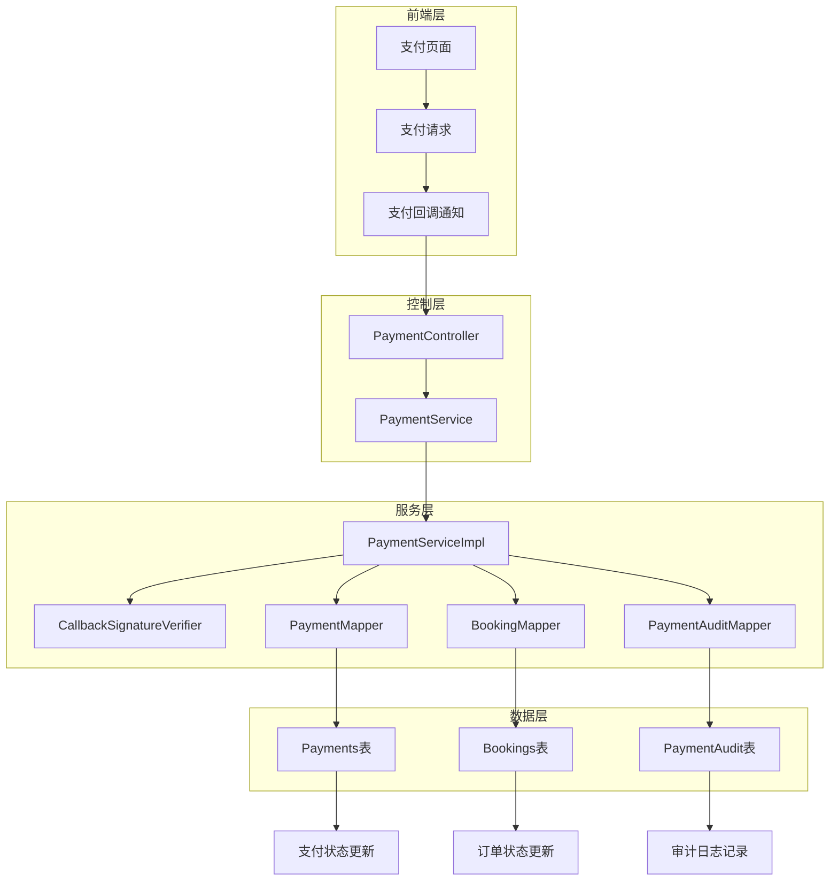
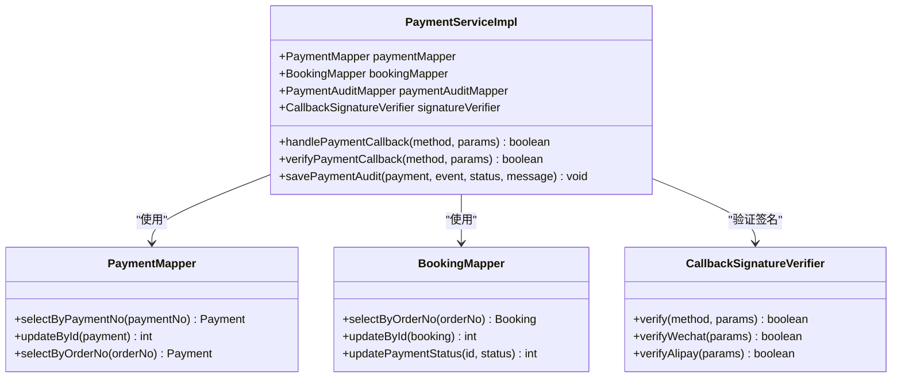
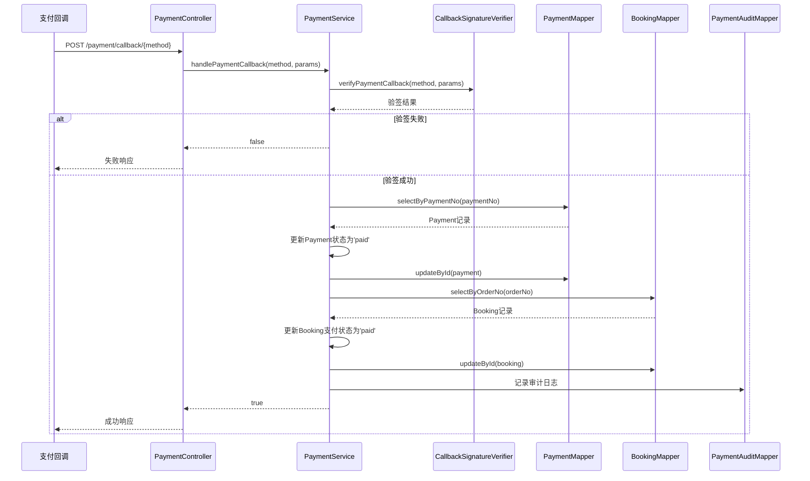
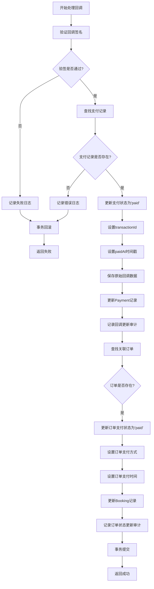
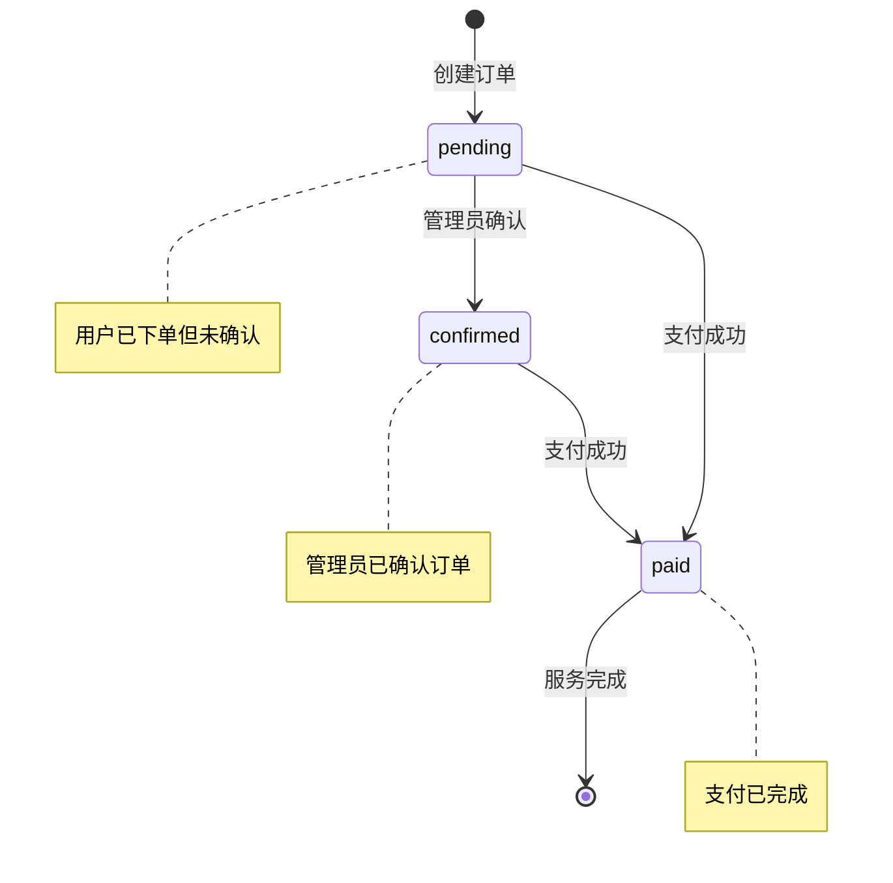
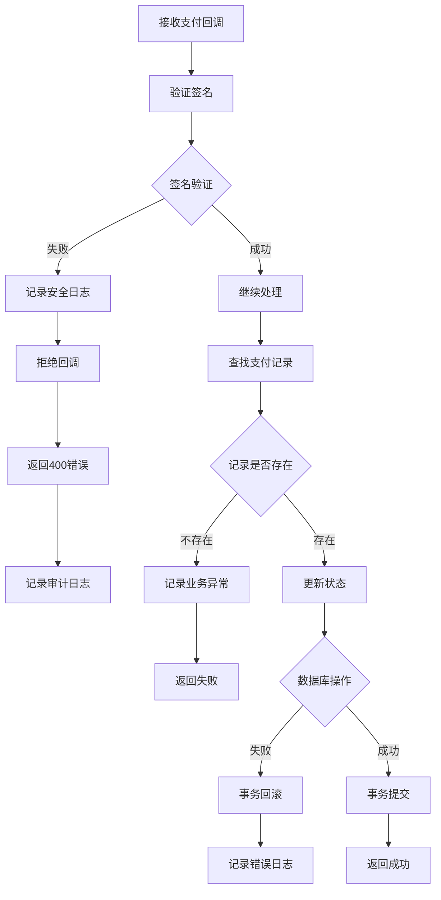
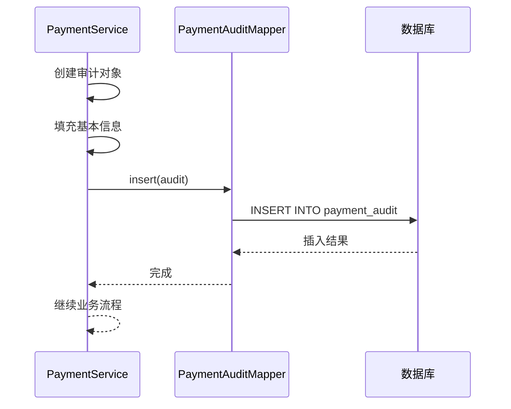

# 支付回调成功后的状态同步机制

<cite>
**本文档引用的文件**
- [PaymentServiceImpl.java](file://backend/src/main/java/com/carwash/service/impl/PaymentServiceImpl.java)
- [PaymentMapper.java](file://backend/src/main/java/com/carwash/mapper/PaymentMapper.java)
- [PaymentMapper.xml](file://backend/src/main/resources/mapper/PaymentMapper.xml)
- [Payment.java](file://backend/src/main/java/com/carwash/entity/Payment.java)
- [BookingMapper.java](file://backend/src/main/java/com/carwash/mapper/BookingMapper.java)
- [Booking.java](file://backend/src/main/java/com/carwash/entity/Booking.java)
- [CallbackSignatureVerifier.java](file://backend/src/main/java/com/carwash/service/payment/security/CallbackSignatureVerifier.java)
- [PaymentAudit.java](file://backend/src/main/java/com/carwash/entity/PaymentAudit.java)
- [BookingServiceImpl.java](file://backend/src/main/java/com/carwash/service/impl/BookingServiceImpl.java)
</cite>

## 目录
1. [概述](#概述)
2. [系统架构](#系统架构)
3. [核心组件分析](#核心组件分析)
4. [状态同步流程](#状态同步流程)
5. [事务性操作保证](#事务性操作保证)
6. [关键字段更新逻辑](#关键字段更新逻辑)
7. [订单状态转换规则](#订单状态转换规则)
8. [异常处理策略](#异常处理策略)
9. [审计日志机制](#审计日志机制)
10. [性能考虑](#性能考虑)
11. [故障排除指南](#故障排除指南)

## 概述

支付回调成功后的状态同步机制是汽车洗车服务预约系统中的核心业务流程，负责在支付成功后同步更新支付记录和关联订单的状态信息。该机制确保了支付状态的一致性和数据完整性，同时提供了完整的审计跟踪功能。

系统采用基于Spring框架的事务性设计，通过`handlePaymentCallback`方法实现支付成功的状态同步，该方法在事务中执行，确保支付状态更新和订单状态更新的原子性。

## 系统架构



**图表来源**
- [PaymentServiceImpl.java](file://backend/src/main/java/com/carwash/service/impl/PaymentServiceImpl.java#L171-L229)
- [PaymentMapper.java](file://backend/src/main/java/com/carwash/mapper/PaymentMapper.java#L1-L56)
- [BookingMapper.java](file://backend/src/main/java/com/carwash/mapper/BookingMapper.java#L1-L108)

## 核心组件分析

### PaymentServiceImpl - 支付服务实现

`PaymentServiceImpl`类是支付状态同步的核心处理器，其中的`handlePaymentCallback`方法实现了完整的支付回调处理流程。



**图表来源**
- [PaymentServiceImpl.java](file://backend/src/main/java/com/carwash/service/impl/PaymentServiceImpl.java#L47-L71)
- [PaymentMapper.java](file://backend/src/main/java/com/carwash/mapper/PaymentMapper.java#L15-L56)
- [BookingMapper.java](file://backend/src/main/java/com/carwash/mapper/BookingMapper.java#L22-L60)

### Payment实体模型

Payment实体类定义了支付记录的数据结构，包含状态同步所需的关键字段。

| 字段名 | 类型 | 描述 | 状态同步作用 |
|--------|------|------|-------------|
| `status` | String | 支付状态：pending/paid/failed/cancelled/refunded | 标识支付是否成功 |
| `transactionId` | String | 第三方交易号 | 存储支付平台返回的唯一标识 |
| `paidAt` | LocalDateTime | 支付时间 | 记录支付完成的具体时间 |
| `rawData` | String | 原始回调数据 | 持久化支付平台的完整回调信息 |
| `paymentNo` | String | 支付流水号 | 关联支付记录的唯一标识 |

**节来源**
- [Payment.java](file://backend/src/main/java/com/carwash/entity/Payment.java#L55-L94)

### Booking实体模型

Booking实体类定义了订单的数据结构，支持支付状态的同步更新。

| 字段名 | 类型 | 描述 | 状态同步作用 |
|--------|------|------|-------------|
| `paymentStatus` | String | 支付状态：unpaid/paid/refunded | 同步支付状态到订单 |
| `paymentMethod` | String | 支付方式 | 记录使用的支付渠道 |
| `paidAt` | LocalDateTime | 支付时间 | 与支付记录保持一致 |

**节来源**
- [Booking.java](file://backend/src/main/java/com/carwash/entity/Booking.java#L100-L116)

## 状态同步流程

支付回调成功后的状态同步遵循严格的流程顺序，确保数据一致性：



**图表来源**
- [PaymentServiceImpl.java](file://backend/src/main/java/com/carwash/service/impl/PaymentServiceImpl.java#L171-L229)

**节来源**
- [PaymentServiceImpl.java](file://backend/src/main/java/com/carwash/service/impl/PaymentServiceImpl.java#L171-L229)

## 事务性操作保证

系统通过Spring的声明式事务管理确保状态同步的原子性：

### 事务配置

```java
@Transactional(rollbackFor = Exception.class)
public boolean handlePaymentCallback(String paymentMethod, Map<String, String> params) {
    // 事务边界内的所有操作
}
```

### 事务传播行为

- **REQUIRED**: 默认传播行为，如果当前存在事务则加入，否则创建新事务
- **rollbackFor = Exception.class**: 遇到任何异常都触发回滚

### 事务隔离级别

系统使用数据库的默认隔离级别（通常为READ_COMMITTED），确保：

1. **防止脏读**: 未提交的更改不会被其他事务看到
2. **防止不可重复读**: 同一事务内多次读取相同数据结果一致
3. **防止幻读**: 同一查询范围内不会出现新的符合条件的记录

**节来源**
- [PaymentServiceImpl.java](file://backend/src/main/java/com/carwash/service/impl/PaymentServiceImpl.java#L172-L173)

## 关键字段更新逻辑

### 支付记录字段更新

状态同步过程中，Payment实体的关键字段按照以下逻辑更新：



**图表来源**
- [PaymentServiceImpl.java](file://backend/src/main/java/com/carwash/service/impl/PaymentServiceImpl.java#L207-L225)

### 字段更新详解

#### 1. 状态字段更新
- **payment.setStatus("paid")**: 将支付状态从"pending"更新为"paid"
- **booking.setPaymentStatus("paid")**: 将订单支付状态从"unpaid"更新为"paid"

#### 2. 时间戳字段更新
- **payment.setPaidAt(TimeUtils.now())**: 记录支付完成的确切时间
- **booking.setPaidAt(payment.getPaidAt())**: 确保订单和支付的时间戳一致

#### 3. 交易标识字段
- **payment.setTransactionId(transactionId)**: 存储第三方支付平台的唯一交易标识
- **booking.setPaymentMethod(payment.getPaymentMethod())**: 记录支付渠道信息

#### 4. 原始数据持久化
- **payment.setRawData(params.toString())**: 将完整的回调参数作为字符串存储
- **用途**: 便于后续审计、问题排查和数据恢复

**节来源**
- [PaymentServiceImpl.java](file://backend/src/main/java/com/carwash/service/impl/PaymentServiceImpl.java#L207-L211)

## 订单状态转换规则

### 支付成功后的状态转换

订单状态从"confirmed"或"pending"转变为"paid"遵循严格的业务规则：



### 状态转换条件

1. **订单状态检查**:
   - 必须是"confirmed"或"pending"状态
   - 不允许从"completed"、"cancelled"等最终状态转换

2. **支付状态检查**:
   - 支付记录必须存在且状态为"pending"
   - 防止重复支付处理

3. **业务约束**:
   - 订单必须属于当前用户
   - 支付金额必须匹配订单金额

### 状态转换影响

状态从"paid"转换后，对后续服务流程产生以下影响：

1. **服务调度**: 系统开始安排洗车服务
2. **资源分配**: 占用洗车工位和清洁资源
3. **通知发送**: 向用户发送支付确认通知
4. **报表统计**: 影响财务和运营报表数据

**节来源**
- [PaymentServiceImpl.java](file://backend/src/main/java/com/carwash/service/impl/PaymentServiceImpl.java#L88-L96)

## 异常处理策略

### 回调验签异常



**图表来源**
- [PaymentServiceImpl.java](file://backend/src/main/java/com/carwash/service/impl/PaymentServiceImpl.java#L176-L180)

### 异常分类处理

#### 1. 签名验证异常
- **原因**: 回调数据被篡改或来自非法来源
- **处理**: 立即拒绝，记录安全事件
- **日志**: 详细记录请求参数和验证过程

#### 2. 支付记录异常
- **原因**: 支付流水号不存在或已被删除
- **处理**: 记录错误，返回处理失败
- **日志**: 包含支付流水号和订单号

#### 3. 数据库操作异常
- **原因**: 并发冲突、主键冲突、外键约束等
- **处理**: 事务回滚，避免数据不一致
- **日志**: 包含SQL语句和异常堆栈

#### 4. 网络通信异常
- **原因**: 第三方支付平台响应超时
- **处理**: 记录超时，等待下次查询
- **日志**: 包含请求URL和响应时间

**节来源**
- [PaymentServiceImpl.java](file://backend/src/main/java/com/carwash/service/impl/PaymentServiceImpl.java#L176-L180)
- [PaymentServiceImpl.java](file://backend/src/main/java/com/carwash/service/impl/PaymentServiceImpl.java#L193-L197)

## 审计日志机制

### 审计日志表结构

PaymentAudit实体记录支付状态同步的完整审计轨迹：

| 字段名 | 类型 | 描述 | 用途 |
|--------|------|------|------|
| `payment_no` | String | 支付流水号 | 关联具体的支付记录 |
| `order_no` | String | 订单号 | 关联相关的订单记录 |
| `event_type` | String | 事件类型 | 标识审计事件的性质 |
| `status` | String | 状态值 | 记录事件发生时的状态 |
| `payment_method` | String | 支付方式 | 记录使用的支付渠道 |
| `amount` | BigDecimal | 支付金额 | 记录交易金额 |
| `operator_id` | Long | 操作者ID | 记录操作人员 |
| `message` | String | 事件描述 | 详细说明事件内容 |
| `raw_data` | String | 原始数据 | 存储事件相关数据 |
| `created_at` | Timestamp | 创建时间 | 记录事件发生时间 |

### 审计事件类型

系统记录以下关键审计事件：

1. **CALLBACK_VERIFIED**: 回调验签通过
2. **CALLBACK_UPDATE**: 回调更新支付状态
3. **STATUS_CHANGE**: 第三方查询导致状态变化
4. **REFUND_REQUEST**: 发起退款请求
5. **REFUND_SUCCESS**: 退款成功
6. **REFUND_FAILED**: 退款失败

### 审计日志流程



**图表来源**
- [PaymentServiceImpl.java](file://backend/src/main/java/com/carwash/service/impl/PaymentServiceImpl.java#L456-L476)

**节来源**
- [PaymentServiceImpl.java](file://backend/src/main/java/com/carwash/service/impl/PaymentServiceImpl.java#L456-L476)

## 性能考虑

### 数据库索引优化

为了提高状态同步的性能，数据库表需要适当的索引：

#### Payments表索引
- `idx_payment_no`: 支付流水号查询
- `idx_order_no`: 订单关联查询
- `idx_status`: 状态过滤查询
- `idx_created_at`: 时间范围查询

#### Bookings表索引
- `idx_order_no`: 订单号查询
- `idx_payment_status`: 支付状态过滤

#### PaymentAudit表索引
- `idx_payment_no`: 支付审计查询
- `idx_order_no`: 订单审计查询
- `idx_event_type`: 事件类型过滤
- `idx_created_at`: 时间范围查询

### 缓存策略

对于频繁查询的支付记录，可以考虑引入Redis缓存：

1. **支付记录缓存**: 缓存最近活跃的支付记录
2. **订单状态缓存**: 缓存订单的支付状态信息
3. **缓存失效**: 在状态更新时主动清除相关缓存

### 批量处理

对于大量并发的支付回调，系统支持批量处理：

1. **异步处理**: 支付回调可以异步处理，避免阻塞主线程
2. **队列机制**: 使用消息队列解耦支付回调和业务处理
3. **限流控制**: 防止系统过载

## 故障排除指南

### 常见问题及解决方案

#### 1. 支付回调处理失败

**症状**: 支付成功但订单状态未更新

**排查步骤**:
1. 检查回调签名是否验证通过
2. 验证支付记录是否存在
3. 检查数据库连接和事务配置
4. 查看审计日志确定具体失败点

**解决方案**:
- 确认支付网关配置正确
- 检查数据库表结构和索引
- 验证事务配置和隔离级别

#### 2. 状态不一致问题

**症状**: 支付状态为"paid"但订单状态仍为"unpaid"

**排查步骤**:
1. 检查事务是否正常提交
2. 验证数据库更新语句
3. 查看审计日志确认更新顺序

**解决方案**:
- 重新执行状态同步流程
- 手动更新订单状态
- 检查数据库触发器和约束

#### 3. 性能问题

**症状**: 支付回调处理延迟较高

**排查步骤**:
1. 分析数据库查询性能
2. 检查索引使用情况
3. 监控系统资源使用

**解决方案**:
- 优化数据库查询
- 添加适当索引
- 调整缓存策略

### 监控和告警

建议建立以下监控指标：

1. **回调处理成功率**: 监控支付回调的成功率
2. **处理延迟**: 监控状态同步的平均处理时间
3. **异常频率**: 监控各种异常的发生频率
4. **数据库性能**: 监控数据库查询和更新性能

### 日志分析

通过分析审计日志可以发现潜在问题：

```sql
-- 查询失败的回调处理
SELECT * FROM payment_audit 
WHERE event_type = 'CALLBACK_VERIFIED' 
AND status = 'failed' 
ORDER BY created_at DESC;

-- 分析处理延迟
SELECT payment_no, 
       created_at, 
       LEAD(created_at) OVER (PARTITION BY payment_no ORDER BY created_at) as next_time,
       TIMESTAMPDIFF(SECOND, created_at, LEAD(created_at) OVER (PARTITION BY payment_no ORDER BY created_at)) as delay
FROM payment_audit 
WHERE event_type IN ('CALLBACK_VERIFIED', 'CALLBACK_UPDATE')
ORDER BY delay DESC;
```

**节来源**
- [PaymentServiceImpl.java](file://backend/src/main/java/com/carwash/service/impl/PaymentServiceImpl.java#L456-L476)

## 总结

支付回调成功后的状态同步机制是汽车洗车服务预约系统的核心功能，通过严格的事务性设计、完善的异常处理和全面的审计日志，确保了支付状态的一致性和数据完整性。

该机制的主要特点包括：

1. **事务性保证**: 使用Spring事务管理确保原子性
2. **安全性**: 通过签名验证防止恶意回调
3. **可追溯性**: 完整的审计日志记录每个操作
4. **高性能**: 优化的数据库设计和索引策略
5. **高可靠性**: 完善的异常处理和故障恢复机制

通过持续的监控和优化，该机制能够稳定支撑系统的日常运营需求，并为未来的扩展提供良好的基础。