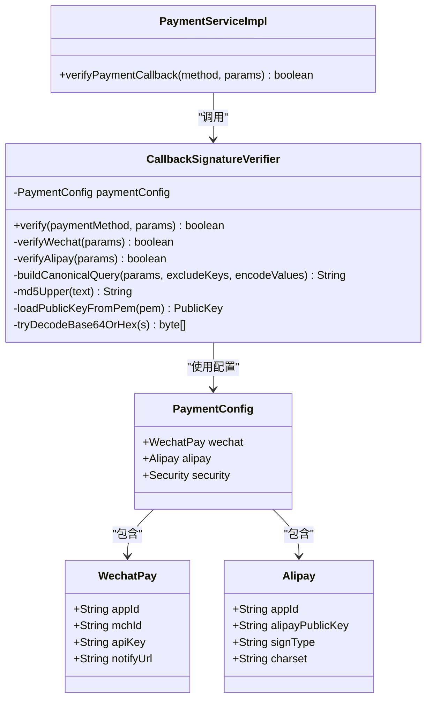
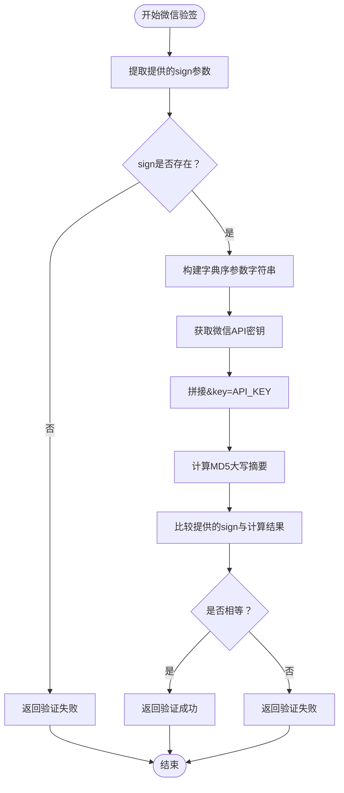
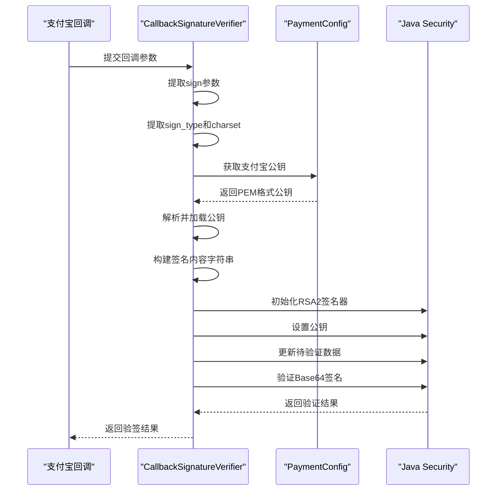
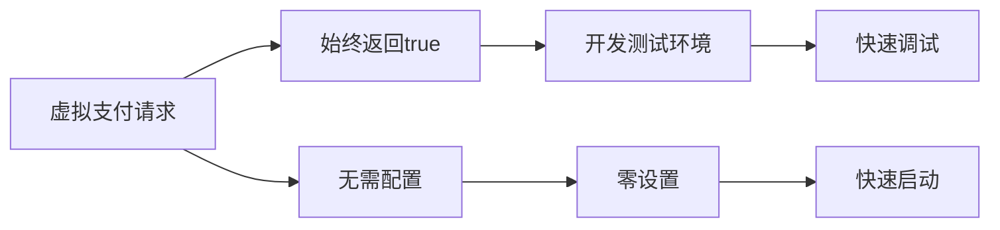
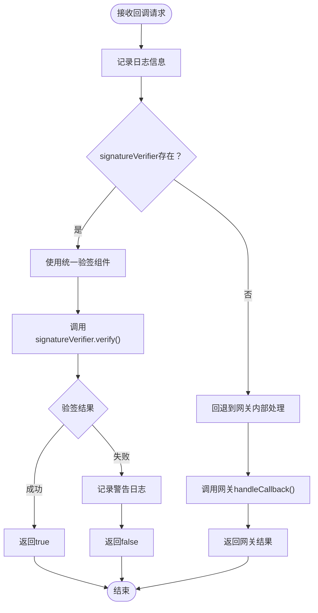

# 签名验证

<cite>
**本文档引用的文件**
- [CallbackSignatureVerifier.java](file://backend/src/main/java/com/carwash/service/payment/security/CallbackSignatureVerifier.java)
- [PaymentConfig.java](file://backend/src/main/java/com/carwash/config/PaymentConfig.java)
- [WechatPayGateway.java](file://backend/src/main/java/com/carwash/service/payment/WechatPayGateway.java)
- [AlipayGateway.java](file://backend/src/main/java/com/carwash/service/payment/AlipayGateway.java)
- [VirtualPaymentGateway.java](file://backend/src/main/java/com/carwash/service/payment/VirtualPaymentGateway.java)
- [CallbackSignatureVerifierTest.java](file://backend/src/test/java/com/carwash/service/payment/security/CallbackSignatureVerifierTest.java)
- [PaymentServiceImpl.java](file://backend/src/main/java/com/carwash/service/impl/PaymentServiceImpl.java)
- [payment-gateway.md](file://backend/docs/payment-gateway.md)
</cite>

## 目录
1. [概述](#概述)
2. [签名验证架构](#签名验证架构)
3. [微信支付MD5验签机制](#微信支付md5验签机制)
4. [支付宝RSA2验签机制](#支付宝rsa2验签机制)
5. [虚拟支付验签机制](#虚拟支付验签机制)
6. [验签流程详解](#验签流程详解)
7. [常见问题与调试](#常见问题与调试)
8. [总结](#总结)

## 概述

支付回调签名验证是确保支付平台回调数据真实性的重要安全机制。本系统实现了统一的签名验证组件`CallbackSignatureVerifier`，支持微信支付、支付宝和虚拟支付三种支付方式的验签需求。

### 核心特性

- **多支付方式支持**：统一处理微信支付MD5验签、支付宝RSA2验签和虚拟支付无验签
- **安全性保障**：防止恶意回调攻击，确保支付数据完整性
- **开发友好**：虚拟支付方式支持开发测试环境
- **标准化接口**：提供统一的验签接口，便于扩展新支付方式

## 签名验证架构



**图表来源**
- [CallbackSignatureVerifier.java](file://backend/src/main/java/com/carwash/service/payment/security/CallbackSignatureVerifier.java#L22-L170)
- [PaymentConfig.java](file://backend/src/main/java/com/carwash/config/PaymentConfig.java#L11-L225)

**章节来源**
- [CallbackSignatureVerifier.java](file://backend/src/main/java/com/carwash/service/payment/security/CallbackSignatureVerifier.java#L16-L21)
- [PaymentServiceImpl.java](file://backend/src/main/java/com/carwash/service/impl/PaymentServiceImpl.java#L358-L379)

## 微信支付MD5验签机制

微信支付采用基于MD5的签名验证机制，核心流程包括参数字典序排序、拼接API密钥和生成大写MD5摘要。

### 验签算法详解



**图表来源**
- [CallbackSignatureVerifier.java](file://backend/src/main/java/com/carwash/service/payment/security/CallbackSignatureVerifier.java#L52-L61)

### 参数处理流程

微信支付验签的关键步骤：

1. **参数过滤**：排除`sign`参数，保留其他所有参数
2. **字典序排序**：使用`TreeMap`按参数名字母顺序排列
3. **字符串拼接**：参数名=参数值形式，用&连接
4. **密钥追加**：在字符串末尾添加`&key=API_KEY`
5. **MD5计算**：对最终字符串计算MD5，转换为大写

### 实现细节

微信支付验签的具体实现包含以下关键方法：

- **参数构建**：[`buildCanonicalQuery`](file://backend/src/main/java/com/carwash/service/payment/security/CallbackSignatureVerifier.java#L99-L114)方法负责参数字典序排序和拼接
- **MD5计算**：[`md5Upper`](file://backend/src/main/java/com/carwash/service/payment/security/CallbackSignatureVerifier.java#L131-L144)方法实现MD5摘要计算并转换为大写

**章节来源**
- [CallbackSignatureVerifier.java](file://backend/src/main/java/com/carwash/service/payment/security/CallbackSignatureVerifier.java#L52-L61)
- [WechatPayGateway.java](file://backend/src/main/java/com/carwash/service/payment/WechatPayGateway.java#L193-L225)

## 支付宝RSA2验签机制

支付宝采用RSA2算法进行签名验证，使用公钥对Base64编码的签名进行验证。

### RSA2验签流程



**图表来源**
- [CallbackSignatureVerifier.java](file://backend/src/main/java/com/carwash/service/payment/security/CallbackSignatureVerifier.java#L67-L93)

### 公钥处理机制

支付宝验签涉及复杂的公钥处理流程：

1. **公钥格式**：从配置中读取PEM格式的公钥证书
2. **公钥解析**：去除PEM标记，解码Base64内容
3. **密钥规格**：使用X509EncodedKeySpec定义密钥规格
4. **算法选择**：根据sign_type选择SHA256withRSA或SHA1withRSA算法

### 签名内容构建

支付宝签名内容的构建遵循严格的规则：

- **参数排除**：排除`sign`和`sign_type`参数
- **字典序**：按参数名字母顺序排列
- **URL编码**：对参数值进行URL编码
- **连接符**：使用&符号连接键值对

**章节来源**
- [CallbackSignatureVerifier.java](file://backend/src/main/java/com/carwash/service/payment/security/CallbackSignatureVerifier.java#L67-L93)
- [AlipayGateway.java](file://backend/src/main/java/com/carwash/service/payment/AlipayGateway.java#L216-L249)

## 虚拟支付验签机制

虚拟支付作为开发测试环境专用的支付方式，采用最简化的验签策略。

### 设计理念

虚拟支付验签始终返回`true`，其设计目的包括：

- **开发便利性**：简化开发和测试流程
- **调试友好性**：避免因签名问题阻碍功能验证
- **环境隔离**：区分生产环境和测试环境的安全要求

### 实现特点



**图表来源**
- [CallbackSignatureVerifier.java](file://backend/src/main/java/com/carwash/service/payment/security/CallbackSignatureVerifier.java#L42-L43)
- [VirtualPaymentGateway.java](file://backend/src/main/java/com/carwash/service/payment/VirtualPaymentGateway.java#L83-L85)

**章节来源**
- [CallbackSignatureVerifier.java](file://backend/src/main/java/com/carwash/service/payment/security/CallbackSignatureVerifier.java#L42-L43)
- [VirtualPaymentGateway.java](file://backend/src/main/java/com/carwash/service/payment/VirtualPaymentGateway.java#L83-L85)

## 验签流程详解

### 统一验签入口

系统通过`PaymentServiceImpl.verifyPaymentCallback`方法统一处理验签请求：



**图表来源**
- [PaymentServiceImpl.java](file://backend/src/main/java/com/carwash/service/impl/PaymentServiceImpl.java#L358-L379)

### 参数处理策略

不同支付方式的参数处理策略：

| 支付方式 | 参数排除 | 字符编码 | URL编码 |
|---------|---------|---------|---------|
| 微信支付 | 仅sign | UTF-8 | 否 |
| 支付宝 | sign和sign_type | 可配置 | 是 |
| 虚拟支付 | 无限制 | 无要求 | 无要求 |

**章节来源**
- [PaymentServiceImpl.java](file://backend/src/main/java/com/carwash/service/impl/PaymentServiceImpl.java#L358-L379)
- [CallbackSignatureVerifier.java](file://backend/src/main/java/com/carwash/service/payment/security/CallbackSignatureVerifier.java#L99-L114)

## 常见问题与调试

### 微信支付验签失败原因

1. **字符编码不一致**
   - 问题：本地测试使用UTF-8，但回调使用GBK
   - 解决：确保编码一致性，推荐使用UTF-8

2. **参数排序错误**
   - 问题：参数未按字典序排列
   - 解决：使用TreeMap确保字母顺序

3. **API密钥错误**
   - 问题：配置的API密钥与微信商户平台不匹配
   - 解决：核对商户平台的API密钥配置

4. **特殊字符处理**
   - 问题：参数值包含特殊字符未正确处理
   - 解决：检查参数值的转义和编码

### 支付宝验签失败原因

1. **公钥配置错误**
   - 问题：支付宝公钥格式不正确或版本错误
   - 解决：确认使用正确的RSA公钥，检查PEM格式

2. **签名算法不匹配**
   - 问题：sign_type与实际签名算法不符
   - 解决：根据回调数据的sign_type选择对应算法

3. **字符集编码问题**
   - 问题：签名内容与实际编码不一致
   - 解决：确保签名内容与回调数据使用相同字符集

4. **Base64解码失败**
   - 问题：签名字符串不是有效的Base64格式
   - 解决：检查签名字符串格式，支持十六进制备用解码

### 调试建议

1. **启用详细日志**
   ```java
   // 在PaymentServiceImpl中添加调试日志
   log.debug("验签参数: {}", params);
   ```

2. **参数对比验证**
   ```java
   // 对比本地计算的签名与回调提供的签名
   log.debug("本地签名: {}, 回调签名: {}", localSign, callbackSign);
   ```

3. **配置验证**
   ```java
   // 验证配置项是否正确加载
   log.debug("微信API密钥: {}", paymentConfig.getWechat().getApiKey());
   log.debug("支付宝公钥: {}", paymentConfig.getAlipay().getAlipayPublicKey());
   ```

**章节来源**
- [CallbackSignatureVerifierTest.java](file://backend/src/test/java/com/carwash/service/payment/security/CallbackSignatureVerifierTest.java#L23-L60)
- [CallbackSignatureVerifier.java](file://backend/src/main/java/com/carwash/service/payment/security/CallbackSignatureVerifier.java#L131-L144)

## 总结

本系统的签名验证机制提供了全面而灵活的支付回调安全保障：

### 核心优势

1. **统一化设计**：单一组件支持多种支付方式的验签需求
2. **安全性保障**：针对不同支付方式采用最适合的验签算法
3. **开发友好**：虚拟支付方式简化开发测试流程
4. **可扩展性**：清晰的接口设计便于添加新的支付方式

### 最佳实践

- **生产环境**：严格验证签名，确保支付安全
- **开发环境**：使用虚拟支付方式快速迭代
- **监控告警**：记录验签失败的日志，及时发现异常
- **配置管理**：定期检查和更新支付平台的密钥配置

通过这套完整的签名验证体系，系统能够安全可靠地处理来自不同支付平台的回调请求，为用户提供可信的支付服务体验。