# 支付创建流程详细实现文档

<cite>
**本文档引用的文件**
- [Payment.vue](file://frontend/src/views/Payment.vue)
- [payment.js](file://frontend/src/api/payment.js)
- [PaymentController.java](file://backend/src/main/java/com/carwash/controller/PaymentController.java)
- [PaymentServiceImpl.java](file://backend/src/main/java/com/carwash/service/impl/PaymentServiceImpl.java)
- [PaymentRequest.java](file://backend/src/main/java/com/carwash/dto/PaymentRequest.java)
- [PaymentResponse.java](file://backend/src/main/java/com/carwash/dto/PaymentResponse.java)
- [Payment.java](file://backend/src/main/java/com/carwash/entity/Payment.java)
- [PaymentGateway.java](file://backend/src/main/java/com/carwash/service/payment/PaymentGateway.java)
- [PaymentGatewayFactory.java](file://backend/src/main/java/com/carwash/service/payment/PaymentGatewayFactory.java)
- [VirtualPaymentGateway.java](file://backend/src/main/java/com/carwash/service/payment/VirtualPaymentGateway.java)
- [paymentFlow.js](file://frontend/src/utils/paymentFlow.js)
</cite>

## 目录
1. [概述](#概述)
2. [前端支付表单组件](#前端支付表单组件)
3. [前端API调用](#前端api调用)
4. [后端控制器处理](#后端控制器处理)
5. [后端服务层逻辑](#后端服务层逻辑)
6. [支付数据传输对象](#支付数据传输对象)
7. [支付流水号生成策略](#支付流水号生成策略)
8. [支付超时机制](#支付超时机制)
9. [支付网关架构](#支付网关架构)
10. [支付流程时序图](#支付流程时序图)
11. [总结](#总结)

## 概述

支付创建流程是汽车洗车服务预约系统中的核心功能模块，负责处理用户从选择支付方式到完成支付的完整过程。该流程包含前后端协作、多种支付方式支持、安全验证、状态管理和审计追踪等多个关键环节。

系统支持三种主要支付方式：
- **微信支付**：基于二维码的扫码支付
- **支付宝**：基于二维码和H5的支付方式  
- **信用卡支付**：支持RSA加密的安全支付方式

## 前端支付表单组件

### 组件架构设计

前端支付组件采用Vue 3 Composition API构建，提供了完整的支付表单界面和交互逻辑。

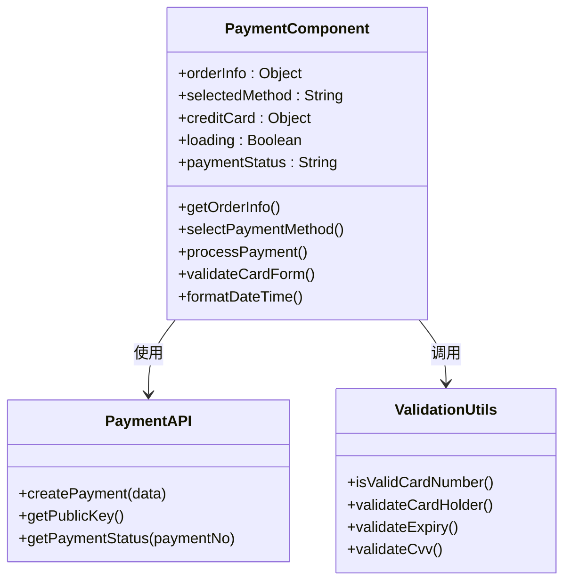

**图表来源**
- [Payment.vue](file://frontend/src/views/Payment.vue#L352-L800)
- [payment.js](file://frontend/src/api/payment.js#L1-L139)

### 支付方式选择

组件支持三种支付方式的选择和验证：

| 支付方式 | 图标 | 支付渠道 | 特点 |
|---------|------|----------|------|
| 微信支付 | 🟢 | QR码 | 扫码支付，便捷快速 |
| 支付宝 | 🔵 | QR码/H5 | 多渠道支持，用户体验好 |
| 信用卡 | 💳 | APP/QR/H5 | 安全加密，支持多种场景 |

### 信用卡支付表单验证

信用卡支付需要完整的表单验证逻辑：

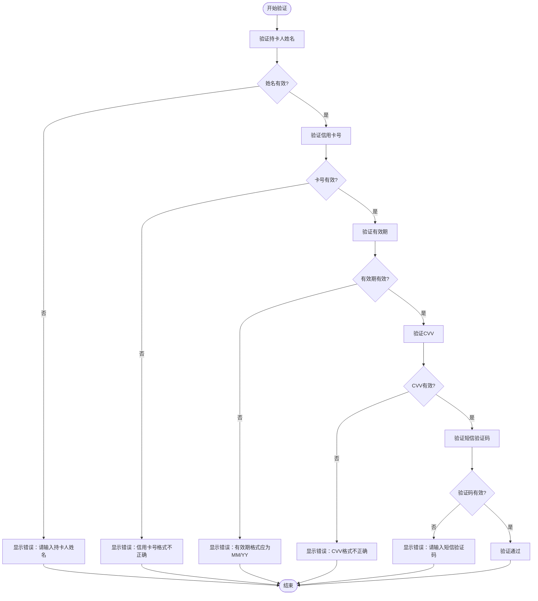

**图表来源**
- [Payment.vue](file://frontend/src/views/Payment.vue#L426-L475)

**章节来源**
- [Payment.vue](file://frontend/src/views/Payment.vue#L1-L800)

## 前端API调用

### 支付创建请求

前端通过paymentApi.createPayment发起支付创建请求，包含以下关键参数：

| 参数名 | 类型 | 必填 | 描述 |
|--------|------|------|------|
| orderNo | String | 是 | 订单编号 |
| amount | Number | 是 | 支付金额 |
| paymentMethod | String | 是 | 支付方式（wechat/alipay/credit_card） |
| securePayload | String | 否 | 加密的信用卡信息（仅信用卡支付时） |

### RSA公钥获取

对于信用卡支付，前端需要先获取服务器的RSA公钥进行数据加密：

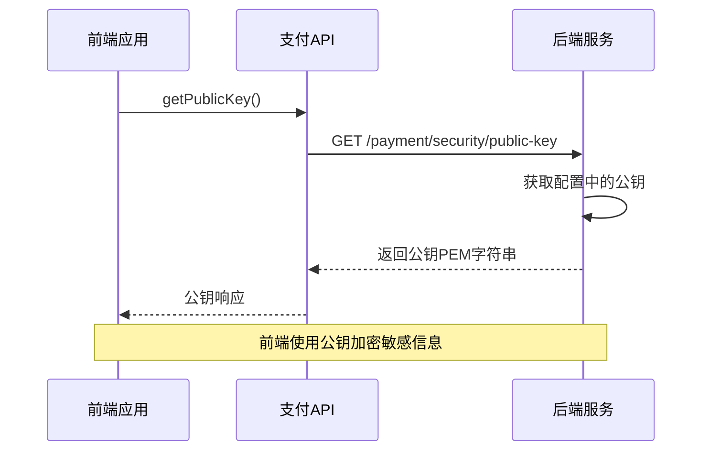

**图表来源**
- [payment.js](file://frontend/src/api/payment.js#L24-L26)
- [PaymentController.java](file://backend/src/main/java/com/carwash/controller/PaymentController.java#L261-L268)

**章节来源**
- [payment.js](file://frontend/src/api/payment.js#L1-L139)

## 后端控制器处理

### PaymentController.createPayment

后端控制器负责接收前端请求并进行初步处理：

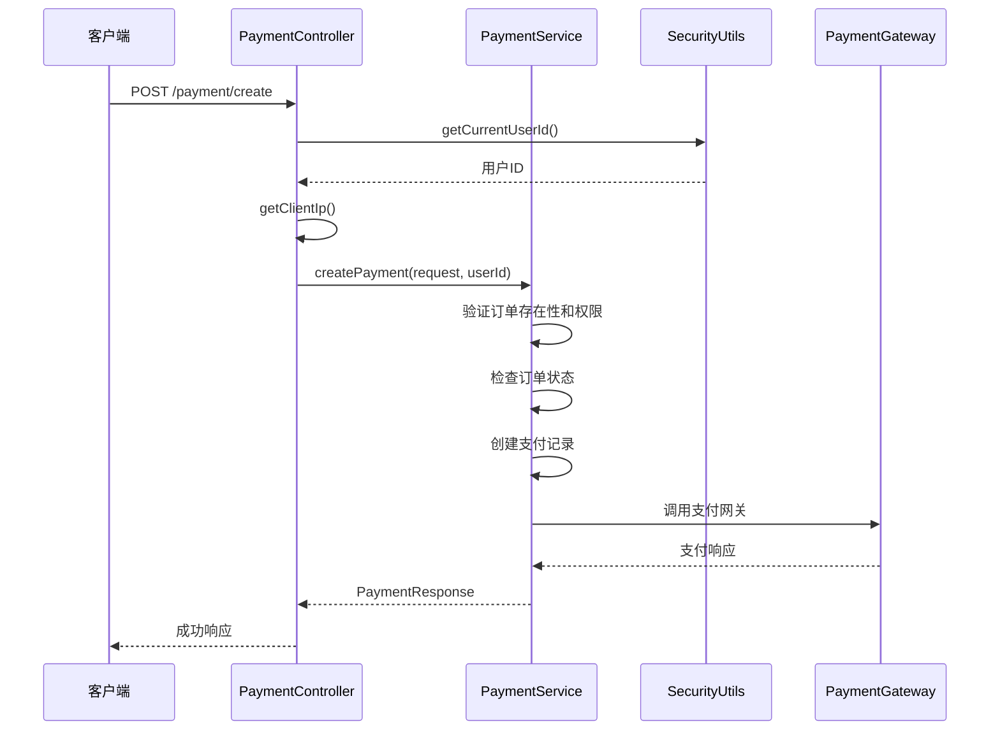

**图表来源**
- [PaymentController.java](file://backend/src/main/java/com/carwash/controller/PaymentController.java#L47-L62)

### 请求参数验证

控制器对接收到的PaymentRequest进行验证：

| 字段 | 验证规则 | 错误处理 |
|------|----------|----------|
| orderNo | 非空字符串 | 返回"订单号不能为空"错误 |
| amount | 非空，大于0 | 返回"支付金额必须大于0"错误 |
| paymentMethod | 非空，支持的支付方式 | 返回"支付方式不能为空"错误 |
| channel | qr/app/h5 | 默认为qr，否则返回格式错误 |

**章节来源**
- [PaymentController.java](file://backend/src/main/java/com/carwash/controller/PaymentController.java#L1-L303)

## 后端服务层逻辑

### PaymentServiceImpl.createPayment

服务层实现了完整的支付创建业务逻辑：

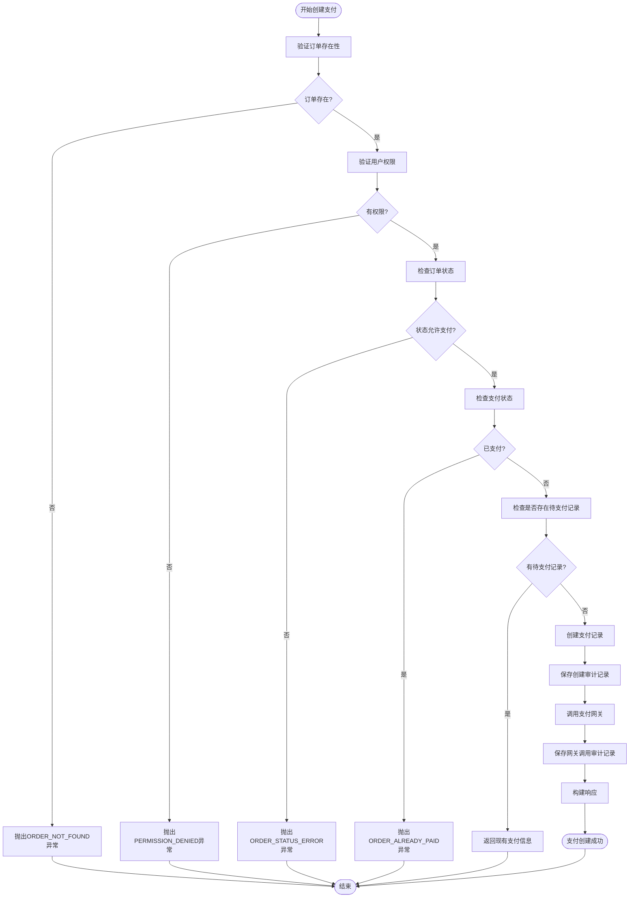

**图表来源**
- [PaymentServiceImpl.java](file://backend/src/main/java/com/carwash/service/impl/PaymentServiceImpl.java#L73-L145)

### 订单验证逻辑

服务层对订单进行了多层验证：

1. **订单存在性验证**：确认订单号对应的有效订单
2. **用户权限验证**：确保当前用户有权操作该订单
3. **订单状态验证**：只允许处于"confirmed"或"pending"状态的订单发起支付
4. **支付状态验证**：防止重复支付同一订单

### 支付记录创建

支付记录包含以下关键字段：

| 字段 | 类型 | 描述 |
|------|------|------|
| paymentNo | String | 支付流水号（唯一标识） |
| orderNo | String | 关联的订单号 |
| userId | Long | 用户ID |
| amount | BigDecimal | 支付金额 |
| paymentMethod | String | 支付方式 |
| status | String | 支付状态（pending） |
| expireAt | LocalDateTime | 支付过期时间（30分钟后） |

**章节来源**
- [PaymentServiceImpl.java](file://backend/src/main/java/com/carwash/service/impl/PaymentServiceImpl.java#L1-L550)

## 支付数据传输对象

### PaymentRequest设计

PaymentRequest作为前端到后端的数据传输对象，定义了支付请求的所有必要字段：

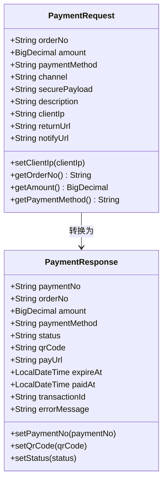

**图表来源**
- [PaymentRequest.java](file://backend/src/main/java/com/carwash/dto/PaymentRequest.java#L1-L141)
- [PaymentResponse.java](file://backend/src/main/java/com/carwash/dto/PaymentResponse.java#L1-L196)

### 字段验证规则

PaymentRequest包含了完整的字段验证规则：

| 字段 | 验证注解 | 规则 |
|------|----------|------|
| orderNo | @NotBlank | 非空字符串 |
| amount | @NotNull, @DecimalMin | 非空，大于0 |
| paymentMethod | @NotBlank | 非空字符串 |
| channel | @Pattern | 仅支持qr/app/h5 |
| securePayload | - | Base64编码的加密数据 |

**章节来源**
- [PaymentRequest.java](file://backend/src/main/java/com/carwash/dto/PaymentRequest.java#L1-L141)
- [PaymentResponse.java](file://backend/src/main/java/com/carwash/dto/PaymentResponse.java#L1-L196)

## 支付流水号生成策略

### 生成算法

支付流水号采用"PAY+"前缀加时间戳再加UUID的方式生成：

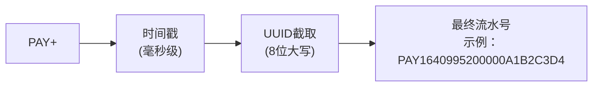

**图表来源**
- [PaymentServiceImpl.java](file://backend/src/main/java/com/carwash/service/impl/PaymentServiceImpl.java#L384-L387)

### 优势特点

1. **全局唯一性**：结合时间戳和UUID确保唯一性
2. **有序性**：时间戳保证流水号按创建时间排序
3. **可读性**：前缀和格式便于识别和调试
4. **安全性**：UUID部分增加随机性，防止预测攻击

**章节来源**
- [PaymentServiceImpl.java](file://backend/src/main/java/com/carwash/service/impl/PaymentServiceImpl.java#L384-L387)

## 支付超时机制

### 过期时间设置

支付记录设置了30分钟的过期时间：

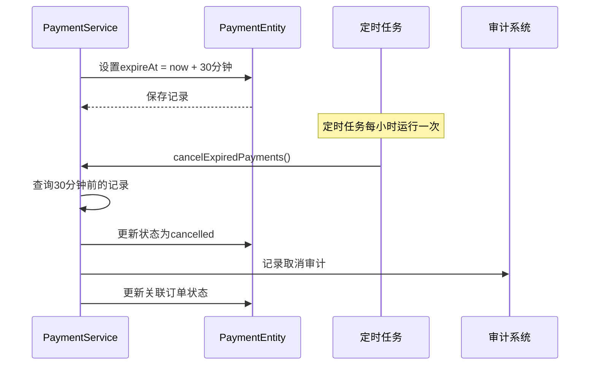

**图表来源**
- [PaymentServiceImpl.java](file://backend/src/main/java/com/carwash/service/impl/PaymentServiceImpl.java#L114-L114)

### 超时处理流程

1. **自动检测**：定时任务每小时扫描过期支付
2. **状态更新**：将过期支付标记为"cancelled"
3. **订单同步**：更新关联订单状态为"cancelled"
4. **审计记录**：记录超时取消的审计信息

**章节来源**
- [PaymentServiceImpl.java](file://backend/src/main/java/com/carwash/service/impl/PaymentServiceImpl.java#L332-L354)

## 支付网关架构

### 网关工厂模式

系统采用工厂模式管理不同的支付网关：

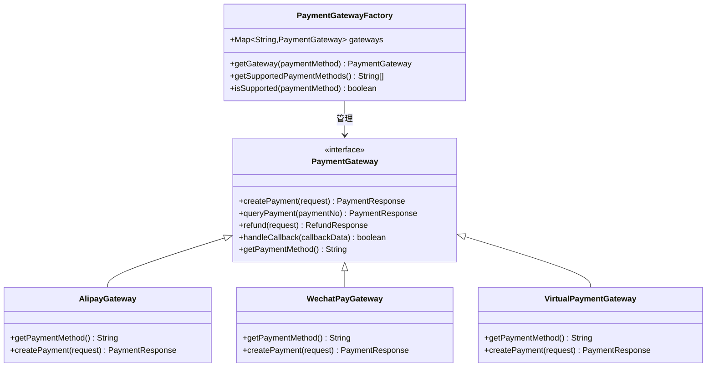

**图表来源**
- [PaymentGatewayFactory.java](file://backend/src/main/java/com/carwash/service/payment/PaymentGatewayFactory.java#L1-L55)
- [PaymentGateway.java](file://backend/src/main/java/com/carwash/service/payment/PaymentGateway.java#L1-L54)

### 支付网关特性对比

| 网关类型 | 支付方式 | 渠道支持 | 特点 |
|----------|----------|----------|------|
| AlipayGateway | 支付宝 | QR/H5 | 功能完整，稳定性高 |
| WechatPayGateway | 微信支付 | QR/H5 | 用户基数大，体验好 |
| VirtualPaymentGateway | 虚拟支付 | QR/APP/H5 | 开发测试专用 |

**章节来源**
- [PaymentGatewayFactory.java](file://backend/src/main/java/com/carwash/service/payment/PaymentGatewayFactory.java#L1-L55)
- [VirtualPaymentGateway.java](file://backend/src/main/java/com/carwash/service/payment/VirtualPaymentGateway.java#L1-L92)

## 支付流程时序图

### 完整支付创建流程

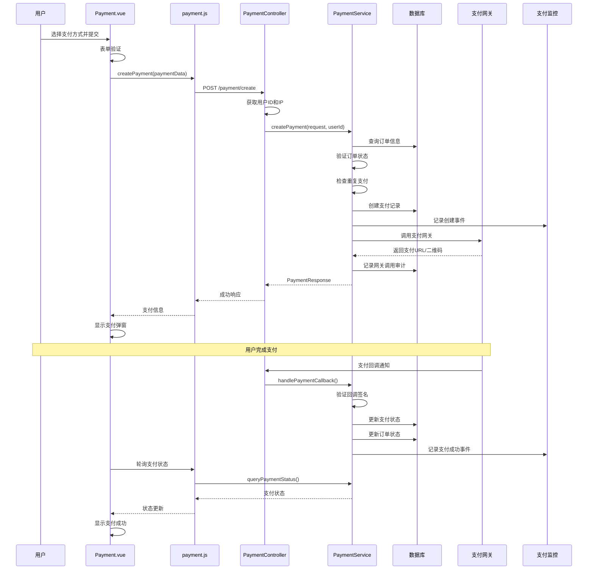

**图表来源**
- [Payment.vue](file://frontend/src/views/Payment.vue#L601-L770)
- [PaymentController.java](file://backend/src/main/java/com/carwash/controller/PaymentController.java#L47-L62)
- [PaymentServiceImpl.java](file://backend/src/main/java/com/carwash/service/impl/PaymentServiceImpl.java#L73-L145)

### 支付状态流转

支付过程中的状态变化遵循严格的业务规则：

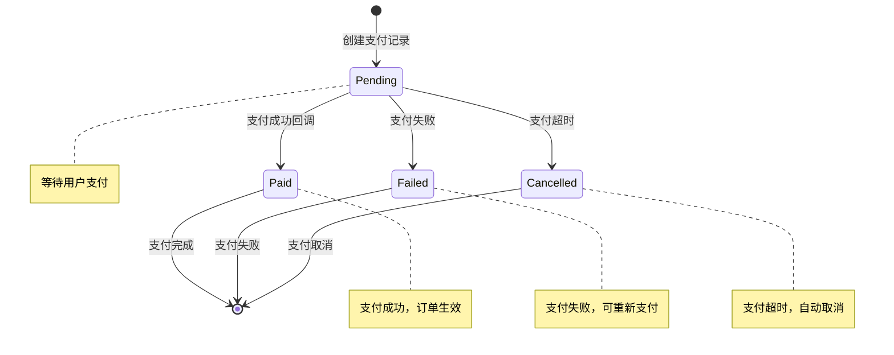

## 总结

支付创建流程是一个复杂而精密的系统工程，涉及前端交互、后端业务逻辑、数据库操作、支付网关集成等多个层面。该系统具有以下特点：

### 技术亮点

1. **模块化设计**：采用分层架构，职责清晰分离
2. **多支付方式支持**：灵活的网关工厂模式支持多种支付方式
3. **安全保障**：RSA加密保护敏感支付信息，多重验证确保安全
4. **状态管理**：完善的支付状态流转和超时处理机制
5. **审计追踪**：全面的审计日志记录支付全过程

### 业务价值

1. **用户体验**：简洁直观的支付界面，支持多种支付方式
2. **系统稳定性**：完善的错误处理和超时机制
3. **可扩展性**：插件化的支付网关设计便于新支付方式接入
4. **合规性**：符合金融支付系统的安全规范要求

该支付创建流程为汽车洗车服务预约系统提供了稳定可靠的支付基础设施，支撑了整个业务的正常运转。