# 支付流程

<cite>
**本文档引用的文件**
- [Payment.vue](file://frontend/src/views/Payment.vue)
- [PaymentRequest.java](file://backend/src/main/java/com/carwash/dto/PaymentRequest.java)
- [PaymentResponse.java](file://backend/src/main/java/com/carwash/dto/PaymentResponse.java)
- [PaymentController.java](file://backend/src/main/java/com/carwash/controller/PaymentController.java)
- [PaymentServiceImpl.java](file://backend/src/main/java/com/carwash/service/impl/PaymentServiceImpl.java)
- [PaymentGatewayFactory.java](file://backend/src/main/java/com/carwash/service/payment/PaymentGatewayFactory.java)
- [VirtualPaymentGateway.java](file://backend/src/main/java/com/carwash/service/payment/VirtualPaymentGateway.java)
- [Payment.java](file://backend/src/main/java/com/carwash/entity/Payment.java)
- [SchedulingConfig.java](file://backend/src/main/java/com/carwash/config/SchedulingConfig.java)
- [payment.js](file://frontend/src/api/payment.js)
- [PaymentRecords.vue](file://frontend/src/views/PaymentRecords.vue)
</cite>

## 目录
1. [概述](#概述)
2. [支付流程架构](#支付流程架构)
3. [前端支付组件分析](#前端支付组件分析)
4. [后端支付服务分析](#后端支付服务分析)
5. [支付网关系统](#支付网关系统)
6. [支付状态管理](#支付状态管理)
7. [支付超时机制](#支付超时机制)
8. [支付流程时序图](#支付流程时序图)
9. [支付状态转换图](#支付状态转换图)
10. [故障排除指南](#故障排除指南)

## 概述

汽车洗车服务预约系统实现了完整的支付流程，支持多种支付方式（微信支付、支付宝、信用卡）和支付渠道（扫码支付、APP支付、H5支付）。支付流程包含前端支付表单构建、后端支付处理、支付网关调用、状态监控和超时处理等核心环节。

## 支付流程架构

系统采用分层架构设计，包含前端Vue组件、后端Spring Boot服务、支付网关抽象层和数据库存储层。

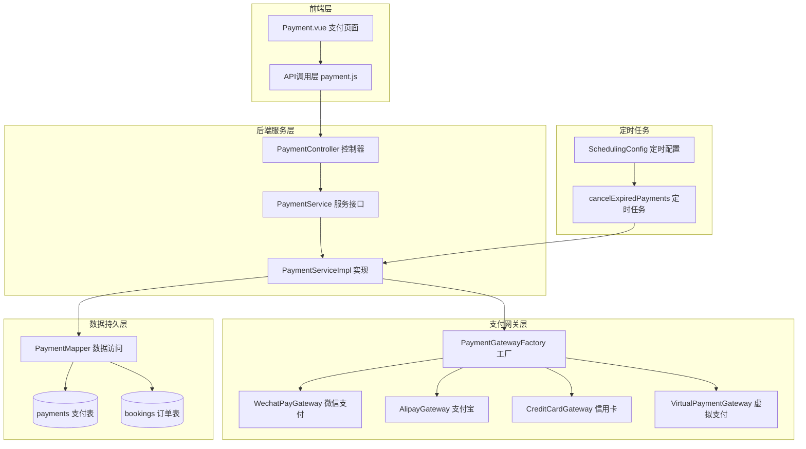

**图表来源**
- [Payment.vue](file://frontend/src/views/Payment.vue#L1-L50)
- [PaymentController.java](file://backend/src/main/java/com/carwash/controller/PaymentController.java#L1-L50)
- [PaymentServiceImpl.java](file://backend/src/main/java/com/carwash/service/impl/PaymentServiceImpl.java#L1-L50)
- [PaymentGatewayFactory.java](file://backend/src/main/java/com/carwash/service/payment/PaymentGatewayFactory.java#L1-L50)

## 前端支付组件分析

### 支付表单构建

前端Payment.vue组件负责构建完整的支付表单，支持多种支付方式的选择和验证。

#### 支付方式选择

系统支持三种主要支付方式：
- **微信支付**：使用SVG图标标识，支持扫码支付
- **支付宝**：蓝色主题图标，支持多种支付渠道
- **信用卡支付**：需要填写持卡人信息、卡号、有效期、CVV和短信验证码

#### 信用卡支付表单

信用卡支付包含以下字段验证：
- **持卡人姓名**：必填项，不能为空
- **卡号**：Luhn算法验证，支持12-19位数字
- **有效期**：MM/YY格式，月份范围01-12
- **CVV**：3-4位数字
- **短信验证码**：至少4位数字

#### 支付金额处理

前端支持动态金额调整：
- 显示订单基础金额
- 信用卡支付可自定义支付金额
- 实时格式化显示金额（保留两位小数）

**章节来源**
- [Payment.vue](file://frontend/src/views/Payment.vue#L47-L290)

### 支付流程控制

前端支付流程包含以下关键步骤：

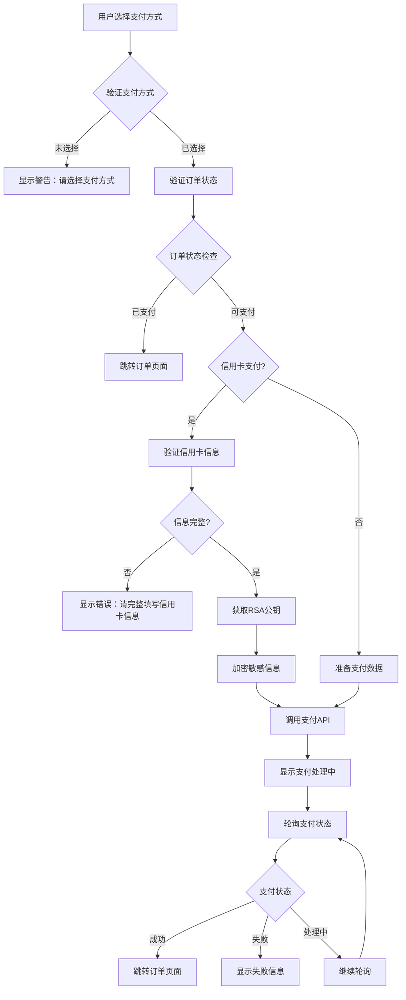

**图表来源**
- [Payment.vue](file://frontend/src/views/Payment.vue#L601-L780)

**章节来源**
- [Payment.vue](file://frontend/src/views/Payment.vue#L601-L780)

## 后端支付服务分析

### PaymentServiceImpl核心逻辑

PaymentServiceImpl是支付服务的核心实现类，负责处理支付请求的完整生命周期。

#### 支付创建流程

支付创建过程包含严格的验证和状态检查：

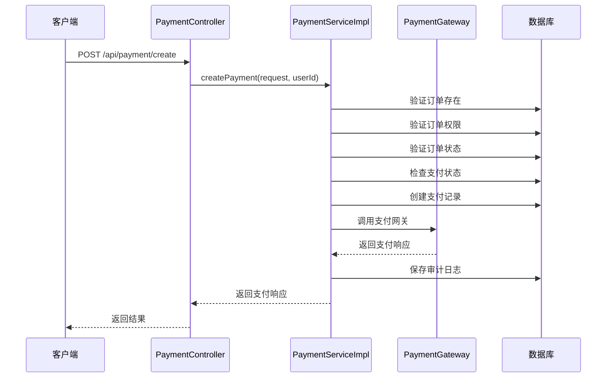

**图表来源**
- [PaymentServiceImpl.java](file://backend/src/main/java/com/carwash/service/impl/PaymentServiceImpl.java#L72-L145)
- [PaymentController.java](file://backend/src/main/java/com/carwash/controller/PaymentController.java#L46-L62)

#### 订单验证机制

系统对订单进行多层验证：
1. **订单存在性验证**：检查订单号是否存在于数据库
2. **权限验证**：确保当前用户有权操作该订单
3. **状态验证**：只允许"confirmed"或"pending"状态的订单发起支付
4. **支付状态验证**：防止重复支付同一订单

#### 支付记录创建

支付记录包含以下关键字段：
- **支付流水号**：唯一标识符，格式为PAY+时间戳+UUID片段
- **过期时间**：设置30分钟有效期
- **初始状态**：设置为"pending"（待支付）
- **支付渠道**：默认为"qr"（扫码支付）

**章节来源**
- [PaymentServiceImpl.java](file://backend/src/main/java/com/carwash/service/impl/PaymentServiceImpl.java#L72-L145)

### 支付状态查询

支付状态查询支持实时状态同步：

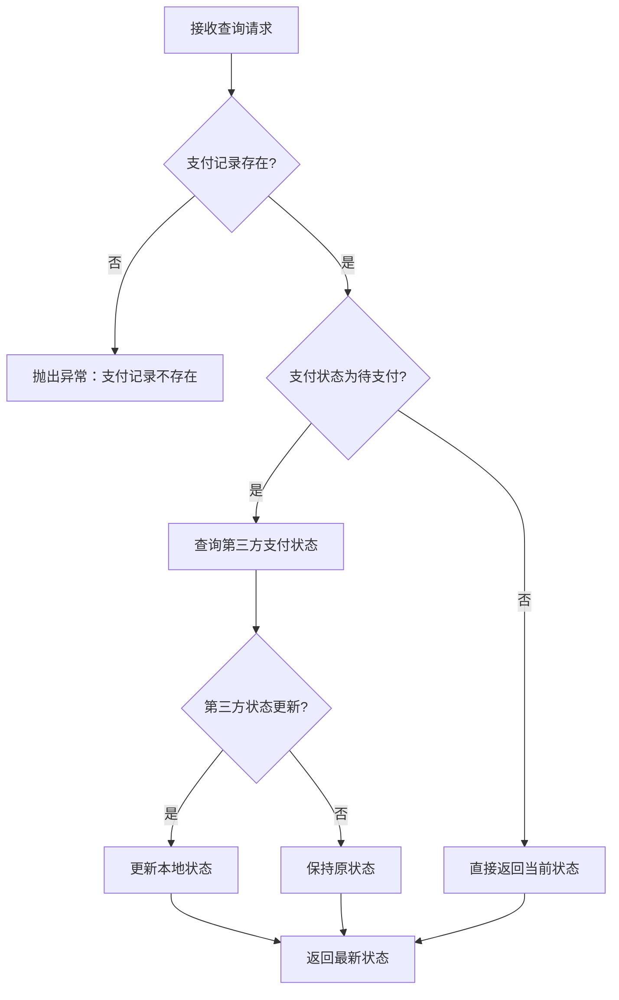

**图表来源**
- [PaymentServiceImpl.java](file://backend/src/main/java/com/carwash/service/impl/PaymentServiceImpl.java#L148-L168)

**章节来源**
- [PaymentServiceImpl.java](file://backend/src/main/java/com/carwash/service/impl/PaymentServiceImpl.java#L148-L168)

### 支付回调处理

支付回调处理确保第三方支付平台的通知能够正确处理：

#### 回调验证流程

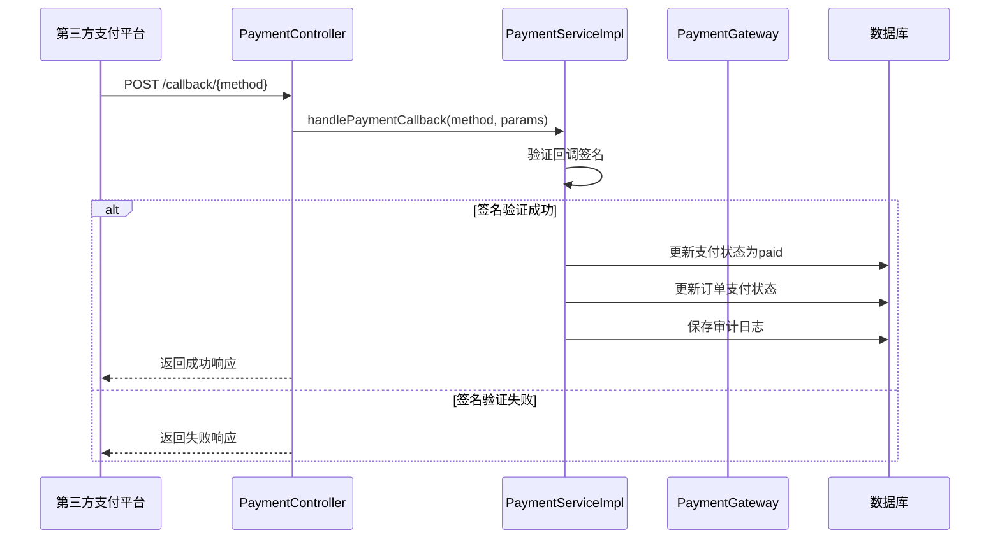

**图表来源**
- [PaymentServiceImpl.java](file://backend/src/main/java/com/carwash/service/impl/PaymentServiceImpl.java#L171-L228)

**章节来源**
- [PaymentServiceImpl.java](file://backend/src/main/java/com/carwash/service/impl/PaymentServiceImpl.java#L171-L228)

## 支付网关系统

### 支付网关工厂模式

PaymentGatewayFactory采用工厂模式管理不同的支付网关实现：

#### 支付网关注册

系统自动扫描所有实现了PaymentGateway接口的Bean，并按支付方式注册：

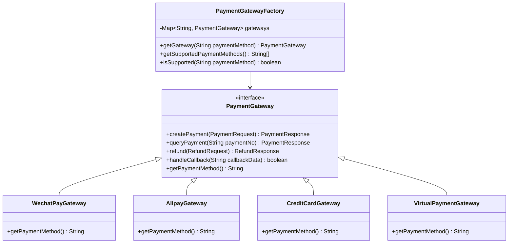

**图表来源**
- [PaymentGatewayFactory.java](file://backend/src/main/java/com/carwash/service/payment/PaymentGatewayFactory.java#L14-L55)
- [VirtualPaymentGateway.java](file://backend/src/main/java/com/carwash/service/payment/VirtualPaymentGateway.java#L19-L92)

#### 支付网关特性

| 支付方式 | 支持渠道 | 特殊功能 |
|---------|---------|---------|
| 微信支付 | qr/app/h5 | 二维码支付、APP内支付 |
| 支付宝 | qr/app/h5 | 扫码支付、手机网站支付 |
| 信用卡 | qr/app/h5 | 加密传输、短信验证 |
| 虚拟支付 | qr/app/h5 | 开发测试专用 |

**章节来源**
- [PaymentGatewayFactory.java](file://backend/src/main/java/com/carwash/service/payment/PaymentGatewayFactory.java#L14-L55)
- [VirtualPaymentGateway.java](file://backend/src/main/java/com/carwash/service/payment/VirtualPaymentGateway.java#L19-L92)

### 虚拟支付网关

虚拟支付网关专为开发和测试环境设计，提供模拟支付功能：

#### 虚拟支付流程

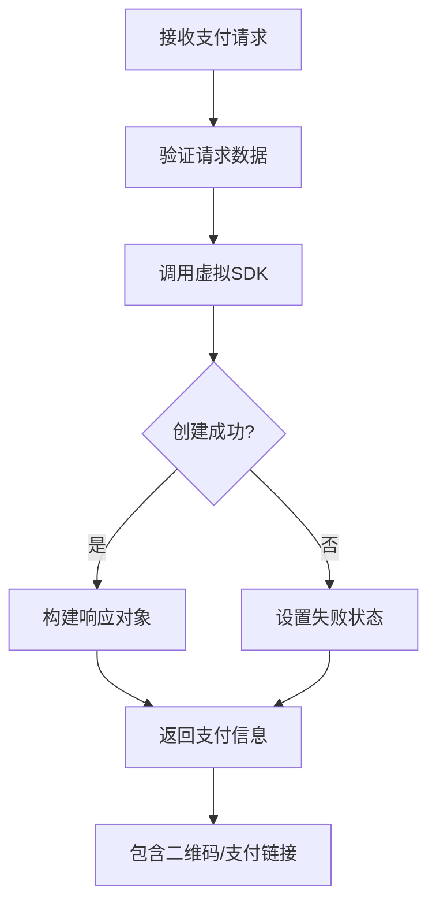

**图表来源**
- [VirtualPaymentGateway.java](file://backend/src/main/java/com/carwash/service/payment/VirtualPaymentGateway.java#L28-L47)

**章节来源**
- [VirtualPaymentGateway.java](file://backend/src/main/java/com/carwash/service/payment/VirtualPaymentGateway.java#L28-L47)

## 支付状态管理

### 支付状态枚举

系统定义了完整的支付状态体系：

| 状态 | 描述 | 转换条件 |
|-----|------|---------|
| pending | 待支付 | 创建支付记录时 |
| paid | 已支付 | 支付成功回调时 |
| failed | 支付失败 | 支付过程中出错 |
| cancelled | 已取消 | 用户取消或超时 |
| refunded | 已退款 | 退款处理完成 |

### 支付记录实体结构

Payment实体类定义了支付记录的完整结构：

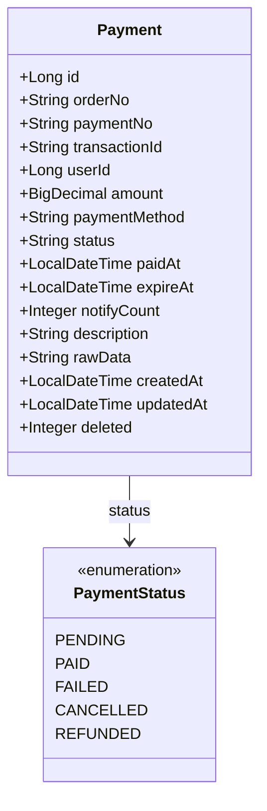

**图表来源**
- [Payment.java](file://backend/src/main/java/com/carwash/entity/Payment.java#L13-L199)

**章节来源**
- [Payment.java](file://backend/src/main/java/com/carwash/entity/Payment.java#L13-L199)

### 审计日志系统

系统实现了完整的支付审计日志功能：

#### 审计事件类型

- **CREATE**：创建支付记录
- **CALL_GATEWAY**：调用支付网关
- **QUERY_STATUS**：查询第三方状态
- **CALLBACK_VERIFIED**：回调签名验证
- **CALLBACK_UPDATE**：回调更新支付状态
- **REFUND_REQUEST**：发起退款请求
- **REFUND_SUCCESS**：退款成功
- **REFUND_FAILED**：退款失败
- **CANCEL_EXPIRED**：取消过期支付

**章节来源**
- [PaymentServiceImpl.java](file://backend/src/main/java/com/carwash/service/impl/PaymentServiceImpl.java#L455-L476)

## 支付超时机制

### 超时时间设置

系统为每笔支付设置30分钟的有效期：

```java
// 在PaymentServiceImpl.createPayment方法中
payment.setExpireAt(TimeUtils.now().plusMinutes(30));
```

### 定时清理机制

系统通过定时任务定期清理过期支付订单：

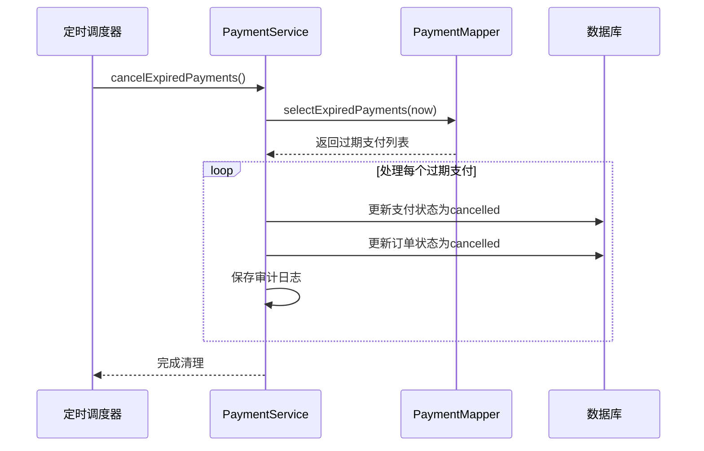

**图表来源**
- [PaymentServiceImpl.java](file://backend/src/main/java/com/carwash/service/impl/PaymentServiceImpl.java#L332-L355)

#### 定时任务配置

系统启用Spring的定时任务功能：

```java
@Configuration
@EnableScheduling
public class SchedulingConfig {
}
```

**章节来源**
- [SchedulingConfig.java](file://backend/src/main/java/com/carwash/config/SchedulingConfig.java#L1-L11)
- [PaymentServiceImpl.java](file://backend/src/main/java/com/carwash/service/impl/PaymentServiceImpl.java#L332-L355)

### 过期支付处理

过期支付的处理流程：

1. **状态更新**：将支付状态从"pending"改为"cancelled"
2. **订单状态同步**：更新关联订单状态为"cancelled"
3. **审计记录**：记录取消原因和时间
4. **通知机制**：可选的通知用户支付超时

**章节来源**
- [PaymentServiceImpl.java](file://backend/src/main/java/com/carwash/service/impl/PaymentServiceImpl.java#L332-L355)

## 支付流程时序图

以下是完整的支付流程时序图：

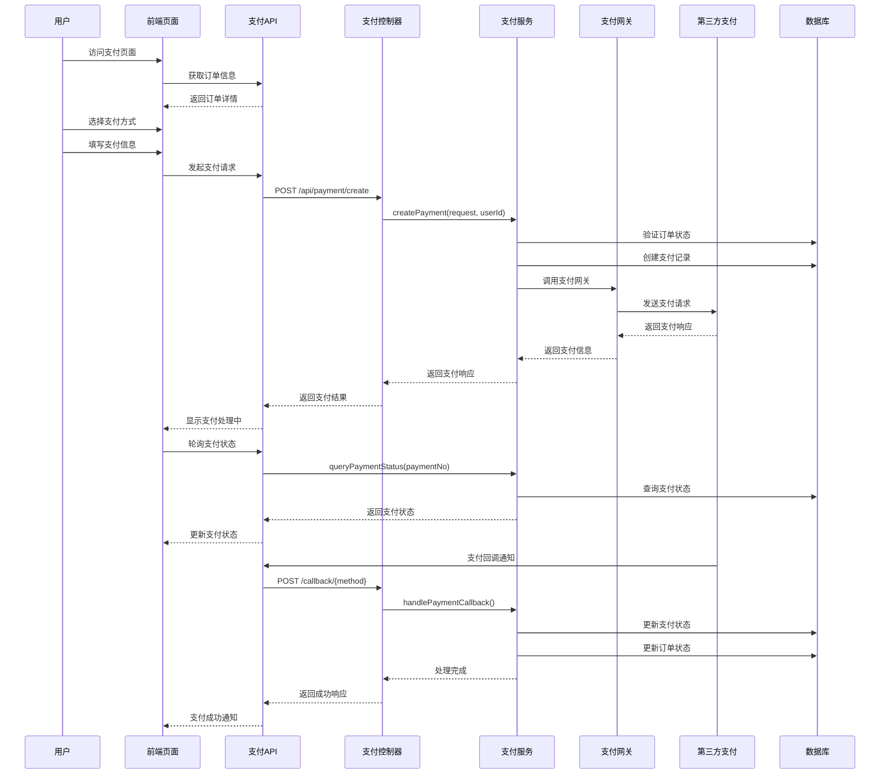

**图表来源**
- [Payment.vue](file://frontend/src/views/Payment.vue#L601-L780)
- [PaymentController.java](file://backend/src/main/java/com/carwash/controller/PaymentController.java#L46-L62)
- [PaymentServiceImpl.java](file://backend/src/main/java/com/carwash/service/impl/PaymentServiceImpl.java#L72-L145)

## 支付状态转换图

支付状态在整个生命周期中的转换关系：

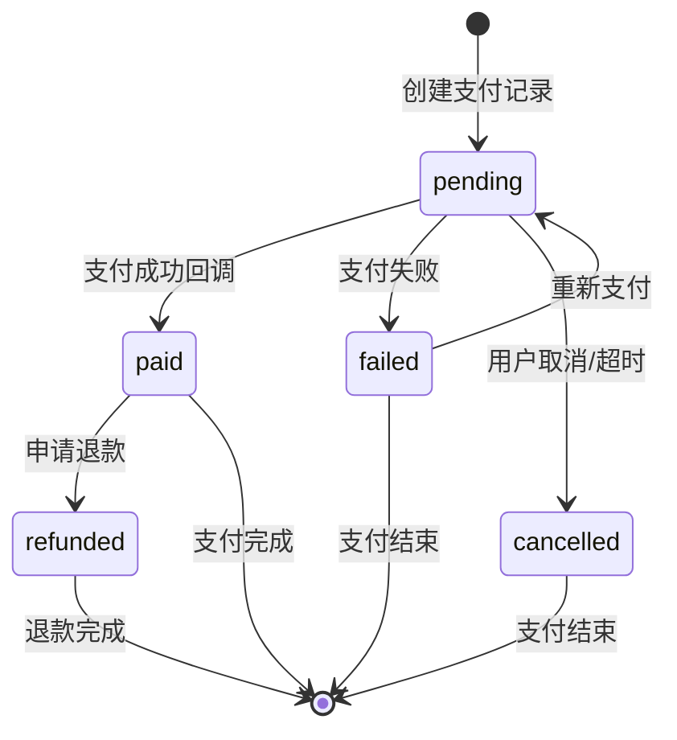

**图表来源**
- [Payment.java](file://backend/src/main/java/com/carwash/entity/Payment.java#L60-L62)

## 故障排除指南

### 常见支付问题及解决方案

#### 支付创建失败

**问题症状**：用户无法创建支付订单
**可能原因**：
1. 订单不存在或已被删除
2. 订单状态不允许支付
3. 用户权限不足
4. 支付金额验证失败

**解决方案**：
1. 检查订单号是否正确
2. 验证订单状态是否为"confirmed"或"pending"
3. 确认用户身份验证
4. 检查支付金额格式和范围

#### 支付回调失败

**问题症状**：支付成功但系统未更新状态
**可能原因**：
1. 回调签名验证失败
2. 网络连接问题
3. 数据库更新失败

**解决方案**：
1. 检查支付网关配置的回调地址
2. 验证签名验证逻辑
3. 查看服务器日志确认具体错误

#### 支付超时处理

**问题症状**：支付订单长时间处于待支付状态
**解决方案**：
1. 定期运行定时任务清理过期订单
2. 前端轮询支付状态
3. 提供手动刷新状态功能

#### 信用卡支付安全

**安全措施**：
1. 使用RSA-OAEP加密传输敏感信息
2. 实施Luhn算法验证卡号
3. 短信验证码二次验证
4. 定期更新加密密钥

**章节来源**
- [PaymentServiceImpl.java](file://backend/src/main/java/com/carwash/service/impl/PaymentServiceImpl.java#L332-L355)
- [Payment.vue](file://frontend/src/views/Payment.vue#L601-L780)