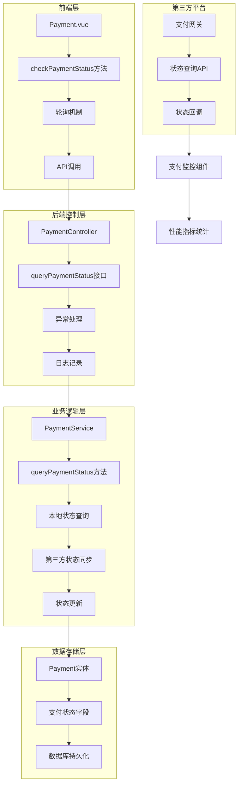
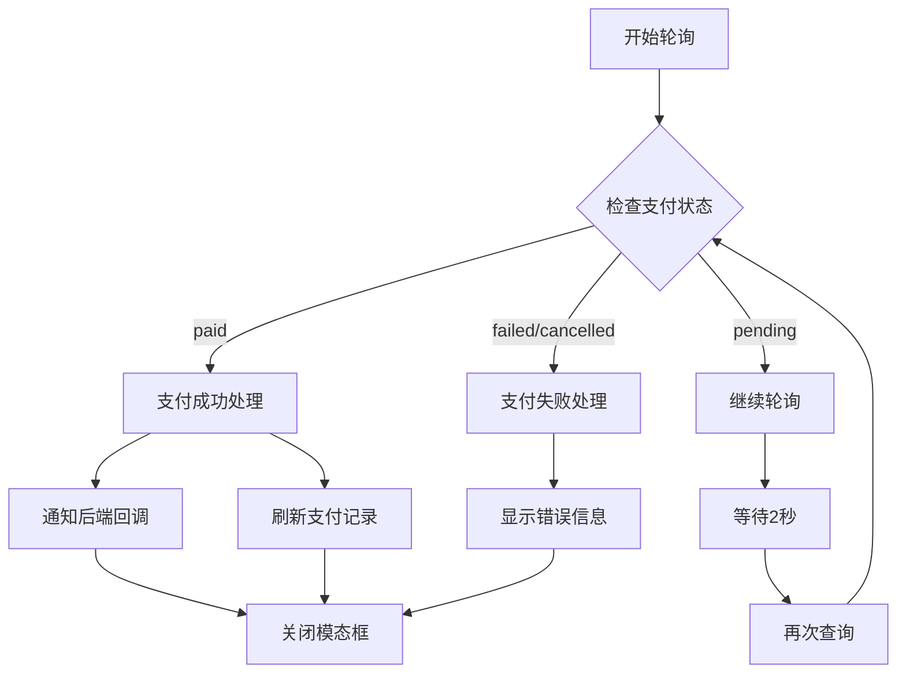
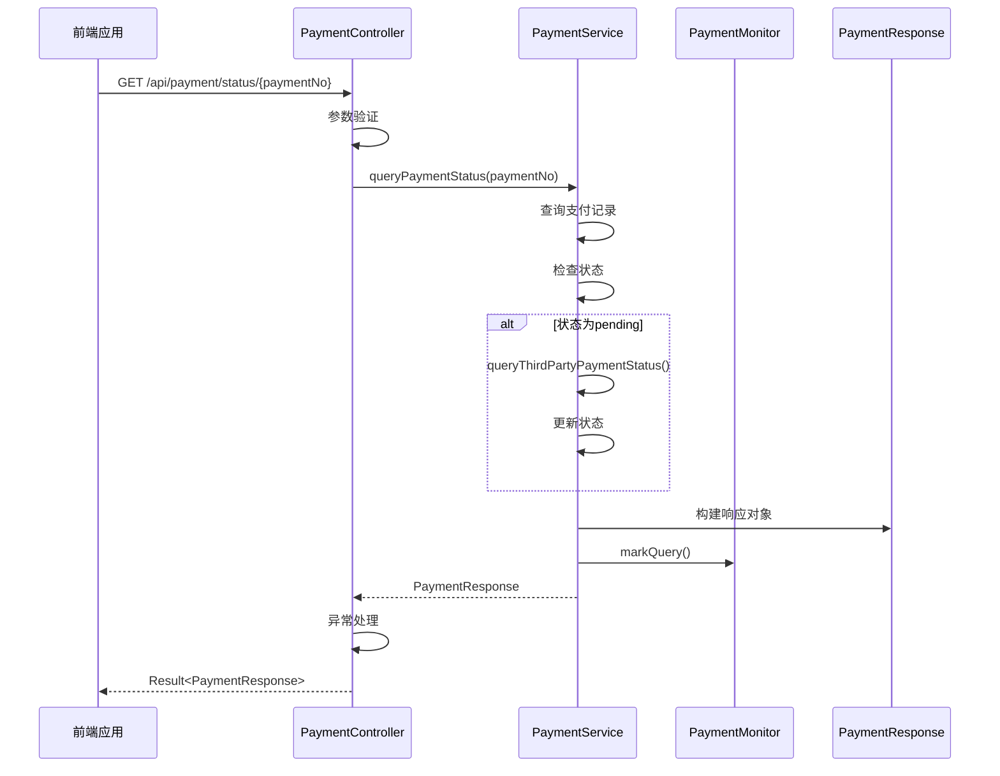
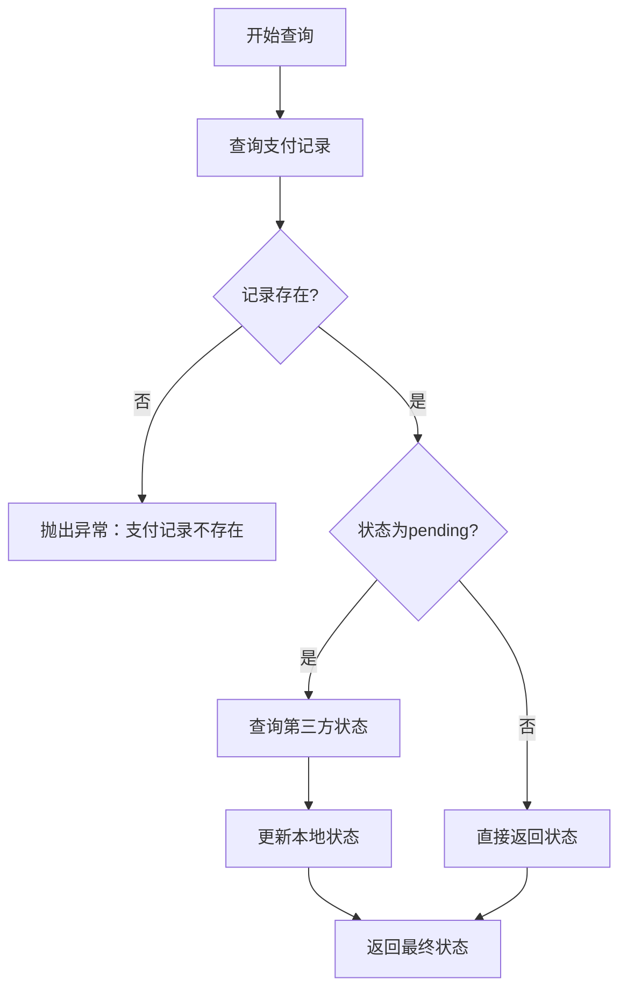
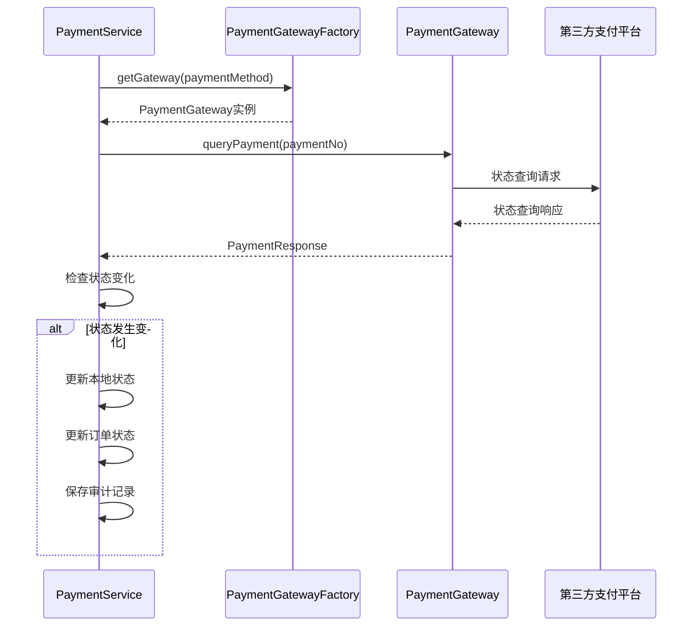
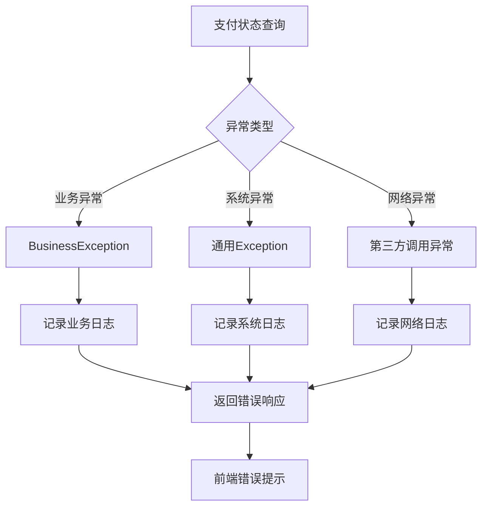
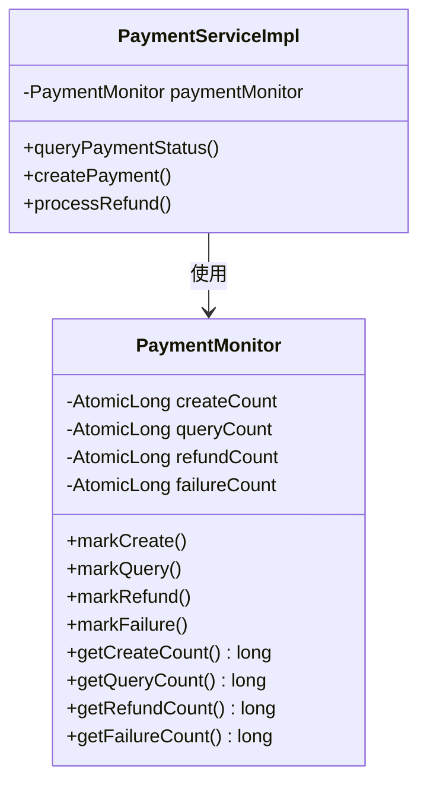
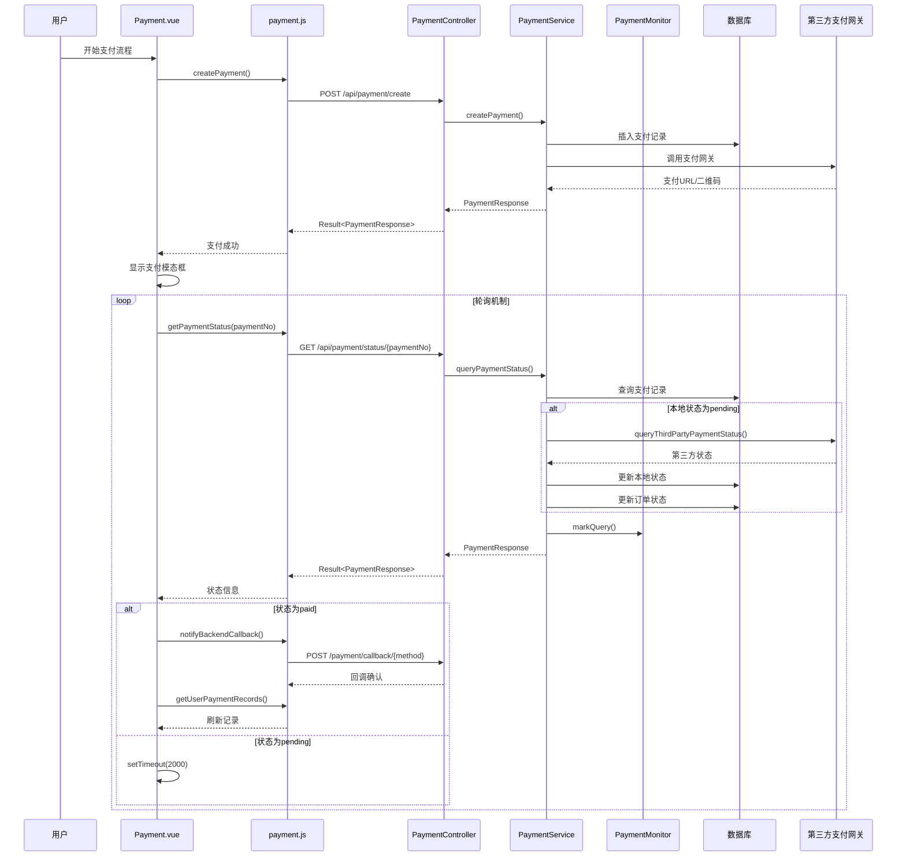

# 支付状态查询功能深度解析

<cite>
**本文档引用的文件**
- [Payment.vue](file://frontend/src/views/Payment.vue)
- [PaymentController.java](file://backend/src/main/java/com/carwash/controller/PaymentController.java)
- [PaymentServiceImpl.java](file://backend/src/main/java/com/carwash/service/impl/PaymentServiceImpl.java)
- [Payment.java](file://backend/src/main/java/com/carwash/entity/Payment.java)
- [PaymentMonitor.java](file://backend/src/main/java/com/carwash/monitor/PaymentMonitor.java)
- [payment.js](file://frontend/src/api/payment.js)
- [PaymentResponse.java](file://backend/src/main/java/com/carwash/dto/PaymentResponse.java)
- [PaymentService.java](file://backend/src/main/java/com/carwash/service/PaymentService.java)
</cite>

## 目录
1. [引言](#引言)
2. [系统架构概览](#系统架构概览)
3. [前端支付状态轮询机制](#前端支付状态轮询机制)
4. [后端支付状态查询接口](#后端支付状态查询接口)
5. [核心业务逻辑分析](#核心业务逻辑分析)
6. [第三方支付状态同步机制](#第三方支付状态同步机制)
7. [异常处理与日志记录](#异常处理与日志记录)
8. [支付监控组件](#支付监控组件)
9. [时序图分析](#时序图分析)
10. [性能优化策略](#性能优化策略)
11. [总结](#总结)

## 引言

支付状态查询功能是汽车洗车服务预约系统中的核心组件，负责实时跟踪支付状态并提供准确的支付结果反馈。该功能采用前后端分离架构，通过轮询机制和第三方支付平台集成，实现了可靠的支付状态同步。

本文档将深入分析从前端Payment.vue组件的checkPaymentStatus方法开始的完整支付状态查询流程，涵盖后端PaymentController.queryPaymentStatus接口处理、PaymentServiceImpl.queryPaymentStatus业务逻辑，以及第三方支付状态同步的完整机制。

## 系统架构概览

支付状态查询系统采用三层架构设计，包含前端轮询层、后端控制层和业务逻辑层，以及第三方支付平台集成层。

**图表来源**
- [Payment.vue](file://frontend/src/views/Payment.vue#L743-L770)
- [PaymentController.java](file://backend/src/main/java/com/carwash/controller/PaymentController.java#L67-L77)
- [PaymentServiceImpl.java](file://backend/src/main/java/com/carwash/service/impl/PaymentServiceImpl.java#L147-L168)

## 前端支付状态轮询机制

前端支付状态查询采用基于setTimeout的轮询机制，通过checkPaymentStatus方法实现定期状态检查。

### 轮询触发时机

支付状态轮询在以下场景触发：
- 支付成功后模拟支付处理阶段（3秒延迟）
- 支付状态为"pending"时持续轮询
- 支付失败或取消时停止轮询

### 轮询逻辑实现

**图表来源**
- [Payment.vue](file://frontend/src/views/Payment.vue#L743-L770)

### 轮询参数配置

前端轮询机制的关键配置参数：
- **轮询间隔**：2000毫秒（2秒）
- **超时处理**：通过状态判断而非固定超时
- **错误恢复**：异常时设置为失败状态

**章节来源**
- [Payment.vue](file://frontend/src/views/Payment.vue#L743-L770)

## 后端支付状态查询接口

PaymentController.queryPaymentStatus方法作为支付状态查询的入口点，负责接收前端请求并调用业务层处理。

### 接口定义与处理流程

**图表来源**
- [PaymentController.java](file://backend/src/main/java/com/carwash/controller/PaymentController.java#L67-L77)
- [PaymentServiceImpl.java](file://backend/src/main/java/com/carwash/service/impl/PaymentServiceImpl.java#L147-L168)

### 异常处理机制

后端接口采用统一异常处理策略：
- **业务异常**：抛出BusinessException，返回具体错误信息
- **系统异常**：捕获通用Exception，记录错误日志
- **参数验证**：通过注解@PathVariable进行路径参数验证

**章节来源**
- [PaymentController.java](file://backend/src/main/java/com/carwash/controller/PaymentController.java#L67-L77)

## 核心业务逻辑分析

PaymentServiceImpl.queryPaymentStatus方法是支付状态查询的核心业务逻辑实现。

### 本地支付记录查询

系统首先查询本地支付记录，这是状态查询的第一步：

**图表来源**
- [PaymentServiceImpl.java](file://backend/src/main/java/com/carwash/service/impl/PaymentServiceImpl.java#L147-L168)

### 状态变化检测机制

当支付状态为"pending"时，系统会自动调用第三方支付平台的状态查询：

| 状态条件 | 处理动作 | 数据库更新 |
|---------|---------|-----------|
| 本地状态=pending | 调用queryThirdPartyPaymentStatus | 是 |
| 本地状态=paid | 直接返回，不查询第三方 | 否 |
| 本地状态=failed/cancelled | 直接返回 | 否 |

### 响应构建过程

查询结果通过buildPaymentResponse方法构建统一响应对象，包含以下关键字段：
- **paymentNo**：支付流水号
- **orderNo**：关联订单号  
- **amount**：支付金额
- **paymentMethod**：支付方式
- **status**：当前状态
- **paidAt**：支付时间
- **transactionId**：第三方交易号

**章节来源**
- [PaymentServiceImpl.java](file://backend/src/main/java/com/carwash/service/impl/PaymentServiceImpl.java#L147-L168)
- [PaymentResponse.java](file://backend/src/main/java/com/carwash/dto/PaymentResponse.java#L19-L196)

## 第三方支付状态同步机制

当本地支付状态为"pending"时，系统会自动调用第三方支付平台的状态查询，实现状态同步。

### queryThirdPartyPaymentStatus方法分析

**图表来源**
- [PaymentServiceImpl.java](file://backend/src/main/java/com/carwash/service/impl/PaymentServiceImpl.java#L417-L450)

### 状态同步规则

第三方状态同步遵循严格的规则：

| 第三方状态 | 本地状态更新 | 订单状态更新 | 数据库操作 |
|-----------|-------------|-------------|-----------|
| paid | paid | paid | 更新支付时间和交易号 |
| pending | pending | unpaid | 保持原状 |
| failed | failed | unpaid | 记录失败原因 |
| cancelled | cancelled | unpaid | 记录取消原因 |

### 状态变化检测

系统通过比较本地状态与第三方返回状态来检测变化：
- **状态相同**：不进行任何更新
- **状态不同**：执行状态更新和相关业务逻辑

**章节来源**
- [PaymentServiceImpl.java](file://backend/src/main/java/com/carwash/service/impl/PaymentServiceImpl.java#L417-L450)

## 异常处理与日志记录

系统采用多层次的异常处理和日志记录机制，确保支付状态查询的可靠性和可追踪性。

### 异常分类处理

### 日志记录策略

系统在关键节点记录详细日志：
- **查询开始**：记录支付流水号和查询时间
- **第三方调用**：记录调用参数和响应结果
- **状态更新**：记录状态变更前后的值
- **异常情况**：记录异常堆栈和上下文信息

### 审计记录机制

每次状态查询都会生成审计记录，包含：
- **事件类型**：QUERY_STATUS
- **状态变化**：前状态和后状态
- **原始数据**：第三方返回的原始数据
- **操作时间**：精确到毫秒的时间戳

**章节来源**
- [PaymentServiceImpl.java](file://backend/src/main/java/com/carwash/service/impl/PaymentServiceImpl.java#L455-L476)

## 支付监控组件

PaymentMonitor组件提供轻量级的支付业务监控功能，记录各种操作的计数器。

### 监控指标定义

**图表来源**
- [PaymentMonitor.java](file://backend/src/main/java/com/carwash/monitor/PaymentMonitor.java#L11-L27)

### 监控调用时机

PaymentMonitor在以下场景被调用：
- **创建支付**：markCreate()
- **查询状态**：markQuery()  
- **处理退款**：markRefund()
- **操作失败**：markFailure()

### 性能指标统计

监控组件提供的统计指标：
- **创建计数**：新创建的支付订单数量
- **查询计数**：状态查询调用次数
- **退款计数**：退款处理次数
- **失败计数**：操作失败次数

**章节来源**
- [PaymentMonitor.java](file://backend/src/main/java/com/carwash/monitor/PaymentMonitor.java#L11-L27)
- [PaymentServiceImpl.java](file://backend/src/main/java/com/carwash/service/impl/PaymentServiceImpl.java#L142-L145)

## 时序图分析

以下是支付状态查询功能的完整时序图，展示了从前端轮询到后端处理的完整交互过程。

**图表来源**
- [Payment.vue](file://frontend/src/views/Payment.vue#L743-L770)
- [PaymentController.java](file://backend/src/main/java/com/carwash/controller/PaymentController.java#L67-L77)
- [PaymentServiceImpl.java](file://backend/src/main/java/com/carwash/service/impl/PaymentServiceImpl.java#L147-L168)

## 性能优化策略

支付状态查询功能采用多种性能优化策略，确保系统的高效运行。

### 查询优化

- **索引优化**：payment_no字段建立唯一索引
- **缓存策略**：高频查询结果缓存
- **批量查询**：支持批量状态查询

### 轮询优化

- **指数退避**：非活跃支付增加轮询间隔
- **智能终止**：超时或状态确定后停止轮询
- **并发控制**：限制同时轮询的支付数量

### 数据库优化

- **分页查询**：大量支付记录的分页处理
- **异步更新**：状态更新采用异步方式
- **连接池**：数据库连接池管理

## 总结

支付状态查询功能通过精心设计的架构和完善的业务逻辑，实现了可靠的支付状态跟踪和同步。系统采用前后端分离的轮询机制，结合第三方支付平台集成，确保了支付状态的准确性和实时性。

关键特性包括：
- **可靠性**：多重异常处理和日志记录
- **可扩展性**：模块化设计支持多种支付方式
- **可观测性**：完整的监控和审计机制
- **用户体验**：平滑的轮询体验和及时的状态反馈

该功能为汽车洗车服务预约系统提供了坚实的支付基础，支撑了整个业务流程的顺畅运行。