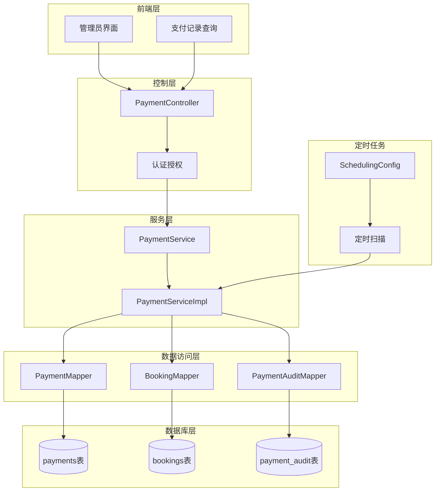
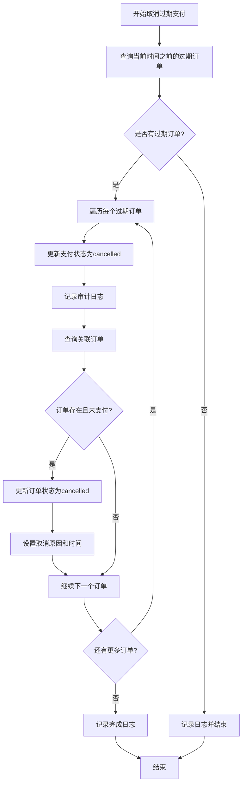
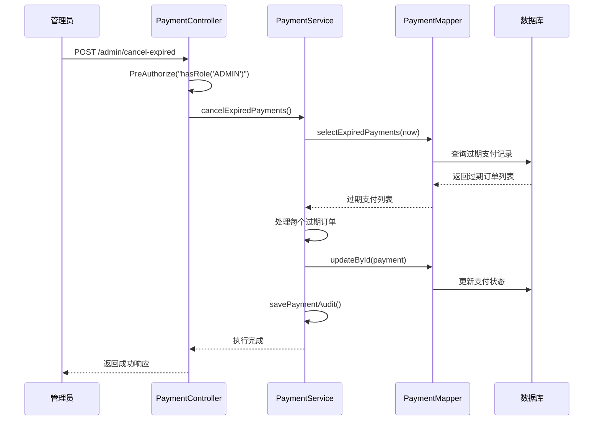
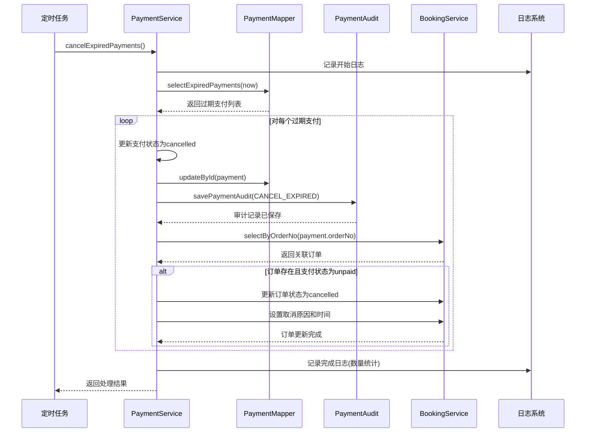
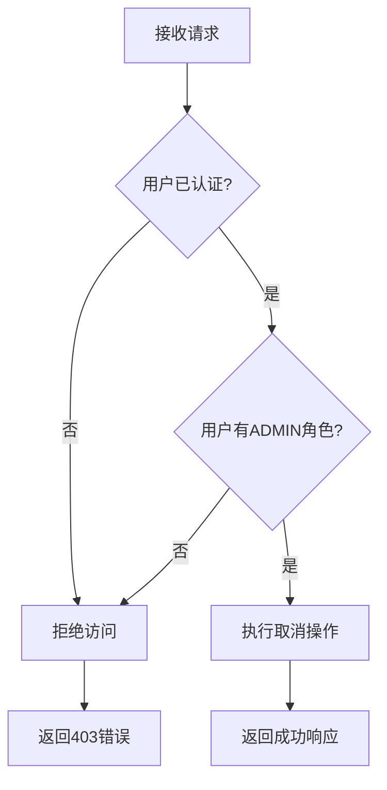
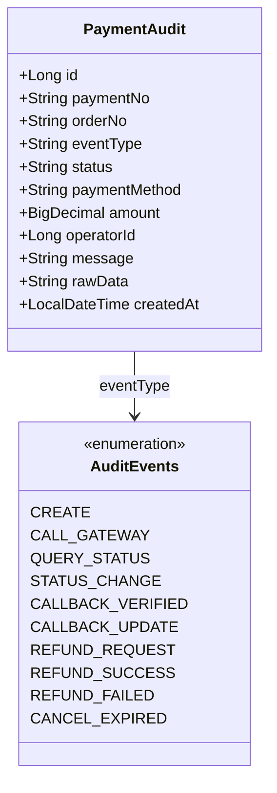
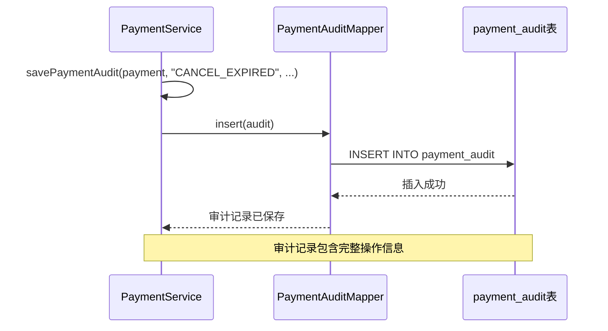
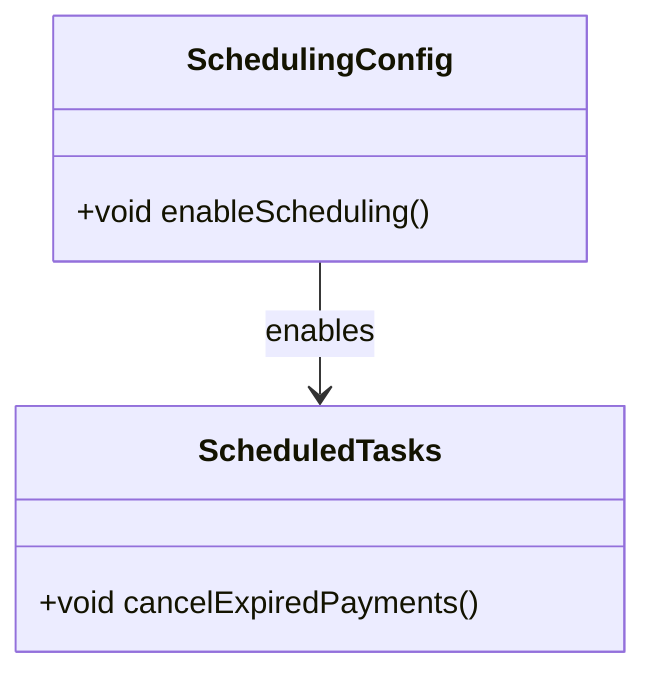

# 过期支付订单自动取消机制详细说明

<cite>
**本文档引用的文件**
- [PaymentServiceImpl.java](file://backend/src/main/java/com/carwash/service/impl/PaymentServiceImpl.java)
- [PaymentController.java](file://backend/src/main/java/com/carwash/controller/PaymentController.java)
- [PaymentMapper.java](file://backend/src/main/java/com/carwash/mapper/PaymentMapper.java)
- [PaymentMapper.xml](file://backend/src/main/resources/mapper/PaymentMapper.xml)
- [Payment.java](file://backend/src/main/java/com/carwash/entity/Payment.java)
- [PaymentAudit.java](file://backend/src/main/java/com/carwash/entity/PaymentAudit.java)
- [SchedulingConfig.java](file://backend/src/main/java/com/carwash/config/SchedulingConfig.java)
- [payment_tables.sql](file://backend/src/main/resources/sql/payment_tables.sql)
- [2025-11-08__create_payment_audit.sql](file://sql/2025-11-08__create_payment_audit.sql)
</cite>

## 目录
1. [概述](#概述)
2. [系统架构](#系统架构)
3. [核心组件分析](#核心组件分析)
4. [过期支付取消流程](#过期支付取消流程)
5. [数据库设计](#数据库设计)
6. [安全机制](#安全机制)
7. [审计日志系统](#审计日志系统)
8. [定时任务集成](#定时任务集成)
9. [故障排除指南](#故障排除指南)
10. [总结](#总结)

## 概述

汽车洗车服务预约系统的过期支付订单自动取消机制是一个关键的系统功能，旨在及时清理无效的支付订单，释放系统资源，并维护良好的用户体验。该机制通过定时任务定期检查并取消超过支付有效期的待支付订单，确保系统数据的准确性和一致性。

### 主要特性

- **自动化处理**：无需人工干预，系统自动识别和处理过期订单
- **级联更新**：支付状态变更时自动更新关联订单状态
- **完整的审计跟踪**：记录所有取消操作的详细信息
- **管理员保护**：提供手动触发接口，仅限管理员访问
- **事务性保证**：确保数据一致性，避免部分更新问题

## 系统架构



**图表来源**
- [PaymentController.java](file://backend/src/main/java/com/carwash/controller/PaymentController.java#L202-L216)
- [PaymentServiceImpl.java](file://backend/src/main/java/com/carwash/service/impl/PaymentServiceImpl.java#L332-L354)
- [SchedulingConfig.java](file://backend/src/main/java/com/carwash/config/SchedulingConfig.java#L1-L11)

## 核心组件分析

### PaymentServiceImpl.cancelExpiredPayments 方法

这是系统的核心业务逻辑，负责执行过期支付订单的自动取消操作。

#### 方法结构分析



**图表来源**
- [PaymentServiceImpl.java](file://backend/src/main/java/com/carwash/service/impl/PaymentServiceImpl.java#L332-L354)

#### 关键实现细节

1. **查询条件**：通过 [`PaymentMapper.selectExpiredPayments`](file://backend/src/main/java/com/carwash/mapper/PaymentMapper.java#L41-L41) 方法查询状态为"pending"且过期时间早于当前时间的所有支付记录

2. **状态更新**：将查询到的每个支付记录的状态从"pending"更新为"cancelled"

3. **级联影响**：
   - 更新支付状态
   - 记录审计日志
   - 检查并更新关联订单状态
   - 设置取消时间和原因

**章节来源**
- [PaymentServiceImpl.java](file://backend/src/main/java/com/carwash/service/impl/PaymentServiceImpl.java#L332-L354)

### PaymentController.cancelExpiredPayments 接口

提供管理员手动触发过期支付取消的功能。

#### 接口特性

- **路径**：`POST /api/payment/admin/cancel-expired`
- **权限要求**：需要ADMIN角色权限
- **响应格式**：标准Result<T>格式
- **异常处理**：捕获并记录所有异常

#### 安全机制



**图表来源**
- [PaymentController.java](file://backend/src/main/java/com/carwash/controller/PaymentController.java#L202-L216)

**章节来源**
- [PaymentController.java](file://backend/src/main/java/com/carwash/controller/PaymentController.java#L202-L216)

## 过期支付取消流程

### 完整处理流程



**图表来源**
- [PaymentServiceImpl.java](file://backend/src/main/java/com/carwash/service/impl/PaymentServiceImpl.java#L332-L354)

### 状态转换规则

| 当前状态 | 新状态 | 触发条件 | 影响 |
|---------|--------|----------|------|
| pending | cancelled | 支付超时 | 支付记录失效 |
| unpaid | cancelled | 关联支付取消 | 订单状态同步更新 |
| confirmed | cancelled | 支付取消 | 订单状态同步更新 |

**章节来源**
- [PaymentServiceImpl.java](file://backend/src/main/java/com/carwash/service/impl/PaymentServiceImpl.java#L332-L354)

## 数据库设计

### 支付记录表 (payments)

支付记录表存储所有支付相关的数据，包括过期时间字段用于自动取消机制。

#### 表结构特点

- **主键**：自增ID
- **唯一约束**：payment_no
- **索引优化**：order_no, payment_no, user_id, status, created_at
- **软删除**：deleted字段支持逻辑删除

#### 字段说明

| 字段名 | 类型 | 约束 | 说明 |
|--------|------|------|------|
| id | BIGINT | PRIMARY KEY | 主键ID |
| order_no | VARCHAR(32) | NOT NULL | 关联订单号 |
| payment_no | VARCHAR(64) | NOT NULL, UNIQUE | 支付流水号 |
| status | VARCHAR(20) | NOT NULL, DEFAULT 'pending' | 支付状态 |
| expire_at | TIMESTAMP | NOT NULL | 支付过期时间 |
| deleted | TINYINT | NOT NULL, DEFAULT 0 | 逻辑删除标记 |

**章节来源**
- [payment_tables.sql](file://backend/src/main/resources/sql/payment_tables.sql#L1-L27)

### 支付审计表 (payment_audit)

审计表记录所有支付相关的操作历史，包括过期支付取消操作。

#### 审计事件类型

- **CANCEL_EXPIRED**：过期支付自动取消
- **CREATE**：创建支付记录
- **CALL_GATEWAY**：调用支付网关
- **CALLBACK_UPDATE**：支付回调更新

#### 审计记录结构

| 字段名 | 类型 | 说明 |
|--------|------|------|
| payment_no | VARCHAR(64) | 支付流水号 |
| order_no | VARCHAR(64) | 订单号 |
| event_type | VARCHAR(32) | 事件类型 |
| status | VARCHAR(32) | 当前状态 |
| amount | DECIMAL(10,2) | 金额 |
| operator_id | BIGINT | 操作人ID |
| message | VARCHAR(255) | 信息摘要 |
| raw_data | TEXT | 原始数据 |
| created_at | TIMESTAMP | 创建时间 |

**章节来源**
- [2025-11-08__create_payment_audit.sql](file://sql/2025-11-08__create_payment_audit.sql#L1-L19)
- [PaymentAudit.java](file://backend/src/main/java/com/carwash/entity/PaymentAudit.java#L1-L84)

### SQL查询实现

```sql
-- 查询过期未支付的订单
SELECT 
    id, order_no, payment_no, transaction_id, user_id, amount, 
    payment_method, status, paid_at, expire_at, notify_count, 
    description, raw_data, created_at, updated_at, deleted
FROM payments
WHERE status = 'pending' 
AND expire_at < #{expireTime} 
AND deleted = 0
ORDER BY expire_at ASC
```

**章节来源**
- [PaymentMapper.xml](file://backend/src/main/resources/mapper/PaymentMapper.xml#L68-L77)

## 安全机制

### 角色权限控制

系统采用基于角色的访问控制(RBAC)，确保只有管理员可以执行过期支付取消操作。

#### 权限验证流程



**图表来源**
- [PaymentController.java](file://backend/src/main/java/com/carwash/controller/PaymentController.java#L205-L207)

### 异常处理策略

- **业务异常**：记录详细错误信息，返回友好提示
- **系统异常**：记录堆栈信息，返回通用错误消息
- **事务回滚**：确保数据一致性

**章节来源**
- [PaymentController.java](file://backend/src/main/java/com/carwash/controller/PaymentController.java#L208-L215)

## 审计日志系统

### 审计记录生成

每次过期支付取消都会生成详细的审计记录，包含以下信息：

#### 审计事件详情



**图表来源**
- [PaymentAudit.java](file://backend/src/main/java/com/carwash/entity/PaymentAudit.java#L1-L84)

### 审计数据流



**图表来源**
- [PaymentServiceImpl.java](file://backend/src/main/java/com/carwash/service/impl/PaymentServiceImpl.java#L456-L475)

**章节来源**
- [PaymentServiceImpl.java](file://backend/src/main/java/com/carwash/service/impl/PaymentServiceImpl.java#L341-L342)

## 定时任务集成

### 定时任务配置

系统通过Spring的调度框架实现定时任务功能。

#### 配置类分析



**图表来源**
- [SchedulingConfig.java](file://backend/src/main/java/com/carwash/config/SchedulingConfig.java#L1-L11)

### 定时任务执行策略

虽然当前实现主要依赖管理员手动触发，但系统架构支持定时任务自动执行：

#### 推荐的定时任务配置

```yaml
# application.yml 示例配置
spring:
  scheduling:
    enabled: true
    cron:
      cancel-expired-payments: "0 0 */1 * * *"  # 每小时执行一次
```

#### 执行频率建议

- **生产环境**：每小时执行一次
- **测试环境**：每5分钟执行一次
- **开发环境**：按需手动触发

**章节来源**
- [SchedulingConfig.java](file://backend/src/main/java/com/carwash/config/SchedulingConfig.java#L1-L11)

## 故障排除指南

### 常见问题及解决方案

#### 1. 过期支付未被取消

**可能原因**：
- 定时任务未正确配置
- 数据库连接异常
- 权限配置错误

**排查步骤**：
1. 检查定时任务配置
2. 验证数据库连接
3. 确认管理员权限

#### 2. 审计日志缺失

**可能原因**：
- PaymentAuditMapper未正确注入
- 数据库表不存在
- 写入权限不足

**解决方案**：
- 检查依赖注入配置
- 验证数据库表结构
- 确认写入权限

#### 3. 级联更新失败

**可能原因**：
- 关联订单不存在
- 数据库事务冲突
- 并发更新问题

**解决方案**：
- 添加订单存在性检查
- 优化事务隔离级别
- 实现乐观锁机制

### 性能监控指标

| 指标名称 | 监控目的 | 正常范围 |
|---------|----------|----------|
| 取消订单数量 | 系统负载 | < 1000/小时 |
| 处理耗时 | 响应性能 | < 5秒/批 |
| 审计记录数 | 数据完整性 | 1:1比例 |
| 错误率 | 系统稳定性 | < 1% |

## 总结

汽车洗车服务预约系统的过期支付订单自动取消机制是一个设计精良的系统功能，具有以下优势：

### 技术优势

1. **自动化程度高**：减少人工干预，提高系统效率
2. **数据一致性强**：通过事务保证级联更新的原子性
3. **审计追踪完善**：完整的操作日志便于问题追溯
4. **扩展性强**：模块化设计支持功能扩展

### 运营价值

1. **资源优化**：及时清理无效订单，释放系统资源
2. **用户体验**：避免用户长时间等待无效订单
3. **数据质量**：保持支付数据的准确性和时效性
4. **合规性**：满足金融支付系统的监管要求

### 改进建议

1. **监控告警**：添加实时监控和异常告警机制
2. **批量处理**：优化大量订单处理的性能
3. **重试机制**：实现失败操作的自动重试
4. **容量规划**：根据业务量调整定时任务频率

该机制为系统的稳定运行提供了重要保障，是现代支付系统不可或缺的核心功能之一。