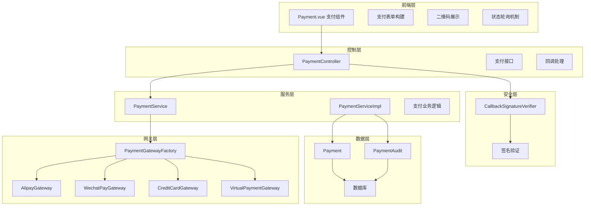
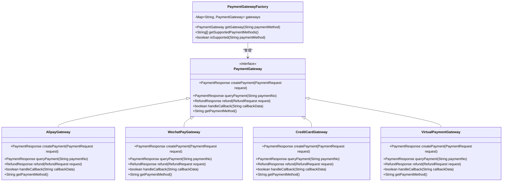
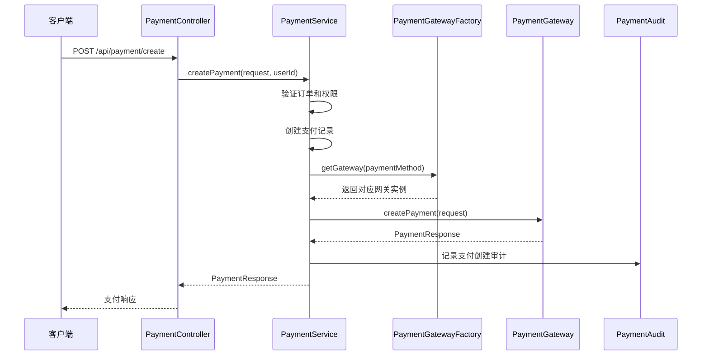
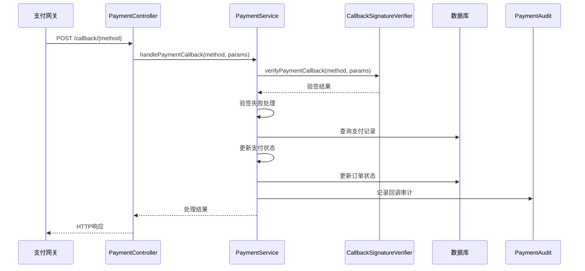
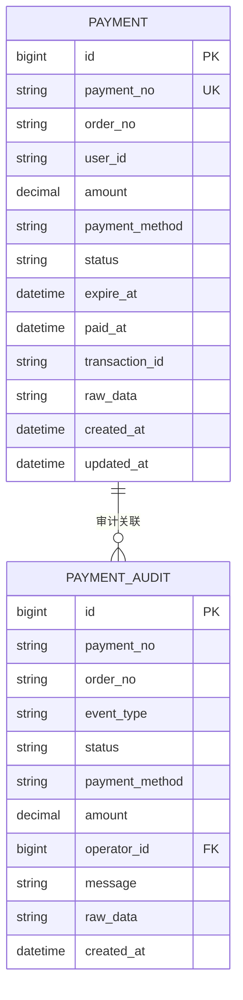
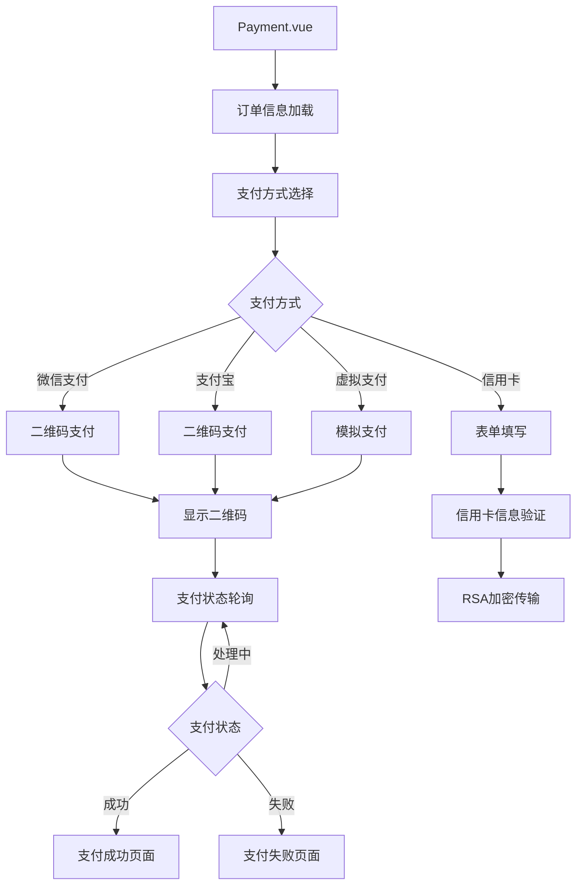
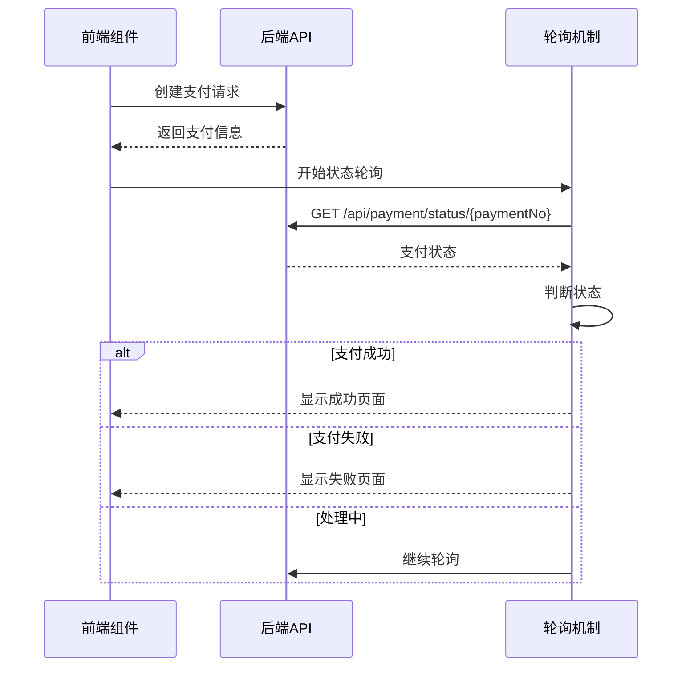
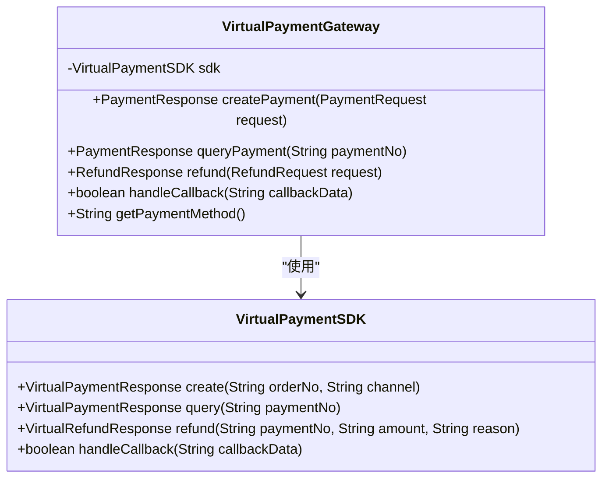
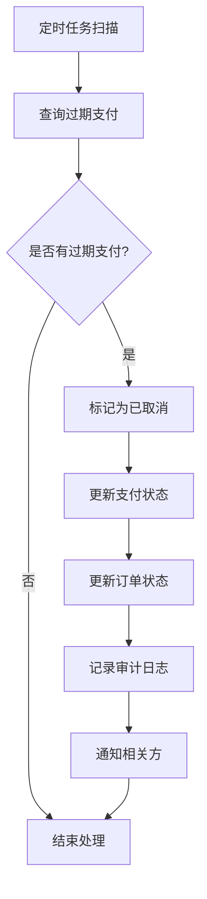
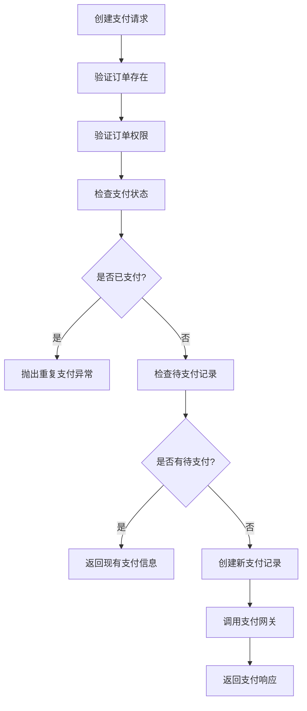

# 支付系统实现

<cite>
**本文档引用的文件**
- [PaymentServiceImpl.java](file://backend/src/main/java/com/carwash/service/impl/PaymentServiceImpl.java)
- [PaymentGatewayFactory.java](file://backend/src/main/java/com/carwash/service/payment/PaymentGatewayFactory.java)
- [AlipayGateway.java](file://backend/src/main/java/com/carwash/service/payment/AlipayGateway.java)
- [WechatPayGateway.java](file://backend/src/main/java/com/carwash/service/payment/WechatPayGateway.java)
- [CreditCardGateway.java](file://backend/src/main/java/com/carwash/service/payment/CreditCardGateway.java)
- [VirtualPaymentGateway.java](file://backend/src/main/java/com/carwash/service/payment/VirtualPaymentGateway.java)
- [CallbackSignatureVerifier.java](file://backend/src/main/java/com/carwash/service/payment/security/CallbackSignatureVerifier.java)
- [PaymentAudit.java](file://backend/src/main/java/com/carwash/entity/PaymentAudit.java)
- [PaymentRequest.java](file://backend/src/main/java/com/carwash/dto/PaymentRequest.java)
- [PaymentResponse.java](file://backend/src/main/java/com/carwash/dto/PaymentResponse.java)
- [PaymentController.java](file://backend/src/main/java/com/carwash/controller/PaymentController.java)
- [PaymentConfig.java](file://backend/src/main/java/com/carwash/config/PaymentConfig.java)
- [Payment.vue](file://frontend/src/views/Payment.vue)
- [payment-gateway.md](file://backend/docs/payment-gateway.md)
</cite>

## 目录
1. [系统概述](#系统概述)
2. [核心架构设计](#核心架构设计)
3. [支付网关工厂模式](#支付网关工厂模式)
4. [支付回调处理机制](#支付回调处理机制)
5. [支付审计系统](#支付审计系统)
6. [前端支付组件](#前端支付组件)
7. [虚拟支付网关](#虚拟支付网关)
8. [异常处理策略](#异常处理策略)
9. [系统监控与测试](#系统监控与测试)
10. [总结](#总结)

## 系统概述

汽车洗车服务预约系统采用模块化的支付架构，支持多种支付方式（微信支付、支付宝、信用卡）和虚拟支付测试环境。系统通过工厂模式动态选择支付网关，实现了高度可扩展的支付处理机制。

### 支付方式支持

系统支持三种主要支付方式：
- **微信支付（WeChat Pay）**：支持扫码支付、APP支付、H5支付
- **支付宝（Alipay）**：支持扫码支付、APP支付、H5支付  
- **信用卡支付（Credit Card）**：支持RSA-OAEP加密的安全支付
- **虚拟支付（Virtual）**：专为开发测试设计的模拟支付

## 核心架构设计

支付系统采用分层架构设计，包含以下核心组件：



**图表来源**
- [PaymentServiceImpl.java](file://backend/src/main/java/com/carwash/service/impl/PaymentServiceImpl.java#L47-L550)
- [PaymentGatewayFactory.java](file://backend/src/main/java/com/carwash/service/payment/PaymentGatewayFactory.java#L15-L55)
- [PaymentController.java](file://backend/src/main/java/com/carwash/controller/PaymentController.java#L35-L303)

**章节来源**
- [PaymentServiceImpl.java](file://backend/src/main/java/com/carwash/service/impl/PaymentServiceImpl.java#L47-L146)
- [PaymentGatewayFactory.java](file://backend/src/main/java/com/carwash/service/payment/PaymentGatewayFactory.java#L15-L55)

## 支付网关工厂模式

### 工厂模式实现

PaymentGatewayFactory采用Spring的依赖注入机制，自动注册所有实现PaymentGateway接口的支付网关：



**图表来源**
- [PaymentGatewayFactory.java](file://backend/src/main/java/com/carwash/service/payment/PaymentGatewayFactory.java#L15-L55)
- [AlipayGateway.java](file://backend/src/main/java/com/carwash/service/payment/AlipayGateway.java#L26-L317)
- [WechatPayGateway.java](file://backend/src/main/java/com/carwash/service/payment/WechatPayGateway.java#L25-L251)
- [CreditCardGateway.java](file://backend/src/main/java/com/carwash/service/payment/CreditCardGateway.java#L31-L200)
- [VirtualPaymentGateway.java](file://backend/src/main/java/com/carwash/service/payment/VirtualPaymentGateway.java#L20-L92)

### 动态网关选择机制

PaymentServiceImpl中的createPayment方法展示了工厂模式的实际应用：



**图表来源**
- [PaymentServiceImpl.java](file://backend/src/main/java/com/carwash/service/impl/PaymentServiceImpl.java#L72-L146)
- [PaymentGatewayFactory.java](file://backend/src/main/java/com/carwash/service/payment/PaymentGatewayFactory.java#L31-L37)

**章节来源**
- [PaymentServiceImpl.java](file://backend/src/main/java/com/carwash/service/impl/PaymentServiceImpl.java#L72-L146)
- [PaymentGatewayFactory.java](file://backend/src/main/java/com/carwash/service/payment/PaymentGatewayFactory.java#L15-L55)

## 支付回调处理机制

### 签名验证流程

系统采用统一的回调签名验证机制，确保支付回调的安全性：

```mermaid
flowchart TD
A[接收支付回调] --> B{验证回调签名}
B --> |微信支付| C[MD5签名验证]
B --> |支付宝| D[RSA签名验证]
B --> |虚拟支付| E[始终通过]
B --> |其他| F[验证失败]
C --> G[构建参数字典序]
G --> H[添加API_KEY]
H --> I[计算MD5(大写)]
I --> J{签名匹配?}
D --> K[提取签名类型]
K --> L[构建参数字典序]
L --> M[Base64解码签名]
M --> N[RSA验证]
N --> O{验证通过?}
J --> |是| P[验签成功]
J --> |否| Q[验签失败]
O --> |是| P
O --> |否| Q
E --> P
F --> Q
P --> R[处理回调业务]
Q --> S[拒绝回调]
```

**图表来源**
- [CallbackSignatureVerifier.java](file://backend/src/main/java/com/carwash/service/payment/security/CallbackSignatureVerifier.java#L35-L46)
- [PaymentServiceImpl.java](file://backend/src/main/java/com/carwash/service/impl/PaymentServiceImpl.java#L173-L229)

### 回调处理业务逻辑

PaymentServiceImpl.handlePaymentCallback方法实现了完整的回调处理流程：



**图表来源**
- [PaymentServiceImpl.java](file://backend/src/main/java/com/carwash/service/impl/PaymentServiceImpl.java#L173-L229)
- [CallbackSignatureVerifier.java](file://backend/src/main/java/com/carwash/service/payment/security/CallbackSignatureVerifier.java#L35-L46)

**章节来源**
- [PaymentServiceImpl.java](file://backend/src/main/java/com/carwash/service/impl/PaymentServiceImpl.java#L173-L229)
- [CallbackSignatureVerifier.java](file://backend/src/main/java/com/carwash/service/payment/security/CallbackSignatureVerifier.java#L35-L170)

## 支付审计系统

### 审计设计架构

PaymentAudit实体和相关的审计机制确保每笔交易都有完整的日志记录：



**图表来源**
- [PaymentAudit.java](file://backend/src/main/java/com/carwash/entity/PaymentAudit.java#L18-L84)

### 审计事件类型

系统定义了完整的审计事件类型，涵盖支付生命周期的各个阶段：

| 事件类型 | 描述 | 触发时机 |
|---------|------|----------|
| CREATE | 创建支付记录 | 支付订单创建时 |
| CALL_GATEWAY | 调用支付网关 | 调用第三方支付接口时 |
| QUERY_STATUS | 查询第三方状态 | 支付状态查询时 |
| STATUS_CHANGE | 状态变化 | 第三方查询导致状态变更时 |
| CALLBACK_VERIFIED | 回调验签通过 | 支付回调验签成功时 |
| CALLBACK_UPDATE | 回调更新成功 | 支付回调处理成功时 |
| REFUND_REQUEST | 发起退款请求 | 退款申请提交时 |
| REFUND_SUCCESS | 退款成功 | 退款处理成功时 |
| REFUND_FAILED | 退款失败 | 退款处理失败时 |
| CANCEL_EXPIRED | 取消过期支付 | 支付超时自动取消时 |

**章节来源**
- [PaymentAudit.java](file://backend/src/main/java/com/carwash/entity/PaymentAudit.java#L18-L84)
- [PaymentServiceImpl.java](file://backend/src/main/java/com/carwash/service/impl/PaymentServiceImpl.java#L122-L216)

## 前端支付组件

### 支付表单构建

Payment.vue组件提供了完整的支付界面，支持多种支付方式的选择和表单验证：



**图表来源**
- [Payment.vue](file://frontend/src/views/Payment.vue#L1-L800)

### 二维码展示机制

前端通过状态轮询机制实时获取支付状态：



**图表来源**
- [Payment.vue](file://frontend/src/views/Payment.vue#L721-L771)

**章节来源**
- [Payment.vue](file://frontend/src/views/Payment.vue#L1-L800)

## 虚拟支付网关

### 虚拟网关特性

VirtualPaymentGateway专为开发和测试环境设计，提供完整的支付流程模拟：



**图表来源**
- [VirtualPaymentGateway.java](file://backend/src/main/java/com/carwash/service/payment/VirtualPaymentGateway.java#L20-L92)

### 支付渠道支持

虚拟支付网关支持三种支付渠道：

| 渠道类型 | 返回内容 | 用途 |
|---------|----------|------|
| QR | 二维码链接 | 扫码支付场景 |
| APP | 支付链接 | 移动应用内支付 |
| H5 | H5支付链接 | 移动浏览器支付 |

**章节来源**
- [VirtualPaymentGateway.java](file://backend/src/main/java/com/carwash/service/payment/VirtualPaymentGateway.java#L20-L92)
- [payment-gateway.md](file://backend/docs/payment-gateway.md#L10-L16)

## 异常处理策略

### 支付超时处理

系统实现了完善的支付超时处理机制：



**图表来源**
- [PaymentServiceImpl.java](file://backend/src/main/java/com/carwash/service/impl/PaymentServiceImpl.java#L332-L355)

### 重复支付防护

系统通过支付状态检查防止重复支付：



**图表来源**
- [PaymentServiceImpl.java](file://backend/src/main/java/com/carwash/service/impl/PaymentServiceImpl.java#L74-L103)

### 回调失败处理

系统提供多层回调失败处理机制：

1. **签名验证失败**：记录失败日志，拒绝回调
2. **支付记录不存在**：记录异常，返回失败
3. **业务处理异常**：捕获异常，记录审计，返回失败

**章节来源**
- [PaymentServiceImpl.java](file://backend/src/main/java/com/carwash/service/impl/PaymentServiceImpl.java#L332-L355)
- [PaymentServiceImpl.java](file://backend/src/main/java/com/carwash/service/impl/PaymentServiceImpl.java#L94-L103)

## 系统监控与测试

### 监控指标

系统集成了PaymentMonitor组件，记录关键业务指标：

| 监控指标 | 描述 | 记录时机 |
|---------|------|----------|
| create | 支付创建次数 | createPayment调用时 |
| query | 支付查询次数 | queryPaymentStatus调用时 |
| refund | 退款处理次数 | processRefund调用时 |
| failure | 处理失败次数 | 异常路径触发时 |

### 测试策略

系统提供了完整的测试覆盖：

1. **单元测试**：各支付网关的独立功能测试
2. **集成测试**：PaymentService与支付网关的集成测试
3. **回调验证测试**：签名验证的专项测试
4. **虚拟支付测试**：开发测试环境的专用测试

**章节来源**
- [PaymentServiceImpl.java](file://backend/src/main/java/com/carwash/service/impl/PaymentServiceImpl.java#L63-L70)
- [payment-gateway.md](file://backend/docs/payment-gateway.md#L54-L59)

## 总结

汽车洗车服务预约系统的支付系统实现了以下核心特性：

### 技术优势

1. **模块化架构**：通过工厂模式实现支付网关的动态选择和扩展
2. **安全性保障**：统一的签名验证机制确保回调安全
3. **完整审计**：每笔交易都有详细的审计日志记录
4. **灵活测试**：虚拟支付网关支持开发和测试需求
5. **异常处理**：完善的超时、重复支付、回调失败处理机制

### 架构特点

- **可扩展性**：新增支付方式只需实现PaymentGateway接口
- **可维护性**：清晰的职责分离和模块化设计
- **可靠性**：多重验证和异常处理机制
- **可观测性**：完整的监控和审计体系

该支付系统为汽车洗车服务预约提供了稳定、安全、可扩展的支付解决方案，能够满足不同支付场景的需求，并具备良好的开发和运维体验。