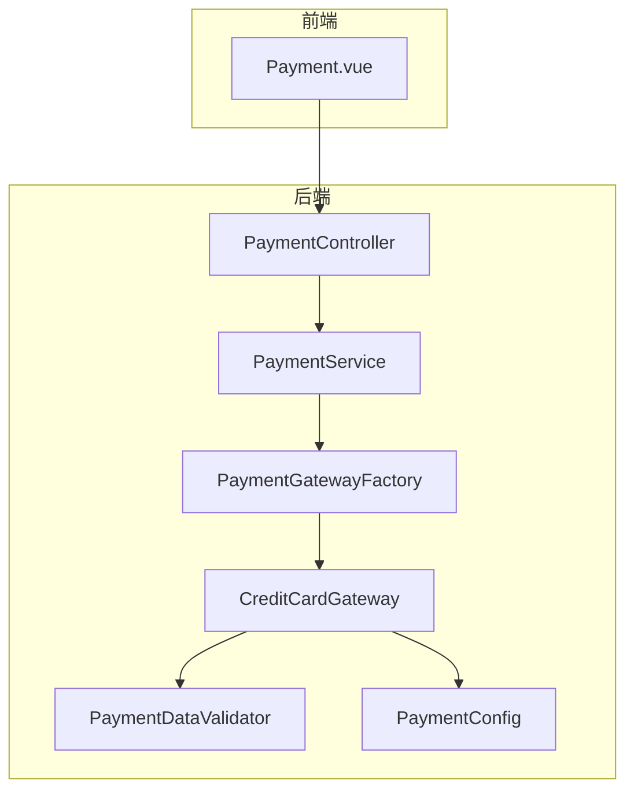
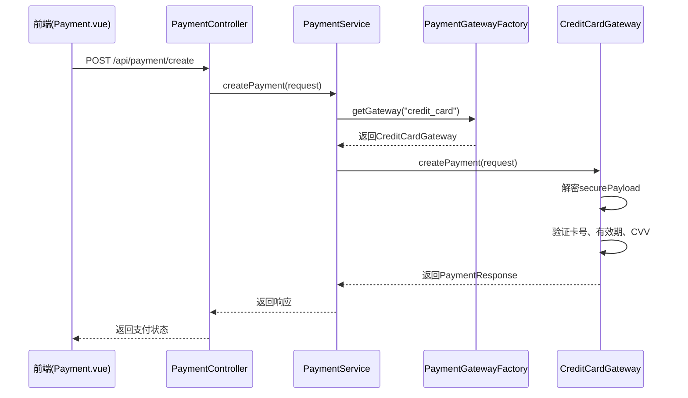
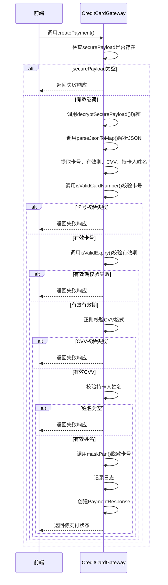

# 信用卡支付网关

<cite>
**本文档引用文件**   
- [CreditCardGateway.java](file://backend/src/main/java/com/carwash/service/payment/CreditCardGateway.java)
- [PaymentGateway.java](file://backend/src/main/java/com/carwash/service/payment/PaymentGateway.java)
- [PaymentDataValidator.java](file://backend/src/main/java/com/carwash/service/payment/validation/PaymentDataValidator.java)
- [PaymentRequest.java](file://backend/src/main/java/com/carwash/dto/PaymentRequest.java)
- [PaymentConfig.java](file://backend/src/main/java/com/carwash/config/PaymentConfig.java)
- [PaymentController.java](file://backend/src/main/java/com/carwash/controller/PaymentController.java)
- [payment-gateway.md](file://backend/docs/payment-gateway.md)
- [Payment.vue](file://frontend/src/views/Payment.vue)
</cite>

## 目录
1. [简介](#简介)
2. [项目结构](#项目结构)
3. [核心组件](#核心组件)
4. [架构概述](#架构概述)
5. [详细组件分析](#详细组件分析)
6. [依赖分析](#依赖分析)
7. [性能考虑](#性能考虑)
8. [故障排除指南](#故障排除指南)
9. [结论](#结论)

## 简介
本文档全面解析了汽车洗车服务预约系统中信用卡支付网关（CreditCardGateway）的设计与实现。该网关作为系统支付体系的重要组成部分，负责处理信用卡支付请求，确保敏感信息的安全传输与验证。文档详细阐述了信用卡支付流程，包括卡号、有效期、CVV等信息的安全处理机制，以及与第三方支付服务的集成方式。同时，结合支付网关文档中的请求校验规范，说明了支付数据验证流程、支付失败场景的错误分类及用户提示策略，并提供了PCI DSS合规性等安全最佳实践建议。

## 项目结构
系统后端采用典型的Spring Boot分层架构，信用卡支付相关功能主要集中在`backend/src/main/java/com/carwash/service/payment/`目录下。核心组件包括定义统一接口的`PaymentGateway`、具体的实现类`CreditCardGateway`、用于数据校验的`PaymentDataValidator`以及负责安全配置的`PaymentConfig`。前端支付页面`Payment.vue`负责收集用户输入并进行前端加密。



**Diagram sources**
- [Payment.vue](file://frontend/src/views/Payment.vue)
- [PaymentController.java](file://backend/src/main/java/com/carwash/controller/PaymentController.java)
- [CreditCardGateway.java](file://backend/src/main/java/com/carwash/service/payment/CreditCardGateway.java)
- [PaymentDataValidator.java](file://backend/src/main/java/com/carwash/service/payment/validation/PaymentDataValidator.java)
- [PaymentConfig.java](file://backend/src/main/java/com/carwash/config/PaymentConfig.java)

**Section sources**
- [CreditCardGateway.java](file://backend/src/main/java/com/carwash/service/payment/CreditCardGateway.java)
- [PaymentGateway.java](file://backend/src/main/java/com/carwash/service/payment/PaymentGateway.java)
- [PaymentDataValidator.java](file://backend/src/main/java/com/carwash/service/payment/validation/PaymentDataValidator.java)

## 核心组件

`CreditCardGateway`是信用卡支付的核心实现类，它实现了`PaymentGateway`接口，提供了创建支付、查询支付、退款等标准化方法。该网关通过RSA-OAEP加密算法确保前端传输的信用卡信息的安全性，并在后端进行解密和验证。`PaymentDataValidator`在支付流程的早期阶段对请求数据进行校验，确保数据的完整性和有效性。`PaymentConfig`类则集中管理了包括RSA密钥在内的所有支付相关配置。

**Section sources**
- [CreditCardGateway.java](file://backend/src/main/java/com/carwash/service/payment/CreditCardGateway.java)
- [PaymentDataValidator.java](file://backend/src/main/java/com/carwash/service/payment/validation/PaymentDataValidator.java)
- [PaymentConfig.java](file://backend/src/main/java/com/carwash/config/PaymentConfig.java)

## 架构概述
系统采用基于接口的支付网关设计模式，通过`PaymentGateway`接口定义了统一的支付操作契约。`PaymentGatewayFactory`作为工厂类，根据支付方式动态选择具体的网关实现。当用户选择信用卡支付时，前端`Payment.vue`页面会收集卡信息，使用从后端获取的RSA公钥进行加密，然后将加密后的载荷发送至`PaymentController`。控制器调用`PaymentService`，最终由`CreditCardGateway`处理解密、验证和支付创建逻辑。



**Diagram sources**
- [Payment.vue](file://frontend/src/views/Payment.vue)
- [PaymentController.java](file://backend/src/main/java/com/carwash/controller/PaymentController.java)
- [CreditCardGateway.java](file://backend/src/main/java/com/carwash/service/payment/CreditCardGateway.java)

## 详细组件分析

### CreditCardGateway分析
`CreditCardGateway`是信用卡支付功能的具体实现，它遵循了安全支付的最佳实践。

#### 对象导向组件
```mermaid
classDiagram
class PaymentGateway {
<<interface>>
+createPayment(PaymentRequest) PaymentResponse
+queryPayment(String) PaymentResponse
+refund(RefundRequest) RefundResponse
+queryRefund(String) RefundResponse
+handleCallback(String) boolean
+getPaymentMethod() String
}
class CreditCardGateway {
-paymentConfig PaymentConfig
+createPayment(PaymentRequest) PaymentResponse
+queryPayment(String) PaymentResponse
+refund(RefundRequest) RefundResponse
+queryRefund(String) RefundResponse
+handleCallback(String) boolean
+getPaymentMethod() String
-decryptSecurePayload(String, String) String
-isValidCardNumber(String) boolean
-isValidExpiry(String) boolean
-maskPan(String) String
}
class PaymentDataValidator {
+validate(PaymentRequest) void
}
class PaymentConfig {
+getSecurity() Security
class Security {
+getRsaPrivateKey() String
}
}
CreditCardGateway ..|> PaymentGateway : 实现
CreditCardGateway --> PaymentDataValidator : 使用
CreditCardGateway --> PaymentConfig : 依赖
```

**Diagram sources**
- [CreditCardGateway.java](file://backend/src/main/java/com/carwash/service/payment/CreditCardGateway.java)
- [PaymentGateway.java](file://backend/src/main/java/com/carwash/service/payment/PaymentGateway.java)
- [PaymentDataValidator.java](file://backend/src/main/java/com/carwash/service/payment/validation/PaymentDataValidator.java)
- [PaymentConfig.java](file://backend/src/main/java/com/carwash/config/PaymentConfig.java)

#### API服务组件


**Diagram sources**
- [CreditCardGateway.java](file://backend/src/main/java/com/carwash/service/payment/CreditCardGateway.java)

**Section sources**
- [CreditCardGateway.java](file://backend/src/main/java/com/carwash/service/payment/CreditCardGateway.java)
- [PaymentRequest.java](file://backend/src/main/java/com/carwash/dto/PaymentRequest.java)

### 支付数据验证流程
在`CreditCardGateway`处理支付请求之前，`PaymentDataValidator`会进行前置校验。该验证器确保支付请求中的订单号、金额、支付方式等基本字段不为空且有效。对于信用卡支付，它会特别检查`securePayload`字段是否存在，这是前端加密后的信用卡信息载荷。此验证层位于`PaymentServiceImpl`中，确保所有支付方式在进入具体网关前都经过统一的校验。

**Section sources**
- [PaymentDataValidator.java](file://backend/src/main/java/com/carwash/service/payment/validation/PaymentDataValidator.java)
- [payment-gateway.md](file://backend/docs/payment-gateway.md)

## 依赖分析
`CreditCardGateway`的实现依赖于多个核心组件。它通过`@Autowired`注解注入`PaymentConfig`以获取RSA私钥用于解密。其功能实现依赖于Java标准库中的`javax.crypto`包进行加密解密操作，以及`java.security`包处理密钥。该网关是`PaymentGateway`接口的具体实现，并通过`PaymentGatewayFactory`被系统发现和调用。此外，它还依赖于`PaymentDataValidator`进行数据校验，形成了一个清晰的依赖链。

```mermaid
graph TD
CreditCardGateway --> PaymentConfig : 依赖配置
CreditCardGateway --> PaymentDataValidator : 依赖验证器
CreditCardGateway --> PaymentGateway : 实现接口
PaymentGatewayFactory --> CreditCardGateway : 工厂创建
PaymentController --> PaymentGatewayFactory : 获取网关
```

**Diagram sources**
- [CreditCardGateway.java](file://backend/src/main/java/com/carwash/service/payment/CreditCardGateway.java)
- [PaymentConfig.java](file://backend/src/main/java/com/carwash/config/PaymentConfig.java)
- [PaymentGatewayFactory.java](file://backend/src/main/java/com/carwash/service/payment/PaymentGatewayFactory.java)

**Section sources**
- [CreditCardGateway.java](file://backend/src/main/java/com/carwash/service/payment/CreditCardGateway.java)
- [PaymentGatewayFactory.java](file://backend/src/main/java/com/carwash/service/payment/PaymentGatewayFactory.java)

## 性能考虑
由于`CreditCardGateway`的实现是模拟的，其性能开销主要集中在RSA-OAEP解密操作上，这是一个计算密集型任务。在生产环境中，如果集成真实的第三方支付API，网络延迟将成为主要性能瓶颈。为优化性能，可以考虑对RSA私钥进行缓存，避免每次解密都重新加载。此外，`PaymentDataValidator`的校验逻辑简单高效，不会对性能造成显著影响。系统通过`PaymentMonitor`组件对支付流程进行监控，有助于识别潜在的性能问题。

## 故障排除指南
当信用卡支付出现问题时，应首先检查前端是否成功获取了RSA公钥（通过`GET /api/payment/security/public-key`）。其次，确认前端是否正确地将信用卡信息加密并放入`securePayload`字段。在后端，检查`CreditCardGateway`的日志，查看是哪个校验环节失败（如卡号、有效期、CVV或持卡人姓名）。对于解密失败，应检查`PaymentConfig`中的`rsaPrivateKey`配置是否正确。支付失败的错误信息会通过`PaymentResponse`的`message`字段返回给前端，用于向用户展示具体的失败原因。

**Section sources**
- [CreditCardGateway.java](file://backend/src/main/java/com/carwash/service/payment/CreditCardGateway.java)
- [PaymentController.java](file://backend/src/main/java/com/carwash/controller/PaymentController.java)

## 结论
`CreditCardGateway`的设计体现了安全、解耦和可扩展的原则。通过使用RSA-OAEP加密，系统确保了信用卡敏感信息在传输过程中的安全性。遵循`PaymentGateway`接口的实现方式，使得系统可以轻松集成其他支付方式。`PaymentDataValidator`提供了统一的前置校验，增强了系统的健壮性。尽管当前实现为模拟，但其架构为未来接入Stripe、PayPal Braintree等真实支付服务奠定了坚实的基础。遵循PCI DSS合规性要求，不存储任何敏感信息，仅保留脱敏后的卡号，是该设计的一大亮点。