# 微信支付网关实现详解

<cite>
**本文档引用的文件**
- [WechatPayGateway.java](file://backend/src/main/java/com/carwash/service/payment/WechatPayGateway.java)
- [PaymentController.java](file://backend/src/main/java/com/carwash/controller/PaymentController.java)
- [PaymentRequest.java](file://backend/src/main/java/com/carwash/dto/PaymentRequest.java)
- [PaymentResponse.java](file://backend/src/main/java/com/carwash/dto/PaymentResponse.java)
- [PaymentGateway.java](file://backend/src/main/java/com/carwash/service/payment/PaymentGateway.java)
- [CallbackSignatureVerifier.java](file://backend/src/main/java/com/carwash/service/payment/security/CallbackSignatureVerifier.java)
- [PaymentDataValidator.java](file://backend/src/main/java/com/carwash/service/payment/validation/PaymentDataValidator.java)
- [PaymentConfig.java](file://backend/src/main/java/com/carwash/config/PaymentConfig.java)
- [PaymentServiceImpl.java](file://backend/src/main/java/com/carwash/service/impl/PaymentServiceImpl.java)
- [application-payment.yml](file://backend/src/main/resources/application-payment.yml)
- [payment-gateway.md](file://backend/docs/payment-gateway.md)
</cite>

## 目录
1. [概述](#概述)
2. [系统架构](#系统架构)
3. [核心组件分析](#核心组件分析)
4. [支付场景适配](#支付场景适配)
5. [签名验证机制](#签名验证机制)
6. [回调处理流程](#回调处理流程)
7. [预支付交易会话标识](#预支付交易会话标识)
8. [完整支付链路](#完整支付链路)
9. [配置管理](#配置管理)
10. [安全特性](#安全特性)
11. [故障排除指南](#故障排除指南)

## 概述

WechatPayGateway是汽车洗车服务平台中的微信支付网关实现，负责与微信支付API进行交互，提供统一的支付接口。该网关支持多种支付场景，包括扫码支付(NATIVE)、APP支付(APP)和H5支付(H5)，并通过严格的签名验证机制确保通信安全性。

### 主要功能特性

- **多场景支付支持**：支持扫码支付、APP支付、H5支付三种主流支付方式
- **统一接口设计**：遵循PaymentGateway接口规范，提供标准化的支付操作
- **严格的安全验证**：采用MD5签名验证机制，确保回调数据的真实性
- **完整的生命周期管理**：从订单创建到支付完成的全流程支持
- **灵活的配置管理**：支持动态配置微信支付的各项参数

## 系统架构

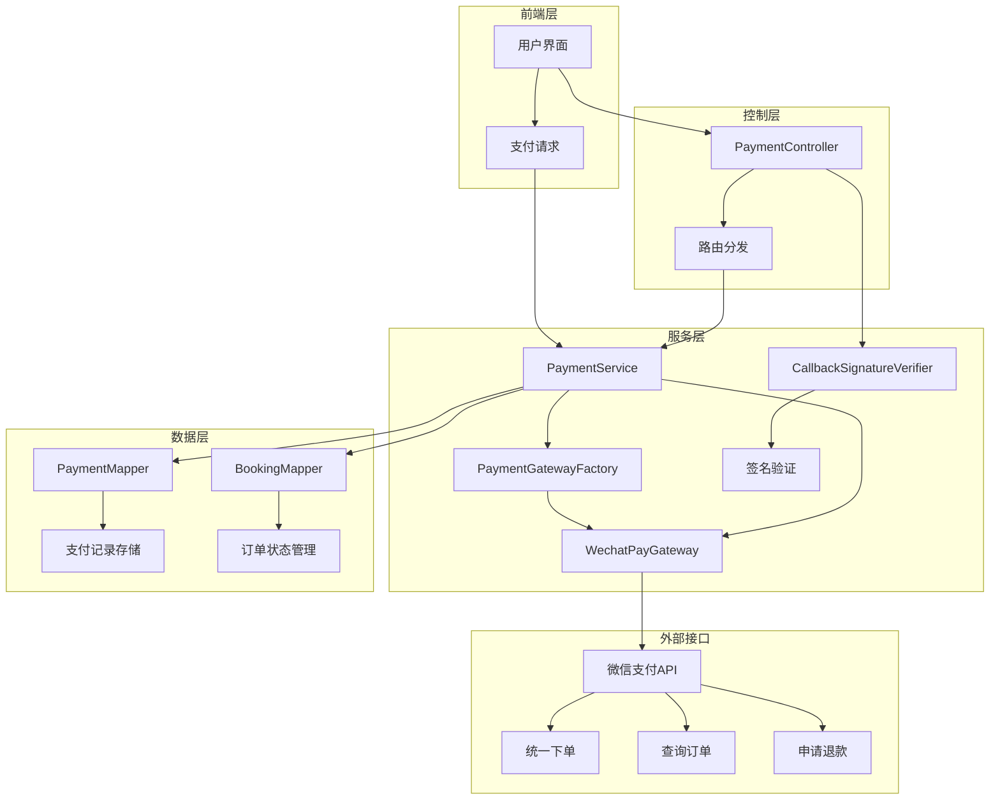

**架构图来源**
- [PaymentController.java](file://backend/src/main/java/com/carwash/controller/PaymentController.java#L1-L303)
- [PaymentServiceImpl.java](file://backend/src/main/java/com/carwash/service/impl/PaymentServiceImpl.java#L1-L550)
- [WechatPayGateway.java](file://backend/src/main/java/com/carwash/service/payment/WechatPayGateway.java#L1-L251)

## 核心组件分析

### WechatPayGateway类结构

WechatPayGateway实现了PaymentGateway接口，提供了微信支付的核心功能：

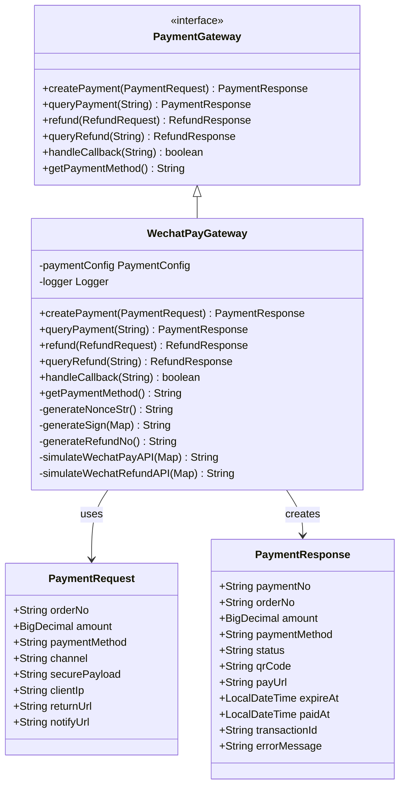

**类图来源**
- [PaymentGateway.java](file://backend/src/main/java/com/carwash/service/payment/PaymentGateway.java#L1-L54)
- [WechatPayGateway.java](file://backend/src/main/java/com/carwash/service/payment/WechatPayGateway.java#L25-L251)
- [PaymentRequest.java](file://backend/src/main/java/com/carwash/dto/PaymentRequest.java#L1-L141)
- [PaymentResponse.java](file://backend/src/main/java/com/carwash/dto/PaymentResponse.java#L1-L196)

### 关键方法实现

#### 支付订单创建

支付订单创建过程包含以下关键步骤：

1. **参数构建**：构建微信支付所需的参数列表
2. **签名生成**：使用MD5算法生成请求签名
3. **API调用**：模拟调用微信支付统一下单接口
4. **响应处理**：封装支付响应数据

#### 签名生成机制

签名生成采用微信支付的标准MD5签名算法：

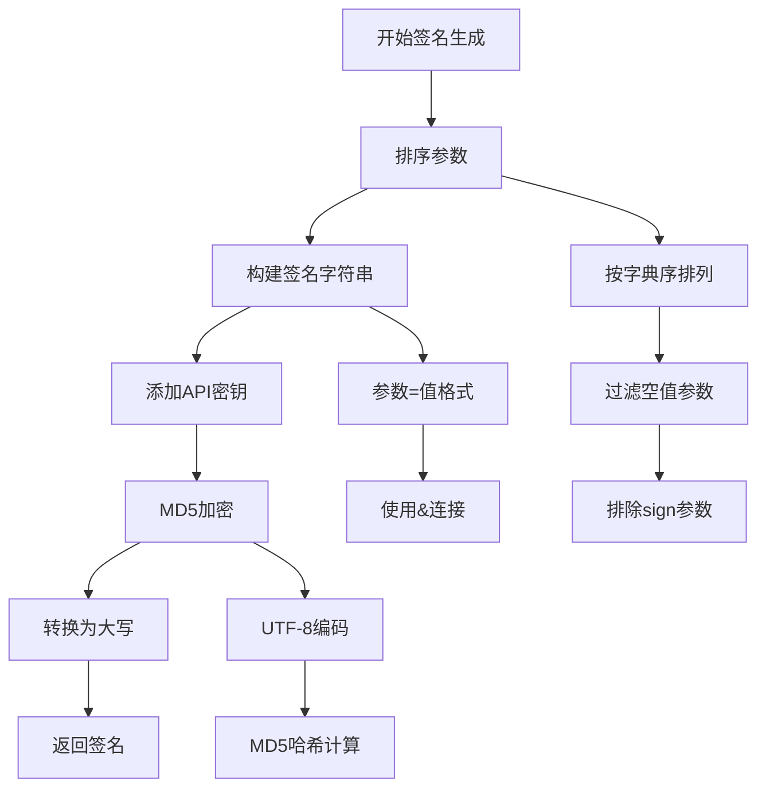

**流程图来源**
- [WechatPayGateway.java](file://backend/src/main/java/com/carwash/service/payment/WechatPayGateway.java#L193-L225)

**节来源**
- [WechatPayGateway.java](file://backend/src/main/java/com/carwash/service/payment/WechatPayGateway.java#L32-L72)
- [WechatPayGateway.java](file://backend/src/main/java/com/carwash/service/payment/WechatPayGateway.java#L193-L225)

## 支付场景适配

### 支付渠道配置

系统支持三种主要的支付渠道，每种渠道对应不同的支付方式：

| 支付渠道 | 支付方式 | 适用场景 | 返回数据类型 |
|---------|---------|---------|-------------|
| qr | NATIVE | 扫码支付 | 二维码URL |
| app | APP | 移动应用内支付 | 支付链接 |
| h5 | H5 | 网页支付 | 支付链接 |

### 场景适配逻辑

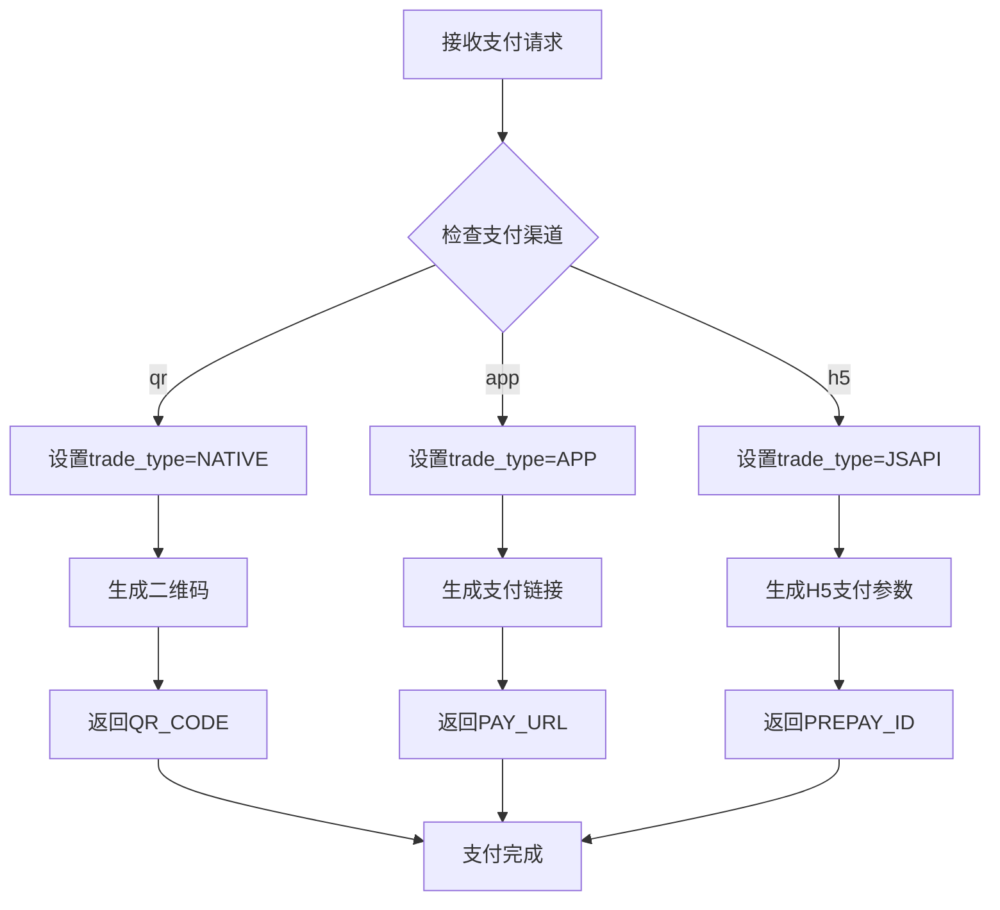

**流程图来源**
- [WechatPayGateway.java](file://backend/src/main/java/com/carwash/service/payment/WechatPayGateway.java#L38-L47)
- [PaymentRequest.java](file://backend/src/main/java/com/carwash/dto/PaymentRequest.java#L36-L41)

**节来源**
- [PaymentRequest.java](file://backend/src/main/java/com/carwash/dto/PaymentRequest.java#L36-L41)
- [WechatPayGateway.java](file://backend/src/main/java/com/carwash/service/payment/WechatPayGateway.java#L38-L47)

## 签名验证机制

### MD5签名验证

微信支付采用MD5签名验证机制，确保回调数据的真实性和完整性：

#### 签名生成算法

1. **参数排序**：对所有非空参数按字典序排序
2. **字符串构建**：参数名=参数值格式，使用&连接
3. **密钥添加**：在字符串末尾添加`&key=API_KEY`
4. **MD5计算**：对最终字符串进行MD5哈希计算
5. **结果转换**：将哈希值转换为大写十六进制字符串

#### 验签流程

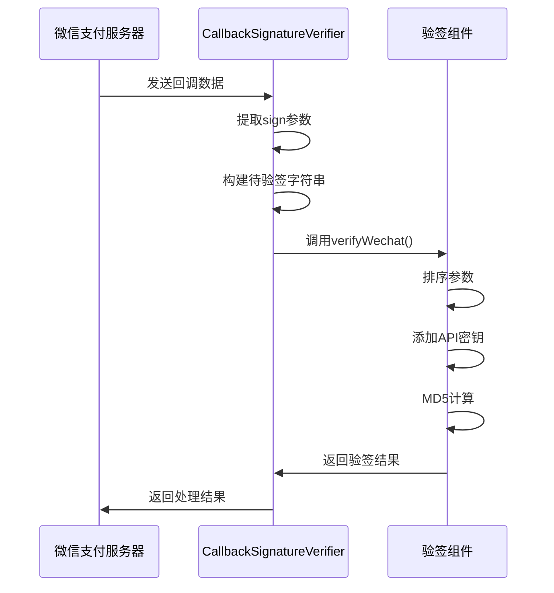

**序列图来源**
- [CallbackSignatureVerifier.java](file://backend/src/main/java/com/carwash/service/payment/security/CallbackSignatureVerifier.java#L50-L62)
- [PaymentServiceImpl.java](file://backend/src/main/java/com/carwash/service/impl/PaymentServiceImpl.java#L176-L178)

### HMAC-SHA256支持

虽然当前实现主要使用MD5签名，但系统架构支持扩展HMAC-SHA256签名验证：

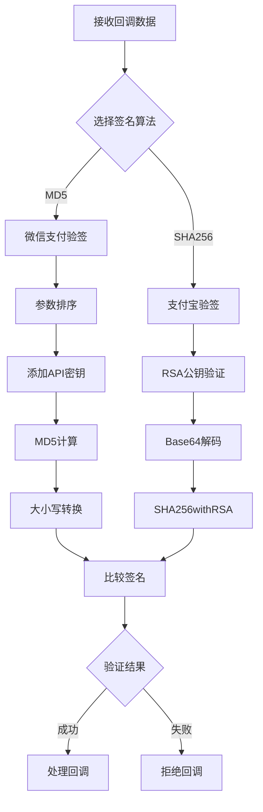

**流程图来源**
- [CallbackSignatureVerifier.java](file://backend/src/main/java/com/carwash/service/payment/security/CallbackSignatureVerifier.java#L35-L47)
- [payment-gateway.md](file://backend/docs/payment-gateway.md#L24-L28)

**节来源**
- [CallbackSignatureVerifier.java](file://backend/src/main/java/com/carwash/service/payment/security/CallbackSignatureVerifier.java#L50-L62)
- [WechatPayGateway.java](file://backend/src/main/java/com/carwash/service/payment/WechatPayGateway.java#L193-L225)

## 回调处理流程

### 回调接收与处理

微信支付回调处理包含严格的验证和处理流程：

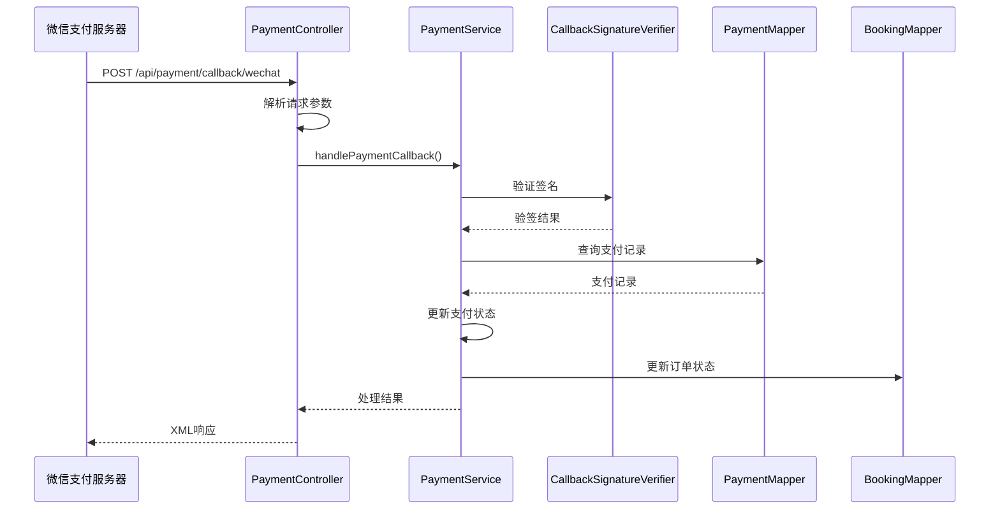

**序列图来源**
- [PaymentController.java](file://backend/src/main/java/com/carwash/controller/PaymentController.java#L132-L147)
- [PaymentServiceImpl.java](file://backend/src/main/java/com/carwash/service/impl/PaymentServiceImpl.java#L173-L228)

### 回调数据处理

回调处理的核心逻辑包括：

1. **签名验证**：使用CallbackSignatureVerifier验证回调数据
2. **数据解析**：提取支付流水号和交易号等关键信息
3. **状态更新**：更新支付记录和订单状态
4. **业务处理**：触发相关的业务逻辑

### XML响应格式

微信支付回调要求特定的XML响应格式：

```xml
<xml>
    <return_code><![CDATA[SUCCESS]]></return_code>
    <return_msg><![CDATA[OK]]></return_msg>
</xml>
```

**节来源**
- [PaymentController.java](file://backend/src/main/java/com/carwash/controller/PaymentController.java#L132-L147)
- [PaymentServiceImpl.java](file://backend/src/main/java/com/carwash/service/impl/PaymentServiceImpl.java#L173-L228)

## 预支付交易会话标识

### prepay_id概念

prepay_id是微信支付中的重要概念，表示预支付交易的会话标识：

- **生成时机**：在统一下单成功后由微信支付服务器生成
- **有效期**：通常为2小时
- **用途**：用于后续的支付操作，如APP支付和H5支付

### prepay_id处理流程

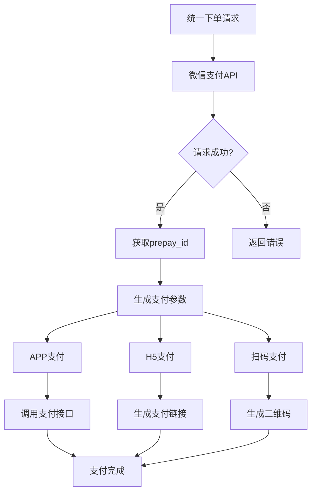

**流程图来源**
- [WechatPayGateway.java](file://backend/src/main/java/com/carwash/service/payment/WechatPayGateway.java#L53-L55)

**节来源**
- [WechatPayGateway.java](file://backend/src/main/java/com/carwash/service/payment/WechatPayGateway.java#L53-L55)

## 完整支付链路

### 从下单到回调的完整流程

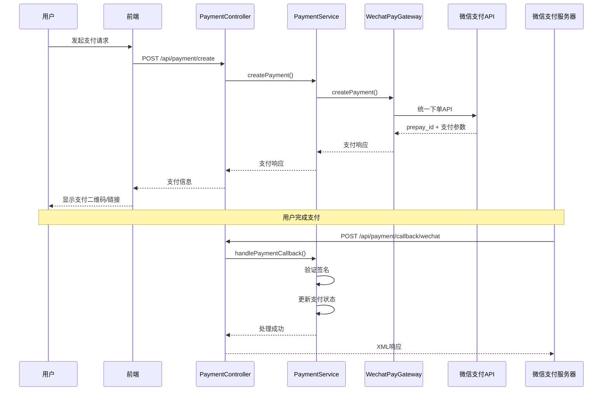

**序列图来源**
- [PaymentController.java](file://backend/src/main/java/com/carwash/controller/PaymentController.java#L47-L58)
- [PaymentServiceImpl.java](file://backend/src/main/java/com/carwash/service/impl/PaymentServiceImpl.java#L73-L145)
- [WechatPayGateway.java](file://backend/src/main/java/com/carwash/service/payment/WechatPayGateway.java#L32-L72)

### 支付状态流转

支付过程中的状态变化遵循严格的业务规则：

| 初始状态 | 目标状态 | 触发条件 | 审计记录 |
|---------|---------|---------|---------|
| pending | paid | 成功回调 | CALLBACK_UPDATE |
| unpaid | cancelled | 超时取消 | CANCEL_EXPIRED |
| paid | refunded | 退款成功 | REFUND_SUCCESS |

**节来源**
- [PaymentServiceImpl.java](file://backend/src/main/java/com/carwash/service/impl/PaymentServiceImpl.java#L173-L228)
- [PaymentServiceImpl.java](file://backend/src/main/java/com/carwash/service/impl/PaymentServiceImpl.java#L333-L355)

## 配置管理

### 微信支付配置结构

系统通过PaymentConfig类管理微信支付的各项配置：

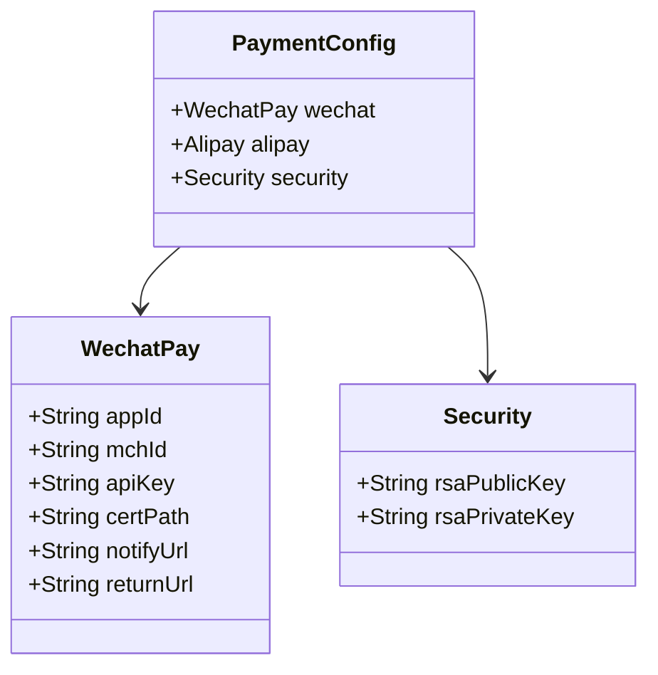

**类图来源**
- [PaymentConfig.java](file://backend/src/main/java/com/carwash/config/PaymentConfig.java#L14-L225)

### 配置文件示例

application-payment.yml中的配置示例：

```yaml
payment:
  wechat:
    app-id: wx1234567890abcdef
    mch-id: 1234567890
    api-key: your-wechat-api-key-here
    cert-path: /path/to/wechat/cert.p12
    notify-url: http://localhost:8080/api/payment/callback/wechat
    return-url: http://localhost:3000/payment/result
```

**节来源**
- [PaymentConfig.java](file://backend/src/main/java/com/carwash/config/PaymentConfig.java#L47-L101)
- [application-payment.yml](file://backend/src/main/resources/application-payment.yml#L1-L34)

## 安全特性

### 多层次安全防护

系统实现了多层次的安全防护机制：

1. **传输安全**：HTTPS加密传输
2. **签名验证**：MD5签名验证
3. **参数校验**：严格的输入参数校验
4. **访问控制**：基于角色的访问控制

### 安全审计机制

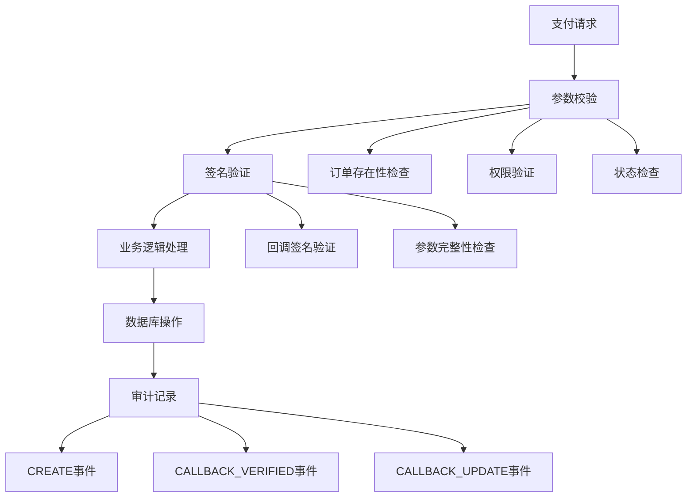

**流程图来源**
- [PaymentDataValidator.java](file://backend/src/main/java/com/carwash/service/payment/validation/PaymentDataValidator.java#L12-L40)
- [PaymentServiceImpl.java](file://backend/src/main/java/com/carwash/service/impl/PaymentServiceImpl.java#L176-L180)

**节来源**
- [PaymentDataValidator.java](file://backend/src/main/java/com/carwash/service/payment/validation/PaymentDataValidator.java#L12-L40)
- [PaymentServiceImpl.java](file://backend/src/main/java/com/carwash/service/impl/PaymentServiceImpl.java#L176-L180)

## 故障排除指南

### 常见问题及解决方案

#### 签名验证失败

**问题现象**：回调处理返回失败，日志显示签名验证失败

**可能原因**：
1. API密钥配置错误
2. 参数排序不正确
3. 字符编码问题

**解决方案**：
1. 检查application-payment.yml中的api-key配置
2. 确认参数排序逻辑符合微信支付规范
3. 验证字符编码为UTF-8

#### 支付超时

**问题现象**：支付订单长时间处于pending状态

**可能原因**：
1. 微信支付服务器响应慢
2. 网络连接问题
3. 订单状态查询失败

**解决方案**：
1. 检查网络连接和防火墙设置
2. 实现重试机制
3. 监控支付超时自动取消逻辑

#### 回调处理异常

**问题现象**：支付完成后未正确更新订单状态

**可能原因**：
1. 回调URL配置错误
2. 签名验证逻辑异常
3. 数据库连接问题

**解决方案**：
1. 验证回调URL的正确性和可达性
2. 检查签名验证逻辑
3. 确认数据库连接正常

### 调试技巧

1. **启用详细日志**：在application.yml中设置日志级别为DEBUG
2. **使用测试环境**：在沙箱环境中进行调试
3. **监控审计记录**：查看PaymentAudit表中的审计记录
4. **参数跟踪**：记录关键参数的传递过程

**节来源**
- [PaymentServiceImpl.java](file://backend/src/main/java/com/carwash/service/impl/PaymentServiceImpl.java#L176-L178)
- [WechatPayGateway.java](file://backend/src/main/java/com/carwash/service/payment/WechatPayGateway.java#L163-L175)

## 总结

WechatPayGateway作为汽车洗车服务平台的核心支付组件，实现了完整的微信支付功能。通过统一的接口设计、严格的安全验证机制和完善的错误处理流程，为系统提供了稳定可靠的支付服务能力。

### 关键优势

1. **标准化接口**：遵循PaymentGateway接口规范，易于扩展和维护
2. **安全可靠**：采用MD5签名验证，确保数据传输安全
3. **灵活配置**：支持动态配置，适应不同环境需求
4. **完整监控**：提供全面的审计和监控功能

### 最佳实践建议

1. **定期更新密钥**：定期更换API密钥，提高安全性
2. **完善监控告警**：建立完善的监控和告警机制
3. **优化性能**：对高频操作进行缓存和优化
4. **加强测试**：建立完善的测试体系，确保功能稳定性

通过持续的优化和完善，WechatPayGateway将继续为汽车洗车服务平台提供高质量的支付服务支持。