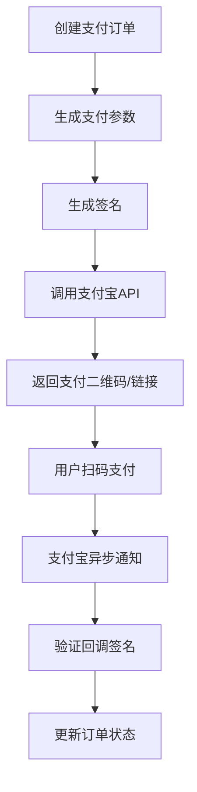
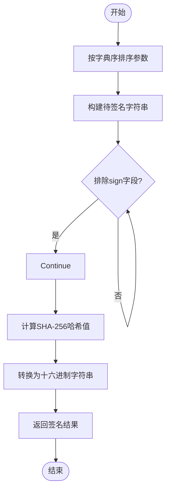
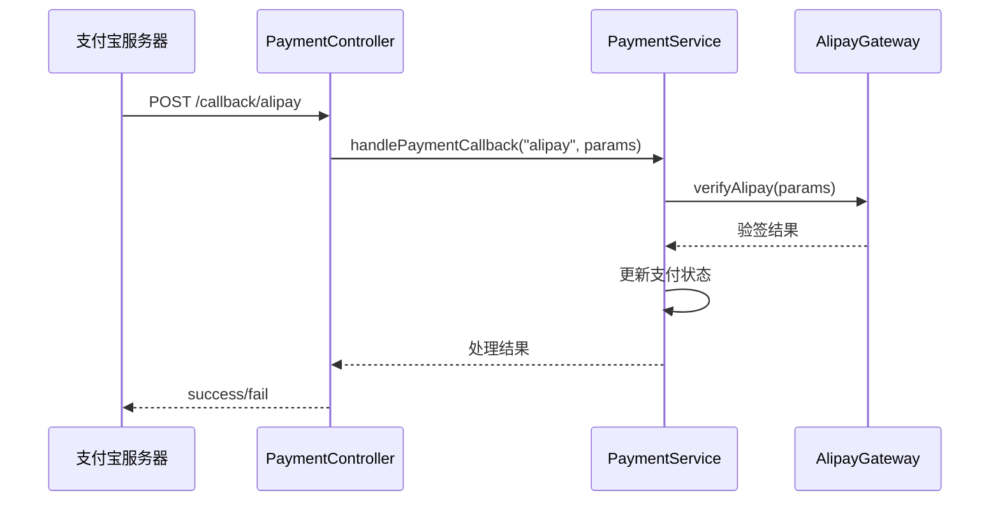
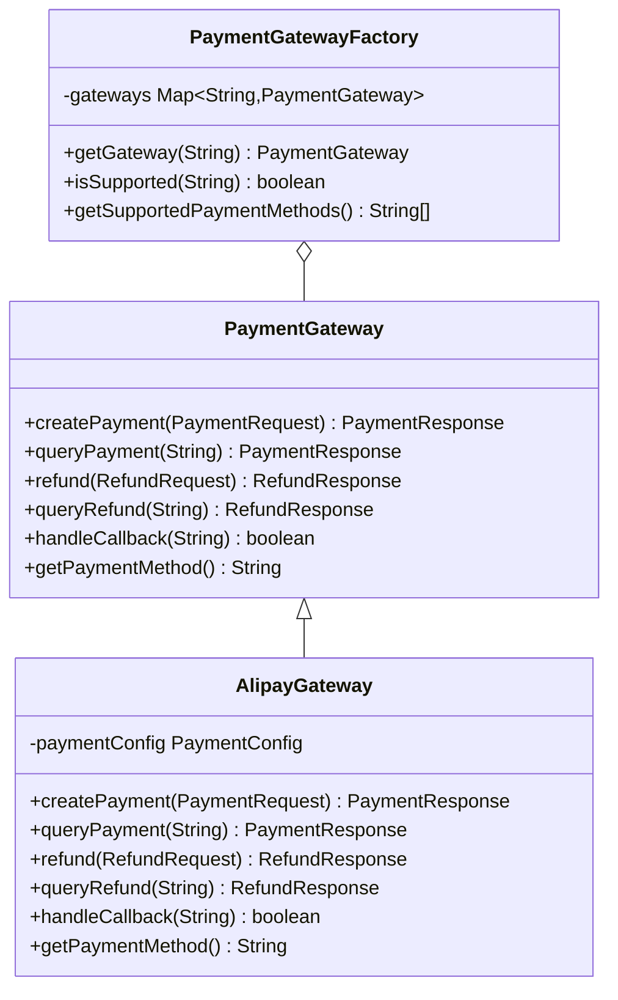

# 支付宝支付网关

<cite>
**本文档引用文件**  
- [AlipayGateway.java](file://backend/src/main/java/com/carwash/service/payment/AlipayGateway.java)
- [PaymentGateway.java](file://backend/src/main/java/com/carwash/service/payment/PaymentGateway.java)
- [PaymentGatewayFactory.java](file://backend/src/main/java/com/carwash/service/payment/PaymentGatewayFactory.java)
- [CallbackSignatureVerifier.java](file://backend/src/main/java/com/carwash/service/payment/security/CallbackSignatureVerifier.java)
- [PaymentConfig.java](file://backend/src/main/java/com/carwash/config/PaymentConfig.java)
- [payment-gateway.md](file://backend/docs/payment-gateway.md)
- [PaymentController.java](file://backend/src/main/java/com/carwash/controller/PaymentController.java)
- [PaymentServiceImpl.java](file://backend/src/main/java/com/carwash/service/impl/PaymentServiceImpl.java)
- [application-payment.yml](file://backend/src/main/resources/application-payment.yml)
</cite>

## 目录
1. [简介](#简介)
2. [核心实现机制](#核心实现机制)
3. [接口方法详解](#接口方法详解)
4. [签名生成与验证逻辑](#签名生成与验证逻辑)
5. [支付请求参数构建](#支付请求参数构建)
6. [异步通知回调处理](#异步通知回调处理)
7. [API兼容性与注册流程](#api兼容性与注册流程)
8. [完整流程示例](#完整流程示例)
9. [错误码处理策略](#错误码处理策略)

## 简介
支付宝支付网关是汽车洗车服务系统中集成的第三方支付解决方案，实现了与支付宝开放平台的对接。该网关遵循统一的支付接口规范，支持创建支付订单、查询支付状态、处理退款以及接收异步回调等功能。通过标准化的接口设计和安全机制，确保了支付过程的安全性和可靠性。

**Section sources**
- [AlipayGateway.java](file://backend/src/main/java/com/carwash/service/payment/AlipayGateway.java#L25-L317)
- [payment-gateway.md](file://backend/docs/payment-gateway.md#L1-L63)

## 核心实现机制
支付宝支付网关基于`PaymentGateway`接口实现，采用Spring框架的依赖注入机制获取支付配置信息。网关通过调用支付宝开放平台的API完成支付相关操作，包括预创建交易、查询支付状态和发起退款等。整个流程围绕订单生命周期管理，从创建到支付完成再到可能的退款，形成闭环。

**Diagram sources**
- [AlipayGateway.java](file://backend/src/main/java/com/carwash/service/payment/AlipayGateway.java#L25-L317)
- [PaymentController.java](file://backend/src/main/java/com/carwash/controller/PaymentController.java#L150-L164)

**Section sources**
- [AlipayGateway.java](file://backend/src/main/java/com/carwash/service/payment/AlipayGateway.java#L25-L317)
- [PaymentGateway.java](file://backend/src/main/java/com/carwash/service/payment/PaymentGateway.java#L12-L54)

## 接口方法详解
### createPayment方法
`createPayment`方法负责创建支付宝支付订单。它接收`PaymentRequest`对象作为输入，构建符合支付宝API要求的请求参数，包括应用ID、方法名、字符集、签名类型、时间戳等基础参数，以及订单号、金额、商品描述等业务参数。随后生成签名并构造支付URL，最终返回包含二维码信息的响应。

**Section sources**
- [AlipayGateway.java](file://backend/src/main/java/com/carwash/service/payment/AlipayGateway.java#L34-L73)

### queryPayment方法
`queryPayment`方法用于查询指定支付单号的支付状态。通过调用支付宝的交易查询接口，传入订单号进行状态核查。该方法能够确认订单是否已成功支付，并将结果同步回本地系统。

**Section sources**
- [AlipayGateway.java](file://backend/src/main/java/com/carwash/service/payment/AlipayGateway.java#L85-L113)

### refund方法
`refund`方法处理退款请求。根据`RefundRequest`中的支付单号、退款金额和原因，调用支付宝的退款接口执行退款操作。系统会生成唯一的退款单号用于跟踪退款进度。

**Section sources**
- [AlipayGateway.java](file://backend/src/main/java/com/carwash/service/payment/AlipayGateway.java#L125-L158)

### handleCallback方法
`handleCallback`方法处理来自支付宝的异步通知。在实际生产环境中，需要解析回调数据、验证签名有效性，并根据支付结果更新本地订单状态。当前实现为简化版本，仅记录日志并返回成功状态。

**Section sources**
- [AlipayGateway.java](file://backend/src/main/java/com/carwash/service/payment/AlipayGateway.java#L193-L205)

## 签名生成与验证逻辑
### 签名生成
支付宝支付网关的签名生成遵循特定规则：首先对所有请求参数按字典序排序，然后拼接成字符串（排除sign字段），最后使用SHA-256算法计算摘要。在真实场景中，应使用RSA私钥进行签名，而非简单的哈希运算。

**Diagram sources**
- [AlipayGateway.java](file://backend/src/main/java/com/carwash/service/payment/AlipayGateway.java#L216-L246)
- [CallbackSignatureVerifier.java](file://backend/src/main/java/com/carwash/service/payment/security/CallbackSignatureVerifier.java#L67-L93)

### 签名验证
签名验证由`CallbackSignatureVerifier`组件完成。对于支付宝回调，系统提取签名参数，使用支付宝公钥对拼接后的参数字符串进行RSA2验签。验证过程包括参数规范化、Base64解码和公钥加载等步骤，确保回调数据的完整性和真实性。

**Section sources**
- [CallbackSignatureVerifier.java](file://backend/src/main/java/com/carwash/service/payment/security/CallbackSignatureVerifier.java#L67-L93)

## 支付请求参数构建
支付请求参数的构建严格遵循支付宝开放平台的规范。基础参数包括：
- app_id: 支付宝应用ID
- method: API方法名
- charset: 字符编码
- sign_type: 签名算法
- timestamp: 时间戳
- version: API版本
- notify_url: 异步通知地址

业务参数封装在biz_content字段中，包含out_trade_no（商户订单号）、total_amount（订单金额）、subject（商品描述）等关键信息。所有参数值均需进行URL编码以确保传输安全。

**Section sources**
- [AlipayGateway.java](file://backend/src/main/java/com/carwash/service/payment/AlipayGateway.java#L39-L56)
- [application-payment.yml](file://backend/src/main/resources/application-payment.yml#L24-L34)

## 异步通知回调处理
异步通知回调通过`/api/payment/callback/alipay`端点接收。`PaymentController`收集HTTP请求参数并调用`PaymentService`的`handlePaymentCallback`方法。该方法首先验证签名，然后更新支付记录状态，并触发后续业务逻辑如订单状态变更等。成功的回调处理需返回"success"字符串，否则支付宝将重复发送通知。

**Diagram sources**
- [PaymentController.java](file://backend/src/main/java/com/carwash/controller/PaymentController.java#L153-L164)
- [PaymentServiceImpl.java](file://backend/src/main/java/com/carwash/service/impl/PaymentServiceImpl.java#L173-L200)

**Section sources**
- [PaymentController.java](file://backend/src/main/java/com/carwash/controller/PaymentController.java#L153-L164)
- [PaymentServiceImpl.java](file://backend/src/main/java/com/carwash/service/impl/PaymentServiceImpl.java#L173-L200)

## API兼容性与注册流程
### API兼容性
支付宝支付网关完全兼容支付宝开放平台v3 API规范。通过配置文件中的gateway-url指向正式环境或沙箱环境，可轻松切换部署模式。所有API调用均遵循RESTful设计原则，使用标准HTTP方法和状态码。

### 注册流程
支付网关通过工厂模式实现动态注册。`PaymentGatewayFactory`在Spring容器初始化时自动扫描所有实现`PaymentGateway`接口的Bean，并根据`getPaymentMethod()`返回的标识符（此处为'alipay'）建立映射关系。当需要特定支付方式时，可通过工厂方法`getGateway("alipay")`获取对应实例。

**Diagram sources**
- [PaymentGateway.java](file://backend/src/main/java/com/carwash/service/payment/PaymentGateway.java#L12-L54)
- [AlipayGateway.java](file://backend/src/main/java/com/carwash/service/payment/AlipayGateway.java#L25-L317)
- [PaymentGatewayFactory.java](file://backend/src/main/java/com/carwash/service/payment/PaymentGatewayFactory.java#L15-L55)

**Section sources**
- [PaymentGatewayFactory.java](file://backend/src/main/java/com/carwash/service/payment/PaymentGatewayFactory.java#L15-L55)
- [payment-gateway.md](file://backend/docs/payment-gateway.md#L8-L9)

## 完整流程示例
### 订单创建流程
1. 前端调用`/api/payment/create`接口
2. 后端验证订单信息并创建支付记录
3. 调用`AlipayGateway.createPayment()`生成支付参数
4. 返回二维码供用户扫描支付

### 状态查询流程
1. 用户或系统调用`/api/payment/status/{paymentNo}`
2. 检查本地支付状态
3. 若为待支付状态，则调用`AlipayGateway.queryPayment()`向支付宝查询
4. 返回最新支付状态

### 退款处理流程
1. 管理员或用户发起退款请求
2. 调用`/api/payment/refund`接口
3. 验证退款条件后调用`AlipayGateway.refund()`
4. 记录退款结果并更新订单状态

**Section sources**
- [PaymentController.java](file://backend/src/main/java/com/carwash/controller/PaymentController.java#L47-L127)
- [PaymentServiceImpl.java](file://backend/src/main/java/com/carwash/service/impl/PaymentServiceImpl.java#L74-L145)

## 错误码处理策略
系统采用分层错误处理机制：
- **客户端错误**：400系列状态码，如参数缺失或格式错误
- **服务端错误**：500系列状态码，表示内部处理异常
- **业务错误**：通过Result包装器返回特定错误码，如ORDER_NOT_FOUND(1001)、PAYMENT_NOT_FOUND(1002)等

对于支付宝API调用失败，捕获异常后记录详细日志，并向调用方返回友好提示信息。同时通过`PaymentMonitor`组件统计各类错误发生频率，便于后续分析优化。

**Section sources**
- [PaymentServiceImpl.java](file://backend/src/main/java/com/carwash/service/impl/PaymentServiceImpl.java#L74-L200)
- [GlobalExceptionHandler.java](file://backend/src/main/java/com/carwash/common/GlobalExceptionHandler.java)