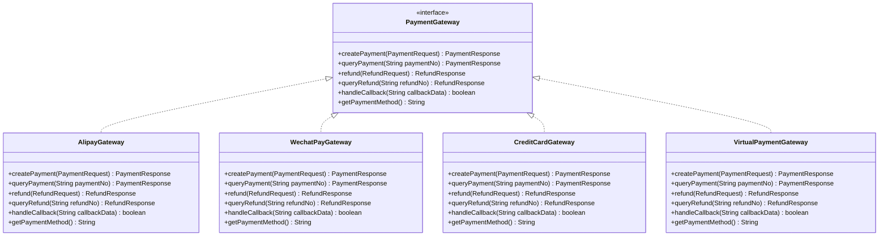
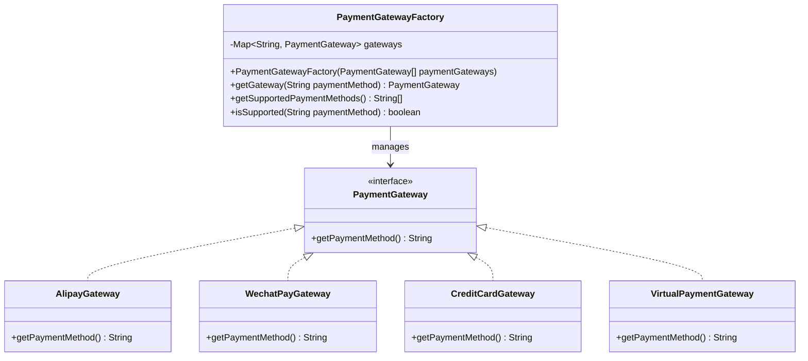
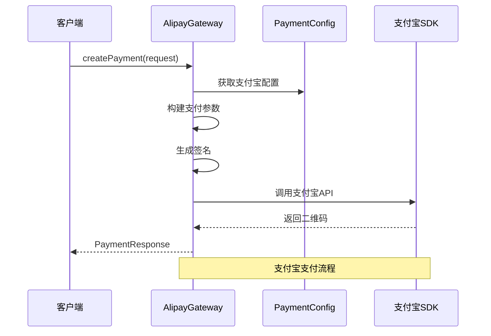
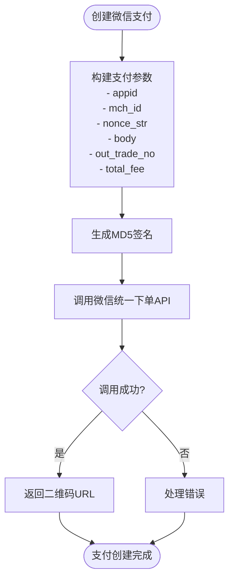
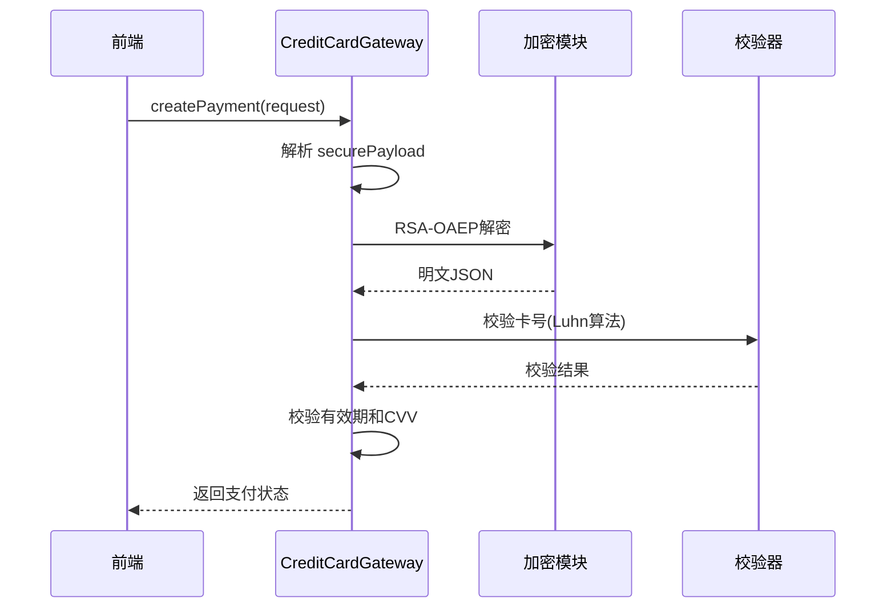
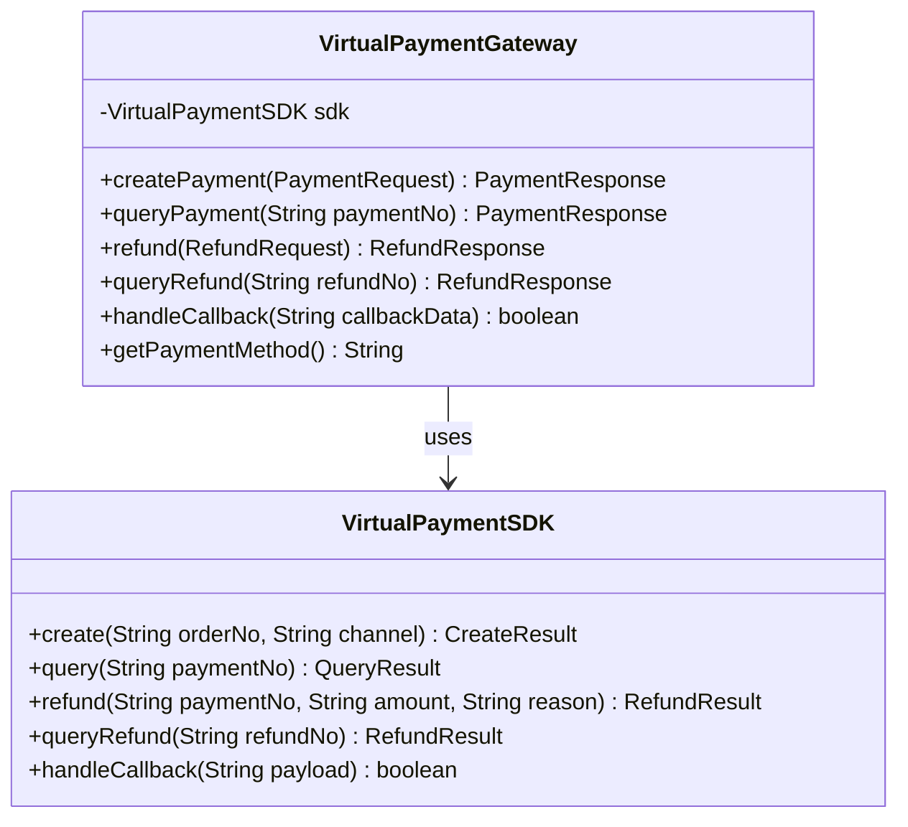
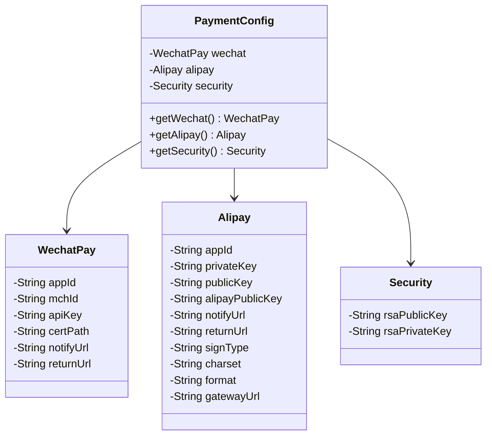
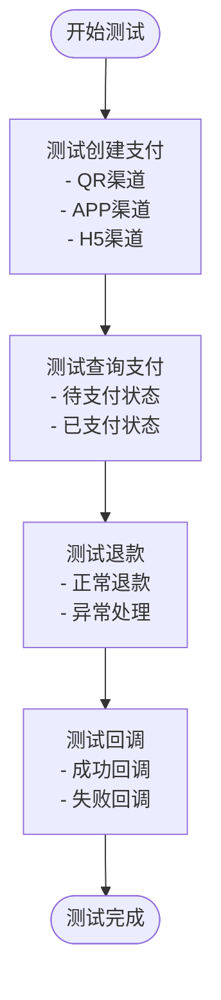
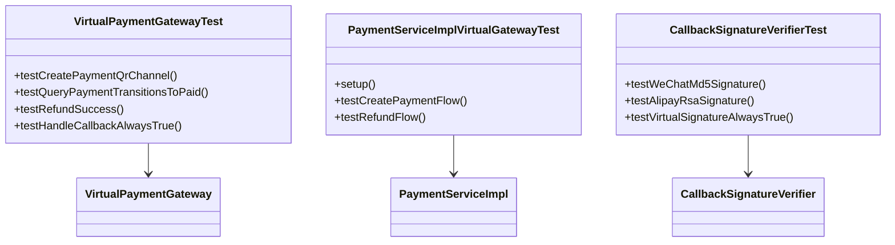

# 支付网关集成

<cite>
**本文档引用的文件**
- [PaymentGateway.java](file://backend/src/main/java/com/carwash/service/payment/PaymentGateway.java)
- [PaymentGatewayFactory.java](file://backend/src/main/java/com/carwash/service/payment/PaymentGatewayFactory.java)
- [AlipayGateway.java](file://backend/src/main/java/com/carwash/service/payment/AlipayGateway.java)
- [WechatPayGateway.java](file://backend/src/main/java/com/carwash/service/payment/WechatPayGateway.java)
- [CreditCardGateway.java](file://backend/src/main/java/com/carwash/service/payment/CreditCardGateway.java)
- [VirtualPaymentGateway.java](file://backend/src/main/java/com/carwash/service/payment/VirtualPaymentGateway.java)
- [PaymentConfig.java](file://backend/src/main/java/com/carwash/config/PaymentConfig.java)
- [application-payment.yml](file://backend/src/main/resources/application-payment.yml)
- [VirtualPaymentSDK.java](file://backend/src/main/java/com/carwash/service/payment/virtual/VirtualPaymentSDK.java)
- [PaymentController.java](file://backend/src/main/java/com/carwash/controller/PaymentController.java)
- [PaymentServiceImpl.java](file://backend/src/main/java/com/carwash/service/impl/PaymentServiceImpl.java)
- [payment-gateway.md](file://backend/docs/payment-gateway.md)
- [VirtualPaymentGatewayTest.java](file://backend/src/test/java/com/carwash/service/payment/VirtualPaymentGatewayTest.java)
</cite>

## 目录
1. [概述](#概述)
2. [核心接口设计](#核心接口设计)
3. [工厂模式实现](#工厂模式实现)
4. [具体支付网关实现](#具体支付网关实现)
5. [配置管理](#配置管理)
6. [虚拟支付网关](#虚拟支付网关)
7. [扩展指南](#扩展指南)
8. [测试与验证](#测试与验证)
9. [总结](#总结)

## 概述

汽车洗车服务预约系统采用统一的支付网关集成架构，通过标准化接口支持多种支付方式，包括支付宝、微信支付、信用卡支付和虚拟支付。该架构基于工厂模式设计，实现了支付方式的动态注册与获取，确保了系统的可扩展性和维护性。

### 架构特点

- **统一接口**：所有支付网关实现统一的 `PaymentGateway` 接口
- **工厂模式**：通过 `PaymentGatewayFactory` 实现支付网关的自动注册与获取
- **多支付支持**：支持支付宝、微信支付、信用卡和虚拟支付
- **配置驱动**：通过配置文件管理各支付平台的参数
- **测试友好**：虚拟支付网关专门用于开发和测试环境

## 核心接口设计

### PaymentGateway 接口定义

`PaymentGateway` 接口定义了支付网关的核心功能，包含四个主要方法：



**图表来源**
- [PaymentGateway.java](file://backend/src/main/java/com/carwash/service/payment/PaymentGateway.java#L12-L54)
- [AlipayGateway.java](file://backend/src/main/java/com/carwash/service/payment/AlipayGateway.java#L26-L317)
- [WechatPayGateway.java](file://backend/src/main/java/com/carwash/service/payment/WechatPayGateway.java#L25-L251)
- [CreditCardGateway.java](file://backend/src/main/java/com/carwash/service/payment/CreditCardGateway.java#L31-L200)
- [VirtualPaymentGateway.java](file://backend/src/main/java/com/carwash/service/payment/VirtualPaymentGateway.java#L20-L92)

### 核心方法详解

| 方法 | 功能描述 | 参数 | 返回值 |
|------|----------|------|--------|
| `createPayment` | 创建支付订单 | `PaymentRequest` 请求对象 | `PaymentResponse` 响应对象 |
| `queryPayment` | 查询支付状态 | `String paymentNo` 支付单号 | `PaymentResponse` 响应对象 |
| `refund` | 申请退款 | `RefundRequest` 退款请求 | `RefundResponse` 退款响应 |
| `queryRefund` | 查询退款状态 | `String refundNo` 退款单号 | `RefundResponse` 退款响应 |
| `handleCallback` | 处理支付回调 | `String callbackData` 回调数据 | `boolean` 处理结果 |
| `getPaymentMethod` | 获取支付方式标识 | 无 | `String` 支付方式名称 |

**节来源**
- [PaymentGateway.java](file://backend/src/main/java/com/carwash/service/payment/PaymentGateway.java#L19-L53)

## 工厂模式实现

### PaymentGatewayFactory 设计

`PaymentGatewayFactory` 采用工厂模式，通过构造器注入所有 `PaymentGateway` 实现，自动建立支付方式与实例的映射关系：



**图表来源**
- [PaymentGatewayFactory.java](file://backend/src/main/java/com/carwash/service/payment/PaymentGatewayFactory.java#L15-L55)

### 注册机制

工厂类通过以下流程实现自动注册：

1. **构造器注入**：接收所有 `PaymentGateway` 实现的列表
2. **方法识别**：调用每个实现的 `getPaymentMethod()` 方法
3. **映射建立**：将支付方式作为键，网关实例作为值存入哈希表
4. **快速查找**：通过支付方式快速获取对应网关实例

**节来源**
- [PaymentGatewayFactory.java](file://backend/src/main/java/com/carwash/service/payment/PaymentGatewayFactory.java#L19-L24)

## 具体支付网关实现

### 支付宝网关 (AlipayGateway)

支付宝网关实现了完整的支付宝支付流程，包括签名生成、API调用和回调处理：



**图表来源**
- [AlipayGateway.java](file://backend/src/main/java/com/carwash/service/payment/AlipayGateway.java#L34-L81)

#### 关键特性

- **签名算法**：使用 SHA-256 签名算法
- **支付方式**：支持扫码支付和移动支付
- **回调处理**：支持异步通知和同步返回
- **错误处理**：完善的异常捕获和错误响应

**节来源**
- [AlipayGateway.java](file://backend/src/main/java/com/carwash/service/payment/AlipayGateway.java#L34-L317)

### 微信支付网关 (WechatPayGateway)

微信支付网关专注于微信生态系统的支付集成：



**图表来源**
- [WechatPayGateway.java](file://backend/src/main/java/com/carwash/service/payment/WechatPayGateway.java#L33-L72)

#### 技术特点

- **签名验证**：使用 MD5 算法进行签名验证
- **支付类型**：支持扫码支付 (NATIVE)
- **证书管理**：支持商户证书配置
- **回调验证**：严格的回调数据验证

**节来源**
- [WechatPayGateway.java](file://backend/src/main/java/com/carwash/service/payment/WechatPayGateway.java#L33-L251)

### 信用卡网关 (CreditCardGateway)

信用卡网关采用安全的前端加密后端解密模式：



**图表来源**
- [CreditCardGateway.java](file://backend/src/main/java/com/carwash/service/payment/CreditCardGateway.java#L37-L97)

#### 安全特性

- **零存储原则**：不存储任何敏感信息
- **PCI-DSS合规**：符合支付卡行业数据安全标准
- **前端加密**：使用RSA-OAEP算法加密敏感数据
- **多重校验**：卡号、有效期、CVV的综合校验

**节来源**
- [CreditCardGateway.java](file://backend/src/main/java/com/carwash/service/payment/CreditCardGateway.java#L37-L200)

### 虚拟支付网关 (VirtualPaymentGateway)

虚拟支付网关专为开发和测试环境设计：



**图表来源**
- [VirtualPaymentGateway.java](file://backend/src/main/java/com/carwash/service/payment/VirtualPaymentGateway.java#L20-L92)
- [VirtualPaymentSDK.java](file://backend/src/main/java/com/carwash/service/payment/virtual/VirtualPaymentSDK.java#L18-L143)

#### 支持的支付渠道

| 渠道类型 | 特征 | 返回值 |
|----------|------|--------|
| `qr` | 扫码支付 | `qrCode` 二维码链接 |
| `app` | 移动应用支付 | `payUrl` 深链接 |
| `h5` | H5网页支付 | `payUrl` 网页链接 |

**节来源**
- [VirtualPaymentGateway.java](file://backend/src/main/java/com/carwash/service/payment/VirtualPaymentGateway.java#L28-L92)
- [VirtualPaymentSDK.java](file://backend/src/main/java/com/carwash/service/payment/virtual/VirtualPaymentSDK.java#L49-L74)

## 配置管理

### PaymentConfig 配置类

`PaymentConfig` 类通过 Spring Boot 的配置属性机制管理所有支付平台的配置：



**图表来源**
- [PaymentConfig.java](file://backend/src/main/java/com/carwash/config/PaymentConfig.java#L11-L225)

### 配置文件结构

配置文件采用 YAML 格式，层次清晰：

```yaml
payment:
  # 微信支付配置
  wechat:
    app-id: wx1234567890abcdef
    mch-id: 1234567890
    api-key: your-wechat-api-key-here
    notify-url: http://localhost:8080/api/payment/callback/wechat
    return-url: http://localhost:3000/payment/result
  
  # 支付宝配置
  alipay:
    app-id: 2021000000000000
    private-key: your-alipay-private-key-here
    notify-url: http://localhost:8080/api/payment/callback/alipay
    sign-type: RSA2
  
  # 安全配置
  security:
    rsa-public-key: |
      -----BEGIN PUBLIC KEY-----
      MIIBIjANBgkqhkiG9w0BAQEFAAOCAQ8AMIIBCgKCAQEApExamplePublicKeyReplaceThisLine
      -----END PUBLIC KEY-----
```

**节来源**
- [PaymentConfig.java](file://backend/src/main/java/com/carwash/config/PaymentConfig.java#L11-L225)
- [application-payment.yml](file://backend/src/main/resources/application-payment.yml#L1-L34)

## 虚拟支付网关

### 开发测试优势

虚拟支付网关在测试环境中具有显著优势：

1. **无需外部依赖**：不依赖任何第三方支付平台
2. **快速响应**：即时返回结果，无需网络延迟
3. **可控性强**：可以模拟各种支付状态和错误场景
4. **成本低廉**：完全免费，适合大规模测试

### 测试场景覆盖



**图表来源**
- [VirtualPaymentGatewayTest.java](file://backend/src/test/java/com/carwash/service/payment/VirtualPaymentGatewayTest.java#L32-L90)

**节来源**
- [VirtualPaymentGateway.java](file://backend/src/main/java/com/carwash/service/payment/VirtualPaymentGateway.java#L15-L92)
- [VirtualPaymentSDK.java](file://backend/src/main/java/com/carwash/service/payment/virtual/VirtualPaymentSDK.java#L18-L143)

## 扩展指南

### 新增支付方式步骤

要添加新的支付网关，需要遵循以下步骤：

#### 1. 实现 PaymentGateway 接口

```java
@Service
public class NewPaymentGateway implements PaymentGateway {
    
    @Override
    public PaymentResponse createPayment(PaymentRequest request) {
        // 实现创建支付逻辑
    }
    
    @Override
    public PaymentResponse queryPayment(String paymentNo) {
        // 实现查询支付状态逻辑
    }
    
    @Override
    public RefundResponse refund(RefundRequest request) {
        // 实现退款逻辑
    }
    
    @Override
    public RefundResponse queryRefund(String refundNo) {
        // 实现查询退款状态逻辑
    }
    
    @Override
    public boolean handleCallback(String callbackData) {
        // 实现回调处理逻辑
    }
    
    @Override
    public String getPaymentMethod() {
        return "new_payment_method";
    }
}
```

#### 2. 配置支付参数

在 `application-payment.yml` 中添加新支付方式的配置：

```yaml
payment:
  new-payment-method:
    app-id: your-app-id
    merchant-id: your-merchant-id
    api-key: your-api-key
    notify-url: http://your-domain.com/api/payment/callback/new-payment-method
```

#### 3. 更新 PaymentConfig

在 `PaymentConfig` 类中添加新的配置类：

```java
public static class NewPaymentMethod {
    private String appId;
    private String merchantId;
    private String apiKey;
    private String notifyUrl;
    
    // Getters and setters
}
```

#### 4. 验证集成

运行测试确保新支付网关正常工作：

```bash
./mvnw test -Dtest=*NewPaymentGatewayTest
```

### 最佳实践

1. **错误处理**：实现完善的异常处理和错误响应
2. **日志记录**：添加详细的日志记录以便调试
3. **单元测试**：编写完整的单元测试覆盖核心功能
4. **性能监控**：集成性能监控指标
5. **安全考虑**：确保敏感信息的安全存储和传输

## 测试与验证

### 单元测试框架

系统提供了完整的测试框架：



**图表来源**
- [VirtualPaymentGatewayTest.java](file://backend/src/test/java/com/carwash/service/payment/VirtualPaymentGatewayTest.java#L17-L90)

### 测试覆盖率

| 测试类型 | 覆盖范围 | 文件位置 |
|----------|----------|----------|
| 单元测试 | 核心功能验证 | `VirtualPaymentGatewayTest` |
| 集成测试 | 完整流程验证 | `PaymentServiceImplVirtualGatewayTest` |
| 验签测试 | 签名验证逻辑 | `CallbackSignatureVerifierTest` |
| 模拟数据 | 测试样本 | `mock/virtual-transaction.json` |

**节来源**
- [VirtualPaymentGatewayTest.java](file://backend/src/test/java/com/carwash/service/payment/VirtualPaymentGatewayTest.java#L17-L90)

## 总结

汽车洗车服务预约系统的支付网关集成架构展现了优秀的软件设计原则：

### 架构优势

1. **统一抽象**：通过 `PaymentGateway` 接口实现了支付方式的统一抽象
2. **松耦合设计**：工厂模式实现了支付网关的动态注册和获取
3. **高可扩展性**：新增支付方式只需实现接口并配置即可
4. **测试友好**：虚拟支付网关提供了完整的测试支持
5. **安全可靠**：多种支付方式满足不同场景的安全需求

### 技术亮点

- **工厂模式**：自动化的支付网关注册机制
- **配置驱动**：灵活的配置管理支持多环境部署
- **安全加密**：信用卡支付采用前端加密后端解密模式
- **监控集成**：完整的性能监控和审计功能
- **异常处理**：完善的错误处理和恢复机制

该架构不仅满足了当前的业务需求，还为未来的支付方式扩展奠定了坚实的基础，是一个值得借鉴的企业级支付系统设计方案。