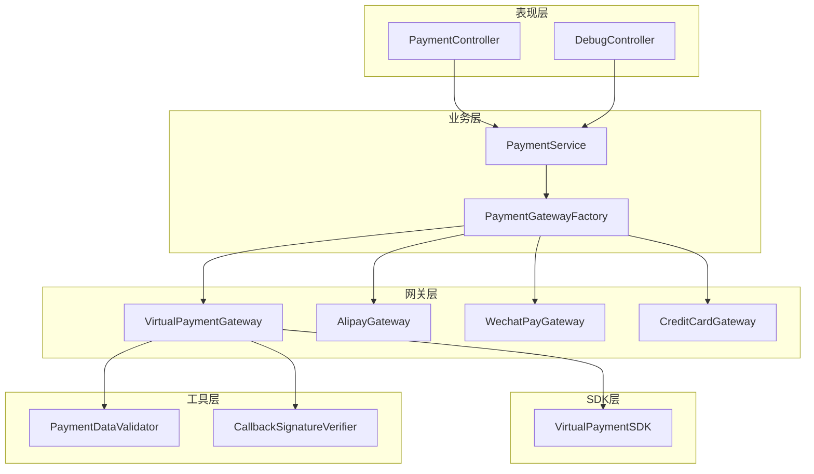
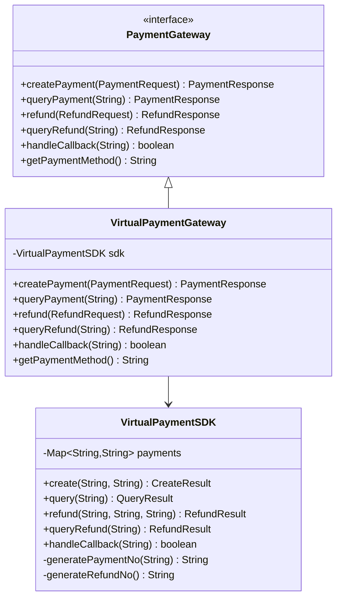
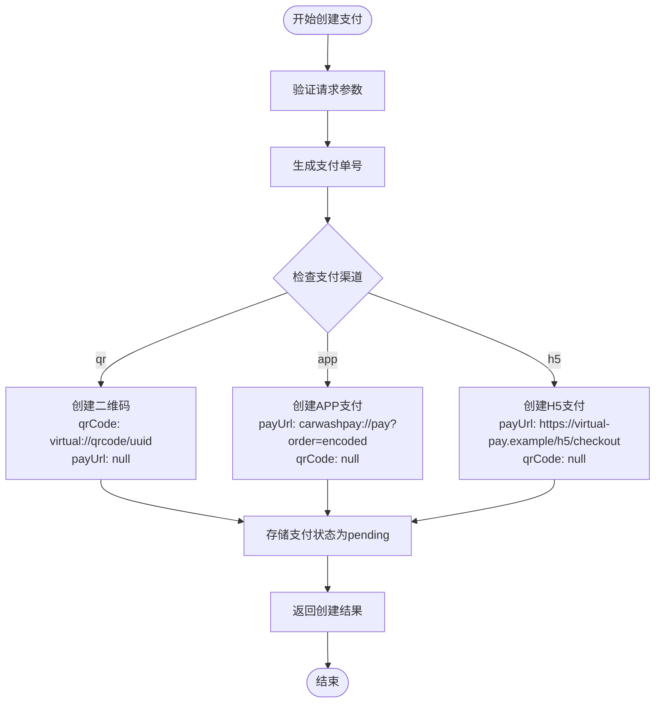
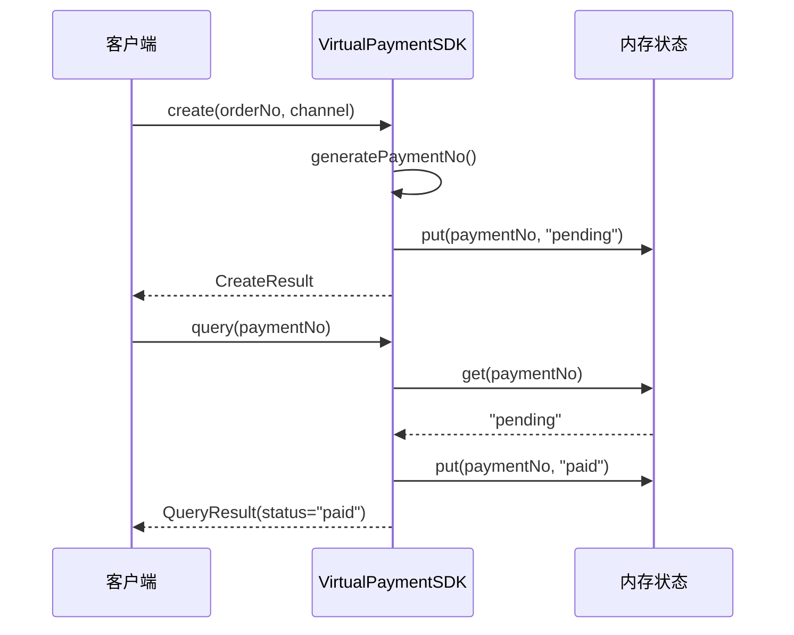
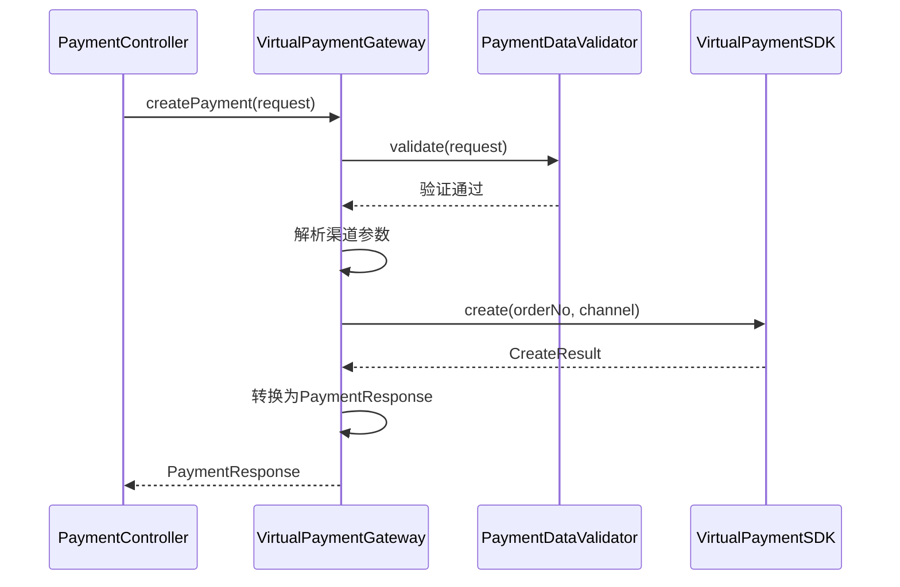
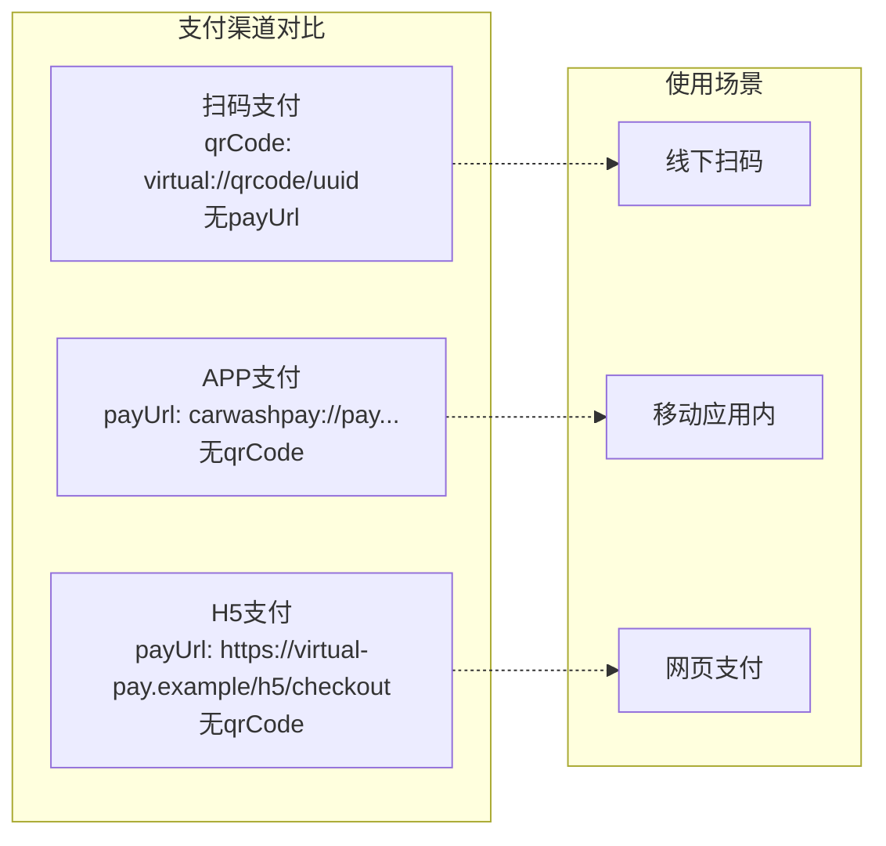
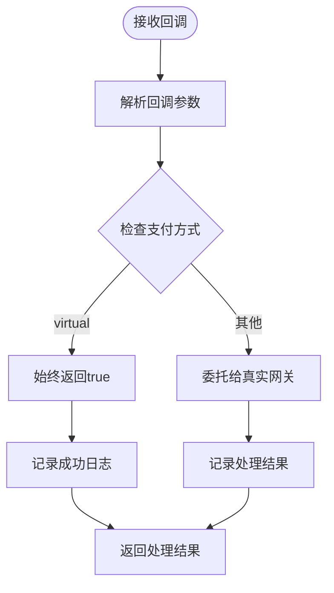
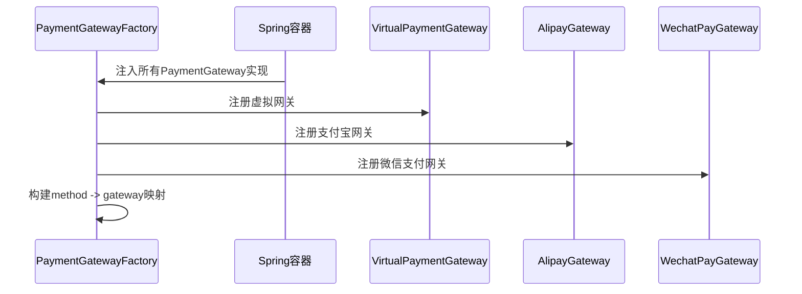
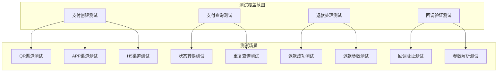
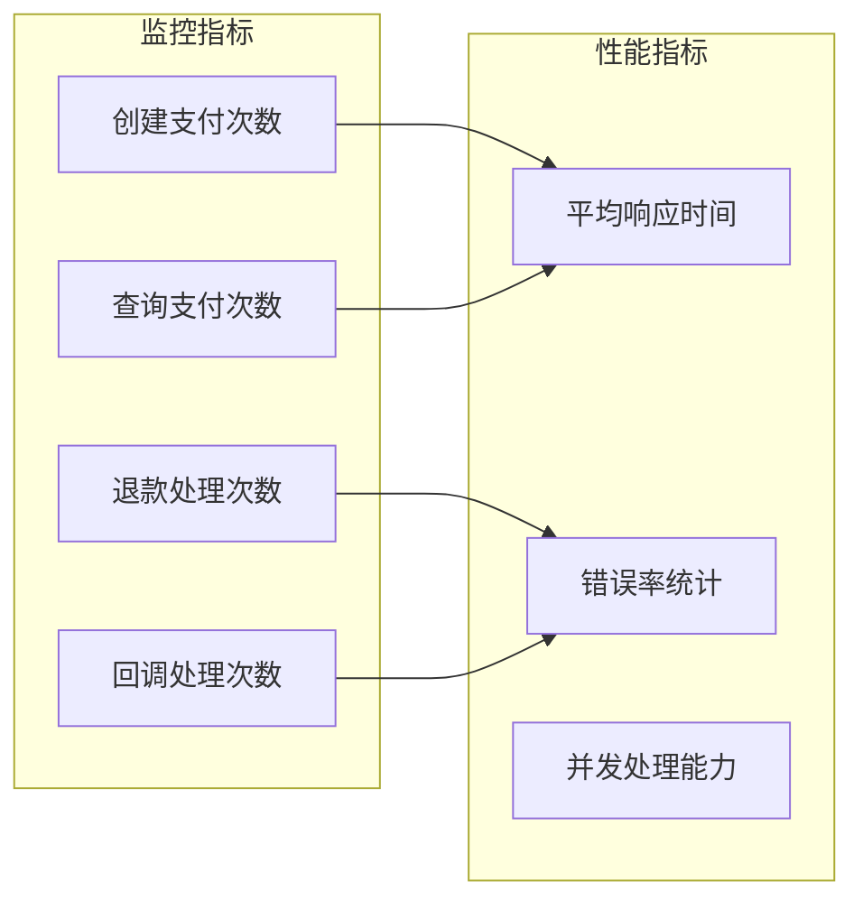

# 虚拟支付网关

<cite>
**本文档引用的文件**
- [VirtualPaymentSDK.java](file://backend/src/main/java/com/carwash/service/payment/virtual/VirtualPaymentSDK.java)
- [VirtualPaymentGateway.java](file://backend/src/main/java/com/carwash/service/payment/VirtualPaymentGateway.java)
- [PaymentGateway.java](file://backend/src/main/java/com/carwash/service/payment/PaymentGateway.java)
- [PaymentController.java](file://backend/src/main/java/com/carwash/controller/PaymentController.java)
- [PaymentRequest.java](file://backend/src/main/java/com/carwash/dto/PaymentRequest.java)
- [PaymentResponse.java](file://backend/src/main/java/com/carwash/dto/PaymentResponse.java)
- [PaymentDataValidator.java](file://backend/src/main/java/com/carwash/service/payment/validation/PaymentDataValidator.java)
- [CallbackSignatureVerifier.java](file://backend/src/main/java/com/carwash/service/payment/security/CallbackSignatureVerifier.java)
- [VirtualPaymentGatewayTest.java](file://backend/src/test/java/com/carwash/service/payment/VirtualPaymentGatewayTest.java)
- [PaymentServiceImplVirtualGatewayTest.java](file://backend/src/test/java/com/carwash/service/payment/PaymentServiceImplVirtualGatewayTest.java)
- [virtual-transaction.json](file://backend/src/test/resources/mock/virtual-transaction.json)
- [application-payment.yml](file://backend/src/main/resources/application-payment.yml)
- [payment-gateway.md](file://backend/docs/payment-gateway.md)
</cite>

## 目录
1. [概述](#概述)
2. [系统架构](#系统架构)
3. [核心组件分析](#核心组件分析)
4. [虚拟支付SDK详解](#虚拟支付sdk详解)
5. [虚拟支付网关实现](#虚拟支付网关实现)
6. [支付渠道支持](#支付渠道支持)
7. [回调处理机制](#回调处理机制)
8. [配置与集成](#配置与集成)
9. [测试与验证](#测试与验证)
10. [使用指南](#使用指南)
11. [故障排除](#故障排除)
12. [总结](#总结)

## 概述

虚拟支付网关是汽车洗车服务预约系统中的一个重要组件，专门设计用于开发和测试阶段替代真实支付网关。它提供了完整的支付生命周期模拟功能，包括支付创建、状态查询、退款处理和回调验证等核心支付业务逻辑。

### 设计目的

虚拟支付网关的主要设计目的是：
- **开发测试支持**：为开发者提供一个可靠的支付测试环境，无需依赖真实的支付网关
- **端到端流程验证**：模拟完整的支付流程，确保支付系统的各个组件能够正确协作
- **成本效益**：避免在开发过程中产生真实的支付费用
- **快速迭代**：支持快速的功能验证和bug修复

### 核心特性

- 支持三种支付渠道：扫码支付(qr)、APP支付(app)、H5支付(h5)
- 内存状态管理，便于测试各种支付状态转换
- 简化的回调验证机制，开发/测试环境下始终通过
- 与真实支付网关相同的接口设计，确保无缝切换

## 系统架构

虚拟支付网关采用分层架构设计，清晰地分离了业务逻辑、数据访问和接口定义：



**图表来源**
- [PaymentController.java](file://backend/src/main/java/com/carwash/controller/PaymentController.java#L1-L50)
- [VirtualPaymentGateway.java](file://backend/src/main/java/com/carwash/service/payment/VirtualPaymentGateway.java#L1-L30)
- [PaymentGateway.java](file://backend/src/main/java/com/carwash/service/payment/PaymentGateway.java#L1-L20)

## 核心组件分析

### PaymentGateway接口

PaymentGateway接口定义了支付网关的标准契约，确保所有支付网关实现具有一致的行为模式：



**图表来源**
- [PaymentGateway.java](file://backend/src/main/java/com/carwash/service/payment/PaymentGateway.java#L12-L54)
- [VirtualPaymentGateway.java](file://backend/src/main/java/com/carwash/service/payment/VirtualPaymentGateway.java#L19-L92)
- [VirtualPaymentSDK.java](file://backend/src/main/java/com/carwash/service/payment/virtual/VirtualPaymentSDK.java#L18-L143)

**章节来源**
- [PaymentGateway.java](file://backend/src/main/java/com/carwash/service/payment/PaymentGateway.java#L1-L54)
- [VirtualPaymentGateway.java](file://backend/src/main/java/com/carwash/service/payment/VirtualPaymentGateway.java#L1-L92)

## 虚拟支付SDK详解

VirtualPaymentSDK是虚拟支付网关的核心实现，负责具体的支付业务逻辑处理。

### 数据结构设计

SDK定义了三个核心的数据传输对象：

| 类型 | 字段 | 描述 | 示例值 |
|------|------|------|--------|
| CreateResult | paymentNo | 支付单号 | VP20241201120000ORDER12345 |
| CreateResult | channel | 支付渠道 | qr/app/h5 |
| CreateResult | qrCode | 二维码内容 | virtual://qrcode/uuid |
| CreateResult | payUrl | 支付链接 | https://virtual-pay.example/h5/checkout |
| CreateResult | status | 支付状态 | pending |
| CreateResult | message | 状态消息 | 虚拟支付创建成功 |

### 支付创建逻辑

支付创建过程根据不同的支付渠道生成相应的支付参数：



**图表来源**
- [VirtualPaymentSDK.java](file://backend/src/main/java/com/carwash/service/payment/virtual/VirtualPaymentSDK.java#L49-L74)

### 状态管理机制

SDK内部使用ConcurrentHashMap维护支付状态，确保多线程环境下的安全性：



**图表来源**
- [VirtualPaymentSDK.java](file://backend/src/main/java/com/carwash/service/payment/virtual/VirtualPaymentSDK.java#L77-L92)

**章节来源**
- [VirtualPaymentSDK.java](file://backend/src/main/java/com/carwash/service/payment/virtual/VirtualPaymentSDK.java#L1-L143)

## 虚拟支付网关实现

VirtualPaymentGateway作为PaymentGateway接口的具体实现，提供了与PaymentController直接交互的入口。

### 接口实现策略

网关层采用了适配器模式，将VirtualPaymentSDK的内部接口转换为标准的PaymentGateway接口：



**图表来源**
- [VirtualPaymentGateway.java](file://backend/src/main/java/com/carwash/service/payment/VirtualPaymentGateway.java#L28-L47)

### 异常处理机制

网关实现了完善的异常处理逻辑，确保系统稳定性：

| 异常类型 | 处理策略 | 返回响应 |
|----------|----------|----------|
| 参数验证失败 | 记录日志，返回失败响应 | status="failed", message="验证失败信息" |
| SDK调用异常 | 记录详细错误日志 | status="failed", message="具体错误信息" |
| 系统内部异常 | 记录堆栈跟踪 | status="failed", message="系统内部错误" |

**章节来源**
- [VirtualPaymentGateway.java](file://backend/src/main/java/com/carwash/service/payment/VirtualPaymentGateway.java#L1-L92)

## 支付渠道支持

虚拟支付网关支持三种主流的支付渠道，每种渠道都有其特定的模拟实现。

### 扫码支付(QR)渠道

扫码支付是最常用的支付方式，虚拟网关通过生成虚拟二维码来模拟这一过程：

- **二维码格式**：`virtual://qrcode/{UUID}`
- **特点**：无需外部支付平台，完全本地化处理
- **应用场景**：线下扫码支付、移动端支付

### APP支付渠道

APP支付模拟移动应用内的支付流程：

- **深度链接格式**：`carwashpay://pay?order={encoded_order}&ts={timestamp}`
- **特点**：模拟APP拉起支付的完整流程
- **应用场景**：原生移动应用支付

### H5支付渠道

H5支付模拟网页端支付体验：

- **支付链接格式**：`https://virtual-pay.example/h5/checkout?order={encoded_order}`
- **特点**：生成可直接访问的支付页面URL
- **应用场景**：Web端支付、混合应用支付



**图表来源**
- [VirtualPaymentSDK.java](file://backend/src/main/java/com/carwash/service/payment/virtual/VirtualPaymentSDK.java#L54-L71)

**章节来源**
- [VirtualPaymentSDK.java](file://backend/src/main/java/com/carwash/service/payment/virtual/VirtualPaymentSDK.java#L49-L74)

## 回调处理机制

虚拟支付网关实现了简化的回调处理机制，专为开发和测试环境设计。

### 验签机制

在开发环境中，虚拟支付网关的验签总是通过：



**图表来源**
- [CallbackSignatureVerifier.java](file://backend/src/main/java/com/carwash/service/payment/security/CallbackSignatureVerifier.java#L35-L46)

### 回调端点映射

系统为每种支付方式提供了专门的回调处理端点：

| 支付方式 | 回调端点 | 返回格式 | 验签策略 |
|----------|----------|----------|----------|
| 虚拟支付 | `/api/payment/callback/virtual` | `ok`/`fail` | 始终通过 |
| 微信支付 | `/api/payment/callback/wechat` | XML格式 | MD5验签 |
| 支付宝支付 | `/api/payment/callback/alipay` | `success`/`fail` | RSA验签 |

**章节来源**
- [PaymentController.java](file://backend/src/main/java/com/carwash/controller/PaymentController.java#L168-L180)
- [CallbackSignatureVerifier.java](file://backend/src/main/java/com/carwash/service/payment/security/CallbackSignatureVerifier.java#L1-L170)

## 配置与集成

### 应用配置

虚拟支付网关通过Spring配置文件进行集成：

```yaml
# application-payment.yml
payment:
  # 虚拟支付配置
  virtual:
    enabled: true
    # 虚拟支付不需要额外配置
```

### 网关工厂注册

PaymentGatewayFactory自动发现并注册所有PaymentGateway实现：



**图表来源**
- [VirtualPaymentGateway.java](file://backend/src/main/java/com/carwash/service/payment/VirtualPaymentGateway.java#L89-L91)

### 接口兼容性

虚拟支付网关与真实支付网关保持完全的接口兼容性：

| 方法 | 输入参数 | 输出格式 | 虚拟网关行为 |
|------|----------|----------|--------------|
| createPayment | PaymentRequest | PaymentResponse | 生成虚拟支付参数 |
| queryPayment | paymentNo | PaymentResponse | 模拟支付状态查询 |
| refund | RefundRequest | RefundResponse | 模拟退款处理 |
| handleCallback | callbackData | boolean | 验签始终通过 |

**章节来源**
- [application-payment.yml](file://backend/src/main/resources/application-payment.yml#L1-L34)

## 测试与验证

### 单元测试覆盖

虚拟支付网关提供了全面的单元测试，涵盖核心业务逻辑：



**图表来源**
- [VirtualPaymentGatewayTest.java](file://backend/src/test/java/com/carwash/service/payment/VirtualPaymentGatewayTest.java#L17-L90)

### 集成测试

通过PaymentServiceImplVirtualGatewayTest验证服务层的集成效果：

- **模拟数据库层**：使用Mockito模拟PaymentMapper和BookingMapper
- **端到端验证**：测试从订单创建到支付完成的完整流程
- **状态一致性**：确保支付状态在各个组件间正确传递

### 模拟数据结构

系统提供了标准化的模拟支付数据：

```json
{
  "orderNo": "ORDER-MOCK-001",
  "amount": "12.34",
  "paymentMethod": "virtual",
  "channel": "qr",
  "extra": {
    "note": "sanitized test fixture"
  }
}
```

**章节来源**
- [VirtualPaymentGatewayTest.java](file://backend/src/test/java/com/carwash/service/payment/VirtualPaymentGatewayTest.java#L1-L90)
- [PaymentServiceImplVirtualGatewayTest.java](file://backend/src/test/java/com/carwash/service/payment/PaymentServiceImplVirtualGatewayTest.java#L1-L76)
- [virtual-transaction.json](file://backend/src/test/resources/mock/virtual-transaction.json#L1-L9)

## 使用指南

### 开发环境配置

1. **启用虚拟支付网关**
   在`application-payment.yml`中确保虚拟支付网关已启用：

```yaml
payment:
  virtual:
    enabled: true
```

2. **选择支付渠道**
   在支付请求中指定虚拟支付渠道：

```java
PaymentRequest request = new PaymentRequest();
request.setOrderNo("TEST-ORDER-001");
request.setAmount(new BigDecimal("19.90"));
request.setPaymentMethod("virtual");
request.setChannel("qr"); // 或 "app", "h5"
```

### 调试接口使用

系统提供了专门的调试接口来测试虚拟支付功能：

```bash
# 创建虚拟支付订单
curl -X POST "http://localhost:8080/api/payment/create" \
  -H "Content-Type: application/json" \
  -d '{
    "orderNo": "DEBUG-ORDER-001",
    "amount": 29.90,
    "paymentMethod": "virtual",
    "channel": "qr"
  }'

# 查询支付状态
curl -X GET "http://localhost:8080/api/payment/status/VP20241201120000DEBUG-ORDER-001"

# 申请退款
curl -X POST "http://localhost:8080/api/payment/refund" \
  -H "Content-Type: application/json" \
  -d '{
    "paymentNo": "VP20241201120000DEBUG-ORDER-001",
    "amount": 19.90,
    "reason": "测试退款"
  }'
```

### 触发不同支付结果

通过调整支付参数可以模拟不同的支付场景：

| 场景 | 配置 | 结果 |
|------|------|------|
| 成功支付 | 正常请求 | 状态从pending变为paid |
| 退款处理 | 提供退款参数 | 返回成功退款响应 |
| 支付超时 | 不查询支付状态 | 保持pending状态 |
| 重复操作 | 多次查询同一支付 | 状态不变 |

### 前端集成示例

```javascript
// 支付流程示例
async function processVirtualPayment(orderId, amount, channel) {
    try {
        // 1. 创建支付订单
        const createResponse = await axios.post('/api/payment/create', {
            orderNo: orderId,
            amount: amount,
            paymentMethod: 'virtual',
            channel: channel
        });
        
        const paymentNo = createResponse.data.paymentNo;
        
        // 2. 显示支付二维码或跳转链接
        if (channel === 'qr') {
            showQRCode(createResponse.data.qrCode);
        } else {
            window.location.href = createResponse.data.payUrl;
        }
        
        // 3. 轮询查询支付状态
        let paymentStatus = 'pending';
        while (paymentStatus === 'pending') {
            const queryResponse = await axios.get(`/api/payment/status/${paymentNo}`);
            paymentStatus = queryResponse.data.status;
            await sleep(1000); // 等待1秒
        }
        
        return paymentStatus === 'paid';
    } catch (error) {
        console.error('支付处理失败:', error);
        return false;
    }
}
```

**章节来源**
- [PaymentController.java](file://backend/src/main/java/com/carwash/controller/PaymentController.java#L46-L78)
- [PaymentRequest.java](file://backend/src/main/java/com/carwash/dto/PaymentRequest.java#L1-L141)

## 故障排除

### 常见问题及解决方案

#### 1. 支付创建失败

**症状**：创建支付请求返回失败状态

**可能原因**：
- 订单号为空或格式不正确
- 支付金额小于等于0
- 支付渠道参数错误

**解决方案**：
```java
// 检查输入参数
if (request.getOrderNo() == null || request.getOrderNo().trim().isEmpty()) {
    throw new IllegalArgumentException("订单号不能为空");
}
if (request.getAmount() == null || request.getAmount().compareTo(BigDecimal.ZERO) <= 0) {
    throw new IllegalArgumentException("支付金额必须大于0");
}
```

#### 2. 支付状态查询异常

**症状**：查询支付状态返回null或异常

**可能原因**：
- 支付单号不存在
- 网络连接问题
- SDK内部状态异常

**解决方案**：
```java
// 添加重试机制
public PaymentResponse queryPaymentWithRetry(String paymentNo, int maxRetries) {
    for (int i = 0; i < maxRetries; i++) {
        try {
            return gateway.queryPayment(paymentNo);
        } catch (Exception e) {
            if (i == maxRetries - 1) throw e;
            Thread.sleep(1000 * (i + 1)); // 指数退避
        }
    }
    return null;
}
```

#### 3. 回调处理失败

**症状**：支付完成后无法正确更新订单状态

**可能原因**：
- 回调URL配置错误
- 网络防火墙阻止回调
- 验签配置问题

**解决方案**：
```bash
# 检查回调端点可用性
curl -X POST "http://localhost:8080/api/payment/callback/virtual" \
  -H "Content-Type: application/json" \
  -d '{"mock": true}'
```

### 性能监控

虚拟支付网关内置了基本的性能监控能力：



### 日志分析

系统提供了详细的日志记录，便于问题诊断：

```java
// 关键操作的日志记录
log.info("创建虚拟支付订单: orderNo={}, amount={}, channel={}", 
         request.getOrderNo(), request.getAmount(), channel);
log.debug("支付状态查询: paymentNo={}, currentStatus={}", 
          paymentNo, currentStatus);
log.warn("支付超时: paymentNo={}, timeoutSeconds={}", 
         paymentNo, timeoutSeconds);
```

**章节来源**
- [VirtualPaymentGateway.java](file://backend/src/main/java/com/carwash/service/payment/VirtualPaymentGateway.java#L30-L47)
- [PaymentDataValidator.java](file://backend/src/main/java/com/carwash/service/payment/validation/PaymentDataValidator.java#L12-L39)

## 总结

虚拟支付网关作为汽车洗车服务预约系统的重要组成部分，成功实现了以下目标：

### 技术优势

1. **高度兼容性**：与真实支付网关保持完全的接口兼容性，确保平滑迁移
2. **灵活的渠道支持**：同时支持扫码、APP、H5三种主流支付渠道
3. **简化的开发流程**：无需配置外部支付参数，开箱即用
4. **完善的测试支持**：提供全面的单元测试和集成测试覆盖

### 应用价值

- **开发效率提升**：显著缩短开发周期，减少对外部系统的依赖
- **测试质量保证**：提供稳定可靠的测试环境，确保支付流程的正确性
- **成本控制**：避免开发过程中的真实支付费用
- **团队协作优化**：统一的支付接口设计促进前后端开发的并行工作

### 未来展望

虚拟支付网关的设计理念体现了现代软件开发的最佳实践，其模块化架构和清晰的职责分离为系统的持续演进奠定了坚实基础。随着支付需求的不断增长和技术的持续发展，该组件将继续发挥重要作用，为系统的稳定运行和功能扩展提供可靠保障。

通过本文档的详细阐述，开发者可以深入理解虚拟支付网关的设计思想、实现机制和使用方法，从而更好地利用这一强大工具来加速开发进程和提高测试质量。