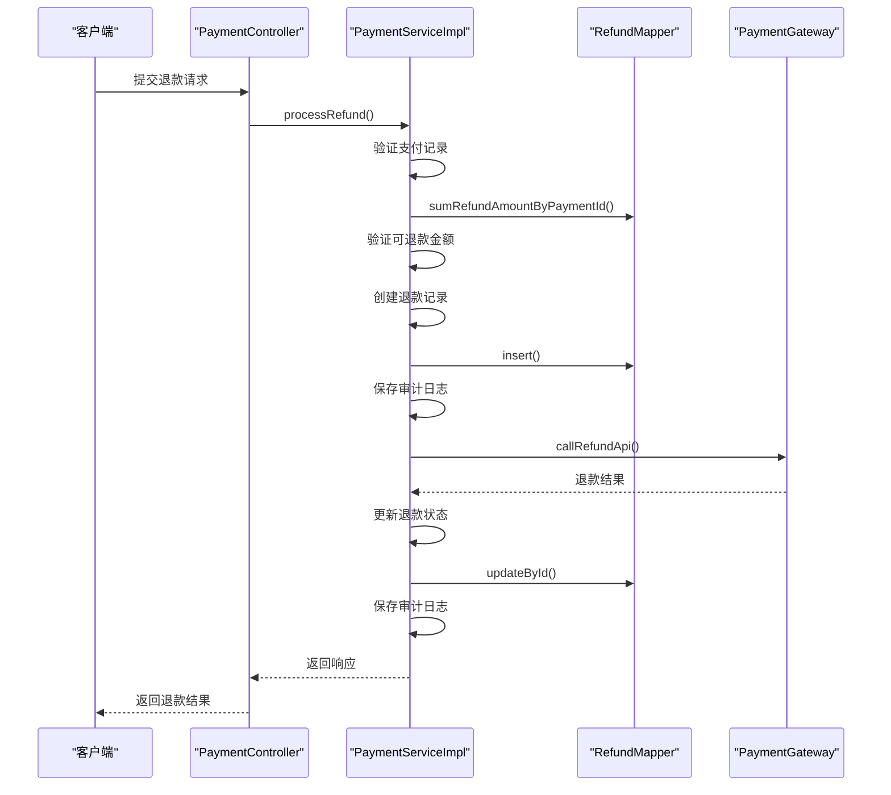
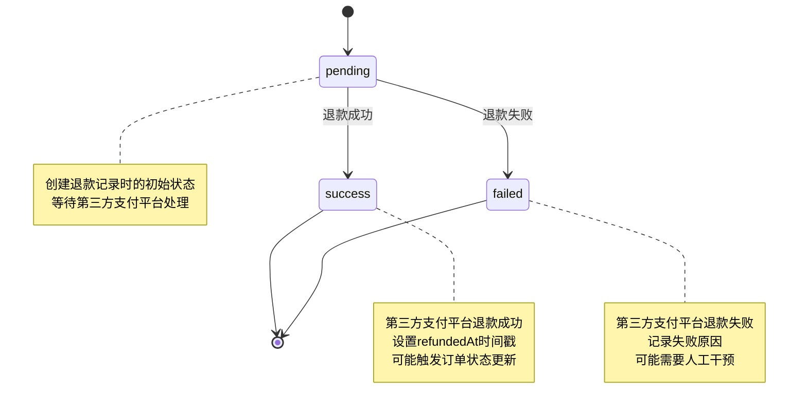
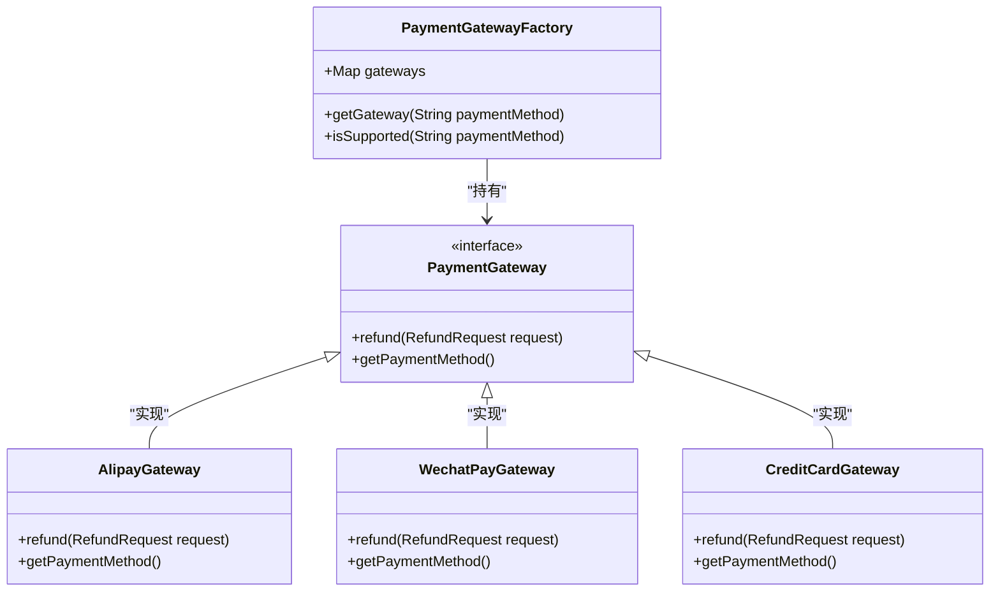
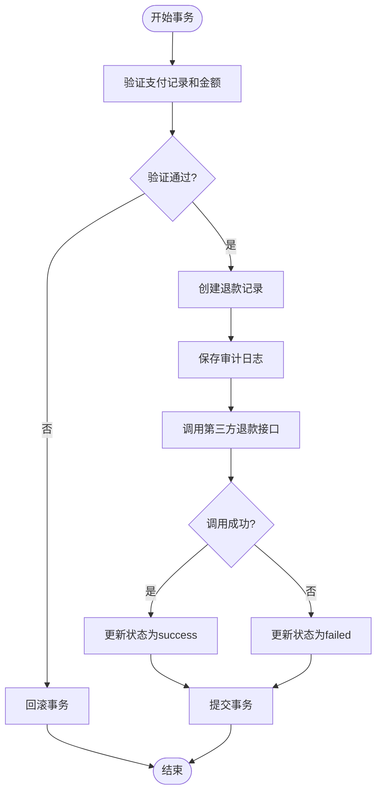

# 退款处理

<cite>
**本文档引用的文件**
- [Refund.java](file://backend/src/main/java/com/carwash/entity/Refund.java)
- [PaymentServiceImpl.java](file://backend/src/main/java/com/carwash/service/impl/PaymentServiceImpl.java)
- [RefundRequest.java](file://backend/src/main/java/com/carwash/dto/RefundRequest.java)
- [RefundResponse.java](file://backend/src/main/java/com/carwash/dto/RefundResponse.java)
- [RefundMapper.java](file://backend/src/main/java/com/carwash/mapper/RefundMapper.java)
- [PaymentGateway.java](file://backend/src/main/java/com/carwash/service/payment/PaymentGateway.java)
- [PaymentGatewayFactory.java](file://backend/src/main/java/com/carwash/service/payment/PaymentGatewayFactory.java)
- [AlipayGateway.java](file://backend/src/main/java/com/carwash/service/payment/AlipayGateway.java)
- [RefundMapper.xml](file://backend/src/main/resources/mapper/RefundMapper.xml)
- [PaymentMonitor.java](file://backend/src/main/java/com/carwash/monitor/PaymentMonitor.java)
- [TimeUtils.java](file://backend/src/main/java/com/carwash/utils/TimeUtils.java)
- [TransactionConfig.java](file://backend/src/main/java/com/carwash/config/TransactionConfig.java)
</cite>

## 目录
1. [退款处理](#退款处理)
2. [核心组件](#核心组件)
3. [执行流程](#执行流程)
4. [状态转换机制](#状态转换机制)
5. [支付网关调用](#支付网关调用)
6. [事务管理](#事务管理)
7. [订单状态更新](#订单状态更新)
8. [审计日志](#审计日志)

## 核心组件

退款处理系统由多个核心组件构成，包括退款实体类、服务实现类、数据访问层和支付网关接口。`Refund`实体类定义了退款记录的数据结构，包含退款金额、状态、时间戳等关键字段。`PaymentServiceImpl`类实现了退款处理的核心业务逻辑，通过`processRefund`方法协调各个组件完成退款操作。`RefundMapper`接口提供了对退款数据的持久化操作，包括插入退款记录和查询已退款金额。`PaymentGateway`接口定义了统一的支付网关调用规范，支持多种支付渠道的退款操作。

**本文档引用的文件**
- [Refund.java](file://backend/src/main/java/com/carwash/entity/Refund.java)
- [PaymentServiceImpl.java](file://backend/src/main/java/com/carwash/service/impl/PaymentServiceImpl.java)
- [RefundMapper.java](file://backend/src/main/java/com/carwash/mapper/RefundMapper.java)
- [PaymentGateway.java](file://backend/src/main/java/com/carwash/service/payment/PaymentGateway.java)

## 执行流程

退款处理的执行流程始于`processRefund`方法的调用，该方法首先验证支付记录的存在性和状态。系统会检查支付记录是否处于"paid"（已支付）状态，只有已支付的订单才能进行退款操作。接下来，系统通过`sumRefundAmountByPaymentId`方法计算该支付记录的累计已退款金额，并与本次退款金额相加，确保总退款金额不超过原始支付金额。

在验证通过后，系统创建新的`Refund`实体，设置初始状态为"pending"（退款中），并生成唯一的退款单号。该退款记录被持久化到数据库后，系统调用`callRefundApi`方法与第三方支付平台进行交互。根据第三方接口的响应结果，系统更新退款记录的状态为"success"（成功）或"failed"（失败），并记录相应的退款时间。

**图示来源**
- [PaymentServiceImpl.java](file://backend/src/main/java/com/carwash/service/impl/PaymentServiceImpl.java#L230-L308)
- [RefundMapper.java](file://backend/src/main/java/com/carwash/mapper/RefundMapper.java#L35-L35)
- [PaymentGateway.java](file://backend/src/main/java/com/carwash/service/payment/PaymentGateway.java#L33-L33)

## 状态转换机制

`Refund`实体类的状态管理采用有限状态机模式，定义了三种主要状态："pending"（退款中）、"success"（退款成功）和"failed"（退款失败）。状态转换由`processRefund`方法控制，初始状态为"pending"，表示退款请求已提交但尚未完成第三方处理。

状态转换的关键在于第三方支付接口的调用结果。当`callRefundApi`方法成功调用第三方接口并收到成功响应时，系统将状态更新为"success"，同时设置`refundedAt`时间戳为当前时间。如果调用失败或收到失败响应，状态将更新为"failed"。系统通过`@TableField`注解的`fill`属性自动管理`createdAt`和`updatedAt`时间戳，确保每次状态变更都能被准确记录。

**图示来源**
- [Refund.java](file://backend/src/main/java/com/carwash/entity/Refund.java#L54-L58)
- [PaymentServiceImpl.java](file://backend/src/main/java/com/carwash/service/impl/PaymentServiceImpl.java#L262-L291)

## 支付网关调用

支付网关的调用通过`PaymentGatewayFactory`工厂模式实现，确保系统能够灵活支持多种支付渠道。`callRefundApi`方法首先通过支付方式从工厂获取对应的`PaymentGateway`实例，然后构建`RefundRequest`对象并调用网关的`refund`方法。

`PaymentGateway`接口定义了统一的退款方法签名，所有具体的支付网关实现类（如`AlipayGateway`、`WechatPayGateway`等）都必须实现该接口。这种设计模式实现了支付渠道的解耦，新增支付方式时只需添加新的实现类，无需修改现有代码。工厂类在启动时通过Spring的依赖注入机制收集所有`PaymentGateway`实现，并根据支付方式标识进行映射。

**图示来源**
- [PaymentGatewayFactory.java](file://backend/src/main/java/com/carwash/service/payment/PaymentGatewayFactory.java)
- [PaymentGateway.java](file://backend/src/main/java/com/carwash/service/payment/PaymentGateway.java)
- [AlipayGateway.java](file://backend/src/main/java/com/carwash/service/payment/AlipayGateway.java)

## 事务管理

退款处理采用声明式事务管理，通过`@Transactional(rollbackFor = Exception.class)`注解确保数据库操作和外部调用的一致性。事务的边界从`processRefund`方法开始，覆盖了从验证、创建退款记录到更新状态的整个流程。

事务管理的关键在于原子性保证：如果在事务执行过程中发生任何异常，所有数据库变更都将回滚，确保数据一致性。例如，当创建退款记录后调用第三方接口失败时，整个事务将回滚，退款记录不会被持久化。这种机制防止了"部分成功"的状态，避免了数据不一致的问题。

**图示来源**
- [PaymentServiceImpl.java](file://backend/src/main/java/com/carwash/service/impl/PaymentServiceImpl.java#L232-L233)
- [TransactionConfig.java](file://backend/src/main/java/com/carwash/config/TransactionConfig.java)

## 订单状态更新

当退款成功且为全额退款时，系统会自动更新关联订单的支付状态为"refunded"（已退款）。这一逻辑在`processRefund`方法中实现，通过比较退款金额与原始支付金额来判断是否为全额退款。如果是全额退款，系统查询对应的订单记录并更新其`paymentStatus`字段。

订单状态更新是退款流程的最终环节，标志着整个支付-退款周期的完成。系统通过`BookingMapper`的`selectByOrderNo`方法获取订单实体，设置新的支付状态后调用`updateById`方法持久化变更。这一过程在同一个事务中执行，确保了支付状态和订单状态的一致性。

**本文档引用的文件**
- [PaymentServiceImpl.java](file://backend/src/main/java/com/carwash/service/impl/PaymentServiceImpl.java#L281-L287)
- [BookingMapper.java](file://backend/src/main/java/com/carwash/mapper/BookingMapper.java)

## 审计日志

系统通过`savePaymentAudit`方法记录详细的审计日志，跟踪退款处理的各个关键步骤。每次重要的操作都会生成一条审计记录，包括发起退款请求、退款成功和退款失败等事件。审计日志包含事件类型、状态、操作员ID、金额和消息等关键信息，为后续的对账和问题排查提供依据。

审计日志的持久化通过`PaymentAuditMapper`实现，采用可选依赖的设计模式。即使审计模块不可用，也不会影响核心退款流程的执行。系统在关键节点调用`savePaymentAudit`方法，如创建退款记录后、调用第三方接口前后等，确保重要操作都有迹可循。

**本文档引用的文件**
- [PaymentServiceImpl.java](file://backend/src/main/java/com/carwash/service/impl/PaymentServiceImpl.java#L267-L279)
- [PaymentAuditMapper.java](file://backend/src/main/java/com/carwash/mapper/PaymentAuditMapper.java)