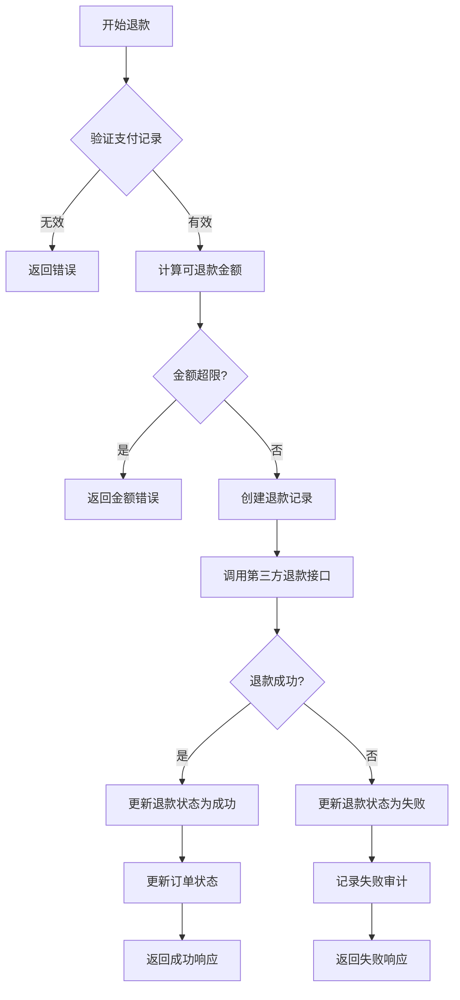
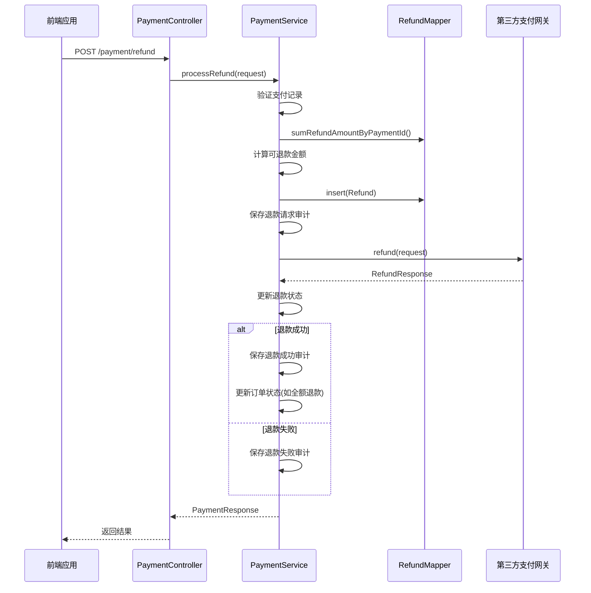
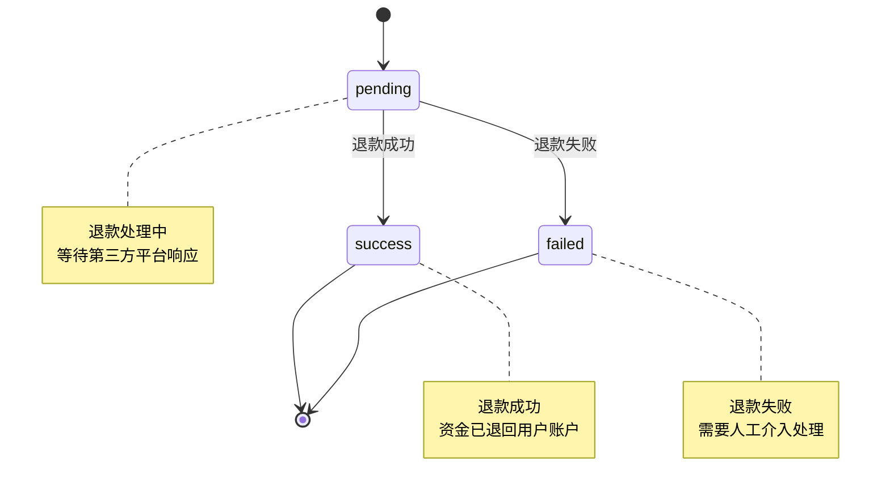
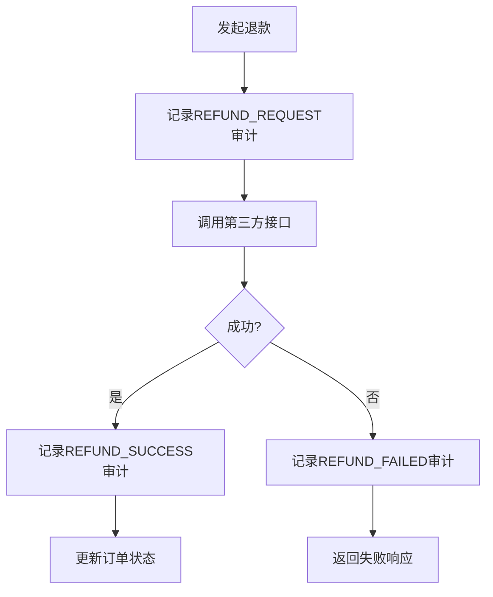

# 退款机制

<cite>
**本文档引用的文件**
- [RefundRequest.java](file://backend/src/main/java/com/carwash/dto/RefundRequest.java)
- [RefundResponse.java](file://backend/src/main/java/com/carwash/dto/RefundResponse.java)
- [Refund.java](file://backend/src/main/java/com/carwash/entity/Refund.java)
- [PaymentServiceImpl.java](file://backend/src/main/java/com/carwash/service/impl/PaymentServiceImpl.java)
- [PaymentController.java](file://backend/src/main/java/com/carwash/controller/PaymentController.java)
- [RefundMapper.java](file://backend/src/main/java/com/carwash/mapper/RefundMapper.java)
- [RefundMapper.xml](file://backend/src/main/resources/mapper/RefundMapper.xml)
- [payment_refund_tables.sql](file://backend/src/main/resources/sql/payment_refund_tables.sql)
</cite>

## 目录
1. [核心实体类设计](#核心实体类设计)
2. [退款处理流程](#退款处理流程)
3. [全额与部分退款处理](#全额与部分退款处理)
4. [退款失败处理与重试机制](#退款失败处理与重试机制)
5. [退款时序图](#退款时序图)
6. [退款状态转换图](#退款状态转换图)
7. [退款审计日志](#退款审计日志)

## 核心实体类设计

### RefundRequest 设计
`RefundRequest` 类用于封装退款请求参数，包含以下核心字段：

- **paymentNo**: 支付流水号，标识需要退款的支付记录，不能为空
- **amount**: 退款金额，必须大于0，用于指定退款数额
- **reason**: 退款原因，描述退款的具体理由，不能为空
- **operatorId**: 操作员ID，记录发起退款操作的用户ID

该类通过注解实现参数验证，确保请求数据的完整性和有效性。

**Section sources**
- [RefundRequest.java](file://backend/src/main/java/com/carwash/dto/RefundRequest.java#L1-L73)

### RefundResponse 设计
`RefundResponse` 类用于封装退款响应结果，包含以下核心字段：

- **success**: 布尔值，表示退款操作是否成功
- **refundNo**: 退款单号，系统生成的唯一退款标识
- **status**: 退款状态，表示当前退款的处理状态
- **message**: 响应消息，提供操作结果的详细信息
- **errorCode**: 错误代码，当操作失败时提供具体的错误类型

**Section sources**
- [RefundResponse.java](file://backend/src/main/java/com/carwash/dto/RefundResponse.java#L1-L77)

### Refund 实体类设计
`Refund` 实体类对应数据库中的 `refunds` 表，包含以下核心字段：

- **paymentId**: 关联的支付记录ID，建立与支付记录的关联关系
- **refundNo**: 退款单号，系统生成的唯一标识
- **amount**: 退款金额，记录实际退款的金额
- **reason**: 退款原因，存储用户提供的退款理由
- **status**: 退款状态，支持 `pending`（退款中）、`success`（退款成功）、`failed`（退款失败）三种状态
- **refundedAt**: 退款时间，记录退款成功的时间戳
- **operatorId**: 操作员ID，记录发起退款的用户ID
- **rawData**: 退款平台返回的原始数据，用于记录第三方支付平台的响应信息

**Section sources**
- [Refund.java](file://backend/src/main/java/com/carwash/entity/Refund.java#L1-L154)

## 退款处理流程

### 支付记录验证
退款处理的第一步是验证支付记录的有效性。系统通过 `paymentMapper.selectByPaymentNo()` 方法根据支付流水号查询支付记录。验证包括：

1. 支付记录是否存在
2. 支付状态是否为"paid"（已支付），只有已支付的订单才能进行退款
3. 用户权限验证，确保操作用户有权对支付记录进行操作

### 可退款金额计算
系统通过 `refundMapper.sumRefundAmountByPaymentId()` 方法统计该支付记录已发生的成功退款总额。可退款金额计算公式为：

```
可退款金额 = 支付总金额 - 已成功退款金额
```

系统会验证请求的退款金额是否超过可退款金额，如果超过则抛出 `REFUND_AMOUNT_ERROR` 异常。

### 退款记录创建
在验证通过后，系统创建退款记录：
1. 生成唯一的退款单号，格式为 `REF` + 时间戳 + 随机字符串
2. 设置退款金额、原因、操作员等信息
3. 初始状态设置为 `pending`（退款中）
4. 通过 `refundMapper.insert()` 方法将退款记录插入数据库

### 第三方退款接口调用
系统通过 `callRefundApi()` 私有方法调用第三方退款接口：
1. 根据支付方式获取对应的支付网关实例
2. 构建 `RefundRequest` 请求对象
3. 调用网关的 `refund()` 方法发起退款请求
4. 根据返回的 `RefundResponse` 判断退款是否成功



**Diagram sources**
- [PaymentServiceImpl.java](file://backend/src/main/java/com/carwash/service/impl/PaymentServiceImpl.java#L233-L309)

**Section sources**
- [PaymentServiceImpl.java](file://backend/src/main/java/com/carwash/service/impl/PaymentServiceImpl.java#L233-L309)

## 全额与部分退款处理

### 全额退款处理
当退款金额等于支付总金额时，系统执行全额退款：
1. 退款成功后，除了更新退款记录状态外
2. 系统会查询关联的订单记录
3. 将订单的支付状态更新为 `refunded`（已退款）
4. 这种处理方式确保订单状态与支付状态保持一致

### 部分退款处理
当退款金额小于支付总金额时，系统执行部分退款：
1. 仅更新退款记录状态，不改变订单的支付状态
2. 订单支付状态保持为 `paid`（已支付）
3. 系统允许同一支付记录进行多次部分退款，直到可退款金额耗尽

这种设计支持灵活的退款策略，如分批退款、部分服务取消退款等业务场景。

**Section sources**
- [PaymentServiceImpl.java](file://backend/src/main/java/com/carwash/service/impl/PaymentServiceImpl.java#L281-L288)

## 退款失败处理与重试机制

### 退款失败处理
当第三方退款接口调用失败时，系统执行以下处理：
1. 将退款记录状态更新为 `failed`（退款失败）
2. 记录失败审计日志，便于后续排查问题
3. 更新支付监控器状态，标记为失败
4. 返回包含错误信息的响应给客户端

### 重试机制
系统目前未实现自动重试机制，但提供了以下支持：
1. 支付监控器 `paymentMonitor` 会记录失败事件，用于统计和监控
2. 审计日志完整记录了失败请求的上下文信息
3. 前端可以基于失败响应实现手动重试逻辑
4. 管理员可以通过审计日志识别失败的退款请求并手动处理

**Section sources**
- [PaymentServiceImpl.java](file://backend/src/main/java/com/carwash/service/impl/PaymentServiceImpl.java#L289-L295)

## 退款时序图



**Diagram sources**
- [PaymentController.java](file://backend/src/main/java/com/carwash/controller/PaymentController.java#L114-L127)
- [PaymentServiceImpl.java](file://backend/src/main/java/com/carwash/service/impl/PaymentServiceImpl.java#L233-L309)

## 退款状态转换图



**Diagram sources**
- [Refund.java](file://backend/src/main/java/com/carwash/entity/Refund.java#L54-L58)
- [PaymentServiceImpl.java](file://backend/src/main/java/com/carwash/service/impl/PaymentServiceImpl.java#L274-L276)

## 退款审计日志

### 审计事件类型
系统记录以下关键退款事件的审计日志：

- **REFUND_REQUEST**: 退款请求发起，记录退款开始处理
- **REFUND_SUCCESS**: 退款成功，记录退款完成
- **REFUND_FAILED**: 退款失败，记录失败原因
- **STATUS_CHANGE**: 状态变化，记录退款状态变更

### 审计记录内容
每条审计记录包含以下信息：
- 支付流水号和订单号
- 事件类型和状态
- 支付方式和金额
- 操作员ID
- 详细消息和原始数据
- 创建时间

### 审计实现
审计功能通过 `savePaymentAudit()` 私有方法实现，该方法在退款处理的关键节点被调用，确保所有重要操作都有迹可循。



**Diagram sources**
- [PaymentServiceImpl.java](file://backend/src/main/java/com/carwash/service/impl/PaymentServiceImpl.java#L267-L294)

**Section sources**
- [PaymentServiceImpl.java](file://backend/src/main/java/com/carwash/service/impl/PaymentServiceImpl.java#L456-L475)