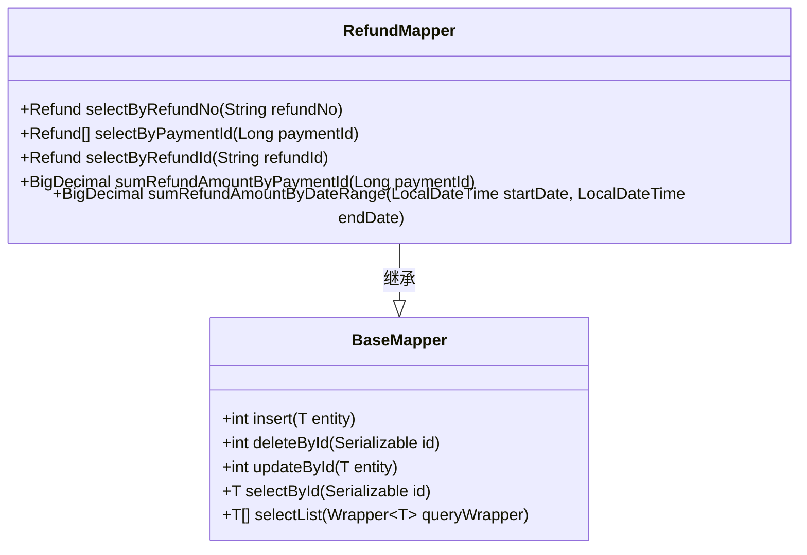
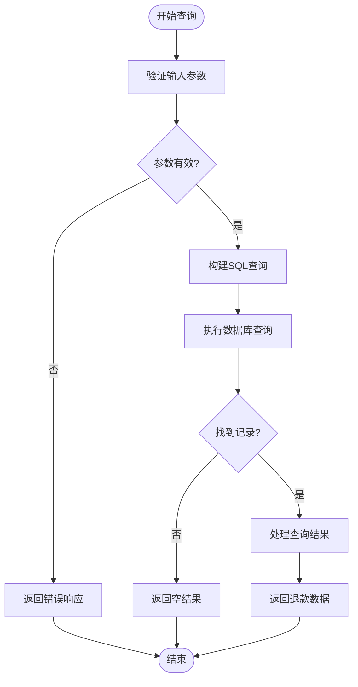
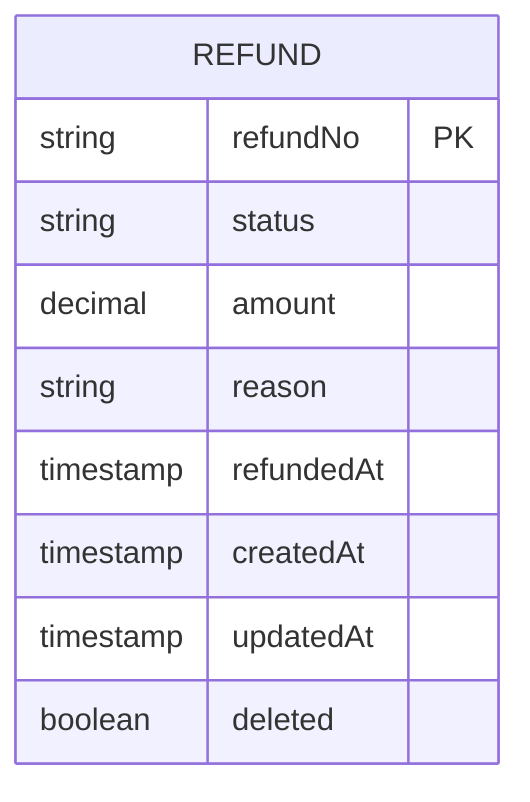

# 退款状态查询

<cite>
**本文档引用文件**   
- [PaymentController.java](file://backend/src/main/java/com/carwash/controller/PaymentController.java)
- [PaymentServiceImpl.java](file://backend/src/main/java/com/carwash/service/impl/PaymentServiceImpl.java)
- [RefundMapper.java](file://backend/src/main/java/com/carwash/mapper/RefundMapper.java)
- [RefundMapper.xml](file://backend/src/main/resources/mapper/RefundMapper.xml)
- [payment.js](file://frontend/src/api/payment.js)
- [payment_tables.sql](file://backend/src/main/resources/sql/payment_tables.sql)
- [Refund.java](file://backend/src/main/java/com/carwash/entity/Refund.java)
- [RefundResponse.java](file://backend/src/main/java/com/carwash/dto/RefundResponse.java)
</cite>

## 目录
1. [简介](#简介)
2. [前端接口调用方式](#前端接口调用方式)
3. [后端数据访问层实现](#后端数据访问层实现)
4. [SQL查询逻辑分析](#sql查询逻辑分析)
5. [权限控制机制](#权限控制机制)
6. [状态查询结果格式](#状态查询结果格式)
7. [使用场景与性能优化](#使用场景与性能优化)

## 简介
退款状态查询功能是汽车洗车服务预约系统支付模块的重要组成部分，允许用户通过退款单号查询特定退款记录的详细信息。该功能实现了从前端调用到后端数据访问的完整流程，确保用户能够准确获取其订单相关的退款状态。系统通过RefundMapper数据访问层和相应的SQL查询语句，从数据库中检索退款记录，并通过权限控制确保用户只能访问与其订单相关的退款信息。

## 前端接口调用方式
前端通过`getRefundStatus`接口调用实现退款状态查询功能。该接口位于`payment.js`文件中，使用axios发起GET请求到后端API。调用时需要提供退款单号作为路径参数，系统会返回包含退款金额、状态、原因和时间等关键信息的响应结果。前端代码通过封装的API方法简化了调用过程，开发者只需传入退款单号即可获取查询结果。

**Section sources**
- [payment.js](file://frontend/src/api/payment.js#L74-L76)

## 后端数据访问层实现
后端数据访问层通过RefundMapper接口实现退款记录的查询功能。RefundMapper继承自MyBatis Plus的BaseMapper，提供了对退款记录表的基本CRUD操作。核心查询方法`selectByRefundNo`用于根据退款单号精确查询退款记录。该方法通过@Param注解接收退款单号参数，并返回Refund实体对象。数据访问层与MyBatis的XML映射文件配合工作，将Java方法调用转换为具体的SQL查询语句。

**Diagram sources**
- [RefundMapper.java](file://backend/src/main/java/com/carwash/mapper/RefundMapper.java#L21-L43)

**Section sources**
- [RefundMapper.java](file://backend/src/main/java/com/carwash/mapper/RefundMapper.java#L18-L43)

## SQL查询逻辑分析
退款状态查询的SQL逻辑在RefundMapper.xml文件中定义。`selectByRefundNo`查询语句从refunds表中检索数据，使用参数化查询防止SQL注入攻击。查询条件包括refund_no等于指定退款单号且deleted字段为0（表示未删除的记录）。查询结果限制为单条记录（LIMIT 1），并包含所有基础列。SQL语句通过include标签复用Base_Column_List，确保列名的一致性。deleted字段的过滤实现了软删除功能，保证已删除的退款记录不会出现在查询结果中。

**Diagram sources**
- [RefundMapper.xml](file://backend/src/main/resources/mapper/RefundMapper.xml#L28-L34)

**Section sources**
- [RefundMapper.xml](file://backend/src/main/resources/mapper/RefundMapper.xml#L28-L34)

## 权限控制机制
系统通过多层次的权限控制确保用户只能查询自己订单相关的退款状态。首先，在数据库层面，退款记录与支付记录关联，而支付记录又与用户ID关联。其次，在服务层，当用户查询退款状态时，系统会验证当前登录用户是否有权访问该退款记录。虽然直接的退款状态查询接口可能不显式检查用户权限（因为退款单号本身具有一定的保密性），但系统通过限制用户只能获取与自己订单相关的退款单号来间接实现权限控制。此外，管理员拥有特殊权限，可以通过管理接口查询所有退款记录。

**Section sources**
- [PaymentServiceImpl.java](file://backend/src/main/java/com/carwash/service/impl/PaymentServiceImpl.java#L232-L239)

## 状态查询结果格式
退款状态查询结果包含多个关键信息字段。主要字段包括：退款单号（refundNo）、退款状态（status）、退款金额（amount）、退款原因（reason）、创建时间（createdAt）、更新时间（updatedAt）和退款时间（refundedAt）。退款状态有三种可能值：pending（退款中）、success（退款成功）和failed（退款失败）。结果以JSON格式返回，包含在统一的Result包装对象中，包含code、message和data字段。data字段包含具体的退款信息，前端可以根据状态值显示相应的用户界面。

**Diagram sources**
- [Refund.java](file://backend/src/main/java/com/carwash/entity/Refund.java#L72-L154)
- [payment_tables.sql](file://backend/src/main/resources/sql/payment_tables.sql#L32-L56)

**Section sources**
- [Refund.java](file://backend/src/main/java/com/carwash/entity/Refund.java#L72-L154)
- [RefundResponse.java](file://backend/src/main/java/com/carwash/dto/RefundResponse.java#L1-L77)

## 使用场景与性能优化
退款状态查询功能主要用于用户在申请退款后跟踪退款进度，以及客服人员处理用户咨询时核实退款情况。典型使用场景包括：用户在支付记录页面点击"查看退款状态"、客服系统中查询特定订单的退款详情等。为优化查询性能，数据库在refund_no字段上建立了唯一索引（idx_refund_no），确保基于退款单号的查询具有O(1)的时间复杂度。此外，建议在高并发场景下结合Redis缓存频繁查询的退款状态，减少数据库压力。对于历史数据查询，可以考虑建立基于创建时间的复合索引以支持范围查询。

**Section sources**
- [payment_tables.sql](file://backend/src/main/resources/sql/payment_tables.sql#L49)
- [RefundMapper.java](file://backend/src/main/java/com/carwash/mapper/RefundMapper.java#L21)