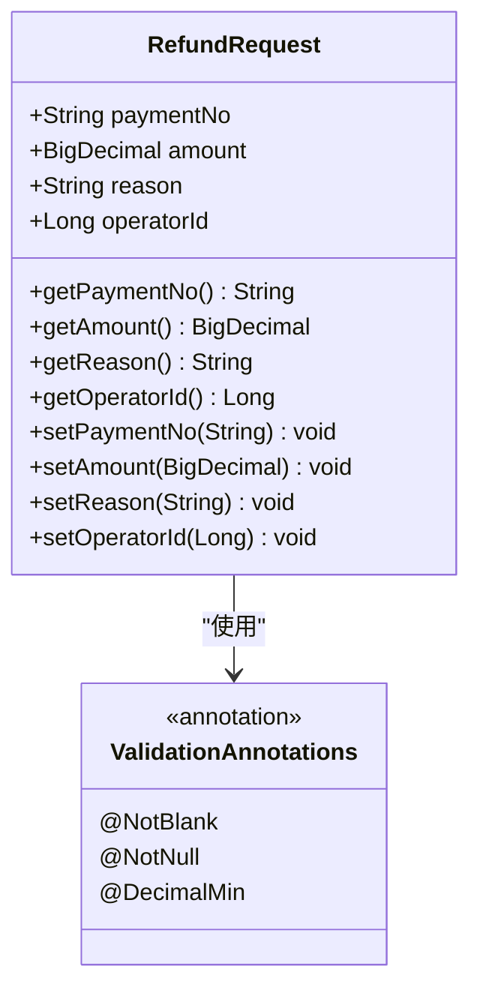
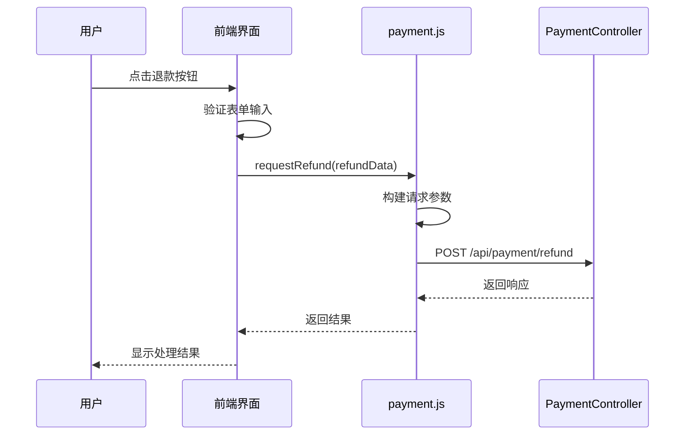
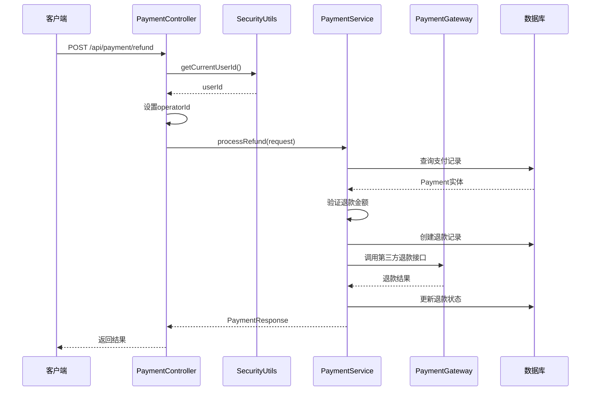
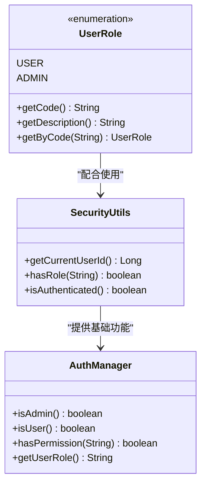
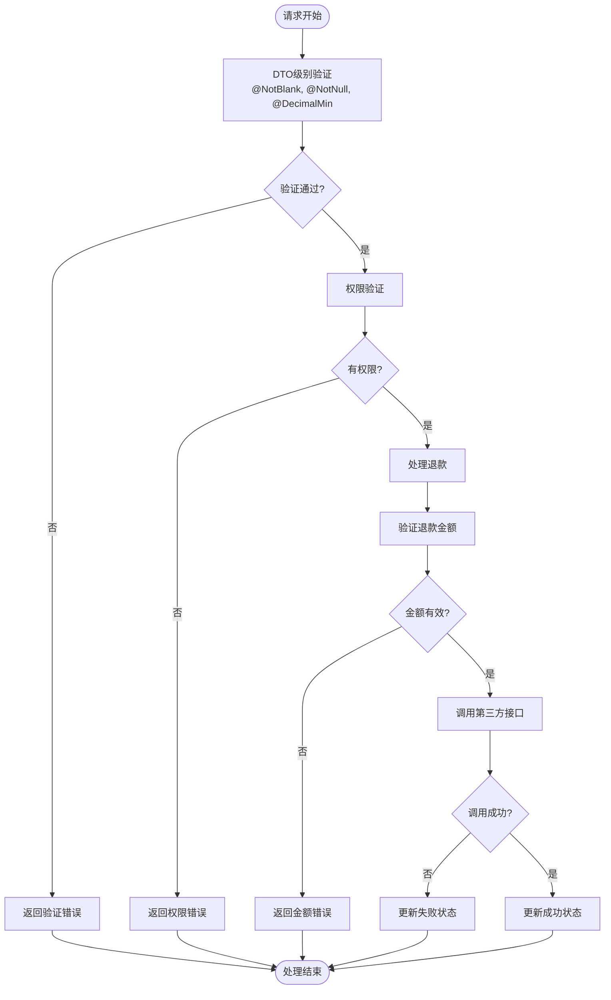
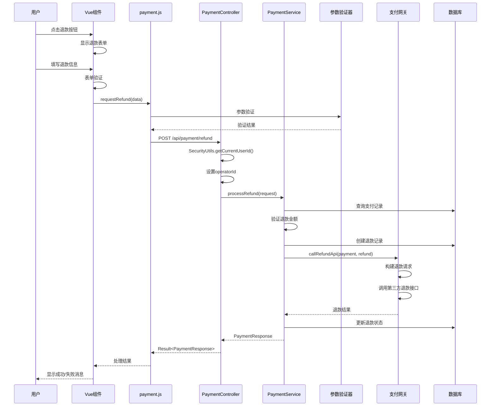
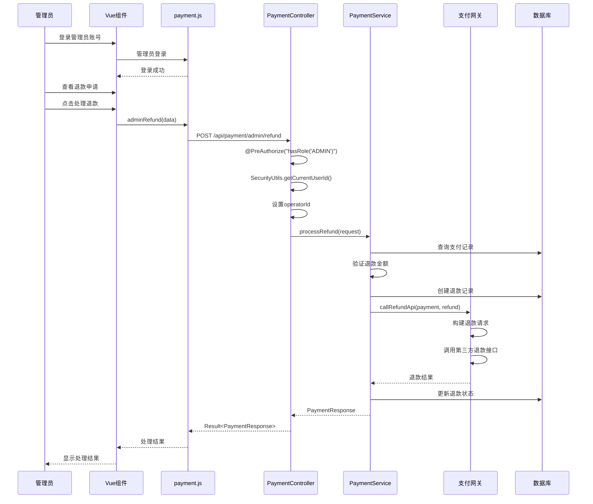
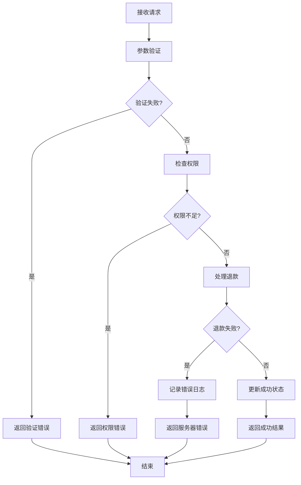

# 退款申请实现流程

<cite>
**本文档引用的文件**
- [RefundRequest.java](file://backend/src/main/java/com/carwash/dto/RefundRequest.java)
- [PaymentController.java](file://backend/src/main/java/com/carwash/controller/PaymentController.java)
- [PaymentService.java](file://backend/src/main/java/com/carwash/service/PaymentService.java)
- [PaymentServiceImpl.java](file://backend/src/main/java/com/carwash/service/impl/PaymentServiceImpl.java)
- [Refund.java](file://backend/src/main/java/com/carwash/entity/Refund.java)
- [SecurityUtils.java](file://backend/src/main/java/com/carwash/utils/SecurityUtils.java)
- [UserRole.java](file://backend/src/main/java/com/carwash/common/enums/UserRole.java)
- [payment.js](file://frontend/src/api/payment.js)
- [PaymentRecords.vue](file://frontend/src/views/PaymentRecords.vue)
- [auth.js](file://frontend/src/utils/auth.js)
</cite>

## 目录
1. [概述](#概述)
2. [RefundRequest DTO设计](#refundrequest-dto设计)
3. [前端退款申请流程](#前端退款申请流程)
4. [后端处理机制](#后端处理机制)
5. [权限验证机制](#权限验证机制)
6. [请求参数校验](#请求参数校验)
7. [完整时序图](#完整时序图)
8. [错误处理与异常](#错误处理与异常)
9. [总结](#总结)

## 概述

退款申请是汽车洗车服务预约系统中的重要功能，允许用户在符合条件的情况下申请退还部分或全部已支付的费用。系统采用前后端分离架构，通过RESTful API实现退款申请的完整流程，包括前端界面交互、后端业务逻辑处理、权限验证和第三方支付平台集成。

## RefundRequest DTO设计

### 字段定义与验证规则

RefundRequest DTO作为退款申请的数据传输对象，包含了完整的退款信息结构：



**图表来源**
- [RefundRequest.java](file://backend/src/main/java/com/carwash/dto/RefundRequest.java#L15-L73)

### 字段详细说明

| 字段名 | 类型 | 验证规则 | 业务含义 |
|--------|------|----------|----------|
| paymentNo | String | @NotBlank | 支付流水号，唯一标识支付记录 |
| amount | BigDecimal | @NotNull, @DecimalMin("0.01") | 退款金额，必须大于0 |
| reason | String | @NotBlank | 退款原因，用户填写的退款说明 |
| operatorId | Long | - | 操作员ID，由系统自动设置 |

**节来源**
- [RefundRequest.java](file://backend/src/main/java/com/carwash/dto/RefundRequest.java#L16-L38)

### 验证规则详解

1. **paymentNo字段验证**
   - 必填检查：使用`@NotBlank`注解确保支付流水号不为空
   - 业务意义：支付流水号是退款申请的关键标识，必须明确指定要退款的支付记录

2. **amount字段验证**
   - 非空检查：使用`@NotNull`确保金额字段不为空
   - 正数验证：使用`@DecimalMin("0.01")`确保金额大于0
   - 业务意义：防止负数退款和零金额退款，保证业务合理性

3. **reason字段验证**
   - 必填检查：使用`@NotBlank`确保退款原因不为空
   - 业务意义：退款原因有助于后续审核和系统审计

## 前端退款申请流程

### 前端API调用

前端通过`payment.js`中的`requestRefund`方法提交退款申请：



**图表来源**
- [payment.js](file://frontend/src/api/payment.js#L65-L66)
- [PaymentRecords.vue](file://frontend/src/views/PaymentRecords.vue#L366-L385)

### 前端调用示例

前端实现退款申请的具体代码如下：

```javascript
// 提交退款申请
const submitRefund = async () => {
  try {
    const refundData = {
      paymentNo: selectedRecord.value.paymentNo,
      amount: parseFloat(refundForm.amount),
      reason: refundForm.reason,
    };
    
    const response = await paymentApi.requestRefund(refundData);
    if (response.code === 200) {
      ElMessage.success("退款申请已提交，请等待审核");
      closeRefundModal();
      loadPaymentRecords();
    } else {
      ElMessage.error(response.message || "提交退款申请失败");
    }
  } catch (error) {
    console.error("提交退款申请失败:", error);
    ElMessage.error("提交退款申请失败");
  }
};
```

**节来源**
- [PaymentRecords.vue](file://frontend/src/views/PaymentRecords.vue#L366-L385)

## 后端处理机制

### PaymentController处理流程

后端通过PaymentController的`processRefund`方法处理退款申请：



**图表来源**
- [PaymentController.java](file://backend/src/main/java/com/carwash/controller/PaymentController.java#L116-L122)
- [PaymentServiceImpl.java](file://backend/src/main/java/com/carwash/service/impl/PaymentServiceImpl.java#L256-L298)

### 核心处理逻辑

后端处理退款申请的核心步骤包括：

1. **用户身份验证**：通过`SecurityUtils.getCurrentUserId()`获取当前登录用户ID
2. **参数设置**：将用户ID设置为操作员ID
3. **业务验证**：检查支付记录是否存在、金额是否合理
4. **状态管理**：创建待处理的退款记录
5. **第三方集成**：调用支付网关执行实际退款操作
6. **结果更新**：根据第三方返回结果更新退款状态

**节来源**
- [PaymentController.java](file://backend/src/main/java/com/carwash/controller/PaymentController.java#L116-L122)
- [PaymentServiceImpl.java](file://backend/src/main/java/com/carwash/service/impl/PaymentServiceImpl.java#L256-L298)

## 权限验证机制

### 角色权限体系

系统采用基于角色的访问控制（RBAC）模型，支持两种用户角色：



**图表来源**
- [UserRole.java](file://backend/src/main/java/com/carwash/common/enums/UserRole.java#L9-L41)
- [SecurityUtils.java](file://backend/src/main/java/com/carwash/utils/SecurityUtils.java#L83-L106)
- [auth.js](file://frontend/src/utils/auth.js#L40-L54)

### 权限验证规则

1. **普通用户权限**
   - 可以发起退款申请
   - 只能对本人的支付记录发起退款
   - 不能访问管理员专用接口

2. **管理员权限**
   - 可以发起退款申请
   - 可以处理所有用户的退款申请
   - 可以访问管理员专用接口

### 后端权限控制

后端通过`@PreAuthorize("hasRole('ADMIN')")`注解实现权限控制：

```java
@PostMapping("/admin/refund")
@PreAuthorize("hasRole('ADMIN')")
public Result<PaymentResponse> adminRefund(@Valid @RequestBody RefundRequest request) {
    // 管理员退款逻辑
}
```

**节来源**
- [PaymentController.java](file://backend/src/main/java/com/carwash/controller/PaymentController.java#L187-L199)

## 请求参数校验

### 参数验证流程

系统采用多层次的参数验证机制：



**图表来源**
- [PaymentServiceImpl.java](file://backend/src/main/java/com/carwash/service/impl/PaymentServiceImpl.java#L250-L255)

### 具体验证规则

1. **支付流水号验证**
   - 非空检查：确保支付流水号存在
   - 存在性检查：验证支付记录确实存在

2. **退款金额验证**
   - 正数验证：确保退款金额大于0
   - 余额检查：验证退款金额不超过可用余额
   - 最大值限制：防止超额退款

3. **退款原因验证**
   - 非空检查：确保用户填写了退款原因
   - 长度检查：防止过长的退款说明

**节来源**
- [PaymentServiceImpl.java](file://backend/src/main/java/com/carwash/service/impl/PaymentServiceImpl.java#L250-L255)

## 完整时序图

### 用户发起退款流程



**图表来源**
- [PaymentRecords.vue](file://frontend/src/views/PaymentRecords.vue#L366-L385)
- [payment.js](file://frontend/src/api/payment.js#L65-L66)
- [PaymentController.java](file://backend/src/main/java/com/carwash/controller/PaymentController.java#L116-L122)
- [PaymentServiceImpl.java](file://backend/src/main/java/com/carwash/service/impl/PaymentServiceImpl.java#L256-L298)

### 管理员处理退款流程



**图表来源**
- [PaymentController.java](file://backend/src/main/java/com/carwash/controller/PaymentController.java#L187-L199)
- [auth.js](file://frontend/src/utils/auth.js#L40-L54)

## 错误处理与异常

### 异常类型与处理

系统定义了多种异常情况及其处理策略：

| 异常类型 | 错误码 | 处理方式 | 用户提示 |
|----------|--------|----------|----------|
| 支付记录不存在 | REFUND_PAYMENT_NOT_FOUND | 抛出业务异常 | 支付记录不存在 |
| 退款金额超限 | REFUND_AMOUNT_ERROR | 抛出业务异常 | 退款金额超过可退款金额 |
| 权限不足 | UNAUTHORIZED | 返回403错误 | 无权进行此操作 |
| 参数验证失败 | VALIDATION_ERROR | 返回400错误 | 参数验证失败 |

### 异常处理流程



**图表来源**
- [PaymentServiceImpl.java](file://backend/src/main/java/com/carwash/service/impl/PaymentServiceImpl.java#L250-L255)

## 总结

退款申请功能通过精心设计的架构实现了完整的业务流程，包括：

1. **数据传输对象设计**：RefundRequest DTO提供了完整的退款信息结构和严格的验证规则
2. **前后端分离架构**：前端通过API接口与后端交互，实现了良好的用户体验
3. **权限控制机制**：基于角色的访问控制确保了系统的安全性
4. **参数验证体系**：多层次的验证确保了数据的完整性和业务的正确性
5. **异常处理机制**：完善的错误处理确保了系统的稳定性和用户体验

该实现不仅满足了业务需求，还具备良好的可扩展性和可维护性，为后续的功能扩展奠定了坚实的基础。