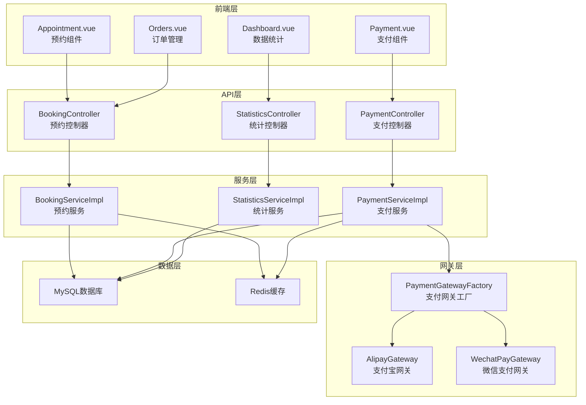
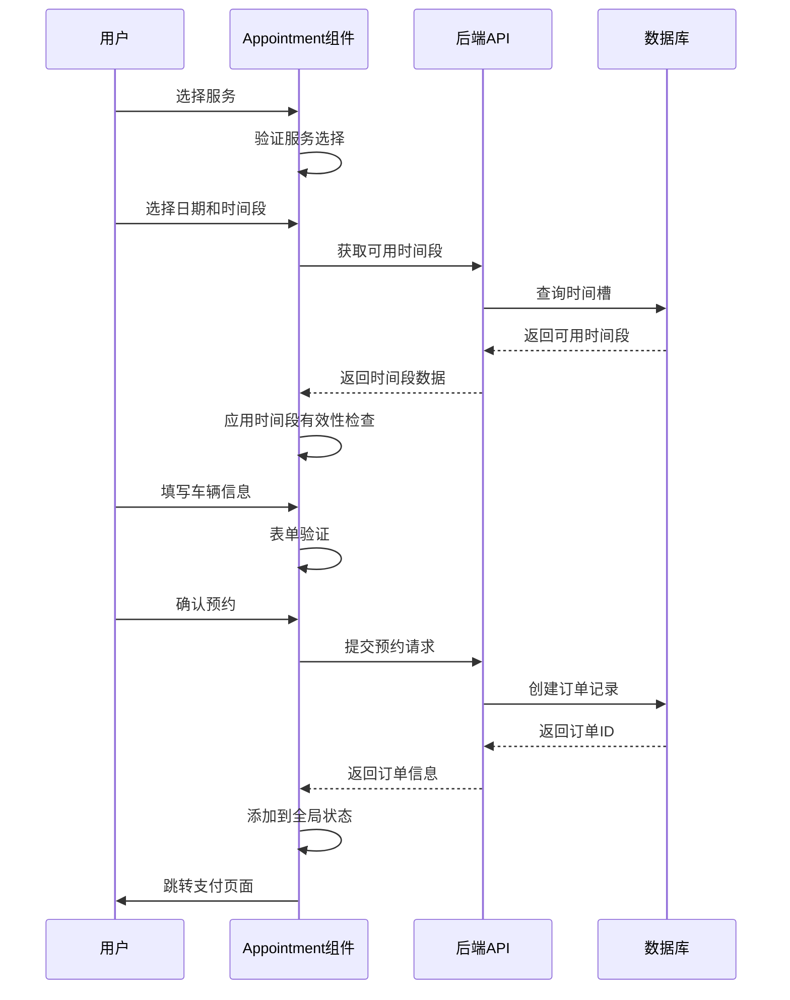
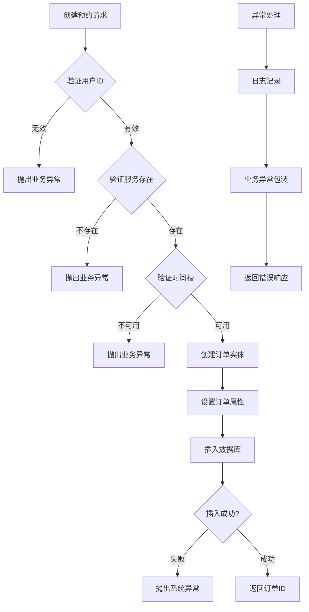
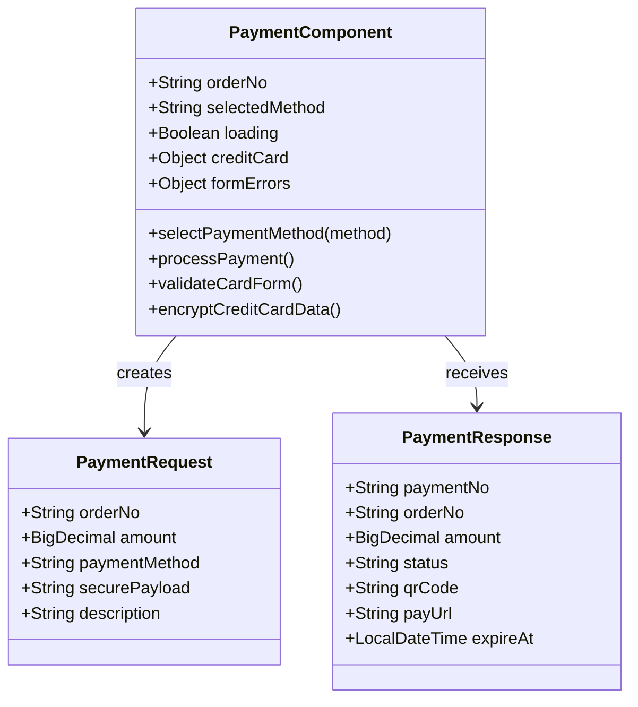
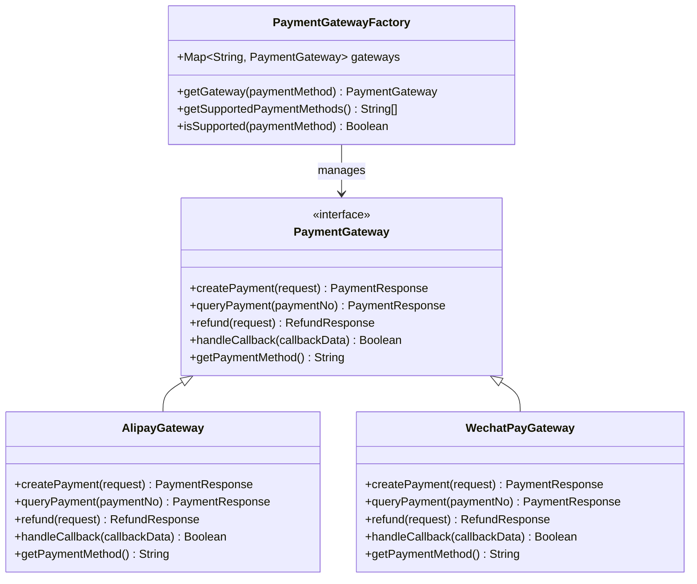
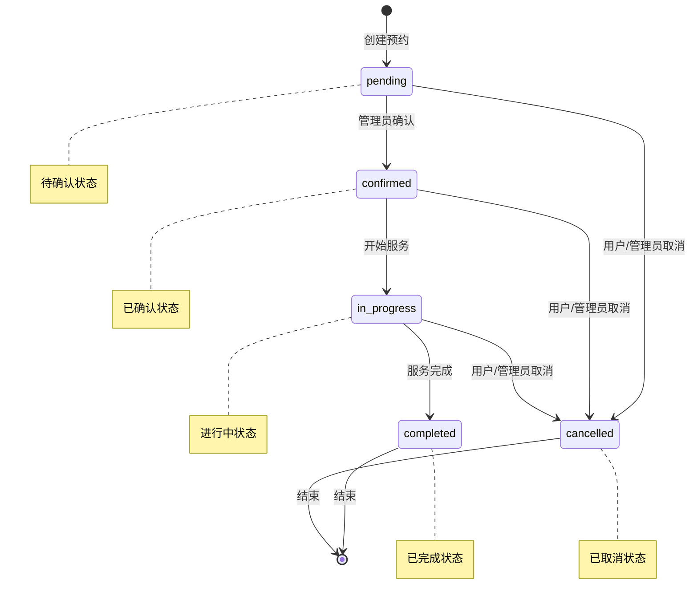
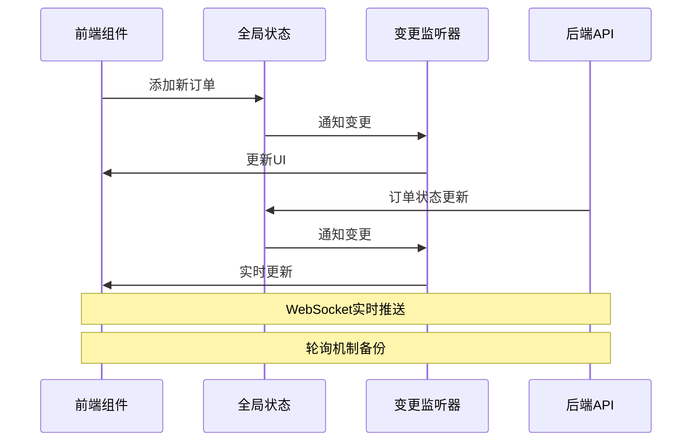
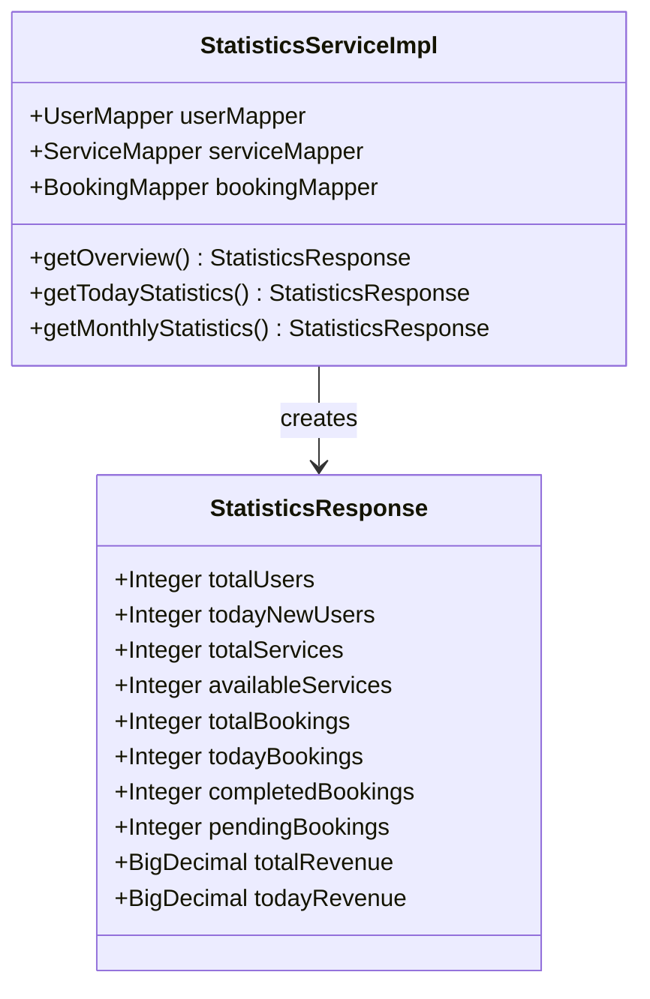
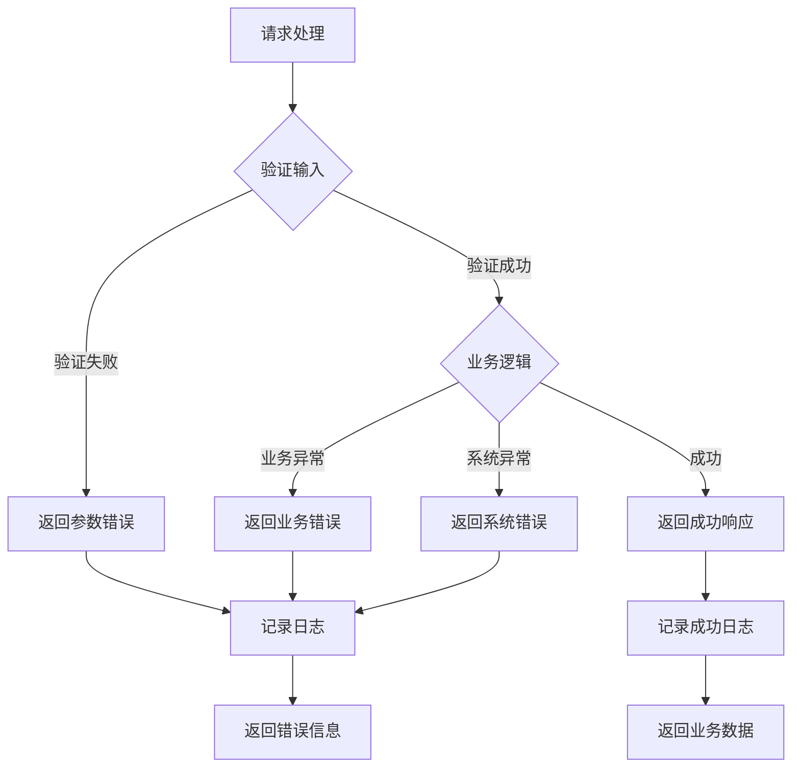
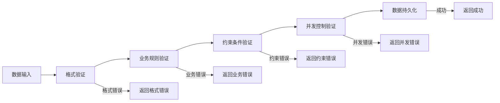

# 核心功能实现

<cite>
**本文档引用的文件**
- [Appointment.vue](file://frontend/src/views/Appointment.vue)
- [BookingServiceImpl.java](file://backend/src/main/java/com/carwash/service/impl/BookingServiceImpl.java)
- [Payment.vue](file://frontend/src/views/Payment.vue)
- [PaymentServiceImpl.java](file://backend/src/main/java/com/carwash/service/impl/PaymentServiceImpl.java)
- [BookingController.java](file://backend/src/main/java/com/carwash/controller/BookingController.java)
- [PaymentGatewayFactory.java](file://backend/src/main/java/com/carwash/service/payment/PaymentGatewayFactory.java)
- [AlipayGateway.java](file://backend/src/main/java/com/carwash/service/payment/AlipayGateway.java)
- [WechatPayGateway.java](file://backend/src/main/java/com/carwash/service/payment/WechatPayGateway.java)
- [Booking.java](file://backend/src/main/java/com/carwash/entity/Booking.java)
- [BookingRequest.java](file://backend/src/main/java/com/carwash/dto/BookingRequest.java)
- [PaymentRequest.java](file://backend/src/main/java/com/carwash/dto/PaymentRequest.java)
- [PaymentResponse.java](file://backend/src/main/java/com/carwash/dto/PaymentResponse.java)
- [StatisticsServiceImpl.java](file://backend/src/main/java/com/carwash/service/impl/StatisticsServiceImpl.java)
- [order.js](file://frontend/src/api/order.js)
- [orderSync.js](file://frontend/src/utils/orderSync.js)
</cite>

## 目录
1. [系统架构概述](#系统架构概述)
2. [预约功能实现机制](#预约功能实现机制)
3. [支付功能集成策略](#支付功能集成策略)
4. [服务管理与订单状态同步](#服务管理与订单状态同步)
5. [数据统计与监控](#数据统计与监控)
6. [前后端协作机制](#前后端协作机制)
7. [事务处理与数据一致性](#事务处理与数据一致性)
8. [总结](#总结)

## 系统架构概述

汽车洗车服务预约系统采用前后端分离架构，前端基于Vue 3构建用户界面，后端使用Spring Boot提供RESTful API服务。系统核心围绕预约、支付、订单管理和数据统计等关键功能模块展开。

**图表来源**
- [Appointment.vue](file://frontend/src/views/Appointment.vue#L1-L50)
- [Payment.vue](file://frontend/src/views/Payment.vue#L1-L50)
- [BookingController.java](file://backend/src/main/java/com/carwash/controller/BookingController.java#L1-L50)
- [PaymentServiceImpl.java](file://backend/src/main/java/com/carwash/service/impl/PaymentServiceImpl.java#L1-L50)

## 预约功能实现机制

### 前端Appointment组件交互逻辑

Appointment.vue组件实现了完整的预约流程，包含服务选择、时间选择、车辆信息填写和预约确认四个步骤。

**图表来源**
- [Appointment.vue](file://frontend/src/views/Appointment.vue#L666-L780)
- [BookingController.java](file://backend/src/main/java/com/carwash/controller/BookingController.java#L38-L62)

#### 核心功能特性

1. **多步骤向导式界面**：通过el-steps组件实现清晰的流程引导
2. **实时时间槽验证**：动态检查时间段可用性和时效性
3. **表单验证机制**：使用Element Plus表单组件进行实时验证
4. **智能状态管理**：通过Vue Composition API管理复杂状态流转

**章节来源**
- [Appointment.vue](file://frontend/src/views/Appointment.vue#L337-L800)

### 后端BookingServiceImpl事务处理

BookingServiceImpl负责预约订单的完整生命周期管理，采用Spring事务注解确保数据一致性。

**图表来源**
- [BookingServiceImpl.java](file://backend/src/main/java/com/carwash/service/impl/BookingServiceImpl.java#L77-L175)

#### 事务处理机制

1. **声明式事务管理**：使用@Transactional注解确保操作的原子性
2. **异常处理策略**：区分业务异常和系统异常，提供精确的错误信息
3. **数据完整性保障**：通过数据库约束和业务逻辑双重验证
4. **审计日志记录**：每个关键操作都有详细的日志记录

**章节来源**
- [BookingServiceImpl.java](file://backend/src/main/java/com/carwash/service/impl/BookingServiceImpl.java#L77-L175)

## 支付功能集成策略

### 前端Payment组件支付表单构建

Payment.vue组件提供了灵活的支付方式选择和表单验证机制。

**图表来源**
- [Payment.vue](file://frontend/src/views/Payment.vue#L352-L400)
- [PaymentRequest.java](file://backend/src/main/java/com/carwash/dto/PaymentRequest.java#L1-L50)
- [PaymentResponse.java](file://backend/src/main/java/com/carwash/dto/PaymentResponse.java#L1-L50)

#### 支付流程实现

1. **支付方式选择**：支持微信支付、支付宝、信用卡三种方式
2. **信用卡加密传输**：使用RSA-OAEP算法加密敏感信息
3. **支付状态监控**：实时轮询支付状态变化
4. **用户体验优化**：提供支付进度指示和错误处理

**章节来源**
- [Payment.vue](file://frontend/src/views/Payment.vue#L601-L720)

### 后端PaymentServiceImpl网关策略模式

PaymentServiceImpl采用策略模式集成多种支付网关，通过PaymentGatewayFactory实现动态路由。

**图表来源**
- [PaymentGatewayFactory.java](file://backend/src/main/java/com/carwash/service/payment/PaymentGatewayFactory.java#L1-L55)
- [AlipayGateway.java](file://backend/src/main/java/com/carwash/service/payment/AlipayGateway.java#L1-L50)
- [WechatPayGateway.java](file://backend/src/main/java/com/carwash/service/payment/WechatPayGateway.java#L1-L50)

#### 网关集成策略

1. **统一接口设计**：所有支付网关实现相同的PaymentGateway接口
2. **动态路由机制**：根据支付方式自动选择对应网关
3. **签名验证**：统一的安全验证机制确保支付回调的真实性
4. **异常处理**：标准化的异常处理和错误信息返回

**章节来源**
- [PaymentServiceImpl.java](file://backend/src/main/java/com/carwash/service/impl/PaymentServiceImpl.java#L398-L410)
- [AlipayGateway.java](file://backend/src/main/java/com/carwash/service/payment/AlipayGateway.java#L34-L81)
- [WechatPayGateway.java](file://backend/src/main/java/com/carwash/service/payment/WechatPayGateway.java#L33-L72)

## 服务管理与订单状态同步

### 订单状态流转机制

系统实现了严格的订单状态管理，确保业务流程的规范性和数据的一致性。

**图表来源**
- [BookingServiceImpl.java](file://backend/src/main/java/com/carwash/service/impl/BookingServiceImpl.java#L260-L358)

#### 状态转换验证

1. **合法性检查**：每个状态转换都经过严格验证
2. **事务一致性**：状态更新与相关数据同步进行
3. **通知机制**：状态变更时自动推送通知给相关方
4. **审计追踪**：所有状态变更都有详细记录

**章节来源**
- [BookingServiceImpl.java](file://backend/src/main/java/com/carwash/service/impl/BookingServiceImpl.java#L392-L410)

### 前后端数据同步机制

系统实现了完善的订单数据同步机制，确保前端界面与后端数据的一致性。

**图表来源**
- [orderSync.js](file://frontend/src/utils/orderSync.js#L185-L205)
- [order.js](file://frontend/src/api/order.js#L111-L168)

#### 同步策略实现

1. **全局状态管理**：使用Vue响应式系统维护统一的数据源
2. **变更监听机制**：自动通知所有订阅组件数据变更
3. **并发控制**：确保多个请求不会产生冲突
4. **缓存策略**：智能缓存减少不必要的API调用

**章节来源**
- [orderSync.js](file://frontend/src/utils/orderSync.js#L25-L163)

## 数据统计与监控

### 统计服务架构

StatisticsServiceImpl提供了全面的数据统计功能，支持实时监控和历史数据分析。

**图表来源**
- [StatisticsServiceImpl.java](file://backend/src/main/java/com/carwash/service/impl/StatisticsServiceImpl.java#L1-L50)

#### 统计指标体系

1. **用户维度**：注册用户数、新增用户趋势
2. **服务维度**：服务总数、可用服务统计
3. **订单维度**：订单总量、状态分布、收入统计
4. **时间维度**：今日统计、月度统计、趋势分析

**章节来源**
- [StatisticsServiceImpl.java](file://backend/src/main/java/com/carwash/service/impl/StatisticsServiceImpl.java#L37-L94)

## 前后端协作机制

### API设计原则

系统遵循RESTful API设计原则，提供清晰、一致的接口规范。

| 功能模块 | HTTP方法 | 端点路径 | 描述 |
|---------|---------|---------|------|
| 创建预约 | POST | `/api/bookings` | 创建新的预约订单 |
| 获取订单 | GET | `/api/bookings/{id}` | 根据ID获取订单详情 |
| 更新状态 | PUT | `/api/bookings/{id}/status` | 更新订单状态 |
| 取消订单 | PUT | `/api/bookings/{id}/cancel` | 取消订单 |
| 创建支付 | POST | `/api/payments` | 创建支付订单 |
| 查询支付 | GET | `/api/payments/status/{no}` | 查询支付状态 |
| 处理回调 | POST | `/api/payments/callback/{method}` | 处理支付回调 |

### 错误处理机制

系统实现了统一的错误处理机制，确保用户体验和系统稳定性。

**章节来源**
- [BookingController.java](file://backend/src/main/java/com/carwash/controller/BookingController.java#L38-L62)
- [PaymentServiceImpl.java](file://backend/src/main/java/com/carwash/service/impl/PaymentServiceImpl.java#L75-L146)

## 事务处理与数据一致性

### 分布式事务管理

系统采用多种策略确保数据一致性：

1. **本地事务**：单表操作使用Spring事务管理
2. **补偿事务**：跨服务操作使用补偿机制
3. **最终一致性**：通过消息队列实现异步一致性
4. **幂等性保证**：防止重复操作导致的数据不一致

### 数据验证机制

**章节来源**
- [BookingServiceImpl.java](file://backend/src/main/java/com/carwash/service/impl/BookingServiceImpl.java#L82-L120)
- [PaymentServiceImpl.java](file://backend/src/main/java/com/carwash/service/impl/PaymentServiceImpl.java#L77-L104)

## 总结

汽车洗车服务预约系统通过精心设计的架构和实现机制，成功实现了以下核心功能：

### 技术亮点

1. **模块化设计**：清晰的分层架构和职责分离
2. **可扩展性**：策略模式和工厂模式支持新功能扩展
3. **数据一致性**：完善的事务处理和同步机制
4. **用户体验**：流畅的交互流程和实时状态更新

### 架构优势

1. **前后端分离**：提高开发效率和系统灵活性
2. **微服务友好**：清晰的接口定义便于未来拆分
3. **监控完善**：全面的日志记录和审计机制
4. **安全可靠**：多重验证和异常处理机制

该系统为汽车洗车行业提供了一个完整、可靠的预约和支付解决方案，具备良好的可维护性和扩展性，能够满足业务发展的需求。