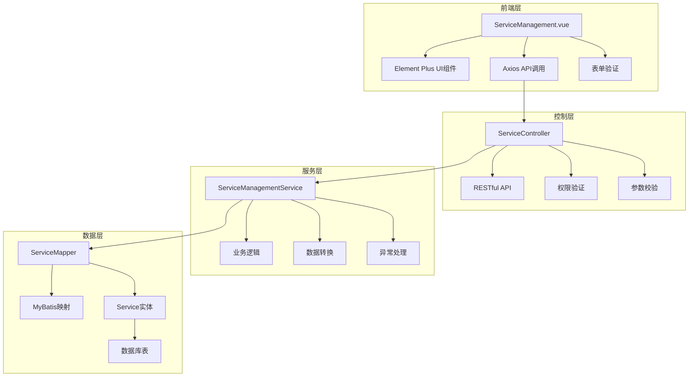
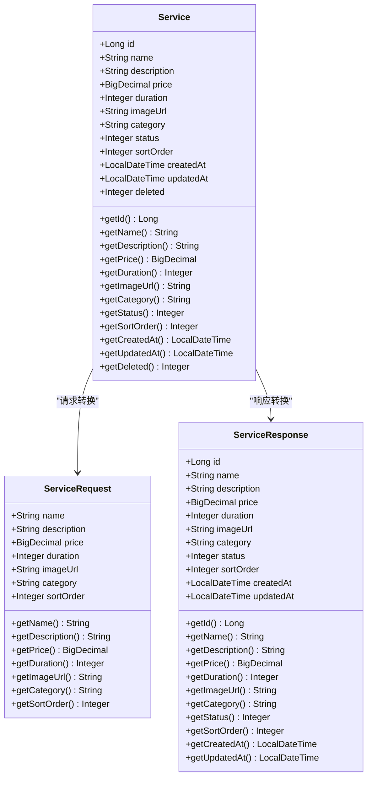
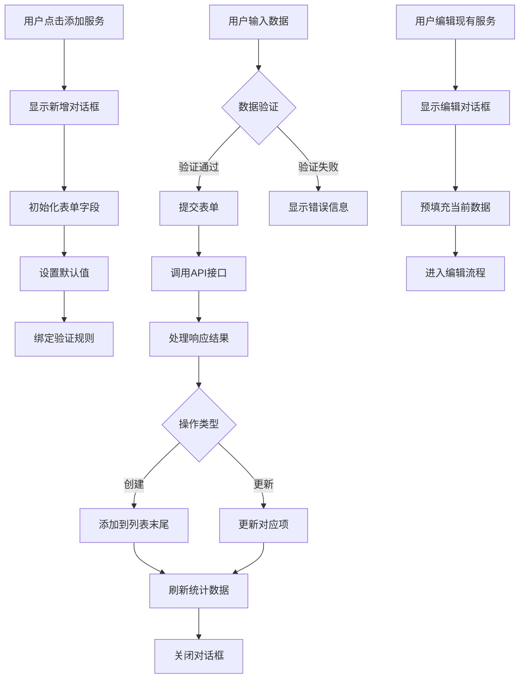
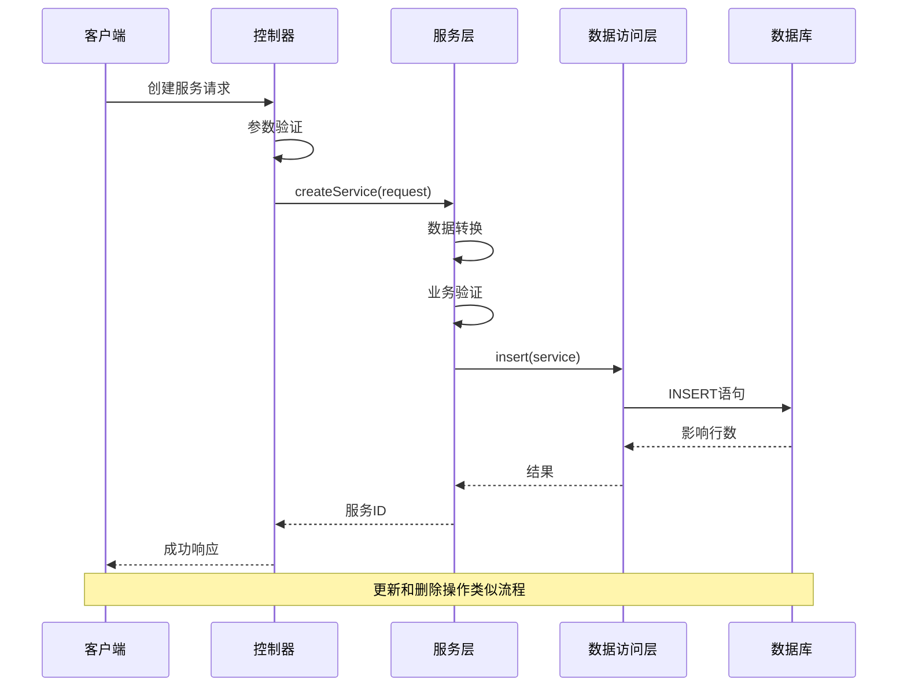
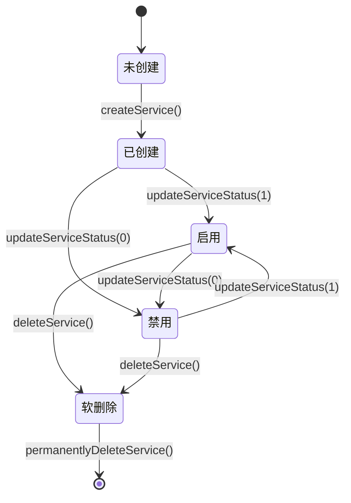
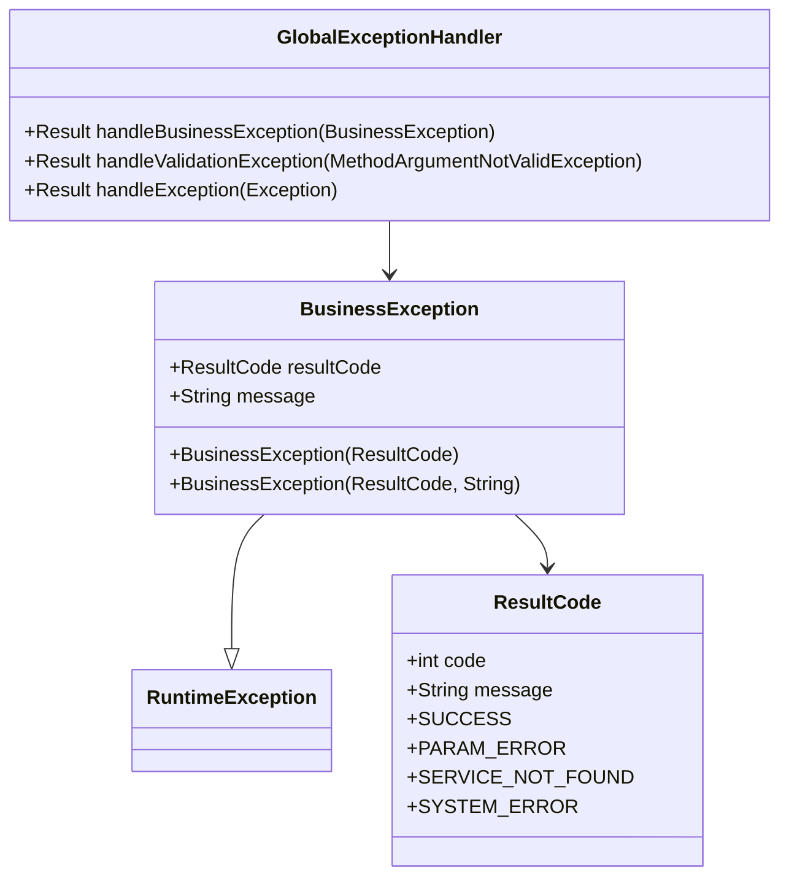
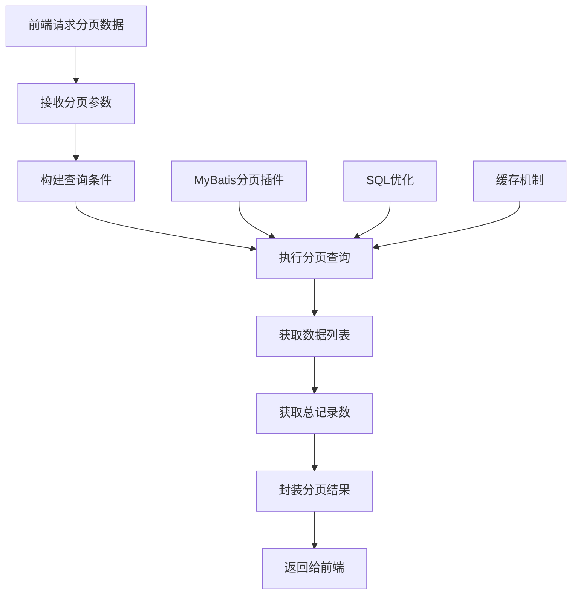
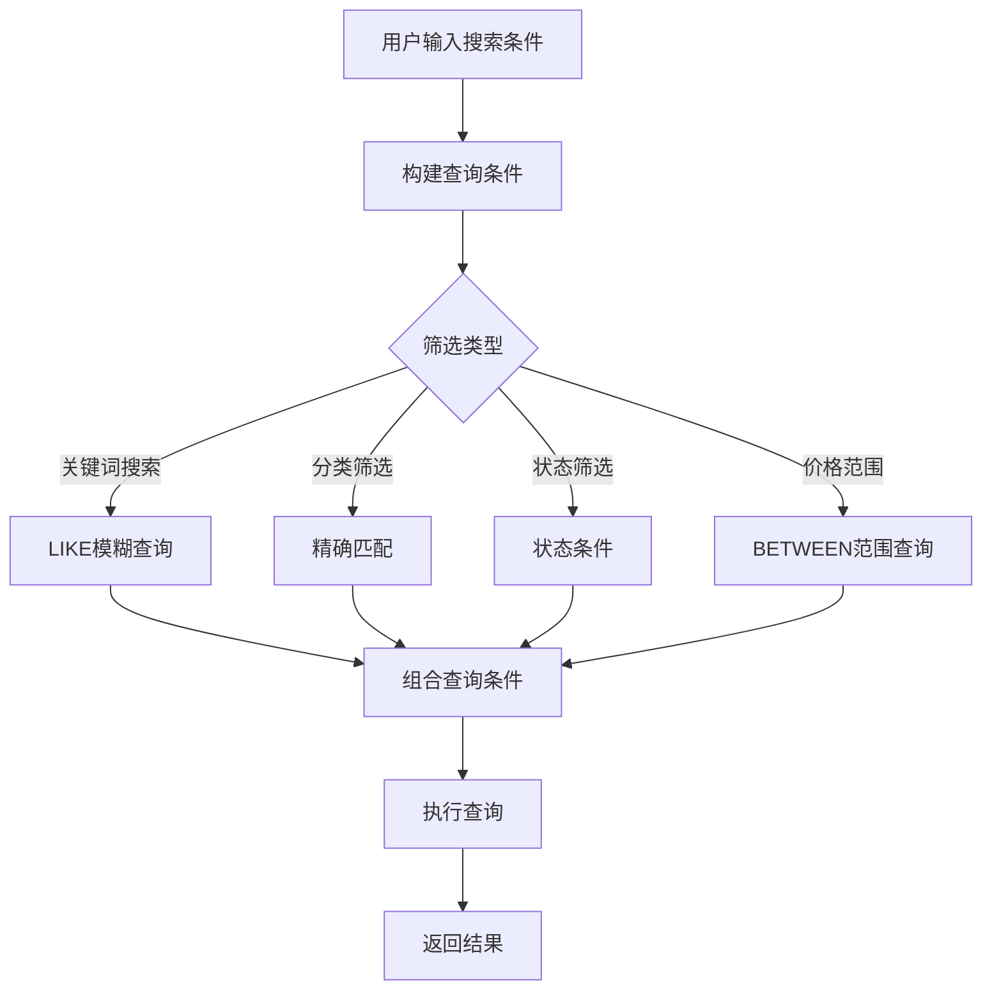

# 服务CRUD操作

<cite>
**本文档中引用的文件**
- [ServiceManagement.vue](file://frontend/src/views/admin/ServiceManagement.vue)
- [ServiceController.java](file://backend/src/main/java/com/carwash/controller/ServiceController.java)
- [ServiceManagementServiceImpl.java](file://backend/src/main/java/com/carwash/service/impl/ServiceManagementServiceImpl.java)
- [Service.java](file://backend/src/main/java/com/carwash/entity/Service.java)
- [ServiceRequest.java](file://backend/src/main/java/com/carwash/dto/ServiceRequest.java)
- [ServiceResponse.java](file://backend/src/main/java/com/carwash/dto/ServiceResponse.java)
- [ServiceMapper.java](file://backend/src/main/java/com/carwash/mapper/ServiceMapper.java)
- [service.js](file://frontend/src/api/service.js)
- [realApi.js](file://frontend/src/api/realApi.js)
</cite>

## 目录
1. [概述](#概述)
2. [系统架构](#系统架构)
3. [服务数据模型](#服务数据模型)
4. [前端CRUD实现](#前端crud实现)
5. [后端CRUD实现](#后端crud实现)
6. [数据验证机制](#数据验证机制)
7. [事务管理](#事务管理)
8. [异常处理](#异常处理)
9. [分页查询](#分页查询)
10. [搜索与筛选](#搜索与筛选)
11. [API接口设计](#api接口设计)
12. [性能优化](#性能优化)

## 概述

汽车洗车服务预约系统的服务CRUD操作模块提供了完整的服务管理功能，包括服务的创建、读取、更新和删除操作。该模块采用前后端分离架构，前端使用Vue.js框架，后端使用Spring Boot框架，实现了高效的服务管理功能。

### 核心功能特性

- **完整的CRUD操作**：支持服务的创建、读取、更新和删除
- **多维度查询**：支持按分类、价格范围、关键词等多种方式进行筛选
- **分页显示**：大数据量下的高效分页展示
- **实时搜索**：支持关键词实时搜索和结果高亮
- **状态管理**：服务状态的启用/禁用切换
- **数据验证**：前后端双重数据验证机制
- **事务保证**：数据库操作的事务性保障

## 系统架构

系统采用经典的三层架构模式，清晰分离关注点：



**图表来源**
- [ServiceManagement.vue](file://frontend/src/views/admin/ServiceManagement.vue#L1-L50)
- [ServiceController.java](file://backend/src/main/java/com/carwash/controller/ServiceController.java#L1-L50)
- [ServiceManagementServiceImpl.java](file://backend/src/main/java/com/carwash/service/impl/ServiceManagementServiceImpl.java#L1-L50)

## 服务数据模型

### 实体类结构

服务实体类包含了服务的所有核心属性，每个属性都有明确的业务含义和约束条件：



**图表来源**
- [Service.java](file://backend/src/main/java/com/carwash/entity/Service.java#L16-L92)
- [ServiceRequest.java](file://backend/src/main/java/com/carwash/dto/ServiceRequest.java#L17-L60)
- [ServiceResponse.java](file://backend/src/main/java/com/carwash/dto/ServiceResponse.java#L14-L70)

### 字段说明与约束

| 字段名 | 类型 | 约束条件 | 业务含义 |
|--------|------|----------|----------|
| id | Long | 主键，自增 | 服务唯一标识符 |
| name | String | 非空，最大长度255 | 服务名称，用于用户识别 |
| description | String | 可空，最大长度1000 | 服务详细描述，支持HTML格式 |
| price | BigDecimal | 非空，最小值0.01 | 服务价格，精确到分 |
| duration | Integer | 非空，最小值15 | 服务时长，单位为分钟 |
| imageUrl | String | 可空，最大长度500 | 服务图片URL地址 |
| category | String | 非空，枚举值 | 服务分类，如basic, premium等 |
| status | Integer | 非空，默认1 | 服务状态：0-下架，1-上架 |
| sortOrder | Integer | 可空，默认0 | 排序权重，数值越大越靠前 |
| createdAt | LocalDateTime | 自动填充 | 服务创建时间 |
| updatedAt | LocalDateTime | 自动更新 | 服务最后更新时间 |
| deleted | Integer | 逻辑删除，默认0 | 逻辑删除标记：0-未删除，1-已删除 |

**节来源**
- [Service.java](file://backend/src/main/java/com/carwash/entity/Service.java#L20-L92)

## 前端CRUD实现

### 表单设计与验证

前端使用Element Plus组件库构建了完整的服务管理界面，支持多种视图模式和丰富的交互功能：



**图表来源**
- [ServiceManagement.vue](file://frontend/src/views/admin/ServiceManagement.vue#L626-L666)

### 关键功能实现

#### 1. 服务创建功能

服务创建功能通过统一的表单界面实现，支持以下特性：
- **字段验证**：使用Element Plus的表单验证机制
- **分类选择**：预定义的服务分类选项
- **价格输入**：支持小数点后两位的精确输入
- **时长设置**：以15分钟为步长的整数输入
- **富文本编辑**：支持服务描述的富文本编辑

#### 2. 服务编辑功能

编辑功能继承了创建功能的大部分特性，并增加了：
- **数据预填充**：自动填充当前服务的所有信息
- **状态切换**：支持启用/禁用状态的即时切换
- **批量操作**：支持多选服务进行批量状态更新

#### 3. 服务删除功能

删除功能实现了安全的软删除机制：
- **二次确认**：使用ElMessageBox进行二次确认
- **状态反馈**：操作成功或失败的状态提示
- **数据刷新**：删除后自动刷新服务列表

**节来源**
- [ServiceManagement.vue](file://frontend/src/views/admin/ServiceManagement.vue#L626-L700)

### 用户交互细节

前端实现了丰富的用户交互体验：

#### 视图切换
- **网格视图**：以卡片形式展示服务，适合快速浏览
- **列表视图**：以表格形式展示，适合详细管理和批量操作

#### 操作按钮
- **详情查看**：点击服务卡片或列表行可查看详细信息
- **编辑操作**：支持直接编辑服务信息
- **状态切换**：通过开关按钮快速更改服务状态
- **删除操作**：彻底删除服务项目

#### 数据统计
- **总服务数**：显示系统中所有服务的数量
- **启用数量**：显示当前可用的服务数量
- **分类统计**：按服务分类统计数量
- **平均价格**：计算所有服务的平均价格

## 后端CRUD实现

### 核心业务逻辑

后端服务管理实现了完整的CRUD操作，每个操作都经过严格的业务逻辑验证：



**图表来源**
- [ServiceController.java](file://backend/src/main/java/com/carwash/controller/ServiceController.java#L98-L113)
- [ServiceManagementServiceImpl.java](file://backend/src/main/java/com/carwash/service/impl/ServiceManagementServiceImpl.java#L38-L51)

### CRUD方法详解

#### 1. 创建服务 (createService)

创建服务方法实现了完整的业务逻辑：
- **数据转换**：将ServiceRequest转换为Service实体
- **默认设置**：设置服务为启用状态
- **数据库插入**：执行插入操作并返回服务ID
- **异常处理**：处理插入失败的情况

#### 2. 更新服务 (updateService)

更新服务方法确保数据的完整性和一致性：
- **存在性检查**：验证服务是否存在
- **数据复制**：使用BeanUtils复制属性
- **版本控制**：确保更新的是正确的记录
- **数据库更新**：执行更新操作并验证结果

#### 3. 删除服务 (deleteService)

删除服务实现了软删除机制：
- **存在性验证**：确认服务存在且未被删除
- **逻辑删除**：更新deleted字段而非物理删除
- **级联处理**：考虑与其他数据的关联关系

#### 4. 获取服务详情 (getServiceById)

获取服务详情提供了服务的完整信息：
- **数据查询**：从数据库获取服务记录
- **对象转换**：将实体转换为响应对象
- **异常处理**：处理服务不存在的情况

**节来源**
- [ServiceManagementServiceImpl.java](file://backend/src/main/java/com/carwash/service/impl/ServiceManagementServiceImpl.java#L38-L231)

### 服务状态管理

系统实现了灵活的服务状态管理机制：



**图表来源**
- [ServiceManagementServiceImpl.java](file://backend/src/main/java/com/carwash/service/impl/ServiceManagementServiceImpl.java#L158-L173)

## 数据验证机制

### 前端验证

前端实现了多层次的数据验证机制：

#### 表单验证规则
- **必填字段**：服务名称、分类、描述、价格、时长
- **格式验证**：价格必须为正数，时长必须大于0
- **范围验证**：价格最小值为0.01，时长最小值为15分钟
- **类型验证**：确保数据类型正确

#### 实时验证
- **输入时验证**：用户输入时实时验证
- **焦点离开验证**：失去焦点时再次验证
- **提交时验证**：表单提交前最终验证

### 后端验证

后端实现了严格的参数验证机制：

#### 注解驱动验证
- **@NotBlank**：确保字符串不为空
- **@NotNull**：确保对象不为null
- **@DecimalMin/@DecimalMax**：确保数值在指定范围内
- **@Min/@Max**：确保整数在指定范围内

#### 自定义验证
- **业务规则验证**：验证服务名称的唯一性
- **关联关系验证**：验证服务是否被其他数据引用
- **状态验证**：验证状态值的有效性

**节来源**
- [ServiceManagement.vue](file://frontend/src/views/admin/ServiceManagement.vue#L535-L546)
- [ServiceRequest.java](file://backend/src/main/java/com/carwash/dto/ServiceRequest.java#L23-L43)

## 事务管理

### 事务配置

后端使用Spring的声明式事务管理，确保数据的一致性：

#### 事务注解
- **@Transactional**：标注需要事务的方法
- **回滚策略**：默认对运行时异常回滚
- **传播行为**：使用默认的传播行为

#### 事务边界
- **方法级别**：每个CRUD方法都是独立的事务边界
- **异常处理**：捕获异常并抛出业务异常
- **嵌套事务**：支持方法间的事务嵌套

### 事务隔离

系统采用了适当的事务隔离级别：
- **读已提交**：避免脏读和不可重复读
- **乐观锁**：使用版本号防止并发修改冲突
- **悲观锁**：在必要时使用数据库锁

**节来源**
- [ServiceManagementServiceImpl.java](file://backend/src/main/java/com/carwash/service/impl/ServiceManagementServiceImpl.java#L37-L231)

## 异常处理

### 异常层次结构

系统实现了分层的异常处理机制：



**图表来源**
- [ServiceManagementServiceImpl.java](file://backend/src/main/java/com/carwash/service/impl/ServiceManagementServiceImpl.java#L58-L70)

### 异常处理策略

#### 业务异常
- **服务不存在**：当操作的服务不存在时抛出
- **参数错误**：当传入参数不符合要求时抛出
- **系统错误**：当数据库操作失败时抛出

#### 全局异常处理
- **统一响应格式**：所有异常都返回统一的响应格式
- **错误码映射**：将业务异常映射到标准错误码
- **日志记录**：记录异常的详细信息用于调试

**节来源**
- [ServiceManagementServiceImpl.java](file://backend/src/main/java/com/carwash/service/impl/ServiceManagementServiceImpl.java#L58-L70)

## 分页查询

### 分页实现机制

系统实现了高效的分页查询功能：



**图表来源**
- [ServiceController.java](file://backend/src/main/java/com/carwash/controller/ServiceController.java#L41-L47)
- [ServiceManagementServiceImpl.java](file://backend/src/main/java/com/carwash/service/impl/ServiceManagementServiceImpl.java#L106-L116)

### 分页参数

| 参数名 | 类型 | 默认值 | 说明 |
|--------|------|--------|------|
| current | Long | 1 | 当前页码 |
| size | Long | 10 | 每页记录数 |
| keyword | String | - | 搜索关键词 |
| category | String | - | 服务分类 |
| status | Integer | - | 服务状态 |
| minPrice | BigDecimal | - | 最低价格 |
| maxPrice | BigDecimal | - | 最高价格 |

### 性能优化

#### 查询优化
- **索引使用**：在常用查询字段上建立索引
- **SQL优化**：优化查询语句减少不必要的计算
- **分页算法**：使用LIMIT和OFFSET进行高效分页

#### 缓存策略
- **结果缓存**：缓存热门查询的结果
- **元数据缓存**：缓存分页元数据
- **过期策略**：设置合理的缓存过期时间

**节来源**
- [ServiceManagementServiceImpl.java](file://backend/src/main/java/com/carwash/service/impl/ServiceManagementServiceImpl.java#L106-L116)
- [ServiceMapper.java](file://backend/src/main/java/com/carwash/mapper/ServiceMapper.java#L26-L27)

## 搜索与筛选

### 搜索功能实现

系统提供了强大的搜索和筛选功能：



**图表来源**
- [ServiceMapper.java](file://backend/src/main/java/com/carwash/mapper/ServiceMapper.java#L44-L45)
- [ServiceManagementServiceImpl.java](file://backend/src/main/java/com/carwash/service/impl/ServiceManagementServiceImpl.java#L142-L149)

### 筛选条件

#### 基础筛选
- **服务名称**：支持模糊匹配服务名称
- **服务描述**：支持模糊匹配服务描述
- **服务分类**：按预定义分类进行筛选
- **服务状态**：按启用/禁用状态筛选

#### 高级筛选
- **价格范围**：支持设置最低和最高价格
- **服务时长**：支持设置最短和最长时长
- **创建时间**：支持按时间范围筛选
- **排序规则**：支持按价格、时长、创建时间排序

### 搜索优化

#### SQL优化
- **全文索引**：对服务名称和描述建立全文索引
- **复合索引**：对常用查询组合建立复合索引
- **查询重写**：优化复杂查询的执行计划

#### 前端优化
- **防抖处理**：输入时使用防抖减少查询频率
- **结果缓存**：缓存搜索结果避免重复查询
- **智能提示**：提供搜索建议和历史记录

**节来源**
- [ServiceManagement.vue](file://frontend/src/views/admin/ServiceManagement.vue#L24-L79)
- [ServiceMapper.java](file://backend/src/main/java/com/carwash/mapper/ServiceMapper.java#L44-L45)

## API接口设计

### RESTful接口规范

系统遵循RESTful设计原则，提供了标准化的API接口：

#### 接口规范

| HTTP方法 | URL路径 | 功能描述 | 权限要求 |
|----------|---------|----------|----------|
| GET | /api/services/list | 获取服务列表 | 公开 |
| GET | /api/services/{id} | 获取服务详情 | 公开 |
| GET | /api/services/category/{category} | 按分类获取服务 | 公开 |
| GET | /api/services/search | 搜索服务 | 公开 |
| GET | /api/services/categories | 获取服务分类 | 公开 |
| POST | /api/services | 创建服务 | ADMIN |
| PUT | /api/services/{id} | 更新服务 | ADMIN |
| DELETE | /api/services/{id} | 删除服务 | ADMIN |
| DELETE | /api/services/{id}/permanent | 永久删除服务 | ADMIN |
| GET | /api/services/admin/all | 获取所有服务 | ADMIN |
| PUT | /api/services/{id}/status | 更新服务状态 | ADMIN |

### 请求响应格式

#### 请求格式
- **Content-Type**：application/json
- **请求体**：JSON格式的服务数据
- **认证**：使用JWT令牌进行身份验证

#### 响应格式
```json
{
  "code": 200,
  "message": "操作成功",
  "data": {
    // 具体数据内容
  }
}
```

### 错误响应

系统提供了标准化的错误响应格式：
```json
{
  "code": 400,
  "message": "参数错误",
  "data": null
}
```

**节来源**
- [ServiceController.java](file://backend/src/main/java/com/carwash/controller/ServiceController.java#L39-L165)
- [realApi.js](file://frontend/src/api/realApi.js#L62-L121)

## 性能优化

### 前端性能优化

#### 渲染优化
- **虚拟滚动**：大数据量时使用虚拟滚动技术
- **懒加载**：图片和服务列表采用懒加载
- **组件缓存**：合理使用组件缓存机制

#### 网络优化
- **请求合并**：合并多个小请求减少网络开销
- **数据压缩**：启用Gzip压缩传输数据
- **CDN加速**：静态资源使用CDN加速

### 后端性能优化

#### 数据库优化
- **连接池**：使用数据库连接池提高并发能力
- **查询优化**：优化慢查询提升响应速度
- **索引策略**：建立合适的索引提高查询效率

#### 缓存策略
- **Redis缓存**：缓存热点数据减少数据库压力
- **本地缓存**：使用本地缓存减少网络通信
- **缓存更新**：实现缓存的及时更新机制

### 监控与调优

#### 性能监控
- **响应时间**：监控API的响应时间
- **吞吐量**：监控系统的处理能力
- **错误率**：监控系统的稳定性

#### 调优策略
- **资源配置**：根据负载调整服务器资源配置
- **算法优化**：优化关键算法的执行效率
- **架构优化**：根据实际需求调整系统架构

**节来源**
- [ServiceManagement.vue](file://frontend/src/views/admin/ServiceManagement.vue#L553-L575)

## 总结

汽车洗车服务预约系统的服务CRUD操作模块是一个功能完整、架构清晰的管理系统。通过前后端分离的设计，实现了高效的服务管理功能，包括：

1. **完整的CRUD操作**：支持服务的创建、读取、更新和删除
2. **灵活的查询机制**：支持多维度的搜索和筛选功能
3. **严格的数据验证**：前后端双重验证确保数据质量
4. **可靠的事务管理**：保证数据操作的一致性和完整性
5. **优秀的用户体验**：提供直观易用的管理界面
6. **良好的性能表现**：通过各种优化手段确保系统高效运行

该模块为汽车洗车服务预约系统提供了坚实的基础，能够满足日常运营的各种需求，同时具备良好的扩展性和维护性。