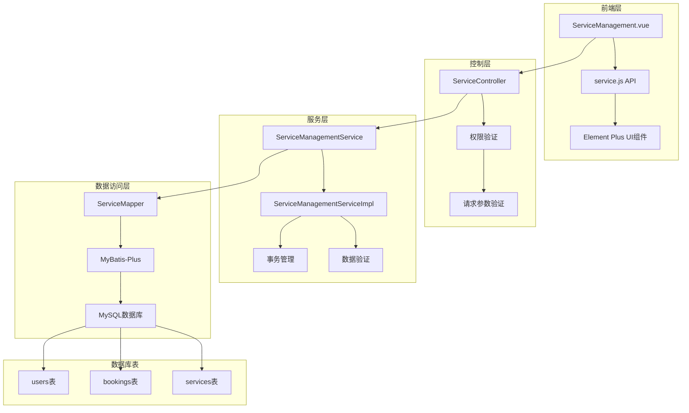
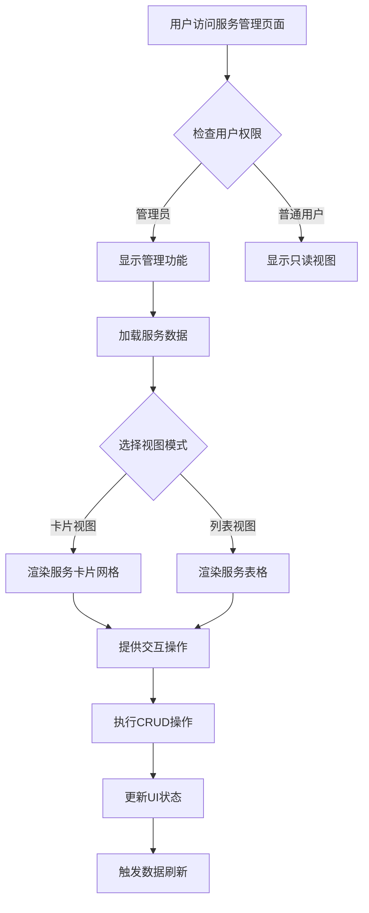
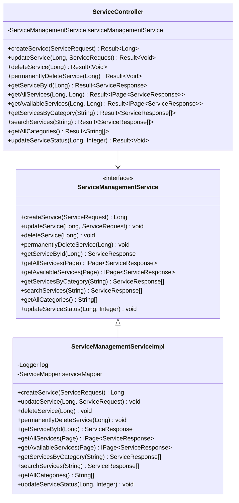
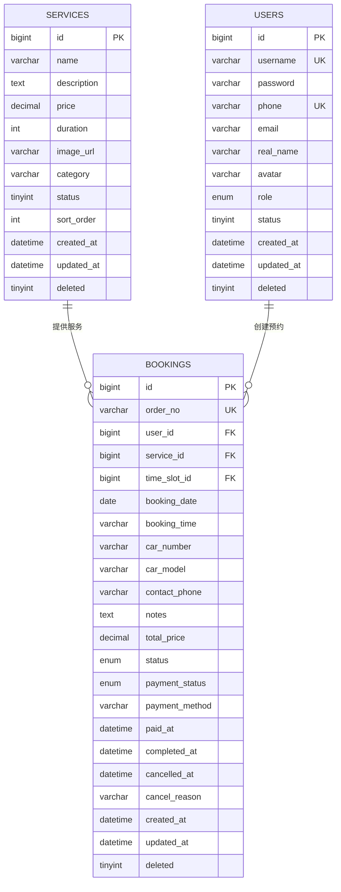
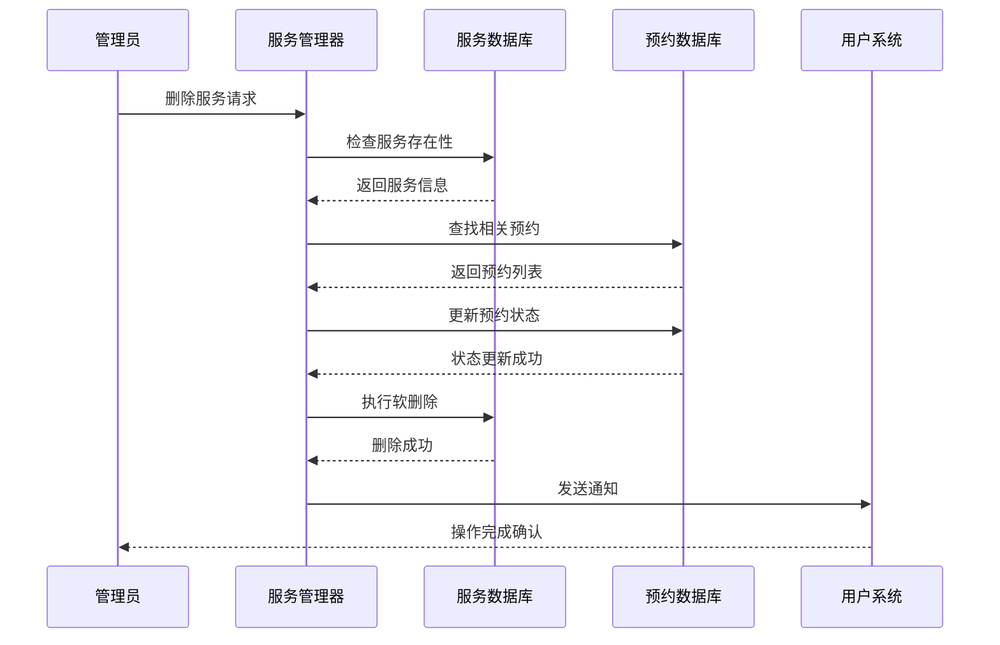

# 服务管理模块

<cite>
**本文档引用的文件**
- [ServiceManagement.vue](file://frontend/src/views/admin/ServiceManagement.vue)
- [ServiceManagementService.java](file://backend/src/main/java/com/carwash/service/ServiceManagementService.java)
- [ServiceManagementServiceImpl.java](file://backend/src/main/java/com/carwash/service/impl/ServiceManagementServiceImpl.java)
- [Service.java](file://backend/src/main/java/com/carwash/entity/Service.java)
- [ServiceMapper.java](file://backend/src/main/java/com/carwash/mapper/ServiceMapper.java)
- [ServiceController.java](file://backend/src/main/java/com/carwash/controller/ServiceController.java)
- [ServiceRequest.java](file://backend/src/main/java/com/carwash/dto/ServiceRequest.java)
- [ServiceResponse.java](file://backend/src/main/java/com/carwash/dto/ServiceResponse.java)
- [service.js](file://frontend/src/api/service.js)
- [init.sql](file://sql/init.sql)
- [Booking.java](file://backend/src/main/java/com/carwash/entity/Booking.java)
</cite>

## 目录
1. [概述](#概述)
2. [系统架构](#系统架构)
3. [前端服务管理界面](#前端服务管理界面)
4. [后端服务管理服务](#后端服务管理服务)
5. [数据模型与数据库设计](#数据模型与数据库设计)
6. [核心业务逻辑](#核心业务逻辑)
7. [服务状态管理](#服务状态管理)
8. [数据关联与级联处理](#数据关联与级联处理)
9. [日志记录与审计](#日志记录与审计)
10. [性能优化与最佳实践](#性能优化与最佳实践)
11. [故障排除指南](#故障排除指南)

## 概述

服务管理模块是汽车洗车服务预约系统的核心功能之一，负责管理所有的洗车服务项目。该模块提供了完整的CRUD操作能力，支持服务的价格、时长、分类等属性配置，并实现了灵活的搜索筛选功能。

### 主要功能特性

- **服务生命周期管理**：支持服务的创建、更新、删除和永久删除
- **多维度搜索筛选**：支持按名称、分类、价格范围、状态等条件搜索
- **双视图模式**：提供卡片视图和列表视图两种展示模式
- **状态控制**：支持服务的启用/禁用状态切换
- **数据统计**：实时统计服务总数、可用服务数、平均价格等指标
- **级联处理**：与预约系统紧密集成，确保数据一致性

## 系统架构

服务管理模块采用前后端分离架构，前端使用Vue.js框架，后端使用Spring Boot框架。

**图表来源**
- [ServiceManagement.vue](file://frontend/src/views/admin/ServiceManagement.vue#L1-L50)
- [ServiceController.java](file://backend/src/main/java/com/carwash/controller/ServiceController.java#L1-L50)
- [ServiceManagementServiceImpl.java](file://backend/src/main/java/com/carwash/service/impl/ServiceManagementServiceImpl.java#L1-L50)

## 前端服务管理界面

### 组件结构与布局

前端服务管理界面采用模块化设计，主要包含以下核心组件：

#### 页面头部区域
- **标题栏**：显示"服务管理"标题和简要说明
- **操作按钮**：提供"添加服务"和"刷新数据"功能
- **权限控制**：仅管理员可见特定操作按钮

#### 搜索筛选区域
- **关键词搜索**：支持按服务名称和服务描述搜索
- **分类筛选**：提供基础洗车、精洗套餐、内饰清洁等分类选项
- **状态筛选**：支持启用/禁用状态筛选
- **价格范围**：允许设置最低和最高价格范围
- **重置功能**：一键清除所有筛选条件

#### 统计卡片区域
- **总服务数**：显示系统中所有服务的总数
- **启用中**：统计当前处于启用状态的服务数量
- **精品服务**：统计精洗套餐类别的服务数量
- **平均价格**：计算并显示所有服务的平均价格

#### 服务列表区域
支持两种视图模式：
- **卡片视图**：以网格形式展示服务，包含服务图标、分类标签、价格、时长等信息
- **列表视图**：以表格形式展示服务，提供更详细的操作选项

**图表来源**
- [ServiceManagement.vue](file://frontend/src/views/admin/ServiceManagement.vue#L150-L200)

**章节来源**
- [ServiceManagement.vue](file://frontend/src/views/admin/ServiceManagement.vue#L1-L300)

### 视图模式实现

#### 卡片视图设计
卡片视图采用响应式网格布局，每个服务卡片包含：
- **服务头部**：分类标签和状态徽章
- **服务内容**：服务名称、描述、价格、时长信息
- **操作按钮**：编辑、启用/禁用、删除功能

#### 列表视图设计
列表视图提供更详细的服务信息展示：
- **服务基本信息**：名称、分类、描述
- **价格时长**：价格和预计服务时长
- **状态控制**：开关式状态切换
- **操作列**：详细的编辑、查看、删除功能

### 搜索筛选功能

搜索筛选功能通过组合多个条件实现精确查询：

#### 搜索条件组合
- **关键词匹配**：支持服务名称和服务描述的模糊搜索
- **分类过滤**：精确匹配指定的服务分类
- **状态过滤**：支持启用和禁用状态的筛选
- **价格区间**：动态计算价格范围内的服务
- **综合排序**：按照排序权重和创建时间排序

**章节来源**
- [ServiceManagement.vue](file://frontend/src/views/admin/ServiceManagement.vue#L20-L150)

## 后端服务管理服务

### 服务接口定义

后端服务管理通过ServiceManagementService接口定义核心业务方法：

#### 核心CRUD方法
- `createService()`：创建新服务项目
- `updateService()`：更新现有服务信息
- `deleteService()`：软删除服务（逻辑删除）
- `permanentlyDeleteService()`：物理删除服务

#### 查询方法
- `getServiceById()`：根据ID获取服务详情
- `getAllServices()`：分页查询所有服务
- `getAvailableServices()`：查询可用服务
- `getServicesByCategory()`：按分类查询服务
- `searchServices()`：关键词搜索服务
- `getAllCategories()`：获取所有服务分类

#### 状态管理方法
- `updateServiceStatus()`：更新服务状态

**图表来源**
- [ServiceManagementService.java](file://backend/src/main/java/com/carwash/service/ServiceManagementService.java#L1-L73)
- [ServiceManagementServiceImpl.java](file://backend/src/main/java/com/carwash/service/impl/ServiceManagementServiceImpl.java#L1-L50)

**章节来源**
- [ServiceManagementService.java](file://backend/src/main/java/com/carwash/service/ServiceManagementService.java#L1-L73)
- [ServiceManagementServiceImpl.java](file://backend/src/main/java/com/carwash/service/impl/ServiceManagementServiceImpl.java#L1-L232)

### 业务逻辑实现

#### 创建服务(createService)
创建服务方法实现了完整的业务流程：

1. **日志记录**：记录服务创建开始和完成的日志
2. **数据转换**：将ServiceRequest转换为Service实体
3. **默认状态设置**：自动设置服务为启用状态
4. **数据库插入**：执行服务数据的插入操作
5. **异常处理**：处理插入失败的情况

#### 更新服务(updateService)
更新服务方法确保数据的一致性和完整性：

1. **服务验证**：检查服务是否存在
2. **数据映射**：将请求数据映射到实体对象
3. **版本控制**：确保更新的是正确的服务实例
4. **数据库更新**：执行服务信息的更新操作
5. **事务保证**：确保更新操作的原子性

#### 删除服务(deleteService)
删除服务采用软删除策略：

1. **存在性验证**：确认服务确实存在
2. **逻辑删除**：设置deleted标志位为1
3. **级联影响**：自动处理相关预约的影响
4. **状态同步**：确保系统状态的一致性

#### 永久删除(permanentlyDeleteService)
永久删除方法提供彻底的数据清理：

1. **ID验证**：验证服务ID的有效性
2. **存在性检查**：确认服务记录的存在
3. **物理删除**：从数据库中完全移除记录
4. **验证机制**：多次验证确保删除成功
5. **异常处理**：处理删除失败的各种情况

**章节来源**
- [ServiceManagementServiceImpl.java](file://backend/src/main/java/com/carwash/service/impl/ServiceManagementServiceImpl.java#L37-L232)

## 数据模型与数据库设计

### 实体模型设计

服务实体(Service)包含了服务管理所需的所有核心属性：

#### 核心属性
- **服务标识**：唯一的服务ID，自增主键
- **服务名称**：服务的显示名称，必填字段
- **服务描述**：详细的服务说明，支持富文本
- **服务价格**：以BigDecimal存储的精确价格
- **服务时长**：以分钟为单位的服务时长
- **服务图片**：服务相关的图片URL地址
- **服务分类**：用于分类管理的字符串标识
- **状态控制**：启用(1)/禁用(0)状态
- **排序权重**：用于自定义排序的整数值

#### 附加属性
- **创建时间**：自动记录服务创建的时间戳
- **更新时间**：自动更新服务修改的时间戳
- **逻辑删除**：deleted字段实现软删除功能

**图表来源**
- [Service.java](file://backend/src/main/java/com/carwash/entity/Service.java#L1-L191)
- [Booking.java](file://backend/src/main/java/com/carwash/entity/Booking.java#L1-L200)

### 数据库约束与索引

#### 主键与唯一约束
- **主键约束**：服务ID作为主键，确保每条记录的唯一性
- **唯一约束**：用户名、手机号等字段设置唯一约束
- **外键约束**：服务ID在预约表中作为外键引用

#### 索引设计
- **分类索引**：加速按服务分类的查询
- **状态索引**：优化状态相关的查询性能
- **排序索引**：支持服务的自定义排序
- **时间索引**：加速时间相关的查询

**章节来源**
- [Service.java](file://backend/src/main/java/com/carwash/entity/Service.java#L1-L191)
- [init.sql](file://sql/init.sql#L42-L58)

## 核心业务逻辑

### 事务管理

服务管理模块采用声明式事务管理，确保数据操作的原子性：

#### 事务配置
- **传播行为**：REQUIRED传播行为，确保方法在事务中执行
- **回滚策略**：默认回滚RuntimeException及其子类
- **隔离级别**：使用数据库默认的隔离级别
- **只读属性**：查询操作标记为只读，提高性能

#### 事务边界
- **方法级事务**：每个业务方法都定义了明确的事务边界
- **嵌套事务**：支持方法间的嵌套事务调用
- **异常处理**：统一的异常处理机制确保事务正确回滚

### 数据验证

#### 前端验证
前端使用Element Plus的表单验证功能：
- **必填字段**：服务名称、分类、描述等必填项验证
- **格式验证**：价格为非负数，时长最小15分钟
- **范围验证**：价格和时长的合理范围检查
- **实时验证**：输入过程中的实时验证提示

#### 后端验证
后端采用Bean Validation框架：
- **注解验证**：使用@NotBlank、@NotNull、@DecimalMin等注解
- **自定义验证**：针对业务规则的自定义验证逻辑
- **全局异常处理**：统一处理验证异常并返回友好错误信息

### 异常处理

#### 异常分类
- **业务异常**：服务不存在、参数错误等业务逻辑异常
- **系统异常**：数据库连接失败、SQL执行错误等系统异常
- **权限异常**：用户权限不足导致的访问拒绝

#### 异常处理策略
- **统一异常处理器**：全局异常处理器捕获并处理各类异常
- **错误码体系**：使用标准化的错误码便于前端处理
- **日志记录**：详细记录异常信息便于问题排查
- **用户友好提示**：向用户提供友好的错误提示信息

**章节来源**
- [ServiceManagementServiceImpl.java](file://backend/src/main/java/com/carwash/service/impl/ServiceManagementServiceImpl.java#L37-L232)

## 服务状态管理

### 状态定义与转换

服务状态管理采用简单的启用/禁用模式：

#### 状态枚举
- **启用状态(1)**：服务可被用户选择和预约
- **禁用状态(0)**：服务不可被选择，但保留历史数据

#### 状态转换规则
- **创建时默认启用**：新创建的服务自动设置为启用状态
- **手动状态切换**：管理员可随时切换服务状态
- **状态变更影响**：状态变更直接影响用户的可见性

### 状态查询优化

#### 分页查询
- **可用服务查询**：专门的查询方法只返回启用状态的服务
- **状态过滤**：支持按状态条件过滤查询结果
- **性能优化**：利用数据库索引加速状态相关的查询

#### 缓存策略
- **状态缓存**：缓存常用的状态查询结果
- **增量更新**：状态变更时及时更新缓存
- **过期策略**：设置合理的缓存过期时间

**章节来源**
- [ServiceManagementServiceImpl.java](file://backend/src/main/java/com/carwash/service/impl/ServiceManagementServiceImpl.java#L158-L173)

## 数据关联与级联处理

### 服务与预约的关系

服务与预约之间存在一对多的关联关系：

#### 关联关系设计
- **外键约束**：预约表中的service_id字段引用服务表
- **级联删除**：服务删除时自动处理相关预约
- **数据一致性**：确保关联数据的一致性

#### 级联处理机制

##### 删除服务时的处理
1. **预约状态检查**：检查是否有正在进行的预约
2. **状态更新**：将相关预约标记为无效状态
3. **通知机制**：通知受影响的用户
4. **数据清理**：清理相关的中间数据

##### 状态变更处理
1. **状态同步**：服务状态变更时同步相关预约
2. **用户体验**：确保用户界面的即时更新
3. **数据一致性**：维护数据库层面的一致性

**图表来源**
- [ServiceManagementServiceImpl.java](file://backend/src/main/java/com/carwash/service/impl/ServiceManagementServiceImpl.java#L76-L91)

### 级联删除实现

#### 删除策略
- **软删除优先**：默认采用软删除策略，保留数据历史
- **硬删除选项**：提供永久删除选项，彻底清理数据
- **级联影响**：自动处理相关数据的级联变更

#### 数据完整性保障
- **事务保证**：删除操作在事务中执行，确保原子性
- **回滚机制**：删除失败时自动回滚所有相关操作
- **验证检查**：删除后验证数据完整性

**章节来源**
- [ServiceManagementServiceImpl.java](file://backend/src/main/java/com/carwash/service/impl/ServiceManagementServiceImpl.java#L76-L91)
- [Booking.java](file://backend/src/main/java/com/carwash/entity/Booking.java#L37-L50)

## 日志记录与审计

### 日志记录策略

服务管理模块实现了完善的日志记录机制：

#### 日志级别与内容
- **INFO级别**：记录关键业务操作，如服务创建、更新、删除
- **DEBUG级别**：记录详细的执行过程和参数信息
- **ERROR级别**：记录异常情况和错误信息

#### 日志内容规范
- **操作类型**：明确记录是创建、更新还是删除操作
- **操作对象**：记录具体的服务ID和名称
- **操作结果**：记录操作的成功或失败状态
- **时间戳**：记录操作发生的时间
- **用户信息**：记录执行操作的用户身份

### 审计功能

#### 操作追踪
- **操作记录**：记录所有管理员的操作行为
- **变更历史**：跟踪服务信息的变更历史
- **责任追溯**：通过日志追踪操作责任人

#### 安全监控
- **异常检测**：监控异常的操作模式
- **权限验证**：记录权限验证的结果
- **安全事件**：记录可能的安全事件

### 日志管理

#### 日志存储
- **文件存储**：将日志写入本地文件系统
- **滚动策略**：实现日志文件的滚动和归档
- **压缩备份**：定期压缩和备份历史日志

#### 日志查询
- **关键字搜索**：支持按关键字搜索日志内容
- **时间范围查询**：支持按时间范围查询日志
- **过滤条件**：支持多种过滤条件组合查询

**章节来源**
- [ServiceManagementServiceImpl.java](file://backend/src/main/java/com/carwash/service/impl/ServiceManagementServiceImpl.java#L38-L91)

## 性能优化与最佳实践

### 查询性能优化

#### 索引优化
- **复合索引**：为经常组合使用的查询条件创建复合索引
- **覆盖索引**：优化查询语句，使其能够使用覆盖索引
- **索引维护**：定期分析和优化索引效果

#### 查询优化
- **分页查询**：使用分页查询避免大量数据加载
- **延迟加载**：对于非关键字段采用延迟加载
- **查询缓存**：缓存常用的查询结果

### 并发控制

#### 乐观锁机制
- **版本控制**：使用版本号控制并发更新
- **冲突检测**：检测并处理并发冲突
- **重试机制**：提供自动重试机制处理冲突

#### 事务隔离
- **合理隔离级别**：根据业务需求选择合适的隔离级别
- **死锁预防**：避免循环依赖导致的死锁
- **超时控制**：设置合理的事务超时时间

### 缓存策略

#### 多层缓存
- **应用缓存**：在应用层缓存热点数据
- **数据库缓存**：利用数据库的查询缓存
- **分布式缓存**：在集群环境中使用Redis等分布式缓存

#### 缓存更新
- **主动更新**：数据变更时主动更新缓存
- **被动失效**：设置合理的缓存过期时间
- **缓存穿透防护**：防止恶意请求穿透缓存

**章节来源**
- [ServiceMapper.java](file://backend/src/main/java/com/carwash/mapper/ServiceMapper.java#L23-L64)

## 故障排除指南

### 常见问题与解决方案

#### 服务创建失败
**问题现象**：创建服务时抛出异常
**可能原因**：
- 服务名称重复
- 必填字段缺失
- 数据库连接异常
- 权限不足

**解决方案**：
1. 检查服务名称是否唯一
2. 验证所有必填字段是否填写
3. 检查数据库连接状态
4. 确认用户具有管理员权限

#### 服务删除异常
**问题现象**：删除服务时出现错误
**可能原因**：
- 存在相关预约记录
- 数据库约束冲突
- 事务处理异常

**解决方案**：
1. 检查是否存在相关预约
2. 查看具体的错误信息
3. 检查事务日志
4. 考虑使用硬删除

#### 查询性能问题
**问题现象**：服务查询响应缓慢
**可能原因**：
- 缺少必要的索引
- 查询条件过于复杂
- 数据量过大

**解决方案**：
1. 分析查询执行计划
2. 添加适当的索引
3. 优化查询条件
4. 考虑数据分区

### 监控与告警

#### 关键指标监控
- **服务数量**：监控服务总数的变化趋势
- **查询性能**：监控关键查询的响应时间
- **错误率**：监控操作失败的比例
- **并发量**：监控同时访问的用户数量

#### 告警机制
- **阈值告警**：当指标超过预设阈值时发送告警
- **异常检测**：自动检测异常的模式和趋势
- **通知机制**：通过邮件、短信等方式通知相关人员

### 数据恢复

#### 备份策略
- **定期备份**：制定定期的数据备份计划
- **增量备份**：结合全量和增量备份
- **异地备份**：将备份数据存储在不同地点

#### 恢复流程
- **备份验证**：定期验证备份数据的完整性
- **恢复测试**：定期进行恢复演练
- **灾难恢复**：制定详细的灾难恢复预案

**章节来源**
- [ServiceManagementServiceImpl.java](file://backend/src/main/java/com/carwash/service/impl/ServiceManagementServiceImpl.java#L176-L232)

## 结论

服务管理模块作为汽车洗车服务预约系统的核心功能，实现了完整的服务生命周期管理。通过前后端分离的架构设计，模块具备了良好的可维护性和扩展性。完善的日志记录和审计功能确保了操作的可追溯性，而强大的搜索筛选功能则提升了管理效率。

该模块的设计充分考虑了实际业务需求，采用了软删除策略保护数据完整性，实现了与预约系统的紧密集成。通过事务管理和异常处理机制，确保了数据操作的可靠性和一致性。

未来可以考虑的功能增强包括：
- 服务评价系统集成
- 动态定价功能
- 服务推荐算法
- 移动端管理功能

这些改进将进一步提升系统的实用性和用户体验。