# 状态与删除管理

<cite>
**本文档引用的文件**
- [ServiceManagement.vue](file://frontend/src/views/admin/ServiceManagement.vue)
- [ServiceManagementServiceImpl.java](file://backend/src/main/java/com/carwash/service/impl/ServiceManagementServiceImpl.java)
- [ServiceManagementService.java](file://backend/src/main/java/com/carwash/service/ServiceManagementService.java)
- [Service.java](file://backend/src/main/java/com/carwash/entity/Service.java)
- [ServiceMapper.java](file://backend/src/main/java/com/carwash/mapper/ServiceMapper.java)
- [ServiceController.java](file://backend/src/main/java/com/carwash/controller/ServiceController.java)
- [service.js](file://frontend/src/api/service.js)
- [ServiceRequest.java](file://backend/src/main/java/com/carwash/dto/ServiceRequest.java)
- [ServiceResponse.java](file://backend/src/main/java/com/carwash/dto/ServiceResponse.java)
</cite>

## 目录
1. [引言](#引言)
2. [系统架构概览](#系统架构概览)
3. [前端状态管理组件](#前端状态管理组件)
4. [后端服务管理实现](#后端服务管理实现)
5. [状态变更机制](#状态变更机制)
6. [删除操作机制](#删除操作机制)
7. [软删除与硬删除对比](#软删除与硬删除对比)
8. [级联数据处理策略](#级联数据处理策略)
9. [错误处理与重试机制](#错误处理与重试机制)
10. [性能考虑](#性能考虑)
11. [故障排除指南](#故障排除指南)
12. [总结](#总结)

## 引言

汽车洗车服务预约系统实现了完善的服务状态管理和删除机制，支持灵活的服务生命周期管理。该系统采用前后端分离架构，通过Vue.js前端组件和Spring Boot后端服务，提供了直观的服务状态切换和安全的删除操作功能。

系统的核心特性包括：
- 实时服务状态切换（启用/禁用）
- 软删除和硬删除双重删除策略
- 完整的日志记录和审计跟踪
- 事务性操作保证数据一致性
- 级联数据处理和验证机制

## 系统架构概览

系统采用经典的三层架构模式，包含前端展示层、后端业务逻辑层和数据访问层。

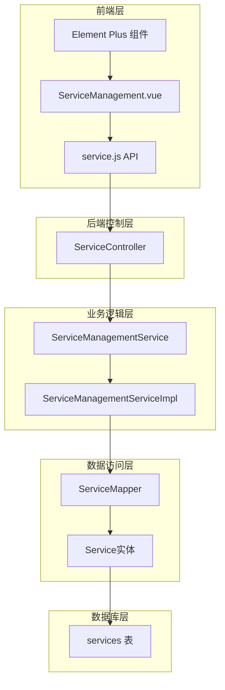

**图表来源**
- [ServiceManagement.vue](file://frontend/src/views/admin/ServiceManagement.vue#L1-L50)
- [ServiceController.java](file://backend/src/main/java/com/carwash/controller/ServiceController.java#L1-L50)
- [ServiceManagementServiceImpl.java](file://backend/src/main/java/com/carwash/service/impl/ServiceManagementServiceImpl.java#L1-L50)

## 前端状态管理组件

### 开关组件实现

前端使用Element Plus的el-switch组件实现服务状态的可视化控制。组件直接绑定到服务对象的状态属性，提供即时反馈。

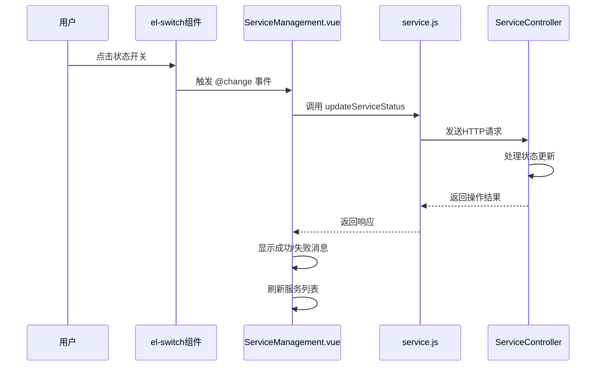

**图表来源**
- [ServiceManagement.vue](file://frontend/src/views/admin/ServiceManagement.vue#L269-L276)
- [service.js](file://frontend/src/api/service.js#L91-L102)

### 对话框确认流程

删除操作采用ElMessageBox确认对话框，确保操作的安全性和可追溯性。

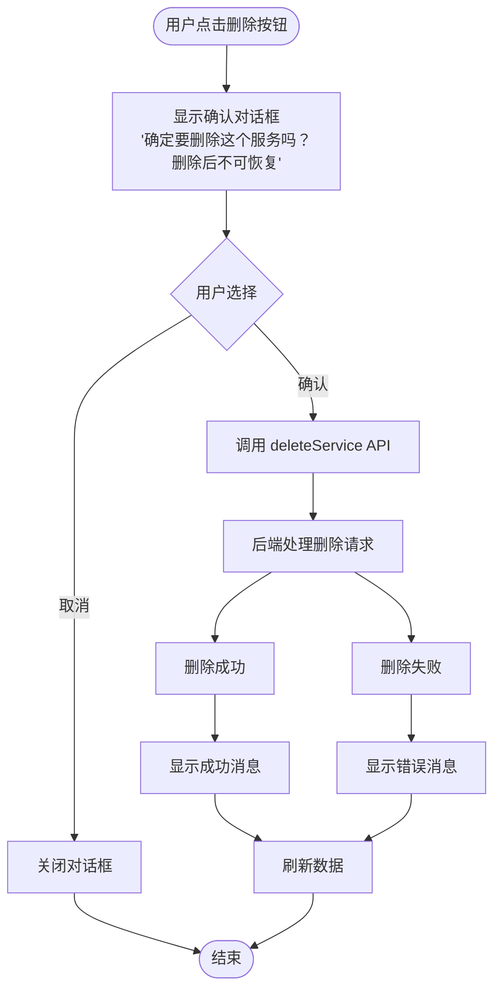

**图表来源**
- [ServiceManagement.vue](file://frontend/src/views/admin/ServiceManagement.vue#L686-L700)

**章节来源**
- [ServiceManagement.vue](file://frontend/src/views/admin/ServiceManagement.vue#L269-L276)
- [ServiceManagement.vue](file://frontend/src/views/admin/ServiceManagement.vue#L686-L700)

## 后端服务管理实现

### ServiceManagementServiceImpl核心方法

后端服务管理实现类提供了完整的CRUD操作和状态管理功能。

#### updateServiceStatus方法业务逻辑

该方法负责处理服务状态的变更，包括启用和禁用操作。

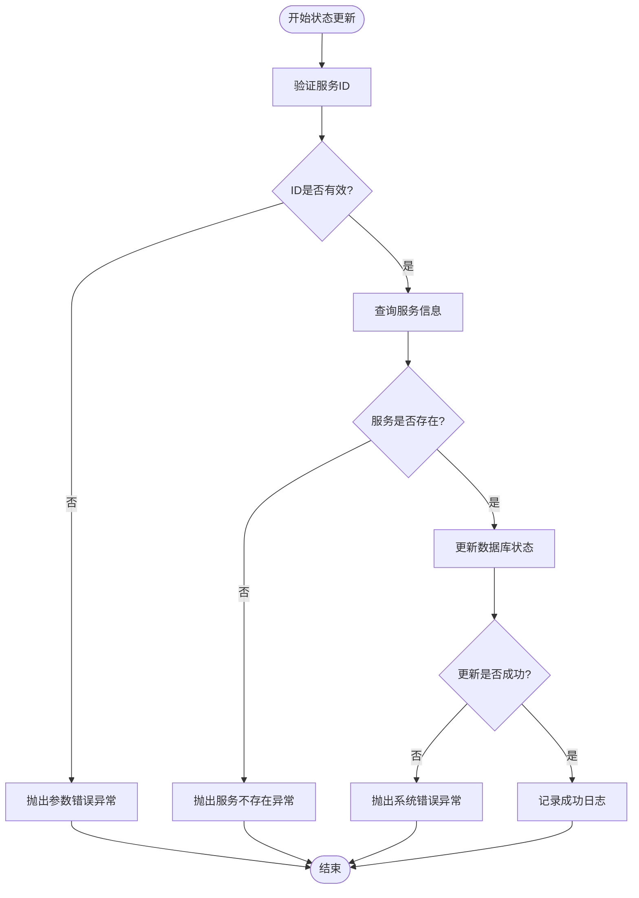

**图表来源**
- [ServiceManagementServiceImpl.java](file://backend/src/main/java/com/carwash/service/impl/ServiceManagementServiceImpl.java#L158-L173)

#### permanentlyDeleteService硬删除实现

硬删除方法实现了彻底清除服务数据的功能，包括多重验证和重试机制。

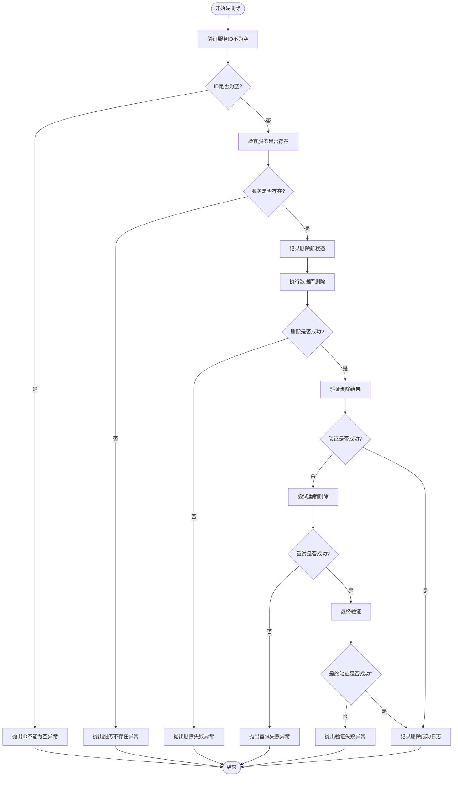

**图表来源**
- [ServiceManagementServiceImpl.java](file://backend/src/main/java/com/carwash/service/impl/ServiceManagementServiceImpl.java#L176-L231)

**章节来源**
- [ServiceManagementServiceImpl.java](file://backend/src/main/java/com/carwash/service/impl/ServiceManagementServiceImpl.java#L158-L231)

## 状态变更机制

### 状态枚举定义

服务状态采用简单的二进制枚举：

| 状态值 | 含义 | 应用场景 |
|--------|------|----------|
| 0 | 禁用/下架 | 临时停用、维护中、已删除的服务 |
| 1 | 启用/上架 | 正常可预约的服务 |

### 状态变更对服务可用性的影响

状态变更直接影响服务的可见性和可预约性：

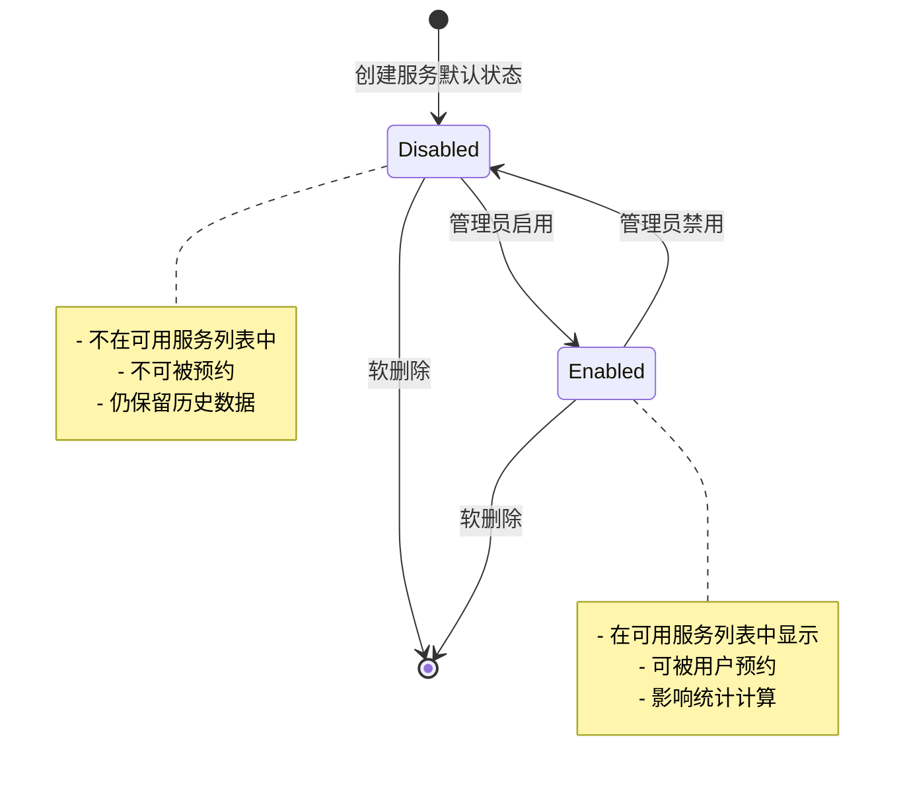

**图表来源**
- [Service.java](file://backend/src/main/java/com/carwash/entity/Service.java#L64-L67)

### 事务处理机制

所有状态变更操作都使用@Transactional注解确保事务一致性：

- **自动回滚**：任何异常都会导致整个事务回滚
- **隔离级别**：使用默认的隔离级别防止并发问题
- **传播行为**：使用默认传播行为确保嵌套事务正确处理

**章节来源**
- [ServiceManagementServiceImpl.java](file://backend/src/main/java/com/carwash/service/impl/ServiceManagementServiceImpl.java#L36-L38)
- [ServiceManagementServiceImpl.java](file://backend/src/main/java/com/carwash/service/impl/ServiceManagementServiceImpl.java#L158-L173)

## 删除操作机制

### 软删除实现

软删除通过逻辑删除标记实现，不会真正从数据库中移除数据。

#### Service实体中的软删除字段

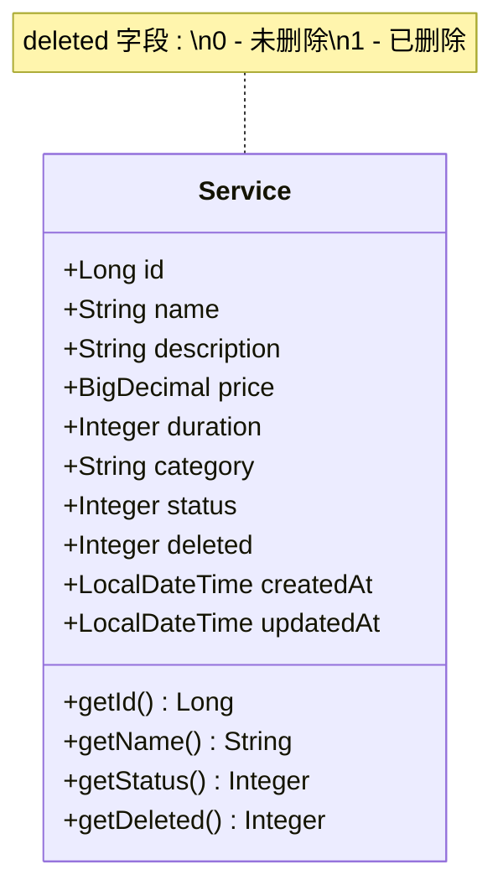

**图表来源**
- [Service.java](file://backend/src/main/java/com/carwash/entity/Service.java#L87-L92)

#### Mapper查询条件

软删除的查询条件确保只返回未删除的服务：

| 查询类型 | SQL条件 | 说明 |
|----------|---------|------|
| 可用服务查询 | `status = 1 AND deleted = 0` | 只返回启用且未删除的服务 |
| 分类查询 | `category = #{category} AND status = 1 AND deleted = 0` | 按分类查询可用服务 |
| 搜索查询 | `name LIKE CONCAT('%', #{keyword}, '%') AND status = 1 AND deleted = 0` | 搜索关键词匹配的可用服务 |

### 删除操作流程

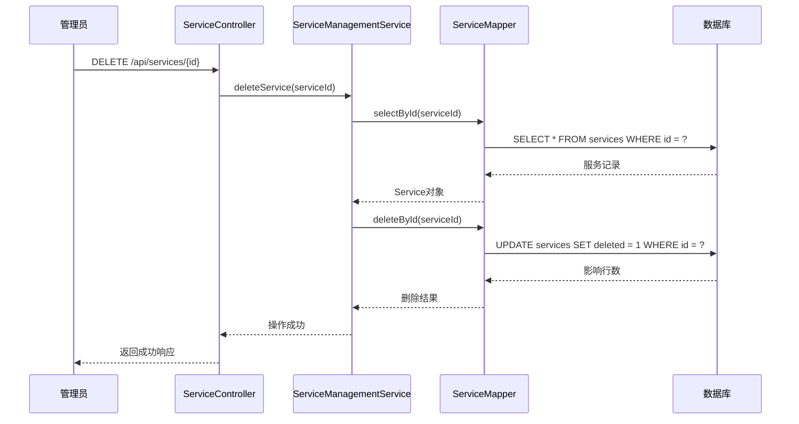

**图表来源**
- [ServiceController.java](file://backend/src/main/java/com/carwash/controller/ServiceController.java#L118-L126)
- [ServiceManagementServiceImpl.java](file://backend/src/main/java/com/carwash/service/impl/ServiceManagementServiceImpl.java#L76-L91)

**章节来源**
- [Service.java](file://backend/src/main/java/com/carwash/entity/Service.java#L87-L92)
- [ServiceMapper.java](file://backend/src/main/java/com/carwash/mapper/ServiceMapper.java#L26-L45)
- [ServiceController.java](file://backend/src/main/java/com/carwash/controller/ServiceController.java#L118-L126)

## 软删除与硬删除对比

### 功能特性对比

| 特性 | 软删除 | 硬删除 |
|------|--------|--------|
| 数据保留 | 保留历史记录 | 彻底清除数据 |
| 恢复能力 | 可通过修改deleted字段恢复 | 不可恢复 |
| 性能影响 | 查询时增加过滤条件 | 查询性能更好 |
| 存储空间 | 占用更多存储空间 | 释放存储空间 |
| 审计追踪 | 保留删除时间戳 | 无法追踪删除时间 |
| 级联处理 | 需要特殊处理级联关系 | 自然处理级联关系 |

### 应用场景分析

#### 软删除适用场景
- **临时停用**：服务暂时不可用但需要保留历史数据
- **误操作保护**：防止意外删除造成数据丢失
- **审计需求**：需要保留操作痕迹和历史记录
- **业务连续性**：需要快速恢复被删除的服务

#### 硬删除适用场景
- **数据清理**：清理长期不用的历史数据
- **合规要求**：满足数据保留期限的合规要求
- **性能优化**：减少数据库查询负担
- **存储限制**：应对存储空间不足的情况

### 实现差异分析

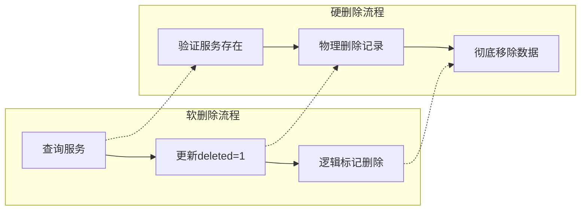

**图表来源**
- [ServiceManagementServiceImpl.java](file://backend/src/main/java/com/carwash/service/impl/ServiceManagementServiceImpl.java#L76-L91)
- [ServiceManagementServiceImpl.java](file://backend/src/main/java/com/carwash/service/impl/ServiceManagementServiceImpl.java#L176-L231)

**章节来源**
- [ServiceManagementServiceImpl.java](file://backend/src/main/java/com/carwash/service/impl/ServiceManagementServiceImpl.java#L76-L91)
- [ServiceManagementServiceImpl.java](file://backend/src/main/java/com/carwash/service/impl/ServiceManagementServiceImpl.java#L176-L231)

## 级联数据处理策略

### 级联关系分析

服务删除可能影响以下关联数据：

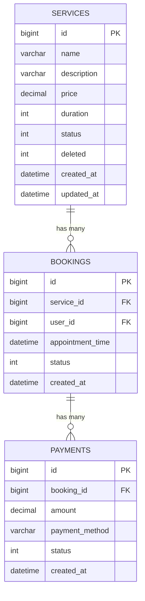

**图表来源**
- [Service.java](file://backend/src/main/java/com/carwash/entity/Service.java#L1-L50)

### 级联处理策略

#### 软删除策略
- **保留关联数据**：所有预订和支付记录保持不变
- **状态标记**：服务标记为已删除，不影响现有预约
- **查询过滤**：通过deleted字段过滤掉已删除的服务

#### 硬删除策略
- **级联删除**：自动删除所有相关的预订和支付记录
- **外键约束**：利用数据库的级联删除功能
- **数据完整性**：确保没有孤立的关联数据

### 数据一致性保证

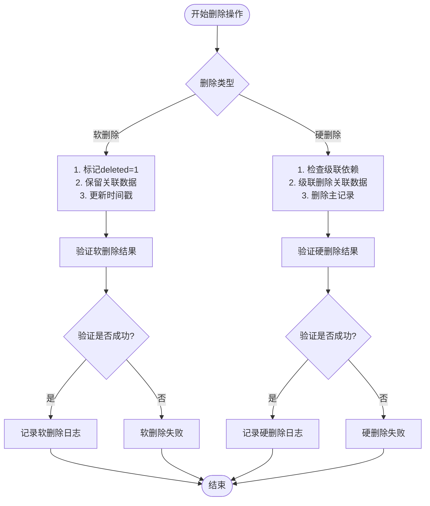

**图表来源**
- [ServiceManagementServiceImpl.java](file://backend/src/main/java/com/carwash/service/impl/ServiceManagementServiceImpl.java#L76-L91)
- [ServiceManagementServiceImpl.java](file://backend/src/main/java/com/carwash/service/impl/ServiceManagementServiceImpl.java#L176-L231)

**章节来源**
- [ServiceManagementServiceImpl.java](file://backend/src/main/java/com/carwash/service/impl/ServiceManagementServiceImpl.java#L76-L91)
- [ServiceManagementServiceImpl.java](file://backend/src/main/java/com/carwash/service/impl/ServiceManagementServiceImpl.java#L176-L231)

## 错误处理与重试机制

### 硬删除重试机制

硬删除方法实现了完善的错误处理和重试机制：

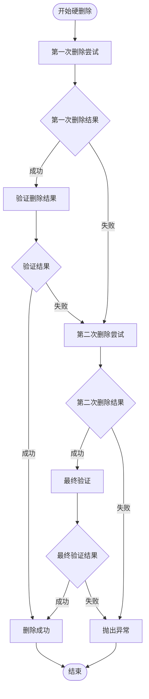

**图表来源**
- [ServiceManagementServiceImpl.java](file://backend/src/main/java/com/carwash/service/impl/ServiceManagementServiceImpl.java#L207-L228)

### 异常处理策略

| 异常类型 | 处理方式 | 业务影响 |
|----------|----------|----------|
| PARAM_ERROR | 参数验证失败，立即返回 | 拒绝非法请求 |
| SERVICE_NOT_FOUND | 服务不存在，记录日志 | 操作失败，不执行删除 |
| SYSTEM_ERROR | 数据库操作失败 | 操作失败，可能重试 |
| CONCURRENT_MODIFICATION | 并发修改冲突 | 操作失败，建议重试 |

### 日志记录机制

系统实现了完整的日志记录体系：

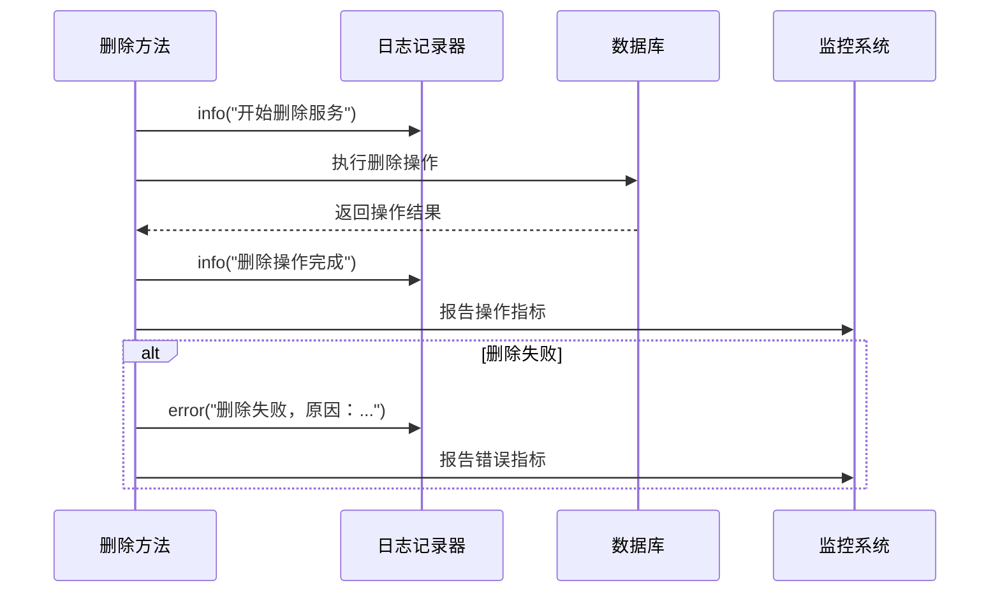

**图表来源**
- [ServiceManagementServiceImpl.java](file://backend/src/main/java/com/carwash/service/impl/ServiceManagementServiceImpl.java#L178-L230)

**章节来源**
- [ServiceManagementServiceImpl.java](file://backend/src/main/java/com/carwash/service/impl/ServiceManagementServiceImpl.java#L176-L231)

## 性能考虑

### 查询优化策略

#### 软删除查询优化
- **索引设计**：在deleted字段上建立索引
- **查询条件**：始终包含deleted=0条件
- **覆盖索引**：确保常用查询可以通过索引完成

#### 硬删除性能优化
- **批量删除**：对于大量数据删除使用批量操作
- **分区表**：对大型服务表使用分区策略
- **异步处理**：对于复杂级联删除使用异步处理

### 缓存策略

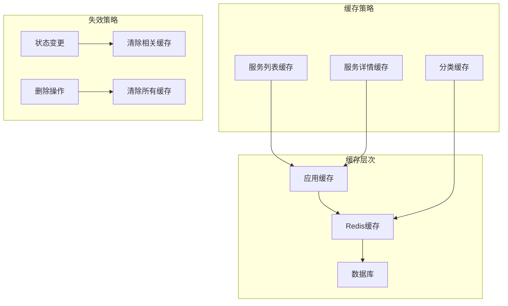

### 监控指标

关键性能指标监控：

| 指标类型 | 监控内容 | 告警阈值 |
|----------|----------|----------|
| 响应时间 | 服务状态更新 | >500ms |
| 错误率 | 删除操作成功率 | >5% |
| 并发量 | 同时进行的删除操作 | >100 |
| 数据库连接 | 连接池使用率 | >80% |

## 故障排除指南

### 常见问题及解决方案

#### 状态更新失败
**症状**：服务状态切换后没有生效
**原因分析**：
- 数据库连接异常
- 并发修改冲突
- 权限不足

**解决方案**：
1. 检查数据库连接状态
2. 重试操作或刷新页面
3. 确认管理员权限

#### 删除操作卡顿
**症状**：删除服务时界面长时间无响应
**原因分析**：
- 硬删除涉及大量级联数据
- 数据库锁竞争
- 网络延迟

**解决方案**：
1. 使用软删除替代硬删除
2. 优化数据库索引
3. 增加超时时间设置

#### 数据不一致
**症状**：删除后服务仍然出现在列表中
**原因分析**：
- 软删除标志未正确设置
- 缓存未及时更新
- 查询条件遗漏deleted过滤

**解决方案**：
1. 检查deleted字段值
2. 清除相关缓存
3. 验证查询SQL条件

### 调试工具和方法

#### 前端调试
- 使用浏览器开发者工具监控网络请求
- 检查API响应状态码和错误信息
- 查看控制台JavaScript错误

#### 后端调试
- 启用DEBUG级别日志
- 使用数据库查询分析器
- 监控JVM内存和GC情况

**章节来源**
- [ServiceManagementServiceImpl.java](file://backend/src/main/java/com/carwash/service/impl/ServiceManagementServiceImpl.java#L176-L231)

## 总结

汽车洗车服务预约系统的状态与删除管理机制体现了现代Web应用的最佳实践：

### 核心优势
- **安全性**：双重确认机制防止误操作
- **可靠性**：完善的错误处理和重试机制
- **可追溯性**：完整的日志记录和审计跟踪
- **灵活性**：支持软删除和硬删除两种策略

### 技术特点
- **事务一致性**：确保数据操作的原子性
- **性能优化**：合理的索引设计和查询优化
- **用户体验**：直观的操作界面和即时反馈
- **扩展性**：模块化设计便于功能扩展

### 应用价值
该系统为汽车洗车服务管理提供了完整的解决方案，不仅满足了日常运营需求，还具备了应对复杂业务场景的能力。通过合理的设计和实现，系统在保证功能完整性的同时，也兼顾了性能和可维护性。