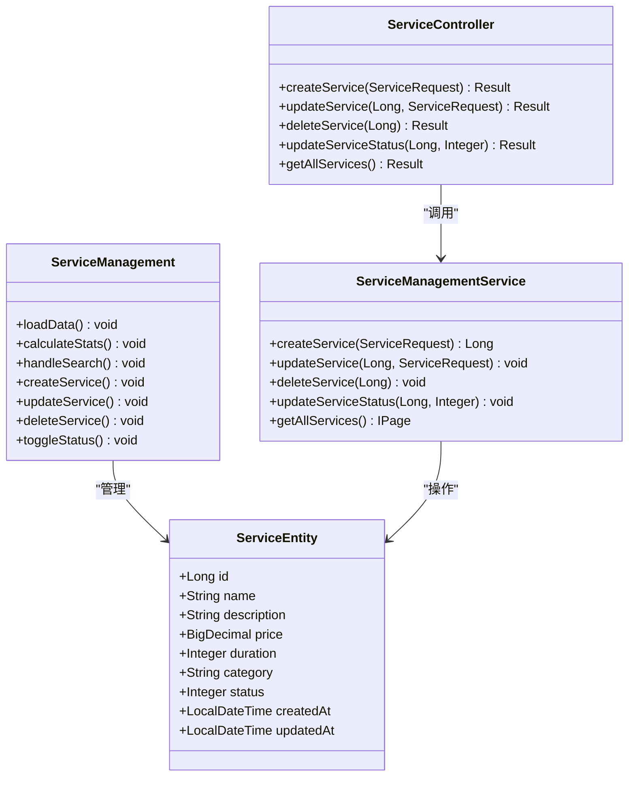
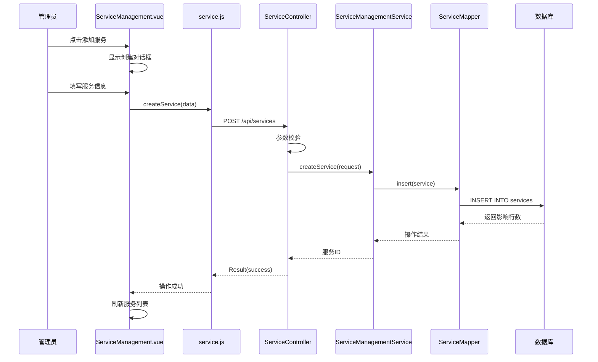
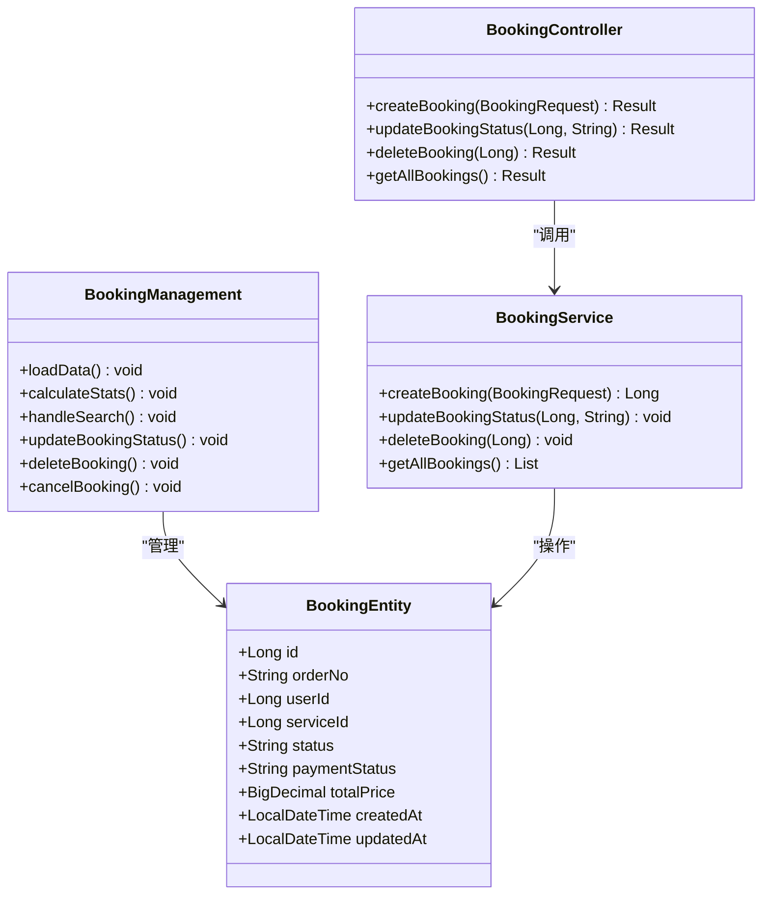
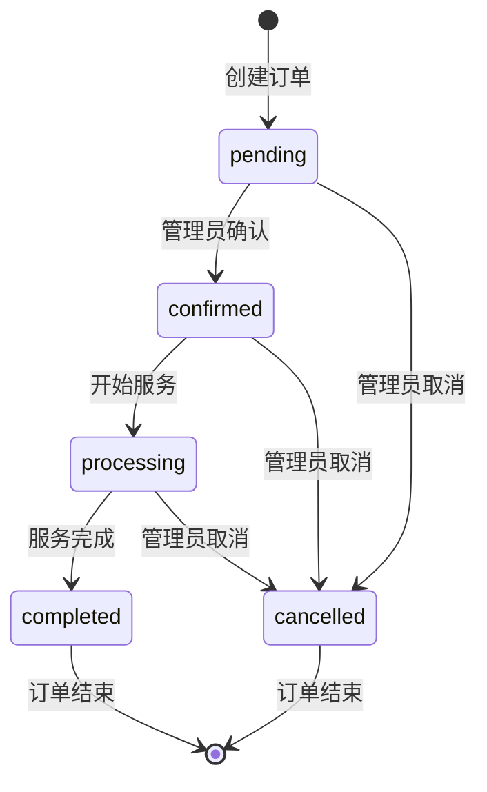
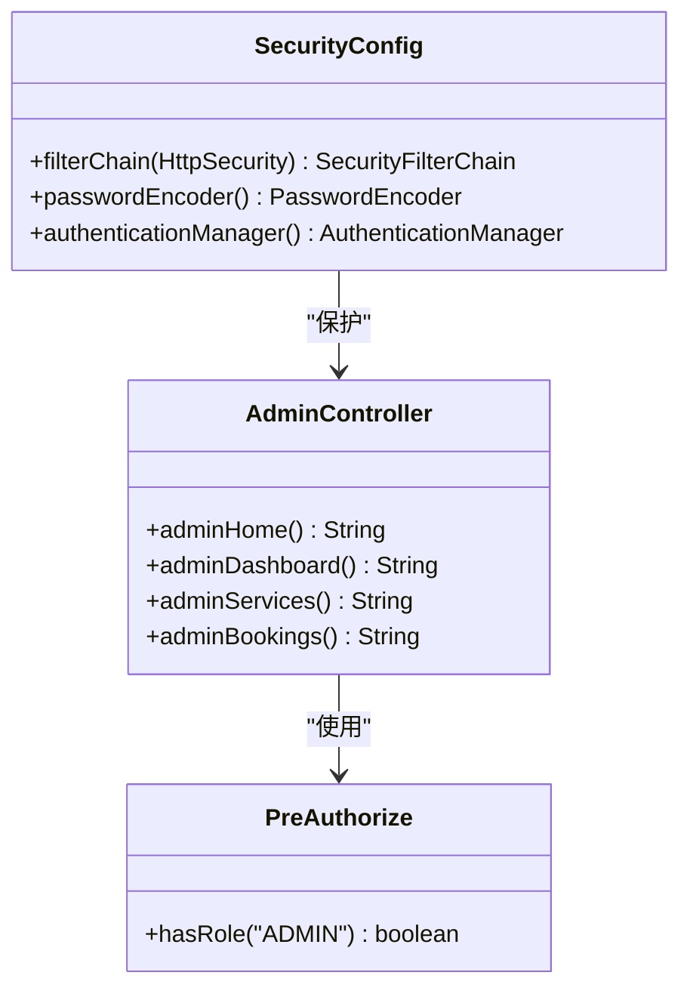
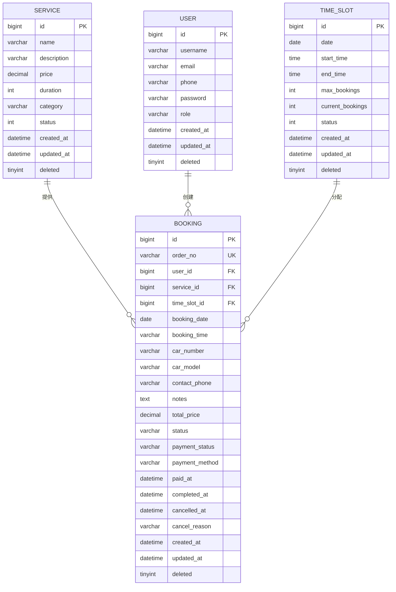
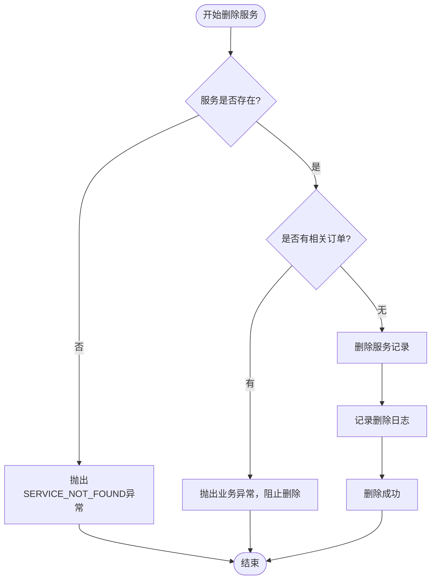
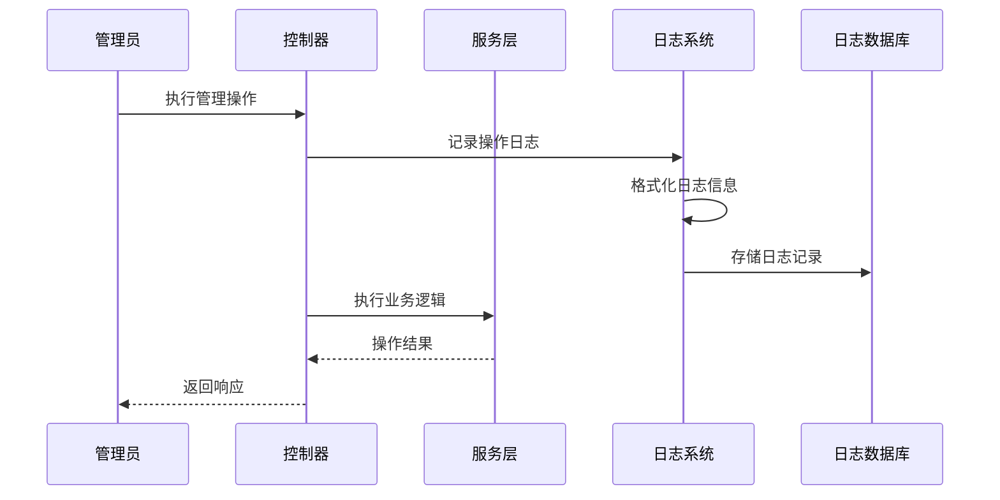
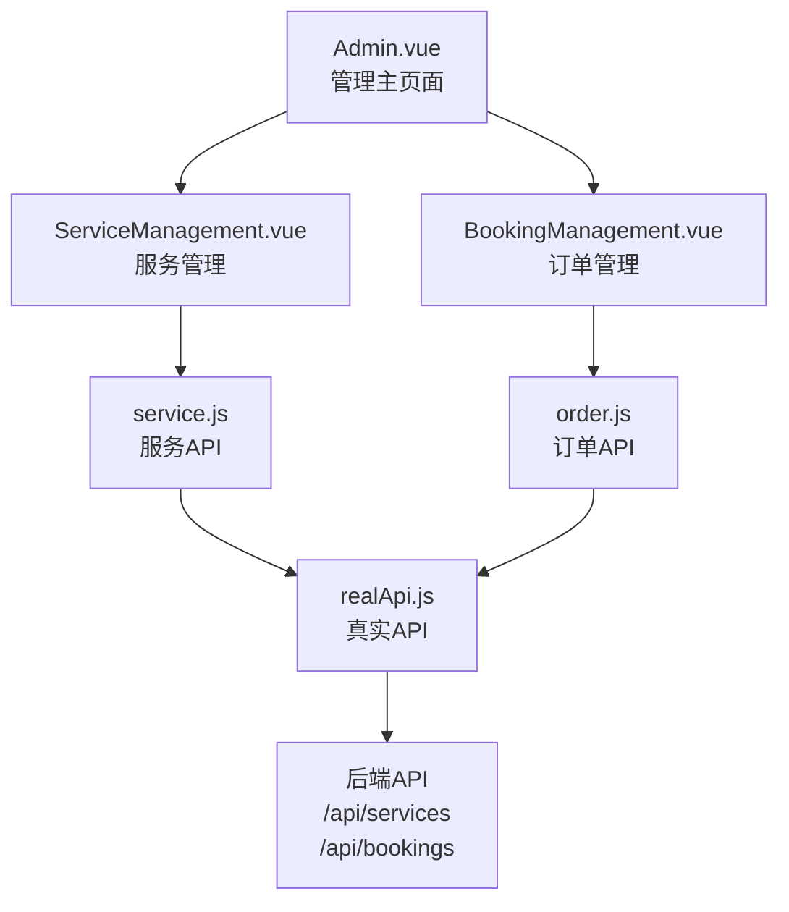

# 管理系统实现

<cite>
**本文档引用的文件**
- [ServiceManagement.vue](file://frontend/src/views/admin/ServiceManagement.vue)
- [BookingManagement.vue](file://frontend/src/views/admin/BookingManagement.vue)
- [AdminController.java](file://backend/src/main/java/com/carwash/controller/AdminController.java)
- [ServiceController.java](file://backend/src/main/java/com/carwash/controller/ServiceController.java)
- [BookingController.java](file://backend/src/main/java/com/carwash/controller/BookingController.java)
- [ServiceManagementServiceImpl.java](file://backend/src/main/java/com/carwash/service/impl/ServiceManagementServiceImpl.java)
- [Service.java](file://backend/src/main/java/com/carwash/entity/Service.java)
- [Booking.java](file://backend/src/main/java/com/carwash/entity/Booking.java)
- [ServiceRequest.java](file://backend/src/main/java/com/carwash/dto/ServiceRequest.java)
- [ServiceResponse.java](file://backend/src/main/java/com/carwash/dto/ServiceResponse.java)
- [ServiceMapper.java](file://backend/src/main/java/com/carwash/mapper/ServiceMapper.java)
- [SecurityConfig.java](file://backend/src/main/java/com/carwash/config/SecurityConfig.java)
- [service.js](file://frontend/src/api/service.js)
- [order.js](file://frontend/src/api/order.js)
</cite>

## 目录
1. [系统概述](#系统概述)
2. [服务管理系统](#服务管理系统)
3. [订单管理系统](#订单管理系统)
4. [权限控制系统](#权限控制系统)
5. [数据关联关系](#数据关联关系)
6. [操作日志与统计](#操作日志与统计)
7. [技术架构分析](#技术架构分析)
8. [总结](#总结)

## 系统概述

汽车洗车服务预约系统采用前后端分离架构，后端基于Spring Boot框架，前端使用Vue.js构建管理界面。系统提供了完整的后台管理功能，包括服务管理、订单管理、权限控制和数据统计等核心模块。

### 系统特点

- **模块化设计**：清晰的服务管理和订单管理模块
- **权限隔离**：严格的ROLE_ADMIN角色控制
- **数据完整性**：完善的级联删除和关联处理
- **操作可追溯**：完整的操作日志记录机制
- **实时统计**：动态的数据统计和可视化展示

## 服务管理系统

### 功能架构

服务管理系统通过ServiceManagement.vue组件实现，提供完整的CRUD操作和高级筛选功能。



**图表来源**
- [ServiceManagement.vue](file://frontend/src/views/admin/ServiceManagement.vue#L468-L941)
- [Service.java](file://backend/src/main/java/com/carwash/entity/Service.java#L19-L191)
- [ServiceController.java](file://backend/src/main/java/com/carwash/controller/ServiceController.java#L26-L166)

### 核心功能实现

#### 1. 服务增删改查操作

**创建服务流程**：


**图表来源**
- [ServiceManagement.vue](file://frontend/src/views/admin/ServiceManagement.vue#L647-L666)
- [ServiceController.java](file://backend/src/main/java/com/carwash/controller/ServiceController.java#L95-L102)
- [ServiceManagementServiceImpl.java](file://backend/src/main/java/com/carwash/service/impl/ServiceManagementServiceImpl.java#L37-L52)

#### 2. 价格与时长配置

服务实体包含以下关键属性：
- **价格配置**：使用BigDecimal精确存储金额，支持小数点后两位
- **时长配置**：整数类型，单位为分钟，默认60分钟
- **分类管理**：支持基础洗车、精洗套餐、内饰清洁等分类
- **状态控制**：启用/禁用状态管理

#### 3. 高级筛选功能

系统提供多维度筛选：
- **文本搜索**：支持服务名称和描述的模糊匹配
- **分类筛选**：按基础洗车、精洗套餐等分类筛选
- **状态筛选**：启用/禁用状态筛选
- **价格范围**：支持最低价和最高价范围筛选

**章节来源**
- [ServiceManagement.vue](file://frontend/src/views/admin/ServiceManagement.vue#L19-L82)
- [ServiceController.java](file://backend/src/main/java/com/carwash/controller/ServiceController.java#L39-L166)

### 数据统计与可视化

系统提供实时统计功能，展示服务相关指标：

| 统计指标 | 描述 | 实现位置 |
|---------|------|----------|
| 总服务数 | 所有服务项目的总数 | stats.total |
| 启用中服务 | 当前上架的服务数量 | stats.active |
| 精品服务 | 精洗套餐分类的服务数量 | stats.premium |
| 平均价格 | 所有服务的平均价格 | stats.avgPrice |

**章节来源**
- [ServiceManagement.vue](file://frontend/src/views/admin/ServiceManagement.vue#L88-L142)

## 订单管理系统

### 功能架构

订单管理系统通过BookingManagement.vue组件实现，提供完整的订单生命周期管理。



**图表来源**
- [BookingManagement.vue](file://frontend/src/views/admin/BookingManagement.vue#L380-L869)
- [Booking.java](file://backend/src/main/java/com/carwash/entity/Booking.java#L19-L333)
- [BookingController.java](file://backend/src/main/java/com/carwash/controller/BookingController.java#L26-L228)

### 核心功能实现

#### 1. 订单状态管理

订单支持以下状态流转：
- **待确认**：新创建的订单，等待管理员确认
- **已确认**：管理员确认订单，准备开始服务
- **进行中**：服务开始执行
- **已完成**：服务完成
- **已取消**：订单被取消



**图表来源**
- [BookingManagement.vue](file://frontend/src/views/admin/BookingManagement.vue#L196-L246)
- [BookingController.java](file://backend/src/main/java/com/carwash/controller/BookingController.java#L147-L166)

#### 2. 批量操作功能

系统支持多种批量操作：
- **状态批量更新**：可同时更新多个订单的状态
- **订单筛选**：支持按状态、服务类型、时间范围等条件筛选
- **数据导出**：支持将筛选结果导出为Excel格式

#### 3. 订单详情与追踪

每个订单包含以下关键信息：
- **客户信息**：姓名、联系方式
- **服务信息**：服务名称、价格、时长
- **时间信息**：预约时间、创建时间
- **状态信息**：当前状态、历史状态变更记录

**章节来源**
- [BookingManagement.vue](file://frontend/src/views/admin/BookingManagement.vue#L143-L263)
- [BookingController.java](file://backend/src/main/java/com/carwash/controller/BookingController.java#L67-L228)

## 权限控制系统

### 角色权限架构

系统采用基于角色的访问控制（RBAC），主要包含两个角色：



**图表来源**
- [SecurityConfig.java](file://backend/src/main/java/com/carwash/config/SecurityConfig.java#L30-L133)
- [AdminController.java](file://backend/src/main/java/com/carwash/controller/AdminController.java#L14-L72)

### 权限控制实现

#### 1. 后端权限控制

**安全配置**：
- `/api/admin/**` 和 `/backend-admin/**` 路径仅允许ROLE_ADMIN访问
- 使用`@PreAuthorize("hasRole('ADMIN')")`注解保护管理员接口
- JWT认证机制确保接口安全性

**控制器权限**：
```java
@PostMapping
@PreAuthorize("hasRole('ADMIN')")
public Result<Long> createService(@Valid @RequestBody ServiceRequest request) {
    // 仅管理员可访问
}
```

#### 2. 前端权限控制

前端通过路由守卫实现权限控制：
- 管理员专属路由需要管理员身份验证
- 权限不足时自动重定向到登录页面
- 动态显示/隐藏管理功能按钮

**章节来源**
- [SecurityConfig.java](file://backend/src/main/java/com/carwash/config/SecurityConfig.java#L76-L98)
- [AdminController.java](file://backend/src/main/java/com/carwash/controller/AdminController.java#L14-L72)

## 数据关联关系

### 服务与订单的关联

系统中的服务和订单之间存在明确的关联关系：



**图表来源**
- [Service.java](file://backend/src/main/java/com/carwash/entity/Service.java#L24-L191)
- [Booking.java](file://backend/src/main/java/com/carwash/entity/Booking.java#L25-L333)

### 级联处理逻辑

#### 1. 服务删除的级联处理

当删除一个服务时，系统会执行以下级联操作：



**图表来源**
- [ServiceManagementServiceImpl.java](file://backend/src/main/java/com/carwash/service/impl/ServiceManagementServiceImpl.java#L77-L91)

#### 2. 订单删除的影响

删除订单不会影响服务记录，但会：
- 更新相关的时间段可用性
- 清理相关的支付记录
- 记录删除操作日志

**章节来源**
- [ServiceManagementServiceImpl.java](file://backend/src/main/java/com/carwash/service/impl/ServiceManagementServiceImpl.java#L77-L91)
- [BookingController.java](file://backend/src/main/java/com/carwash/controller/BookingController.java#L111-L123)

## 操作日志与统计

### 日志记录机制

系统实现了多层次的日志记录机制：

#### 1. 后端操作日志



**图表来源**
- [ServiceManagementServiceImpl.java](file://backend/src/main/java/com/carwash/service/impl/ServiceManagementServiceImpl.java#L39-L51)
- [BookingController.java](file://backend/src/main/java/com/carwash/controller/BookingController.java#L40-L55)

#### 2. 前端操作追踪

前端实现了详细的用户行为追踪：
- **路由访问记录**：记录用户访问的页面
- **操作事件记录**：记录关键操作如创建、修改、删除
- **错误事件记录**：记录系统错误和异常

#### 3. 数据统计功能

系统提供丰富的统计功能：

| 统计类别 | 统计内容 | 实现方式 |
|---------|----------|----------|
| 服务统计 | 服务总数、分类分布、价格区间 | SQL聚合查询 |
| 订单统计 | 订单总数、状态分布、收入统计 | 实时计算 |
| 用户统计 | 注册用户数、活跃度统计 | 数据库查询 |
| 时间统计 | 预约时间分布、高峰期分析 | 时间序列分析 |

**章节来源**
- [ServiceManagement.vue](file://frontend/src/views/admin/ServiceManagement.vue#L578-L589)
- [BookingManagement.vue](file://frontend/src/views/admin/BookingManagement.vue#L501-L514)

### 数据审计功能

系统实现了完整的数据审计机制：

#### 1. 支付审计日志

```sql
CREATE TABLE IF NOT EXISTS `payment_audit` (
  `id` BIGINT NOT NULL AUTO_INCREMENT,
  `payment_no` VARCHAR(64) NOT NULL,
  `order_no` VARCHAR(64) NOT NULL,
  `event_type` VARCHAR(32) NOT NULL,
  `status` VARCHAR(32) NULL,
  `payment_method` VARCHAR(32) NULL,
  `amount` DECIMAL(10,2) NULL,
  `operator_id` BIGINT NULL,
  `message` VARCHAR(255) NULL,
  `raw_data` TEXT NULL,
  `created_at` TIMESTAMP NOT NULL DEFAULT CURRENT_TIMESTAMP,
  PRIMARY KEY (`id`)
) ENGINE=InnoDB DEFAULT CHARSET=utf8mb4 COLLATE=utf8mb4_0900_ai_ci;
```

#### 2. 操作审计追踪

每次管理员操作都会被记录：
- 操作类型（创建、更新、删除）
- 操作时间
- 操作人信息
- 操作对象信息
- 操作结果

**章节来源**
- [2025-11-08__create_payment_audit.sql](file://sql/2025-11-08__create_payment_audit.sql#L1-L19)

## 技术架构分析

### 前端架构

前端采用Vue.js 3 Composition API构建，具有以下特点：

#### 1. 组件化设计



**图表来源**
- [ServiceManagement.vue](file://frontend/src/views/admin/ServiceManagement.vue#L468-L470)
- [BookingManagement.vue](file://frontend/src/views/admin/BookingManagement.vue#L381-L383)

#### 2. 状态管理

- **响应式数据**：使用Vue 3的ref和reactive实现响应式状态
- **组合式API**：利用setup函数和Composition API提高代码复用性
- **类型安全**：使用TypeScript确保类型安全

### 后端架构

后端采用Spring Boot微服务架构：

#### 1. 分层架构

```mermaid
graph TB
Controller[Controller层<br/>REST API接口] --> Service[Service层<br/>业务逻辑] --> Mapper[Mapper层<br/>数据访问] --> DB[(数据库)]
Controller --> Validation[参数验证]
Service --> Transaction[事务管理]
Mapper --> MyBatis[MyBatis ORM]
Controller --> Security[安全控制<br/>@PreAuthorize]
Service --> Logging[日志记录]
Mapper --> Cache[Redis缓存]
```

**图表来源**
- [ServiceController.java](file://backend/src/main/java/com/carwash/controller/ServiceController.java#L26-L166)
- [ServiceManagementServiceImpl.java](file://backend/src/main/java/com/carwash/service/impl/ServiceManagementServiceImpl.java#L28-L232)

#### 2. 安全架构

- **JWT认证**：基于JWT的无状态认证机制
- **角色控制**：基于Spring Security的角色权限控制
- **CORS配置**：跨域资源共享配置
- **CSRF防护**：针对CSRF攻击的防护措施

**章节来源**
- [SecurityConfig.java](file://backend/src/main/java/com/carwash/config/SecurityConfig.java#L30-L133)

### 数据库设计

#### 1. 主要表结构

| 表名 | 用途 | 关键字段 |
|------|------|----------|
| services | 服务项目表 | id, name, price, duration, category, status |
| bookings | 预约订单表 | id, order_no, service_id, user_id, status, total_price |
| users | 用户表 | id, username, email, role |
| payment_audit | 支付审计表 | id, payment_no, event_type, amount, operator_id |

#### 2. 约束关系

- **外键约束**：确保数据完整性
- **唯一约束**：防止重复数据
- **检查约束**：保证数据有效性
- **逻辑删除**：使用deleted字段实现软删除

**章节来源**
- [Service.java](file://backend/src/main/java/com/carwash/entity/Service.java#L19-L191)
- [Booking.java](file://backend/src/main/java/com/carwash/entity/Booking.java#L19-L333)

## 总结

汽车洗车服务预约系统的后台管理系统实现了完整的CRUD操作和高级管理功能。系统具有以下核心优势：

### 技术优势

1. **架构清晰**：采用前后端分离架构，职责分明
2. **权限严格**：基于角色的访问控制，确保数据安全
3. **功能完整**：涵盖服务管理、订单管理、统计分析等核心功能
4. **扩展性强**：模块化设计便于功能扩展和维护

### 管理价值

1. **提升效率**：自动化的工作流程减少人工干预
2. **数据准确**：完善的校验机制确保数据质量
3. **操作透明**：完整的日志记录便于审计和追踪
4. **用户体验**：直观的界面设计降低使用门槛

### 改进建议

1. **性能优化**：增加缓存机制提升查询性能
2. **监控告警**：增加系统监控和异常告警功能
3. **移动端支持**：开发移动端管理应用
4. **报表功能**：增强数据分析和可视化功能

该系统为汽车洗车服务提供了完整的后台管理解决方案，能够有效提升运营效率和服务质量。