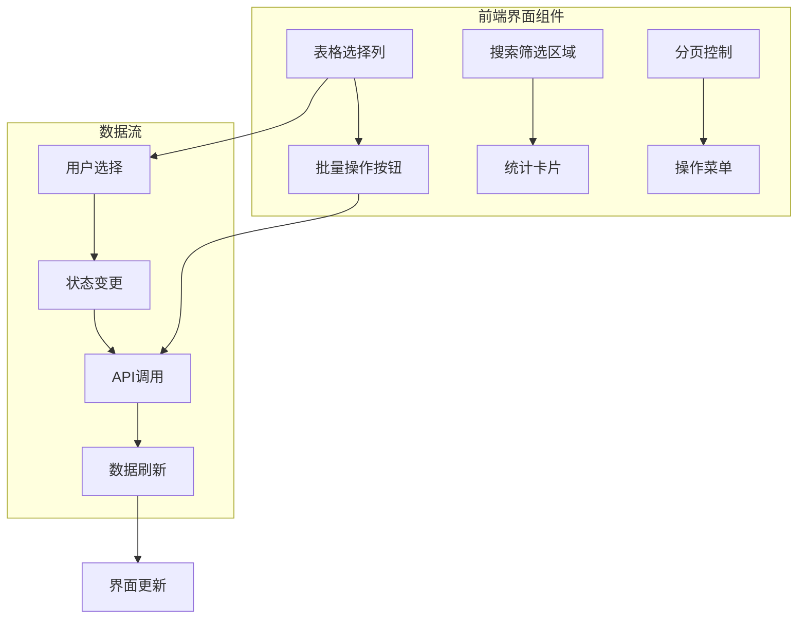
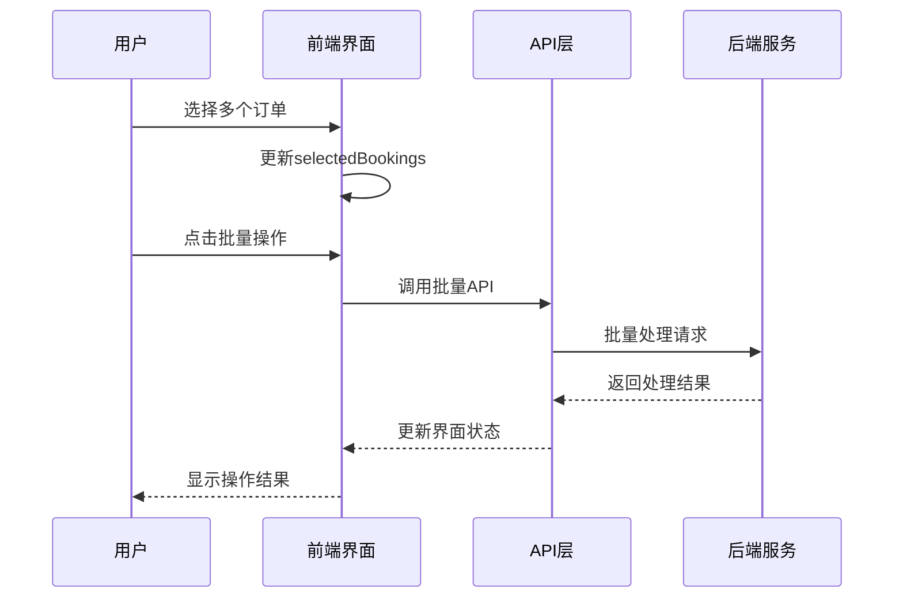
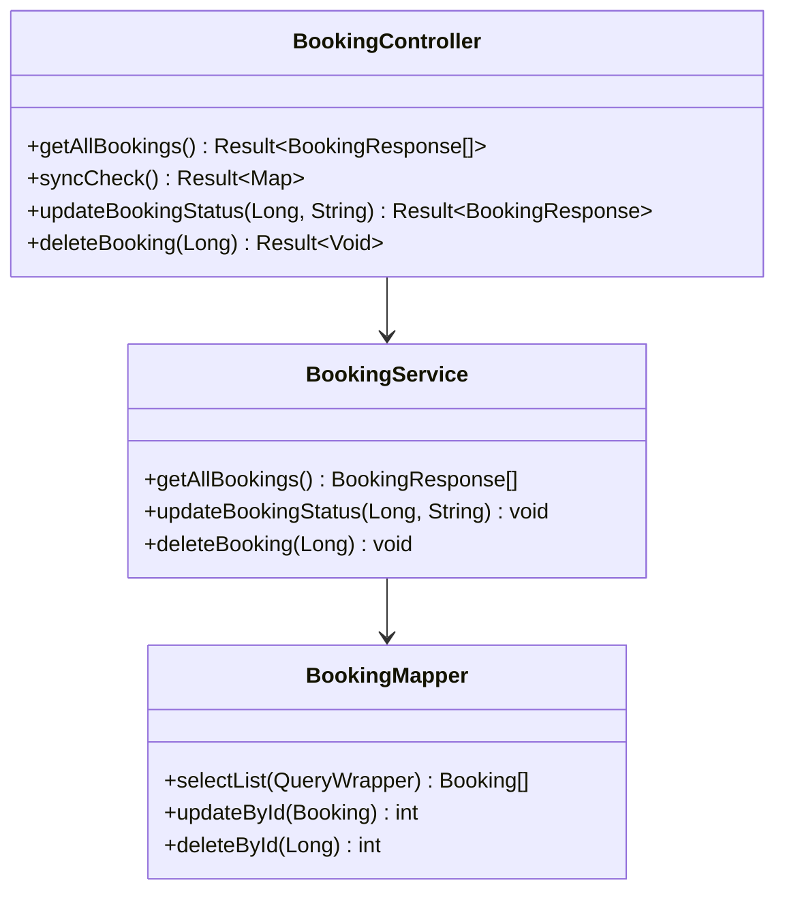
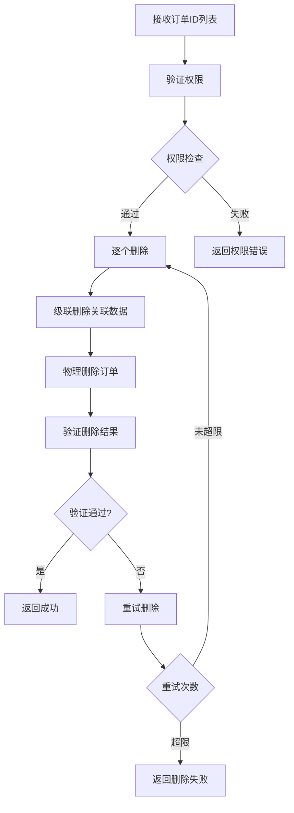
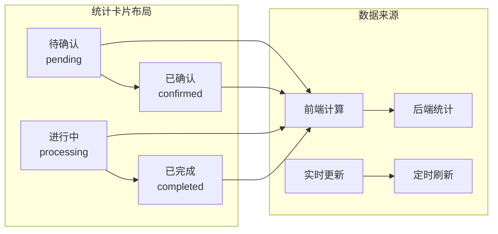
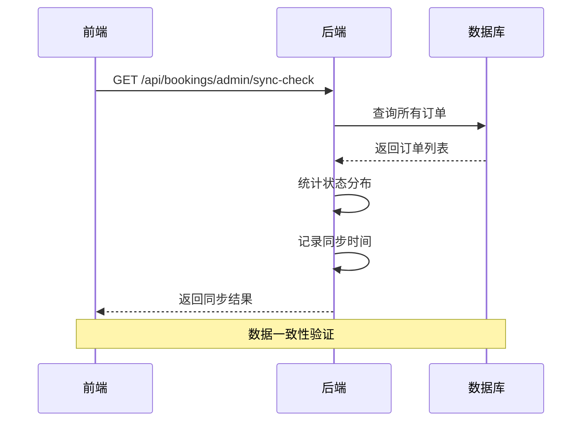
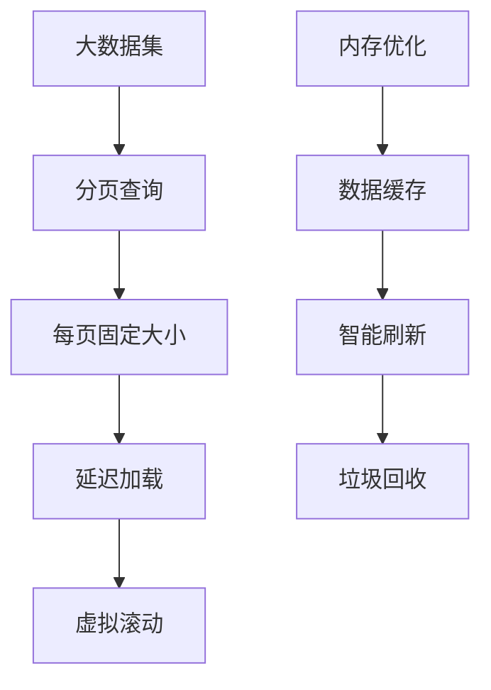

# 批量处理与数据统计

<cite>
**本文档引用的文件**
- [BookingManagement.vue](file://frontend/src/views/admin/BookingManagement.vue)
- [BookingController.java](file://backend/src/main/java/com/carwash/controller/BookingController.java)
- [BookingServiceImpl.java](file://backend/src/main/java/com/carwash/service/impl/BookingServiceImpl.java)
- [BookingResponse.java](file://backend/src/main/java/com/carwash/dto/BookingResponse.java)
- [Booking.java](file://backend/src/main/java/com/carwash/entity/Booking.java)
- [BookingMapper.java](file://backend/src/main/java/com/carwash/mapper/BookingMapper.java)
- [order.js](file://frontend/src/api/order.js)
- [dataSync.js](file://frontend/src/utils/dataSync.js)
- [StatCard.vue](file://frontend/src/components/StatCard.vue)
</cite>

## 目录
1. [系统概述](#系统概述)
2. [前端批量操作功能](#前端批量操作功能)
3. [后端批量操作接口](#后端批量操作接口)
4. [数据统计与分析](#数据统计与分析)
5. [数据同步机制](#数据同步机制)
6. [性能优化策略](#性能优化策略)
7. [故障排除指南](#故障排除指南)

## 系统概述

汽车洗车服务预约系统中的订单管理模块提供了强大的批量操作与数据统计功能。该系统采用前后端分离架构，前端使用Vue.js框架，后端基于Spring Boot构建RESTful API。

### 核心特性

- **批量操作支持**：支持批量取消、批量删除等操作
- **实时数据统计**：提供订单状态分布、收入统计等实时数据
- **智能筛选功能**：支持按状态、时间范围、服务类型等多维度筛选
- **数据同步保障**：确保前后端数据一致性
- **高性能查询**：采用分页查询和缓存策略优化大数据量处理

## 前端批量操作功能

### BookingManagement.vue界面设计

前端订单管理界面提供了直观的批量操作功能，主要包含以下组件：



**图表来源**
- [BookingManagement.vue](file://frontend/src/views/admin/BookingManagement.vue#L146-L262)

### 批量操作实现机制

#### 1. 选择机制
系统通过Element Plus的`el-table`组件实现多选功能：
- 用户可通过复选框选择多个订单
- `handleSelectionChange`方法监听选择变化
- `selectedBookings`响应式数组存储选中项

#### 2. 操作流程


**图表来源**
- [BookingManagement.vue](file://frontend/src/views/admin/BookingManagement.vue#L535-L537)

#### 3. 状态管理
系统实现了乐观更新策略：
- 立即更新本地状态以提升用户体验
- 异步调用后端API进行实际更新
- 失败时自动回滚本地状态

**章节来源**
- [BookingManagement.vue](file://frontend/src/views/admin/BookingManagement.vue#L535-L537)
- [BookingManagement.vue](file://frontend/src/views/admin/BookingManagement.vue#L649-L681)

## 后端批量操作接口

### getAllBookings接口设计

`getAllBookings`接口是批量操作的核心，负责返回全量订单数据：



**图表来源**
- [BookingController.java](file://backend/src/main/java/com/carwash/controller/BookingController.java#L183-L191)
- [BookingServiceImpl.java](file://backend/src/main/java/com/carwash/service/impl/BookingServiceImpl.java#L413-L424)

### 数据返回结构

后端返回的订单数据结构包含以下关键字段：

| 字段名 | 类型 | 描述 | 用途 |
|--------|------|------|------|
| id | Long | 订单唯一标识 | 批量操作识别 |
| orderNo | String | 订单编号 | 用户查询 |
| status | String | 订单状态 | 状态过滤 |
| createTime | LocalDateTime | 创建时间 | 时间筛选 |
| customerName | String | 客户姓名 | 关键字搜索 |
| serviceName | String | 服务名称 | 服务类型筛选 |

**章节来源**
- [BookingResponse.java](file://backend/src/main/java/com/carwash/dto/BookingResponse.java#L17-L129)
- [Booking.java](file://backend/src/main/java/com/carwash/entity/Booking.java#L22-L333)

### 批量删除实现

批量删除功能通过以下步骤实现：



**图表来源**
- [BookingServiceImpl.java](file://backend/src/main/java/com/carwash/service/impl/BookingServiceImpl.java#L427-L514)

**章节来源**
- [BookingServiceImpl.java](file://backend/src/main/java/com/carwash/service/impl/BookingServiceImpl.java#L427-L514)

## 数据统计与分析

### 统计卡片组件

系统提供了四个核心统计卡片，实时展示订单状态分布：



**图表来源**
- [BookingManagement.vue](file://frontend/src/views/admin/BookingManagement.vue#L86-L140)

### 统计计算逻辑

前端统计计算采用JavaScript原生方法：

```javascript
// 统计各状态订单数量
const calculateStats = () => {
  stats.pending = bookings.value.filter(item => item.status === "pending").length;
  stats.confirmed = bookings.value.filter(item => item.status === "confirmed").length;
  stats.processing = bookings.value.filter(item => item.status === "processing").length;
  stats.completed = bookings.value.filter(item => item.status === "completed").length;
};
```

### 后端统计接口

`syncCheck`接口提供更全面的数据同步检查：

| 返回字段 | 类型 | 描述 | 示例值 |
|----------|------|------|--------|
| totalBookings | Integer | 总订单数 | 1250 |
| statusDistribution | Map | 状态分布统计 | {"pending": 300, "confirmed": 500, "completed": 450} |
| lastSyncTime | LocalDateTime | 最后同步时间 | 2024-01-15T14:30:00 |
| syncStatus | String | 同步状态 | "success" |

**章节来源**
- [BookingController.java](file://backend/src/main/java/com/carwash/controller/BookingController.java#L197-L227)
- [BookingManagement.vue](file://frontend/src/views/admin/BookingManagement.vue#L501-L514)

## 数据同步机制

### syncCheck接口设计

数据同步检查接口确保前后端数据一致性：



**图表来源**
- [BookingController.java](file://backend/src/main/java/com/carwash/controller/BookingController.java#L197-L227)

### 状态映射机制

系统实现了前后端状态值的标准化映射：

| 前端状态 | 后端状态 | 描述 |
|----------|----------|------|
| pending | pending | 待确认 |
| confirmed | confirmed | 已确认 |
| in_progress | in_progress | 进行中 |
| processing | in_progress | 兼容旧状态 |
| completed | completed | 已完成 |
| cancelled | cancelled | 已取消 |

**章节来源**
- [dataSync.js](file://frontend/src/utils/dataSync.js#L8-L27)
- [BookingController.java](file://backend/src/main/java/com/carwash/controller/BookingController.java#L197-L227)

## 性能优化策略

### 分页查询优化

系统采用分页查询策略处理大规模数据：



### 缓存策略

1. **前端缓存**：使用响应式数据缓存查询结果
2. **后端缓存**：Redis缓存热点数据
3. **混合缓存**：结合LRU和TTL策略

### 查询优化

后端数据库查询采用索引优化：
- `status`字段建立索引
- `created_at`字段支持时间范围查询
- `deleted`字段支持软删除查询

**章节来源**
- [BookingMapper.java](file://backend/src/main/java/com/carwash/mapper/BookingMapper.java#L28-L108)

## 故障排除指南

### 常见问题及解决方案

#### 1. 数据同步失败
**症状**：前端显示的订单状态与后端不一致
**解决方案**：
- 检查网络连接
- 验证API接口状态
- 查看浏览器控制台错误信息

#### 2. 批量操作超时
**症状**：大量订单批量操作时出现超时
**解决方案**：
- 减少单次批量操作的订单数量
- 增加服务器超时配置
- 使用异步处理机制

#### 3. 统计数据不准确
**症状**：统计卡片显示的数字与实际不符
**解决方案**：
- 检查数据同步状态
- 验证统计计算逻辑
- 清除缓存重新加载

### 监控与调试

系统提供了完善的监控机制：
- 实时数据同步状态监控
- 批量操作执行日志
- 性能指标统计

**章节来源**
- [dataSync.js](file://frontend/src/utils/dataSync.js#L50-L112)
- [BookingController.java](file://backend/src/main/java/com/carwash/controller/BookingController.java#L197-L227)

## 结论

汽车洗车服务预约系统的批量处理与数据统计功能提供了完整的解决方案，通过前后端协同工作，确保了数据的一致性和操作的高效性。系统采用现代化的技术栈，具备良好的可扩展性和维护性，能够满足大规模业务场景的需求。