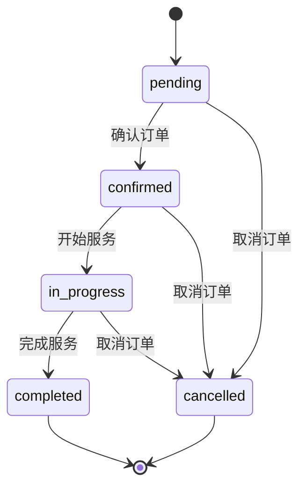
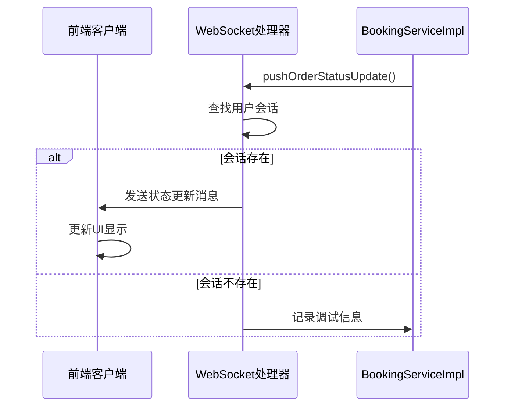
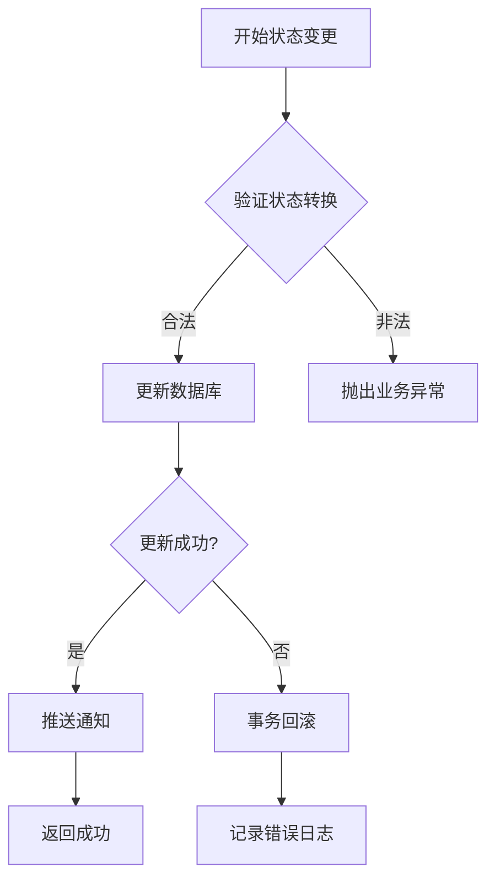

# 订单状态管理与操作

<cite>
**本文档引用文件**   
- [BookingController.java](file://backend/src/main/java/com/carwash/controller/BookingController.java)
- [BookingServiceImpl.java](file://backend/src/main/java/com/carwash/service/impl/BookingServiceImpl.java)
- [Booking.java](file://backend/src/main/java/com/carwash/entity/Booking.java)
- [OrderStatusWebSocketHandler.java](file://backend/src/main/java/com/carwash/websocket/OrderStatusWebSocketHandler.java)
- [SmsService.java](file://backend/src/main/java/com/carwash/service/SmsService.java)
- [SmsServiceImpl.java](file://backend/src/main/java/com/carwash/service/impl/SmsServiceImpl.java)
- [order.js](file://frontend/src/api/order.js)
- [websocket.js](file://frontend/src/utils/websocket.js)
</cite>

## 目录
1. [订单状态全生命周期管理机制](#订单状态全生命周期管理机制)
2. [核心接口实现逻辑分析](#核心接口实现逻辑分析)
3. [状态转换业务校验规则](#状态转换业务校验规则)
4. [前端状态变更按钮显示逻辑](#前端状态变更按钮显示逻辑)
5. [实时推送与通知机制](#实时推送与通知机制)
6. [事务处理与数据一致性保障](#事务处理与数据一致性保障)
7. [状态机健壮性设计](#状态机健壮性设计)

## 订单状态全生命周期管理机制

订单状态的全生命周期管理涵盖了从创建到最终完成或取消的完整流程。系统定义了五种核心状态：待确认（pending）、已确认（confirmed）、进行中（in_progress）、已完成（completed）和已取消（cancelled）。订单创建后初始状态为"待确认"，经过管理员确认后变为"已确认"，服务开始时更新为"进行中"，服务完成后标记为"已完成"，在任何可取消状态下用户或管理员均可将其标记为"已取消"。

状态流转遵循严格的单向路径：`pending → confirmed → in_progress → completed`，同时允许在`pending`和`confirmed`状态下直接取消订单。一旦订单达到"已完成"或"已取消"状态，将无法再进行任何状态变更，确保了业务流程的严谨性和数据的一致性。

**Section sources**
- [Booking.java](file://backend/src/main/java/com/carwash/entity/Booking.java#L95-L98)
- [BookingServiceImpl.java](file://backend/src/main/java/com/carwash/service/impl/BookingServiceImpl.java#L397-L407)

## 核心接口实现逻辑分析

### updateBookingStatus 接口
`updateBookingStatus`接口是管理员更新订单状态的核心入口，位于`BookingController`中。该接口接收订单ID和目标状态作为参数，首先验证状态值的有效性，然后调用服务层进行状态更新。接口通过`@PreAuthorize("hasRole('ADMIN')")`注解确保只有管理员角色才能执行此操作。

### confirmBooking 接口
虽然代码中未直接命名`confirmBooking`接口，但其功能由`updateBookingStatus`实现。当管理员将订单状态从"pending"更新为"confirmed"时，即完成了订单确认操作。系统会记录确认时间，并触发后续的业务流程。

### startService 接口
`startService`功能同样通过`updateBookingStatus`接口实现。当订单状态从"confirmed"更新为"in_progress"时，表示服务已开始。系统会自动设置服务开始时间戳，标志着服务执行阶段的启动。

### completeService 接口
`completeService`操作通过将订单状态更新为"completed"来实现。此操作会设置`completedAt`时间戳，标记服务的完成时间。该状态变更不可逆，确保了已完成订单的完整性。

**Section sources**
- [BookingController.java](file://backend/src/main/java/com/carwash/controller/BookingController.java#L148-L166)
- [BookingServiceImpl.java](file://backend/src/main/java/com/carwash/service/impl/BookingServiceImpl.java#L260-L390)

## 状态转换业务校验规则

### isValidStatusTransition 方法
`BookingServiceImpl`中的`isValidStatusTransition`方法是状态合法性检查的核心。该方法基于状态机模式，定义了所有合法的状态转换规则：

**Diagram sources**
- [BookingServiceImpl.java](file://backend/src/main/java/com/carwash/service/impl/BookingServiceImpl.java#L395-L410)

该方法通过switch-case结构对源状态进行判断，确保只有预定义的转换路径才被允许。例如，从"pending"状态只能转换到"confirmed"或"cancelled"，而"completed"和"cancelled"作为终止状态，不允许任何后续转换。

### 业务规则约束
系统在多个层面实施业务规则约束：
- **取消限制**：只有处于"pending"或"confirmed"状态的订单才能被取消
- **状态终态保护**：已完成和已取消的订单无法再次修改状态
- **数据完整性**：状态变更时会同步更新相应的时间戳字段（如`completedAt`、`cancelledAt`）

**Section sources**
- [BookingServiceImpl.java](file://backend/src/main/java/com/carwash/service/impl/BookingServiceImpl.java#L229-L232)
- [BookingServiceImpl.java](file://backend/src/main/java/com/carwash/service/impl/BookingServiceImpl.java#L395-L410)

## 前端状态变更按钮显示逻辑

前端通过`order.js`中的API封装与后端交互，状态变更按钮的显示逻辑主要由管理员界面的业务逻辑控制。虽然未能找到`BookingManagement.vue`文件，但从`ServiceManagement.vue`的实现模式可以推断，系统采用基于当前状态的条件渲染策略。

前端会根据订单的当前状态动态显示相应的操作按钮：
- **待确认订单**：显示"确认"和"取消"按钮
- **已确认订单**：显示"开始服务"和"取消"按钮
- **进行中订单**：显示"完成服务"和"取消"按钮
- **其他状态**：不显示状态变更按钮

权限控制通过角色验证实现，只有具有管理员角色的用户才能看到和操作这些按钮。前端通过WebSocket实时接收状态变更通知，并自动更新UI，确保用户界面与服务器状态保持同步。

**Section sources**
- [order.js](file://frontend/src/api/order.js#L122-L147)
- [websocket.js](file://frontend/src/utils/websocket.js#L160-L178)

## 实时推送与通知机制

### WebSocket 实时推送
系统通过`OrderStatusWebSocketHandler`实现订单状态的实时推送。当订单状态发生变更时，`BookingServiceImpl`会调用`WebSocketService.pushOrderStatusUpdate`方法，向相关用户的WebSocket会话推送状态更新消息。

**Diagram sources**
- [OrderStatusWebSocketHandler.java](file://backend/src/main/java/com/carwash/websocket/OrderStatusWebSocketHandler.java#L88-L99)
- [BookingServiceImpl.java](file://backend/src/main/java/com/carwash/service/impl/BookingServiceImpl.java#L348-L357)

### 短信通知机制
状态变更时，系统会通过`SmsService`发送短信通知。`SmsServiceImpl`的`sendOrderStatusNotification`方法负责构建包含订单号、状态变更信息和客户姓名的短信内容，并调用短信服务商API发送。

短信模板根据目标状态动态生成：
- **确认通知**："您的订单已确认，我们将按时为您提供服务"
- **服务中通知**："技师正在为您的爱车提供专业服务"
- **完成通知**："感谢您的信任，欢迎再次使用我们的服务"
- **取消通知**："订单已取消，如有疑问请联系客服"

**Section sources**
- [BookingServiceImpl.java](file://backend/src/main/java/com/carwash/service/impl/BookingServiceImpl.java#L359-L389)
- [SmsServiceImpl.java](file://backend/src/main/java/com/carwash/service/impl/SmsServiceImpl.java#L162-L227)

## 事务处理与数据一致性保障

### 事务管理
所有状态变更操作均在`@Transactional(rollbackFor = Exception.class)`注解的事务管理下执行。这确保了数据库操作的原子性，即使在复杂的状态变更流程中，也能保证数据的一致性。

### 数据一致性策略
系统采用多层次的数据一致性保障策略：
1. **数据库约束**：使用逻辑删除标记（deleted字段）而非物理删除
2. **级联操作**：删除订单时会级联删除关联的支付和反馈记录
3. **双重验证**：状态更新后立即查询数据库验证结果
4. **重试机制**：验证失败时尝试重新更新，确保状态同步

### 异常回滚
当发生异常时，事务会自动回滚，确保数据库不会处于不一致状态。系统还实现了详细的日志记录，便于问题排查和审计追踪。

**Diagram sources**
- [BookingServiceImpl.java](file://backend/src/main/java/com/carwash/service/impl/BookingServiceImpl.java#L220-L244)
- [BookingServiceImpl.java](file://backend/src/main/java/com/carwash/service/impl/BookingServiceImpl.java#L304-L312)

**Section sources**
- [BookingServiceImpl.java](file://backend/src/main/java/com/carwash/service/impl/BookingServiceImpl.java#L77-L78)
- [BookingServiceImpl.java](file://backend/src/main/java/com/carwash/service/impl/BookingServiceImpl.java#L220-L244)

## 状态机健壮性设计

系统的状态机设计体现了高度的健壮性，主要体现在以下几个方面：

### 防御性编程
- **输入验证**：对所有状态参数进行有效性检查
- **空值处理**：对用户ID、订单ID等关键字段进行非空验证
- **边界检查**：防止无效的状态转换尝试

### 错误容忍
- **非阻塞通知**：WebSocket推送和短信发送失败不会影响主业务流程
- **优雅降级**：当Redis等外部服务不可用时，核心订单功能仍可正常运行
- **重试机制**：关键操作失败后会尝试重试，提高系统可靠性

### 监控与追踪
- **详细日志**：记录所有状态变更的详细信息，包括操作前后的状态、操作时间和操作原因
- **连接监控**：提供WebSocket连接数统计，便于系统监控
- **数据校验**：定期执行数据同步检查，确保前后端数据一致性

这些设计确保了订单状态管理系统在高并发、网络不稳定等复杂环境下仍能稳定可靠地运行。

**Section sources**
- [BookingController.java](file://backend/src/main/java/com/carwash/controller/BookingController.java#L200-L227)
- [OrderStatusWebSocketHandler.java](file://backend/src/main/java/com/carwash/websocket/OrderStatusWebSocketHandler.java#L124-L126)
- [BookingServiceImpl.java](file://backend/src/main/java/com/carwash/service/impl/BookingServiceImpl.java#L354-L357)
- [BookingServiceImpl.java](file://backend/src/main/java/com/carwash/service/impl/BookingServiceImpl.java#L385-L389)