# 订单管理模块

<cite>
**本文档引用的文件**
- [BookingManagement.vue](file://frontend/src/views/admin/BookingManagement.vue)
- [BookingServiceImpl.java](file://backend/src/main/java/com/carwash/service/impl/BookingServiceImpl.java)
- [Booking.java](file://backend/src/main/java/com/carwash/entity/Booking.java)
- [BookingController.java](file://backend/src/main/java/com/carwash/controller/BookingController.java)
- [AppointmentStatus.java](file://backend/src/main/java/com/carwash/common/enums/AppointmentStatus.java)
- [BookingRequest.java](file://backend/src/main/java/com/carwash/dto/BookingRequest.java)
- [BookingResponse.java](file://backend/src/main/java/com/carwash/dto/BookingResponse.java)
- [BookingMapper.java](file://backend/src/main/java/com/carwash/mapper/BookingMapper.java)
- [BookingService.java](file://backend/src/main/java/com/carwash/service/BookingService.java)
- [TimeUtils.java](file://backend/src/main/java/com/carwash/utils/TimeUtils.java)
- [order.js](file://frontend/src/api/order.js)
</cite>

## 目录
1. [概述](#概述)
2. [系统架构](#系统架构)
3. [前端订单管理界面](#前端订单管理界面)
4. [后端订单服务实现](#后端订单服务实现)
5. [订单状态流转机制](#订单状态流转机制)
6. [数据模型与关联关系](#数据模型与关联关系)
7. [业务规则与约束](#业务规则与约束)
8. [日志记录与监控](#日志记录与监控)
9. [性能优化策略](#性能优化策略)
10. [故障排除指南](#故障排除指南)

## 概述

订单管理模块是汽车洗车服务预约系统的核心功能组件，负责管理客户预约的全生命周期。该模块采用前后端分离架构，前端使用Vue.js框架构建交互式管理界面，后端基于Spring Boot提供RESTful API服务。

### 主要功能特性

- **全生命周期管理**：支持预约从创建到完成的完整流程
- **状态流转控制**：严格的订单状态转换规则确保业务逻辑正确性
- **实时数据同步**：通过WebSocket实现实时状态更新通知
- **权限控制**：基于角色的访问控制，区分普通用户和管理员权限
- **数据统计分析**：提供丰富的统计报表和数据分析功能
- **操作日志记录**：完整的操作轨迹追踪和审计功能

## 系统架构

订单管理模块采用分层架构设计，包含表现层、业务逻辑层、数据访问层和数据库层。

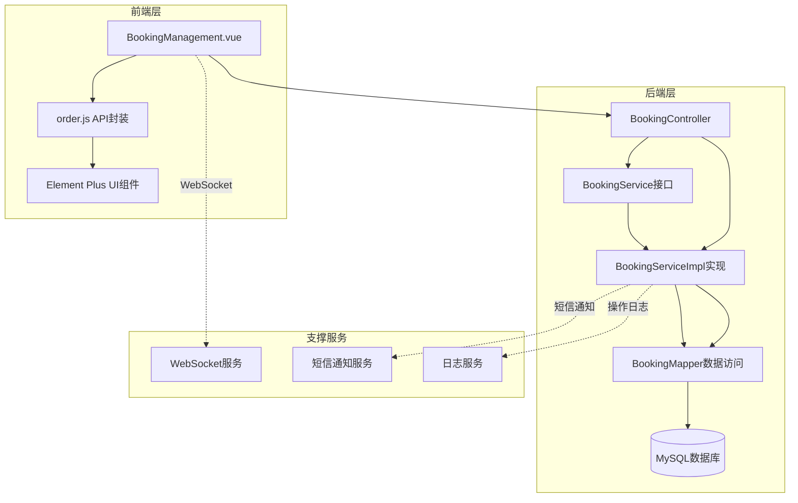

**图表来源**
- [BookingManagement.vue](file://frontend/src/views/admin/BookingManagement.vue#L1-L50)
- [BookingController.java](file://backend/src/main/java/com/carwash/controller/BookingController.java#L1-L50)
- [BookingServiceImpl.java](file://backend/src/main/java/com/carwash/service/impl/BookingServiceImpl.java#L1-L50)

## 前端订单管理界面

### 组件结构与功能

前端订单管理界面由BookingManagement.vue组件实现，提供直观的管理操作界面。

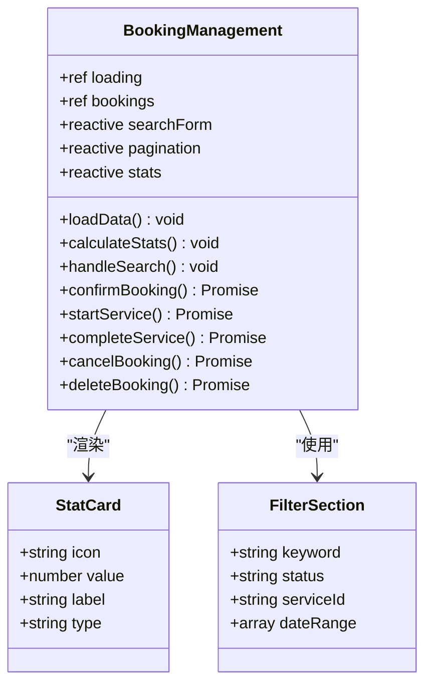

**图表来源**
- [BookingManagement.vue](file://frontend/src/views/admin/BookingManagement.vue#L380-L450)

### 统计卡片组件

系统提供四个核心统计卡片，实时展示各类订单状态的数量分布：

| 统计指标 | 显示图标 | 颜色主题 | 数据来源 |
|---------|---------|---------|----------|
| 待确认订单 | ⏳ Clock | 黄色 | `stats.pending` |
| 已确认订单 | ✅ Check | 蓝色 | `stats.confirmed` |
| 进行中订单 | 🔄 Loading | 青色 | `stats.processing` |
| 已完成订单 | ✔️ CircleCheck | 绿色 | `stats.completed` |

### 筛选条件与搜索功能

前端提供多层次的筛选和搜索功能：

- **关键词搜索**：支持客户姓名、手机号、订单号的模糊匹配
- **状态筛选**：按订单状态（待确认、已确认、进行中、已完成、已取消）过滤
- **服务类型筛选**：按具体服务项目分类
- **时间范围筛选**：支持自定义日期范围查询

### 操作按钮组设计

每个订单行都提供相应的操作按钮，根据当前状态动态显示：

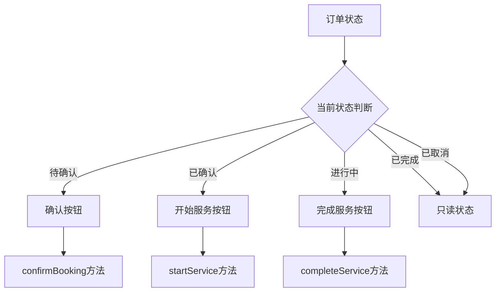

**图表来源**
- [BookingManagement.vue](file://frontend/src/views/admin/BookingManagement.vue#L193-L245)

**章节来源**
- [BookingManagement.vue](file://frontend/src/views/admin/BookingManagement.vue#L1-L869)

## 后端订单服务实现

### 核心服务类架构

后端订单服务由BookingServiceImpl类实现，提供完整的订单管理业务逻辑。

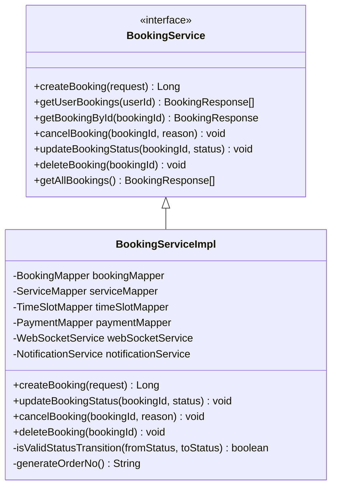

**图表来源**
- [BookingService.java](file://backend/src/main/java/com/carwash/service/BookingService.java#L1-L60)
- [BookingServiceImpl.java](file://backend/src/main/java/com/carwash/service/impl/BookingServiceImpl.java#L45-L100)

### 订单创建流程

订单创建过程包含严格的验证和初始化步骤：

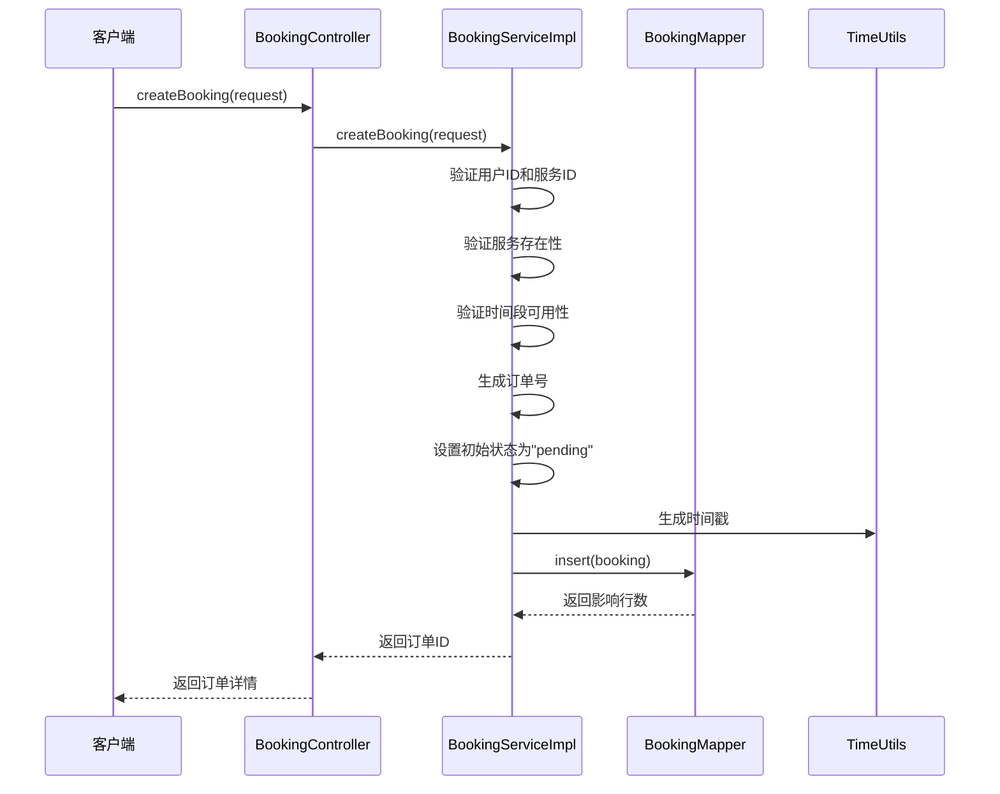

**图表来源**
- [BookingServiceImpl.java](file://backend/src/main/java/com/carwash/service/impl/BookingServiceImpl.java#L77-L175)
- [BookingController.java](file://backend/src/main/java/com/carwash/controller/BookingController.java#L38-L63)

### 事务处理与数据一致性

所有订单状态变更操作都采用@Transactional注解确保数据一致性：

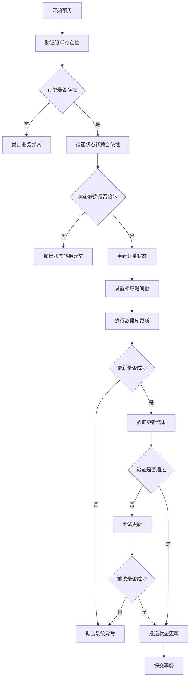

**图表来源**
- [BookingServiceImpl.java](file://backend/src/main/java/com/carwash/service/impl/BookingServiceImpl.java#L259-L390)

**章节来源**
- [BookingServiceImpl.java](file://backend/src/main/java/com/carwash/service/impl/BookingServiceImpl.java#L1-L598)
- [BookingService.java](file://backend/src/main/java/com/carwash/service/BookingService.java#L1-L60)

## 订单状态流转机制

### 状态定义与转换规则

系统定义了五个核心订单状态，每种状态都有明确的业务含义和转换规则。

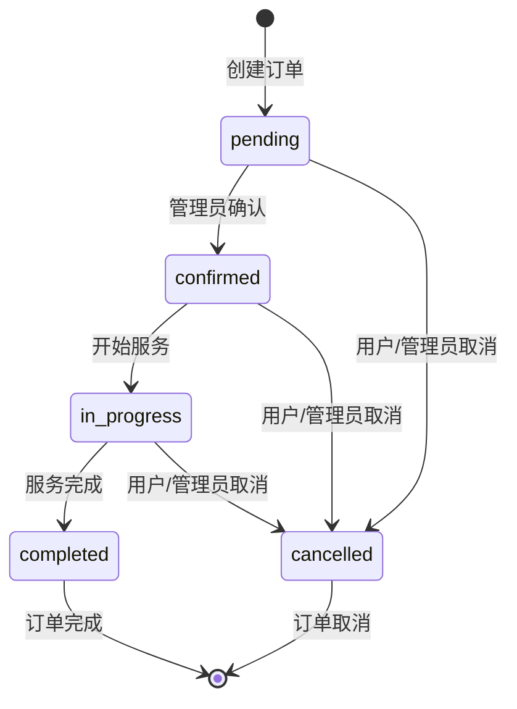

**图表来源**
- [AppointmentStatus.java](file://backend/src/main/java/com/carwash/common/enums/AppointmentStatus.java#L11-L15)
- [BookingServiceImpl.java](file://backend/src/main/java/com/carwash/service/impl/BookingServiceImpl.java#L392-L411)

### 关键业务方法实现

#### confirmBooking方法
负责将待确认订单状态变更为已确认：

- 验证订单当前状态必须为"pending"
- 更新订单状态为"confirmed"
- 设置确认时间戳
- 推送状态更新通知给相关用户

#### startService方法  
启动服务流程的关键步骤：

- 验证订单当前状态必须为"confirmed"
- 更新订单状态为"in_progress"
- 设置服务开始时间戳
- 触发相关业务通知

#### completeService方法
完成服务的标准流程：

- 验证订单当前状态必须为"processing"
- 更新订单状态为"completed"
- 设置完成时间戳
- 触发支付确认和评价邀请

### 状态转换验证机制

系统实现了严格的状态转换验证，防止非法状态变更：

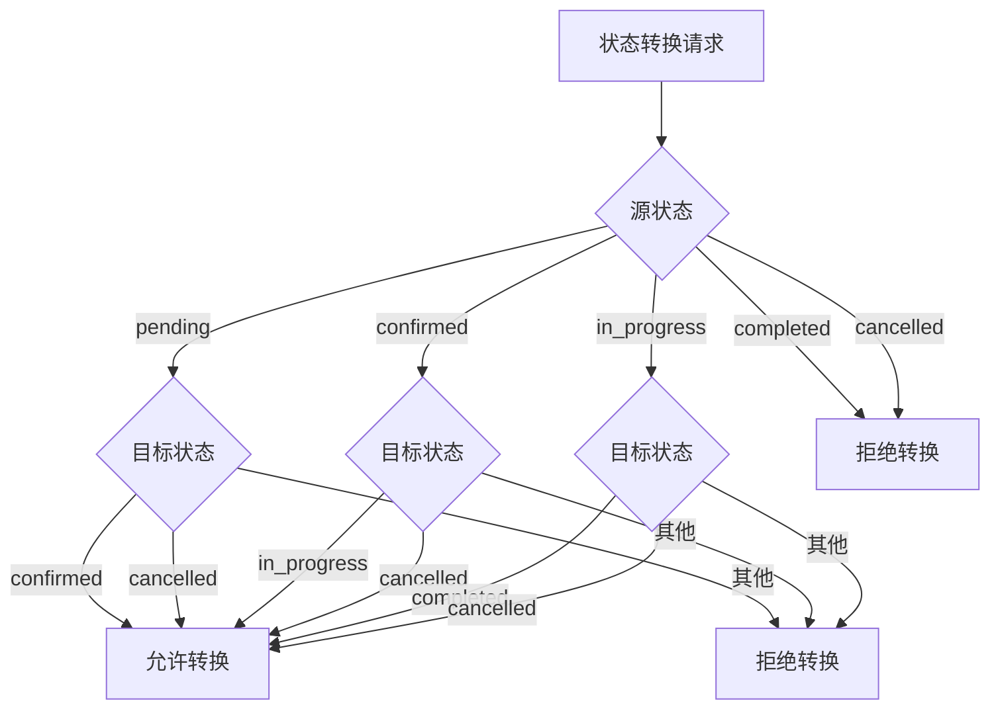

**图表来源**
- [BookingServiceImpl.java](file://backend/src/main/java/com/carwash/service/impl/BookingServiceImpl.java#L392-L411)

**章节来源**
- [BookingServiceImpl.java](file://backend/src/main/java/com/carwash/service/impl/BookingServiceImpl.java#L259-L390)
- [AppointmentStatus.java](file://backend/src/main/java/com/carwash/common/enums/AppointmentStatus.java#L1-L44)

## 数据模型与关联关系

### 核心实体模型

订单管理系统基于Booking实体类构建，包含完整的业务属性和关联关系。

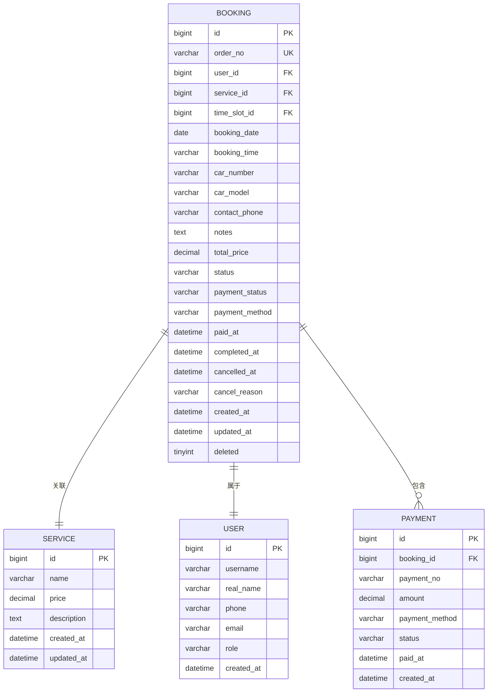

**图表来源**
- [Booking.java](file://backend/src/main/java/com/carwash/entity/Booking.java#L21-L333)
- [BookingMapper.java](file://backend/src/main/java/com/carwash/mapper/BookingMapper.java#L22-L108)

### 数据关联关系详解

#### 订单与服务的关联
- **一对多关系**：一个服务可以对应多个订单
- **级联查询**：通过serviceId关联查询服务详细信息
- **价格同步**：订单创建时复制服务价格到total_price字段

#### 订单与用户的关联
- **外键约束**：user_id字段建立与用户的关联
- **权限验证**：确保用户只能操作自己的订单
- **通知机制**：通过用户信息发送状态变更通知

#### 订单与支付的关联
- **一对一关系**：每个订单对应唯一的支付记录
- **状态同步**：支付状态与订单状态保持一致
- **退款处理**：支持部分或全额退款操作

### 数据库索引策略

为优化查询性能，系统在关键字段上建立了适当的索引：

| 表名 | 索引字段 | 索引类型 | 用途 |
|------|---------|---------|------|
| bookings | order_no | 唯一索引 | 快速订单号查询 |
| bookings | user_id | 普通索引 | 用户订单查询 |
| bookings | status | 普通索引 | 状态筛选查询 |
| bookings | booking_date | 普通索引 | 日期范围查询 |
| bookings | created_at | 普通索引 | 时间排序查询 |

**章节来源**
- [Booking.java](file://backend/src/main/java/com/carwash/entity/Booking.java#L1-L333)
- [BookingMapper.java](file://backend/src/main/java/com/carwash/mapper/BookingMapper.java#L1-L108)

## 业务规则与约束

### 订单取消规则

系统实现了严格的订单取消规则，保护商家和客户的权益：

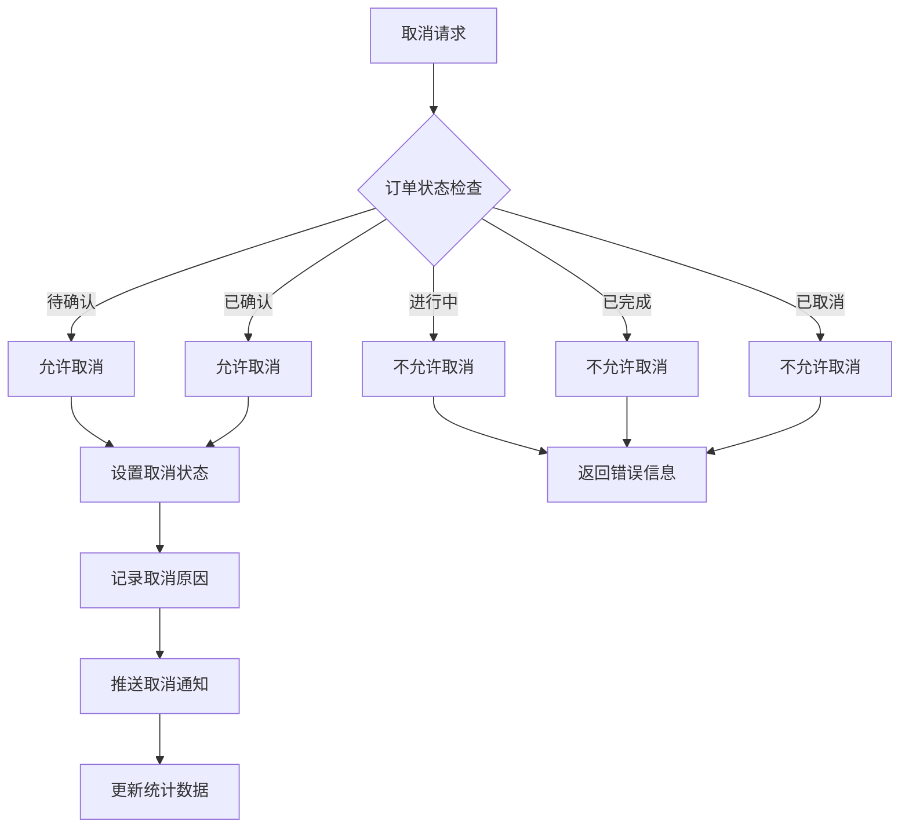

**图表来源**
- [BookingServiceImpl.java](file://backend/src/main/java/com/carwash/service/impl/BookingServiceImpl.java#L220-L245)

### 时间段预约限制

系统对时间段预约进行了严格控制：

- **最大预约数限制**：每个时间段最多允许N个预约
- **时间冲突检测**：自动检测时间段重叠情况
- **状态验证**：只有可用时间段才能被预约

### 数据完整性约束

系统通过多种机制确保数据完整性：

1. **逻辑删除**：采用deleted字段实现软删除
2. **状态验证**：严格的业务状态转换验证
3. **事务控制**：关键操作采用数据库事务
4. **并发控制**：防止并发修改导致的数据不一致

### 权限控制机制

系统实现了基于角色的权限控制：

- **用户权限**：只能查看和操作自己的订单
- **管理员权限**：可以管理所有订单和系统配置
- **操作审计**：记录所有权限相关操作

**章节来源**
- [BookingServiceImpl.java](file://backend/src/main/java/com/carwash/service/impl/BookingServiceImpl.java#L220-L245)
- [BookingServiceImpl.java](file://backend/src/main/java/com/carwash/service/impl/BookingServiceImpl.java#L100-L140)

## 日志记录与监控

### 操作日志体系

系统建立了完整的操作日志体系，记录所有关键业务操作：

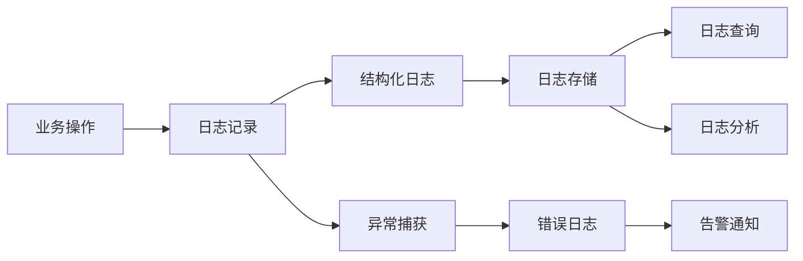

### 关键操作日志内容

每次重要操作都会记录详细的日志信息：

| 操作类型 | 日志级别 | 记录内容 |
|---------|---------|----------|
| 订单创建 | INFO | 请求参数、生成的订单ID、创建时间 |
| 状态变更 | INFO | 订单ID、原状态、新状态、变更时间 |
| 订单取消 | WARN | 取消原因、操作用户、取消时间 |
| 订单删除 | ERROR | 删除原因、操作用户、删除时间 |
| 异常操作 | ERROR | 异常堆栈、错误原因、操作上下文 |

### 实时状态通知

系统通过WebSocket提供实时状态通知功能：

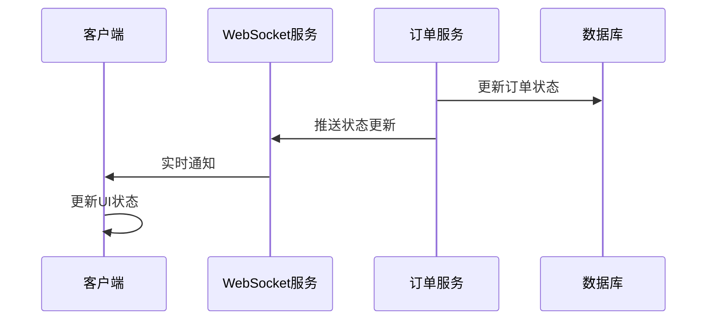

**图表来源**
- [BookingServiceImpl.java](file://backend/src/main/java/com/carwash/service/impl/BookingServiceImpl.java#L348-L357)

### 监控指标体系

系统收集关键监控指标：

- **订单量统计**：每日、每月订单数量趋势
- **状态分布**：各状态订单占比分析
- **响应时间**：API接口平均响应时间
- **错误率**：业务操作失败率统计

**章节来源**
- [BookingServiceImpl.java](file://backend/src/main/java/com/carwash/service/impl/BookingServiceImpl.java#L348-L390)
- [BookingServiceImpl.java](file://backend/src/main/java/com/carwash/service/impl/BookingServiceImpl.java#L427-L514)

## 性能优化策略

### 查询性能优化

系统采用多种策略提升查询性能：

1. **索引优化**：在常用查询字段上建立适当索引
2. **分页查询**：大数据量场景下采用分页查询
3. **缓存策略**：对频繁查询的数据建立缓存
4. **SQL优化**：避免N+1查询问题，使用批量查询

### 并发处理优化

针对高并发场景的优化措施：

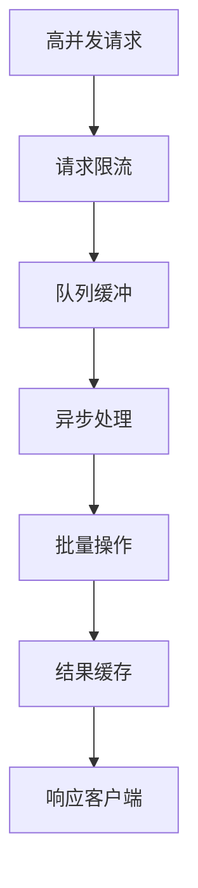

### 内存使用优化

- **对象池化**：复用常用对象减少GC压力
- **懒加载**：按需加载关联数据
- **内存监控**：定期检查内存使用情况

### 数据库连接优化

- **连接池配置**：合理配置数据库连接池参数
- **读写分离**：分离读写操作提升性能
- **事务隔离**：选择合适的事务隔离级别

## 故障排除指南

### 常见问题诊断

#### 订单状态更新失败

**症状**：订单状态无法正常更新
**可能原因**：
1. 状态转换规则不满足
2. 数据库连接异常
3. 并发冲突导致更新失败

**解决方案**：
1. 检查订单当前状态是否符合转换规则
2. 验证数据库连接状态
3. 查看应用日志定位具体错误

#### WebSocket通知失败

**症状**：订单状态变更后客户端未收到通知
**可能原因**：
1. WebSocket连接断开
2. 网络防火墙阻断
3. 客户端未正确处理消息

**解决方案**：
1. 检查WebSocket连接状态
2. 验证网络连通性
3. 更新客户端WebSocket处理逻辑

#### 订单创建超时

**症状**：订单创建请求长时间无响应
**可能原因**：
1. 数据库锁等待
2. 服务资源不足
3. 外部依赖服务异常

**解决方案**：
1. 检查数据库锁情况
2. 监控系统资源使用
3. 验证外部服务状态

### 性能问题排查

#### 查询响应慢

**排查步骤**：
1. 检查SQL执行计划
2. 分析索引使用情况
3. 监控数据库负载

#### 内存泄漏

**排查步骤**：
1. 监控JVM内存使用
2. 分析堆内存快照
3. 检查对象引用链

### 监控告警配置

建议配置以下监控告警：

| 监控指标 | 告警阈值 | 告警级别 |
|---------|---------|---------|
| 订单创建失败率 | >5% | 警告 |
| API响应时间 | >2秒 | 警告 |
| WebSocket连接数 | >1000 | 严重 |
| 数据库连接池使用率 | >80% | 警告 |

**章节来源**
- [BookingServiceImpl.java](file://backend/src/main/java/com/carwash/service/impl/BookingServiceImpl.java#L259-L390)
- [BookingServiceImpl.java](file://backend/src/main/java/com/carwash/service/impl/BookingServiceImpl.java#L427-L514)

## 结论

订单管理模块作为汽车洗车服务预约系统的核心功能，实现了完整的订单生命周期管理。通过前后端分离架构、严格的业务规则控制、完善的日志记录和监控体系，确保了系统的稳定性、安全性和可维护性。

该模块的主要优势包括：

1. **完整的业务覆盖**：涵盖订单创建、状态流转、取消删除等全流程
2. **严格的数据一致性**：通过事务控制和状态验证确保数据准确性
3. **实时的用户体验**：基于WebSocket的实时通知机制
4. **强大的监控能力**：全方位的日志记录和性能监控
5. **良好的扩展性**：模块化设计便于功能扩展和维护

未来可以考虑的优化方向：

- 引入分布式缓存提升查询性能
- 实现订单预测分析功能
- 增强移动端适配能力
- 完善自动化测试体系