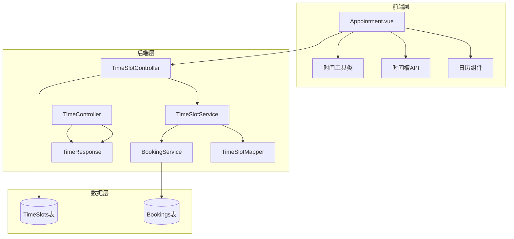
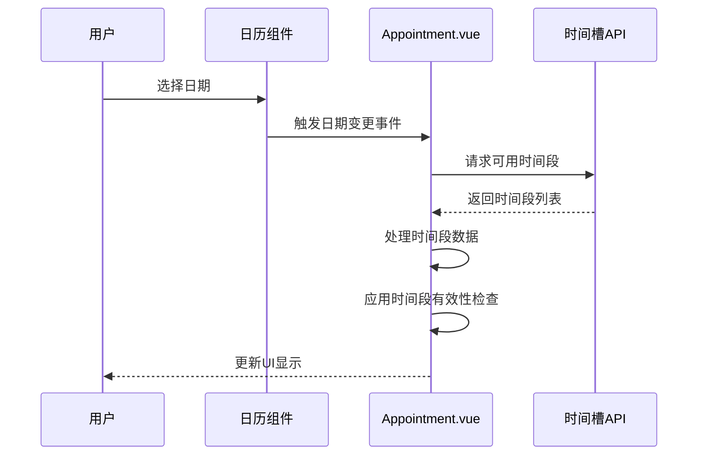
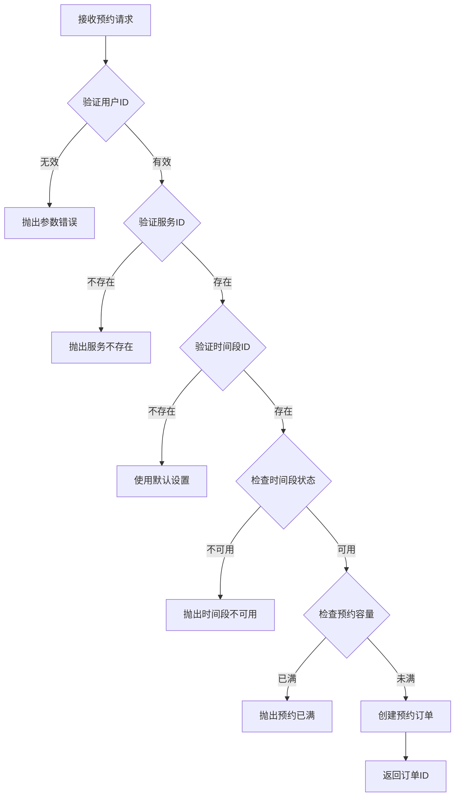
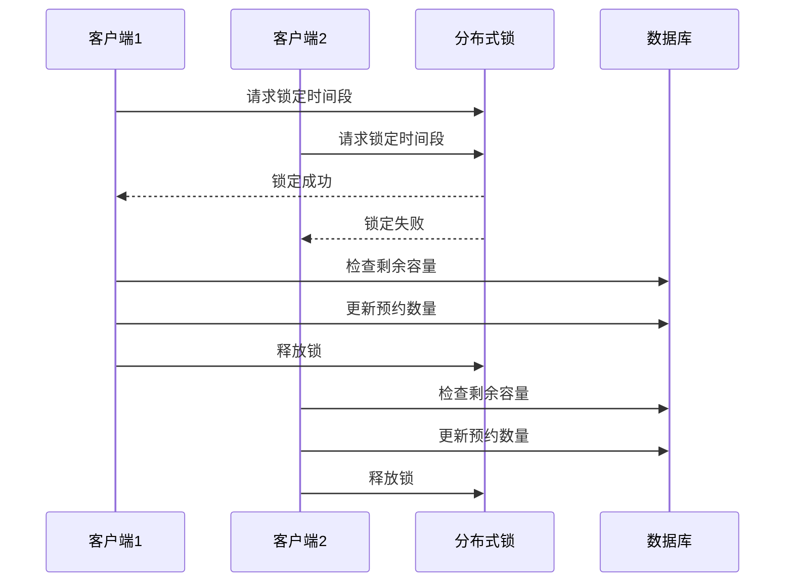
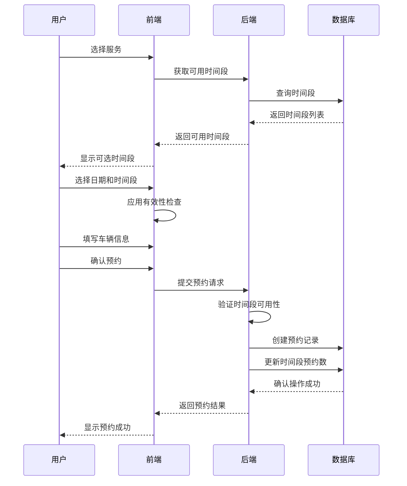

# 时间槽处理机制

<cite>
**本文档中引用的文件**
- [Appointment.vue](file://frontend/src/views/Appointment.vue)
- [TimeSlot.java](file://backend/src/main/java/com/carwash/entity/TimeSlot.java)
- [TimeSlotController.java](file://backend/src/main/java/com/carwash/controller/TimeSlotController.java)
- [TimeSlotServiceImpl.java](file://backend/src/main/java/com/carwash/service/impl/TimeSlotServiceImpl.java)
- [TimeSlotService.java](file://backend/src/main/java/com/carwash/service/TimeSlotService.java)
- [TimeSlotMapper.java](file://backend/src/main/java/com/carwash/mapper/TimeSlotMapper.java)
- [BookingServiceImpl.java](file://backend/src/main/java/com/carwash/service/impl/BookingServiceImpl.java)
- [TimeController.java](file://backend/src/main/java/com/carwash/controller/TimeController.java)
- [TimeResponse.java](file://backend/src/main/java/com/carwash/dto/TimeResponse.java)
- [timeSlots.js](file://frontend/src/api/timeSlots.js)
- [timeUtils.js](file://frontend/src/utils/timeUtils.js)
</cite>

## 目录
1. [概述](#概述)
2. [系统架构](#系统架构)
3. [前端时间槽处理](#前端时间槽处理)
4. [后端时间槽验证](#后端时间槽验证)
5. [时间同步机制](#时间同步机制)
6. [高并发处理策略](#高并发处理策略)
7. [完整流程分析](#完整流程分析)
8. [最佳实践建议](#最佳实践建议)

## 概述

时间槽（TimeSlot）处理机制是汽车洗车服务预约系统的核心功能之一，负责管理可预约的时间段、验证时间段的可用性，并确保预约过程的准确性和可靠性。该机制涉及前端日历组件的选择、后端的严格验证逻辑，以及前后端的时间同步。

## 系统架构

**图表来源**
- [Appointment.vue](file://frontend/src/views/Appointment.vue#L1-L50)
- [TimeSlotController.java](file://backend/src/main/java/com/carwash/controller/TimeSlotController.java#L1-L39)
- [TimeSlotServiceImpl.java](file://backend/src/main/java/com/carwash/service/impl/TimeSlotServiceImpl.java#L1-L50)

## 前端时间槽处理

### 日历组件集成

前端Appointment.vue组件集成了Element Plus的日历组件，为用户提供直观的日期选择界面。用户可以通过点击日历上的日期来选择预约时间。

**图表来源**
- [Appointment.vue](file://frontend/src/views/Appointment.vue#L68-L90)
- [timeSlots.js](file://frontend/src/api/timeSlots.js#L11-L15)

### 时间段数据处理

前端通过`loadAvailableTimeSlots`方法动态加载指定日期的可用时间段：

**节来源**
- [Appointment.vue](file://frontend/src/views/Appointment.vue#L472-L506)

关键处理逻辑包括：
1. **时间段映射**：将后端返回的时间段数据转换为前端可用格式
2. **可用性计算**：`available = maxBookings - currentBookings`
3. **状态标记**：区分忙碌、禁用和可用状态
4. **过时检查**：动态禁用已过时的时间段

### 动态时间段有效性检查

前端实现了智能的时间段有效性检查机制：

**节来源**
- [Appointment.vue](file://frontend/src/views/Appointment.vue#L508-L529)

主要特性：
- **当日时间过滤**：只对当天选择的日期应用过时检查
- **服务器时间同步**：基于服务器时间判断时间段有效性
- **实时更新**：每秒刷新一次，确保时间准确性

## 后端时间槽验证

### 时间段实体结构

后端TimeSlot实体定义了完整的时段信息模型：

**节来源**
- [TimeSlot.java](file://backend/src/main/java/com/carwash/entity/TimeSlot.java#L21-L62)

核心字段说明：
- `date`: 预约日期
- `startTime/endTime`: 时间段起止时间
- `maxBookings`: 最大预约数量
- `currentBookings`: 当前已预约数量
- `status`: 状态（0-不可用，1-可用）

### 时间段查询逻辑

后端通过专门的服务层实现时间段查询：

**节来源**
- [TimeSlotServiceImpl.java](file://backend/src/main/java/com/carwash/service/impl/TimeSlotServiceImpl.java#L61-L67)

查询条件：
1. **日期匹配**：精确匹配指定日期
2. **状态检查**：仅查询状态为1（可用）的时间段
3. **软删除过滤**：排除已标记删除的记录
4. **容量检查**：`current_bookings < max_bookings`

### 预约创建时的验证

后端在创建预约时执行严格的验证逻辑：

**节来源**
- [BookingServiceImpl.java](file://backend/src/main/java/com/carwash/service/impl/BookingServiceImpl.java#L100-L116)

验证步骤：
1. **时间段存在性检查**：确认时间段ID对应的有效记录
2. **状态验证**：检查时间段是否处于可用状态（status=1）
3. **容量验证**：确保当前预约数未达到最大限制
4. **事务保证**：使用数据库事务确保数据一致性

**图表来源**
- [BookingServiceImpl.java](file://backend/src/main/java/com/carwash/service/impl/BookingServiceImpl.java#L78-L174)

## 时间同步机制

### 前后端时间同步

系统实现了完善的时间同步机制，确保前后端时间的一致性：

**节来源**
- [TimeController.java](file://backend/src/main/java/com/carwash/controller/TimeController.java#L26-L38)
- [TimeResponse.java](file://backend/src/main/java/com/carwash/dto/TimeResponse.java#L12-L58)

同步特性：
- **服务器时间获取**：提供精确的服务器当前时间
- **时间戳支持**：支持毫秒级时间戳
- **ISO格式兼容**：确保跨平台时间格式一致性
- **时区信息**：明确标识系统时区

### 前端时间工具类

前端实现了专门的时间工具类，处理时间格式化和同步：

**节来源**
- [timeUtils.js](file://frontend/src/utils/timeUtils.js#L38-L277)

核心功能：
- **本地时间管理**：基于系统时区处理时间
- **格式化支持**：多种时间格式输出
- **相对时间计算**：提供人性化时间描述
- **时间戳转换**：支持时间对象与时间戳互转

## 高并发处理策略

### 分布式锁机制

在高并发场景下，系统需要防止超卖现象，推荐使用分布式锁：

### 数据库层面的并发控制

后端通过数据库层面的并发控制确保数据一致性：

**节来源**
- [TimeSlotMapper.java](file://backend/src/main/java/com/carwash/mapper/TimeSlotMapper.java#L37-L50)

关键SQL操作：
- **原子性更新**：`UPDATE time_slots SET current_bookings = current_bookings + 1`
- **乐观锁**：利用数据库的版本控制机制
- **事务隔离**：使用适当的事务隔离级别

### 缓存策略

为了提高性能，建议采用以下缓存策略：

1. **时间段缓存**：缓存每日可用时间段列表
2. **容量缓存**：缓存每个时间段的剩余容量
3. **过期策略**：设置合理的缓存过期时间
4. **缓存失效**：在数据变更时及时清理缓存

## 完整流程分析

### 用户预约完整流程

**图表来源**
- [Appointment.vue](file://frontend/src/views/Appointment.vue#L667-L781)
- [BookingServiceImpl.java](file://backend/src/main/java/com/carwash/service/impl/BookingServiceImpl.java#L78-L174)

### 时间槽计算公式

系统使用以下公式计算可用时间段：

**可用时间段数量** = `maxBookings - currentBookings`

这个公式的含义：
- **maxBookings**：时间段的最大预约容量
- **currentBookings**：当前已预约的数量
- **可用数量**：剩余可预约的座位数

当计算结果小于等于0时，表示该时间段已满，系统会将其标记为"忙碌"状态。

## 最佳实践建议

### 性能优化建议

1. **数据库索引优化**
   - 在`time_slots`表上为`date`、`status`、`deleted`字段建立复合索引
   - 为`current_bookings`和`max_bookings`字段建立索引

2. **缓存策略**
   - 缓存每日可用时间段列表，减少数据库查询
   - 实现缓存预热机制，在系统启动时加载未来30天的时间段数据

3. **批量操作**
   - 对于大量时间段的查询，考虑使用批量查询优化

### 错误处理策略

1. **网络异常处理**
   - 实现重试机制，对网络请求失败进行自动重试
   - 提供友好的错误提示，避免技术术语

2. **数据一致性保障**
   - 使用数据库事务确保预约操作的原子性
   - 实现补偿机制，处理异常情况下的数据回滚

### 监控和告警

1. **关键指标监控**
   - 时间段可用性监控
   - 预约成功率统计
   - 并发访问量监控

2. **异常告警**
   - 数据库连接异常告警
   - 关键操作失败告警
   - 性能指标异常告警

### 安全考虑

1. **输入验证**
   - 严格验证所有用户输入参数
   - 防止SQL注入和XSS攻击

2. **权限控制**
   - 确保只有授权用户才能创建预约
   - 实现适当的访问控制机制

通过以上机制和策略，汽车洗车服务预约系统能够提供稳定、可靠的时间槽处理能力，确保用户体验的同时维护系统的数据完整性。