# 预约创建流程

<cite>
**本文档引用的文件**
- [Appointment.vue](file://frontend/src/views/Appointment.vue)
- [realApi.js](file://frontend/src/api/realApi.js)
- [BookingController.java](file://backend/src/main/java/com/carwash/controller/BookingController.java)
- [BookingServiceImpl.java](file://backend/src/main/java/com/carwash/service/impl/BookingServiceImpl.java)
- [BookingRequest.java](file://backend/src/main/java/com/carwash/dto/BookingRequest.java)
- [Booking.java](file://backend/src/main/java/com/carwash/entity/Booking.java)
- [BookingMapper.java](file://backend/src/main/java/com/carwash/mapper/BookingMapper.java)
- [orderSync.js](file://frontend/src/utils/orderSync.js)
</cite>

## 目录
1. [概述](#概述)
2. [前端预约表单架构](#前端预约表单架构)
3. [多步骤表单流程](#多步骤表单流程)
4. [后端事务处理机制](#后端事务处理机制)
5. [订单创建API调用](#订单创建api调用)
6. [订单状态跳转逻辑](#订单状态跳转逻辑)
7. [并发控制与冲突检测](#并发控制与冲突检测)
8. [错误处理与解决方案](#错误处理与解决方案)
9. [性能优化策略](#性能优化策略)
10. [总结](#总结)

## 概述

预约创建流程是汽车洗车服务预约系统的核心功能，采用前后端分离架构，通过Vue.js前端组件和Spring Boot后端服务实现完整的预约体验。该流程包含多步骤表单收集、参数验证、事务处理、状态管理和实时数据同步等多个关键环节。

## 前端预约表单架构

### 组件结构设计

前端预约表单采用模块化设计，主要由Appointment.vue组件实现，包含以下核心模块：

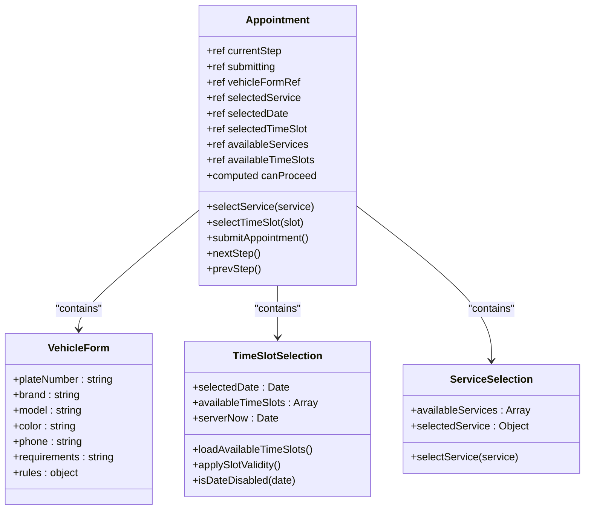

**图表来源**
- [Appointment.vue](file://frontend/src/views/Appointment.vue#L337-L800)

### 表单状态管理

表单采用响应式状态管理，通过Vue 3的Composition API实现：

- **步骤状态**：currentStep控制当前显示的表单步骤
- **提交状态**：submitting防止重复提交
- **验证状态**：canProceed控制下一步按钮的启用状态
- **数据绑定**：双向绑定收集用户输入

**章节来源**
- [Appointment.vue](file://frontend/src/views/Appointment.vue#L353-L550)

## 多步骤表单流程

### 步骤1：服务选择

用户从预定义的服务列表中选择合适的洗车服务：

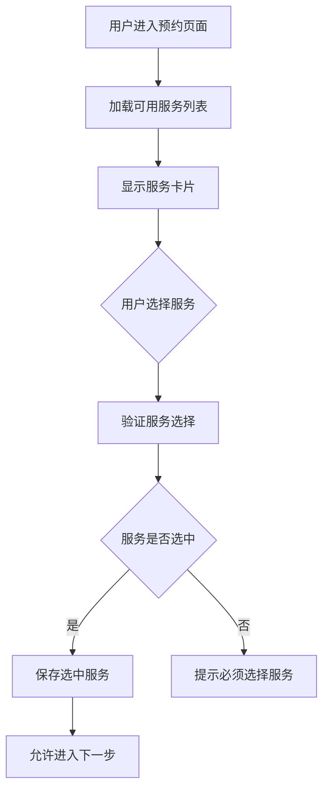

**图表来源**
- [Appointment.vue](file://frontend/src/views/Appointment.vue#L28-L110)

### 步骤2：时间槽选择

基于所选服务和日期，动态加载可用的时间段：

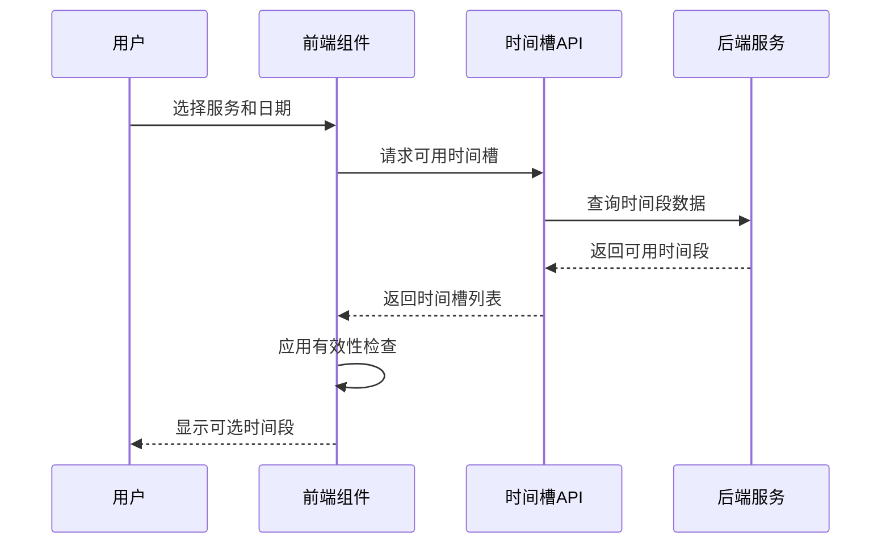

**图表来源**
- [Appointment.vue](file://frontend/src/views/Appointment.vue#L468-L530)

### 步骤3：车辆信息填写

收集详细的车辆和联系人信息：

- **车牌号码**：支持中国车牌格式验证
- **车辆品牌**：下拉选择，包含主流品牌
- **车辆型号**：文本输入，支持自定义
- **车辆颜色**：预设颜色选项
- **联系电话**：手机号码验证
- **特殊要求**：备注信息

**章节来源**
- [Appointment.vue](file://frontend/src/views/Appointment.vue#L122-L249)

### 步骤4：确认预约

展示完整的预约信息，用户确认后提交：

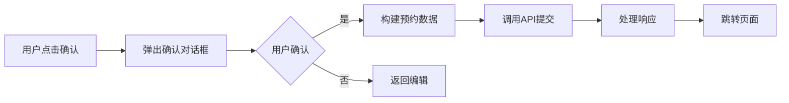

**图表来源**
- [Appointment.vue](file://frontend/src/views/Appointment.vue#L666-L781)

**章节来源**
- [Appointment.vue](file://frontend/src/views/Appointment.vue#L193-L259)

## 后端事务处理机制

### 事务配置

后端服务采用Spring声明式事务管理，确保数据一致性：

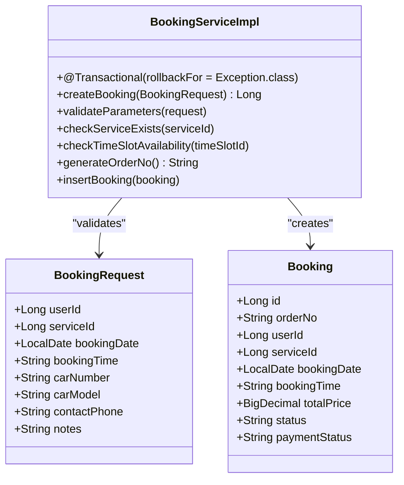

**图表来源**
- [BookingServiceImpl.java](file://backend/src/main/java/com/carwash/service/impl/BookingServiceImpl.java#L76-L175)
- [BookingRequest.java](file://backend/src/main/java/com/carwash/dto/BookingRequest.java#L12-L120)

### 参数校验流程

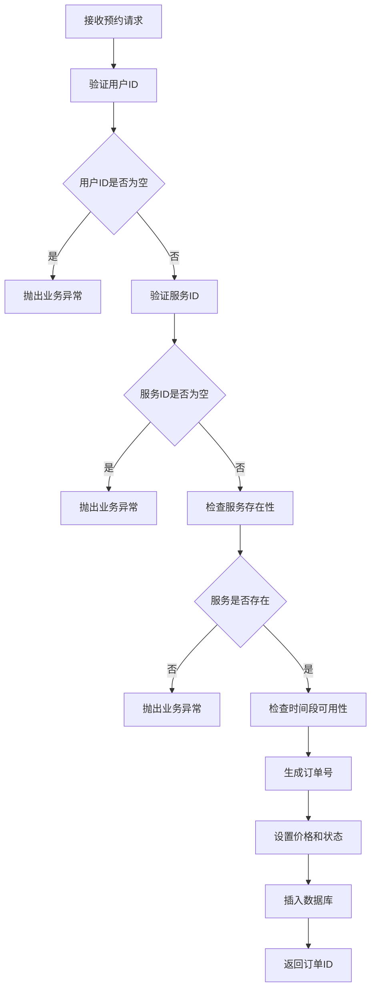

**图表来源**
- [BookingServiceImpl.java](file://backend/src/main/java/com/carwash/service/impl/BookingServiceImpl.java#L82-L175)

### 订单号生成策略

采用时间戳+UUID组合的方式生成唯一订单号：

```mermaid
flowchart LR
A[System.currentTimeMillis] --> B[时间戳部分]
C[UUID.randomUUID()] --> D[随机部分]
B --> E[订单号拼接]
D --> E
E --> F[CW + 时间戳 + UUID前8位]
F --> G[最终订单号]
```

**图表来源**
- [BookingServiceImpl.java](file://backend/src/main/java/com/carwash/service/impl/BookingServiceImpl.java#L574-L579)

**章节来源**
- [BookingServiceImpl.java](file://backend/src/main/java/com/carwash/service/impl/BookingServiceImpl.java#L76-L175)

## 订单创建API调用

### 前端API调用流程

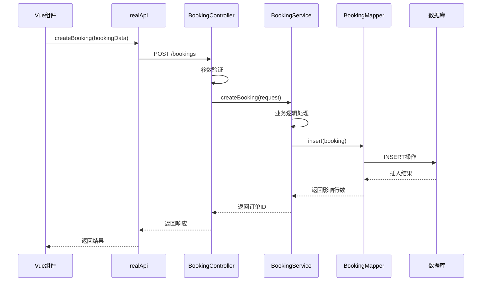

**图表来源**
- [realApi.js](file://frontend/src/api/realApi.js#L244-L247)
- [BookingController.java](file://backend/src/main/java/com/carwash/controller/BookingController.java#L38-L63)

### 请求数据结构

前端构建的预约数据包含以下字段：

| 字段名 | 类型 | 描述 | 必填 |
|--------|------|------|------|
| userId | Long | 用户ID | 是 |
| serviceId | Long | 服务ID | 是 |
| bookingDate | String | 预约日期(YYYY-MM-DD) | 是 |
| bookingTime | String | 预约时间(HH:mm-HH:mm) | 是 |
| carNumber | String | 车牌号码 | 是 |
| carModel | String | 车型信息 | 是 |
| contactPhone | String | 联系电话 | 是 |
| notes | String | 备注信息 | 否 |
| totalPrice | BigDecimal | 总价 | 是 |
| status | String | 订单状态 | 是 |

**章节来源**
- [Appointment.vue](file://frontend/src/views/Appointment.vue#L684-L696)
- [BookingRequest.java](file://backend/src/main/java/com/carwash/dto/BookingRequest.java#L12-L53)

## 订单状态跳转逻辑

### 支付状态判断

根据订单的支付状态决定后续跳转：

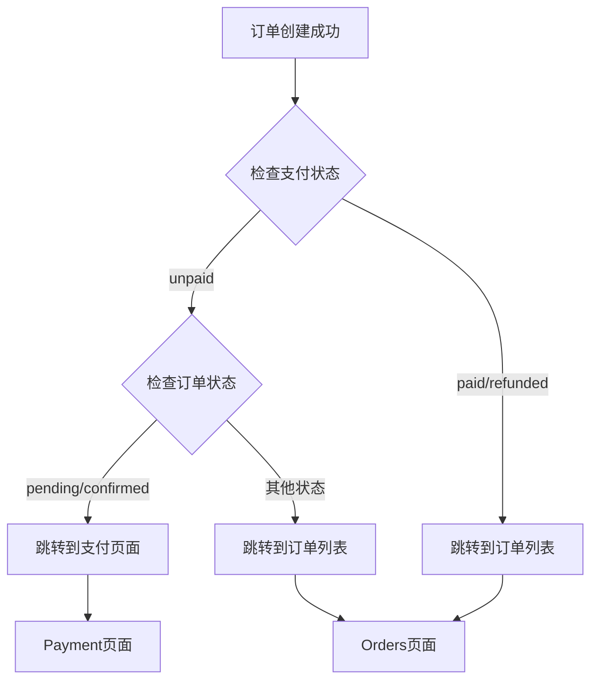

**图表来源**
- [Appointment.vue](file://frontend/src/views/Appointment.vue#L749-L768)

### 实时数据同步

使用全局状态管理确保订单数据的一致性：

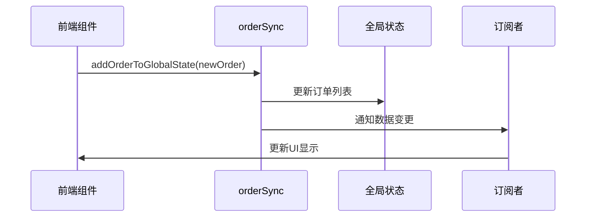

**图表来源**
- [orderSync.js](file://frontend/src/utils/orderSync.js#L185-L205)

**章节来源**
- [Appointment.vue](file://frontend/src/views/Appointment.vue#L707-L768)
- [orderSync.js](file://frontend/src/utils/orderSync.js#L185-L205)

## 并发控制与冲突检测

### 时间段冲突检测

系统实现了多层次的冲突检测机制：

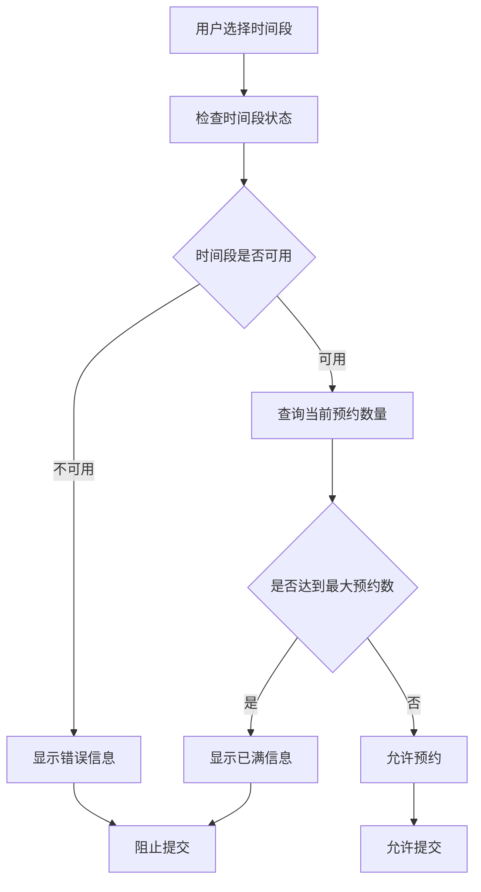

**图表来源**
- [BookingServiceImpl.java](file://backend/src/main/java/com/carwash/service/impl/BookingServiceImpl.java#L100-L118)

### 数据库层面的并发控制

通过数据库锁和乐观锁机制防止并发冲突：

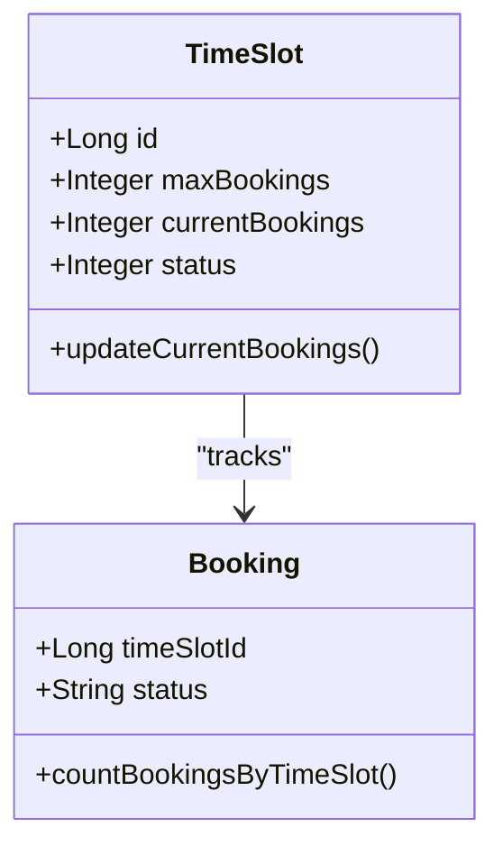

**图表来源**
- [BookingMapper.java](file://backend/src/main/java/com/carwash/mapper/BookingMapper.java#L45-L47)

**章节来源**
- [BookingServiceImpl.java](file://backend/src/main/java/com/carwash/service/impl/BookingServiceImpl.java#L100-L118)
- [BookingMapper.java](file://backend/src/main/java/com/carwash/mapper/BookingMapper.java#L45-L47)

## 错误处理与解决方案

### 常见问题及解决方案

#### 1. 时间段冲突

**问题描述**：多个用户同时选择同一时间段导致冲突

**解决方案**：
- 数据库层面的乐观锁控制
- 前端实时状态检查
- 后端事务回滚机制

#### 2. 并发预约

**问题描述**：高并发场景下的数据竞争

**解决方案**：
- 数据库唯一约束
- 分布式锁机制
- 前端防重复提交

#### 3. 参数验证失败

**问题描述**：用户输入无效数据

**解决方案**：
- 前端表单验证
- 后端参数校验
- 业务逻辑验证

### 错误处理流程

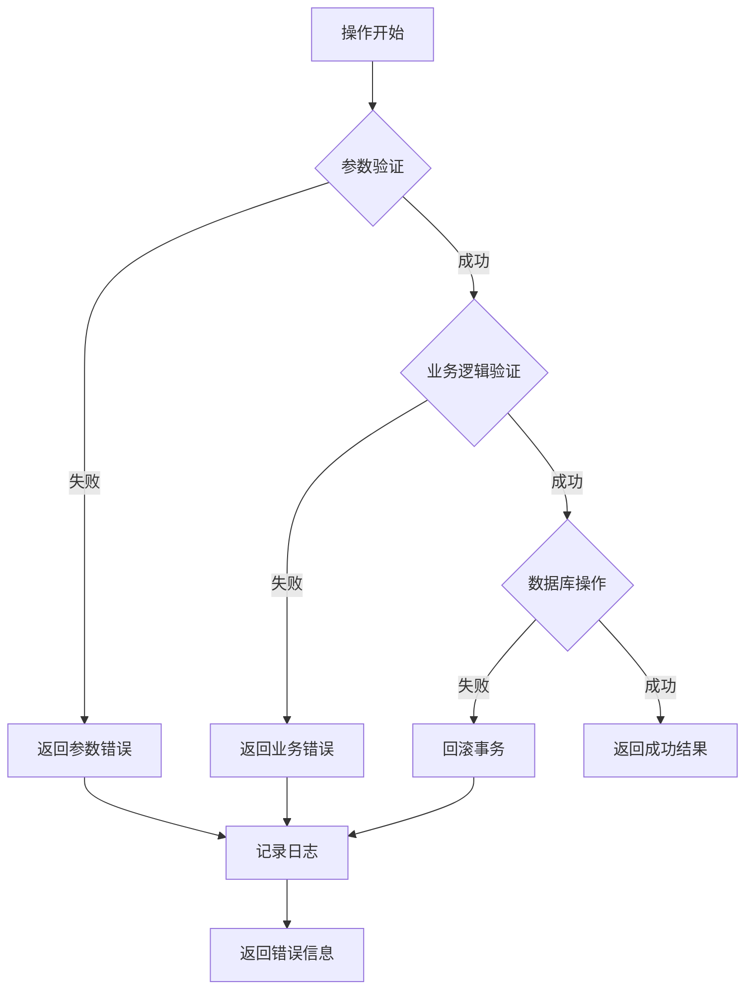

**章节来源**
- [BookingServiceImpl.java](file://backend/src/main/java/com/carwash/service/impl/BookingServiceImpl.java#L168-L175)

## 性能优化策略

### 前端优化

1. **状态缓存**：避免重复的API调用
2. **懒加载**：按需加载服务和时间槽数据
3. **防抖处理**：减少不必要的表单验证
4. **虚拟滚动**：处理大量订单数据

### 后端优化

1. **索引优化**：对常用查询字段建立索引
2. **连接池**：优化数据库连接管理
3. **缓存策略**：缓存静态数据和热点查询
4. **异步处理**：非关键操作异步执行

### 数据库优化

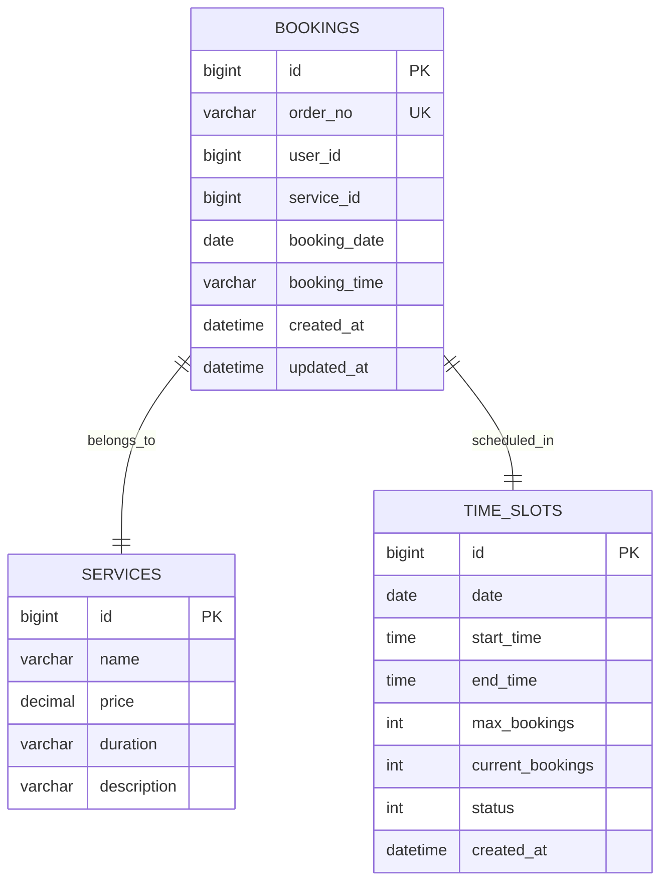

**图表来源**
- [Booking.java](file://backend/src/main/java/com/carwash/entity/Booking.java#L21-L154)

## 总结

预约创建流程是一个复杂的分布式系统，涉及前端交互、后端业务逻辑、数据库操作和实时数据同步等多个方面。通过合理的架构设计和完善的错误处理机制，系统能够提供稳定可靠的预约服务。

### 关键特性

1. **用户体验**：多步骤表单引导，实时状态反馈
2. **数据一致性**：事务处理，冲突检测
3. **并发控制**：多层次的并发保护机制
4. **实时同步**：WebSocket推送，全局状态管理
5. **错误处理**：完善的异常捕获和用户反馈

### 技术亮点

- **前后端分离**：清晰的职责划分
- **响应式设计**：适应不同设备
- **国际化支持**：支持多语言环境
- **安全性**：参数验证，权限控制

该系统为汽车洗车服务提供了完整的预约解决方案，具备良好的扩展性和维护性，能够满足业务发展的需求。