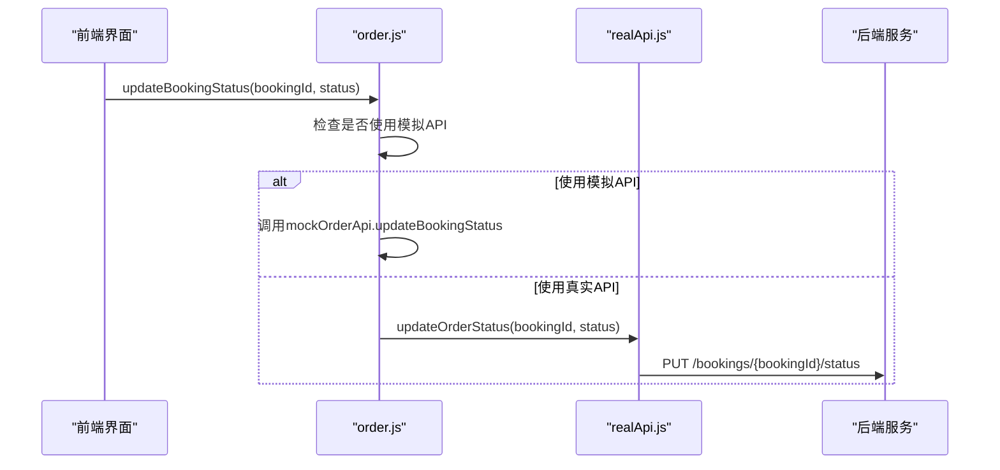
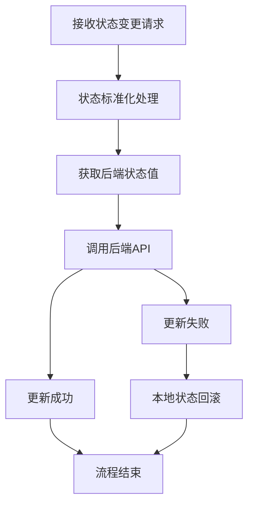
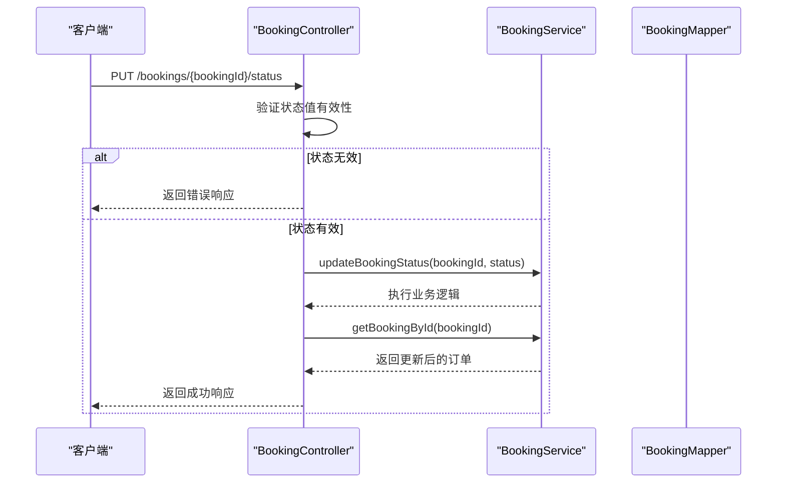
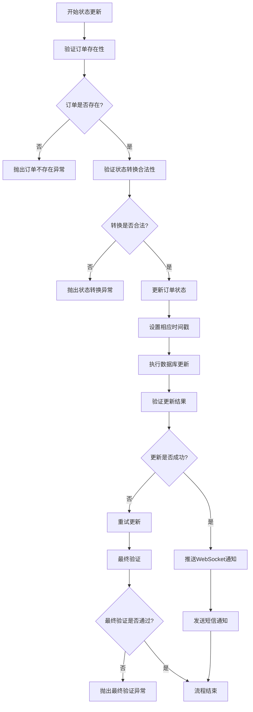
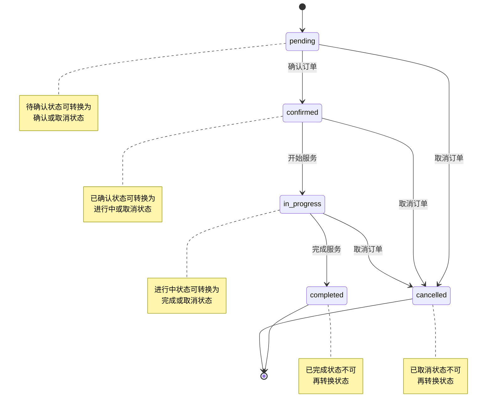
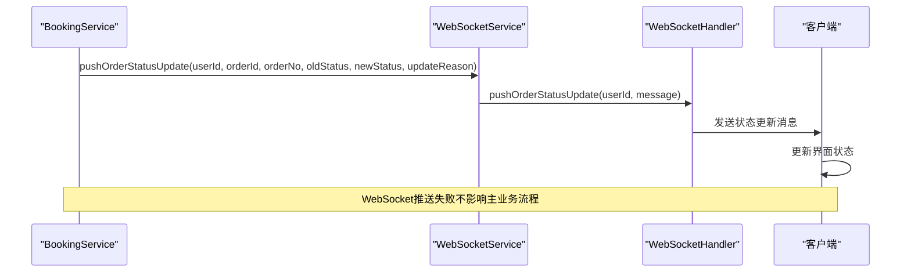
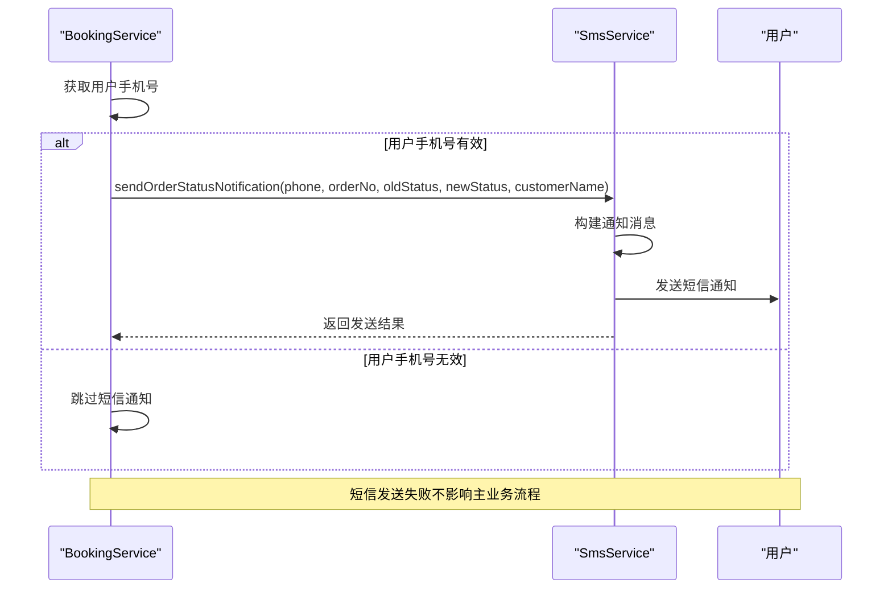
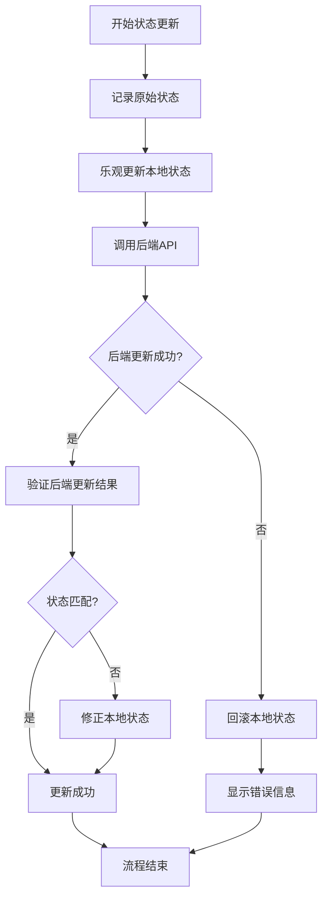
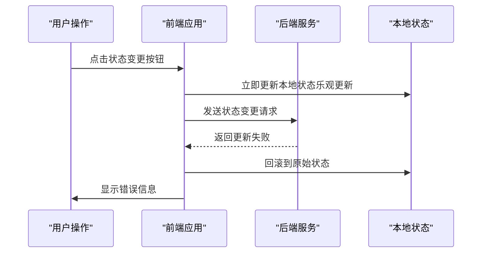
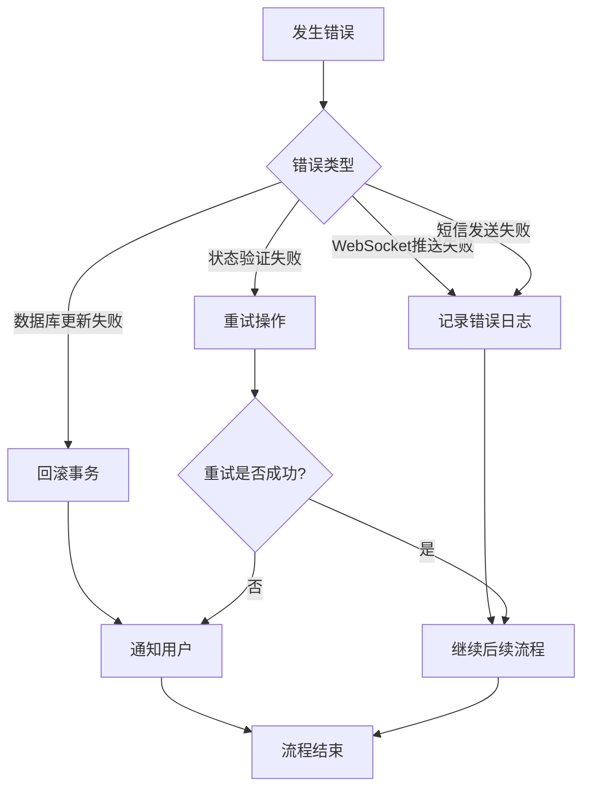

# 状态变更处理流程

<cite>
**本文档引用的文件**
- [order.js](file://frontend/src/api/order.js)
- [realApi.js](file://frontend/src/api/realApi.js)
- [BookingController.java](file://backend/src/main/java/com/carwash/controller/BookingController.java)
- [BookingServiceImpl.java](file://backend/src/main/java/com/carwash/service/impl/BookingServiceImpl.java)
- [WebSocketService.java](file://backend/src/main/java/com/carwash/service/WebSocketService.java)
- [WebSocketServiceImpl.java](file://backend/src/main/java/com/carwash/service/impl/WebSocketServiceImpl.java)
- [SmsService.java](file://backend/src/main/java/com/carwash/service/SmsService.java)
- [SmsServiceImpl.java](file://backend/src/main/java/com/carwash/service/impl/SmsServiceImpl.java)
- [dataSync.js](file://frontend/src/utils/dataSync.js)
- [Booking.java](file://backend/src/main/java/com/carwash/entity/Booking.java)
</cite>

## 目录
1. [概述](#概述)
2. [前端处理流程](#前端处理流程)
3. [后端处理流程](#后端处理流程)
4. [数据库更新与验证](#数据库更新与验证)
5. [集成通知机制](#集成通知机制)
6. [前端状态同步机制](#前端状态同步机制)
7. [错误处理与回滚](#错误处理与回滚)
8. [总结](#总结)

## 概述

预约状态变更是一个涉及前后端协作的复杂流程，需要确保数据的一致性和用户体验的流畅性。本文档详细分析了从前端API调用到后端业务处理，再到最终通知用户的完整处理流程。

## 前端处理流程

### API调用入口

状态变更的处理始于前端的`updateBookingStatus`方法调用，该方法位于`order.js`文件中：

**图表来源**
- [order.js](file://frontend/src/api/order.js#L135-L146)
- [realApi.js](file://frontend/src/api/realApi.js#L181-L186)

### 状态标准化处理

前端在发送状态变更请求之前，会进行状态标准化处理：

**图表来源**
- [dataSync.js](file://frontend/src/utils/dataSync.js#L208-L268)

**章节来源**
- [order.js](file://frontend/src/api/order.js#L135-L146)
- [realApi.js](file://frontend/src/api/realApi.js#L181-L186)
- [dataSync.js](file://frontend/src/utils/dataSync.js#L208-L268)

## 后端处理流程

### 控制器层处理

后端的`BookingController`负责接收HTTP请求并进行初步验证：

**图表来源**
- [BookingController.java](file://backend/src/main/java/com/carwash/controller/BookingController.java#L147-L165)

### 服务层核心逻辑

`BookingServiceImpl`中的`updateBookingStatus`方法实现了核心的业务逻辑：

**图表来源**
- [BookingServiceImpl.java](file://backend/src/main/java/com/carwash/service/impl/BookingServiceImpl.java#L257-L389)

**章节来源**
- [BookingController.java](file://backend/src/main/java/com/carwash/controller/BookingController.java#L147-L165)
- [BookingServiceImpl.java](file://backend/src/main/java/com/carwash/service/impl/BookingServiceImpl.java#L257-L389)

## 数据库更新与验证

### 状态转换验证机制

系统实现了严格的状态转换验证机制，确保状态变更的合法性：

**图表来源**
- [BookingServiceImpl.java](file://backend/src/main/java/com/carwash/service/impl/BookingServiceImpl.java#L392-L411)

### 双重验证机制

系统实现了数据库更新后的双重验证机制：

1. **即时验证**：检查数据库更新结果
2. **强制刷新验证**：重新查询数据库确认状态一致性
3. **重试机制**：验证失败时自动重试更新

**章节来源**
- [BookingServiceImpl.java](file://backend/src/main/java/com/carwash/service/impl/BookingServiceImpl.java#L257-L389)

## 集成通知机制

### WebSocket实时通知

系统通过WebSocket服务向客户端推送实时状态更新：

**图表来源**
- [WebSocketService.java](file://backend/src/main/java/com/carwash/service/WebSocketService.java#L10-L18)
- [WebSocketServiceImpl.java](file://backend/src/main/java/com/carwash/service/impl/WebSocketServiceImpl.java#L22-L41)

### 短信通知机制

系统通过短信服务向用户发送状态变更通知：

**图表来源**
- [SmsService.java](file://backend/src/main/java/com/carwash/service/SmsService.java#L54-L62)
- [SmsServiceImpl.java](file://backend/src/main/java/com/carwash/service/impl/SmsServiceImpl.java#L161-L170)

**章节来源**
- [WebSocketService.java](file://backend/src/main/java/com/carwash/service/WebSocketService.java#L10-L18)
- [WebSocketServiceImpl.java](file://backend/src/main/java/com/carwash/service/impl/WebSocketServiceImpl.java#L22-L41)
- [SmsService.java](file://backend/src/main/java/com/carwash/service/SmsService.java#L54-L62)
- [SmsServiceImpl.java](file://backend/src/main/java/com/carwash/service/impl/SmsServiceImpl.java#L161-L170)

## 前端状态同步机制

### 乐观更新策略

前端采用乐观更新策略，在等待后端响应的同时立即更新本地状态：

**图表来源**
- [dataSync.js](file://frontend/src/utils/dataSync.js#L208-L268)

### 错误回滚机制

当状态更新失败时，系统会自动回滚到原始状态：

**图表来源**
- [dataSync.js](file://frontend/src/utils/dataSync.js#L208-L268)

**章节来源**
- [dataSync.js](file://frontend/src/utils/dataSync.js#L208-L268)

## 错误处理与回滚

### 多层次错误处理

系统实现了多层次的错误处理机制：

1. **前端错误处理**：乐观更新失败时的回滚
2. **后端事务控制**：数据库操作的原子性保证
3. **补偿机制**：通知发送失败时的处理

### 补偿机制

当某个环节失败时，系统会执行相应的补偿操作：

**章节来源**
- [BookingServiceImpl.java](file://backend/src/main/java/com/carwash/service/impl/BookingServiceImpl.java#L257-L389)
- [dataSync.js](file://frontend/src/utils/dataSync.js#L208-L268)

## 总结

预约状态变更处理流程体现了现代Web应用中前后端协作的最佳实践。通过以下关键特性确保了系统的可靠性和用户体验：

### 核心优势

1. **严格的业务规则**：通过状态转换验证确保业务逻辑的正确性
2. **多重验证机制**：数据库更新后的双重验证保证数据一致性
3. **实时通知系统**：WebSocket和短信通知确保用户及时获知状态变化
4. **乐观更新策略**：提升用户体验的同时保证数据一致性
5. **完善的错误处理**：多层次的错误处理和补偿机制

### 技术特点

- **事务性操作**：使用Spring事务管理确保数据库操作的原子性
- **异步通知**：WebSocket和短信通知采用异步处理避免阻塞主线程
- **状态标准化**：统一前后端状态表示减少歧义
- **幂等性设计**：支持重复调用的安全处理

这种设计模式不仅适用于预约系统，也为其他需要状态变更的业务场景提供了参考价值。