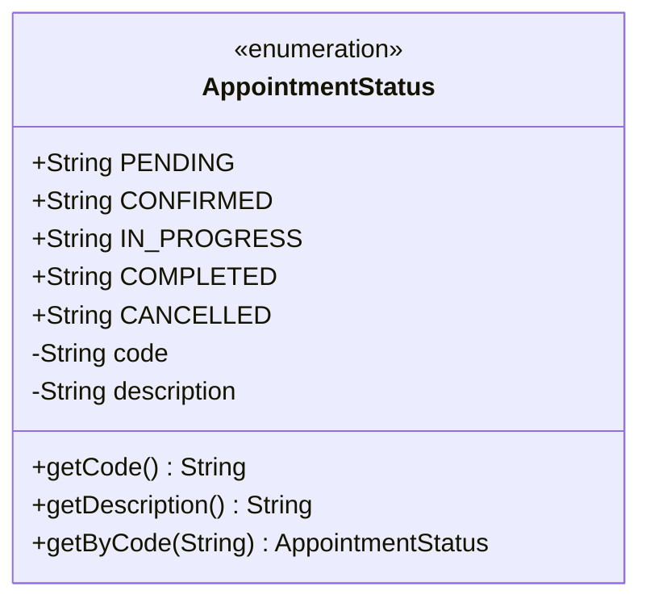
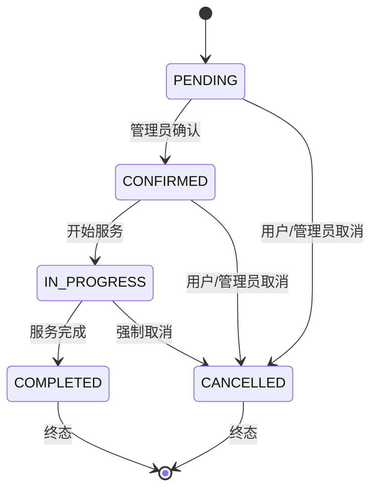
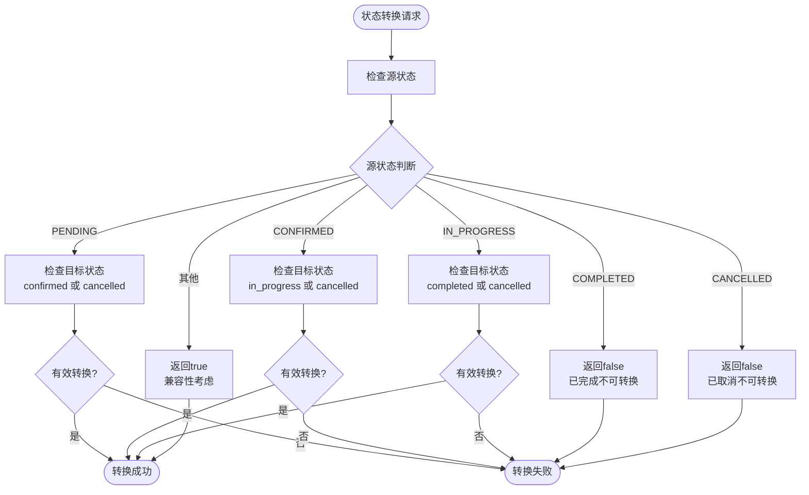
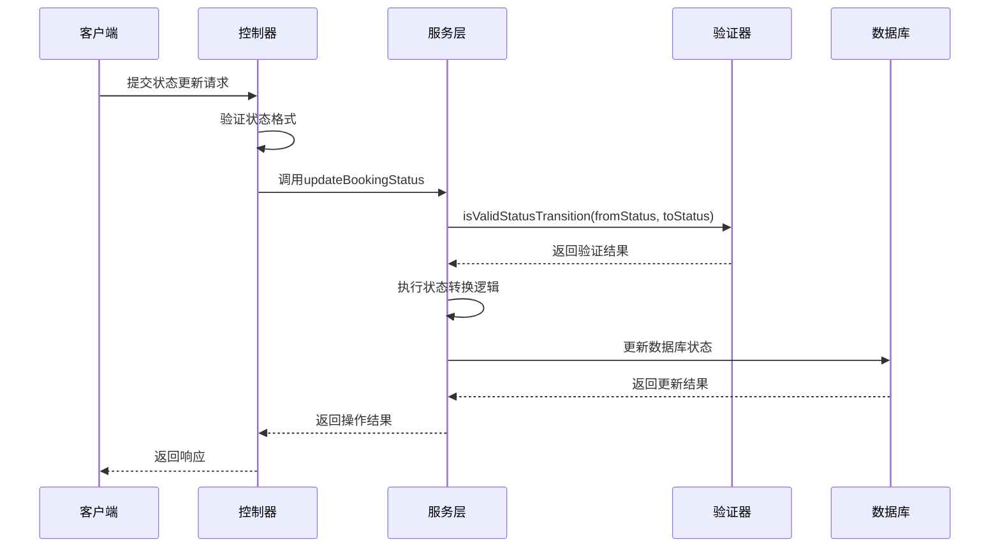
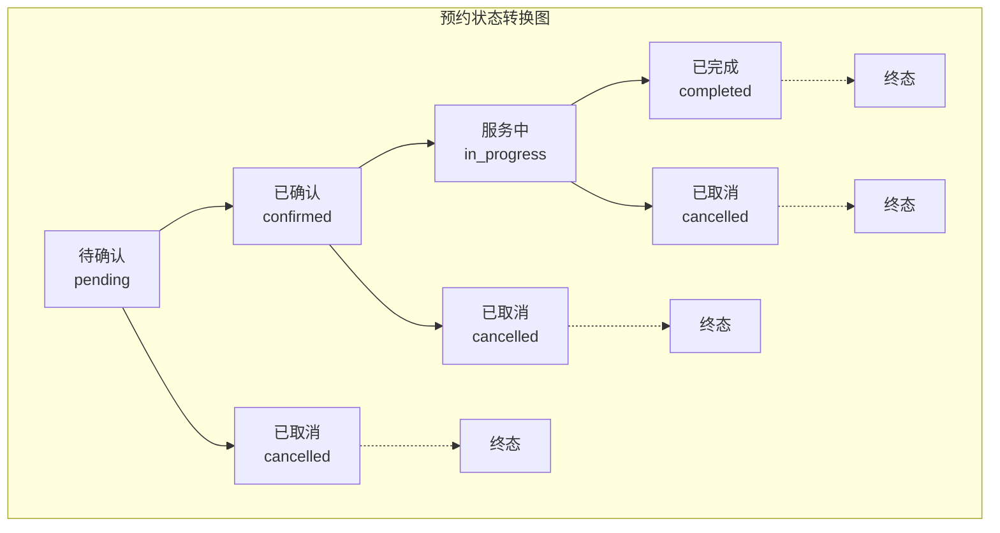

# 状态定义与转换规则

<cite>
**本文档引用的文件**
- [AppointmentStatus.java](file://backend/src/main/java/com/carwash/common/enums/AppointmentStatus.java)
- [Booking.java](file://backend/src/main/java/com/carwash/entity/Booking.java)
- [BookingServiceImpl.java](file://backend/src/main/java/com/carwash/service/impl/BookingServiceImpl.java)
- [BookingController.java](file://backend/src/main/java/com/carwash/controller/BookingController.java)
- [booking-status-test.html](file://backup/test-files-backup/booking-status-test.html)
</cite>

## 目录
1. [引言](#引言)
2. [状态定义概述](#状态定义概述)
3. [AppointmentStatus枚举详解](#appointmentstatus枚举详解)
4. [Booking实体类状态字段](#booking实体类状态字段)
5. [状态转换规则分析](#状态转换规则分析)
6. [状态机实现机制](#状态机实现机制)
7. [状态转换验证机制](#状态转换验证机制)
8. [业务流程完整性保障](#业务流程完整性保障)
9. [状态转换图](#状态转换图)
10. [最佳实践与建议](#最佳实践与建议)

## 引言

汽车洗车服务预约系统采用基于状态机的设计模式，通过严格的预约状态转换规则确保业务流程的完整性和数据一致性。系统定义了五个核心状态，每个状态都有明确的业务含义和合法的转换路径，形成了一个完整的状态机模型。

## 状态定义概述

系统采用五状态状态机模型，包含以下核心状态：

- **待确认 (PENDING)**: 用户提交预约申请但尚未被确认的状态
- **已确认 (CONFIRMED)**: 管理员或系统确认预约，等待服务开始的状态  
- **服务中 (IN_PROGRESS)**: 正在进行洗车服务的状态
- **已完成 (COMPLETED)**: 服务完成，订单流程结束的状态
- **已取消 (CANCELLED)**: 预约被取消，订单流程终止的状态

## AppointmentStatus枚举详解

### 枚举定义结构

**图表来源**
- [AppointmentStatus.java](file://backend/src/main/java/com/carwash/common/enums/AppointmentStatus.java#L9-L44)

### 状态枚举属性

| 状态 | 代码 | 中文描述 | 业务含义 |
|------|------|----------|----------|
| PENDING | "PENDING" | 待确认 | 用户提交预约，等待管理员确认 |
| CONFIRMED | "CONFIRMED" | 已确认 | 预约被确认，准备开始服务 |
| IN_PROGRESS | "IN_PROGRESS" | 服务中 | 正在进行洗车服务 |
| COMPLETED | "COMPLETED" | 已完成 | 服务完成，订单结束 |
| CANCELLED | "CANCELLED" | 已取消 | 预约被取消，流程终止 |

**节来源**
- [AppointmentStatus.java](file://backend/src/main/java/com/carwash/common/enums/AppointmentStatus.java#L11-L15)

## Booking实体类状态字段

### 状态字段设计

Booking实体类中status字段采用字符串类型存储状态值，具有以下特点：

- **数据类型**: String类型，便于数据库存储和传输
- **取值范围**: 仅限于预定义的五个状态值
- **业务含义**: 直接反映订单的当前业务状态
- **持久化**: 存储在数据库表的`status`字段中

### 状态字段属性

| 属性 | 类型 | 描述 | 默认值 |
|------|------|------|--------|
| status | String | 预约状态 | "pending"（创建时默认） |
| payment_status | String | 支付状态 | "unpaid"（创建时默认） |
| completed_at | LocalDateTime | 完成时间 | null |
| cancelled_at | LocalDateTime | 取消时间 | null |

**节来源**
- [Booking.java](file://backend/src/main/java/com/carwash/entity/Booking.java#L95-L128)

## 状态转换规则分析

### 状态转换矩阵

**图表来源**
- [BookingServiceImpl.java](file://backend/src/main/java/com/carwash/service/impl/BookingServiceImpl.java#L397-L410)

### 转换规则详解

#### 1. 待确认状态 (PENDING)
- **可转换目标**: CONFIRMED（确认）、CANCELLED（取消）
- **转换条件**: 管理员权限或用户主动取消
- **业务场景**: 用户提交预约后，管理员需要审核确认

#### 2. 已确认状态 (CONFIRMED)  
- **可转换目标**: IN_PROGRESS（开始服务）、CANCELLED（取消）
- **转换条件**: 服务开始或提前取消
- **业务场景**: 预约被确认后，等待服务开始

#### 3. 服务中状态 (IN_PROGRESS)
- **可转换目标**: COMPLETED（完成）、CANCELLED（强制取消）
- **转换条件**: 服务完成或特殊情况下的强制取消
- **业务场景**: 洗车服务正在进行中

#### 4. 已完成状态 (COMPLETED)
- **终态**: 不可再转换
- **业务场景**: 服务完全完成，订单流程结束

#### 5. 已取消状态 (CANCELLED)
- **终态**: 不可再转换
- **业务场景**: 预约被取消，资源释放

**节来源**
- [BookingServiceImpl.java](file://backend/src/main/java/com/carwash/service/impl/BookingServiceImpl.java#L397-L410)

## 状态机实现机制

### isValidStatusTransition方法实现

系统通过`isValidStatusTransition`方法实现状态转换验证：

**图表来源**
- [BookingServiceImpl.java](file://backend/src/main/java/com/carwash/service/impl/BookingServiceImpl.java#L395-L410)

### 状态转换验证逻辑

状态转换验证遵循严格的业务规则：

1. **源状态检查**: 验证当前状态的有效性
2. **目标状态验证**: 确认目标状态在合法范围内
3. **转换规则匹配**: 检查是否符合预定义的转换路径
4. **业务约束验证**: 确保转换满足业务要求

**节来源**
- [BookingServiceImpl.java](file://backend/src/main/java/com/carwash/service/impl/BookingServiceImpl.java#L395-L410)

## 状态转换验证机制

### 多层验证体系

系统实现了多层状态验证机制：

**图表来源**
- [BookingController.java](file://backend/src/main/java/com/carwash/controller/BookingController.java#L148-L166)
- [BookingServiceImpl.java](file://backend/src/main/java/com/carwash/service/impl/BookingServiceImpl.java#L260-L310)

### 验证机制特点

1. **输入验证**: 控制器层面验证状态格式
2. **业务验证**: 服务层验证状态转换合法性
3. **数据验证**: 数据库层面确保状态一致性
4. **事务保证**: 使用事务确保状态更新原子性

**节来源**
- [BookingController.java](file://backend/src/main/java/com/carwash/controller/BookingController.java#L154-L157)
- [BookingServiceImpl.java](file://backend/src/main/java/com/carwash/service/impl/BookingServiceImpl.java#L273-L278)

## 业务流程完整性保障

### 数据一致性保证

系统通过多种机制确保数据一致性：

1. **状态终态保护**: 已完成和已取消状态不可逆
2. **事务控制**: 状态更新采用数据库事务
3. **并发控制**: 防止并发状态冲突
4. **审计跟踪**: 记录状态变更历史

### 业务流程约束

| 状态转换 | 业务约束 | 验证规则 |
|----------|----------|----------|
| PENDING → CONFIRMED | 管理员权限 | 需要ADMIN角色 |
| PENDING → CANCELLED | 用户/管理员 | 无特殊限制 |
| CONFIRMED → IN_PROGRESS | 服务开始 | 时间点验证 |
| IN_PROGRESS → COMPLETED | 服务完成 | 完成确认 |
| IN_PROGRESS → CANCELLED | 强制取消 | 特殊权限 |

**节来源**
- [BookingServiceImpl.java](file://backend/src/main/java/com/carwash/service/impl/BookingServiceImpl.java#L229-L232)

## 状态转换图

### 完整状态转换图

### 状态颜色编码

| 状态 | 颜色编码 | HTML颜色值 | 语义含义 |
|------|----------|------------|----------|
| 待确认 | 黄色 | #fff3cd | 等待处理 |
| 已确认 | 绿色 | #d4edda | 准备就绪 |
| 服务中 | 蓝色 | #cce5ff | 进行中 |
| 已完成 | 青色 | #d1ecf1 | 流程结束 |
| 已取消 | 红色 | #f8d7da | 流程终止 |

## 最佳实践与建议

### 状态设计原则

1. **单一职责**: 每个状态代表明确的业务阶段
2. **不可逆性**: 终态状态不应再发生转换
3. **完整性**: 包含所有可能的业务场景
4. **一致性**: 前端后端状态定义保持一致

### 实现建议

1. **状态枚举**: 使用枚举类型确保状态值的唯一性和安全性
2. **验证机制**: 实现多层次的状态验证
3. **事务控制**: 确保状态更新的原子性
4. **监控告警**: 监控异常状态转换
5. **日志记录**: 记录所有状态变更操作

### 性能优化

1. **索引优化**: 在状态字段上建立索引
2. **批量操作**: 支持批量状态更新
3. **缓存策略**: 缓存常用状态统计信息
4. **异步处理**: 状态变更通知采用异步处理

### 安全考虑

1. **权限控制**: 不同状态转换需要相应权限
2. **输入验证**: 严格验证状态参数
3. **审计日志**: 记录所有状态变更操作
4. **异常处理**: 完善的异常处理机制

通过这套完善的预约状态定义与转换规则，系统能够有效管理预约流程，确保业务逻辑的正确性和数据的一致性，为用户提供可靠的预约服务体验。