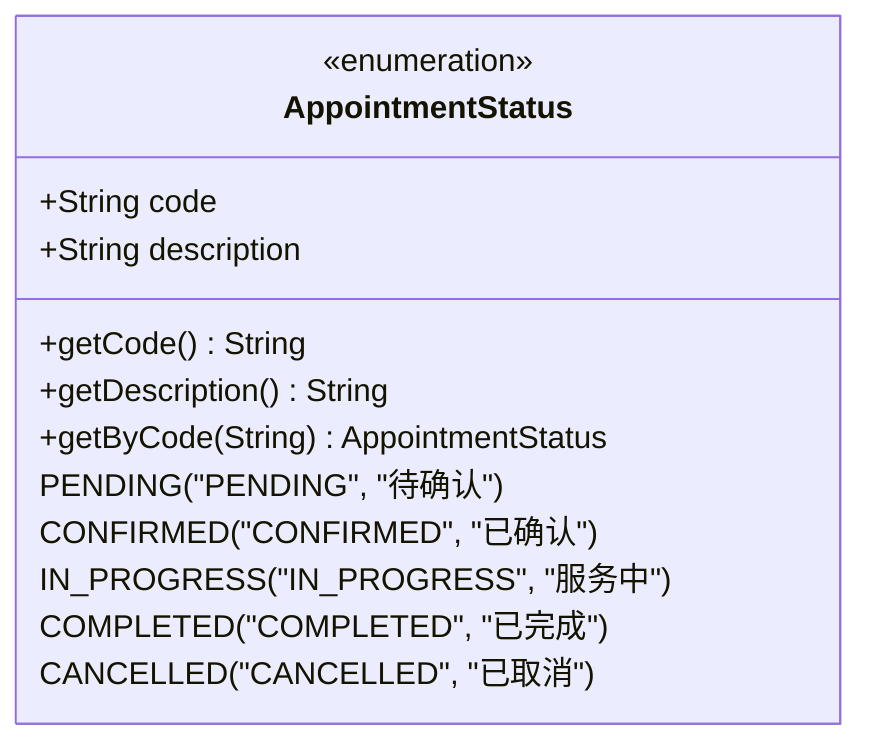
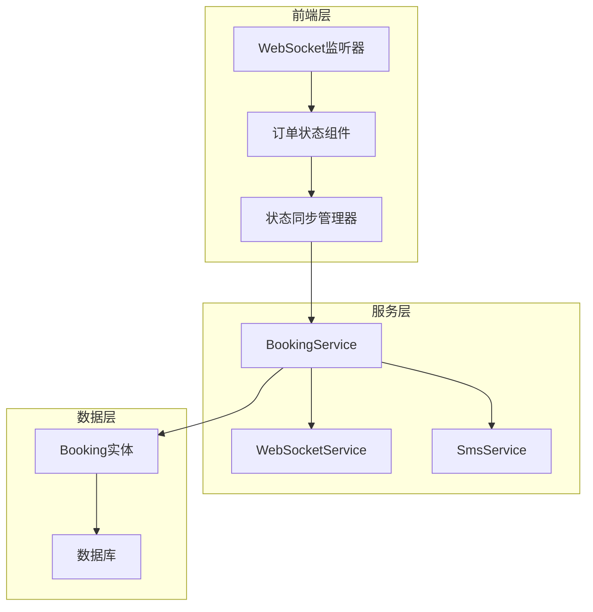
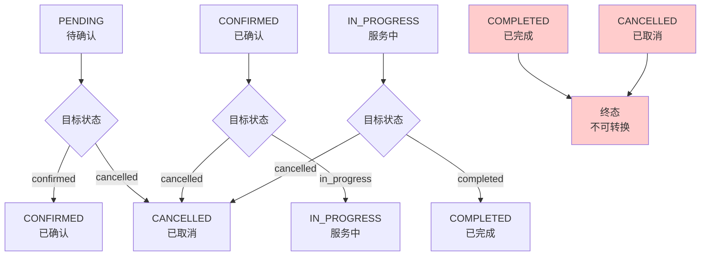
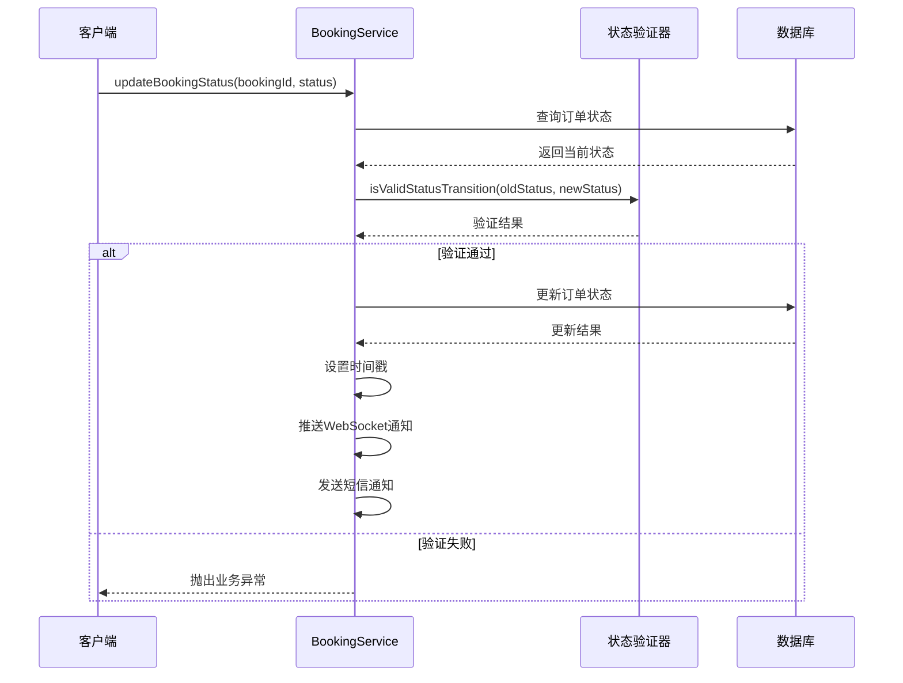
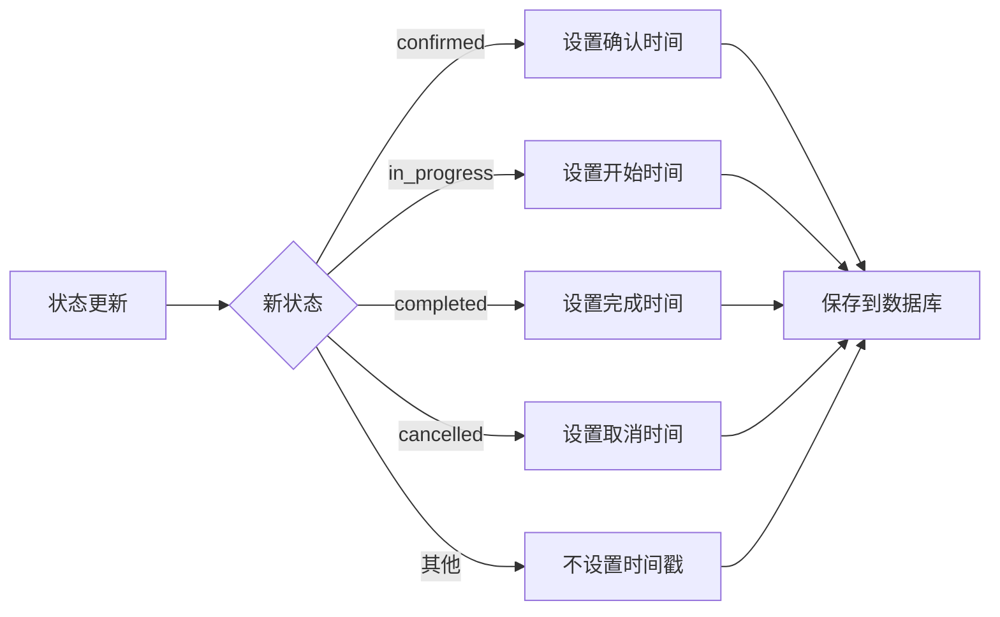
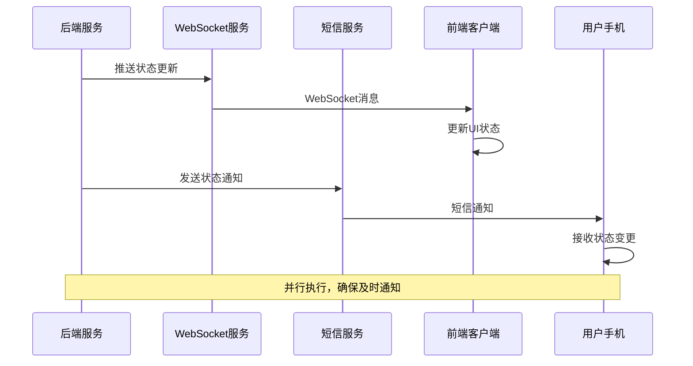
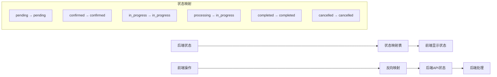
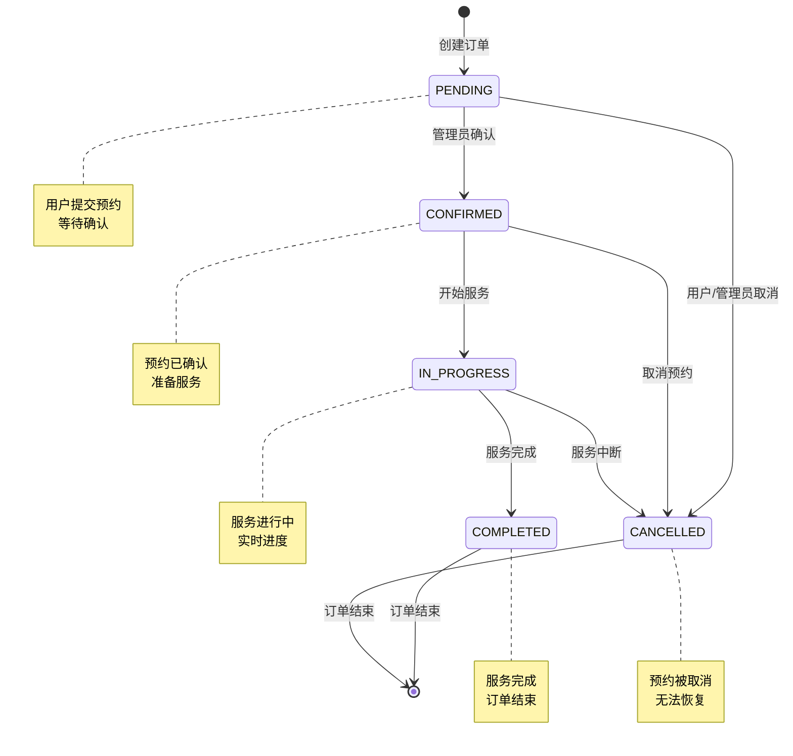

# 预约状态管理

<cite>
**本文档引用的文件**
- [AppointmentStatus.java](file://backend/src/main/java/com/carwash/common/enums/AppointmentStatus.java)
- [Booking.java](file://backend/src/main/java/com/carwash/entity/Booking.java)
- [BookingServiceImpl.java](file://backend/src/main/java/com/carwash/service/impl/BookingServiceImpl.java)
- [WebSocketService.java](file://backend/src/main/java/com/carwash/service/WebSocketService.java)
- [WebSocketServiceImpl.java](file://backend/src/main/java/com/carwash/service/impl/WebSocketServiceImpl.java)
- [SmsService.java](file://backend/src/main/java/com/carwash/service/SmsService.java)
- [dataSync.js](file://frontend/src/utils/dataSync.js)
- [OrderStatusProgress.vue](file://frontend/src/components/OrderStatusProgress.vue)
- [test-booking-status.html](file://backup/test-files-backup/test-booking-status.html)
</cite>

## 目录
1. [概述](#概述)
2. [状态枚举定义](#状态枚举定义)
3. [状态机架构](#状态机架构)
4. [状态转换规则](#状态转换规则)
5. [状态转换验证机制](#状态转换验证机制)
6. [状态更新流程](#状态更新流程)
7. [实时通知机制](#实时通知机制)
8. [前端状态管理](#前端状态管理)
9. [状态转换图](#状态转换图)
10. [最佳实践](#最佳实践)

## 概述

预约系统采用基于状态机的设计模式，通过严格的状态转换规则确保订单生命周期的完整性。系统定义了五个核心状态，每个状态都有明确的业务含义和转换约束，实现了完整的订单状态管理闭环。

## 状态枚举定义

系统使用统一的状态枚举来标准化订单状态，确保前后端状态值的一致性。

**图表来源**
- [AppointmentStatus.java](file://backend/src/main/java/com/carwash/common/enums/AppointmentStatus.java#L8-L43)

### 状态业务含义

| 状态 | 英文代码 | 描述 | 业务含义 |
|------|----------|------|----------|
| 待确认 | PENDING | 订单已提交但未被确认 | 用户提交预约，等待管理员确认 |
| 已确认 | CONFIRMED | 订单已被确认 | 管理员确认预约，进入服务准备阶段 |
| 服务中 | IN_PROGRESS | 服务正在进行中 | 服务人员开始提供洗车服务 |
| 已完成 | COMPLETED | 服务已完成 | 洗车服务完成，订单结束 |
| 已取消 | CANCELLED | 订单已被取消 | 订单被取消，无法继续 |

**章节来源**
- [AppointmentStatus.java](file://backend/src/main/java/com/carwash/common/enums/AppointmentStatus.java#L11-L15)

## 状态机架构

系统采用分层架构设计，确保状态管理的清晰性和可维护性。

**图表来源**
- [BookingServiceImpl.java](file://backend/src/main/java/com/carwash/service/impl/BookingServiceImpl.java#L45-L75)
- [WebSocketServiceImpl.java](file://backend/src/main/java/com/carwash/service/impl/WebSocketServiceImpl.java#L14-L48)

## 状态转换规则

系统通过`isValidStatusTransition`方法严格定义状态转换规则，确保业务逻辑的正确性。

### 核心转换规则

**图表来源**
- [BookingServiceImpl.java](file://backend/src/main/java/com/carwash/service/impl/BookingServiceImpl.java#L394-L410)

### 转换规则详解

| 当前状态 | 可转换状态 | 转换条件 | 业务场景 |
|----------|------------|----------|----------|
| PENDING | CONFIRMED, CANCELLED | 管理员确认或用户取消 | 预约确认或取消 |
| CONFIRMED | IN_PROGRESS, CANCELLED | 服务开始或取消 | 服务启动或提前取消 |
| IN_PROGRESS | COMPLETED, CANCELLED | 服务完成或中断 | 服务正常完成或异常终止 |
| COMPLETED | 无 | 终态，不可转换 | 订单生命周期结束 |
| CANCELLED | 无 | 终态，不可转换 | 订单被取消，无法恢复 |

**章节来源**
- [BookingServiceImpl.java](file://backend/src/main/java/com/carwash/service/impl/BookingServiceImpl.java#L394-L410)

## 状态转换验证机制

系统通过多层验证确保状态转换的合法性。

**图表来源**
- [BookingServiceImpl.java](file://backend/src/main/java/com/carwash/service/impl/BookingServiceImpl.java#L257-L389)

### 验证流程

1. **订单存在性验证**：检查订单是否存在于数据库且未被软删除
2. **状态转换合法性验证**：调用`isValidStatusTransition`方法验证转换规则
3. **数据库更新验证**：确保状态变更成功并验证最终状态
4. **并发控制**：通过事务保证状态变更的原子性

**章节来源**
- [BookingServiceImpl.java](file://backend/src/main/java/com/carwash/service/impl/BookingServiceImpl.java#L263-L278)

## 状态更新流程

系统提供完整的状态更新流程，包含时间戳管理和通知机制。

### 时间戳管理

**图表来源**
- [BookingServiceImpl.java](file://backend/src/main/java/com/carwash/service/impl/BookingServiceImpl.java#L284-L301)

### 更新流程细节

1. **状态设置**：更新订单的`status`字段
2. **时间戳设置**：根据状态类型设置相应的时间戳
3. **更新时间**：设置`updated_at`时间为当前时间
4. **数据库持久化**：执行数据库更新操作
5. **状态验证**：强制刷新并验证更新结果

**章节来源**
- [BookingServiceImpl.java](file://backend/src/main/java/com/carwash/service/impl/BookingServiceImpl.java#L280-L343)

## 实时通知机制

系统集成WebSocket和短信通知机制，确保状态变更的实时同步。

### 通知流程

**图表来源**
- [BookingServiceImpl.java](file://backend/src/main/java/com/carwash/service/impl/BookingServiceImpl.java#L348-L389)
- [WebSocketServiceImpl.java](file://backend/src/main/java/com/carwash/service/impl/WebSocketServiceImpl.java#L22-L41)

### 通知内容

| 通知类型 | 内容格式 | 触发时机 | 目标用户 |
|----------|----------|----------|----------|
| WebSocket推送 | JSON消息，包含状态变更信息 | 状态更新后立即 | 在线用户 |
| 短信通知 | 文本消息，包含订单号和状态 | 状态更新后 | 订单关联用户 |

**章节来源**
- [BookingServiceImpl.java](file://backend/src/main/java/com/carwash/service/impl/BookingServiceImpl.java#L360-L389)

## 前端状态管理

前端采用响应式状态管理，结合WebSocket和定时刷新机制。

### 状态映射机制

**图表来源**
- [dataSync.js](file://frontend/src/utils/dataSync.js#L8-L27)

### 前端状态组件

前端使用Vue组件展示订单状态，提供实时的状态更新和用户交互。

**章节来源**
- [OrderStatusProgress.vue](file://frontend/src/components/OrderStatusProgress.vue#L1-L609)

## 状态转换图

完整的状态转换图展示了订单在整个生命周期中的状态演进。

**图表来源**
- [AppointmentStatus.java](file://backend/src/main/java/com/carwash/common/enums/AppointmentStatus.java#L11-L15)
- [BookingServiceImpl.java](file://backend/src/main/java/com/carwash/service/impl/BookingServiceImpl.java#L394-L410)

## 最佳实践

### 状态管理最佳实践

1. **严格的状态验证**：始终验证状态转换的合法性
2. **时间戳管理**：准确记录各状态的开始和结束时间
3. **实时通知**：通过多种渠道确保状态变更的及时通知
4. **数据一致性**：使用事务保证状态变更的原子性
5. **错误处理**：完善的错误处理和重试机制

### 性能优化建议

1. **状态缓存**：对频繁查询的状态信息进行缓存
2. **批量更新**：对于大量状态变更采用批量处理
3. **异步通知**：将通知操作异步化，避免阻塞主流程
4. **连接池管理**：合理配置WebSocket连接池

### 安全考虑

1. **权限验证**：确保只有授权用户才能修改订单状态
2. **审计日志**：记录所有状态变更操作的审计信息
3. **输入验证**：严格验证状态参数的合法性
4. **并发控制**：防止并发状态变更导致的数据不一致

**章节来源**
- [BookingServiceImpl.java](file://backend/src/main/java/com/carwash/service/impl/BookingServiceImpl.java#L257-L389)
- [dataSync.js](file://frontend/src/utils/dataSync.js#L209-L268)