# 预约系统实现

<cite>
**本文档引用的文件**
- [Appointment.vue](file://frontend/src/views/Appointment.vue)
- [BookingServiceImpl.java](file://backend/src/main/java/com/carwash/service/impl/BookingServiceImpl.java)
- [BookingController.java](file://backend/src/main/java/com/carwash/controller/BookingController.java)
- [Booking.java](file://backend/src/main/java/com/carwash/entity/Booking.java)
- [BookingRequest.java](file://backend/src/main/java/com/carwash/dto/BookingRequest.java)
- [AppointmentStatus.java](file://backend/src/main/java/com/carwash/common/enums/AppointmentStatus.java)
- [WebSocketService.java](file://backend/src/main/java/com/carwash/service/WebSocketService.java)
- [SmsService.java](file://backend/src/main/java/com/carwash/service/SmsService.java)
- [WebSocketServiceImpl.java](file://backend/src/main/java/com/carwash/service/impl/WebSocketServiceImpl.java)
- [SmsServiceImpl.java](file://backend/src/main/java/com/carwash/service/impl/SmsServiceImpl.java)
- [OrderStatusWebSocketHandler.java](file://backend/src/main/java/com/carwash/websocket/OrderStatusWebSocketHandler.java)
- [realApi.js](file://frontend/src/api/realApi.js)
- [orderSync.js](file://frontend/src/utils/orderSync.js)
- [TimeSlotController.java](file://backend/src/main/java/com/carwash/controller/TimeSlotController.java)
- [TimeSlotUtils.js](file://frontend/src/api/timeSlots.js)
</cite>

## 目录
1. [系统概述](#系统概述)
2. [前端预约流程](#前端预约流程)
3. [后端服务架构](#后端服务架构)
4. [核心业务逻辑](#核心业务逻辑)
5. [订单状态机设计](#订单状态机设计)
6. [实时通信机制](#实时通信机制)
7. [并发控制与事务处理](#并发控制与事务处理)
8. [常见问题与解决方案](#常见问题与解决方案)
9. [系统架构图](#系统架构图)
10. [总结](#总结)

## 系统概述

预约系统是一个完整的汽车洗车服务预约平台，包含前后端分离的架构设计。系统支持用户在线选择服务、时间、车辆信息并完成预约，同时提供实时状态更新和通知功能。

### 主要特性
- **多步骤预约流程**：服务选择 → 时间选择 → 车辆信息填写 → 确认预约
- **智能时间段检测**：实时检查可用时间段，避免冲突
- **订单状态管理**：完整的状态机驱动的订单生命周期管理
- **实时通信**：WebSocket推送订单状态变更
- **短信通知**：订单状态变更的短信提醒
- **事务安全保障**：数据库事务确保数据一致性

## 前端预约流程

### Appointment.vue 组件架构

前端预约组件采用多步骤向导模式，通过 Vue 3 Composition API 实现响应式状态管理和业务逻辑。

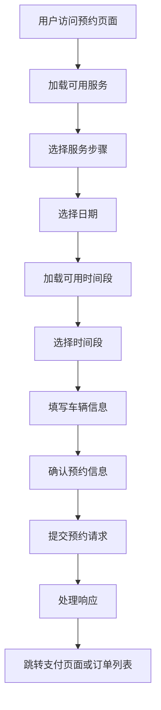

**图表来源**
- [Appointment.vue](file://frontend/src/views/Appointment.vue#L1-L800)

### 关键交互逻辑

#### 1. 服务选择与验证
- 用户可从预定义的服务列表中选择洗车套餐
- 每个服务包含价格、时长、特色功能等信息
- 服务选择后进入下一步，否则提示必填

#### 2. 时间段选择机制
- 基于所选日期动态加载可用时间段
- 实时显示剩余可预约数量
- 禁用已满或过期的时间段
- 支持当天时间段的即时有效性检查

#### 3. 车辆信息验证
- 车牌号码正则验证
- 车辆品牌下拉选择
- 联系电话格式验证
- 特殊要求可选填写

#### 4. 预约提交流程
- 构建完整的预约数据对象
- 调用后端 API 创建订单
- 处理成功响应并更新全局状态
- 根据支付状态决定后续跳转

**章节来源**
- [Appointment.vue](file://frontend/src/views/Appointment.vue#L667-L780)

### 数据同步机制

前端实现了全局订单状态同步机制，确保多个页面间的数据一致性：

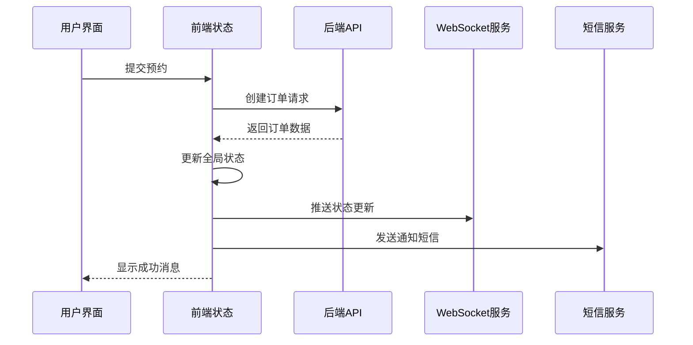

**图表来源**
- [orderSync.js](file://frontend/src/utils/orderSync.js#L185-L205)
- [realApi.js](file://frontend/src/api/realApi.js#L244-L247)

**章节来源**
- [orderSync.js](file://frontend/src/utils/orderSync.js#L1-L303)
- [realApi.js](file://frontend/src/api/realApi.js#L244-L336)

## 后端服务架构

### 核心服务层设计

后端采用分层架构，主要包含以下核心组件：

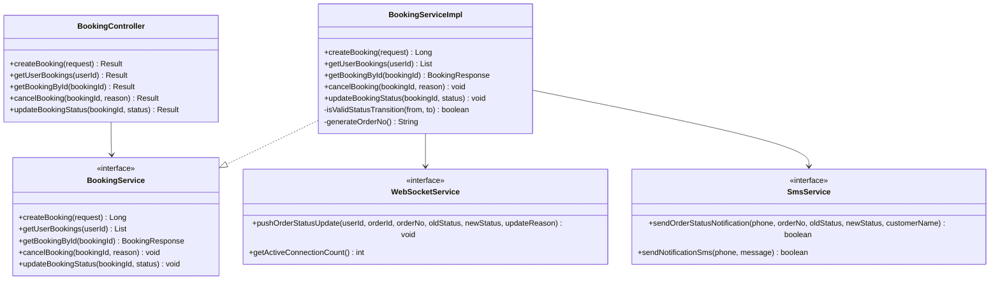

**图表来源**
- [BookingController.java](file://backend/src/main/java/com/carwash/controller/BookingController.java#L26-L228)
- [BookingServiceImpl.java](file://backend/src/main/java/com/carwash/service/impl/BookingServiceImpl.java#L44-L598)
- [WebSocketService.java](file://backend/src/main/java/com/carwash/service/WebSocketService.java#L7-L25)
- [SmsService.java](file://backend/src/main/java/com/carwash/service/SmsService.java#L9-L73)

### 数据模型设计

订单实体包含完整的预约信息和状态管理字段：

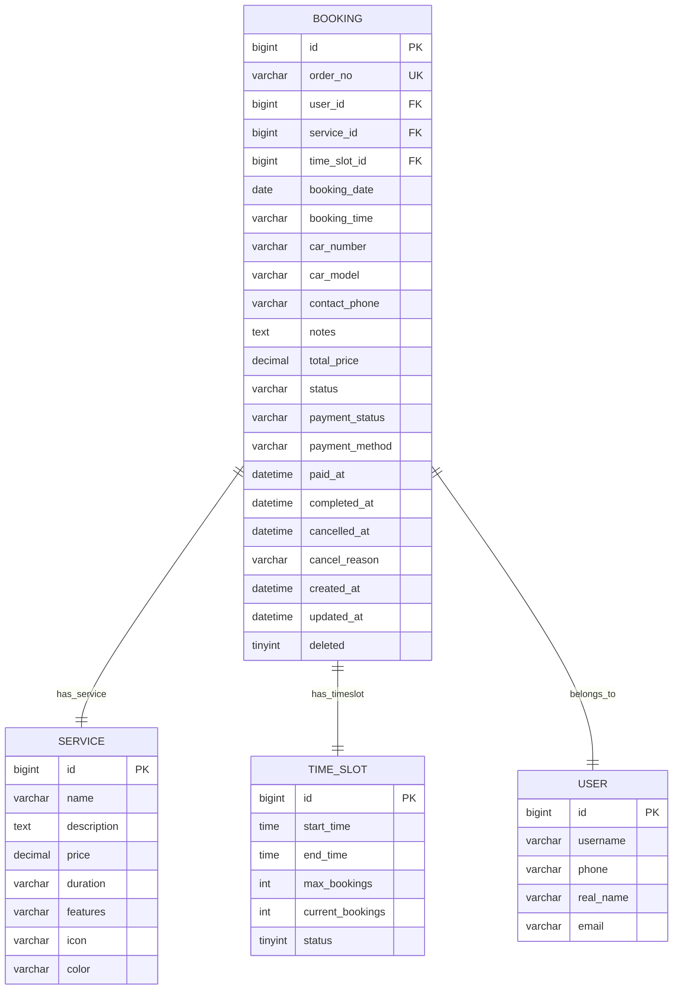

**图表来源**
- [Booking.java](file://backend/src/main/java/com/carwash/entity/Booking.java#L21-L333)

**章节来源**
- [BookingController.java](file://backend/src/main/java/com/carwash/controller/BookingController.java#L1-L228)
- [BookingServiceImpl.java](file://backend/src/main/java/com/carwash/service/impl/BookingServiceImpl.java#L1-L598)
- [Booking.java](file://backend/src/main/java/com/carwash/entity/Booking.java#L1-L333)

## 核心业务逻辑

### createBooking 方法详解

`BookingServiceImpl.createBooking` 方法是预约系统的核心业务逻辑入口，实现了完整的事务处理机制：

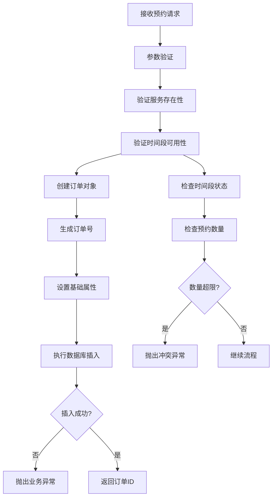

**图表来源**
- [BookingServiceImpl.java](file://backend/src/main/java/com/carwash/service/impl/BookingServiceImpl.java#L77-L175)

#### 1. 参数校验阶段
- 验证用户ID和服务ID不能为空
- 检查服务是否存在且有效
- 验证时间段ID（如果提供）

#### 2. 时间段冲突检测
系统实现了双重保护机制：
- **数据库级约束**：通过 `time_slots` 表的 `max_bookings` 字段限制最大预约数
- **业务逻辑验证**：在创建订单前检查当前已预约数量

#### 3. 订单号生成策略
采用时间戳+UUID组合的方式生成唯一订单号：
- 前缀 "CW" + 当前时间戳 + UUID截取部分
- 确保全球唯一性和时间顺序性

#### 4. 数据库事务处理
使用 Spring 的 `@Transactional` 注解确保：
- 插入操作的原子性
- 异常时的自动回滚
- 数据一致性保障

**章节来源**
- [BookingServiceImpl.java](file://backend/src/main/java/com/carwash/service/impl/BookingServiceImpl.java#L77-L175)

### 预约请求数据结构

预约请求封装了完整的用户输入信息：

| 字段名 | 类型 | 必填 | 描述 |
|--------|------|------|------|
| userId | Long | 是 | 用户标识 |
| serviceId | Long | 是 | 服务类型标识 |
| timeSlotId | Long | 否 | 时间段标识 |
| bookingDate | LocalDate | 否 | 预约日期 |
| carNumber | String | 是 | 车牌号码 |
| carModel | String | 是 | 车辆型号 |
| contactPhone | String | 是 | 联系电话 |
| notes | String | 否 | 特殊要求 |

**章节来源**
- [BookingRequest.java](file://backend/src/main/java/com/carwash/dto/BookingRequest.java#L12-L120)

## 订单状态机设计

### 状态转换规则

订单状态机遵循严格的转换规则，确保业务逻辑的正确性：

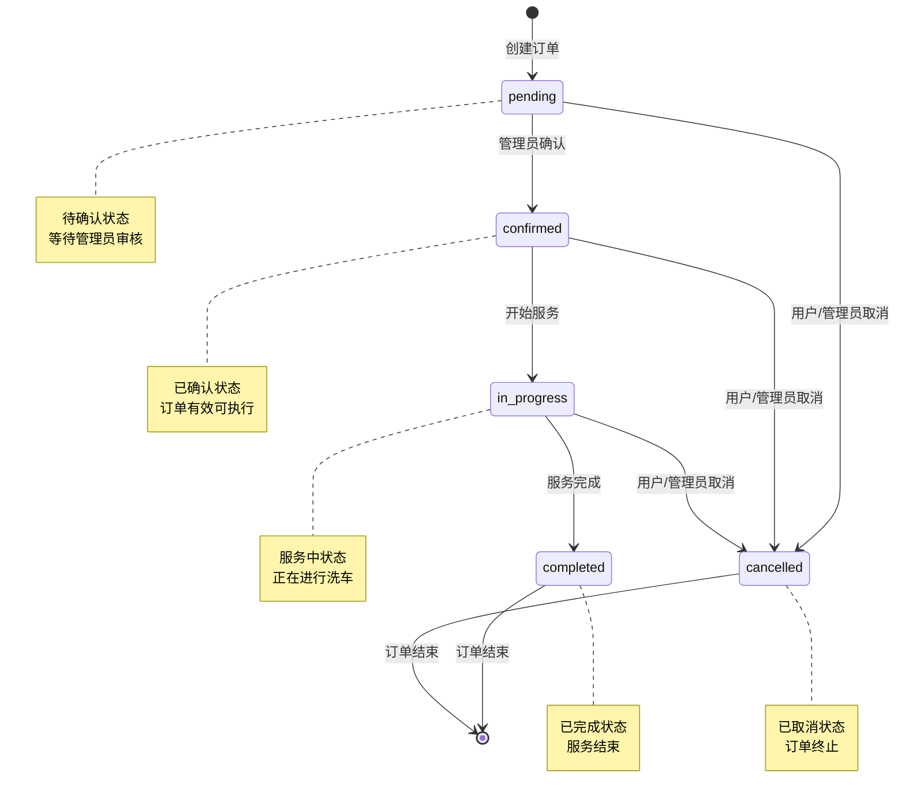

**图表来源**
- [BookingServiceImpl.java](file://backend/src/main/java/com/carwash/service/impl/BookingServiceImpl.java#L392-L411)

### 状态转换验证

系统实现了严格的状态转换验证逻辑：

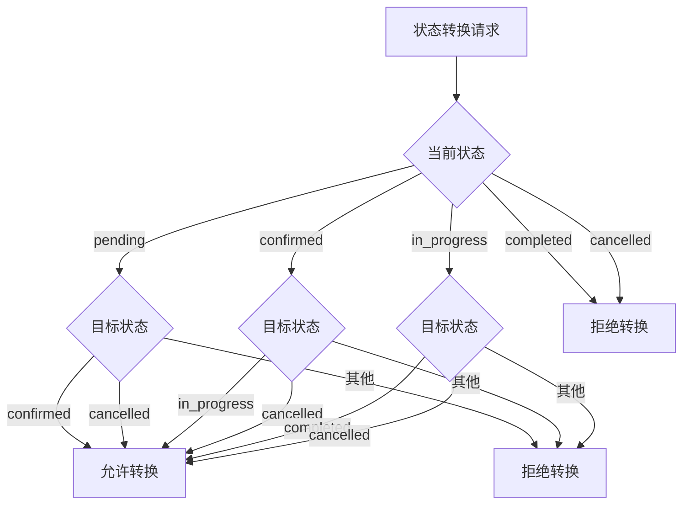

**图表来源**
- [BookingServiceImpl.java](file://backend/src/main/java/com/carwash/service/impl/BookingServiceImpl.java#L392-L411)

### 状态更新处理

每次状态更新都会触发多重通知机制：

1. **数据库更新**：持久化状态变更
2. **WebSocket推送**：实时通知前端
3. **短信通知**：发送状态变更短信
4. **审计日志**：记录状态变更历史

**章节来源**
- [BookingServiceImpl.java](file://backend/src/main/java/com/carwash/service/impl/BookingServiceImpl.java#L258-L391)

## 实时通信机制

### WebSocket 实现架构

系统采用 WebSocket 技术实现实时状态推送：

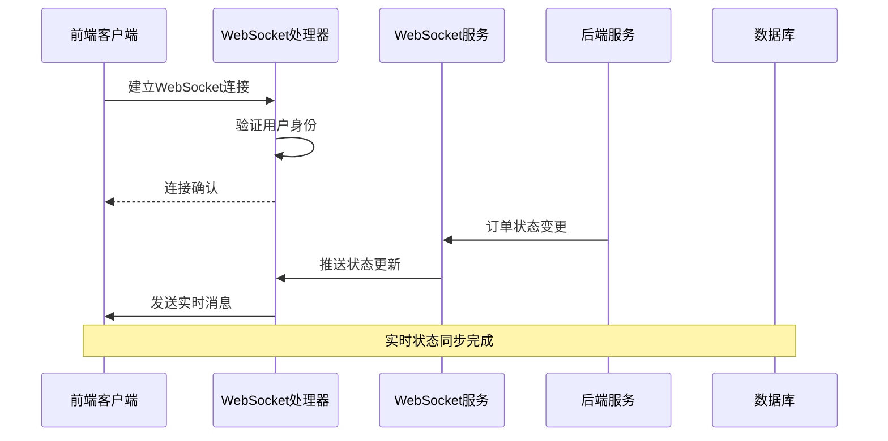

**图表来源**
- [OrderStatusWebSocketHandler.java](file://backend/src/main/java/com/carwash/websocket/OrderStatusWebSocketHandler.java#L34-L78)
- [WebSocketServiceImpl.java](file://backend/src/main/java/com/carwash/service/impl/WebSocketServiceImpl.java#L22-L42)

### 消息格式设计

WebSocket 消息采用统一的 JSON 格式：

```typescript
interface WebSocketMessage {
    type: string;           // 消息类型
    data: any;             // 消息数据
    message: string;       // 人类可读的消息
    timestamp: number;     // 时间戳
}

interface OrderStatusUpdateMessage {
    orderId: number;       // 订单ID
    orderNo: string;       // 订单号
    oldStatus: string;     // 旧状态
    newStatus: string;     // 新状态
    updateTime: string;    // 更新时间
    updateReason: string;  // 更新原因
}
```

### 连接管理

WebSocket 连接管理包括：
- **用户映射**：维护用户ID到WebSocket会话的映射关系
- **自动清理**：断线时自动清理无效连接
- **心跳检测**：定期检测连接有效性
- **并发控制**：支持多用户同时连接

**章节来源**
- [OrderStatusWebSocketHandler.java](file://backend/src/main/java/com/carwash/websocket/OrderStatusWebSocketHandler.java#L1-L225)
- [WebSocketServiceImpl.java](file://backend/src/main/java/com/carwash/service/impl/WebSocketServiceImpl.java#L1-L48)

## 并发控制与事务处理

### 数据库事务策略

系统采用多层次的并发控制机制：

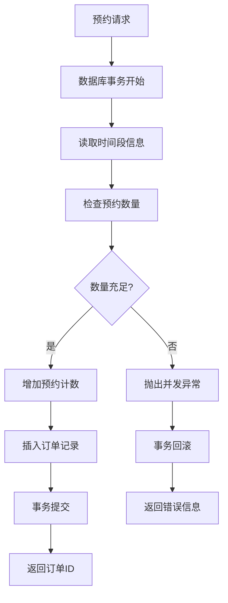

**图表来源**
- [BookingServiceImpl.java](file://backend/src/main/java/com/carwash/service/impl/BookingServiceImpl.java#L77-L175)

### 时间段并发保护

1. **数据库约束**：`time_slots` 表的 `max_bookings` 字段防止超卖
2. **乐观锁**：通过 `current_bookings` 字段实现乐观并发控制
3. **事务隔离**：使用数据库事务确保操作原子性

### 前端并发处理

前端实现了请求去重和状态同步机制：
- **请求去重**：防止重复提交
- **状态缓存**：本地缓存订单状态
- **冲突解决**：基于时间戳的冲突解决策略

**章节来源**
- [BookingServiceImpl.java](file://backend/src/main/java/com/carwash/service/impl/BookingServiceImpl.java#L77-L175)
- [orderSync.js](file://frontend/src/utils/orderSync.js#L120-L163)

## 常见问题与解决方案

### 1. 时间段冲突问题

**问题描述**：多个用户同时预约同一时间段导致冲突

**解决方案**：
- **数据库级约束**：`time_slots` 表的 `max_bookings` 限制
- **业务逻辑验证**：创建订单前检查当前预约数量
- **乐观锁机制**：`current_bookings` 字段的原子递增操作

### 2. 并发预约问题

**问题描述**：高并发场景下可能出现超卖现象

**解决方案**：
- **数据库事务**：确保操作的原子性
- **乐观锁**：使用版本号或计数器防止并发修改
- **请求去重**：前端实现请求去重机制

### 3. 数据一致性问题

**问题描述**：订单状态与时间段状态不一致

**解决方案**：
- **强一致性**：事务保证数据一致性
- **补偿机制**：状态不一致时的自动修复
- **监控告警**：异常情况的实时监控

### 4. 实时通知问题

**问题描述**：WebSocket 连接断开导致通知丢失

**解决方案**：
- **消息持久化**：关键通知消息的持久化存储
- **重连机制**：自动重连和状态同步
- **备用通知**：短信作为 WebSocket 的备用通知渠道

### 5. 性能优化问题

**问题描述**：大量并发请求导致系统性能下降

**解决方案**：
- **缓存策略**：热点数据的内存缓存
- **异步处理**：非关键操作的异步执行
- **负载均衡**：分布式部署和流量分发

## 系统架构图

### 整体系统架构

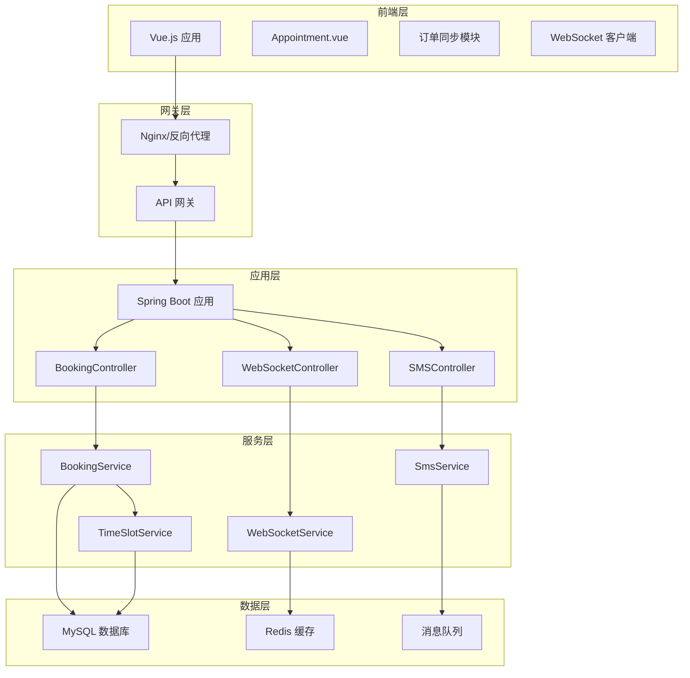

**图表来源**
- [Appointment.vue](file://frontend/src/views/Appointment.vue#L1-L800)
- [BookingController.java](file://backend/src/main/java/com/carwash/controller/BookingController.java#L26-L228)
- [BookingServiceImpl.java](file://backend/src/main/java/com/carwash/service/impl/BookingServiceImpl.java#L44-L598)

### 数据流架构

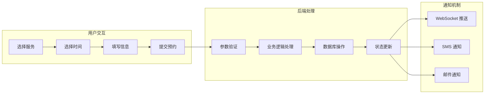

**图表来源**
- [Appointment.vue](file://frontend/src/views/Appointment.vue#L667-L780)
- [BookingServiceImpl.java](file://backend/src/main/java/com/carwash/service/impl/BookingServiceImpl.java#L258-L391)

## 总结

预约系统通过精心设计的架构和完善的业务逻辑，实现了高效、可靠的汽车洗车服务预约功能。系统的主要优势包括：

### 技术亮点
1. **完整的状态机设计**：严格的订单状态转换规则确保业务逻辑正确性
2. **实时通信机制**：WebSocket + 短信的双重通知保障用户体验
3. **并发控制策略**：多层次的并发保护机制防止数据竞争
4. **事务安全保障**：数据库事务确保数据一致性和完整性

### 架构优势
1. **前后端分离**：清晰的职责划分和独立的开发维护
2. **模块化设计**：服务层、数据层的合理分离
3. **可扩展性**：良好的接口设计支持功能扩展
4. **容错机制**：完善的异常处理和恢复策略

### 应用价值
- **提升用户体验**：流畅的预约流程和实时状态更新
- **提高运营效率**：自动化的状态管理和通知机制
- **保障数据安全**：严格的并发控制和事务处理
- **便于维护升级**：清晰的代码结构和完善的测试覆盖

该系统为汽车洗车服务行业提供了一个可参考的完整解决方案，具有良好的技术先进性和实用价值。