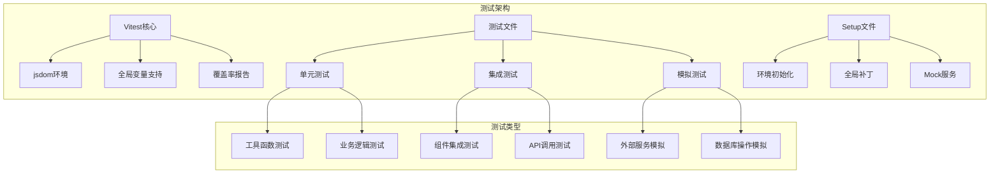
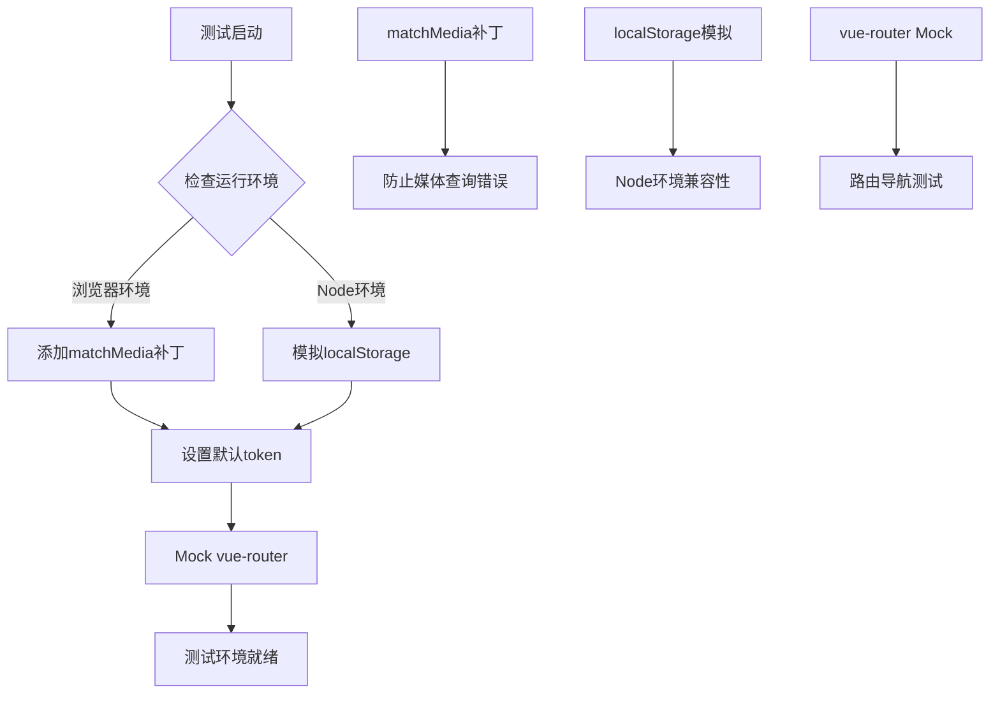
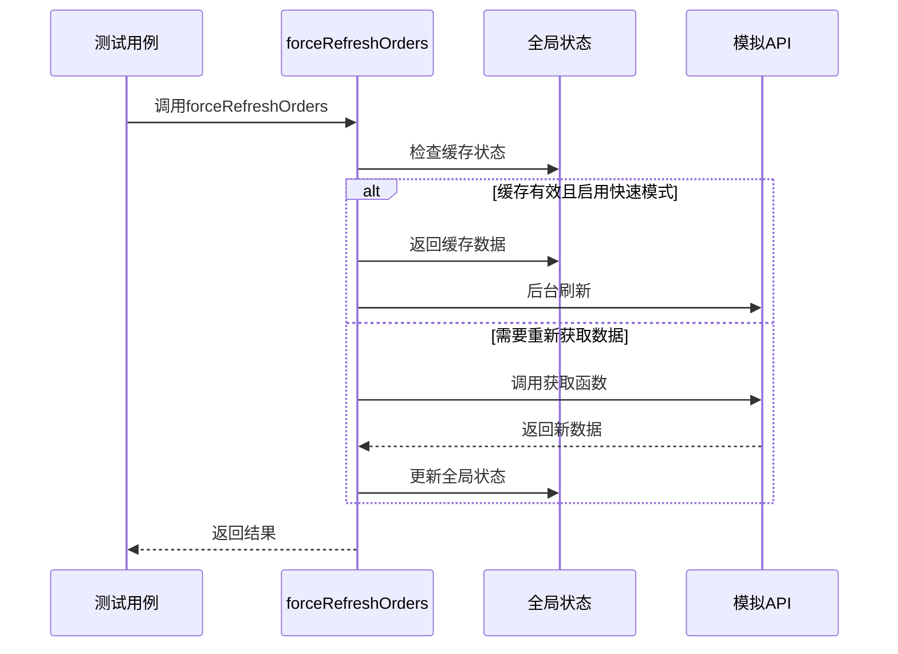
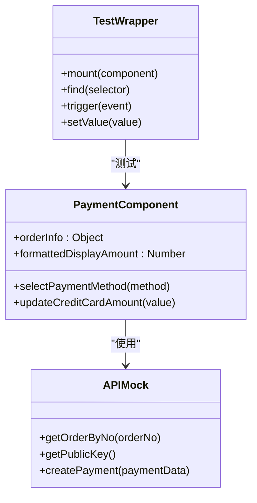
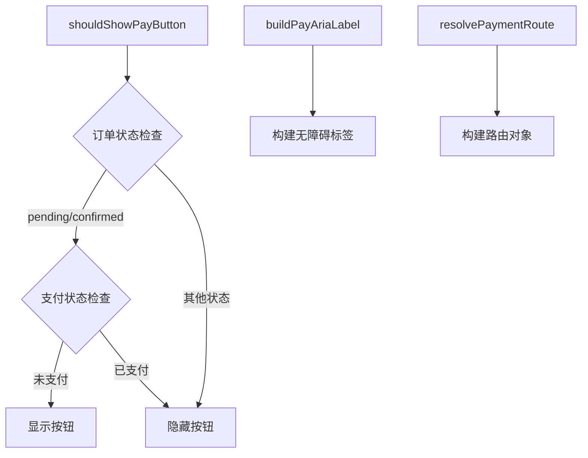
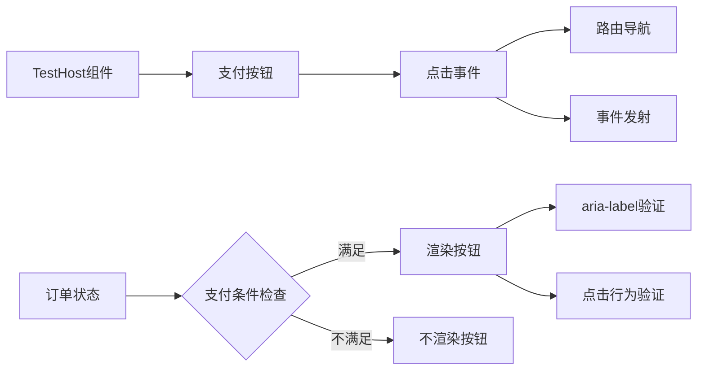
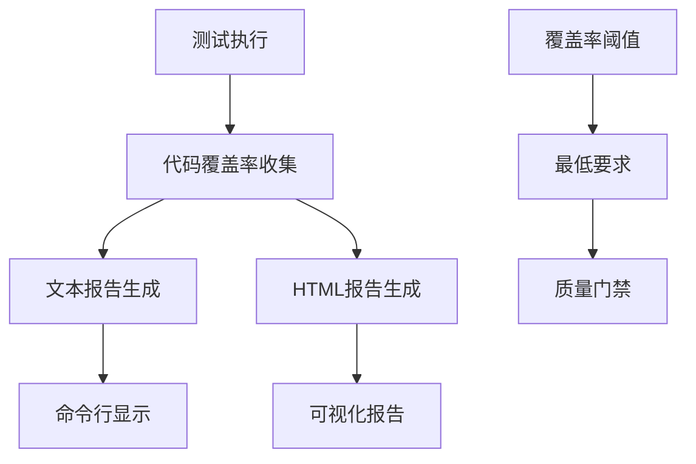
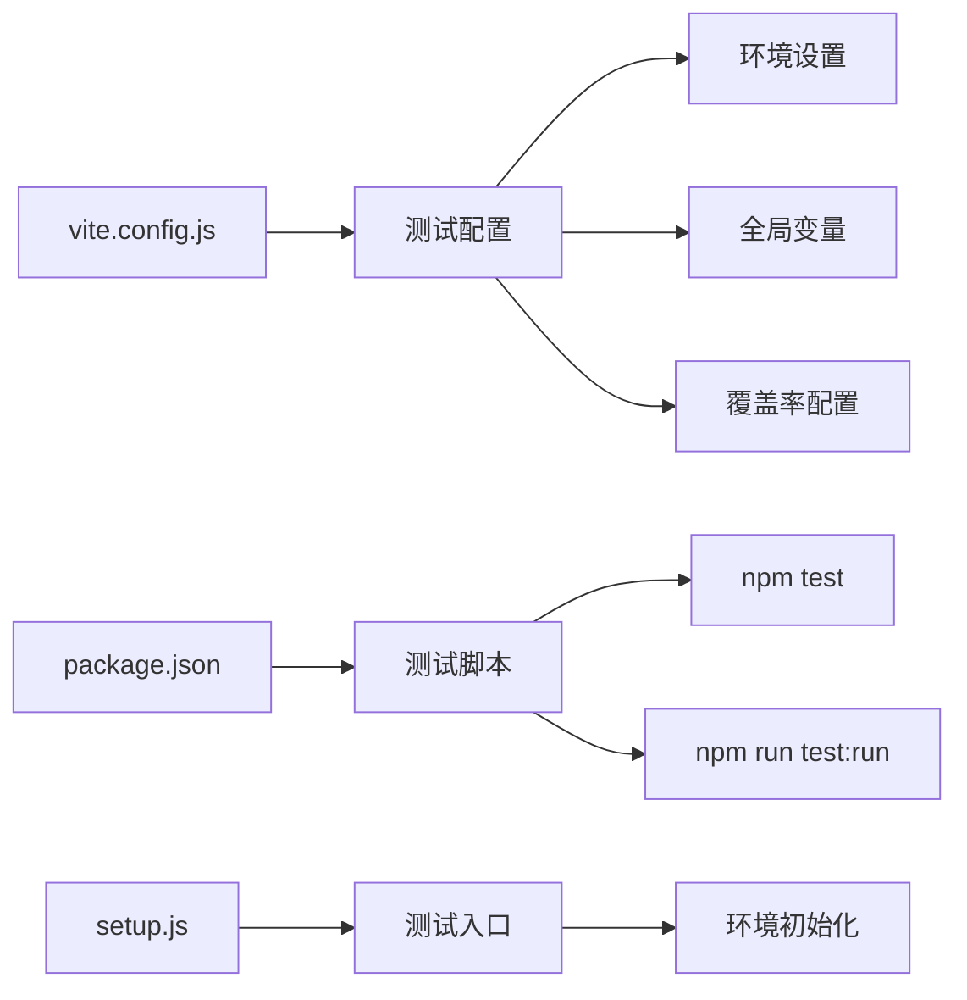

# 前端测试

<cite>
**本文档引用的文件**
- [setup.js](file://frontend/tests/setup.js)
- [ordersFetch.spec.js](file://frontend/tests/ordersFetch.spec.js)
- [paymentAmount.spec.js](file://frontend/tests/paymentAmount.spec.js)
- [paymentFlow.spec.js](file://frontend/tests/paymentFlow.spec.js)
- [payButton.integration.spec.js](file://frontend/tests/payButton.integration.spec.js)
- [vite.config.js](file://frontend/vite.config.js)
- [package.json](file://frontend/package.json)
- [orderSync.js](file://frontend/src/utils/orderSync.js)
- [paymentFlow.js](file://frontend/src/utils/paymentFlow.js)
- [order.js](file://frontend/src/api/order.js)
- [mockOrderApi.js](file://frontend/src/api/mockOrderApi.js)
- [Payment.vue](file://frontend/src/views/Payment.vue)
</cite>

## 目录
1. [简介](#简介)
2. [测试框架架构](#测试框架架构)
3. [测试环境初始化](#测试环境初始化)
4. [核心测试模块分析](#核心测试模块分析)
5. [测试最佳实践](#测试最佳实践)
6. [测试覆盖率与质量保证](#测试覆盖率与质量保证)
7. [Vite构建系统集成](#vite构建系统集成)
8. [故障排除指南](#故障排除指南)
9. [总结](#总结)

## 简介

本文档详细阐述了基于Vitest的前端测试策略，涵盖了汽车洗车服务预约系统中的完整测试体系。该测试框架采用现代化的Vue 3 + Vitest组合，提供了全面的组件测试、API调用测试和用户交互测试能力。

测试策略的核心特点包括：
- **模块化测试设计**：针对不同功能模块的专门测试套件
- **模拟测试技术**：完整的API和服务层模拟实现
- **集成测试覆盖**：从单元测试到端到端测试的完整链条
- **性能监控**：测试执行时间和并发处理能力验证
- **可维护性优先**：清晰的测试结构和最佳实践指导

## 测试框架架构

### Vitest配置与环境

系统采用Vitest作为主要测试框架，配置在Vite构建系统中无缝集成：

**图表来源**
- [vite.config.js](file://frontend/vite.config.js#L37-L44)
- [setup.js](file://frontend/tests/setup.js#L1-L43)

### 测试文件组织结构

测试文件按照功能模块进行分类，每个模块都有专门的测试文件：

| 测试文件 | 功能描述 | 测试重点 |
|---------|---------|---------|
| `ordersFetch.spec.js` | 订单数据获取API测试 | 异步API调用、缓存机制、并发控制 |
| `paymentAmount.spec.js` | 支付金额计算测试 | 组件状态同步、用户输入验证 |
| `paymentFlow.spec.js` | 支付流程状态管理测试 | 工具函数逻辑、状态转换 |
| `payButton.integration.spec.js` | 按钮组件集成测试 | 组件交互、事件处理、路由导航 |
| `setup.js` | 测试环境初始化 | 全局配置、Mock服务、工具函数 |

**章节来源**
- [ordersFetch.spec.js](file://frontend/tests/ordersFetch.spec.js#L1-L85)
- [paymentAmount.spec.js](file://frontend/tests/paymentAmount.spec.js#L1-L74)
- [paymentFlow.spec.js](file://frontend/tests/paymentFlow.spec.js#L1-L37)
- [payButton.integration.spec.js](file://frontend/tests/payButton.integration.spec.js#L1-L95)

## 测试环境初始化

### setup.js的作用与实现

`setup.js`文件负责整个测试环境的初始化工作，确保测试运行的一致性和可靠性：

**图表来源**
- [setup.js](file://frontend/tests/setup.js#L4-L42)

### 关键初始化步骤

1. **浏览器API补丁**：为`matchMedia`提供兼容性支持
2. **存储模拟**：在Node环境中模拟`localStorage`接口
3. **路由Mock**：提供`vue-router`的简化版本用于测试
4. **全局配置**：设置默认的认证令牌

这些初始化步骤确保了测试环境与生产环境的一致性，同时避免了外部依赖的影响。

**章节来源**
- [setup.js](file://frontend/tests/setup.js#L1-L43)

## 核心测试模块分析

### 订单数据获取API测试

`ordersFetch.spec.js`专注于测试订单数据同步功能，特别是`forceRefreshOrders`函数的复杂逻辑：

**图表来源**
- [ordersFetch.spec.js](file://frontend/tests/ordersFetch.spec.js#L57-L118)
- [orderSync.js](file://frontend/src/utils/orderSync.js#L57-L162)

#### 测试场景覆盖

1. **参数验证测试**：验证无效参数的错误处理
2. **快速模式测试**：验证缓存机制和性能优化
3. **并发控制测试**：验证最新请求结果的应用逻辑
4. **错误传播测试**：验证异常情况的处理

**章节来源**
- [ordersFetch.spec.js](file://frontend/tests/ordersFetch.spec.js#L1-L85)

### 支付金额计算逻辑测试

`paymentAmount.spec.js`测试支付组件中的金额计算和同步逻辑：

**图表来源**
- [paymentAmount.spec.js](file://frontend/tests/paymentAmount.spec.js#L5-L32)
- [Payment.vue](file://frontend/src/views/Payment.vue#L1-L200)

#### 核心测试功能

1. **数据同步测试**：验证订单信息正确显示
2. **金额计算测试**：验证支付金额的动态计算
3. **边界值测试**：验证负数金额的处理
4. **用户交互测试**：验证输入框的实时响应

**章节来源**
- [paymentAmount.spec.js](file://frontend/tests/paymentAmount.spec.js#L34-L74)

### 支付流程状态管理测试

`paymentFlow.spec.js`专注于支付流程相关的工具函数：

**图表来源**
- [paymentFlow.spec.js](file://frontend/tests/paymentFlow.spec.js#L8-L36)
- [paymentFlow.js](file://frontend/src/utils/paymentFlow.js#L7-L28)

#### 工具函数测试重点

1. **状态判断逻辑**：验证支付按钮的显示条件
2. **无障碍支持**：验证ARIA标签的正确生成
3. **路由解析**：验证支付页面的路由构建

**章节来源**
- [paymentFlow.spec.js](file://frontend/tests/paymentFlow.spec.js#L1-L37)

### 按钮组件集成测试

`payButton.integration.spec.js`进行组件级别的集成测试：

**图表来源**
- [payButton.integration.spec.js](file://frontend/tests/payButton.integration.spec.js#L11-L38)
- [payButton.integration.spec.js](file://frontend/tests/payButton.integration.spec.js#L41-L94)

#### 集成测试特点

1. **轻量级组件**：使用简单的宿主组件进行测试
2. **事件模拟**：完整模拟用户交互流程
3. **状态验证**：验证组件状态的正确性
4. **路由集成**：测试与Vue Router的集成

**章节来源**
- [payButton.integration.spec.js](file://frontend/tests/payButton.integration.spec.js#L1-L95)

## 测试最佳实践

### 组件测试最佳实践

1. **使用Vue Test Utils**：充分利用`mount`和`shallowMount`进行组件测试
2. **Mock外部依赖**：通过`vi.mock`隔离外部服务
3. **测试用户交互**：模拟点击、输入等用户行为
4. **断言元素状态**：验证DOM元素的存在性和属性

### API调用测试最佳实践

1. **模拟API响应**：使用Promise模拟异步API调用
2. **测试错误处理**：验证异常情况的处理逻辑
3. **验证请求参数**：确保API调用的参数正确性
4. **测试加载状态**：验证加载指示器的行为

### 用户交互测试最佳实践

1. **模拟真实交互**：使用`trigger`方法模拟用户操作
2. **测试键盘导航**：验证键盘事件的处理
3. **验证视觉反馈**：测试UI状态的变化
4. **测试无障碍功能**：验证ARIA属性的正确性

### 可维护性原则

1. **测试隔离**：每个测试用例独立运行
2. **清晰的命名**：使用描述性的测试名称
3. **适当的抽象**：提取重复的测试逻辑
4. **及时清理**：使用`beforeEach`清理测试状态

## 测试覆盖率与质量保证

### 覆盖率配置

Vitest配置提供了详细的覆盖率报告功能：

**图表来源**
- [vite.config.js](file://frontend/vite.config.js#L41-L43)

### 质量保证措施

1. **自动覆盖率报告**：每次测试运行自动生成覆盖率报告
2. **多格式输出**：支持文本和HTML两种报告格式
3. **持续监控**：跟踪覆盖率变化趋势
4. **质量门禁**：设置覆盖率最低标准

### 快照测试建议

虽然当前测试中没有使用快照测试，但在以下场景中推荐使用：

1. **复杂组件结构**：验证组件渲染结果的稳定性
2. **样式验证**：确保CSS类名和样式应用正确
3. **数据展示**：验证数据格式化和显示逻辑
4. **错误状态**：测试错误界面的渲染

## Vite构建系统集成

### 配置集成点

Vite与Vitest的集成体现在多个配置层面：

**图表来源**
- [vite.config.js](file://frontend/vite.config.js#L37-L44)
- [package.json](file://frontend/package.json#L11-L12)

### 构建优化

1. **并行测试执行**：利用Vitest的并发能力加速测试
2. **智能缓存**：避免重复的测试执行
3. **增量测试**：只运行变更相关的测试
4. **资源优化**：合理配置测试资源使用

### 开发体验

1. **热重载支持**：测试文件变更时自动重新运行
2. **调试友好**：提供清晰的错误信息和堆栈跟踪
3. **实时反馈**：测试结果的即时显示
4. **集成开发**：与IDE的深度集成

**章节来源**
- [vite.config.js](file://frontend/vite.config.js#L1-L46)
- [package.json](file://frontend/package.json#L1-L37)

## 故障排除指南

### 常见问题与解决方案

1. **环境初始化失败**
   - 检查`setup.js`中的全局配置
   - 验证Node.js版本兼容性
   - 确认依赖包的正确安装

2. **Mock服务不工作**
   - 验证`vi.mock`的正确使用
   - 检查模块路径的准确性
   - 确认Mock函数的返回值

3. **测试超时**
   - 增加异步操作的等待时间
   - 优化测试逻辑的执行效率
   - 检查死循环或无限等待的情况

4. **覆盖率不足**
   - 增加边界条件测试
   - 验证所有分支路径
   - 检查未测试的代码路径

### 调试技巧

1. **使用console.log**：在测试中添加调试输出
2. **断点调试**：利用浏览器开发者工具
3. **测试隔离**：单独运行有问题的测试用例
4. **依赖检查**：验证所有依赖项的正确性

## 总结

基于Vitest的前端测试策略为汽车洗车服务预约系统提供了全面的质量保障体系。通过模块化的测试设计、完善的模拟机制和严格的覆盖率要求，确保了系统的可靠性和可维护性。

### 主要优势

1. **全面覆盖**：从单元测试到集成测试的完整覆盖
2. **高效执行**：现代化的测试框架提供快速的执行速度
3. **易于维护**：清晰的测试结构和最佳实践指导
4. **质量保证**：完善的覆盖率报告和质量监控

### 发展方向

1. **自动化程度提升**：增加更多的自动化测试场景
2. **测试效率优化**：进一步优化测试执行时间和资源使用
3. **质量指标完善**：建立更完善的测试质量评估体系
4. **工具链集成**：与CI/CD系统的更深度集成

这套测试体系不仅保证了当前功能的正确性，也为未来的功能扩展和系统优化奠定了坚实的基础。