# 后端测试文档

<cite>
**本文档引用的文件**
- [PaymentServiceImplVirtualGatewayTest.java](file://backend/src/test/java/com/carwash/service/payment/PaymentServiceImplVirtualGatewayTest.java)
- [VirtualPaymentGatewayTest.java](file://backend/src/test/java/com/carwash/service/payment/VirtualPaymentGatewayTest.java)
- [CallbackSignatureVerifierTest.java](file://backend/src/test/java/com/carwash/service/payment/security/CallbackSignatureVerifierTest.java)
- [virtual-transaction.json](file://backend/src/test/resources/mock/virtual-transaction.json)
- [PaymentServiceImpl.java](file://backend/src/main/java/com/carwash/service/impl/PaymentServiceImpl.java)
- [VirtualPaymentGateway.java](file://backend/src/main/java/com/carwash/service/payment/VirtualPaymentGateway.java)
- [CallbackSignatureVerifier.java](file://backend/src/main/java/com/carwash/service/payment/security/CallbackSignatureVerifier.java)
- [VirtualPaymentSDK.java](file://backend/src/main/java/com/carwash/service/payment/virtual/VirtualPaymentSDK.java)
- [PaymentGateway.java](file://backend/src/main/java/com/carwash/service/payment/PaymentGateway.java)
- [PaymentGatewayFactory.java](file://backend/src/main/java/com/carwash/service/payment/PaymentGatewayFactory.java)
- [PaymentConfig.java](file://backend/src/main/java/com/carwash/config/PaymentConfig.java)
- [pom.xml](file://backend/pom.xml)
</cite>

## 目录
1. [概述](#概述)
2. [测试架构概览](#测试架构概览)
3. [PaymentServiceImplVirtualGatewayTest详解](#paymentServiceImplVirtualGatewayTest详解)
4. [VirtualPaymentGatewayTest详解](#virtualPaymentGatewayTest详解)
5. [CallbackSignatureVerifierTest详解](#callbackSignatureVerifierTest详解)
6. [测试数据构造策略](#测试数据构造策略)
7. [测试依赖关系分析](#测试依赖关系分析)
8. [断言逻辑与异常处理](#断言逻辑与异常处理)
9. [Maven集成与CI/CD建议](#maven集成与ci-cd建议)
10. [扩展测试覆盖指南](#扩展测试覆盖指南)
11. [总结](#总结)

## 概述

本文档详细介绍了汽车洗车服务预约系统中支付服务模块的后端测试实践，重点分析了使用JUnit进行单元测试和集成测试的方法。测试体系涵盖了支付服务的核心业务逻辑验证、支付网关抽象层的测试覆盖，以及支付回调安全性的验证机制。

系统采用了分层测试策略：
- **单元测试**：针对支付网关抽象层和安全验证组件
- **集成测试**：通过虚拟支付网关验证业务服务层逻辑
- **安全测试**：专门验证支付回调的安全性机制

## 测试架构概览

系统测试架构采用分层设计，确保每个组件都能得到充分的测试覆盖：

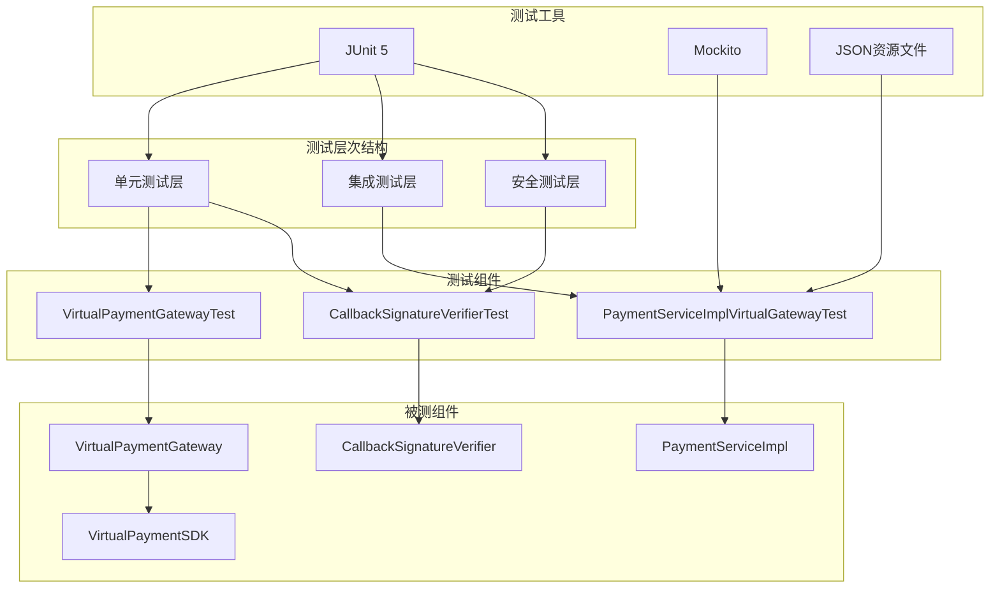

**图表来源**
- [PaymentServiceImplVirtualGatewayTest.java](file://backend/src/test/java/com/carwash/service/payment/PaymentServiceImplVirtualGatewayTest.java#L1-L106)
- [VirtualPaymentGatewayTest.java](file://backend/src/test/java/com/carwash/service/payment/VirtualPaymentGatewayTest.java#L1-L90)
- [CallbackSignatureVerifierTest.java](file://backend/src/test/java/com/carwash/service/payment/security/CallbackSignatureVerifierTest.java#L1-L154)

## PaymentServiceImplVirtualGatewayTest详解

### 测试目标与设计思路

`PaymentServiceImplVirtualGatewayTest` 是一个服务级集成测试，通过模拟数据库访问层来验证支付服务的核心业务流程。该测试的核心目标是验证 `PaymentServiceImpl` 在使用虚拟支付网关时的业务逻辑正确性。

### 测试环境设置

测试通过反射注入虚拟支付SDK，绕过了Spring容器的依赖注入，实现了完全的隔离测试：

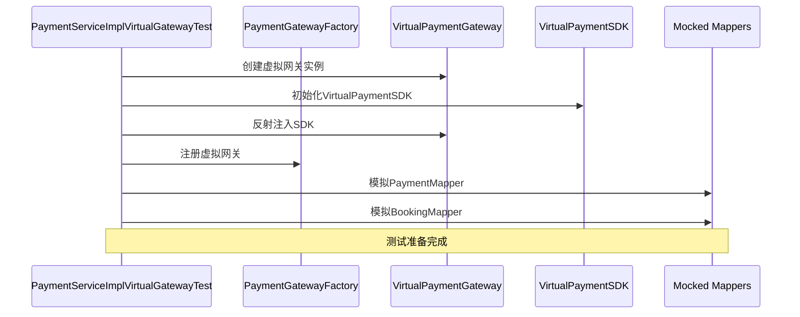

**图表来源**
- [PaymentServiceImplVirtualGatewayTest.java](file://backend/src/test/java/com/carwash/service/payment/PaymentServiceImplVirtualGatewayTest.java#L32-L64)

### 核心测试流程

测试验证了完整的支付生命周期，包括创建支付、查询状态转换和状态验证：

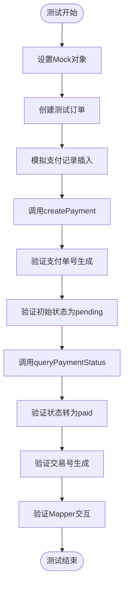

**图表来源**
- [PaymentServiceImplVirtualGatewayTest.java](file://backend/src/test/java/com/carwash/service/payment/PaymentServiceImplVirtualGatewayTest.java#L67-L105)

### 关键测试断言

测试包含了多个层次的断言验证：

| 断言类型 | 验证内容 | 断言方法 |
|---------|---------|---------|
| 支付单号验证 | 确保支付单号生成且非空 | `assertNotNull(created.getPaymentNo())` |
| 状态验证 | 验证初始状态为pending | `assertEquals("pending", created.getStatus())` |
| 状态转换验证 | 验证查询后状态转为paid | `assertEquals("paid", queried.getStatus())` |
| 交易号验证 | 确保交易号生成且非空 | `assertNotNull(queried.getTransactionId())` |
| Mapper交互验证 | 验证数据库操作执行 | `verify(bookingMapper, atLeastOnce()).selectByOrderNo()` |

**节来源**
- [PaymentServiceImplVirtualGatewayTest.java](file://backend/src/test/java/com/carwash/service/payment/PaymentServiceImplVirtualGatewayTest.java#L94-L105)

## VirtualPaymentGatewayTest详解

### 测试范围与覆盖维度

`VirtualPaymentGatewayTest` 是一个完整的单元测试套件，覆盖了虚拟支付网关的所有核心功能：

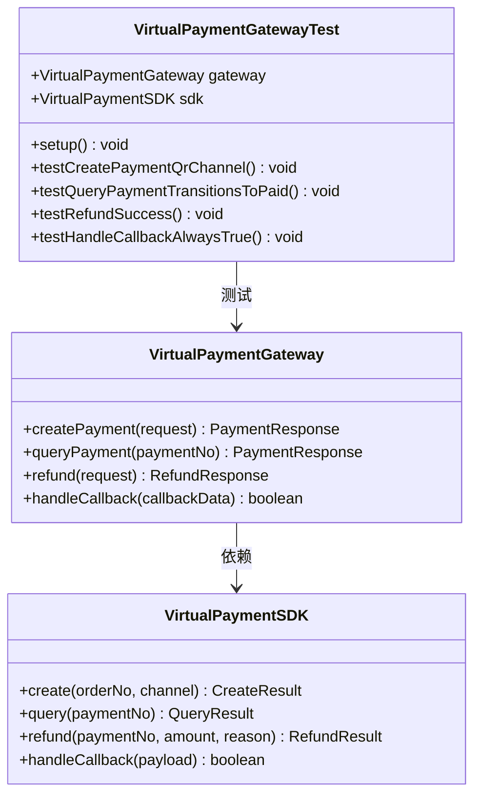

**图表来源**
- [VirtualPaymentGatewayTest.java](file://backend/src/test/java/com/carwash/service/payment/VirtualPaymentGatewayTest.java#L17-L90)
- [VirtualPaymentGateway.java](file://backend/src/main/java/com/carwash/service/payment/VirtualPaymentGateway.java#L20-L92)

### 支付创建测试策略

测试验证了不同支付渠道的创建行为：

| 支付渠道 | 验证要点 | 预期结果 |
|---------|---------|---------|
| QR码支付 | 生成支付单号、状态为pending、返回二维码、不返回支付URL | 所有断言通过 |
| H5支付 | 生成支付单号、状态为pending、返回支付URL、不返回二维码 | 所有断言通过 |
| APP支付 | 生成支付单号、状态为pending、返回深链接、不返回二维码 | 所有断言通过 |

### 退款功能测试

退款测试验证了完整的退款流程，包括退款金额验证和状态管理：

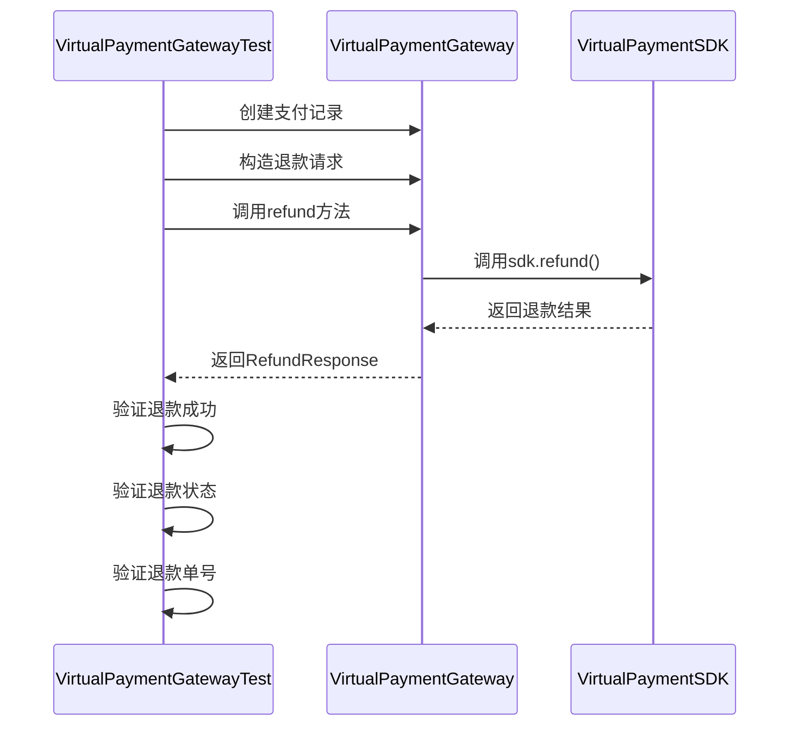

**图表来源**
- [VirtualPaymentGatewayTest.java](file://backend/src/test/java/com/carwash/service/payment/VirtualPaymentGatewayTest.java#L63-L83)

**节来源**
- [VirtualPaymentGatewayTest.java](file://backend/src/test/java/com/carwash/service/payment/VirtualPaymentGatewayTest.java#L1-L90)

## CallbackSignatureVerifierTest详解

### 安全验证机制测试

`CallbackSignatureVerifierTest` 专门验证支付回调的安全性机制，涵盖三种不同的支付方式：

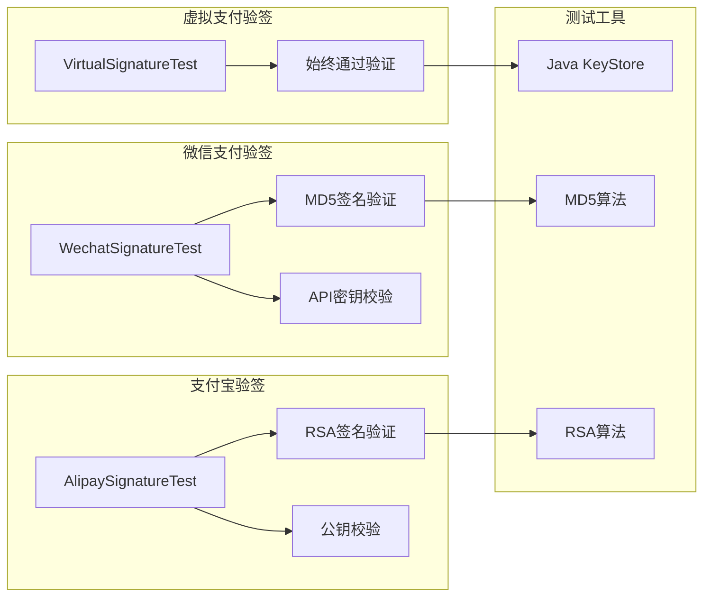

**图表来源**
- [CallbackSignatureVerifierTest.java](file://backend/src/test/java/com/carwash/service/payment/security/CallbackSignatureVerifierTest.java#L22-L104)

### 微信支付验签测试

微信支付采用MD5签名算法，测试验证了正确的签名计算和验证流程：

| 测试场景 | 验证内容 | 预期结果 |
|---------|---------|---------|
| 正确签名验证 | 使用正确的API密钥计算MD5签名 | 验签通过 |
| 错误签名验证 | 提供错误的签名值 | 验签失败 |
| 缺少签名参数 | 不包含sign参数 | 验签失败 |

### 支付宝支付验签测试

支付宝支付采用RSA/RSA2签名算法，测试包含了完整的密钥管理和签名验证流程：

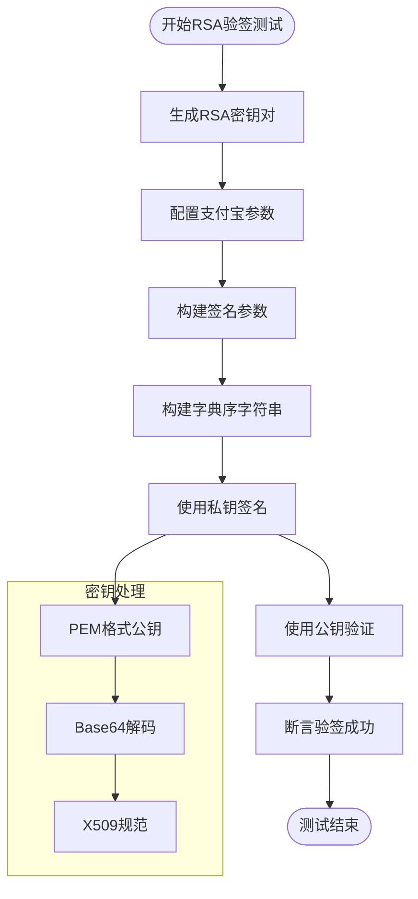

**图表来源**
- [CallbackSignatureVerifierTest.java](file://backend/src/test/java/com/carwash/service/payment/security/CallbackSignatureVerifierTest.java#L63-L95)

**节来源**
- [CallbackSignatureVerifierTest.java](file://backend/src/test/java/com/carwash/service/payment/security/CallbackSignatureVerifierTest.java#L1-L154)

## 测试数据构造策略

### mock资源文件分析

系统使用JSON资源文件来定义虚拟交易数据，提供了标准化的测试数据模板：

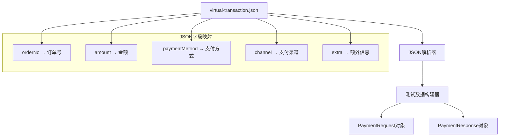

**图表来源**
- [virtual-transaction.json](file://backend/src/test/resources/mock/virtual-transaction.json#L1-L9)

### 测试数据模板设计

测试数据构造遵循以下原则：

| 设计原则 | 实现方式 | 示例 |
|---------|---------|------|
| 标准化 | 使用预定义的JSON模板 | `virtual-transaction.json` |
| 可扩展性 | 支持动态参数替换 | 运行时修改字段值 |
| 一致性 | 确保测试数据格式统一 | 统一的金额格式、订单号格式 |
| 清洁性 | 避免敏感信息泄露 | 使用测试专用的API密钥 |

**节来源**
- [virtual-transaction.json](file://backend/src/test/resources/mock/virtual-transaction.json#L1-L9)

## 测试依赖关系分析

### 组件间依赖关系

系统测试涉及多个组件间的复杂依赖关系：

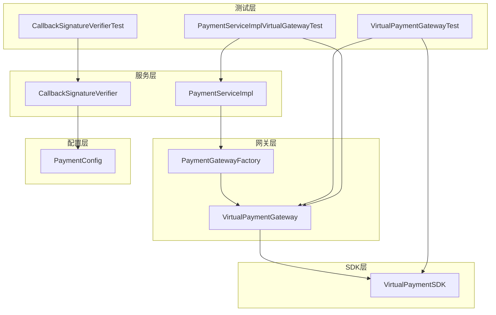

**图表来源**
- [PaymentServiceImplVirtualGatewayTest.java](file://backend/src/test/java/com/carwash/service/payment/PaymentServiceImplVirtualGatewayTest.java#L26-L64)
- [VirtualPaymentGatewayTest.java](file://backend/src/test/java/com/carwash/service/payment/VirtualPaymentGatewayTest.java#L19-L30)

### 依赖注入与模拟策略

测试采用多种依赖注入和模拟策略：

| 策略类型 | 应用场景 | 实现方式 |
|---------|---------|---------|
| 反射注入 | 绕过Spring容器 | 使用`setAccessible(true)` |
| Mock对象 | 模拟外部依赖 | Mockito框架 |
| 配置注入 | 提供测试配置 | 内存中的配置对象 |
| 工厂模式 | 网关实例管理 | PaymentGatewayFactory |

**节来源**
- [PaymentServiceImplVirtualGatewayTest.java](file://backend/src/test/java/com/carwash/service/payment/PaymentServiceImplVirtualGatewayTest.java#L34-L64)

## 断言逻辑与异常处理

### 异常处理测试策略

测试涵盖了各种异常情况的处理验证：

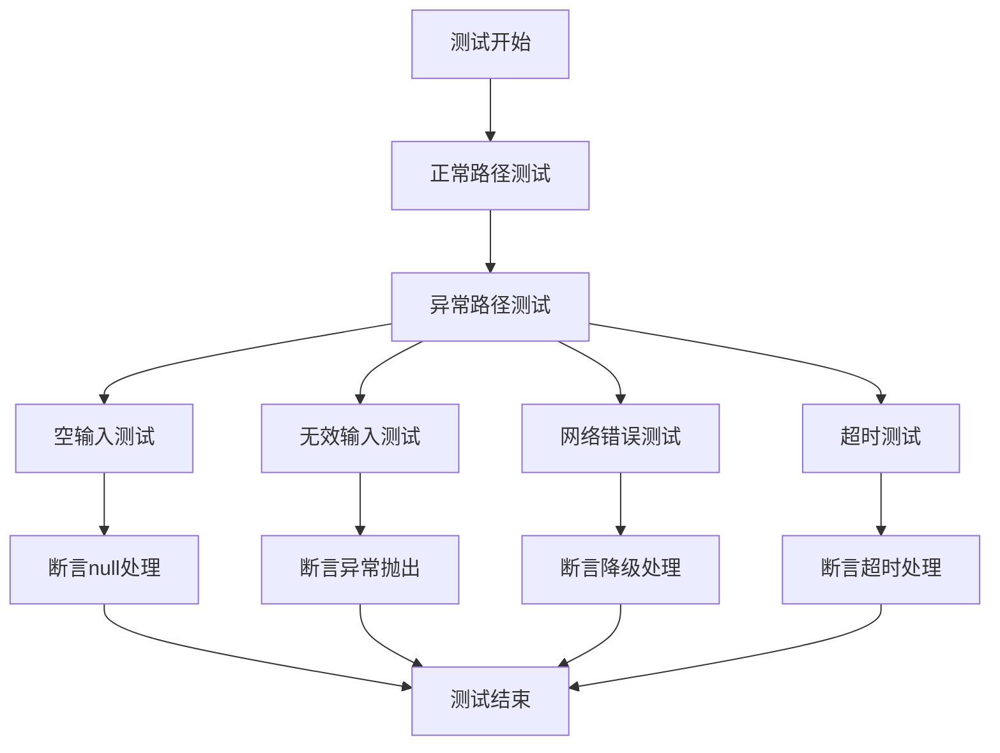

### 断言验证层次

测试采用多层次的断言验证策略：

| 验证层次 | 验证内容 | 断言方法 |
|---------|---------|---------|
| 功能性验证 | 核心业务逻辑正确性 | `assertTrue/assertFalse` |
| 数据完整性验证 | 返回数据的完整性和正确性 | `assertEquals` |
| 状态一致性验证 | 系统状态的一致性 | `assertNotNull` |
| 边界条件验证 | 边界值和异常情况处理 | `assertThrows` |

**节来源**
- [PaymentServiceImplVirtualGatewayTest.java](file://backend/src/test/java/com/carwash/service/payment/PaymentServiceImplVirtualGatewayTest.java#L94-L105)
- [VirtualPaymentGatewayTest.java](file://backend/src/test/java/com/carwash/service/payment/VirtualPaymentGatewayTest.java#L40-L90)

## Maven集成与CI/CD建议

### Maven测试配置

系统使用标准的Maven测试配置，支持JUnit 5和Mockito框架：

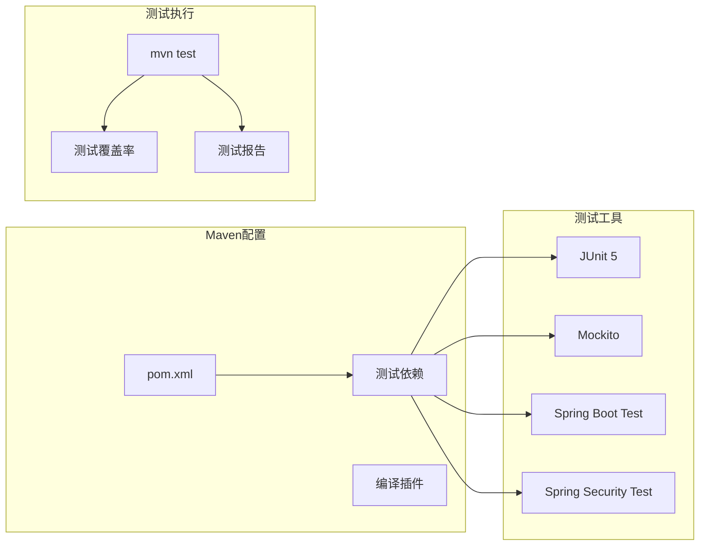

**图表来源**
- [pom.xml](file://backend/pom.xml#L116-L128)

### CI/CD集成建议

| 阶段 | 配置建议 | 实现方式 |
|------|---------|---------|
| 代码检出 | 自动触发 | Git Hook或CI/CD平台 |
| 依赖安装 | Maven依赖管理 | `mvn dependency:resolve` |
| 编译测试 | 并行执行 | `mvn test -Dparallel.tests` |
| 覆盖率检查 | Cobertura或JaCoCo | 配置覆盖率阈值 |
| 报告生成 | HTML和XML报告 | Maven Surefire插件 |
| 结果通知 | 邮件或消息通知 | CI/CD平台集成 |

### 测试覆盖率目标

建议的测试覆盖率目标：

| 组件类型 | 覆盖率目标 | 说明 |
|---------|-----------|------|
| 核心业务逻辑 | ≥90% | PaymentServiceImpl |
| 支付网关抽象层 | ≥85% | PaymentGateway接口实现 |
| 安全验证组件 | ≥95% | CallbackSignatureVerifier |
| 工具类 | ≥80% | 辅助工具和验证器 |

**节来源**
- [pom.xml](file://backend/pom.xml#L1-L156)

## 扩展测试覆盖指南

### 新支付网关测试扩展

添加新的支付网关时的测试扩展步骤：

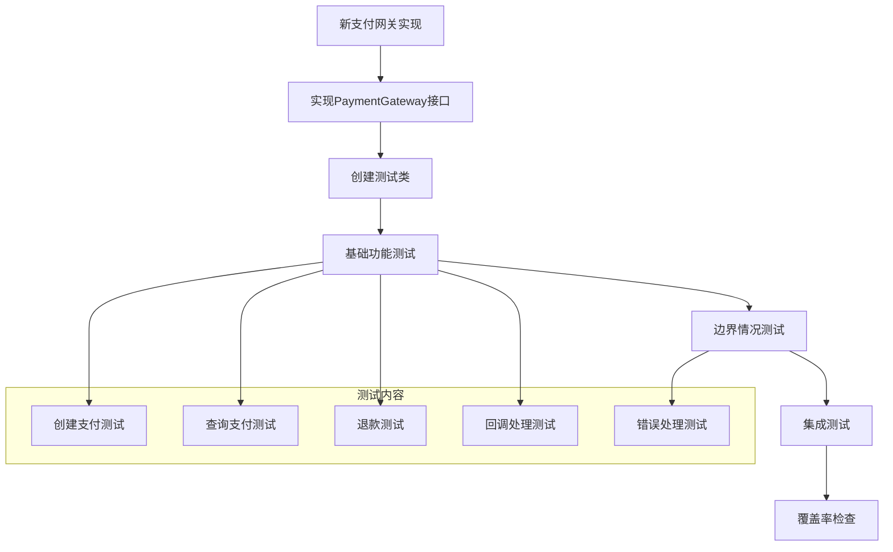

### 测试最佳实践

| 实践领域 | 最佳实践 | 实现建议 |
|---------|---------|---------|
| 测试命名 | 使用描述性的测试方法名 | `testMethodNameScenario` |
| 测试隔离 | 确保测试之间相互独立 | 使用`@BeforeEach`清理状态 |
| 数据驱动 | 使用参数化测试 | JUnit 5 Parameterized Tests |
| Mock策略 | 合理使用Mock对象 | 避免过度Mock |
| 异常测试 | 明确测试异常场景 | `assertThrows`断言 |

### 性能测试集成

建议在现有测试基础上添加性能测试：

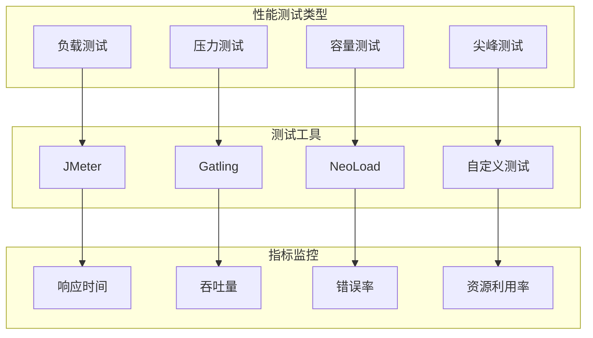

## 总结

本文档全面分析了汽车洗车服务预约系统中支付服务模块的后端测试实践。通过深入研究三个核心测试类，我们了解了：

1. **PaymentServiceImplVirtualGatewayTest** 展示了如何通过虚拟支付网关验证业务服务层的完整流程
2. **VirtualPaymentGatewayTest** 实现了支付网关抽象层的全面单元测试覆盖
3. **CallbackSignatureVerifierTest** 专门验证了支付回调的安全性机制

测试体系采用了分层架构，从单元测试到集成测试再到安全测试，形成了完整的测试金字塔。通过合理的依赖注入策略、Mock对象使用和断言验证，确保了测试的可靠性和可维护性。

对于未来的扩展，建议重点关注：
- 新支付网关的测试覆盖
- 性能测试的集成
- 更细粒度的测试覆盖率目标
- CI/CD流程的自动化

这套测试实践为支付服务模块的质量保证提供了坚实的基础，同时也为其他服务模块的测试开发提供了参考模板。