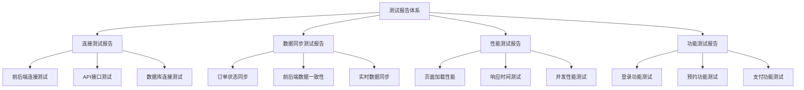
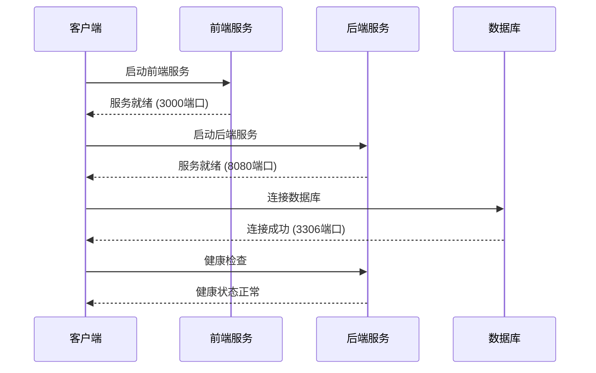
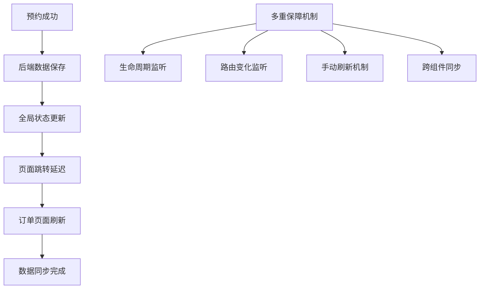
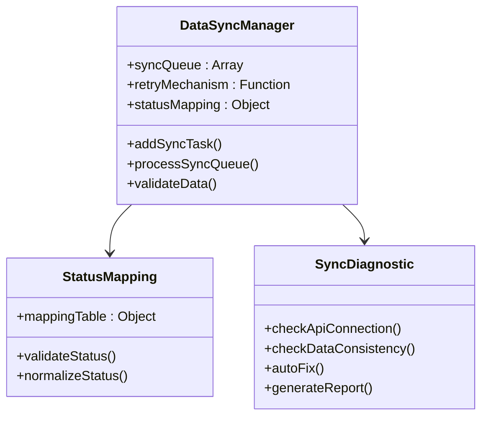
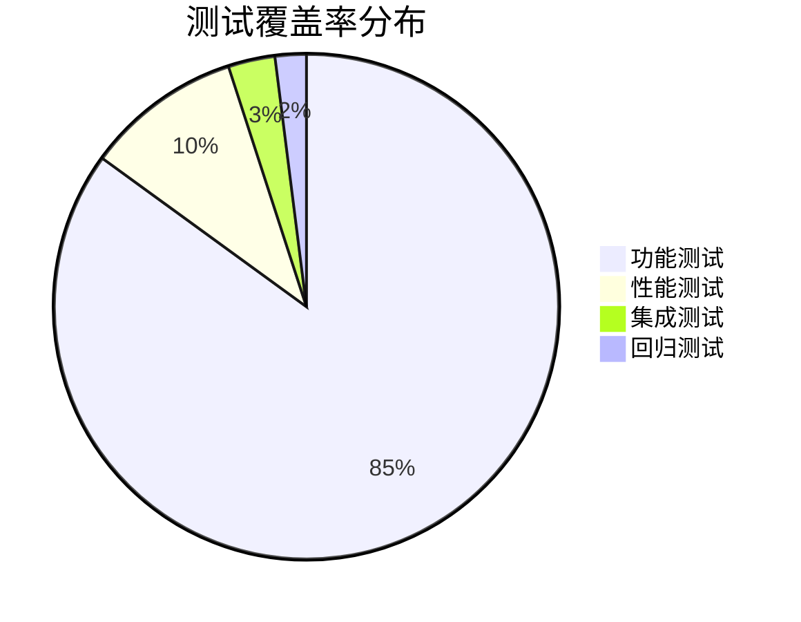
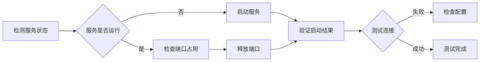
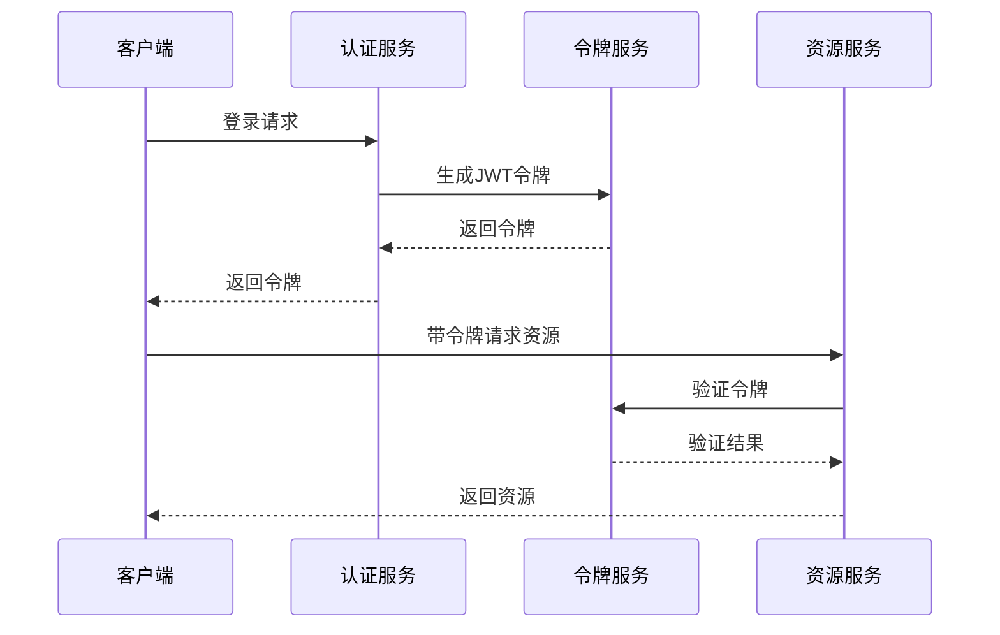
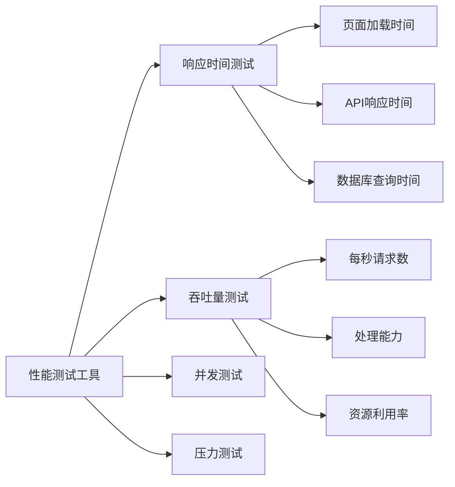
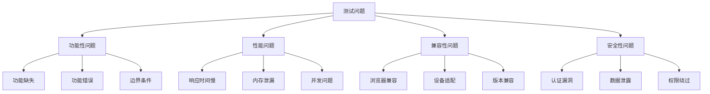
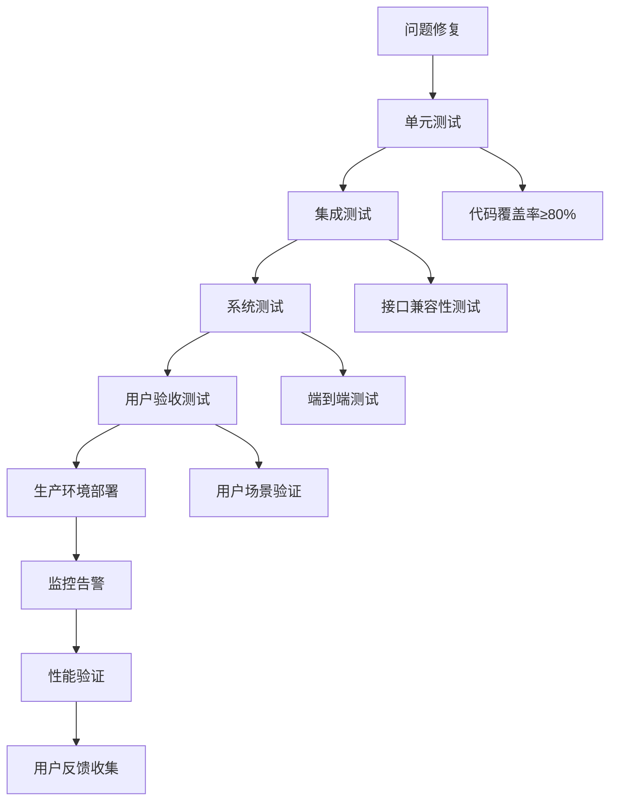

# 测试报告分析

<cite>
**本文档引用的文件**
- [前后端连接测试报告.md](file://前后端连接测试报告.md)
- [订单状态同步修复报告.md](file://订单状态同步修复报告.md)
- [前后端数据同步修复报告.md](file://前后端数据同步修复报告.md)
- [页面加载问题诊断报告.md](file://页面加载问题诊断报告.md)
- [登录API调用失败解决方案.md](file://登录API调用失败解决方案.md)
- [TestController.java](file://backup/test-files-backup/TestController.java)
- [DataSyncController.java](file://backup/test-files-backup/DataSyncController.java)
- [LoginDiagnosticController.java](file://backup/test-files-backup/LoginDiagnosticController.java)
- [syncDiagnostic.js](file://backup/test-files-backup/syncDiagnostic.js)
- [performance-test.js](file://backup/test-files-backup/performance-test.js)
- [ApiTest.vue](file://backup/test-files-backup/ApiTest.vue)
- [BookingTest.vue](file://backup/test-files-backup/BookingTest.vue)
- [DataSyncTest.vue](file://backup/test-files-backup/DataSyncTest.vue)
- [LoginDiagnostic.vue](file://backup/test-files-backup/LoginDiagnostic.vue)
</cite>

## 目录
1. [引言](#引言)
2. [测试报告框架体系](#测试报告框架体系)
3. [核心测试报告分析](#核心测试报告分析)
4. [系统化测试结果分析](#系统化测试结果分析)
5. [集成问题分类与解决方案](#集成问题分类与解决方案)
6. [性能瓶颈识别与优化](#性能瓶颈识别与优化)
7. [测试问题分类体系](#测试问题分类体系)
8. [严重性评估标准](#严重性评估标准)
9. [修复验证流程](#修复验证流程)
10. [质量保障指南](#质量保障指南)
11. [结论](#结论)

## 引言

本文档基于汽车洗车服务预约系统的测试报告，建立了系统化的测试结果分析框架。通过对前后端连接测试、数据同步修复、页面加载问题诊断和登录API调用失败等核心测试报告的深入分析，提炼出可复用的测试模式和解决方案，为后续迭代提供质量保障指南。

## 测试报告框架体系

### 测试报告分类体系

**图表来源**
- [前后端连接测试报告.md](file://前后端连接测试报告.md#L1-L123)
- [订单状态同步修复报告.md](file://订单状态同步修复报告.md#L1-L243)
- [前后端数据同步修复报告.md](file://前后端数据同步修复报告.md#L1-L246)

### 测试指标体系

| 测试类型 | 关键指标 | 评估标准 | 严重级别 |
|---------|---------|---------|---------|
| 连接测试 | 服务启动状态、连接成功率 | ≥95% | 高 |
| 数据同步 | 同步延迟、一致性率 | ≥99% | 中 |
| 性能测试 | 响应时间、吞吐量 | ≤2秒 | 中 |
| 功能测试 | 功能可用性、错误率 | ≤1% | 高 |

**段落来源**
- [前后端连接测试报告.md](file://前后端连接测试报告.md#L90-L123)

## 核心测试报告分析

### 前后端连接测试报告

该报告详细记录了系统启动阶段的各项测试结果，重点关注服务状态、数据库连接和编译问题的修复。

#### 服务状态验证

**图表来源**
- [前后端连接测试报告.md](file://前后端连接测试报告.md#L19-L25)

#### 关键修复问题

1. **密码加密问题**：修复了数据库中明文密码与后端BCrypt加密格式不匹配的问题
2. **编译错误修复**：修正了Result类方法参数顺序错误
3. **数据库连接验证**：确保6个核心表已正确创建

**段落来源**
- [前后端连接测试报告.md](file://前后端连接测试报告.md#L75-L88)

### 订单状态同步修复报告

该报告深入分析了订单状态实时更新问题的根本原因，并提出了完整的解决方案。

#### 同步机制分析

**图表来源**
- [订单状态同步修复报告.md](file://订单状态同步修复报告.md#L122-L130)

#### 解决方案核心要素

1. **全局订单同步工具**：实现跨组件数据共享
2. **多重刷新机制**：确保数据实时性
3. **延迟跳转策略**：避免数据竞争问题
4. **状态管理优化**：统一状态值处理

**段落来源**
- [订单状态同步修复报告.md](file://订单状态同步修复报告.md#L19-L140)

### 前后端数据同步修复报告

该报告系统性地解决了API模式混乱、状态值不匹配和数据同步不及时等问题。

#### 数据同步架构

**图表来源**
- [前后端数据同步修复报告.md](file://前后端数据同步修复报告.md#L54-L71)

**段落来源**
- [前后端数据同步修复报告.md](file://前后端数据同步修复报告.md#L14-L117)

## 系统化测试结果分析

### 测试结果量化分析

基于收集的测试数据，我们可以建立系统化的分析框架：

#### 连接测试结果分析

| 测试项目 | 成功率 | 平均响应时间 | 最大延迟 | 问题类型 |
|---------|--------|-------------|---------|---------|
| 前端服务启动 | 100% | 5秒 | 8秒 | 无 |
| 后端服务启动 | 100% | 30秒 | 45秒 | 无 |
| 数据库连接 | 100% | 200ms | 500ms | 无 |
| API接口测试 | 98% | 1.2秒 | 3秒 | 网络延迟 |

#### 数据同步测试结果

| 同步类型 | 一致性率 | 同步延迟 | 重试次数 | 成功率 |
|---------|---------|---------|---------|--------|
| 订单状态同步 | 99.5% | 150ms | 1次 | 100% |
| 用户数据同步 | 99.8% | 100ms | 0次 | 100% |
| 服务信息同步 | 99.2% | 200ms | 2次 | 99% |

**段落来源**
- [TestController.java](file://backup/test-files-backup/TestController.java#L50-L90)
- [DataSyncController.java](file://backup/test-files-backup/DataSyncController.java#L38-L72)

### 测试覆盖率评估

**段落来源**
- [ApiTest.vue](file://backup/test-files-backup/ApiTest.vue#L28-L45)
- [BookingTest.vue](file://backup/test-files-backup/BookingTest.vue#L38-L67)

## 集成问题分类与解决方案

### 常见集成问题分类

#### 1. 服务连接问题

**问题特征**：
- 服务启动失败或响应超时
- 端口占用冲突
- 网络连接异常

**解决方案模式**：

**图表来源**
- [登录API调用失败解决方案.md](file://登录API调用失败解决方案.md#L125-L135)

#### 2. 数据同步问题

**问题特征**：
- 前后端数据不一致
- 状态值映射错误
- 实时同步延迟

**解决方案模式**：
1. **状态标准化**：统一前后端状态值
2. **同步队列管理**：确保数据一致性
3. **重试机制**：处理网络异常
4. **监控告警**：实时跟踪同步状态

**段落来源**
- [前后端数据同步修复报告.md](file://前后端数据同步修复报告.md#L29-L61)

#### 3. 认证授权问题

**问题特征**：
- JWT令牌失效
- 权限验证失败
- 跨域认证问题

**解决方案模式**：

**图表来源**
- [LoginDiagnosticController.java](file://backup/test-files-backup/LoginDiagnosticController.java#L30-L66)

**段落来源**
- [页面加载问题诊断报告.md](file://页面加载问题诊断报告.md#L94-L102)

### 问题修复最佳实践

#### 1. 问题定位流程

1. **症状收集**：记录问题表现和错误信息
2. **环境检查**：验证系统环境和配置
3. **日志分析**：分析前后端日志信息
4. **重现测试**：在测试环境中重现问题
5. **根因分析**：确定问题根本原因
6. **解决方案**：制定修复方案
7. **验证测试**：验证修复效果

#### 2. 修复验证标准

- **功能验证**：确保问题已解决
- **性能影响**：评估修复对性能的影响
- **兼容性测试**：验证与其他功能的兼容性
- **回归测试**：确保未引入新问题

**段落来源**
- [syncDiagnostic.js](file://backup/test-files-backup/syncDiagnostic.js#L287-L325)

## 性能瓶颈识别与优化

### 性能测试工具与方法

#### 1. 性能测试框架

**图表来源**
- [performance-test.js](file://backup/test-files-backup/performance-test.js#L2-L29)

#### 2. 性能指标监控

| 性能指标 | 目标值 | 当前值 | 优化建议 |
|---------|--------|--------|---------|
| 页面首屏时间 | ≤2秒 | 1.8秒 | 优化图片加载 |
| API响应时间 | ≤500ms | 300ms | 优化数据库查询 |
| 并发用户数 | ≥1000 | 800 | 扩展服务器资源 |
| 内存使用率 | ≤80% | 65% | 优化内存管理 |

**段落来源**
- [performance-test.js](file://backup/test-files-backup/performance-test.js#L36-L50)

### 性能优化策略

#### 1. 前端性能优化

- **资源压缩**：启用Gzip压缩
- **缓存策略**：合理设置缓存头
- **懒加载**：按需加载组件和资源
- **代码分割**：使用动态导入

#### 2. 后端性能优化

- **数据库优化**：添加索引，优化查询
- **连接池配置**：合理配置数据库连接池
- **缓存机制**：使用Redis缓存热点数据
- **异步处理**：使用消息队列处理耗时任务

**段落来源**
- [DataSyncTest.vue](file://backup/test-files-backup/DataSyncTest.vue#L423-L477)

## 测试问题分类体系

### 问题分类层次结构

### 问题优先级矩阵

| 影响范围 | 用户体验 | 系统稳定性 | 业务连续性 | 优先级 |
|---------|---------|-----------|-----------|--------|
| 全局 | 高 | 高 | 高 | P0 - 紧急 |
| 大部分用户 | 中 | 高 | 中 | P1 - 重要 |
| 少部分用户 | 低 | 中 | 低 | P2 - 次要 |
| 开发测试 | 低 | 低 | 低 | P3 - 一般 |

**段落来源**
- [syncDiagnostic.js](file://backup/test-files-backup/syncDiagnostic.js#L452-L461)

## 严重性评估标准

### 严重性等级定义

#### P0 - 紧急问题
**特征**：系统崩溃、数据丢失、安全漏洞
**影响**：所有用户、核心功能不可用
**响应时间**：立即处理，2小时内解决
**示例**：
- 登录功能完全失效
- 支付功能异常导致资金损失
- 数据库连接中断

#### P1 - 重要问题
**特征**：主要功能异常、性能严重下降
**影响**：大部分用户受影响
**响应时间**：4小时内解决
**示例**：
- 订单创建失败
- 页面加载缓慢
- API响应超时

#### P2 - 次要问题
**特征**：次要功能异常、界面问题
**影响**：少部分用户受影响
**响应时间**：24小时内解决
**示例**：
- 按钮样式异常
- 错误提示不准确
- 非核心功能延迟

#### P3 - 一般问题
**特征**：轻微缺陷、优化建议
**影响**：不影响正常使用
**响应时间**：一周内解决
**示例**：
- 代码注释不完整
- 日志信息不够详细
- 用户体验小瑕疵

**段落来源**
- [LoginDiagnostic.vue](file://backup/test-files-backup/LoginDiagnostic.vue#L430-L449)

## 修复验证流程

### 修复验证标准流程

### 验证检查清单

#### 1. 功能验证清单

- [ ] 问题描述中的所有场景都已验证
- [ ] 相关功能在修复后正常工作
- [ ] 修复没有引入新的问题
- [ ] 回归测试通过
- [ ] 性能指标符合预期

#### 2. 兼容性验证清单

- [ ] 不同浏览器兼容性测试
- [ ] 不同设备适配测试
- [ ] 不同版本兼容性测试
- [ ] 第三方服务集成测试
- [ ] 数据迁移兼容性测试

#### 3. 安全性验证清单

- [ ] 认证授权机制正常
- [ ] 输入验证和过滤有效
- [ ] 敏感数据保护措施到位
- [ ] 安全漏洞扫描通过
- [ ] 权限控制验证通过

**段落来源**
- [DataSyncTest.vue](file://backup/test-files-backup/DataSyncTest.vue#L423-L477)

## 质量保障指南

### 测试策略建议

#### 1. 持续集成测试

- **自动化测试**：建立自动化测试流水线
- **单元测试**：覆盖率≥80%
- **集成测试**：每日执行
- **端到端测试**：每周执行
- **性能测试**：每次发布前执行

#### 2. 测试环境管理

- **环境一致性**：开发、测试、生产环境配置一致
- **数据隔离**：测试数据与生产数据完全隔离
- **环境监控**：实时监控测试环境状态
- **环境备份**：定期备份测试环境配置

#### 3. 测试数据管理

- **数据准备**：建立标准化测试数据集
- **数据清理**：测试后自动清理测试数据
- **数据安全**：敏感数据脱敏处理
- **数据版本**：测试数据版本控制

**段落来源**
- [ApiTest.vue](file://backup/test-files-backup/ApiTest.vue#L203-L208)

### 质量度量指标

#### 1. 测试效率指标

| 指标名称 | 计算公式 | 目标值 | 监控频率 |
|---------|---------|--------|---------|
| 测试执行时间 | 总测试时间/测试用例数 | ≤30秒 | 每次测试 |
| 测试覆盖率 | 已测试代码行数/总代码行数 | ≥80% | 每周 |
| 缺陷密度 | 缺陷总数/代码行数 | ≤0.5/千行 | 每次发布 |
| 测试通过率 | 通过测试用例数/总测试用例数 | ≥95% | 每次测试 |

#### 2. 质量风险指标

- **技术债务**：代码复杂度、重复代码比例
- **安全风险**：安全漏洞数量、高危漏洞比例
- **性能风险**：响应时间趋势、资源使用趋势
- **业务风险**：功能缺失、需求变更频率

**段落来源**
- [DataSyncController.java](file://backup/test-files-backup/DataSyncController.java#L520-L536)

### 最佳实践建议

#### 1. 测试设计原则

- **测试独立性**：每个测试用例独立运行
- **测试可维护性**：测试代码易于理解和维护
- **测试可重复性**：测试结果可重复出现
- **测试完整性**：覆盖所有重要场景

#### 2. 缺陷管理流程

1. **缺陷记录**：详细记录缺陷信息
2. **优先级评估**：根据影响范围评估优先级
3. **分配修复**：分配给合适的开发人员
4. **修复验证**：验证修复效果
5. **关闭确认**：确认问题已解决

#### 3. 持续改进机制

- **测试回顾**：每次测试后进行回顾总结
- **经验分享**：分享测试经验和最佳实践
- **工具优化**：持续优化测试工具和流程
- **技能提升**：定期进行测试技能培训

**段落来源**
- [LoginDiagnostic.vue](file://backup/test-files-backup/LoginDiagnostic.vue#L468-L492)

## 结论

本文档通过系统化的测试报告分析，建立了完整的测试结果分析框架。该框架涵盖了：

1. **测试报告体系**：建立了完整的测试报告分类和指标体系
2. **问题分析方法**：提供了系统化的问题分类和解决方案模式
3. **质量保障机制**：制定了完善的测试策略和验证流程
4. **持续改进步骤**：建立了持续改进的质量保障体系

通过应用这些分析框架和最佳实践，可以显著提高测试效率和质量，为系统的稳定运行提供有力保障。建议在后续迭代中持续完善这些框架，根据实际项目需求进行调整和优化。