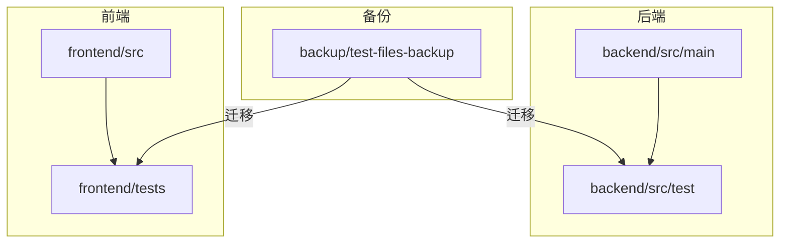
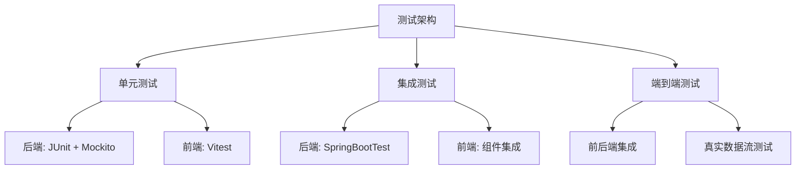
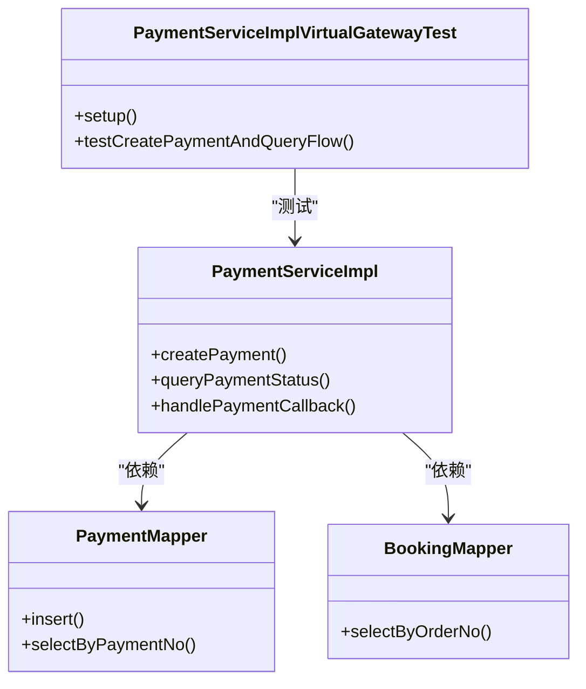
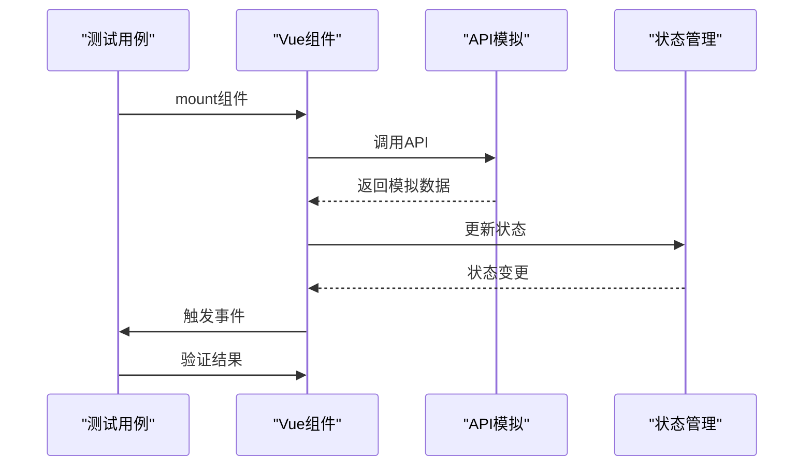

# 测试策略

<cite>
**本文档引用的文件**  
- [PaymentServiceImpl.java](file://backend/src/main/java/com/carwash/service/impl/PaymentServiceImpl.java)
- [PaymentController.java](file://backend/src/main/java/com/carwash/controller/PaymentController.java)
- [PaymentServiceImplVirtualGatewayTest.java](file://backend/src/test/java/com/carwash/service/payment/PaymentServiceImplVirtualGatewayTest.java)
- [pom.xml](file://backend/pom.xml)
- [vite.config.js](file://frontend/vite.config.js)
- [setup.js](file://frontend/tests/setup.js)
- [ordersFetch.spec.js](file://frontend/tests/ordersFetch.spec.js)
- [payButton.integration.spec.js](file://frontend/tests/payButton.integration.spec.js)
- [paymentAmount.spec.js](file://frontend/tests/paymentAmount.spec.js)
- [paymentFlow.spec.js](file://frontend/tests/paymentFlow.spec.js)
- [package.json](file://frontend/package.json)
- [test-api.html](file://backup/test-files-backup/test-api.html)
- [performance-test.js](file://backup/test-files-backup/performance-test.js)
- [mock.js](file://backup/test-files-backup/mock.js)
- [前后端连接测试报告.md](file://前后端连接测试报告.md)
</cite>

## 目录
1. [引言](#引言)
2. [项目结构](#项目结构)
3. [核心组件](#核心组件)
4. [架构概述](#架构概述)
5. [详细组件分析](#详细组件分析)
6. [依赖分析](#依赖分析)
7. [性能考量](#性能考量)
8. [故障排除指南](#故障排除指南)
9. [结论](#结论)
10. [附录](#附录)

## 引言
本文档旨在为汽车洗车服务预约系统制定全面的测试策略，涵盖单元测试、集成测试和端到端测试。文档详细说明了后端使用JUnit对Service层（如PaymentServiceImpl）进行业务逻辑测试的方法，以及前端使用Vitest框架对组件和API调用进行测试的实践。同时，分析了backup/test-files-backup/目录下遗留测试文件的价值与迁移方案，并结合前后端连接测试报告定义接口契约测试的标准流程。最后，提供了测试覆盖率目标与持续集成（CI）的集成建议。

## 项目结构
本项目采用前后端分离的架构，后端基于Spring Boot构建，前端基于Vue 3和Vite构建。测试相关文件分布在不同的目录中，后端测试位于`backend/src/test`目录下，前端测试位于`frontend/tests`目录下。遗留的测试文件存放在`backup/test-files-backup/`目录中，包含HTML测试页面和JavaScript测试脚本。



**图源**  
- [backend/src/test](file://backend/src/test)
- [frontend/tests](file://frontend/tests)
- [backup/test-files-backup](file://backup/test-files-backup)

**节源**  
- [backend/src/test](file://backend/src/test)
- [frontend/tests](file://frontend/tests)
- [backup/test-files-backup](file://backup/test-files-backup)

## 核心组件
系统的核心测试组件包括后端的PaymentServiceImpl服务类及其测试类PaymentServiceImplVirtualGatewayTest，以及前端的Vitest测试套件。这些组件负责验证支付业务逻辑的正确性、组件交互的完整性以及API调用的准确性。

**节源**  
- [PaymentServiceImpl.java](file://backend/src/main/java/com/carwash/service/impl/PaymentServiceImpl.java)
- [PaymentServiceImplVirtualGatewayTest.java](file://backend/src/test/java/com/carwash/service/payment/PaymentServiceImplVirtualGatewayTest.java)
- [setup.js](file://frontend/tests/setup.js)

## 架构概述
系统的测试架构分为三个层次：单元测试、集成测试和端到端测试。单元测试验证单个类或方法的逻辑正确性，集成测试验证组件之间的交互，端到端测试验证整个业务流程的完整性。后端使用JUnit 5和Mockito进行测试，前端使用Vitest进行组件和API测试。



**图源**  
- [pom.xml](file://backend/pom.xml)
- [vite.config.js](file://frontend/vite.config.js)
- [package.json](file://frontend/package.json)

## 详细组件分析

### 后端服务层测试分析
后端服务层的测试主要集中在PaymentServiceImpl类上，通过PaymentServiceImplVirtualGatewayTest类进行验证。测试使用Mockito框架模拟Mapper层的数据库交互，确保业务逻辑的独立测试。

#### 单元测试实现


**图源**  
- [PaymentServiceImplVirtualGatewayTest.java](file://backend/src/test/java/com/carwash/service/payment/PaymentServiceImplVirtualGatewayTest.java)
- [PaymentServiceImpl.java](file://backend/src/main/java/com/carwash/service/impl/PaymentServiceImpl.java)
- [PaymentMapper.java](file://backend/src/main/java/com/carwash/mapper/PaymentMapper.java)
- [BookingMapper.java](file://backend/src/main/java/com/carwash/mapper/BookingMapper.java)

**节源**  
- [PaymentServiceImplVirtualGatewayTest.java](file://backend/src/test/java/com/carwash/service/payment/PaymentServiceImplVirtualGatewayTest.java)
- [PaymentServiceImpl.java](file://backend/src/main/java/com/carwash/service/impl/PaymentServiceImpl.java)

### 前端组件测试分析
前端测试使用Vitest框架，主要测试组件的渲染、交互和API调用。测试文件位于`frontend/tests`目录下，包括ordersFetch.spec.js、payButton.integration.spec.js等。

#### 集成测试实现


**图源**  
- [ordersFetch.spec.js](file://frontend/tests/ordersFetch.spec.js)
- [payButton.integration.spec.js](file://frontend/tests/payButton.integration.spec.js)
- [setup.js](file://frontend/tests/setup.js)

**节源**  
- [ordersFetch.spec.js](file://frontend/tests/ordersFetch.spec.js)
- [payButton.integration.spec.js](file://frontend/tests/payButton.integration.spec.js)
- [paymentAmount.spec.js](file://frontend/tests/paymentAmount.spec.js)
- [paymentFlow.spec.js](file://frontend/tests/paymentFlow.spec.js)

## 依赖分析
系统的测试依赖通过构建工具进行管理。后端使用Maven管理依赖，在pom.xml中定义了JUnit、Mockito等测试框架。前端使用npm管理依赖，在package.json中定义了Vitest、@vue/test-utils等测试工具。

```mermaid
graph TD
subgraph "后端依赖"
A[JUnit 5]
B[Mockito]
C[Spring Boot Test]
end
subgraph "前端依赖"
D[Vitest]
E[@vue/test-utils]
F[jsdom]
end
A --> |测试框架| PaymentServiceImpl
B --> |模拟框架| PaymentServiceImpl
C --> |集成测试| PaymentController
D --> |测试框架| Vue组件
E --> |组件测试| Vue组件
F --> |DOM环境| 组件测试
```

**图源**  
- [pom.xml](file://backend/pom.xml)
- [package.json](file://frontend/package.json)

**节源**  
- [pom.xml](file://backend/pom.xml)
- [package.json](file://frontend/package.json)

## 性能考量
系统包含性能测试工具，用于测量关键操作的响应时间。performance-test.js文件提供了性能测量类，可以记录和报告函数执行时间。这些工具可用于识别性能瓶颈并进行优化。

**节源**  
- [performance-test.js](file://backup/test-files-backup/performance-test.js)
- [concurrencyTest.js](file://frontend/src/utils/concurrencyTest.js)

## 故障排除指南
系统提供了多种测试诊断工具，包括API测试页面（test-api.html）、登录诊断脚本（loginDiagnostic.js）和同步诊断工具（syncDiagnostic.js）。这些工具可用于快速定位和解决常见问题。

**节源**  
- [test-api.html](file://backup/test-files-backup/test-api.html)
- [loginDiagnostic.js](file://backup/test-files-backup/loginDiagnostic.js)
- [syncDiagnostic.js](file://backup/test-files-backup/syncDiagnostic.js)

## 结论
本测试策略文档为汽车洗车服务预约系统提供了全面的测试框架。通过结合现代测试框架（JUnit、Vitest）和遗留测试资产，可以建立一个健壮的测试体系。建议将遗留的HTML测试页面迁移到自动化测试框架中，以提高测试效率和可维护性。同时，应建立接口契约测试流程，确保前后端的兼容性，并设置合理的测试覆盖率目标以保证代码质量。

## 附录
### 遗留测试文件迁移方案
| 原始文件 | 迁移目标 | 迁移方法 |
|---------|---------|---------|
| test-api.html | Vitest端到端测试 | 将手动测试步骤转换为自动化测试用例 |
| performance-test.js | 前端性能监控 | 集成到现有性能测试框架 |
| mock.js | Vitest模拟配置 | 转换为Vitest的vi.mock语法 |

### 接口契约测试流程
1. 定义API契约（基于前后端连接测试报告）
2. 生成测试桩（Stub）和模拟（Mock）
3. 执行契约测试
4. 验证兼容性
5. 生成测试报告

### 测试覆盖率目标
- 单元测试覆盖率：≥ 80%
- 集成测试覆盖率：≥ 70%
- 关键业务流程：100%覆盖
- 持续集成：每次提交自动运行测试