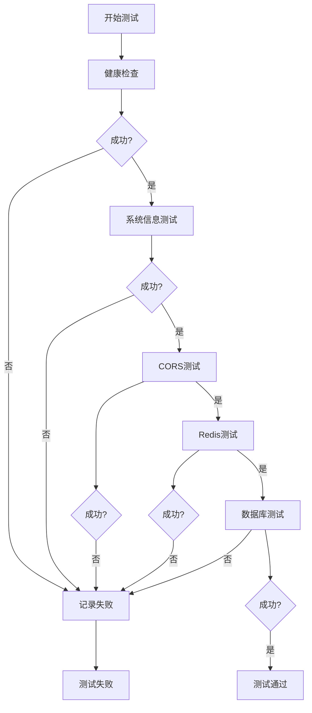
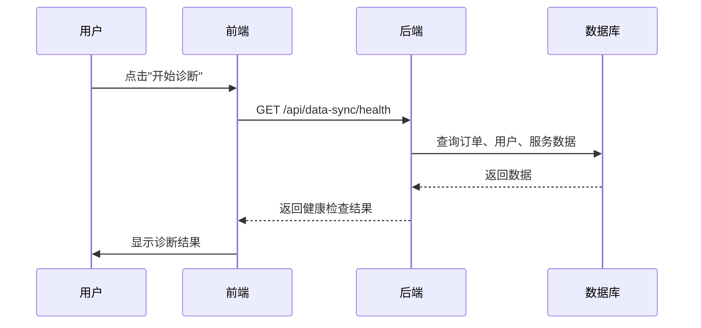

# 集成测试

<cite>
**本文档引用的文件**   
- [ApiTest.vue](file://backup/test-files-backup/ApiTest.vue)
- [OrderFlowTest.vue](file://backup/test-files-backup/OrderFlowTest.vue)
- [LoginDiagnostic.vue](file://backup/test-files-backup/LoginDiagnostic.vue)
- [DataSyncTest.vue](file://backup/test-files-backup/DataSyncTest.vue)
- [TestController.java](file://backup/test-files-backup/TestController.java)
- [DataSyncController.java](file://backup/test-files-backup/DataSyncController.java)
- [LoginDiagnosticController.java](file://backup/test-files-backup/LoginDiagnosticController.java)
- [mock.js](file://backup/test-files-backup/mock.js)
- [mockOrderApi.js](file://backup/test-files-backup/mockOrderApi.js)
- [realApi.js](file://frontend/src/api/realApi.js)
- [dataSync.js](file://frontend/src/utils/dataSync.js)
- [loginDiagnostic.js](file://backup/test-files-backup/loginDiagnostic.js)
- [syncDiagnostic.js](file://backup/test-files-backup/syncDiagnostic.js)
- [前后端连接测试报告.md](file://前后端连接测试报告.md)
</cite>

## 目录
1. [引言](#引言)
2. [测试环境搭建](#测试环境搭建)
3. [接口契约测试流程](#接口契约测试流程)
4. [核心测试环节解析](#核心测试环节解析)
5. [遗留测试文件的端到端验证](#遗留测试文件的端到端验证)
6. [诊断工具的价值评估](#诊断工具的价值评估)
7. [关键测试点详解](#关键测试点详解)
8. [测试资产迁移与自动化](#测试资产迁移与自动化)
9. [结论](#结论)

## 引言

本文档旨在基于《前后端连接测试报告.md》建立标准化的集成测试流程，为汽车洗车服务预约系统的质量保障提供全面指导。文档详细解析了从服务启动、数据库连接到API端点验证等关键测试环节的执行步骤与成功标准。通过分析`ApiTest.vue`、`OrderFlowTest.vue`等遗留测试文件，本文档展示了如何利用现有资产进行端到端流程验证，并评估了`LoginDiagnostic.vue`和`DataSyncTest.vue`在诊断认证与数据同步问题中的实际价值。最终，文档将提供从测试环境搭建、测试用例设计到结果验证的完整指南，并指导如何将遗留测试资产迁移到现代测试框架，建立持续集成的自动化测试流水线。

## 测试环境搭建

构建一个稳定可靠的测试环境是进行有效集成测试的前提。本系统提供了多种环境配置选项，以支持不同阶段的测试需求。

### 前端测试环境

前端测试环境主要通过Vite开发服务器和一系列HTML测试页面构成。开发人员可以使用`npm run dev`启动开发服务器，该服务器默认监听`localhost:5173`。为了进行特定功能的测试，项目提供了多个独立的HTML测试页面，如`test-login.html`、`test-payment.html`和`test-websocket.html`，这些页面可以直接在浏览器中打开，用于快速验证特定功能模块。

前端的API模式由环境变量`VITE_USE_REAL_API`控制。当该变量设置为`true`时，前端将连接到真实后端API；当设置为`false`时，则使用`mock.js`提供的模拟数据。这种设计使得开发和测试可以在没有后端服务的情况下并行进行。

### 后端测试环境

后端测试环境基于Spring Boot框架构建，可以通过`start-backend.bat`脚本一键启动。服务默认运行在`8080`端口。为了确保测试环境的纯净，项目提供了`reset-database.bat`和`reset-database-safe.bat`两个脚本，用于重置数据库到初始状态。`reset-database-safe.bat`会保留管理员账户，而`reset-database.bat`则会完全清空数据库。

后端提供了多个测试专用的控制器，如`TestController.java`，它暴露了`/api/test/db`、`/api/test/booking`等端点，用于直接测试数据库连接和订单创建功能。这些端点为前端测试提供了强有力的后端支持。

### 数据库与缓存环境

系统依赖MySQL数据库和Redis缓存。数据库的初始化脚本位于`sql/`目录下，包括`init.sql`和`insert_test_bookings.sql`等。Redis服务可以通过`start-redis-server.bat`脚本启动，其配置文件为`redis.windows.conf`。

测试环境的数据库连接信息在`backend/src/main/resources/application-payment.yml`中配置，开发人员可以根据需要修改数据库URL、用户名和密码。

**Section sources**
- [start-backend.bat](file://start-backend.bat)
- [reset-database.bat](file://reset-database.bat)
- [reset-database-safe.bat](file://reset-database-safe.bat)
- [start-redis-server.bat](file://start-redis-server.bat)
- [init.sql](file://sql/init.sql)
- [application-payment.yml](file://backend/src/main/resources/application-payment.yml)

## 接口契约测试流程

接口契约测试是确保前后端协同工作的核心。本系统通过`ApiTest.vue`组件建立了一套标准化的测试流程，该流程涵盖了从基础连接到复杂业务逻辑的全面验证。

### 测试流程设计

`ApiTest.vue`组件提供了一个用户友好的界面，用于执行一系列预定义的测试。测试流程从最基础的健康检查开始，逐步深入到数据库和Redis连接测试。每个测试都有明确的成功标准，测试结果会实时显示在时间线中，便于追踪和分析。

**Diagram sources**
- [ApiTest.vue](file://backup/test-files-backup/ApiTest.vue#L127-L200)

### 成功标准

每个测试环节都有其特定的成功标准：
- **健康检查**：向`/api/test/health`端点发送GET请求，期望返回HTTP 200状态码和包含`"status": "success"`的JSON响应。
- **系统信息**：向`/api/test/info`端点发送GET请求，期望返回HTTP 200状态码和包含系统版本、运行时间等信息的JSON响应。
- **CORS测试**：验证跨域请求是否被正确处理，期望响应头中包含`Access-Control-Allow-Origin`等CORS相关字段。
- **Redis测试**：向`/api/test/redis`端点发送GET请求，期望返回HTTP 200状态码和包含`"status": "connected"`的JSON响应。
- **数据库测试**：向`/api/test/database`端点发送GET请求，期望返回HTTP 200状态码和包含数据库表计数信息的JSON响应。

这些明确的标准为自动化测试提供了依据，确保了测试结果的可重复性和可验证性。

**Section sources**
- [ApiTest.vue](file://backup/test-files-backup/ApiTest.vue#L127-L200)
- [TestController.java](file://backup/test-files-backup/TestController.java#L53-L90)

## 核心测试环节解析

集成测试的核心在于验证系统各组件之间的交互是否符合预期。本节将详细解析服务启动、数据库连接和API端点验证这三个关键环节。

### 服务启动测试

服务启动测试是集成测试的第一步，旨在验证后端服务是否能够正常启动并响应请求。`ApiTest.vue`中的健康检查功能是这一环节的核心。

测试步骤如下：
1. 前端通过`realApi.healthCheck()`方法向后端`/api/test/health`端点发起请求。
2. 后端`TestController`接收到请求后，立即返回一个预定义的成功响应。
3. 前端接收到响应后，检查HTTP状态码和响应体中的`code`字段，确认服务处于健康状态。

此测试的成功标准是前端能够成功接收到HTTP 200响应，并且响应体中的`code`值为200。如果测试失败，可能的原因包括后端服务未启动、网络连接问题或端口被占用。

### 数据库连接测试

数据库连接测试验证了后端服务与数据库之间的通信是否正常。这是确保业务数据能够持久化的关键。

测试步骤如下：
1. 前端通过`realApi.testDatabase()`方法向后端`/api/test/database`端点发起请求。
2. 后端`TestController`接收到请求后，会执行一系列数据库查询操作，包括查询用户、服务、时间段和订单表。
3. 如果所有查询都成功，后端将返回一个包含各表记录数的JSON响应；如果任一查询失败，将返回错误信息。

此测试的成功标准是后端能够成功查询到所有四个核心表的数据，并返回一个包含`"status": "success"`的响应。测试失败通常意味着数据库连接配置错误、数据库服务未运行或表结构不匹配。

### API端点验证

API端点验证是集成测试中最复杂的环节，它需要验证每个API端点的功能、输入验证和错误处理是否符合设计。

以订单创建API为例，测试步骤如下：
1. 前端通过`realApi.createBooking()`方法向`/api/bookings`端点发送POST请求，携带一个包含必要字段的订单数据对象。
2. 后端`BookingController`接收到请求后，会进行参数验证、业务逻辑处理，并调用`BookingService`创建订单。
3. 如果创建成功，后端返回新创建订单的ID和详细信息；如果失败，则返回相应的错误码和错误信息。

成功的标准是前端能够接收到HTTP 201（Created）响应，并且响应体中包含新订单的ID。测试需要覆盖正常流程和各种异常情况，如必填字段缺失、无效数据类型、业务规则冲突等。

**Section sources**
- [ApiTest.vue](file://backup/test-files-backup/ApiTest.vue#L188-L198)
- [TestController.java](file://backup/test-files-backup/TestController.java#L53-L90)
- [TestController.java](file://backup/test-files-backup/TestController.java#L96-L134)

## 遗留测试文件的端到端验证

项目中存在多个遗留的测试文件，如`ApiTest.vue`和`OrderFlowTest.vue`，这些文件虽然最初是为特定目的创建的，但经过适当的改造，可以成为强大的端到端测试工具。

### ApiTest.vue 的再利用

`ApiTest.vue`最初是为调试API连接而创建的，但它已经具备了完整的测试框架。通过分析其代码，我们可以将其升级为一个全面的接口契约测试工具。

该组件的核心价值在于其模块化的测试设计。它将复杂的系统健康检查分解为多个独立的测试项，如健康检查、系统信息、CORS、Redis和数据库测试。每个测试项都有独立的按钮和状态显示，这使得测试过程非常直观。

为了将其用于端到端验证，我们可以：
1. **扩展测试用例**：在现有测试的基础上，增加对核心业务API的测试，如用户登录、服务查询和订单创建。
2. **自动化测试**：将手动点击的测试流程改为自动化执行，通过一个“一键测试”按钮触发所有测试，并生成测试报告。
3. **集成到CI/CD**：将`ApiTest.vue`的测试逻辑提取到Node.js脚本中，使其可以在无浏览器环境下运行，从而集成到持续集成流水线中。

### OrderFlowTest.vue 的再利用

`OrderFlowTest.vue`是一个模拟完整用户订单流程的测试组件。它从创建订单开始，到获取用户订单，再到跳转到我的订单页面，完整地模拟了用户的核心操作路径。

该组件的再利用价值体现在：
1. **流程验证**：它可以验证从订单创建到订单展示的整个数据流是否畅通无阻。
2. **状态同步**：通过创建订单后立即获取订单列表，可以验证前后端的数据同步是否及时。
3. **用户体验测试**：它模拟了真实的用户操作，可以用来测试页面跳转、状态更新等用户体验相关的功能。

为了增强其功能，我们可以：
1. **增加断言**：在获取订单列表后，增加对订单数据的断言，验证创建的订单是否正确地出现在列表中。
2. **参数化测试**：允许用户输入不同的测试参数，如不同的服务类型、预约时间等，以覆盖更多的测试场景。
3. **性能监控**：集成`performance-test.js`，测量每个步骤的响应时间，生成性能报告。

**Section sources**
- [ApiTest.vue](file://backup/test-files-backup/ApiTest.vue)
- [OrderFlowTest.vue](file://backup/test-files-backup/OrderFlowTest.vue)
- [performance-test.js](file://backup/test-files-backup/performance-test.js)

## 诊断工具的价值评估

`LoginDiagnostic.vue`和`DataSyncTest.vue`是两个专门用于诊断系统问题的工具，它们在解决特定领域的复杂问题上具有不可替代的价值。

### LoginDiagnostic.vue 诊断价值

`LoginDiagnostic.vue`是一个功能强大的登录问题诊断工具，它能够系统性地检测和修复登录相关的各种问题。

其核心价值体现在以下几个方面：
- **全面的诊断覆盖**：该工具不仅测试网络连接和后端服务，还深入到认证端点、数据库连接和登录流程本身，提供了一个360度的健康视图。
- **自动修复能力**：除了诊断，它还提供了“自动修复”功能，可以一键解决常见的配置问题，极大地提高了问题解决的效率。
- **用户友好的界面**：通过健康分数、问题列表和修复历史等可视化元素，即使是非技术人员也能理解系统的当前状态。

该工具的诊断流程如下：
1. **快速诊断**：执行一系列预定义的测试，包括网络、后端、API配置、认证端点、数据库连接和登录流程。
2. **问题分析**：根据测试结果，识别出问题的类型和严重程度（严重、高、中、低）。
3. **自动修复**：针对识别出的问题，应用预定义的修复策略，如重置JWT配置、清理过期会话等。
4. **结果验证**：修复后，重新运行诊断以验证问题是否已解决。

**Section sources**
- [LoginDiagnostic.vue](file://backup/test-files-backup/LoginDiagnostic.vue)
- [LoginDiagnosticController.java](file://backup/test-files-backup/LoginDiagnosticController.java)

### DataSyncTest.vue 诊断价值

`DataSyncTest.vue`专注于解决前后端数据同步问题，这在实时性要求高的系统中至关重要。

其核心价值在于：
- **实时监控**：集成了`DataSyncMonitor`组件，可以实时显示数据同步的状态，帮助开发人员快速发现延迟或中断。
- **一致性验证**：提供了数据一致性检查功能，可以验证前后端数据是否一致，防止出现“脏数据”。
- **快速修复**：提供了“快速修复”功能，可以自动处理常见的同步问题，如状态不一致、数据丢失等。

该工具的诊断流程如下：
1. **健康检查**：通过`/api/data-sync/health`端点检查数据同步服务的整体健康状况。
2. **一致性检查**：通过`/api/data-sync/consistency-check`端点验证订单、用户和服务数据的一致性。
3. **问题修复**：通过`/api/data-sync/repair`端点执行数据修复操作。
4. **统计分析**：通过`/api/data-sync/statistics`端点获取同步相关的统计信息，用于长期监控和优化。

**Diagram sources**
- [DataSyncTest.vue](file://backup/test-files-backup/DataSyncTest.vue)
- [DataSyncController.java](file://backup/test-files-backup/DataSyncController.java)

## 关键测试点详解

在集成测试中，有几个关键点需要特别关注，它们是确保系统稳定性和用户体验的核心。

### 跨域配置（CORS）

跨域资源共享（CORS）是前后端分离架构中必须解决的问题。`ApiTest.vue`中的CORS测试功能可以验证后端的CORS配置是否正确。

测试方法是向一个API端点发送请求，并检查响应头中是否包含正确的CORS头，如`Access-Control-Allow-Origin`、`Access-Control-Allow-Methods`和`Access-Control-Allow-Headers`。后端的CORS配置在`CorsConfig.java`中定义，确保了对前端开发服务器和生产环境的域名都进行了正确的授权。

### JWT令牌传递

JWT（JSON Web Token）是本系统用于身份认证的机制。测试JWT令牌传递的正确性至关重要。

测试步骤如下：
1. 用户登录，后端返回JWT令牌。
2. 前端将令牌存储在`localStorage`中，并在后续的API请求中通过`Authorization`头传递。
3. 后端的`JwtAuthenticationFilter`拦截请求，验证令牌的有效性。

`LoginDiagnostic.vue`中的登录测试功能可以验证这一流程。它会尝试使用测试凭据登录，并检查是否能成功获取令牌。

### 实时数据一致性检查

对于订单状态等需要实时更新的数据，确保前后端数据一致是用户体验的关键。

`DataSyncTest.vue`和`dataSync.js`共同解决了这个问题。`dataSync.js`中的`DataSyncManager`类实现了一个同步队列，确保状态更新请求按顺序处理，避免了并发更新导致的数据冲突。`updateBookingStatusSync`函数实现了乐观更新策略：先更新本地UI状态，再发送API请求，如果请求失败则回滚UI状态。

**Section sources**
- [CorsConfig.java](file://backend/src/main/java/com/carwash/config/CorsConfig.java)
- [JwtAuthenticationFilter.java](file://backend/src/main/java/com/carwash/common/JwtAuthenticationFilter.java)
- [dataSync.js](file://frontend/src/utils/dataSync.js)

## 测试资产迁移与自动化

为了建立可持续的测试体系，必须将现有的遗留测试资产迁移到现代的测试框架中，并实现自动化。

### 迁移策略

1. **代码提取**：将`ApiTest.vue`和`OrderFlowTest.vue`中的测试逻辑提取到独立的JavaScript模块中，使其不依赖于Vue组件。
2. **框架选择**：选择如Jest或Cypress等现代测试框架，利用其强大的断言库、Mock功能和CI/CD集成能力。
3. **API测试**：使用`realApi.js`中的API定义，构建基于REST Client的测试套件。

### 自动化测试流水线

建立一个持续集成的自动化测试流水线，其流程如下：
1. **代码提交**：开发人员将代码推送到Git仓库。
2. **触发构建**：CI服务器（如Jenkins或GitHub Actions）检测到代码变更，触发构建流程。
3. **环境准备**：启动后端服务、数据库和Redis。
4. **执行测试**：运行单元测试、集成测试和端到端测试。
5. **生成报告**：生成测试报告和代码覆盖率报告。
6. **部署决策**：如果所有测试通过，则将代码部署到预发布环境。

通过这种方式，可以确保每次代码变更都不会引入新的问题，极大地提高了软件质量和开发效率。

**Section sources**
- [realApi.js](file://frontend/src/api/realApi.js)
- [dataSync.js](file://frontend/src/utils/dataSync.js)

## 结论

本文档详细阐述了基于《前后端连接测试报告.md》建立标准化集成测试流程的完整方案。通过分析`ApiTest.vue`、`OrderFlowTest.vue`等遗留测试文件，我们不仅理解了现有测试资产的价值，还提出了将其升级为现代化自动化测试套件的具体路径。`LoginDiagnostic.vue`和`DataSyncTest.vue`作为专业的诊断工具，在解决登录和数据同步这类复杂问题上展现了巨大的价值。通过关注跨域配置、JWT令牌传递和实时数据一致性等关键点，我们可以构建一个健壮、可靠的系统。最终，将这些测试资产迁移到现代测试框架并建立持续集成的自动化流水线，是确保系统长期稳定发展的必由之路。