# 系统概述

<cite>
**本文档引用的文件**
- [README.md](file://README.md)
- [CarwashApplication.java](file://backend/src/main/java/com/carwash/CarwashApplication.java)
- [App.vue](file://frontend/src/App.vue)
- [pom.xml](file://backend/pom.xml)
- [package.json](file://frontend/package.json)
- [AuthController.java](file://backend/src/main/java/com/carwash/controller/AuthController.java)
- [BookingController.java](file://backend/src/main/java/com/carwash/controller/BookingController.java)
- [PaymentController.java](file://backend/src/main/java/com/carwash/controller/PaymentController.java)
- [StatisticsController.java](file://backend/src/main/java/com/carwash/controller/StatisticsController.java)
- [AdminController.java](file://backend/src/main/java/com/carwash/controller/AdminController.java)
- [User.java](file://backend/src/main/java/com/carwash/entity/User.java)
- [Booking.java](file://backend/src/main/java/com/carwash/entity/Booking.java)
- [Home.vue](file://frontend/src/views/Home.vue)
</cite>

## 目录
1. [引言](#引言)
2. [项目结构](#项目结构)
3. [核心功能模块](#核心功能模块)
4. [系统架构设计](#系统架构设计)
5. [技术选型与实现](#技术选型与实现)
6. [业务流程分析](#业务流程分析)
7. [学习路径指引](#学习路径指引)
8. [结论](#结论)

## 引言

汽车洗车服务预约系统是一个现代化的全栈应用，旨在为用户提供便捷的在线预约服务，同时为管理员提供高效的管理工具。系统采用前后端分离架构，实现了用户注册登录、服务预约、支付集成、数据统计等核心功能。通过本系统，用户可以随时随地预约洗车服务，查看订单状态，完成支付；管理员可以管理用户、服务项目、订单和查看业务统计数据。

系统设计注重用户体验和系统性能，采用了响应式设计，支持多种设备访问。同时，系统集成了WebSocket实时通信功能，能够实时推送订单状态更新，提升用户交互体验。系统还提供了完善的管理后台，支持管理员对各项业务进行监控和管理。

**本系统解决的实际问题包括：**
- 传统洗车服务预约方式效率低下，用户需要电话或现场预约
- 服务信息不透明，用户难以了解服务内容和价格
- 订单管理混乱，难以跟踪订单状态
- 缺乏数据统计分析，无法为经营决策提供支持
- 支付方式单一，用户体验不佳

**应用场景：**
- 汽车美容连锁店的在线预约管理
- 单体洗车店的数字化转型
- 汽车服务综合体的综合管理
- 移动洗车服务的调度管理

**Section sources**
- [README.md](file://README.md#L1-L92)
- [CarwashApplication.java](file://backend/src/main/java/com/carwash/CarwashApplication.java#L1-L23)

## 项目结构

系统采用标准的前后端分离项目结构，分为前端、后端、数据库脚本和文档四个主要部分。这种结构清晰地分离了不同职责的代码，便于团队协作开发和维护。

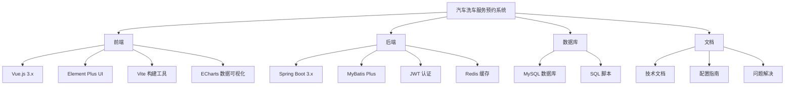

**Diagram sources**
- [README.md](file://README.md#L5-L13)

**Section sources**
- [README.md](file://README.md#L5-L13)

## 核心功能模块

系统由多个核心功能模块组成，每个模块负责特定的业务功能，共同构成了完整的预约服务生态系统。

### 用户预约模块

用户预约模块是系统的核心功能之一，允许用户注册账号、登录系统、浏览服务项目、选择预约时间和提交预约请求。用户可以查看自己的预约历史、订单状态，并进行订单管理。

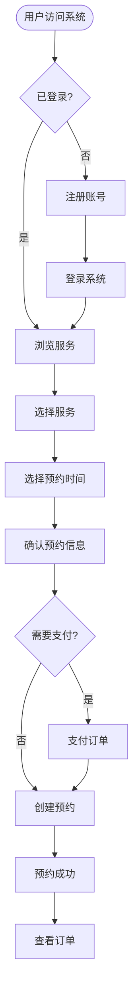

**Diagram sources**
- [AuthController.java](file://backend/src/main/java/com/carwash/controller/AuthController.java#L1-L130)
- [BookingController.java](file://backend/src/main/java/com/carwash/controller/BookingController.java#L1-L228)
- [Home.vue](file://frontend/src/views/Home.vue#L1-L800)

**Section sources**
- [AuthController.java](file://backend/src/main/java/com/carwash/controller/AuthController.java#L1-L130)
- [BookingController.java](file://backend/src/main/java/com/carwash/controller/BookingController.java#L1-L228)
- [User.java](file://backend/src/main/java/com/carwash/entity/User.java#L1-L190)
- [Booking.java](file://backend/src/main/java/com/carwash/entity/Booking.java#L1-L333)

### 管理员管理模块

管理员管理模块为系统管理员提供了全面的管理功能，包括用户管理、服务管理、订单管理和系统设置。管理员可以通过专用的管理后台界面进行各项管理操作。

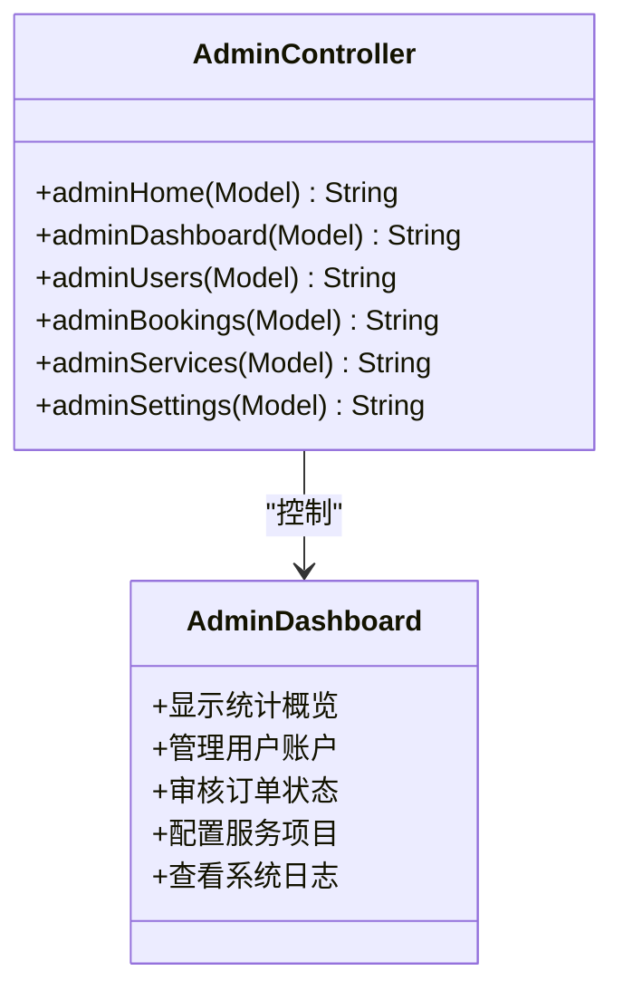

**Diagram sources**
- [AdminController.java](file://backend/src/main/java/com/carwash/controller/AdminController.java#L1-L72)

**Section sources**
- [AdminController.java](file://backend/src/main/java/com/carwash/controller/AdminController.java#L1-L72)

### 支付集成模块

支付集成模块支持多种支付方式，包括微信支付、支付宝支付和虚拟支付（用于开发测试）。系统提供了完整的支付流程，包括创建支付订单、查询支付状态、处理支付回调和退款申请。

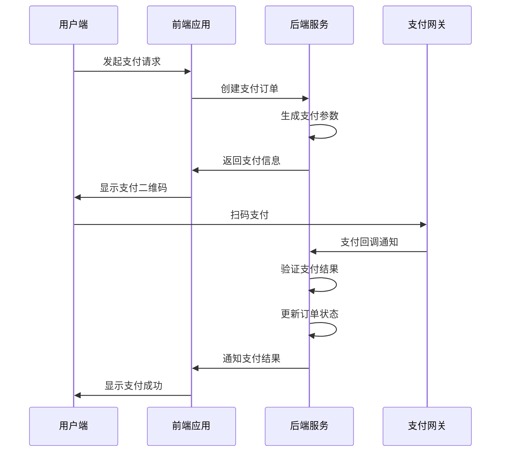

**Diagram sources**
- [PaymentController.java](file://backend/src/main/java/com/carwash/controller/PaymentController.java#L1-L303)

**Section sources**
- [PaymentController.java](file://backend/src/main/java/com/carwash/controller/PaymentController.java#L1-L303)

### 数据统计模块

数据统计模块为管理员提供了丰富的业务数据分析功能，包括系统统计概览、今日统计和月度统计。这些数据帮助管理员了解业务运营状况，做出科学的经营决策。

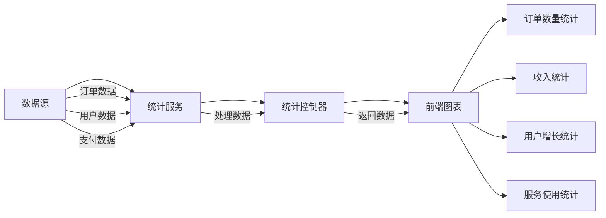

**Diagram sources**
- [StatisticsController.java](file://backend/src/main/java/com/carwash/controller/StatisticsController.java#L1-L62)

**Section sources**
- [StatisticsController.java](file://backend/src/main/java/com/carwash/controller/StatisticsController.java#L1-L62)

## 系统架构设计

系统采用前后端分离的架构设计，前端和后端通过RESTful API进行通信。这种架构设计具有良好的可维护性、可扩展性和灵活性。

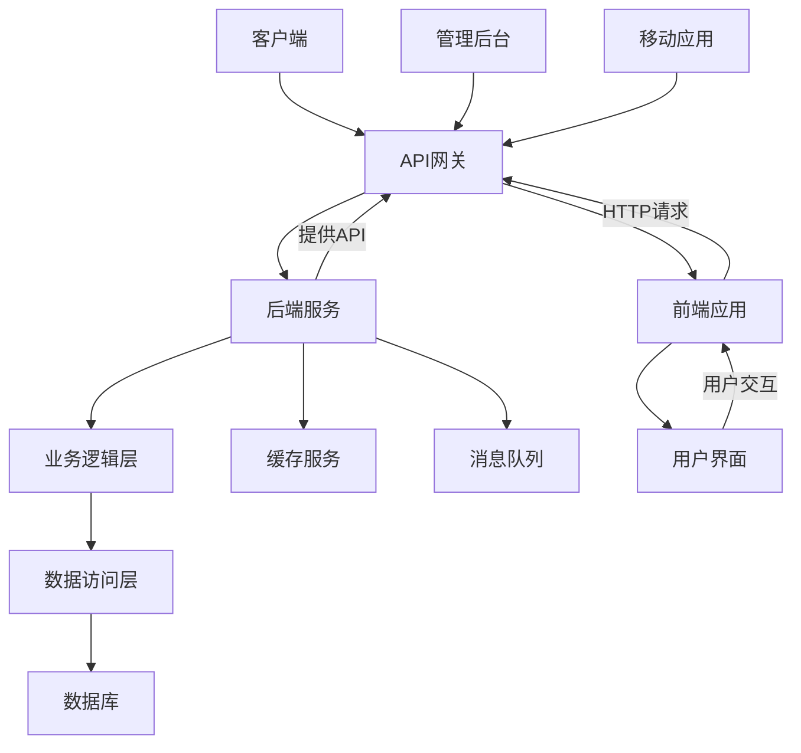

**Diagram sources**
- [App.vue](file://frontend/src/App.vue#L1-L381)
- [CarwashApplication.java](file://backend/src/main/java/com/carwash/CarwashApplication.java#L1-L23)

**Section sources**
- [App.vue](file://frontend/src/App.vue#L1-L381)
- [CarwashApplication.java](file://backend/src/main/java/com/carwash/CarwashApplication.java#L1-L23)

## 技术选型与实现

系统的技术选型基于稳定性、性能和开发效率的综合考虑，选择了当前主流的技术栈。

### 后端技术栈

后端采用Spring Boot 3.x作为基础框架，结合MyBatis Plus实现数据访问，使用JWT进行身份认证，Redis作为缓存服务。

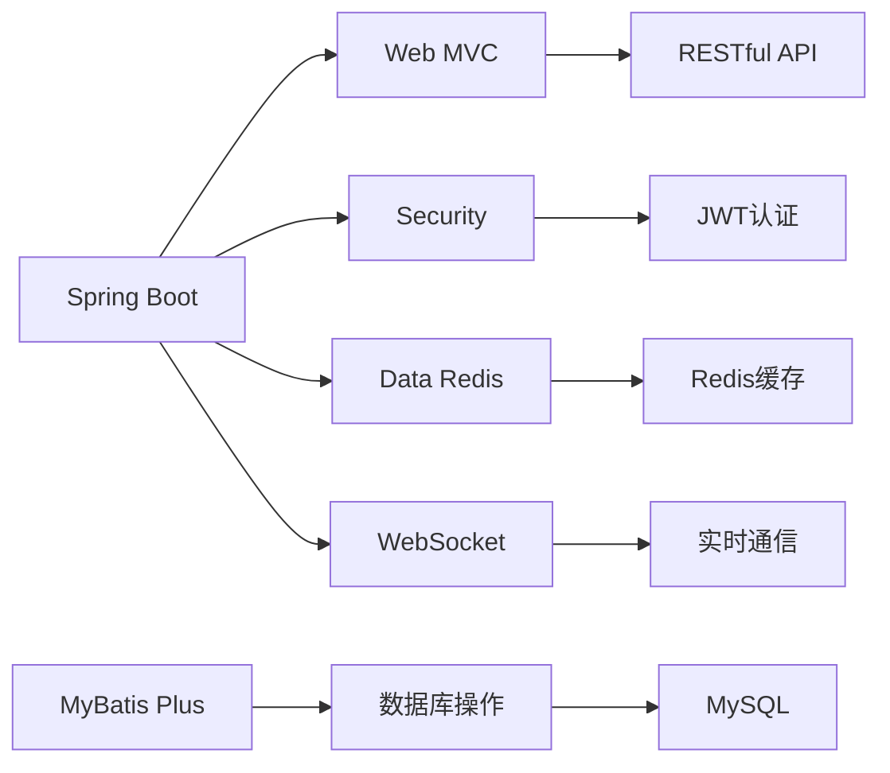

**Diagram sources**
- [pom.xml](file://backend/pom.xml#L1-L156)

**Section sources**
- [pom.xml](file://backend/pom.xml#L1-L156)

### 前端技术栈

前端采用Vue.js 3.x作为核心框架，Element Plus作为UI组件库，Vite作为构建工具，ECharts用于数据可视化。

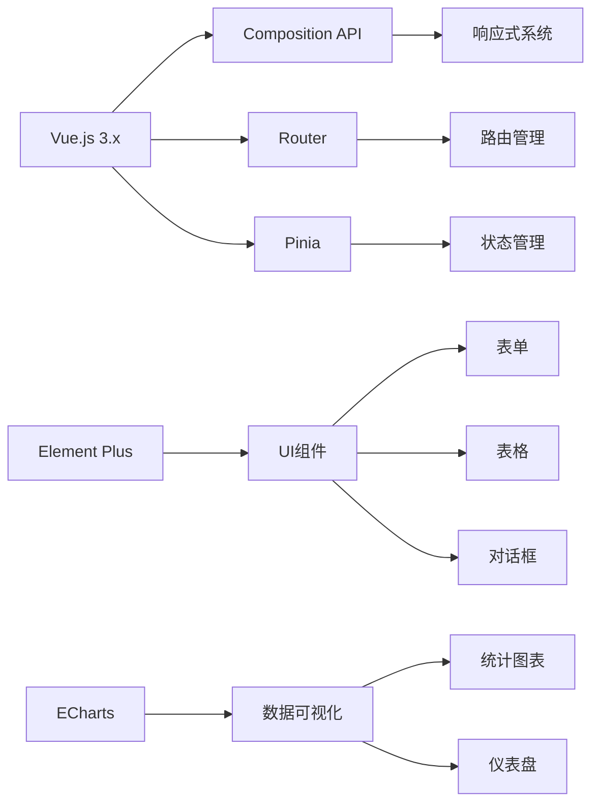

**Diagram sources**
- [package.json](file://frontend/package.json#L1-L37)

**Section sources**
- [package.json](file://frontend/package.json#L1-L37)

## 业务流程分析

系统的业务流程涵盖了从用户访问到服务完成的完整生命周期，确保了服务的高效和用户体验的流畅。

### 用户端交互流程

用户端的交互流程从用户访问系统开始，经过注册登录、服务选择、预约创建到订单管理的完整过程。

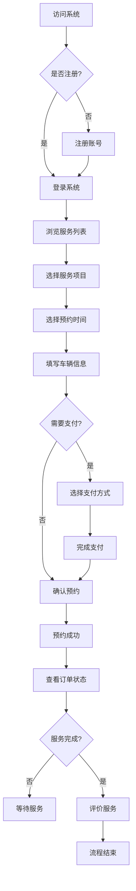

**Diagram sources**
- [AuthController.java](file://backend/src/main/java/com/carwash/controller/AuthController.java#L1-L130)
- [BookingController.java](file://backend/src/main/java/com/carwash/controller/BookingController.java#L1-L228)
- [Home.vue](file://frontend/src/views/Home.vue#L1-L800)

**Section sources**
- [AuthController.java](file://backend/src/main/java/com/carwash/controller/AuthController.java#L1-L130)
- [BookingController.java](file://backend/src/main/java/com/carwash/controller/BookingController.java#L1-L228)
- [Home.vue](file://frontend/src/views/Home.vue#L1-L800)

### 管理员端交互流程

管理员端的交互流程专注于业务管理和监控，包括用户管理、订单处理、服务配置和数据统计。

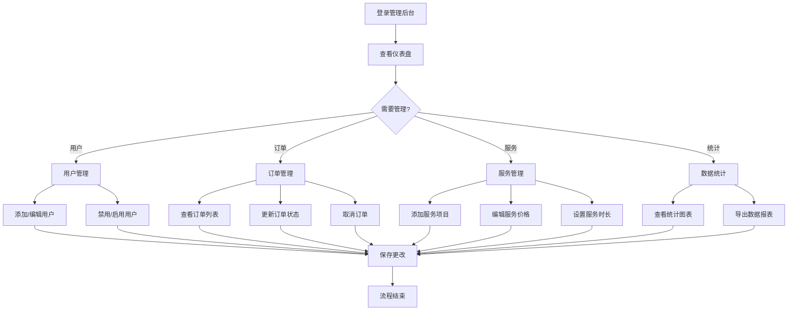

**Diagram sources**
- [AdminController.java](file://backend/src/main/java/com/carwash/controller/AdminController.java#L1-L72)
- [StatisticsController.java](file://backend/src/main/java/com/carwash/controller/StatisticsController.java#L1-L62)

**Section sources**
- [AdminController.java](file://backend/src/main/java/com/carwash/controller/AdminController.java#L1-L72)
- [StatisticsController.java](file://backend/src/main/java/com/carwash/controller/StatisticsController.java#L1-L62)

## 学习路径指引

为帮助不同层次的开发者快速理解和掌握本系统，我们提供了分层次的学习路径指引。

### 初学者学习路径

初学者应该从系统的整体架构和基本功能开始，逐步深入理解各个模块的实现。

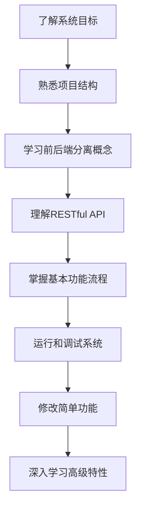

**Section sources**
- [README.md](file://README.md#L1-L92)

### 高级开发者学习路径

高级开发者可以直接深入系统的核心实现，关注架构设计、性能优化和安全机制。

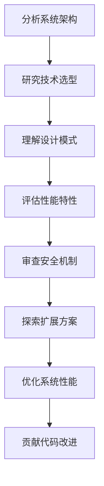

**Section sources**
- [pom.xml](file://backend/pom.xml#L1-L156)
- [package.json](file://frontend/package.json#L1-L37)

## 结论

汽车洗车服务预约系统通过现代化的技术架构和完善的业务功能，为洗车服务行业提供了数字化转型的解决方案。系统采用前后端分离的设计理念，结合Spring Boot和Vue.js等主流技术栈，实现了高内聚、低耦合的系统架构。

系统的核心优势在于：
- **用户体验优化**：简洁直观的界面设计，流畅的预约流程
- **管理效率提升**：全面的管理功能，实时的数据统计
- **技术先进性**：采用最新的技术栈，支持未来的功能扩展
- **安全性保障**：完善的认证授权机制，数据加密传输
- **可维护性**：清晰的代码结构，良好的文档支持

对于初学者而言，本系统提供了学习现代Web开发技术的优秀范例；对于高级开发者，系统展示了复杂业务场景下的架构设计和实现方案。通过本系统的分析和学习，开发者可以掌握全栈开发的关键技术和最佳实践。

**Section sources**
- [README.md](file://README.md#L1-L92)
- [CarwashApplication.java](file://backend/src/main/java/com/carwash/CarwashApplication.java#L1-L23)
- [App.vue](file://frontend/src/App.vue#L1-L381)