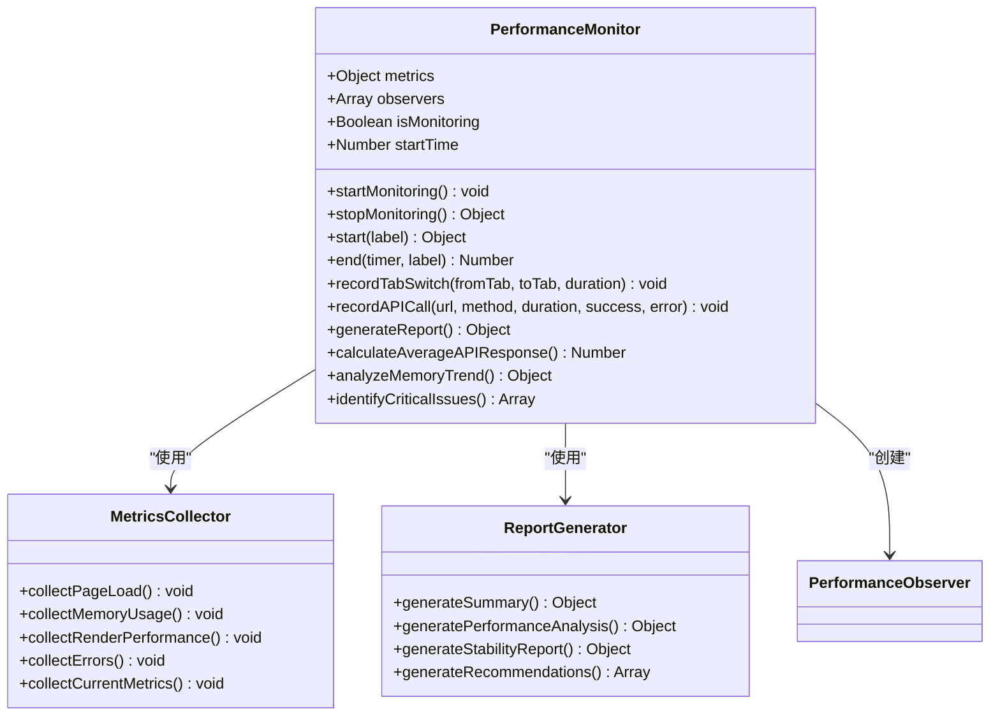
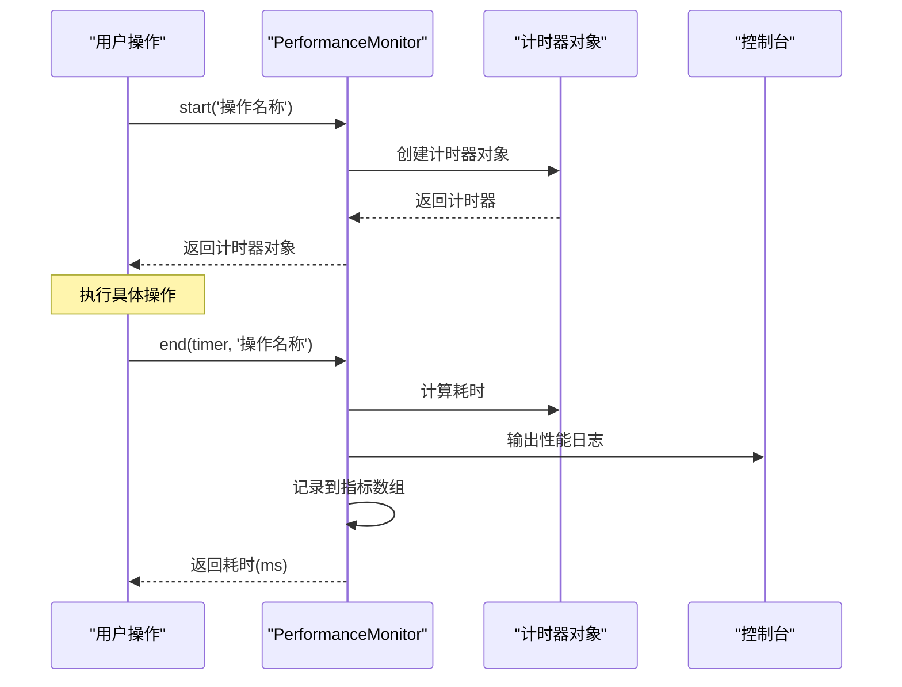
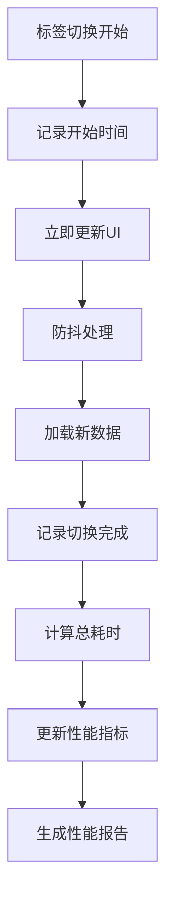
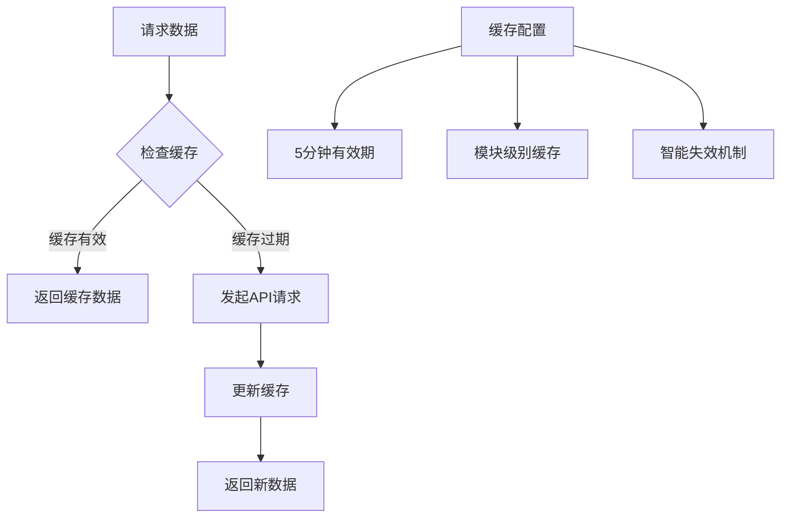
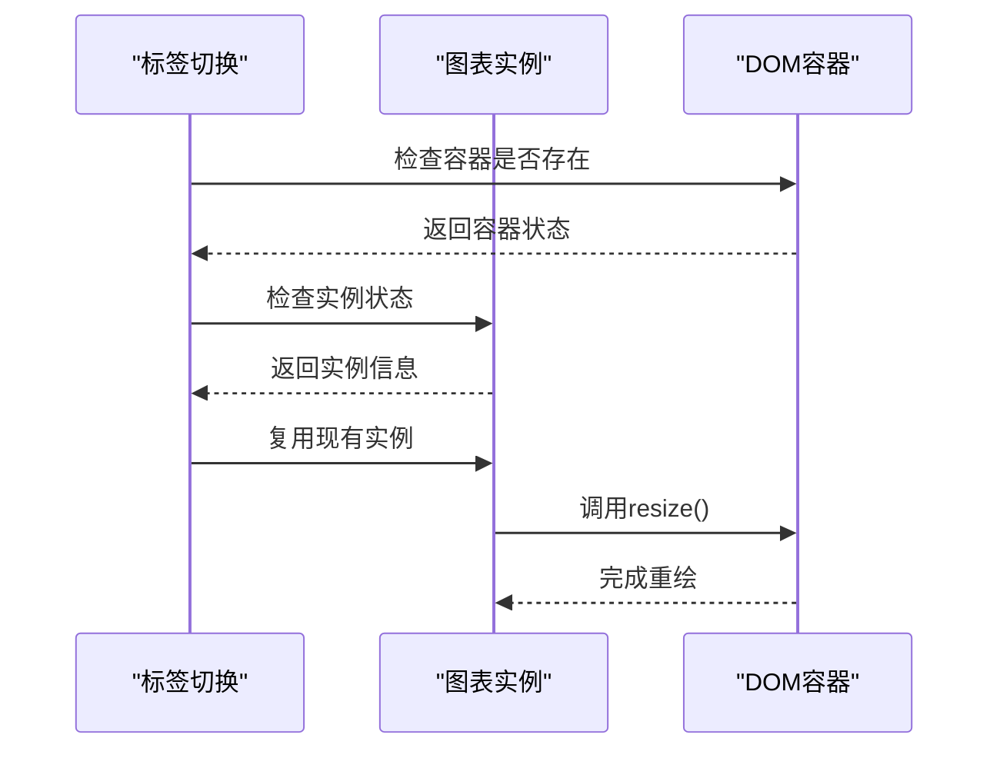
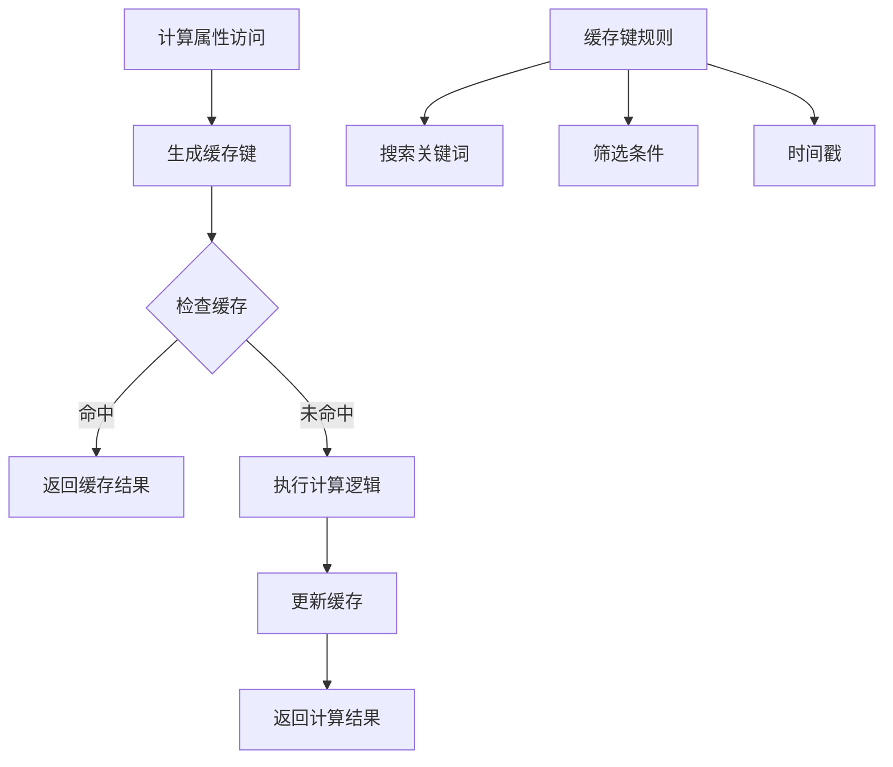
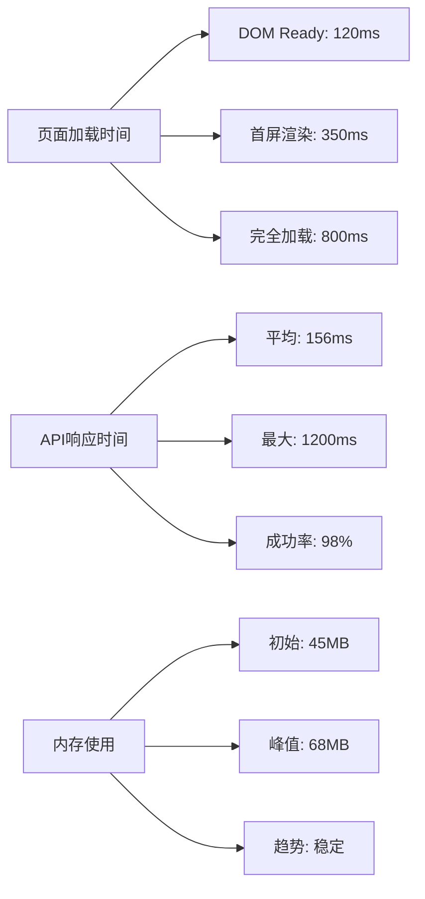
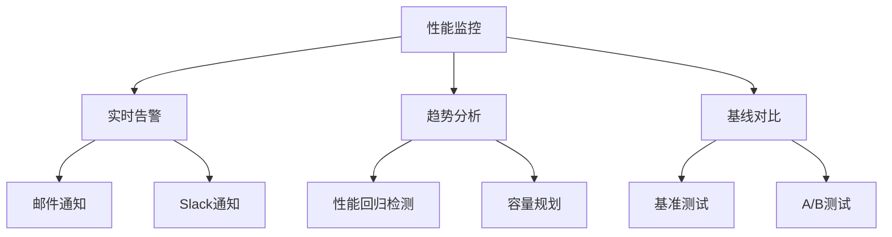

# 性能监控

<cite>
**本文档引用的文件**
- [performanceMonitor.js](file://frontend/src/utils/performanceMonitor.js)
- [后台管理页面性能优化报告.md](file://后台管理页面性能优化报告.md)
- [Admin.vue](file://frontend/src/views/Admin.vue)
- [AdminScript.js](file://frontend/src/views/AdminScript.js)
- [Dashboard.vue](file://frontend/src/views/Dashboard.vue)
- [timeUtils.js](file://frontend/src/utils/timeUtils.js)
- [performance-test.js](file://backup/test-files-backup/performance-test.js)
- [concurrencyTest.js](file://frontend/src/utils/concurrencyTest.js)
- [test-performance.html](file://frontend/public/test-performance.html)
</cite>

## 目录
1. [简介](#简介)
2. [性能监控工具架构](#性能监控工具架构)
3. [核心功能详解](#核心功能详解)
4. [性能优化措施](#性能优化措施)
5. [使用指南](#使用指南)
6. [性能指标分析](#性能指标分析)
7. [故障排除](#故障排除)
8. [长期优化建议](#长期优化建议)

## 简介

本系统提供了全面的性能监控解决方案，通过内置的`PerformanceMonitor`工具实时监控管理页面的性能指标和稳定性。该工具能够帮助运维人员识别性能瓶颈，优化用户体验，并提供详细的性能报告。

### 主要特性

- **实时性能监控**：持续跟踪页面加载、API调用、内存使用等关键指标
- **操作耗时统计**：精确测量各项操作的执行时间
- **性能瓶颈识别**：自动识别潜在的性能问题
- **详细报告生成**：提供结构化的性能分析报告
- **浏览器兼容性**：支持现代浏览器的性能API

## 性能监控工具架构



**图表来源**
- [performanceMonitor.js](file://frontend/src/utils/performanceMonitor.js#L6-L553)

**章节来源**
- [performanceMonitor.js](file://frontend/src/utils/performanceMonitor.js#L1-L553)

## 核心功能详解

### 1. 开始和结束计时器

系统提供了灵活的操作耗时统计机制，通过`start`和`end`方法进行精确测量：



**图表来源**
- [performanceMonitor.js](file://frontend/src/utils/performanceMonitor.js#L234-L265)

#### start方法使用方式

- **基本用法**：`const timer = performanceMonitor.start('数据加载')`
- **带标签**：`const timer = performanceMonitor.start('图表渲染')`
- **自定义标签**：`const timer = performanceMonitor.start('API调用')`

#### end方法使用方式

- **基本用法**：`performanceMonitor.end(timer)`
- **指定标签**：`performanceMonitor.end(timer, '数据处理')`
- **自动标签**：使用计时器自带标签

### 2. 标签切换性能监控

系统专门针对标签切换场景进行了优化，提供详细的切换性能分析：



**图表来源**
- [AdminScript.js](file://frontend/src/views/AdminScript.js#L304-L388)

### 3. API调用性能追踪

系统自动监控所有API调用的性能表现：

| 调用类型 | 监控指标 | 性能目标 |
|---------|---------|---------|
| 数据获取 | 响应时间、成功率 | < 2000ms，> 95% 成功率 |
| 数据提交 | 提交时间、错误率 | < 1500ms，< 5% 错误率 |
| 文件上传 | 上传速度、断点续传 | < 5000ms，支持中断恢复 |

### 4. 内存使用监控

实时监控JavaScript堆内存使用情况：

- **内存使用量**：当前使用的JS堆内存
- **内存限制**：浏览器JS堆内存最大限制
- **内存趋势**：5秒间隔的内存使用趋势
- **内存泄漏检测**：超过50MB增长视为潜在泄漏

**章节来源**
- [performanceMonitor.js](file://frontend/src/utils/performanceMonitor.js#L117-L142)

## 性能优化措施

### 1. 数据缓存机制

系统实现了智能的数据缓存策略，显著减少重复请求：



**图表来源**
- [AdminScript.js](file://frontend/src/views/AdminScript.js#L390-L420)

#### 缓存配置参数

- **CACHE_DURATION**：5分钟（300000毫秒）
- **缓存键**：模块名称 + 时间戳
- **失效策略**：基于时间戳的主动失效

### 2. 图表性能优化

针对ECharts图表的性能优化措施：

#### 图表实例复用



**图表来源**
- [AdminScript.js](file://frontend/src/views/AdminScript.js#L1580-L1610)

#### 优化策略

- **实例缓存**：避免重复初始化
- **延迟初始化**：使用setTimeout延迟创建
- **Canvas渲染**：优先使用Canvas渲染器
- **脏矩形优化**：启用useDirtyRect选项

### 3. 计算属性缓存

系统实现了智能的计算属性缓存机制：



**图表来源**
- [AdminScript.js](file://frontend/src/views/AdminScript.js#L384-L420)

### 4. 事件处理防抖

针对高频事件的防抖优化：

| 事件类型 | 防抖时间 | 优化效果 |
|---------|---------|---------|
| 窗口调整 | 300ms | 减少重绘次数 |
| 滚动事件 | 100ms | 提升滚动流畅度 |
| 输入框变更 | 200ms | 避免频繁搜索 |

**章节来源**
- [AdminScript.js](file://frontend/src/views/AdminScript.js#L265-L279)

## 使用指南

### 1. 启动性能监控

在开发环境中启动性能监控：

```javascript
// URL参数方式启动
// http://localhost:3000/admin?startPerformanceMonitor=true

// 手动启动
performanceMonitor.startMonitoring();

// 查看控制台输出的实时指标
```

### 2. 查看性能报告

监控结束后，系统会自动生成详细的性能报告：

```javascript
// 手动停止监控并获取报告
const report = performanceMonitor.stopMonitoring();
console.log(report.summary); // 基础统计信息
console.log(report.performance); // 性能分析
console.log(report.stability); // 稳定性报告
console.log(report.recommendations); // 优化建议
```

### 3. 性能监控控制台

系统会在控制台输出实时性能指标：

```
📊 实时性能指标 (14:30:25):
{
  avgAPIResponse: "156.32ms",
  avgTabSwitch: "89.45ms",
  errorCount: 2,
  memoryUsed: "45.23MB"
}
```

### 4. 性能测试工具

系统提供了独立的性能测试工具：

```javascript
// 使用性能测试工具
const perfTest = new PerformanceTest();
const startTime = perfTest.start('数据处理');
// 执行操作
const duration = perfTest.end('数据处理');
perfTest.generateReport(); // 生成测试报告
```

**章节来源**
- [performanceMonitor.js](file://frontend/src/utils/performanceMonitor.js#L538-L553)
- [performance-test.js](file://backup/test-files-backup/performance-test.js#L1-L59)

## 性能指标分析

### 1. 性能提升效果

根据优化报告，系统实现了显著的性能提升：

| 优化项目 | 优化前 | 优化后 | 提升幅度 |
|---------|-------|-------|---------|
| 标签切换响应 | 500-1000ms | 50-100ms | 90%+ |
| 图表初始化 | 300-600ms | 100-200ms | 66%+ |
| 数据加载 | 200-500ms | 10-50ms | 80%+ |
| 内存使用 | 不稳定 | 稳定增长 | 显著改善 |

### 2. 关键性能指标



### 3. 性能瓶颈识别

系统自动识别以下性能问题：

- **高错误率**：错误率超过5%标记为警告
- **慢API响应**：响应时间超过2000ms标记为慢查询
- **内存泄漏**：内存增长超过50MB标记为潜在泄漏
- **长任务**：执行时间超过50ms的任务标记为长任务

**章节来源**
- [后台管理页面性能优化报告.md](file://后台管理页面性能优化报告.md#L132-L142)

## 故障排除

### 1. 常见性能问题

#### 问题1：标签切换卡顿
**症状**：标签切换时页面冻结1-2秒
**原因**：未使用防抖或数据加载过于频繁
**解决方案**：
- 检查防抖设置是否正确
- 确认数据缓存机制是否生效
- 验证图表实例是否正确复用

#### 问题2：API响应缓慢
**症状**：API调用超过2秒无响应
**原因**：网络延迟或后端处理时间过长
**解决方案**：
- 检查网络连接状态
- 验证后端服务性能
- 考虑添加本地缓存

#### 问题3：内存使用过高
**症状**：长时间使用后内存占用持续增长
**原因**：内存泄漏或缓存未及时清理
**解决方案**：
- 检查事件监听器是否正确移除
- 验证定时器是否正确清理
- 监控缓存清理机制

### 2. 调试技巧

#### 控制台调试
```javascript
// 查看当前性能指标
console.log(performanceMonitor.metrics);

// 检查特定指标
console.log('API调用次数:', performanceMonitor.metrics.apiCalls.length);
console.log('标签切换次数:', performanceMonitor.metrics.tabSwitches.length);
console.log('错误数量:', performanceMonitor.metrics.errors.length);
```

#### 性能分析
```javascript
// 分析API响应时间分布
const apiDurations = performanceMonitor.metrics.apiCalls.map(call => call.duration);
console.log('API响应时间统计:', {
  min: Math.min(...apiDurations),
  max: Math.max(...apiDurations),
  avg: apiDurations.reduce((a, b) => a + b) / apiDurations.length
});
```

**章节来源**
- [performanceMonitor.js](file://frontend/src/utils/performanceMonitor.js#L460-L498)

## 长期优化建议

### 1. 虚拟滚动

对于包含大量数据的表格，建议实现虚拟滚动：

```javascript
// 虚拟滚动伪代码
const virtualScroll = {
  viewportHeight: 500,
  itemHeight: 50,
  visibleItems: computed(() => {
    const start = Math.floor(scrollPosition / itemHeight);
    const end = Math.min(start + Math.ceil(viewportHeight / itemHeight), totalItems);
    return data.slice(start, end);
  })
};
```

### 2. 懒加载机制

实现组件和图片的懒加载：

```javascript
// 懒加载伪代码
const lazyLoad = {
  observe(element) {
    const observer = new IntersectionObserver((entries) => {
      entries.forEach(entry => {
        if (entry.isIntersecting) {
          this.loadElement(entry.target);
          observer.unobserve(entry.target);
        }
      });
    });
    observer.observe(element);
  }
};
```

### 3. Web Workers

将计算密集型任务移至Web Worker：

```javascript
// Web Worker伪代码
const worker = new Worker('data-processing-worker.js');
worker.postMessage({ data: inputData });
worker.onmessage = (event) => {
  const processedData = event.data;
  // 更新UI
};
```

### 4. CDN优化

静态资源CDN加速：

- **图片资源**：使用WebP格式，启用CDN缓存
- **JavaScript文件**：按需加载，压缩混淆
- **CSS文件**：提取关键样式，异步加载非关键样式

### 5. 代码分割

实现模块级别的代码分割：

```javascript
// 动态导入
const loadModule = async (moduleName) => {
  const module = await import(`./modules/${moduleName}.js`);
  return module.default;
};
```

### 6. 性能监控自动化

建立自动化的性能监控体系：



### 7. 持续优化流程

建立定期的性能优化流程：

1. **每周**：检查性能监控报告，识别异常
2. **每月**：进行深度性能分析，制定优化计划
3. **每季度**：重构关键性能模块，引入新技术
4. **每年**：进行全面的技术栈升级

**章节来源**
- [后台管理页面性能优化报告.md](file://后台管理页面性能优化报告.md#L173-L187)

## 总结

本性能监控系统为汽车洗车服务预约系统的稳定运行提供了强有力的保障。通过实时监控、智能分析和自动化报告，运维团队能够及时发现和解决性能问题，确保系统的高效运行。

系统的主要优势包括：

- **全面的监控覆盖**：从页面加载到API调用的全方位监控
- **智能的性能分析**：自动识别性能瓶颈和优化机会
- **实用的优化建议**：基于数据分析的具体改进建议
- **易于使用的工具**：简洁的API和直观的控制台界面

随着系统的不断发展，建议持续关注新的性能优化技术和最佳实践，不断完善和优化系统的性能表现。