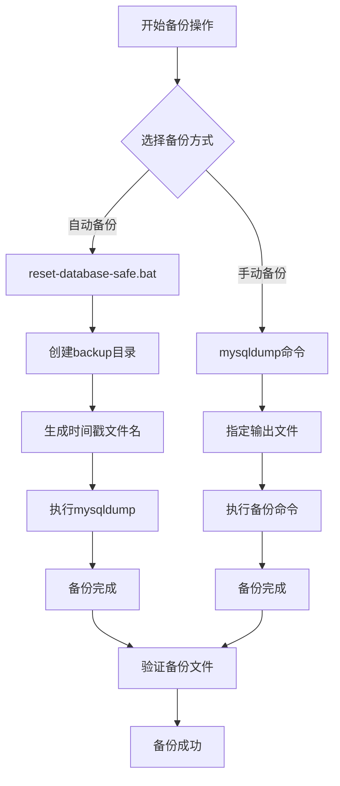
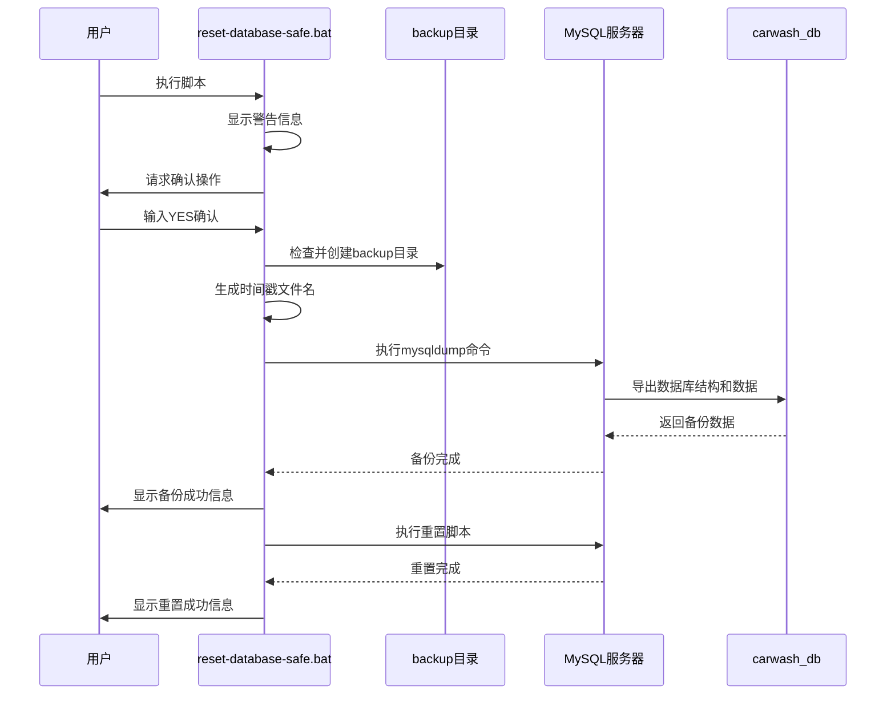
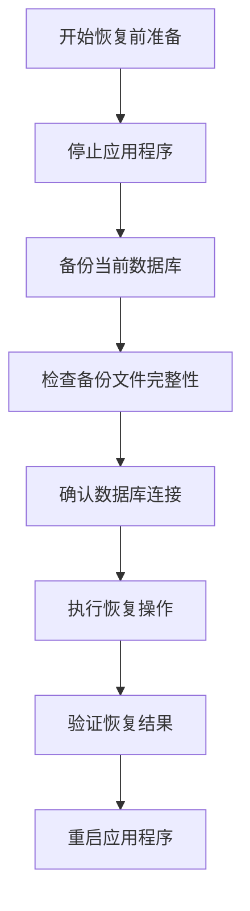
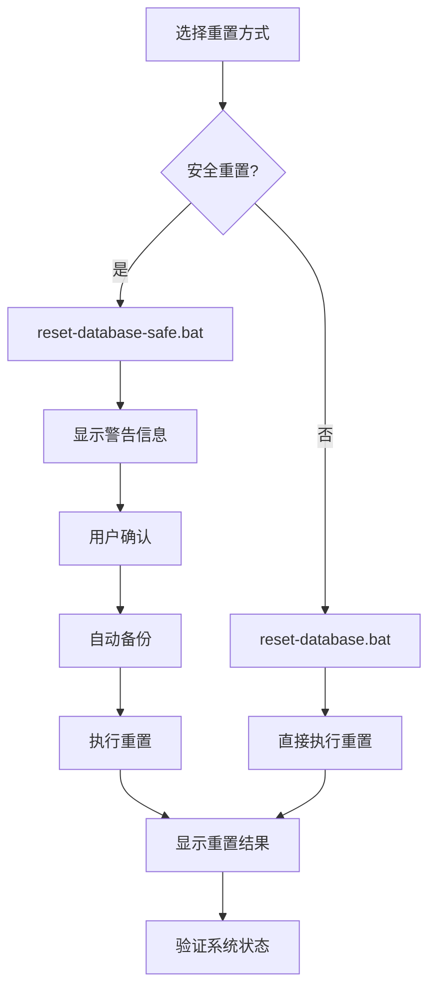
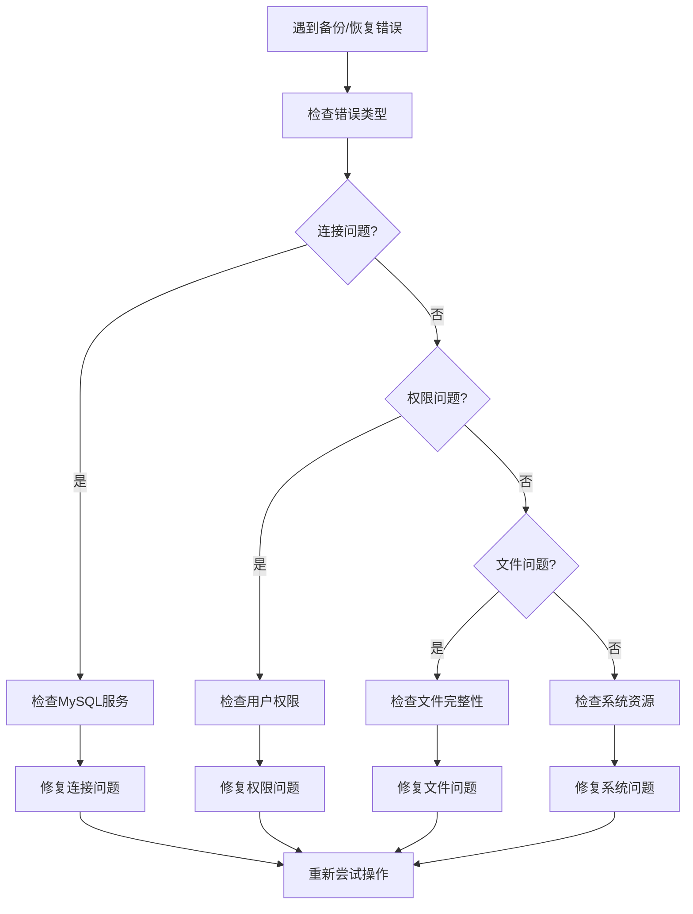

# 数据备份与恢复操作手册

<cite>
**本文档中引用的文件**
- [reset-database-safe.bat](file://reset-database-safe.bat)
- [reset-database.bat](file://reset-database.bat)
- [数据库重置说明.md](file://数据库重置说明.md)
- [init.sql](file://sql/init.sql)
- [reset_seed.sql](file://backend/src/main/resources/sql/reset_seed.sql)
- [DbResetRunner.java](file://backend/src/main/java/com/carwash/config/DbResetRunner.java)
- [test-modified-init.bat](file://backup/test-files-backup/test-modified-init.bat)
</cite>

## 目录
1. [概述](#概述)
2. [备份机制概览](#备份机制概览)
3. [自动备份机制](#自动备份机制)
4. [手动备份操作](#手动备份操作)
5. [数据恢复操作](#数据恢复操作)
6. [数据库重置说明](#数据库重置说明)
7. [故障排除指南](#故障排除指南)
8. [最佳实践建议](#最佳实践建议)
9. [常见问题解答](#常见问题解答)

## 概述

本手册详细介绍汽车洗车服务预约系统的数据备份与恢复操作，涵盖自动备份和手动备份两种机制。系统提供了完整的数据库重置功能，包括安全重置脚本和快速重置脚本，确保在系统维护、测试或数据清理时能够安全地保护重要数据。

## 备份机制概览

系统采用双重备份策略，提供自动备份和手动备份两种方式：



**图表来源**
- [reset-database-safe.bat](file://reset-database-safe.bat#L31-L41)

## 自动备份机制

### reset-database-safe.bat脚本详解

reset-database-safe.bat是系统提供的安全重置脚本，具备自动备份功能，在执行数据库重置前会自动创建数据备份。

#### 备份流程



**图表来源**
- [reset-database-safe.bat](file://reset-database-safe.bat#L19-L97)

#### 备份文件特性

| 特性 | 说明 | 示例 |
|------|------|------|
| **备份位置** | `backup/` 目录 | `backup/` |
| **文件命名** | `carwash_db_backup_YYYYMMDD_HHMMSS.sql` | `carwash_db_backup_20251026_143025.sql` |
| **备份内容** | 完整数据库结构和数据 | 包含表结构、索引、约束、数据 |
| **备份格式** | SQL脚本文件 | 标准SQL语法 |

#### 自动备份实现细节

脚本通过以下步骤实现自动备份：

1. **目录检查与创建**：确保backup目录存在
2. **时间戳生成**：使用系统时间生成唯一文件名
3. **mysqldump执行**：调用MySQL工具导出数据库
4. **错误处理**：备份失败时终止操作

**章节来源**
- [reset-database-safe.bat](file://reset-database-safe.bat#L31-L41)

## 手动备份操作

### mysqldump工具使用

系统支持使用mysqldump工具进行手动备份，提供灵活的数据导出功能。

#### 备份命令格式

```bash
# 创建完整备份
mysqldump -u root -p123456 carwash_db > backup/manual_backup.sql

# 带压缩的备份（可选）
mysqldump -u root -p123456 carwash_db | gzip > backup/manual_backup.sql.gz

# 只备份结构不备份数据
mysqldump -u root -p123456 --no-data carwash_db > backup/schema_backup.sql

# 只备份数据不备份结构
mysqldump -u root -p123456 --no-create-info carwash_db > backup/data_only_backup.sql
```

#### 备份参数说明

| 参数 | 说明 | 默认值 |
|------|------|--------|
| `-u root` | 数据库用户名 | root |
| `-p123456` | 数据库密码 | 123456 |
| `-h localhost` | 数据库主机 | localhost |
| `-P 3306` | 数据库端口 | 3306 |
| `carwash_db` | 要备份的数据库名 | carwash_db |
| `>` | 输出重定向到文件 | - |

### 备份验证

执行备份后，可以通过以下方式验证备份文件的有效性：

```bash
# 检查文件大小
dir backup\manual_backup.sql

# 查看文件开头内容
head -n 20 backup\manual_backup.sql

# 检查文件结尾
tail -n 10 backup\manual_backup.sql
```

**章节来源**
- [数据库重置说明.md](file://数据库重置说明.md#L100-L106)

## 数据恢复操作

### 恢复命令格式

使用mysql工具从备份文件恢复数据库：

```bash
# 从SQL文件恢复
mysql -u root -p123456 carwash_db < backup/manual_backup.sql

# 从压缩文件恢复（需解压）
gunzip -c backup/manual_backup.sql.gz | mysql -u root -p123456 carwash_db

# 从特定时间点恢复（需要二进制日志）
mysqlbinlog binlog.000001 | mysql -u root -p123456 carwash_db
```

### 恢复前准备工作

在执行恢复操作前，建议进行以下准备工作：



### 恢复验证步骤

1. **连接验证**：确认数据库连接正常
2. **数据完整性检查**：验证关键表数据
3. **功能测试**：测试核心业务功能
4. **性能监控**：观察系统性能指标

**章节来源**
- [数据库重置说明.md](file://数据库重置说明.md#L104-L106)

## 数据库重置说明

### 重置脚本对比

| 功能特性 | reset-database-safe.bat | reset-database.bat |
|----------|-------------------------|-------------------|
| **自动备份** | ✅ 是 | ❌ 否 |
| **用户确认** | ✅ 是 | ❌ 否 |
| **详细日志** | ✅ 是 | ❌ 否 |
| **错误处理** | ✅ 是 | ❌ 否 |
| **执行速度** | ⚡ 较慢 | ⚡ 快速 |
| **适用场景** | 生产环境 | 开发测试 |

### 重置操作流程



**图表来源**
- [reset-database-safe.bat](file://reset-database-safe.bat#L19-L26)
- [reset-database.bat](file://reset-database.bat#L11-L13)

### 重置后的数据状态

重置操作完成后，系统将恢复到初始状态：

| 数据类型 | 数量 | 说明 |
|----------|------|------|
| **用户账号** | 5个 | 包含管理员、测试用户等 |
| **服务项目** | 11个 | 标准洗车服务列表 |
| **时间段** | 98个 | 未来7天 × 14个时间段 |
| **系统配置** | 13项 | 基础系统设置 |
| **预约数据** | 已清空 | 所有历史预约记录 |
| **反馈数据** | 已清空 | 所有用户反馈记录 |

**章节来源**
- [数据库重置说明.md](file://数据库重置说明.md#L53-L91)

## 故障排除指南

### 常见错误及解决方案

#### 1. 连接失败错误

```bash
ERROR 2003: Can't connect to MySQL server
```

**解决方案：**
- 检查MySQL服务是否启动
- 确认端口3306是否开放
- 验证连接参数是否正确

#### 2. 权限不足错误

```bash
ERROR 1045: Access denied for user 'root'
```

**解决方案：**
- 检查用户名和密码
- 确认用户具有足够权限
- 尝试重新设置MySQL root密码

#### 3. 数据库不存在错误

```bash
ERROR 1049: Unknown database 'carwash_db'
```

**解决方案：**
- 先创建数据库：`CREATE DATABASE carwash_db;`
- 或运行初始化脚本：`sql/init.sql`

#### 4. 备份文件损坏

**解决方案：**
- 检查文件完整性
- 重新执行备份操作
- 使用备份恢复功能

### 故障诊断流程



**章节来源**
- [数据库重置说明.md](file://数据库重置说明.md#L132-L167)

## 最佳实践建议

### 备份策略

1. **定期备份**：建议每日执行自动备份
2. **多重备份**：本地备份+远程备份
3. **版本控制**：保留多个历史备份版本
4. **测试验证**：定期验证备份文件可恢复性

### 权限管理

1. **最小权限原则**：只授予必要的数据库权限
2. **定期审计**：检查用户权限使用情况
3. **密码管理**：定期更换数据库密码
4. **访问控制**：限制备份操作的执行权限

### 生产环境注意事项

1. **业务窗口期**：在低峰期执行备份操作
2. **监控告警**：设置备份失败告警机制
3. **文档记录**：详细记录每次备份操作
4. **应急预案**：制定备份失败应急处理方案

**章节来源**
- [数据库重置说明.md](file://数据库重置说明.md#L124-L129)

## 常见问题解答

### Q1: 备份文件太大怎么办？

**A:** 可以使用以下方法减小备份文件大小：
- 使用`--single-transaction`参数避免锁定表
- 使用`--compress`参数压缩备份
- 排除不需要的表或数据

### Q2: 如何恢复特定表的数据？

**A:** 可以使用以下命令恢复特定表：
```bash
mysqldump -u root -p123456 --no-create-db --no-create-info carwash_db specific_table > backup/table_backup.sql
```

### Q3: 备份会影响系统性能吗？

**A:** 备份操作可能会对系统性能产生影响：
- 自动备份在后台执行，影响较小
- 手动备份建议在低峰期进行
- 可以使用增量备份减少性能影响

### Q4: 如何验证备份文件的完整性？

**A:** 可以通过以下方式验证：
- 检查文件大小是否合理
- 使用`mysql`命令导入测试
- 对比备份前后的数据一致性

### Q5: 备份文件的安全存储在哪里？

**A:** 建议将备份文件存储在：
- 本地磁盘的重要目录
- 远程云存储服务
- 备份专用服务器
- 加密存储介质

**章节来源**
- [数据库重置说明.md](file://数据库重置说明.md#L168-L175)

## 结论

本手册详细介绍了汽车洗车服务预约系统的数据备份与恢复操作，涵盖了自动备份和手动备份两种机制。通过reset-database-safe.bat脚本，系统提供了安全可靠的数据库重置功能，确保在系统维护过程中能够保护重要数据。建议用户根据实际需求选择合适的备份方式，并遵循最佳实践，确保数据安全和系统稳定运行。