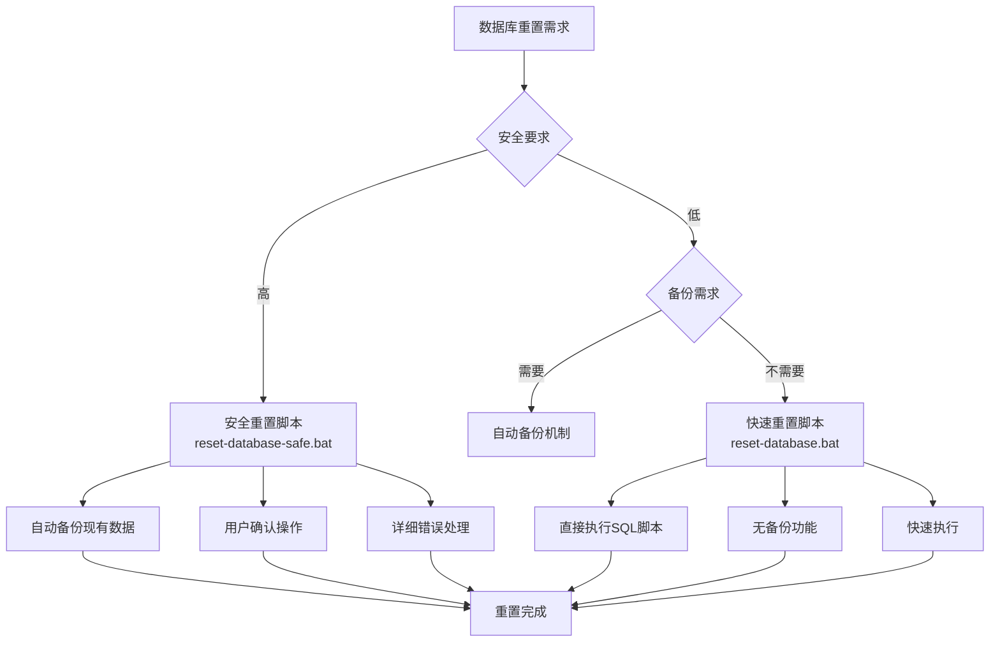
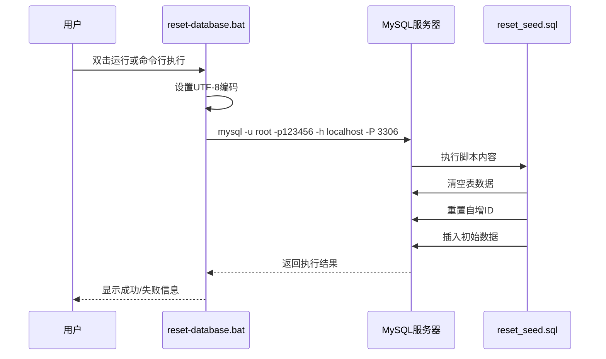
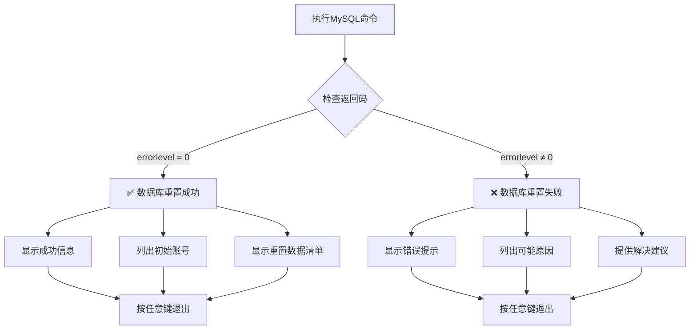
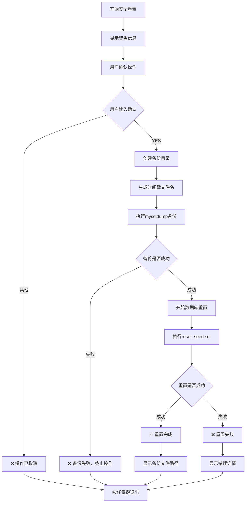
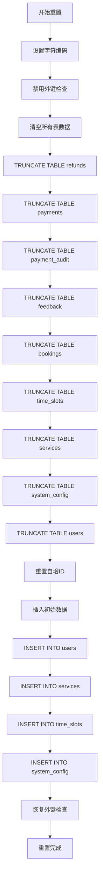
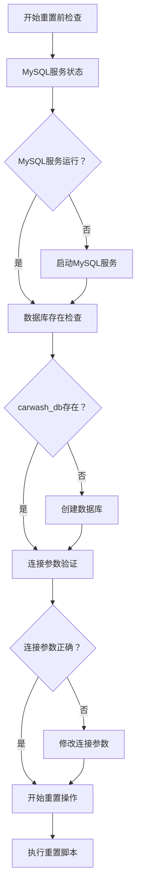

# 数据库维护操作手册

<cite>
**本文档中引用的文件**
- [reset-database.bat](file://reset-database.bat)
- [reset-database-safe.bat](file://reset-database-safe.bat)
- [数据库重置说明.md](file://数据库重置说明.md)
- [verify_init.sql](file://verify_init.sql)
- [backend/src/main/resources/sql/reset_seed.sql](file://backend/src/main/resources/sql/reset_seed.sql)
- [sql/init.sql](file://sql/init.sql)
- [backend/src/main/java/com/carwash/config/DbResetRunner.java](file://backend/src/main/java/com/carwash/config/DbResetRunner.java)
- [backend/src/main/resources/application.yml](file://backend/src/main/resources/application.yml)
</cite>

## 目录
1. [概述](#概述)
2. [数据库重置方法概览](#数据库重置方法概览)
3. [快速重置脚本（reset-database.bat）](#快速重置脚本reset-databasebat)
4. [安全重置脚本（reset-database-safe.bat）](#安全重置脚本reset-databasesafebat)
5. [手动执行SQL脚本](#手动执行sql脚本)
6. [数据库重置流程详解](#数据库重置流程详解)
7. [重置后的数据状态](#重置后的数据状态)
8. [故障排除指南](#故障排除指南)
9. [最佳实践建议](#最佳实践建议)

## 概述

汽车洗车服务预约系统的数据库维护是确保系统正常运行的重要环节。本手册详细介绍了三种数据库重置方法，帮助开发者和运维人员在不同场景下选择合适的重置策略。

### 重要警告

**⚠️ 数据丢失风险：** 数据库重置操作会永久删除所有现有数据，包括用户预约、反馈、支付记录等重要业务数据。操作前请务必确认已做好数据备份。

**⚠️ 不可逆性：** 重置操作完成后无法撤销，除非有完整的数据备份。

**⚠️ 业务影响：** 所有用户的预约记录、反馈信息、支付数据都将被清空，可能对业务运营造成影响。

## 数据库重置方法概览

系统提供了三种数据库重置方法，满足不同的使用场景和安全需求：



**图表来源**
- [reset-database.bat](file://reset-database.bat#L1-L41)
- [reset-database-safe.bat](file://reset-database-safe.bat#L1-L97)

### 方法对比表

| 方法 | 备份功能 | 用户确认 | 错误处理 | 执行速度 | 推荐场景 |
|------|----------|----------|----------|----------|----------|
| 快速重置脚本 | ❌ 无备份 | ❌ 无确认 | 基础错误提示 | ⚡ 极快 | 开发测试 |
| 安全重置脚本 | ✅ 自动备份 | ✅ 用户确认 | 详细错误指导 | ⚡ 较快 | 生产环境 |
| 手动执行SQL | ✅ 手动备份 | ❌ 无确认 | 手动处理 | ⚡ 极快 | 高级用户 |

## 快速重置脚本（reset-database.bat）

### 脚本机制说明

快速重置脚本通过直接调用MySQL命令执行SQL脚本，是最简单的重置方式。



**图表来源**
- [reset-database.bat](file://reset-database.bat#L12-L13)
- [backend/src/main/resources/sql/reset_seed.sql](file://backend/src/main/resources/sql/reset_seed.sql#L1-L170)

### 数据库连接参数

脚本使用以下默认连接参数：

| 参数 | 值 | 说明 |
|------|-----|------|
| 用户名 | root | MySQL超级用户 |
| 密码 | 123456 | 默认密码（生产环境建议修改） |
| 主机 | localhost | 本地连接 |
| 端口 | 3306 | MySQL默认端口 |
| 数据库 | carwash_db | 目标数据库 |

### 错误处理逻辑

脚本包含基础的错误处理机制：



**图表来源**
- [reset-database.bat](file://reset-database.bat#L14-L38)

**节来源**
- [reset-database.bat](file://reset-database.bat#L1-L41)
- [backend/src/main/resources/sql/reset_seed.sql](file://backend/src/main/resources/sql/reset_seed.sql#L1-L170)

## 安全重置脚本（reset-database-safe.bat）

### 自动备份机制

安全重置脚本的核心优势是自动备份现有数据，防止数据丢失。



**图表来源**
- [reset-database-safe.bat](file://reset-database-safe.bat#L19-L97)

### 备份文件命名规则

备份文件采用以下命名格式：
```
carwash_db_backup_YYYYMMDD_HHMMSS.sql
```

示例：
```
carwash_db_backup_20251026_143025.sql
```

### 存储位置

备份文件保存在项目根目录的 `backup/` 目录中：

```
项目根目录/
├── backup/
│   └── carwash_db_backup_20251026_143025.sql
└── reset-database-safe.bat
```

**节来源**
- [reset-database-safe.bat](file://reset-database-safe.bat#L1-L97)

## 手动执行SQL脚本

### 手动备份方法

在执行重置前，强烈建议手动创建数据库备份：

```bash
# 创建完整备份
mysqldump -u root -p123456 carwash_db > backup/manual_backup.sql

# 恢复备份
mysql -u root -p123456 carwash_db < backup/manual_backup.sql
```

### 手动重置步骤

1. **连接到MySQL服务器**
   ```bash
   mysql -u root -p123456 -h localhost -P 3306
   ```

2. **选择目标数据库**
   ```sql
   USE carwash_db;
   ```

3. **执行重置脚本**
   ```bash
   mysql -u root -p123456 -h localhost -P 3306 < sql/reset_database.sql
   ```

**节来源**
- [数据库重置说明.md](file://数据库重置说明.md#L99-L106)

## 数据库重置流程详解

### 重置脚本执行顺序

数据库重置按照严格的执行顺序进行，确保数据完整性：



**图表来源**
- [backend/src/main/resources/sql/reset_seed.sql](file://backend/src/main/resources/sql/reset_seed.sql#L1-L170)

### 关键执行步骤

1. **数据清空阶段**
   - 使用 `TRUNCATE TABLE` 清空所有业务表
   - 保留用户表结构，仅清空数据
   - 重置所有表的自增计数器

2. **数据重建阶段**
   - 插入初始用户账号
   - 重建服务项目数据
   - 生成未来7天的时间段数据
   - 初始化系统配置

3. **完整性检查**
   - 恢复外键约束
   - 验证数据完整性

**节来源**
- [backend/src/main/resources/sql/reset_seed.sql](file://backend/src/main/resources/sql/reset_seed.sql#L1-L170)

## 重置后的数据状态

### 初始账号信息

重置后系统将恢复以下初始账号：

| 用户名 | 密码 | 角色 | 姓名 | 说明 |
|--------|------|------|------|------|
| admin | admin123 | admin | 系统管理员 | 超级管理员账号 |
| user001 | user123 | user | 张三 | 测试用户账号1 |
| testuser1 | test123 | user | 李四 | 测试用户账号2 |
| testuser2 | test123 | user | 王五 | 测试用户账号3 |
| manager | manager123 | admin | 店长 | 店铺管理员账号 |

### 服务项目数据

系统将重建11个服务项目：

| 服务名称 | 价格 | 时长 | 分类 | 说明 |
|----------|------|------|------|------|
| 快速洗车 | ¥20 | 20分钟 | 基础服务 | 轻度脏污清洗 |
| 基础洗车 | ¥30 | 30分钟 | 基础服务 | 标准外观清洗 |
| 标准洗车 | ¥35 | 35分钟 | 基础服务 | 加强清洁服务 |
| 精致洗车 | ¥50 | 45分钟 | 精致服务 | 内饰清洁服务 |
| 高级洗车 | ¥55 | 50分钟 | 精致服务 | 全面清洗服务 |
| 豪华洗车 | ¥80 | 60分钟 | 豪华服务 | 打蜡增值服务 |
| 至尊洗车 | ¥100 | 90分钟 | 豪华服务 | 深度清洁服务 |
| 内饰深度清洁 | ¥60 | 40分钟 | 专项服务 | 座椅和空调清洁 |
| 车身打蜡 | ¥40 | 30分钟 | 专项服务 | 车漆保护服务 |
| 发动机清洗 | ¥80 | 45分钟 | 专项服务 | 发动机舱清洁 |
| 轮胎保养 | ¥45 | 25分钟 | 专项服务 | 轮胎和轮毂清洁 |

### 时间段数据

系统将生成未来7天的可用时间段：

- **时间范围：** 从当前日期起未来7天
- **每日时段：** 14个30分钟时间段
- **营业时间：** 09:00-18:00（中午12:00-14:00休息）
- **每时段容量：** 最多3个预约
- **总时段数：** 98个可预约时段

### 系统配置

系统将初始化13项基础配置：

| 配置项 | 值 | 类型 | 说明 |
|--------|-----|------|------|
| site_name | 汽车洗车服务预约系统 | string | 网站名称 |
| site_logo | /images/logo.png | string | 网站Logo路径 |
| contact_phone | 400-888-8888 | string | 客服电话 |
| business_hours | 09:00-18:00 | string | 营业时间 |
| max_advance_days | 7 | number | 最大提前预约天数 |
| ai_service_enabled | true | boolean | AI客服开关 |
| working_hours_start | 09:00 | time | 营业开始时间 |
| working_hours_end | 18:00 | time | 营业结束时间 |
| slot_duration | 30 | number | 时间段长度（分钟） |
| max_advance_booking_days | 30 | number | 最大预约天数 |
| auto_confirm_booking | false | boolean | 自动确认开关 |
| sms_notification_enabled | true | boolean | 短信通知开关 |
| email_notification_enabled | true | boolean | 邮件通知开关 |

**节来源**
- [数据库重置说明.md](file://数据库重置说明.md#L54-L90)
- [backend/src/main/resources/sql/reset_seed.sql](file://backend/src/main/resources/sql/reset_seed.sql#L25-L167)

## 故障排除指南

### 常见错误及解决方案

#### 1. 连接失败错误

**错误信息：**
```
ERROR 2003: Can't connect to MySQL server
```

**解决方案：**
1. 检查MySQL服务是否启动
2. 确认端口3306是否开放
3. 验证连接参数是否正确

**检查MySQL服务状态：**
```bash
# Windows系统
sc query mysql

# Linux系统
systemctl status mysql
```

#### 2. 权限不足错误

**错误信息：**
```
ERROR 1045: Access denied for user 'root'
```

**解决方案：**
1. 检查用户名和密码
2. 确认用户具有足够权限
3. 尝试重新设置MySQL root密码

#### 3. 数据库不存在错误

**错误信息：**
```
ERROR 1049: Unknown database 'carwash_db'
```

**解决方案：**
1. 先创建数据库：`CREATE DATABASE carwash_db;`
2. 或运行初始化脚本：`sql/init.sql`

#### 4. 表不存在错误

**错误信息：**
```
ERROR 1146: Table 'carwash_db.users' doesn't exist
```

**解决方案：**
1. 先运行表结构创建脚本：`sql/init.sql`
2. 确保数据库表结构完整

### 前置条件检查

在执行数据库重置前，请确认以下前置条件：



**图表来源**
- [数据库重置说明.md](file://数据库重置说明.md#L115-L122)

### 验证重置结果

重置完成后，可以通过以下方式验证：

1. **执行验证脚本**
   ```bash
   mysql -u root -p123456 -h localhost -P 3306 < verify_init.sql
   ```

2. **检查数据量**
   - 用户表：5条记录
   - 服务表：11条记录
   - 时间段表：98条记录
   - 预约表：0条记录
   - 反馈表：0条记录
   - 系统配置：13条记录

**节来源**
- [数据库重置说明.md](file://数据库重置说明.md#L132-L174)
- [verify_init.sql](file://verify_init.sql#L1-L62)

## 最佳实践建议

### 生产环境重置

1. **数据备份优先**
   - 使用安全重置脚本自动备份
   - 或手动创建完整备份
   - 验证备份文件完整性

2. **权限控制**
   - 限制重置脚本访问权限
   - 使用专用的数据库用户
   - 记录重置操作日志

3. **测试验证**
   - 在测试环境先行验证
   - 检查系统功能完整性
   - 验证API接口正常工作

### 开发环境重置

1. **快速迭代**
   - 使用快速重置脚本提高效率
   - 适用于频繁的开发测试
   - 结合版本控制系统

2. **自动化集成**
   - 在CI/CD流水线中集成重置脚本
   - 自动化测试环境准备
   - 确保测试环境一致性

### 监控和维护

1. **定期检查**
   - 监控数据库空间使用
   - 定期清理历史数据
   - 优化数据库性能

2. **文档更新**
   - 记录重置操作步骤
   - 维护故障排除指南
   - 更新最佳实践建议

### 安全考虑

1. **密码管理**
   - 修改默认数据库密码
   - 使用强密码策略
   - 定期更换密码

2. **网络安全**
   - 限制数据库访问IP
   - 使用SSL加密连接
   - 防止SQL注入攻击

3. **审计日志**
   - 启用数据库审计
   - 记录所有重置操作
   - 定期审查操作日志

**节来源**
- [数据库重置说明.md](file://数据库重置说明.md#L124-L131)

## 总结

本手册详细介绍了汽车洗车服务预约系统的三种数据库重置方法，从快速重置脚本到安全重置脚本，再到手动执行SQL脚本，每种方法都有其适用场景和注意事项。

**关键要点：**

1. **安全第一：** 生产环境优先使用安全重置脚本，确保自动备份
2. **充分准备：** 执行重置前确认所有前置条件
3. **验证结果：** 重置完成后及时验证数据状态
4. **预防为主：** 定期备份，建立完善的数据库维护流程

通过遵循本手册的指导原则和最佳实践，可以确保数据库重置操作的安全性和可靠性，为系统的稳定运行提供保障。