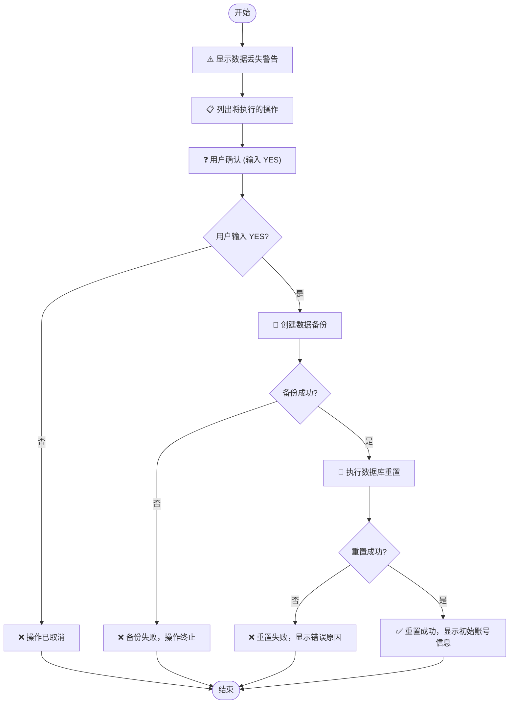
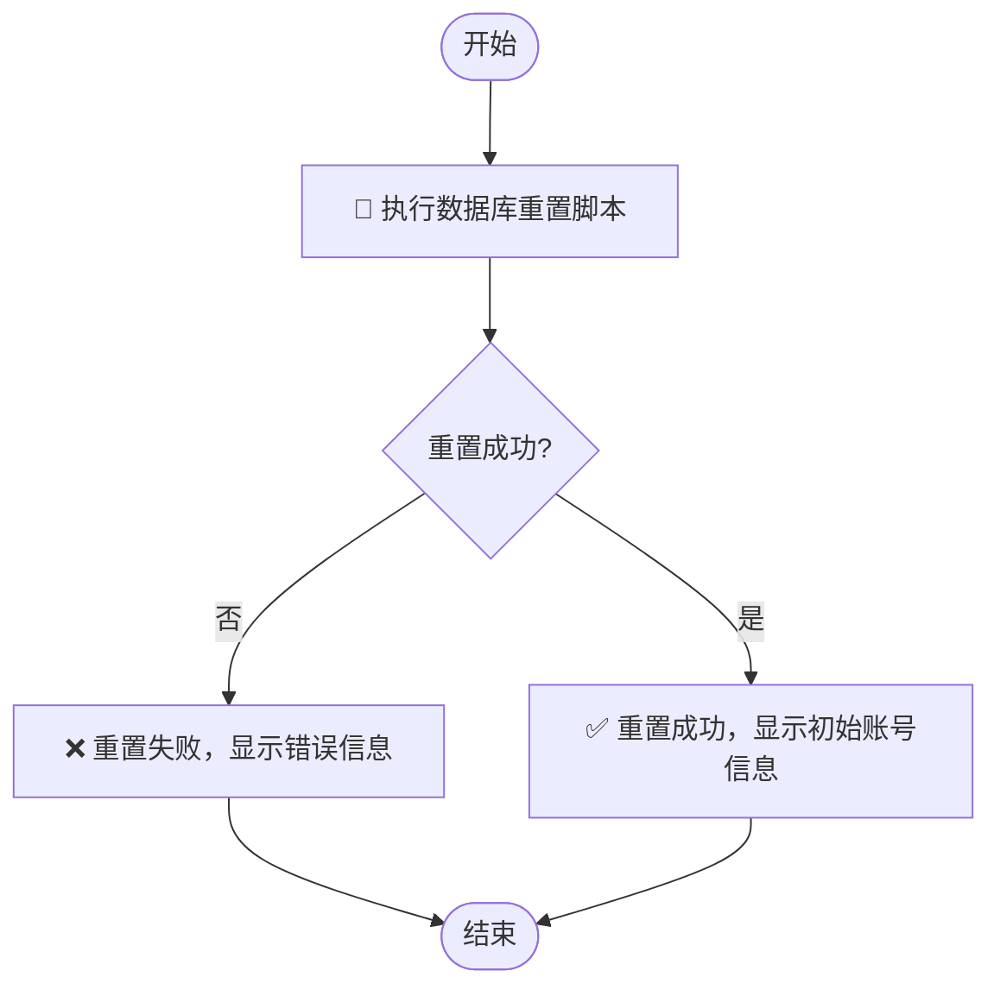

# 数据库重置

<cite>
**本文档引用的文件**  
- [reset-database-safe.bat](file://reset-database-safe.bat)
- [reset-database.bat](file://reset-database.bat)
- [数据库重置说明.md](file://数据库重置说明.md)
- [sql/reset_database.sql](file://sql/reset_database.sql)
- [backend/src/main/resources/sql/reset_seed.sql](file://backend/src/main/resources/sql/reset_seed.sql)
- [verify_init.sql](file://verify_init.sql)
</cite>

## 目录
1. [概述](#概述)
2. [重置方式](#重置方式)
3. [安全脚本重置](#安全脚本重置)
4. [快速脚本重置](#快速脚本重置)
5. [手动SQL执行](#手动sql执行)
6. [重置后系统状态](#重置后系统状态)
7. [故障排除](#故障排除)

## 概述
本文档详细说明汽车洗车服务预约系统的数据库重置操作，涵盖三种重置方式：安全脚本重置、快速脚本重置和手动SQL执行。重点介绍各方式的特点、执行流程和注意事项，确保操作人员能够安全、有效地重置数据库。

**Section sources**
- [数据库重置说明.md](file://数据库重置说明.md#L1-L175)

## 重置方式
系统提供三种数据库重置方式，适用于不同场景和需求：

| 重置方式 | 适用场景 | 用户确认 | 自动备份 | 执行速度 | 推荐程度 |
|---------|--------|--------|--------|--------|--------|
| 安全脚本重置 | 生产环境、重要数据 | ✅ 需要 | ✅ 自动备份 | ⏱️ 较慢 | ⭐⭐⭐⭐⭐ |
| 快速脚本重置 | 开发环境、测试数据 | ❌ 无需确认 | ❌ 无备份 | ⚡ 快速 | ⭐⭐⭐ |
| 手动SQL执行 | 高级用户、自动化脚本 | ❌ 无需确认 | ❌ 无备份 | ⚡ 快速 | ⭐⭐ |

**Section sources**
- [数据库重置说明.md](file://数据库重置说明.md#L21-L51)

## 安全脚本重置
`reset-database-safe.bat` 是推荐的数据库重置方式，具有完善的安全机制和用户交互功能。

### 安全机制
安全脚本重置包含以下关键安全特性：

1. **用户确认流程**：执行前需要用户输入"YES"确认，防止误操作
2. **自动备份功能**：在重置前自动创建数据库完整备份
3. **详细日志输出**：提供清晰的操作进度和结果反馈
4. **错误处理机制**：对常见错误提供具体解决方案建议

### 备份机制
安全脚本重置的备份功能具有以下特点：

- **备份位置**：`backup/` 目录
- **文件命名规则**：`carwash_db_backup_YYYYMMDD_HHMMSS.sql`
- **备份内容**：完整数据库结构和所有数据
- **备份验证**：检查备份操作结果，失败时终止重置流程

### 执行流程


**Diagram sources**
- [reset-database-safe.bat](file://reset-database-safe.bat#L8-L97)

**Section sources**
- [reset-database-safe.bat](file://reset-database-safe.bat#L1-L97)
- [数据库重置说明.md](file://数据库重置说明.md#L23-L34)

## 快速脚本重置
`reset-database.bat` 是直接的数据库重置方式，适用于开发和测试环境。

### 执行机制
快速脚本重置通过以下命令直接执行数据库重置：
```bash
mysql -u root -p123456 -h localhost -P 3306 < sql\reset_database.sql
```

### 特点
- **无确认环节**：执行后立即开始重置，无法取消
- **无备份功能**：不会创建数据备份，数据丢失风险高
- **直接执行**：使用MySQL命令行工具直接执行SQL脚本
- **连接参数**：使用root/123456@localhost:3306连接数据库

### 适用场景
快速脚本重置适用于以下场景：
- 开发环境的快速数据重置
- 测试环境的自动化测试准备
- 熟悉系统操作的高级用户



**Diagram sources**
- [reset-database.bat](file://reset-database.bat#L1-L41)

**Section sources**
- [reset-database.bat](file://reset-database.bat#L1-L41)
- [数据库重置说明.md](file://数据库重置说明.md#L35-L45)

## 手动SQL执行
对于需要更高控制度的用户，可以手动执行SQL脚本进行数据库重置。

### 执行命令
在MySQL命令行中执行以下命令：
```sql
mysql -u root -p123456 -h localhost -P 3306 < sql/reset_database.sql
```

### 前置条件
根据[数据库重置说明.md](file://数据库重置说明.md)文档，执行手动SQL重置需要满足以下前置条件：

- **MySQL服务**：确保MySQL服务正在运行
- **数据库存在**：`carwash_db` 数据库必须已创建
- **连接信息**：确认数据库连接参数正确
  - 主机：localhost
  - 端口：3306
  - 用户名：root
  - 密码：123456

### 重要警告
手动执行SQL重置存在以下风险：
- **数据丢失**：重置操作会永久删除所有现有数据
- **不可逆**：操作完成后无法撤销（除非有备份）
- **业务影响**：所有用户预约、反馈等数据将被清空

**Section sources**
- [数据库重置说明.md](file://数据库重置说明.md#L46-L51)
- [数据库重置说明.md](file://数据库重置说明.md#L109-L113)

## 重置后系统状态
数据库重置后，系统将恢复到初始状态，包含以下预设数据。

### 管理员账号
重置后系统包含以下管理员账号：
- **用户名**：admin
- **密码**：admin123
- **角色**：admin
- **姓名**：系统管理员

### 测试用户账号
系统预设了多个测试用户账号，便于功能测试：
- **user001** / user123 (普通用户)
- **testuser1** / test123 (测试用户)
- **testuser2** / test123 (测试用户)
- **manager** / manager123 (店长)

### 服务项目
重置后系统包含11项服务项目，分类如下：

| 服务名称 | 价格 | 时长 | 分类 |
|---------|------|------|------|
| 快速洗车 | ¥20 | 20分钟 | 基础服务 |
| 基础洗车 | ¥30 | 30分钟 | 基础服务 |
| 标准洗车 | ¥35 | 35分钟 | 基础服务 |
| 精致洗车 | ¥50 | 45分钟 | 精致服务 |
| 高级洗车 | ¥55 | 50分钟 | 精致服务 |
| 豪华洗车 | ¥80 | 60分钟 | 豪华服务 |
| 至尊洗车 | ¥100 | 90分钟 | 豪华服务 |
| 内饰深度清洁 | ¥60 | 40分钟 | 专项服务 |
| 车身打蜡 | ¥40 | 30分钟 | 专项服务 |
| 发动机清洗 | ¥80 | 45分钟 | 专项服务 |
| 轮胎保养 | ¥45 | 25分钟 | 专项服务 |

### 可预约时段
系统预设了未来7天的可预约时段，具体如下：
- **时间范围**：未来7天
- **每日时段**：14个时间段
- **营业时间**：09:00-18:00（中午12:00-14:00休息）
- **每时段容量**：最多3个预约
- **总时段数**：98个可预约时段

### 系统配置
重置后系统包含13项基础配置，包括：
- 网站基本信息
- 营业时间设置
- 预约规则配置
- 通知功能开关
- AI客服启用状态
- 短信和邮件通知设置

**Section sources**
- [数据库重置说明.md](file://数据库重置说明.md#L53-L90)
- [backend/src/main/resources/sql/reset_seed.sql](file://backend/src/main/resources/sql/reset_seed.sql#L25-L167)

## 故障排除
针对数据库重置过程中可能出现的常见问题，提供以下解决方案。

### 连接失败
```text
ERROR 2003: Can't connect to MySQL server
```
**解决方案**：
- 检查MySQL服务是否启动
- 确认端口3306是否开放
- 验证连接参数是否正确

### 权限不足
```text
ERROR 1045: Access denied for user 'root'
```
**解决方案**：
- 检查用户名和密码
- 确认用户具有足够权限
- 尝试重新设置MySQL root密码

### 数据库不存在
```text
ERROR 1049: Unknown database 'carwash_db'
```
**解决方案**：
- 先创建数据库：`CREATE DATABASE carwash_db;`
- 或运行初始化脚本：`sql/init.sql`

### 表不存在
```text
ERROR 1146: Table 'carwash_db.users' doesn't exist
```
**解决方案**：
- 先运行表结构创建脚本：`sql/init.sql`
- 确保数据库表结构完整

### 验证重置结果
执行以下SQL脚本验证数据库重置结果：
```sql
-- 验证数据量
SELECT '用户数据' as '表名', COUNT(*) as '记录数' FROM users
UNION ALL
SELECT '服务数据', COUNT(*) FROM services
UNION ALL
SELECT '时间段数据', COUNT(*) FROM time_slots;

-- 验证用户账号
SELECT username, role, real_name FROM users ORDER BY role DESC;
```

**Section sources**
- [数据库重置说明.md](file://数据库重置说明.md#L130-L167)
- [verify_init.sql](file://verify_init.sql#L1-L62)