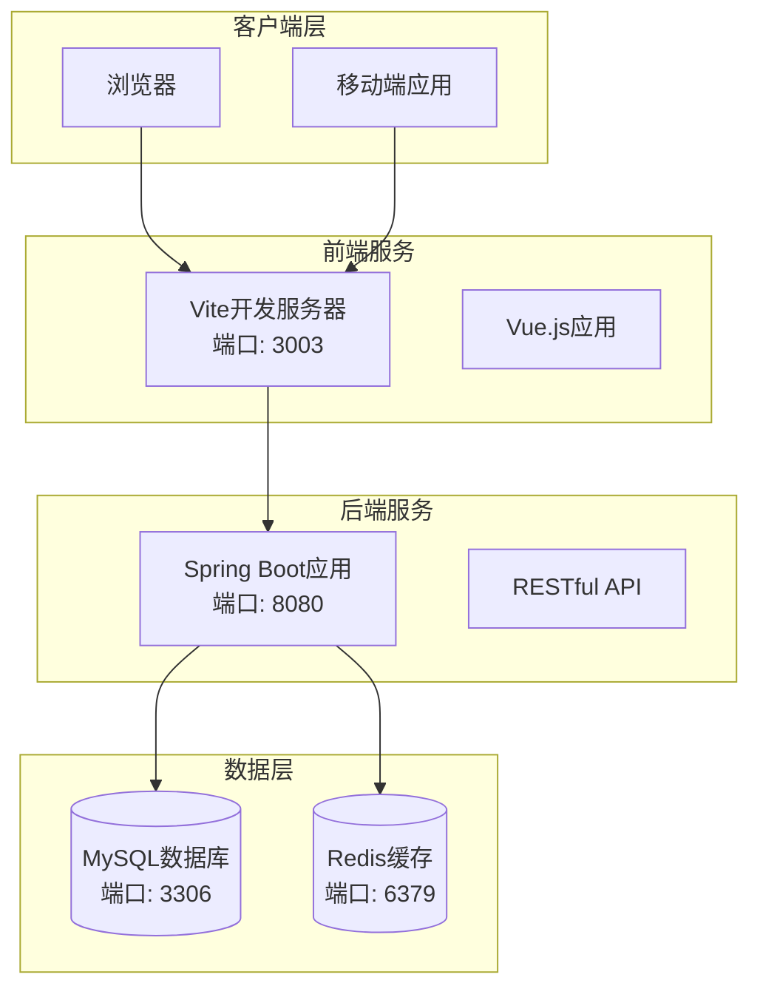
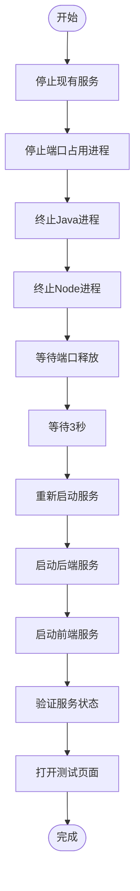
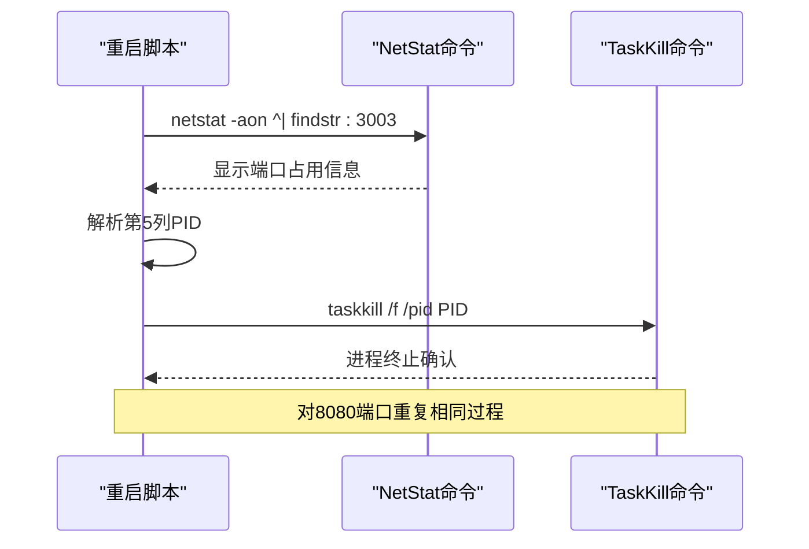
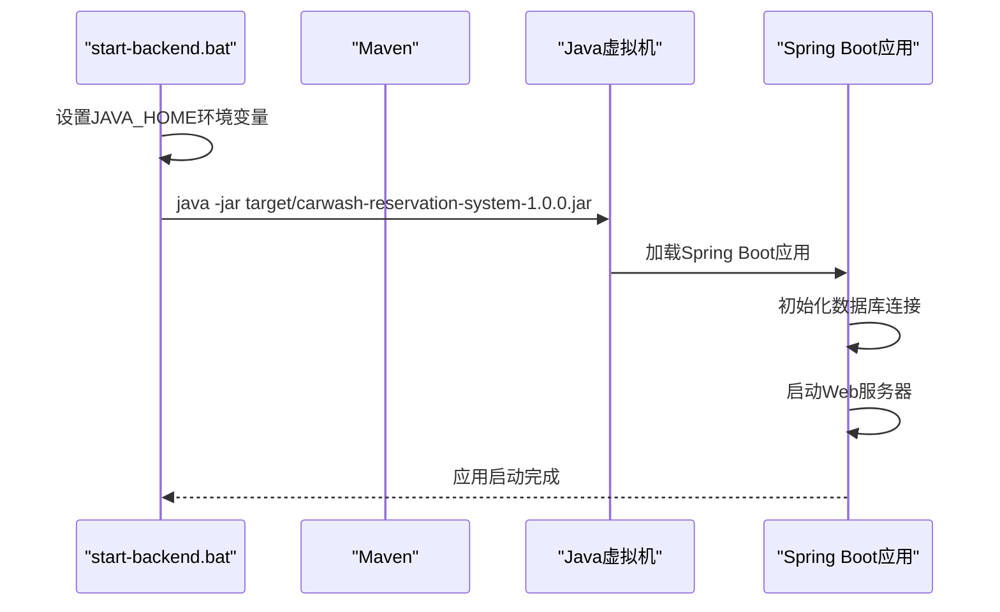
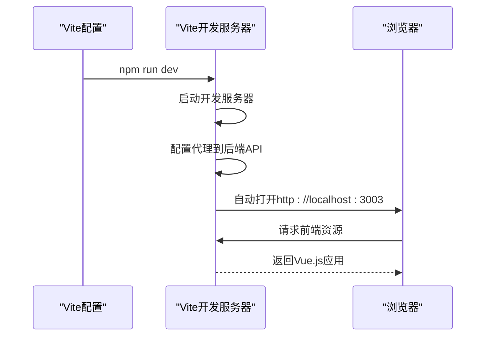
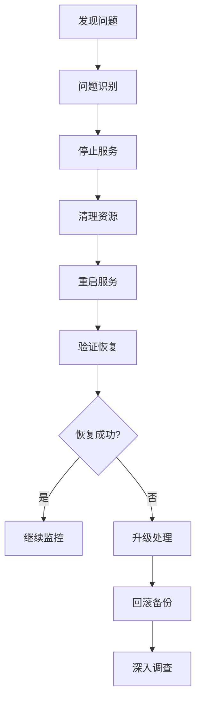

# 服务管理操作指南

<cite>
**本文档引用的文件**
- [restart-services.bat](file://restart-services.bat)
- [start-services.bat](file://start-services.bat)
- [backend/start-backend.bat](file://backend/start-backend.bat)
- [frontend/vite.config.js](file://frontend/vite.config.js)
- [backend/pom.xml](file://backend/pom.xml)
- [backend/src/main/resources/application.yml](file://backend/src/main/resources/application.yml)
- [frontend/package.json](file://frontend/package.json)
</cite>

## 目录
1. [简介](#简介)
2. [系统架构概览](#系统架构概览)
3. [服务管理脚本详解](#服务管理脚本详解)
4. [端口管理机制](#端口管理机制)
5. [服务启动与停止流程](#服务启动与停止流程)
6. [服务重启验证](#服务重启验证)
7. [最佳实践指南](#最佳实践指南)
8. [故障排除](#故障排除)
9. [总结](#总结)

## 简介

汽车洗车服务预约系统采用前后端分离架构，包含以下核心组件：
- **前端服务**：基于Vue.js的单页应用，运行在3003端口
- **后端服务**：基于Spring Boot的RESTful API，运行在8080端口
- **数据库**：MySQL数据库
- **缓存**：Redis内存数据库

本指南详细说明了服务管理操作，特别是`restart-services.bat`脚本的工作机制和使用方法。

## 系统架构概览



**图表来源**
- [frontend/vite.config.js](file://frontend/vite.config.js#L14-L22)
- [backend/src/main/resources/application.yml](file://backend/src/main/resources/application.yml#L1-L2)

**章节来源**
- [frontend/vite.config.js](file://frontend/vite.config.js#L1-L46)
- [backend/src/main/resources/application.yml](file://backend/src/main/resources/application.yml#L1-L92)

## 服务管理脚本详解

### restart-services.bat 脚本结构

`restart-services.bat`是一个综合性的服务管理脚本，包含三个主要阶段：



**图表来源**
- [restart-services.bat](file://restart-services.bat#L1-L62)

### 脚本执行阶段

#### 第一阶段：停止现有服务（1/3）

脚本首先检测并终止占用指定端口的进程：

1. **前端服务停止**（端口3003）
   - 使用`netstat -aon`命令查找占用3003端口的进程
   - 提取进程ID（第5列）
   - 使用`taskkill`命令强制终止进程

2. **后端服务停止**（端口8080）
   - 类似前端服务的处理方式
   - 处理Spring Boot应用占用的8080端口

3. **通用进程终止**
   - 强制终止所有Java进程（java.exe）
   - 强制终止所有Node.js进程（node.exe）

#### 第二阶段：等待端口释放（2/3）

```batch
echo [2/3] 等待端口释放...
timeout /t 3 >nul
echo ✅ 端口释放完成
```

此阶段使用Windows的`timeout`命令暂停执行3秒钟，确保操作系统完全释放被终止进程占用的端口。

#### 第三阶段：重新启动服务（3/3）

1. **后端服务启动**
   ```batch
   cd /d "%~dp0backend"
   start "后端服务" cmd /k "echo 重启后端服务... && mvn spring-boot:run"
   ```

2. **前端服务启动**
   ```batch
   cd /d "%~dp0frontend"
   start "前端服务" cmd /k "echo 重启前端服务... && npm run dev"
   ```

**章节来源**
- [restart-services.bat](file://restart-services.bat#L1-L62)

## 端口管理机制

### 端口分配策略

系统使用以下端口配置：

| 服务类型 | 端口号 | 用途 | 检测方式 |
|---------|--------|------|----------|
| 前端开发服务器 | 3003 | Vue.js开发服务器 | netstat -aon \| findstr :3003 |
| 后端API服务器 | 8080 | Spring Boot应用 | netstat -aon \| findstr :8080 |
| MySQL数据库 | 3306 | 数据存储 | sc query mysql |
| Redis缓存 | 6379 | 内存缓存 | netstat -ano \| findstr :6379 |

### 端口检测算法



**图表来源**
- [restart-services.bat](file://restart-services.bat#L10-L13)
- [restart-services.bat](file://restart-services.bat#L16-L19)

### 进程识别机制

脚本通过以下方式识别相关进程：

1. **Java进程识别**：终止所有java.exe进程
2. **Node.js进程识别**：终止所有node.exe进程
3. **特定端口进程识别**：通过netstat命令精确识别占用特定端口的进程

**章节来源**
- [restart-services.bat](file://restart-services.bat#L10-L23)

## 服务启动与停止流程

### 后端服务启动流程



**图表来源**
- [backend/start-backend.bat](file://backend/start-backend.bat#L1-L20)

### 前端服务启动流程



**图表来源**
- [frontend/vite.config.js](file://frontend/vite.config.js#L14-L22)
- [frontend/package.json](file://frontend/package.json#L7-L12)

### 服务启动顺序

系统采用以下启动顺序以确保依赖关系正确：

1. **数据库服务**：MySQL（由start-services.bat自动检测和启动）
2. **缓存服务**：Redis（由start-services.bat自动检测和启动）
3. **后端服务**：Spring Boot应用
4. **前端服务**：Vue.js开发服务器

**章节来源**
- [start-services.bat](file://start-services.bat#L1-L61)
- [backend/start-backend.bat](file://backend/start-backend.bat#L1-L20)

## 服务重启验证

### 自动测试页面功能

服务重启完成后，脚本会自动打开数据同步测试页面：

```batch
echo 🌐 正在打开测试页面...
start http://localhost:3003/data-sync-test
```

该页面提供以下功能：
- **实时状态监控**：显示前后端服务连接状态
- **数据同步测试**：验证前后端数据同步功能
- **诊断工具**：提供问题诊断和自动修复功能
- **性能测试**：测试系统响应时间和稳定性

### 服务状态验证步骤

1. **等待服务启动**（30-60秒）
   - 等待时间：首次启动可能需要更长时间下载依赖
   - 观察标准：各服务窗口显示"Started Application"或类似消息

2. **访问测试页面**
   - 主页面：http://localhost:3003
   - 数据同步测试：http://localhost:3003/data-sync-test
   - 后台管理：http://localhost:3003/admin
   - API文档：http://localhost:8080/swagger-ui/index.html

3. **检查控制台输出**
   - 后端服务：关注"Tomcat started on port(s)"消息
   - 前端服务：关注"ready in"消息

### 验证指标

| 验证项目 | 检查方法 | 预期结果 |
|---------|----------|----------|
| 端口监听 | netstat -an \| findstr :3003 | TCP 0.0.0.0:3003 LISTENING |
| 服务响应 | curl http://localhost:8080/api/debug/ping | pong |
| 前端加载 | 浏览器访问http://localhost:3003 | 页面正常加载 |
| 数据同步 | 访问数据同步测试页面 | 同步状态正常 |

**章节来源**
- [restart-services.bat](file://restart-services.bat#L44-L62)

## 最佳实践指南

### 服务管理最佳实践

#### 1. 服务重启时机
- **定期重启**：建议每周进行一次服务重启，清理内存泄漏
- **代码更新后**：每次部署新版本后必须重启服务
- **内存不足时**：观察到内存使用率持续上升时
- **端口冲突时**：遇到端口占用问题时

#### 2. 等待策略
```batch
REM 推荐的等待时间配置
timeout /t 30 /nobreak >nul  REM 后端服务启动等待
timeout /t 15 /nobreak >nul  REM 前端服务启动等待
```

#### 3. 服务监控
- **启动监控**：使用日志文件记录服务启动过程
- **健康检查**：定期检查服务响应状态
- **性能监控**：监控CPU和内存使用情况

#### 4. 错误处理
- **优雅降级**：当某个服务启动失败时，记录错误但继续启动其他服务
- **重试机制**：对于临时性故障，实现自动重试
- **故障隔离**：避免单个服务故障影响整个系统

### 开发环境管理

#### 1. 环境准备
```batch
REM 开发环境初始化脚本示例
@echo off
echo 准备开发环境...
call install-dependencies.bat
call start-redis-server.bat
call start-services.bat
```

#### 2. 依赖管理
- **Maven依赖**：定期更新pom.xml中的依赖版本
- **NPM包管理**：使用package-lock.json锁定依赖版本
- **数据库迁移**：使用Flyway或Liquibase管理数据库变更

#### 3. 配置管理
- **环境区分**：使用application-dev.yml、application-prod.yml等
- **敏感信息**：使用环境变量或加密配置文件
- **版本控制**：配置文件纳入版本控制，但排除敏感信息

### 生产环境部署

#### 1. 部署前检查
- **端口可用性**：确保目标端口未被占用
- **资源充足**：检查CPU、内存、磁盘空间
- **网络连通性**：验证数据库和缓存连接

#### 2. 部署流程
```batch
REM 生产环境部署脚本示例
@echo off
echo 开始生产环境部署...

REM 停止现有服务
call restart-services.bat

REM 部署新版本
copy /y new-version.jar production-version.jar

REM 启动服务
call start-services.bat
```

#### 3. 部署后验证
- **服务状态检查**：验证所有服务正常启动
- **功能测试**：执行关键业务流程测试
- **性能监控**：观察系统性能指标

## 故障排除

### 常见问题及解决方案

#### 1. 端口占用问题

**问题现象**：
- 服务启动失败，提示端口已被占用
- 端口释放延迟

**解决方案**：
```batch
REM 手动检查端口占用
netstat -aon | findstr :3003
netstat -aon | findstr :8080

REM 强制终止占用进程
taskkill /f /pid <进程ID>
```

#### 2. Java进程残留

**问题现象**：
- 服务重启后仍有旧进程运行
- 内存使用率持续上升

**解决方案**：
```batch
REM 检查Java进程
tasklist | findstr java.exe

REM 强制终止所有Java进程
taskkill /f /im java.exe
```

#### 3. 前端服务启动失败

**问题现象**：
- Vite开发服务器无法启动
- 端口3003被占用

**解决方案**：
```batch
REM 检查Node.js环境
node --version
npm --version

REM 清理npm缓存
npm cache clean --force

REM 重新安装依赖
cd frontend
npm install
```

#### 4. 后端服务启动失败

**问题现象**：
- Spring Boot应用启动失败
- 数据库连接异常

**解决方案**：
```batch
REM 检查Java环境
java -version

REM 检查数据库连接
REM 修改application.yml中的数据库配置
```

### 调试技巧

#### 1. 日志分析
- **后端日志**：查看Spring Boot应用的日志输出
- **前端日志**：检查浏览器开发者工具控制台
- **系统日志**：查看Windows事件查看器

#### 2. 性能分析
```batch
REM 使用Windows性能监视器
perfmon

REM 使用任务管理器监控资源使用
taskmgr
```

#### 3. 网络诊断
```batch
REM 检查网络连接
ping localhost
telnet localhost 3003
telnet localhost 8080

REM 检查防火墙设置
netsh advfirewall firewall show allprofiles
```

### 故障恢复流程



## 总结

`restart-services.bat`脚本是汽车洗车服务预约系统的核心服务管理工具，提供了完整的服务生命周期管理功能：

### 核心功能特性

1. **智能端口检测**：使用netstat命令精确识别占用特定端口的进程
2. **批量进程终止**：同时处理多个相关进程，确保彻底清理
3. **优雅等待机制**：通过timeout命令确保端口完全释放
4. **自动化服务重启**：自动启动前后端服务，减少人工干预
5. **智能验证功能**：自动打开测试页面，便于快速验证服务状态

### 技术优势

- **跨平台兼容**：基于Windows批处理脚本，易于部署和维护
- **资源清理彻底**：不仅终止特定端口进程，还清理相关Java和Node.js进程
- **用户体验友好**：提供清晰的进度指示和结果反馈
- **故障恢复能力强**：具备完善的错误处理和恢复机制

### 应用价值

该脚本显著提升了开发和运维效率：
- **开发效率**：简化了本地开发环境的服务管理
- **部署效率**：标准化了服务重启流程
- **维护效率**：提供了统一的问题诊断和修复入口
- **团队协作**：确保团队成员使用一致的服务管理方法

通过遵循本指南的最佳实践，可以确保系统的稳定运行和服务的高效管理，为用户提供优质的汽车洗车服务预约体验。